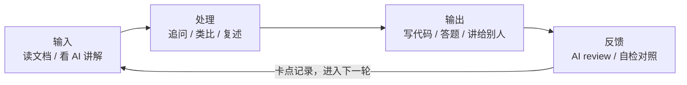

# LEARNING.md：AI 协助式学习方法论

> 面向「Java 企业级全栈学习路线」仓库的学习者。回答一个问题：**AI 时代，怎么学才专业、高效、且真正长在自己身上**。
> 仓库唯一的方法论文档（学习排期与节奏见 [docs/学习时间规划](docs/学习时间规划.md)）。

---

## 0. 先立一个认知：AI 是陪练，不是代驾

AI 出现后，学习的第一性变化是：**「获取答案」的成本趋近于零，「形成判断」的成本反而更贵**。

- 前端转 Java 的你，最不缺的是「查资料的能力」——缺的是**肌肉记忆、直觉、排错本能**，这些只能长在自己脑子里
- 所以 AI 协助式学习的核心原则只有一条：**凡是不经过你大脑的处理，都是无效学习**。AI 给的代码、答案、解释，只有被你「复述过、改写过、踩过坑」才属于你

一句话自检：**你在驾驶座，AI 在副驾**。它递地图、提醒路况，但方向盘在你手里——一旦你让 AI 代写作业、代做项目，学习就已经结束了。

---

## 1. 学习的科学基础：为什么「感觉学会了」不算数

认知科学有三个反复被验证的结论（术语首现即解释）：

| 原理 | 白话 | 对应到本仓库 |
|-|-|-|
| **主动回忆（Active Recall）** | 「读一遍」的留存率远低于「合上书自问一遍」——提取记忆这个动作本身在强化记忆 | 每讲的「本节自检」「思考题」「面试题」就是为此设计的：**先自己答，再对文档** |
| **间隔重复（Spaced Repetition）** | 遗忘是默认设置；在第 1/3/7/15 天各回顾一次，记忆曲线才被压平 | 学新阶段前，用 10 分钟让 AI 抽查上一阶段的核心概念（见 §3 出题官模式） |
| **刻意练习（Deliberate Practice）** | 在「刚好够不着但踮脚能碰到」的难度区练习，而不是重复已会的 | boot-app 实操永远比当前能力难半档：学完概念就落代码，落不动了说明该回头补 |

这三条是本文一切方法的地基——**AI 用得对，是把这三条原理的执行成本降到最低；用得错，是把它们全部绕过去**。

---

## 2. 高效学习的心法：输入—处理—输出循环

专业学习者的每天，是一个循环而不是一个列表：



三个关键配比（按学习阶段浮动）：

- **输入 ≤ 30%**：读文档、看讲解是最低效的环节，够用就停——「看懂了」是最廉价的错觉
- **处理 ≈ 30%**：这一环最容易被跳过，却是分水岭——追问、画图、跟已有知识连线（本仓库大量「前端对照」「类比」就是替你搭的桥）
- **输出 ≥ 40%**：写代码、答自检、给 AI 讲题。**输出会痛，痛说明在学习区**

> 判断一个学习日是否合格，只看输出：今天我写出了什么、讲清了什么、答对了什么。

---

## 3. AI 协助式学习的六种模式（核心）

同样是问 AI，姿势不同，效果差一个数量级。以下六种模式按学习场景选用——每种都给了可直接复制的**提问模板**。

### 模式一：追问式提问——四层提问法

新手问 AI 的最大问题不是问错，而是**问得太浅就停了**。一个概念要问透四层：

| 层次 | 问题形态 | 例（以「AQS」为例） |
|-|-|-|
| ① 是什么 | X 是什么？ | AQS 是什么，解决什么问题？ |
| ② 为什么 | 为什么这么设计？换个设计行不行？ | 为什么用队列而不是自旋？全自旋会怎样？ |
| ③ 什么时候用 | 什么场景该用，什么场景是过度设计？ | 我的项目里什么时候才真需要显式用锁？ |
| ④ 如果……会怎样 | 改变条件，预测结果再验证 | 如果等待线程不 park 会发生什么？（先自己预测！） |

**关键纪律**：第④层先自己写下预测，再让 AI 验证——**预测错的那一刻就是学习发生的那一刻**。

### 模式二：苏格拉底模式——要提示，不要答案

让 AI 扮演只提问不给答案的导师。提问模板：

> 我正在学「事务传播行为」（阶段二第 1 讲）。请你扮演苏格拉底式导师：**不要直接给我答案**，每次只给我一个提示性问题引导我自己推导。我从「REQUIRES_NEW 为什么要另开一条数据库连接」这个问题开始。

适用场景：概念已经读过一遍、需要深化理解时。**直接要答案适合第一遍扫盲，苏格拉底适合第二遍吃透**。

### 模式三：费曼模式——讲给 AI 听

**能讲清楚才是真的懂**。把刚学的内容讲给 AI，让它挑错：

> 我给你讲一下我对「三级缓存解决循环依赖」的理解（我尽量用大白话）：……（讲 200 字左右）。请你：①指出我理解里的事实错误；②指出我讲漏的关键点；③用一个我没提到的新角度考考我。

比「让 AI 复述知识点」强一个数量级——**AI 复述是它的输出，你复述是你的输出**。

### 模式四：出题官模式——把自检题用活

本仓库每讲末尾都有「本节自检 / 思考题 / 面试题」，它们不是读完看的，是**用来被考的**。提问模板：

> 把「阶段一第 7 讲并发编程」的本节自检 4 条 + 思考题 3 道打乱，一道一道考我：先出题 → 我作答（不许看文档）→ 你逐条评价我的答案并给标准对照 → 最后给出我的得分和薄弱点清单。

间隔重复也用它：隔 3 天 / 7 天让 AI 抽查旧阶段的核心概念（AI 会记住你上次的薄弱点，可要求重点抽查）。

### 模式五：Code Review 模式——自己写完再给 AI 看

boot-app 实操的正确打开方式：

```text
① 自己写（不许 AI 代写，卡住了看文档而不是看答案）
② 跑通后让 AI review：
   「请 review 我这段代码：按阶段二 03 讲的规范（统一响应体/异常处理/参数校验）+
    阿里规约（日志占位符/包装类型）挑问题，只指出问题不直接给修正代码」
③ 自己改，改完再让 AI 复查
```

**只指出问题、不给修正代码**——修正这步必须自己来，这是肌肉生长的部位。

### 模式六：卡点日志——被问倒的地方都是金矿

建一个私人笔记（仓库外或 `notes/` 目录），只记两类东西：

1. **AI 问倒我的问题**（答不上来的瞬间，精确定位了知识边界）
2. **我预测错的结果**（模式一第④层翻车的记录）

每周让 AI 基于卡点日志出一套「错题重考」。**卡点日志是专属你个人的、AI 无法替你生成的学习资产**。

---

## 4. 防坑：AI 依赖症的三个症状与解药

| 症状 | 表现 | 解药 |
|-|-|-|
| **复制粘贴手不停** | AI 给的代码直接贴进工程，跑通就过 | 每段 AI 代码**逐行复述一遍作用**（讲不出的行删掉重写）；关键代码合上对话自己重写一遍 |
| **问题越来越笼统** | 「帮我讲讲 Spring」「这章重点是什么」 | 用 §3 模式一的**具体到第④层**的问题；笼统问题=大脑在偷懒，AI 配合你的偷懒 |
| **自检全跳过** | 学完直接下一讲，自检/思考题从不合上文档答 | 强制流程：**下一讲开始前，上一讲自检必须闭卷过**（出题官模式代办） |

> 一个诚实的自问：**「如果现在断网一个月，我留下的东西是什么？」**——留下的那部分才是学到的。

---

## 5. 在本仓库的完整学习流

把 AI 协助式学习装进这个仓库的结构里，一条流走完：

```text
① 学：读 docs/ 当前讲（CLAUDE.md 已约束 AI 的讲解风格：术语首现即解释、类比双段式）
② 问：卡住的点用「四层提问法」问透（先预测再验证）
③ 落：按 10-实战产品蓝图 的映射表，把本讲技术点落进 boot-app（Code Review 模式）
④ 检：讲末的自检/面试题闭卷过一遍（出题官模式），错题进卡点日志
⑤ 复：进入下一阶段前，让 AI 抽查上一阶段（间隔重复）
```

各文件的角色：[docs/](docs/README.md) 是教材、[实战产品蓝图](docs/10-实战产品蓝图/README.md) 是练习册目录、[boot-app](boot-app/README.md) 是操场、[CLAUDE.md](CLAUDE.md) 是给 AI 立的规矩、[学习时间规划](docs/学习时间规划.md) 是日程表、本文是用法说明书。

---

## 6. 一个学习日的参考循环（约 2 小时）

| 时长 | 环节 | 用什么模式 |
|-|-|-|
| 30 min | 读当前讲 + 追问透 2 个核心概念 | 四层提问法 |
| 40 min | boot-app 落地本次技术点 | Code Review 模式 |
| 20 min | 闭卷过自检 + 思考题 | 出题官模式 |
| 15 min | 讲一个概念给 AI 听 | 费曼模式 |
| 15 min | 卡点日志更新 + 明日计划 | — |

循环比时长重要：**宁可每天 1 小时走完五环，不要一天 5 小时只输入**。

---

## 7. 最后：三条元原则

1. **输出为王**：一切学习的终点是「你能独立写出、讲出、答出」——AI 的每个回答都要过你的手才算数
2. **难度自调**：太顺=在舒适区（换个更难的问题）；太挫=退半步（让 AI 给提示而不是答案）——保持在「踮脚够得着」的位置
3. **诚实记账**：进度只认自检闭卷通过和 boot-app 落地完成，不认「看完了」
