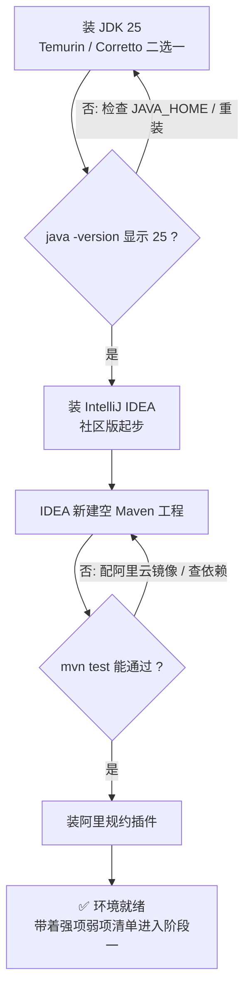

# 阶段零 · 小点 2：工程环境清单

> 所属：阶段零 起点盘点与补课
> 定位：补齐工程环境类的缺口。学 Java 不只是学语言——Maven / IDEA / 规约这些「工程侧基础设施」是你写第一行代码之前就要就位的，否则后面每个小点都会被工具问题打断。

## 快速入门

> 本节为「环境搭建前的速览」：先知道 Java 开发需要哪几件工具、它们分别干什么、你该先装什么。

### 本讲核心关键词速查

| 工具 | 干什么 | 类比前端 |
|-|-|-|
| JDK | Java 的「运行时 + 编译器」（同时有 `java` 和 `javac`） | 类比 Node.js 运行时 |
| Maven / Gradle | 下载依赖 + 编译打包 + 跑测试 | 类比 npm + vite / webpack |
| IntelliJ IDEA | Java 的 IDE（写代码、调试、重构都在里面） | 类比 VS Code（但 Java 支持更强） |
| Git / GitHub | 版本管理 + 代码托管 | 与前端完全一致 |
| 阿里巴巴规约插件 | 写代码时的「规范检查器」（阿里巴巴 Java 开发手册的落地） | 类比 ESLint |

### 本讲在解决什么问题

- **问题**：学 Java 不只是学语言——JDK、构建工具、IDE、规约这些「工程侧基础设施」不先就位，后面每个小点都会被工具问题打断（装错版本、依赖拉不下来、编译报错找不到 javac……）。
- **你要带走的一句话**：工具环境是「写第一行代码之前就要就位」的——JDK + IDEA + Maven 三件套到位，一套命令自检通过，后续学习才不会被打断；遇到环境问题先回查本清单。

### 最简可运行示例（照抄能跑）

装完三件套后，用这三条命令验收环境（Windows Git Bash 下 `$JAVA_HOME` 写作 `%JAVA_HOME%` + `echo`，或直接在 IDEA 终端里跑）：

```bash
java -version     # 期望: openjdk version "25" 2025-09-16
javac -version    # 期望: javac 25（编译器与运行时同版本）
echo $JAVA_HOME   # 确认指向 JDK 25（Maven/Gradle 依赖它）
```

> 三条都过了，环境就成功了 80%——剩下的是用 IDEA 建一个 Maven 工程跑通 `mvn test`（见正文第 5 节的完整验收流程图）。

### 环境搭建三件事（先做这些）

1. **装 JDK 25（LTS）**：推荐 Temurin 或 Corretto 发行版，装完用 `java -version` 确认是 25。
2. **装 IntelliJ IDEA**：社区版即可起步，用它新建一个空 Maven 工程跑通 Hello World。
3. **配 Maven**：能 `mvn compile` / `mvn test` 通过，依赖能下载下来。

### 常用约定 / 版本速查

- **版本基线**：本计划以 **Java 25 LTS** 为基线，别装成老版本的 8 / 11——新特性（record 是 16、switch 模式匹配与虚拟线程是 21、Scoped Values 是 25）需要对应 JDK 版本。
- **发行版二选一**：Temurin（Eclipse Adoptium）或 Corretto（Amazon），都是 OpenJDK 的生产级发行版——团队统一即可，不必纠结。
- **国内镜像约定**：Maven 中央仓库国内拉包慢，首次配置阿里云镜像（`~/.m2/settings.xml` 的 `<mirrors>`）。

## 精简大纲

1. JDK 发行版与版本节奏（Temurin / Corretto，LTS 17 → 21 → 25）
2. 构建工具：Maven 与 Gradle 二选一深入（依赖传递 / 多模块 / BOM）
3. IDE：IntelliJ IDEA 三个必练能力
4. 代码规约：阿里巴巴 Java 开发手册 + IDE 插件
5. 验收清单：一套命令跑通环境自检

## 学习内容详情

### 1. JDK 发行版

- **发行版选择**：Temurin（Eclipse Adoptium）或 Corretto（Amazon），两者都是 OpenJDK 的生产级发行版——选哪个都行，团队统一即可。
- **Oracle JDK 与 OpenJDK 的关系**：现代生态默认使用 OpenJDK 系发行版，Oracle JDK 的商业授权差异「知道有这回事」即可，不必纠结。
- **LTS 版本节奏**：LTS（Long-Term Support，长期支持版）17 → 21 → 25，且 **25 起 LTS 间隔缩短为 2 年**——本学习计划以 Java 25 LTS 为基线。

```bash
# 安装后验证：三件套都要能跑
java -version     # 期望: openjdk version "25" 2025-09-16
javac -version    # javac 25（编译器与运行时同版本）
echo $JAVA_HOME   # 确认 JAVA_HOME 指向 JDK 25（Maven/Gradle 依赖它）
```

### 2. 构建工具：二选一深入

**Maven（国内主流，本计划默认）与 Gradle（Android / 部分新项目）不要平均用力。** 重点掌握三件事：

> ⏸️ **短期可以不学（Gradle 深入）**：Gradle 只需「能读懂别人的 build.gradle」即可，Kotlin DSL、自定义插件、构建缓存调优等全部后置——国内 Java 后端绝大多数团队以 Maven 为主，短期投入产出比低。**何时回来学**：加入使用 Gradle 的团队时。**面试最低要求**：几乎不单独考察，能说一句「构建产物同为 jar，Gradle 更灵活、Maven 约定优于配置」即可。

#### 2.1 依赖传递与冲突排除

```xml
<!-- pom.xml: 依赖 A 传递依赖了旧版 guava, 与直接依赖冲突时 -->
<dependency>
    <groupId>com.example</groupId>
    <artifactId>library-a</artifactId>
    <version>1.0</version>
    <exclusions>
        <!-- 排掉 A 传递进来的旧 guava, 让我们声明的版本生效 -->
        <exclusion>
            <groupId>com.google.guava</groupId>
            <artifactId>guava</artifactId>
        </exclusion>
    </exclusions>
</dependency>
```

```bash
# 依赖树排查 —— 对应前端的 npm ls：谁把谁带进来的，一目了然
mvn dependency:tree | grep -i guava
# 输出示例:
# [INFO] +- com.example:library-a:jar:1.0:compile
# [INFO] |  \- (com.google.guava:guava:jar:32.0:compile - omitted for conflict with 33.2)
# 结论: library-a 想带 32.0, 被我们的 33.2 压掉了(最短路径优先)
```

> Maven 的版本仲裁是「**最短路径优先、先声明优先**」——与 npm 的「就近优先」体感接近，但没有 lockfile 的确定性，所以大项目用 BOM 锁版本（下一节）。

> **冲突排查三步速查**：
> ① `mvn dependency:tree -Dverbose` 定位冲突链（`-Dverbose` 才显示被仲裁掉的版本）
> ② 优先用 `<exclusions>` 精准排除
> ③ 全家桶依赖用 BOM / `dependencyManagement` 锁版本

#### 2.2 多模块聚合工程（对应前端 monorepo）

```text
shop-parent/            # 聚合工程(相当于 pnpm workspace 根)
├── pom.xml             # <modules> 聚合 + dependencyManagement 统一版本
├── shop-common/        # 公共工具/DTO
├── shop-user/          # 用户模块
└── shop-order/         # 订单模块(依赖 shop-common)
```

```xml
<!-- 父 pom: BOM（Bill of Materials, 版本清单）统一版本管理 ≈ 前端的 lockfile + workspace 协议 -->
<dependencyManagement>
    <dependencies>
        <!-- 子模块引 spring-boot 不用写版本号, 全由这里锁定 -->
        <dependency>
            <groupId>org.springframework.boot</groupId>
            <artifactId>spring-boot-dependencies</artifactId>
            <version>4.0.0</version>
            <type>pom</type>
            <scope>import</scope>
        </dependency>
    </dependencies>
</dependencyManagement>
```

- 前端工程化经验在这里完全可迁移：**概念一致（workspace / lockfile / 依赖作用域），工具重学**。

### 3. IDE：IntelliJ IDEA

三个必练能力，直接决定后面所有小点的学习效率：

| 能力 | 练什么 | 用在哪 |
|-|-|-|
| 调试器 | 断点 / 条件断点 / Evaluate 表达式 | 阶段一源码阅读、阶段二 Spring 生命周期单步跟 |
| 重构 | 安全重命名（Shift+F6）/ 提取方法 | 现代化旧代码、模拟 IDEA 的行为 |
| Spring 插件链 | Bean 跳转（Cmd+B 跨 XML/注解）/ 配置补全 | 阶段二起天天用 |

### 4. 代码规约：阿里巴巴 Java 开发手册

- 国内企业事实标准——从第一行代码就按规约写，避免后期改习惯。
- 装 IDE 插件（如 Alibaba Cloud AI Coding Assistant / 旧版 Alibaba Java Coding Guidelines）：实时告警「魔法值 / 未处理异常 / 线程池必须显式命名」等条款。
- 高频条款预埋（后面小点会反复出现）：**禁止用 `Executors` 快捷工厂建线程池**、**POJO 属性必须用包装类型**、**日志用占位符不用字符串拼接**。

### 5. 环境验收清单：一张流程图跑通自检

装完不等于装对了——按这张图从上到下走一遍，全绿才算环境就绪：



**对应到命令与操作**：

```bash
java -version                    # ① JDK 就绪（期望 25）
javac -version                   # ② 编译器就绪（与运行时同版本）
echo $JAVA_HOME                  # ③ 环境变量就绪（指向 JDK 25）
mvn -v                           # ④ Maven 就绪（会打印它用的 JAVA_HOME）
mvn test                         # ⑤ 在新建的 Maven 工程里跑通（依赖能拉下来）
```

## 坑点提醒

- `JAVA_HOME` 指向 JRE 而非 JDK → Maven 编译报「找不到 javac」；多版本 JDK 共存时优先检查这里。
- IDE 用 JDK 25、命令行 `mvn` 用旧 JDK →「IDE 里好好的，CI 上编译不过」的经典事故——两边都跑 `java -version` 对齐。
- Maven 中央仓库在国内拉包慢 → 配置阿里云镜像（`~/.m2/settings.xml` 的 `<mirrors>`），一次性投入十分钟，后面省无数等待。

## 本节自检

- [ ] 本机 `java -version` 输出 25，`JAVA_HOME` 正确
- [ ] 能解释 `mvn dependency:tree` 输出里 `omitted for conflict` 的含义，并知道用 `<exclusions>` 解决
- [ ] 能用 Maven 创建父 + 子模块的聚合工程，子模块引依赖不写版本号（BOM 生效）
- [ ] IDEA 完成过一次「断点 + 单步 + Evaluate」的完整调试操作
- [ ] IDE 已装规约插件，能看懂至少三条高频告警

## 本节配套思考题

1. npm 有 lockfile 保证跨机器构建一致，Maven 没有——大项目用什么机制逼近这种确定性？（提示：BOM + 父 POM + CI 上 `-Dmaven.repo.local` 缓存）
2. 为什么「IDE 里能跑、CI 上编译不过」大多和环境有关？列出你会检查的三个位置（JDK 版本 / JAVA_HOME / settings.xml 镜像与私服）。

## 常见面试题

### Q1：Maven 的依赖仲裁规则是什么？版本冲突怎么排查和解决？

**答**：标准结论：两条规则——① **最短路径优先**（依赖树上离根近的版本赢）；② 路径等长时**先声明优先**（pom 里写在前的赢）。排查与解决：`mvn dependency:tree -Dverbose`（`-Dverbose` 才会显示被仲裁掉的候选版本及 `omitted for conflict` 原因），定位后用 `<exclusions>` 精准排除传递进来的旧版本；全家桶类依赖（Spring Boot 等）用 BOM（`dependencyManagement` + `scope=import`）统一锁版本。原理层：Maven 解析依赖时构建整棵依赖树，按上述规则为每个 groupId:artifactId 选出唯一胜者版本——这决定了运行时的真实类路径。工程层：与 npm 的关键差异是没有 lockfile 的绝对确定性，所以工程实践上「BOM 锁版本 + CI 上全量构建验证」是逼近确定性的组合拳；更深层的事故形态是**同一 jar 不同版本共存导致的 `NoSuchMethodError`**——这类运行期错误只在调用了新版本才有的方法时才爆，编译期完全无感。

### Q2：JDK、JRE、JVM 三者是什么关系？为什么现在很少单独提 JRE 了？

**答**：标准结论：JVM 是「跑字节码的虚拟机」；JRE = JVM + 运行时类库（java.base 等模块），面向「只运行不开发」的场景；JDK = JRE + 编译器（javac）+ 开发工具（jdb、jstack、javap 等），面向开发。原理层：三者是包含关系 JDK ⊃ JRE ⊃ JVM。工程层（为什么 JRE 提得少了）：① JDK 11 起 Oracle 不再单独发布 JRE 安装包，瘦身需求改用 `jlink` 按模块组装自定义运行时；② 容器时代普遍直接用 JDK 镜像（或 jlink 产物），「服务器只装 JRE」的运维习惯在退化。加分点：JDK 9 模块化（Project Jigsaw）把 rt.jar 拆成了模块体系，这是 jlink 能做裁剪的前提——顺带能体现你对版本演进的理解。
