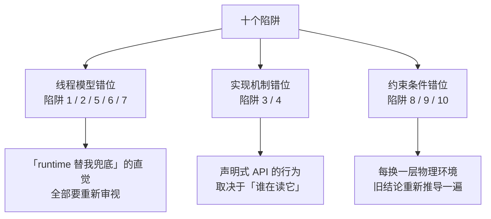

# 阶段零 · 小点 4：迁移心智陷阱清单

> 所属：阶段零 起点盘点与补课
> 定位：把散落在各阶段文档里的「直觉迁移陷阱」集中成一份**随时可回查的清单**。前端 / Node / Go 的经验能让你 90% 的概念秒懂，但剩下 10% 的实现差异会决定你写的是「能跑的代码」还是「正确的代码」——这份清单就是那 10% 的地图。**建议：每进入一个新阶段，回来快速过一遍与本阶段相关的陷阱条目。**

## 快速入门

> 本节为「陷阱速览」：先用一张表看清十个陷阱的全貌与危险等级，细节留在正文逐条展开。

### 本讲核心关键词速查

| # | 陷阱 | 你的旧直觉 | Java 的真相 | 危险等级 |
|-|-|-|-|-|
| 1 | Promise → CompletableFuture | 「then 回调几乎立即执行」 | 执行线程取决于完成时机；不指定执行器会饿死公共池 | 🔴 会咬人 |
| 2 | goroutine → 平台线程 | 「开线程很便宜」 | 平台线程约 1MB 栈的 OS 重资源；虚拟线程才是对标物 | 🔴 会咬人 |
| 3 | EventEmitter → Spring 事件 | 「emit 就是异步广播」 | 默认同步执行且长在事务上，行为语义完全不同 | 🔴 会咬人 |
| 4 | TS 装饰器 → Java 注解 | 「装饰器本身有逻辑」 | 注解只是元数据标记，行为由代理/处理器实现 → 自调用失效 | 🔴 会咬人 |
| 5 | 事件循环 → 多线程 | 「单线程无竞态，全局随便用」 | 共享堆 + 真并行，竞态是常态而非例外 | 🔴 会咬人 |
| 6 | volatile ≠ 锁 | 「加 volatile 就线程安全了」 | 只保证可见性与有序性，不保证原子性 | 🔴 会咬人 |
| 7 | ThreadLocal + 线程池 | 「每个请求天然独立」 | 线程复用会串号：数据污染比泄漏更致命 | 🔴 会咬人 |
| 8 | 响应式优先 | 「异步/响应式 = 高性能」 | 虚拟线程时代，同步写法反而是默认正解 | 🟡 选型盲区 |
| 9 | UUID 主键 | 「随手 UUID 当 ID」 | InnoDB 下页分裂 + 索引膨胀，主键要趋势递增 | 🟡 选型盲区 |
| 10 | 强一致执念 | 「数据必须时刻一致」 | CAP 的 P 不可选；业务多用 BASE 最终一致 | 🟡 选型盲区 |

### 本讲在解决什么问题

- **问题**：你的旧经验让 90% 的概念秒懂，但剩下 10% 的实现差异，会写出「看似对、跑起来错」的代码——而且编译不报错、单测大概率也测不到，只在并发、事务、线上流量下才炸。比如「事件循环里随便用全局变量」到了 Java 是多线程竞态，「emit 完就返回」到了 Spring 是同步调用。
- **你要带走的一句话**：迁移学习最大的风险不是「学不会」，而是「以为自己会」——旧心智的 90% 是加速器，10% 是地雷；这份清单就是排雷图。

### 最简可运行示例（照抄能跑）

十个陷阱里最有代表性的一对——Promise 的「then 几乎立即执行」vs CompletableFuture 的「执行线程取决于完成时机」：

```java
// ❌ 直觉写法：不指定执行器，IO 阻塞会饿死公共池
CompletableFuture.supplyAsync(() -> httpClient.call());

// ✅ 显式指定专用执行器（虚拟线程执行器对 IO 任务是现代默认）
try (var pool = Executors.newVirtualThreadPerTaskExecutor()) {
    CompletableFuture.supplyAsync(() -> httpClient.call(), pool);
}
```

> 同样的直觉，在 JS 里是对的，在 Java 里是雷。本清单全部 10 条都是同一个模式：**旧直觉 → Java 的真相 → 正确姿势**——先认识雷，再排雷。

### 使用这份清单的正确姿势

1. **不是背，是对照**：写代码/做设计时，遇到对应场景回来查一条。
2. **每条三问**：我的旧直觉是什么？为什么在 Java 里不成立？正确姿势是什么？
3. **阶段联动**：陷阱 1/2/6/7 在阶段一展开，陷阱 3/4 在阶段二展开，陷阱 8/9/10 在阶段三、四、六展开——学到对应阶段时回看，理解会立体一层。

### 约定与等级说明

- **🔴 会咬人**：写错了编译能过、单测大概率测不到，一上线就咬人（并发与框架语义层）。
- **🟡 选型盲区**：不是语法错，是选型错——方向偏了，代码写得越漂亮偏得越远（架构与数据层）。
- 每条陷阱固定四段式：**旧直觉 → Java 的真相 → 正确姿势（含代码）→ 出处**（指向展开该陷阱的阶段文档）。

## 精简大纲

1. 会直接咬人的七个陷阱（并发与框架语义层）
2. 选型层面的三个盲区（架构与数据层）
3. 陷阱背后的统一规律：三组「心智错位」

## 学习内容详情

### 陷阱一：把 Promise 的微任务语义套到 CompletableFuture 🔴

**旧直觉**：JS 的 `.then` 回调进微任务队列，「下一个 tick」几乎立即执行，且永远在事件循环线程上——线程心智可以完全交给 runtime。

**Java 的真相**：
- `thenApply` 的回调**在哪个线程执行取决于完成时机**：完成前注册 → 由完成任务的执行器线程跑；完成后注册 → 由注册回调的调用方线程当场跑。依赖「下一个 tick」的代码会偶发跑在错误线程上。
- 更狠的是：`supplyAsync` **不显式指定执行器就走公共 `ForkJoinPool.commonPool()`**——它的设计初衷是 CPU 密集型分治任务，塞进 IO 阻塞任务会把它饿死，全应用的并行流与未指定执行器的异步任务全部排队。

**正确姿势**：

```java
// ❌ 直觉写法：不指定执行器，IO 阻塞会饿死公共池
CompletableFuture.supplyAsync(() -> httpClient.call());

// ✅ 显式指定专用执行器（虚拟线程执行器对 IO 任务是现代默认）
try (var pool = Executors.newVirtualThreadPerTaskExecutor()) {
    CompletableFuture.supplyAsync(() -> httpClient.call(), pool);
}
```

**出处**：阶段一第 7 讲（并发编程）、第 11 讲（现有知识映射）。

### 陷阱二：把 goroutine 的成本模型套到平台线程 🔴

**旧直觉**：Go 里 `go func()` 开一万个毫无压力，线程（的等价物）是廉价的。

**Java 的真相**：
- `new Thread(...)` 每个都是 OS 级重资源：约 1MB 栈 + 内核调度实体，创建销毁昂贵、数量有硬上限——所以才必须池化。
- 虚拟线程（JDK 21+ GA）才是 goroutine 的对标物：由 JVM 调度、阻塞不占 OS 线程、廉价到可以「一请求一线程」。
- 连带心智更新：**虚拟线程不要池化**——用平台线程的「复用」心智去管理它是反模式，它是一次性资源。

**正确姿势**：IO 密集用 `Executors.newVirtualThreadPerTaskExecutor()`；CPU 密集才用固定大小平台线程池（大小 ≈ 核数）；「开线程很贵」的警惕只保留给平台线程。

**出处**：阶段一第 7 讲、阶段零小点 1。

### 陷阱三：把 EventEmitter 的语义套到 Spring 事件 🔴

**旧直觉**：`bus.emit("order.paid", order)` 是进程内广播——发布者发完就走，订阅者各自处理，互不拖累。

**Java 的真相**：`ApplicationEventPublisher.publishEvent` 默认语义是**同步方法调用**——监听器在发布者线程里当场执行、共享同一事务；一个监听器抛异常，发布方跟着失败。这不是「性能差异」，是**语义差异**：
- 要异步：`@Async` + `@EnableAsync`（还要给异步配置专用执行器）。
- 要「事务提交成功才触发」：`@TransactionalEventListener(AFTER_COMMIT)`——回滚了就不发短信。这是 EventEmitter 体系里**不存在**的维度：前端没有事务，后端的事件天然长在事务上。

**正确姿势**：用 Spring 事件前先问两个问题——「监听器要不要参与发布者的事务？」「监听器失败要不要影响主流程？」答案决定用 `@EventListener`（同步、同事务）还是 `@TransactionalEventListener`（事务边界后）还是 `@Async`（异步）。

**出处**：阶段一第 11 讲、阶段二第 1 讲。

### 陷阱四：把 TS 装饰器当 Java 注解 🔴

**旧直觉**：TS 装饰器（配合 reflect-metadata）声明即生效，`@Injectable()` 挂上就是可注入。

**Java 的真相**：注解（Annotation）**本身只是元数据标记，没有任何逻辑**——行为全部来自「读注解的框架代码」：Spring 的 AOP 会为 Bean 生成**代理对象**，把 `@Transactional` 的逻辑织入代理层。由此推导出著名的失效场景：

```java
public void methodA() {
    this.methodB();   // ❌ this 是原始对象, 调用绕过代理 → @Transactional 形同虚设
}

@Transactional
public void methodB() { /* 写库 */ }
```

同理失效的还有：非 `public` 方法（代理默认只拦截 public）、异常被 try-catch 吞掉、受检异常默认不回滚、事务方法内开新线程执行数据库操作（事务上下文绑定在 ThreadLocal）。

**正确姿势**：记住推导心法——`@Transactional` = 代理对象上的环绕切面 + ThreadLocal 绑定的事务上下文。**任何让「调用没经过代理」或「执行换了线程」的写法都会让它失效**。内部调用需要事务时，首选拆类。

**出处**：阶段二第 1 讲（五大失效场景）、阶段一第 3 讲（动态代理）。

### 陷阱五：用单线程心智对待共享状态 🔴

**旧直觉**：Node 事件循环单线程，全局变量、单例缓存、模块级状态随便用——反正同一时刻只有一段代码在跑。

**Java 的真相**：多线程真并行，**竞态是常态而非例外**。你写的每个有状态 Bean（singleton）都天然被几十个线程并发访问。经典翻车现场：

```java
private int count = 0;                    // singleton Bean 的字段
public void hit() { count++; }            // 两个请求并发调用 → 丢更新
```

**正确姿势**：把「这段代码会不会被并发访问？」当成后端默认要过的一道安检——共享可变状态要么消灭（不可变对象 / record），要么显式同步（`AtomicInteger` / `ConcurrentHashMap` / 锁），要么线程私有（`ThreadLocal`，配合陷阱七的清理纪律）。Go 经验（「别以共享内存来通信」）在这里有迁移价值，但 Java 的 JMM 是显式规范，需要系统学（阶段一第 5 讲）。

**出处**：阶段一第 5、7 讲。

### 陷阱六：以为 volatile 能当锁用 🔴

**旧直觉**（Go/前端共同盲区）：「加个 volatile / atomic 关键字就线程安全了」——很多从没深究过语义的开发者的模糊认知。

**Java 的真相**：`volatile` 恰好做两件事、坚决不做第三件：
- ✅ **可见性**：写立即对其他线程可见（不走 CPU 缓存）
- ✅ **有序性**：禁止指令重排跨过它
- ❌ **原子性**：`volatile int i; i++` 照样丢更新——「读→改→写」三步之间随时被插队

```java
volatile int counter = 0;
// 两个线程各执行 10000 次 counter++, 结果几乎必然 < 20000
```

**正确姿势**：状态标志位（一写多读）用 volatile；计数/累加用 `AtomicInteger`（CAS）或 `LongAdder`（高并发计数）；复合状态用锁或不可变替换。配套高危知识点：DCL 单例少了 volatile 会偶发拿到半成品对象——编译不报错、单测抓不到、上线偶发 NPE。

**出处**：阶段一第 5 讲（JMM）。

### 陷阱七：ThreadLocal 用完不还，请求之间串号 🔴

**旧直觉**：前端每个请求天然独立，从来没有「上一个请求的数据串到下一个请求」这种事。

**Java 的真相**：线程池的线程是**复用的**——Tomcat 工作线程处理完请求 A 并不销毁，转头就处理请求 B。`ThreadLocal` 变量挂在**线程**上而不是请求上：

```java
// 请求 A: CTX.set(currentUser) ... 异常路径没走 remove()
// 同一线程处理请求 B: CTX.get() → 拿到的是 A 的用户!
```

后果不只是内存泄漏（value 被线程强引用吊着），更致命的是**数据污染**：MDC 的 TraceID 串进下一个请求的日志、用户上下文串号——这类事故排查起来极难，因为它「偶发且无法稳定复现」。

**正确姿势**：铁律 `try { ... } finally { threadLocal.remove(); }`；新代码优先用 Java 25 的 `ScopedValue`（不可变 + 作用域结束自动清理，从机制上消灭「忘 remove」）。

**出处**：阶段一第 5 讲。

### 陷阱八：以为「响应式 = 高性能 = 必须学」🟡

**旧直觉**：前端社区推崇异步非阻塞（RxJS、async/await 全家桶），看到 WebFlux/Reactor 自然觉得「这是更先进的方向，早晚要学」。

**Java 的真相**：虚拟线程 GA 之后，**绝大多数业务系统用 WebMVC + 虚拟线程就能获得高并发能力**——同步写法、阻塞不占 OS 线程、代码可读性与可调试性完胜响应式流。WebFlux 的真正阵地收窄为：API 网关、SSE 流式推送、需要精细背压控制的管道型场景。且响应式要求**全链路**响应式（R2DBC / WebClient / Reactive Redis），混进一个同步 ORM 就全盘失效。

**正确姿势**：判断口诀——先问「要不要背压 / 流式管道」，再问「团队是否接受全链路响应式纪律」，两个都不是，留在 WebMVC。把 WebFlux 当特定场景的专项工具，不是「更先进的默认选择」。同理：Node 时代「回调别阻塞事件循环」的纪律，在虚拟线程上恰恰**不需要**——同步阻塞反而是正解。

**出处**：阶段二第 4 讲（WebFlux 与响应式选型）。

### 陷阱九：随手拿 UUID 当数据库主键 🟡

**旧直觉**：前端生成 ID 首选 UUID（`crypto.randomUUID()`），全局唯一、不依赖服务端、天然安全。

**Java 后端的真相**：MySQL InnoDB 是**聚簇索引**——数据按主键物理组织，UUID 的随机性意味着每次插入都落在一个随机页，导致**页分裂 + 缓存命中率低 + 索引体积膨胀**（UUID 36 字符 vs bigint 8 字节）。写入量大的表上，这是实打实的性能税。

**正确姿势**：主键用**趋势递增**的整数类 ID——雪花算法（Snowflake：时间戳 + 机器 ID + 序列号，本地生成不依赖中心服务）或号段模式（Leaf）。UUID 留给「对外暴露的业务标识」（且建议用有序变体 UUIDv7）。雪花算法的坑是**时钟回拨**（NTP 校时可能导致重复 ID）——知道这个边界即可。

**出处**：阶段四第 3 讲（分布式核心理论）、阶段三第 1 讲。

### 陷阱十：迷信强一致，忽视最终一致 🟡

**旧直觉**：数据必须时刻一致，不一致就是 bug——单机单库时代的朴素直觉。

**故事：你给朋友微信转账 100 元。** 你的银行（A 行）扣款成功了，朋友的银行（B 行）却迟迟没显示到账。如果你是用户，你能容忍「钱已扣、没到账」这个窗口持续多久？几秒？几分钟？还是「第二天一早对账发现已补齐」也能接受？——**「不一致窗口能容忍多久」，就是分布式一致性设计的全部问题**。

**分布式下的真相**：A 行和 B 行是两个独立系统，中间隔着网络。CAP 里的 **P（网络分区）不是可选项**——网线会断、交换机会重启、光缆会被挖断，分区是物理世界的既定事实。所以真实取舍只在 **C 与 A 之间**，且只在分区发生的那一刻。绝大多数互联网业务选 A + 最终一致（BASE），用**补偿机制**保证「账最终能平」。上面转账故事里，四个高频方案各自长这样：

| 方案 | 在转账故事里长什么样 | 一句话原理 |
|-|-|-|
| 本地消息表 | A 行扣款时，在本地库写一张「待发通知表」；后台任务不停把表里的记录发给 B 行，B 行确认成功才标记已发 | 「扣款」和「记录该通知」进同一个本地事务，重试有据可依 |
| 事务消息 | A 行扣款事务提交后，消息队列（MQ）保证「通知 B 行」的消息一定送达 | 消息可靠性由 MQ 承担 |
| Saga | B 行入账失败后，A 行执行「冲正」，把 100 元退回你的账户 | 一长串操作，失败就一步步倒着补偿 |
| 对账兜底 | 每天凌晨两家银行对账，发现 A 扣了 B 没到，自动补 | 所有方案之外的最后一层保险 |

**正确姿势**：跨服务的一致性问题，先问「不一致窗口能容忍多久」——秒级容忍就有大量轻量方案（本地消息表比 Seata 低一个量级的复杂度）；只有金融扣款这类场景才值得上强一致工具。别用「强一致」当默认审美，它是昂贵的奢侈品。

**出处**：阶段四第 3 讲、阶段三第 2 讲。

### 统一规律：三组「心智错位」

十个陷阱背后其实是三组结构性的心智错位——理解了组，就能预判没列进清单的新陷阱：



1. **线程模型错位**（陷阱 1/2/5/6/7）：Node 把并发藏进 runtime，Java 把并发暴露给你——所有「runtime 替你兜底」的直觉都要重新审视。生活版：你以为公司只有一个话务员接电话（事件循环），实际每个客服一个工位、同时接一百路电话（多线程）——你「东西随手放工位上」的习惯，必然串台。
2. **实现机制错位**（陷阱 3/4）：TS 装饰器与 Java 注解「形似神不似」——声明式 API 的行为取决于「谁在读它」，Spring 的答案是代理，于是「调用路径是否经过代理」成为一切框架语义的分水岭。生活版：你以为贴个标签（注解）标签自己会干活，实际标签只是标记，干活的是「读标签的人」（框架代理）——标签贴的位置没人读到（自调用），就没人干活。
3. **约束条件错位**（陷阱 8/9/10）：单机直觉在分布式/存储场景失效——网络会断（CAP）、磁盘按页组织（聚簇索引）、物理资源有限（同步阻塞的代价）。生活版：单机像在自家客厅（东西随手放都找得到），分布式像跨城搬家（包裹可能丢在路上、搬家公司也会放假），存储像仓库（货架按编码顺序摆放，乱贴编号翻找就慢）。每换一层物理环境，旧结论都要重新推导一遍。

## 坑点提醒

- **这份清单是排雷图不是免修卡**：每条陷阱的完整原理都在对应阶段展开，清单只保证你「踩之前知道这里有雷」。
- **别矫枉过正**：看到 CompletableFuture 就恐慌、看到共享变量就上锁——理解边界后按场景选型，而不是把每个陷阱当成禁令。
- **清单会过期**：随 JDK 版本演进（如 JEP 491 后 synchronized 块不再 pin 虚拟线程），个别结论会更新——以对应阶段的正文为准。

## 本节自检

- [ ] 能脱稿说出十大陷阱中至少七个的「旧直觉 → Java 真相 → 正确姿势」
- [ ] 能解释三组「心智错位」分别对应哪几个陷阱，并各举一个生活化例子
- [ ] 写 CompletableFuture 时会条件反射地指定执行器；写 ThreadLocal 时会条件反射地 finally remove
- [ ] 能向一个前端背景的同事讲清楚 `@Transactional` 自调用为什么失效（讲不清 = 陷阱四还没过）

## 本节配套思考题

1. 把十个陷阱按「编译期能发现 / 单测能发现 / 只能线上发现」分三类——分布情况说明迁移陷阱的什么本质？（提示：能在哪一层拦截，决定了防御手段的成本）
2. 陷阱四（注解与代理）和陷阱三（事件与事务）其实是同一个底层机制的两种表现——这个机制是什么？还能推出哪些还没列出的失效场景？
3. 你过去在前端/Node 项目里有没有一次「直觉迁移成功」的经历？和这十个陷阱对照，成功的条件是什么？

## 常见面试题

### Q1：为什么说 CAP 里的 P 不是可选项？强一致和最终一致怎么选？

**答**：标准结论：P（网络分区）是分布式系统的物理前提——网线会断、交换机会重启、光缆会被挖断，「分区会发生」不是你能选的，你能选的只是分区发生那一刻保 C 还是保 A。绝大多数互联网业务选 A + 最终一致（BASE），用本地消息表、事务消息、Saga、对账兜底等补偿机制保证收敛。原理层：CAP 只在「分区发生的那一刻」才有取舍意义；分区解除后系统通过补偿机制恢复一致，所以「最终一致」的本质是「分区窗口期允许临时不一致 + 窗口结束保证收敛」。工程层：选型看「不一致窗口能容忍多久」——秒级容忍选轻量方案（本地消息表比分布式事务框架低一个量级的复杂度），只有金融扣款这类场景才值得上 Seata 等强一致工具；且无论选哪个方案，都要配**对账兜底**做最后一道防线。

### Q2：本地消息表和事务消息（MQ）有什么区别？怎么选？

**答**：标准结论：两者思路同源——「先保证本地事务成功，再保证消息一定发出」，区别在**消息的可靠性由谁承担**。本地消息表：业务表和待发消息表写在**同一个本地事务**里，后台任务扫描待发表、发送消息、确认后标记——可靠性靠「自己的数据库 + 定时重试」，实现简单、不新增基础设施。事务消息：由消息中间件（如 RocketMQ）提供，本地事务提交后 MQ 保证消息至少送达一次——可靠性由 MQ 承担，但对中间件有依赖。原理层：核心思想都是把「业务操作」和「记录该做的事」放进同一个事务，让「忘记做」成为不可能；差异只是「记录与重试的载体」是本地表还是 MQ。工程层：已有 MQ 且团队能驾驭其复杂度选事务消息；想少依赖一个组件选本地消息表——两者都要配对账兜底；另外本地消息表的消息发送要保证**幂等**（下游重试收到重复消息不能重复入账）。

### Q3：WebFlux（响应式）比 Spring MVC 更先进吗？该什么时候用？

**答**：标准结论：虚拟线程 GA 之后，**绝大多数业务系统用 WebMVC + 虚拟线程就能获得高并发能力**——同步写法、阻塞不占 OS 线程、可读性可调试性完胜，WebFlux 的阵地收窄为 API 网关、SSE 流式推送、需要精细背压控制的管道型场景。原理层：响应式解决的是「线程等 IO 被浪费」的问题，虚拟线程用简单得多的方式解决了同一个问题；且响应式要求全链路响应式（R2DBC / WebClient / Reactive Redis），混进一个同步 ORM 就全盘失效。工程层：选型先问「要不要背压 / 流式管道」，再问「团队是否接受全链路响应式纪律」，两个都不是就留在 WebMVC——把 WebFlux 当特定场景的专项工具，而不是「更先进的默认选择」。
