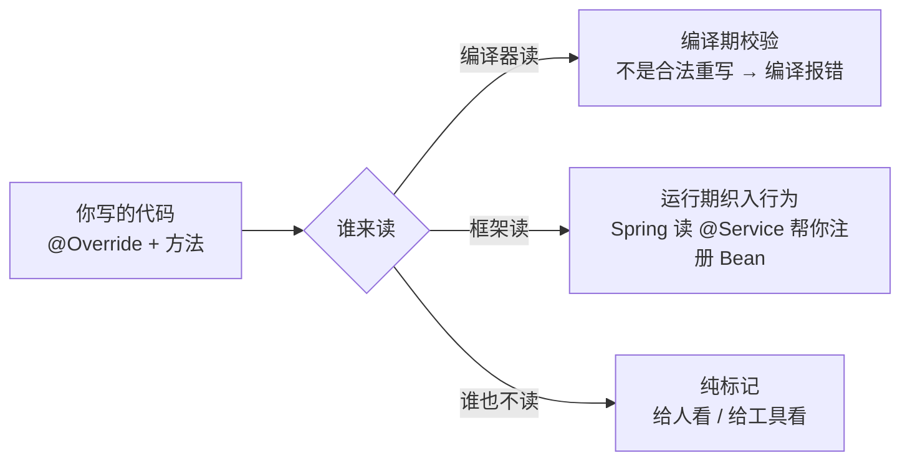
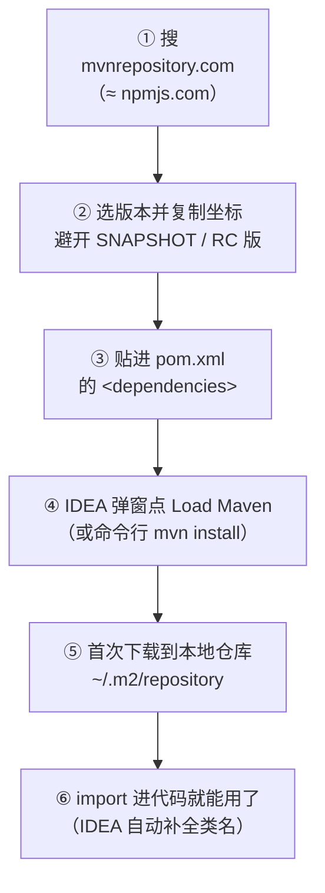

# 阶段零 · 小点 5：起步基础知识

> 所属：阶段零 起点盘点与补课
> 定位：补齐「写第一行业务代码之前」的工程词汇缺口。装好了环境（小点 2），但在打开 IDE 看到一个 Java 项目时，`@注解`、`pom.xml`、`package`、GAV 坐标这些词还是会让人发懵——本小点把「注解是什么、项目长什么样、配置文件谁管什么、依赖怎么找怎么装」一次性讲清楚。它们不属于任何深入主题，却是后面每个阶段的「识字课」。

## 快速入门

> 本节为「工程词汇速览」：先认识本小点的几个高频词——每个都是「见到能反应过来是什么」即可，深入展开都有后续小点接手。

### 本讲核心关键词速查

| 概念 | 一句话大白话 | 和你已有的对应 |
|-|-|-|
| 注解（Annotation） | 贴在代码上的「便利贴」标签——本身不含逻辑，给编译器或框架看的元数据 | 形似 TS 装饰器（神不似，见坑点） |
| `@Override` | JDK 内置注解：让编译器校验「这确实是重写父类方法」 | TS 没有，TS 靠类型系统天然校验 |
| `pom.xml` | 项目的「说明书」：叫什么、依赖谁、怎么打包 | ≈ `package.json` |
| 坐标（GAV） | 一个依赖在 Maven 世界的唯一身份证：groupId + artifactId + version | ≈ npm 的 `包名@版本` |
| 中央仓库 | 全世界发布 Java 依赖的公共仓库（Maven Central） | ≈ npmjs.com |
| 本地仓库（`~/.m2/repository`） | 下载过的 jar 存在你电脑上的全局缓存，所有项目共享 | ≈ **全局共享的 node_modules**（重要差异见正文） |
| `package` | Java 的「命名空间」：类的全名前缀，与目录结构一一对应 | ≈ ES Module 的文件路径 |
| `main` 方法 | 程序入口：`public static void main(String[] args)` | ≈ `package.json` 的 scripts / Node 入口文件 |
| `src/main/resources` | 放配置文件、静态资源的地方（打进 jar 包） | ≈ 前端的 `public/` + 根目录配置 |

### 本讲在解决什么问题

- **问题**：阶段一开篇的每段代码都贴着 `@FunctionalInterface`、每个示例都跑在 `src/main/java` 下、每个练习都要「往 pom 里加个依赖」——这些工程词汇没人正式讲过，全靠边看边猜，猜错的成本很高（比如把配置放错目录、把注解当成装饰器来理解）。
- **你要带走的一句话**：**注解是给人看读卡器读的标签，pom 是项目的 package.json，依赖按坐标装进全局缓存**——识字课一次上完，后面看到这三样东西不再停顿。

### 最简可运行示例（照抄能跑）

一个最小的 Maven 项目长这样（用 IDEA 新建 Maven 工程后自动生成的就是这套骨架）：

```text
demo/                                 # 项目根（≈ 前端项目根）
├── pom.xml                           # 项目说明书：名字、依赖、打包方式（≈ package.json）
└── src/
    ├── main/
    │   ├── java/                     # 业务源码放这里（≈ src/）
    │   │   └── com/example/demo/     # package 对应的目录层级（反向域名）
    │   │       └── App.java          # 含 main 方法的入口类
    │   └── resources/                # 配置与资源（≈ public/ + 根目录配置文件）
    └── test/
        └── java/                     # 测试代码（≈ tests/）
```

```java
package com.example.demo;      // 声明「我属于哪个命名空间」——必须与目录一致

public class App {             // 一个 .java 文件一个 public 类，文件名必须与类名相同

    @Deprecated               // 注解示例：标记「此方法已过时，别再用」
    static void oldWay() { }

    public static void main(String[] args) {   // 程序入口：JVM 从这里启动
        System.out.println("hello");            // ≈ console.log
        oldWay();               // IDE 会在这一行划删除线提示你——注解已经生效了
    }
}
```

> 代码备注：
> - `package`：类的「姓」。全限定名 = `com.example.demo.App`——就像文件路径，只是反着写域名。
> - `public class App` 必须**与文件名 `App.java` 完全同名**（Java 硬规定，前端没有这条）。
> - `main` 方法签名是固定咒语：`public static void main(String[] args)`——`static` 表示不用 new 对象就能直接调（细节阶段一）。先照抄，阶段一第 1 讲逐词拆解。

### 关键概念说明

| 概念 | 长什么样 | 谁来读它 |
|-|-|-|
| 注解 | `@Override`、`@Test(timeout = 100)`（可带参数） | 编译器（编译期）或框架（运行期） |
| pom.xml | `<dependency>...坐标...</dependency>` 列表 | Maven / IDEA |
| application.yml | `server.port: 8080` 之类的键值配置 | 你的程序自己（Spring Boot 读取） |

### 常用约定 / 命名提示

- **坐标命名惯例**：`groupId` 是组织的反向域名（`com.example`、`org.springframework`）、`artifactId` 是项目名（小写中划线）、`version` 里 `1.0-SNAPSHOT` 表示「开发中的不稳定版」——**业务代码别依赖别人的 SNAPSHOT**（它今天和明天内容可能不同）。
- **目录是铁律不是建议**：Maven 约定 `src/main/java` 放源码、`src/test/java` 放测试、`resources` 放配置——不按约定放，Maven 找不到你的代码（这就是 02 讲说的「约定优于配置」）。
- **一个类一个文件**：文件名 = public 类名，这是编译器强制的。

## 精简大纲

1. 注解：贴在代码上的便利贴（语法、常见注解速查、工作原理）
2. 一个 Java 项目长什么样：目录、包与入口
3. 配置文件如何管理：谁管什么（pom / settings / application.yml / logback）
4. 依赖如何管理：找、加、装（坐标、中央仓库、本地缓存、scope）

## 学习内容详情

### 1. 注解：贴在代码上的「便利贴」

**注解（Annotation）** 是写在类 / 方法 / 字段 / 参数前面的 `@名字` 标签。**它本身不包含任何逻辑**——只是一段元数据，行为来自「读它的人」：



**生活版**：注解像贴在快递箱上的**面单**——面单本身不会让包裹移动半步，让包裹动的是「读面单的物流系统」。`@Override` 的面单写给编译器（校验重写）、`@Transactional` 的面单写给 Spring（框架替你开事务）。

**语法上怎么读**（四条就够）：

```java
@Override                                    // ① 无参数：光秃秃一个名字
@SuppressWarnings("unchecked")              // ② 带参数：括号里传值（可多个：key = value）
@Transactional(rollbackFor = Exception.class)// ③ 参数是类、字符串等具体值
@Repeated-use 场景见各框架文档               // ④ 能贴在类/方法/字段/参数前（哪个位置合法由注解自己声明）
```

> 注解的定义上还能再贴注解（叫**元注解**，如 `@Target` 声明「能贴在哪」、`@Retention` 声明「保留到什么时候」）——自定义注解是阶段一第 3 讲的内容，现阶段你只需要**会读会用**。

**常见注解速查（认脸阶段，见到知道是什么即可）**：

| 注解 | 出自 | 一句话作用 | 展开位置 |
|-|-|-|-|
| `@Override` | JDK | 校验「确实重写了父类/接口方法」——写错方法名直接编译报错 | 阶段一第 1 讲 |
| `@Deprecated` | JDK | 标记已过时，调用处 IDE 划删除线 | 本文 |
| `@SuppressWarnings("unchecked")` | JDK | 压制指定类型的编译警告（没解决警告，只是不吵了） | 阶段一第 3 讲 |
| `@FunctionalInterface` | JDK | 校验「接口只有一个抽象方法」（能接 Lambda） | 阶段一第 1 讲 |
| `@Test` / `@BeforeEach` | JUnit 5 | 标记测试方法 / 每个用例前执行 | 阶段二第 5 讲 |
| `@Service` / `@Autowired` / `@RestController` | Spring | 声明 Bean / 自动装配 / REST 控制器 | 阶段二第 1、3 讲 |
| `@Transactional` | Spring | 声明式事务（框架代理帮你开/提交/回滚） | 阶段二第 1 讲 |
| `@Data` / `@Getter` | Lombok | 编译期自动生成 getter/equals 等样板代码 | 阶段二第 2 讲 |
| `@Entity` / `@Table` | JPA | 类映射数据库表 | 阶段三第 2 讲 |

> 表格里的 Spring/JPA 系注解**现在一个都不用记**——列在这里是因为你翻任何 Java 教程第一页就会撞见它们，先「对上脸」：它们都是注解，行为由各自的框架赋予。这也是 Java 与前端生态最大的体感差异之一：**Java 世界的框架魔法几乎全部通过「注解 + 读了注解的框架」实现**，而 NestJS 的同款魔法靠「装饰器 + reflect-metadata」——同构但机制不同源（见[迁移心智陷阱清单](04-迁移心智陷阱清单.md)陷阱四）。

### 2. 一个 Java 项目长什么样：目录、包与入口

**`package`（包）**：Java 的命名空间，用来避免「大家都写了个 `User` 类」的撞名。规则是**反向域名 + 目录一一对应**：

```text
com.example.demo.App
│    │      │   └── 类名
│    │      └────── 项目名
│    └───────────── 组织域名反写
└────────────────── 顶级域

对应目录：src/main/java/com/example/demo/App.java
```

**生活版**：包名就是「地址倒着写」——住在「中国·北京·朝阳区·xx 小区」，写包名时先写 `cn.bj.chaoyang.xiaoqu`。倒着写的好处：全球域名唯一，天然不撞名。

**`import`**：用别的包里的类要先打招呼——对照你熟悉的 ES Module：

```java
import java.util.List;                 // ≈ import { List } from '...'：引入单个类
import java.util.*;                     // 通配引入（不推荐，可读性差）
import static java.lang.Math.max;       // 静态引入：直接调 max(1,2) 不用 Math.max
```

> 与前端的关键差异：Java 的 `import` **只是「告诉编译器去哪找类」的引用声明**，不会触发模块加载副作用；也没有「默认导出/命名导出」之分——一个文件一个 public 类，引入靠完整类名。

**程序入口 `main` 方法**：`public static void main(String[] args)` 是 JVM 认定的启动点（签名固定，一个词都不能改）。普通 Java 程序这样跑；Spring Boot 应用的入口也只是「先启动内嵌容器再监听请求」的加强版 main（阶段二第 2 讲）。

### 3. 配置文件如何管理：谁管什么

Java 项目的配置文件不是「一个大杂烩」，而是**按职责分家**——每个文件只管一件事：

| 文件 | 在哪 | 管什么 | 前端对应物 |
|-|-|-|-|
| `pom.xml` | 项目根 | 构建三件事：依赖是谁、插件用什么、怎么打包 | ≈ `package.json`（依赖 + scripts） |
| `settings.xml` | `~/.m2/`（用户级） | Maven 工具自身：镜像源、私服地址、部署账号 | ≈ `.npmrc`（registry 镜像就配在这） |
| `application.yml`（或 `.properties`） | `src/main/resources/` | **应用运行时**配置：端口、数据库地址、日志级别 | ≈ `.env` |
| `logback-spring.xml` | `src/main/resources/` | 日志输出格式与滚动策略 | ≈ 自定义的日志配置 |

**一条最重要的分界线：构建时（compile/build） vs 运行时（runtime）**


- **pom.xml 在构建时读**：改依赖、改打包方式要重新构建——就像改 `package.json` 要重装依赖。
- **application.yml 在运行时读**：改端口、换数据库地址**不需要重新编译打包**，重启进程即可——就像改 `.env` 不用重新 build 前端（但要注意：它打进 jar 包里，改的还是 jar 内默认值，生产环境更常用环境变量覆盖，阶段二第 2 讲展开优先级）。
- `settings.xml` 的国内镜像配置在[工程环境清单](02-工程环境清单.md)已给过操作步骤，本节只强调它的定位：**管 Maven 自己，不管你的项目**。

> 为什么要分这么多文件？前端的配置其实也分层（`package.json` 管构建、`.env` 管运行时），只是 JS 生态习惯把很多事揉进一个 `package.json`。Java 的分法更「一个萝卜一个坑」——记住表格的四行，看到新配置文件先问「它管构建还是管运行」。

### 4. 依赖如何管理：找、加、装

**一个依赖的唯一身份证是坐标（GAV）**：

```xml
<dependency>
    <groupId>com.google.guava</groupId>      <!-- 组织：Google 的反域名 -->
    <artifactId>guava</artifactId>            <!-- 项目名 -->
    <version>33.2.1-jre</version>             <!-- 版本 -->
</dependency>
```

**找依赖 → 加依赖 → 装依赖**的完整流程：



**本地仓库 `~/.m2/repository`——与 node_modules 的关键差异**：

| | node_modules | Maven 本地仓库 |
|-|-|-|
| 作用域 | **每个项目一份**（node_modules 在项目内） | **整个用户一份**（全局缓存，所有项目共享） |
| 磁盘占用 | 每个项目重复装 | 同一个 jar 全机器只存一份 |
| 「删除重装」 | `rm -rf node_modules && npm i` | 删 `~/.m2/repository` 下对应目录（或整个目录）重新下载 |
| 依赖冲突解决 | npm 就近优先 + lockfile | Maven 最短路径优先（[02 讲](02-工程环境清单.md)展开） |

**scope（依赖作用域）**——控制依赖「在什么阶段可用」，认三个：

- `compile`（默认）：编译、测试、运行全程可用。
- `test`：只有测试代码能用（JUnit 就是这个 scope——不打进生产包）。
- `provided`：编译需要、运行时由环境提供（如 Lombok——编译完生成完代码就没用了，不打进包）。

> **一句话总结依赖心智**：Java 的依赖装在「全局仓库 + 每个项目一份清单（pom）」——磁盘省了，但「装没装」不看你 node_modules 而看 `~/.m2`；同一台机器上，两个项目引用同一坐标永远拿到同一份 jar，版本差异靠 pom 里的坐标区分。

## 坑点提醒

- **别把注解当装饰器用**：TS 装饰器「声明即生效」，Java 注解只是标签——行为取决于「有没有框架在读它」。`@Transactional` 贴在没有 Spring 管理的类上什么都不会发生（自调用失效等问题见[迁移心智陷阱清单](04-迁移心智陷阱清单.md)陷阱四）。
- **`@SuppressWarnings` 是消音器不是灭火器**：压制了警告不等于解决了问题——`("unchecked")` 压掉的泛型警告背后可能有真实的类型安全问题。先理解警告，确属噪音再压。
- **SNAPSHOT 依赖别进业务**：`1.0-SNAPSHOT` 是「随时会被作者覆盖的开发版」——今天能跑明天爆，且无法复现。
- **配置文件放错目录等于没放**：`application.yml` 不在 `src/main/resources` 根下，Spring Boot 就读不到——找配置问题先查文件位置。
- **本地仓库被污染的玄学编译错**：下载中断会产生残缺的 `.lastUpdated` 文件，之后一直解析失败——删掉 `~/.m2/repository` 里出问题的依赖目录重新下载是标准急救动作。

## 本节自检

- [ ] 能说出「注解本身不含逻辑」并解释行为来自谁（读注解的编译器/框架）
- [ ] 能默写 4 个 JDK 内置注解的作用（@Override/@Deprecated/@SuppressWarnings/@FunctionalInterface）
- [ ] 能画出 Maven 标准目录树（src/main/java、src/main/resources、src/test/java）并说出各放什么
- [ ] 能说出 pom.xml 与 application.yml 各管什么、什么时候读（构建时 vs 运行时）
- [ ] 知道坐标三件套（GAV）是什么、依赖装到哪（~/.m2/repository，全局共享）
- [ ] 独立完成一次「找一个依赖并加入项目」：mvnrepository 搜索 → 复制坐标 → 贴 pom → IDEA 刷新 → 代码 import

## 本节配套思考题

1. 前端的 `package.json` 一个文件管了依赖、脚本、项目元数据三件事——Java 把这些拆给了 pom.xml / settings.xml / application.yml。两种设计各自的调试排查路径有什么差异？（提示：改错文件类型时，谁来告诉你「不认识这个配置」？）
2. node_modules 每个项目一份、Maven 本地仓库全局一份——为什么 Java 敢这么设计而 npm 不敢？（提示：npm 包可以带 install 脚本、Java 的 jar 只是纯 class 文件的压缩包；再想想「删了 node_modules 重装」是前端常见操作，为什么 Maven 侧很少需要？）
3. `@Deprecated` 标记过时方法后，调用处只是划删除线、程序照常能跑——为什么 JDK 不直接让编译失败？（提示：生态兼容性——全世界的存量代码一夜之间编译不过会怎样？）

## 常见面试题

### Q1：注解（Annotation）和注释（Comment）有什么区别？

**答**：标准结论：**注释是给人看的，注解是给程序看的**。注释（`//`、`/* */`）在编译后完全丢弃，唯一读者是维护代码的人；注解（`@名字`）是编译进字节码的元数据，读者是编译器（编译期校验，如 `@Override`）或框架（运行期读取并织入行为，如 Spring 的 `@Transactional`）。原理层：注解本身不含任何逻辑——它的行为由「读它的程序」赋予，这就是为什么同一个注解在不同的框架里可以有完全不同的效果；注解定义上还有元注解（`@Target` 声明可贴位置、`@Retention` 声明保留到编译期还是运行期），细节阶段一第 3 讲展开。工程层：生产排查「注解不生效」类问题（如 `@Transactional` 失效），方向永远是「检查调用路径有没有经过读注解的代理」——这源自注解「只是标签」的本质。

### Q2：Maven 的坐标（GAV）是什么？一个依赖从声明到可用经历了什么过程？

**答**：标准结论：坐标 = groupId（组织反域名）+ artifactId（项目名）+ version，是依赖在 Maven 世界的唯一身份证。过程：pom.xml 声明坐标 → 构建时 Maven 按坐标先查本地仓库（`~/.m2/repository`）→ 没有则从远程仓库（中央仓库或镜像）下载到本地 → 编译时加入类路径。原理层：与 npm 的关键差异是**存储模型**——node_modules 每项目一份，Maven 本地仓库是**用户级全局共享**：同一坐标全机器只有一份 jar，多项目复用，磁盘省但「装没装」要看全局目录。工程层：版本选型避开 SNAPSHOT（开发中的不稳定版，随时被覆盖、无法复现构建）；依赖解析的传递与冲突（最短路径优先、先声明优先）是排查 `NoSuchMethodError` 类事故的基础（阶段零 02 讲与阶段二第 2 讲展开）。

### Q3：Java 项目里 pom.xml、settings.xml、application.yml 分别管什么？

**答**：标准结论：三者按职责分家——`pom.xml`（项目根）管构建：依赖清单、插件、打包方式，构建时读，对应前端的 `package.json`；`settings.xml`（`~/.m2/`）管 Maven 工具自身：镜像源、私服、认证，对应前端的 `.npmrc`；`application.yml`（`src/main/resources/`）管应用运行时：端口、数据源、日志级别，运行时读，对应 `.env`。原理层：这条分界线是**构建时（build time）与运行时（runtime）**——pom 的变更需要重新构建，yml 的变更重启即生效；且 yml 打进 jar 内作为默认值，生产环境常用环境变量/启动参数覆盖（优先级体系阶段二第 2 讲展开）。工程层：定位一个配置问题时先问「它属于构建还是运行」——改了 yml 重新 build 是浪费时间，改了 pom 不重新构建是没生效；日志格式类问题则去看 `logback-spring.xml`。
