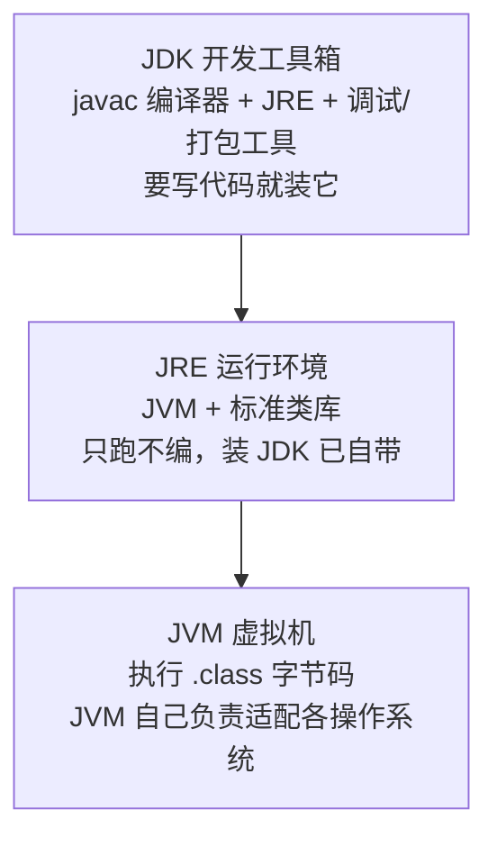
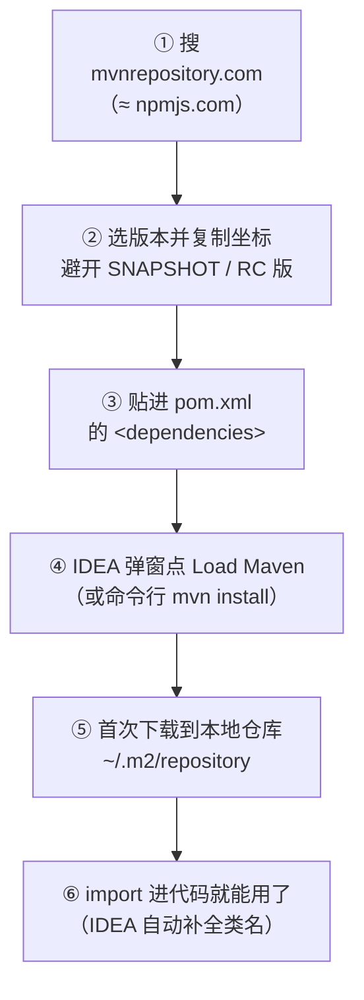
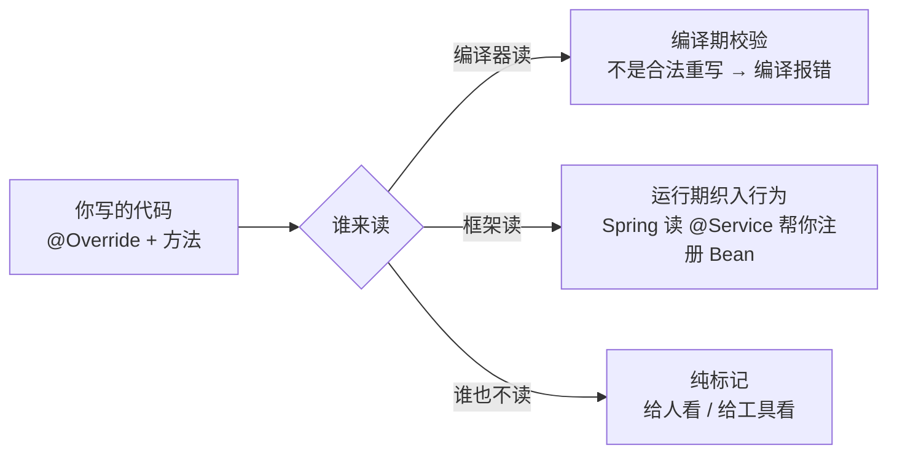

# 阶段零 · 小点 5：起步基础知识

> 所属：阶段零 起点盘点与补课
> 定位：补齐「写第一行业务代码之前」的工程词汇缺口。装好了环境（小点 2），但在打开 IDE 看到一个 Java 项目时，`@注解`、`pom.xml`、`package`、GAV 坐标这些词还是会让人发懵——本小点把「注解是什么、项目长什么样、配置文件谁管什么、依赖怎么找怎么装」一次性讲清楚。它们不属于任何深入主题，却是后面每个阶段的「识字课」。

## 快速入门

> 本节为「工程词汇速览」：先认识本小点的几个高频词——每个都是「见到能反应过来是什么」即可，深入展开都有后续小点接手。

### 本讲核心关键词速查

| 概念 | 一句话大白话 | 和你已有的对应 |
|-|-|-|
| JDK | 开发工具箱：javac 编译器 + JRE + 调试/打包工具（**要写代码就装它**） | ≈ Node.js（node + npm 全家桶） |
| JRE | 最小运行环境：JVM + 标准类库（只能跑，不能编） | ≈ 只有 node、没有编译/打包工具 |
| JVM | 执行 `.class` 字节码的虚拟机，负责适配各操作系统 | ≈ V8 引擎 |
| 字节码（`.class`） | javac 把 `.java` 编译出的中间产物，与平台无关 | ≈ tsc 编译出的 `.js` |
| 基本类型 vs 包装类型 | `int`（值、不能 null）vs `Integer`（对象、可空、有方法） | ≈ `number`——但 JS 没有「值/对象」之分 |
| String | 字符串对象（**不可变**，不是基本类型） | ≈ `string`——但比内容要用 `equals()`，不是 `==` |
| 集合 List / Map | 动态数组 / 键值对（都是**接口**，实现类是 `ArrayList` / `HashMap`） | ≈ `Array` / `Map` |
| Lambda | `x -> x * 2` 匿名函数 | ≈ 箭头函数 |
| 泛型 `<T>` | 类型参数，编译期检查、运行期擦除 | ≈ TS 泛型（但只活在编译期） |
| record | 一行定义一个不可变数据类 | ≈ TS 精简 class |
| `package` | Java 的「命名空间」：类的全名前缀，与目录结构一一对应 | ≈ ES Module 的文件路径 |
| `main` 方法 | 程序入口：`public static void main(String[] args)` | ≈ `package.json` 的 scripts / Node 入口文件 |
| `src/main/resources` | 放配置文件、静态资源的地方（打进 jar 包） | ≈ 前端的 `public/` + 根目录配置 |
| `target/` | Maven 构建产物目录：`.class` 与打好的 jar 都在这 | ≈ `dist/`（不进 Git） |
| jar 包 | 多个 `.class` 打成的压缩包，Java 世界的「分发单元」 | ≈ npm 包发布的 `.tgz` |
| classpath | 告诉 JVM / Maven「上哪找类或 jar」的搜索路径 | ≈ Node 找 `node_modules` 的解析路径 |
| `pom.xml` | 项目的「说明书」：叫什么、依赖谁、怎么打包 | ≈ `package.json` |
| 坐标（GAV） | 一个依赖在 Maven 世界的唯一身份证：groupId + artifactId + version | ≈ npm 的 `包名@版本` |
| 中央仓库 | 全世界发布 Java 依赖的公共仓库（Maven Central） | ≈ npmjs.com |
| 本地仓库（`~/.m2/repository`） | 下载过的 jar 存在你电脑上的全局缓存，所有项目共享 | ≈ **全局共享的 node_modules**（重要差异见正文） |
| 注解（Annotation） | 贴在代码上的「便利贴」标签——本身不含逻辑，给编译器或框架看的元数据 | 形似 TS 装饰器（神不似，见坑点） |
| `@Override` | JDK 内置注解：让编译器校验「这确实是重写父类方法」 | TS 没有，TS 靠类型系统天然校验 |
| Bean | Spring 容器**替你创建并管理**的对象——从「你 new」变成「容器递」 | ≈ NestJS 的 provider（`@Injectable` 服务） |

### 本讲在解决什么问题

- **问题**：阶段一开篇的每段代码都贴着 `@FunctionalInterface`、每个示例都跑在 `src/main/java` 下、每个练习都要「往 pom 里加个依赖」——这些工程词汇没人正式讲过，全靠边看边猜，猜错的成本很高（比如把配置放错目录、把注解当成装饰器来理解）。再加上「JDK / JRE / JVM 到底谁是谁、代码是怎么跑到屏幕上的」——02 讲装环境时只点到「JDK 是什么」，三者关系与编译运行链路也在这里一次补全。而打开 IDE 落笔写代码时立刻撞见的数据类型、`==` 与 `equals`、String 不可变这些**语法差异**，也按「识字」标准在本小点过一遍——系统语法课在阶段一各讲展开。
- **你要带走的一句话**：**JDK 是工具箱、JRE 是运行环境、JVM 是虚拟机，代码经 javac 编译成字节码再交给 JVM；pom 是项目的 package.json，依赖按坐标装进全局缓存；注解是给程序读的标签，Bean 是 Spring 替你管的对象**——识字课一次上完，后面看到这些不再停顿。

### 最简可运行示例（照抄能跑）

一个最小的 Maven 项目长这样（用 IDEA 新建 Maven 工程后自动生成的就是这套骨架）：

```text
demo/                                 # 项目根（≈ 前端项目根）
├── pom.xml                           # 项目说明书：名字、依赖、打包方式（≈ package.json）
├── target/                           # 构建后生成：.class 与打好的 jar（≈ dist/，不进 Git）
└── src/
    ├── main/
    │   ├── java/                     # 业务源码放这里（≈ src/）
    │   │   └── com/example/demo/     # package 对应的目录层级（反向域名）
    │   │       └── App.java          # 含 main 方法的入口类
    │   └── resources/                # 配置与资源（≈ public/ + 根目录配置文件）
    └── test/
        └── java/                     # 测试代码（≈ tests/）
```

```java
package com.example.demo;      // 声明「我属于哪个命名空间」——必须与目录一致

public class App {             // 一个 .java 文件一个 public 类，文件名必须与类名相同

    @Deprecated               // 注解示例：标记「此方法已过时，别再用」
    static void oldWay() { }

    public static void main(String[] args) {   // 程序入口：JVM 从这里启动
        System.out.println("hello");            // ≈ console.log
        oldWay();               // IDE 会在这一行划删除线提示你——注解已经生效了
    }
}
```

> 代码备注：
> - `package`：类的「姓」。全限定名 = `com.example.demo.App`——就像文件路径，只是反着写域名。
> - `public class App` 必须**与文件名 `App.java` 完全同名**（Java 硬规定，前端没有这条）。
> - `main` 方法签名是固定咒语：`public static void main(String[] args)`——`static` 表示不用 new 对象就能直接调（细节阶段一）。先照抄，阶段一第 1 讲逐词拆解。

### 关键概念说明

| 概念 | 长什么样 | 谁来读它 |
|-|-|-|
| 注解 | `@Override`、`@Test(timeout = 100)`（可带参数） | 编译器（编译期）或框架（运行期） |
| Bean | `@Service` 类、`@Bean` 方法产生的对象 | Spring 容器（创建/保管/分发） |
| pom.xml | `<dependency>...坐标...</dependency>` 列表 | Maven / IDEA |
| application.yml | `server.port: 8080` 之类的键值配置 | 你的程序自己（Spring Boot 读取） |
| JDK / JRE / JVM | 层层包含：JDK ⊃ JRE ⊃ JVM | javac（编译）/ `java` 命令（启动 JVM）/ JVM（执行字节码） |
| `.class` / jar | 编译产物 / 打包产物 | JVM（运行）/ Maven、IDEA（下载、缓存、打进应用） |

### 常用约定 / 命名提示

- **坐标命名惯例**：`groupId` 是组织的反向域名（`com.example`、`org.springframework`）、`artifactId` 是项目名（小写中划线）、`version` 里 `1.0-SNAPSHOT` 表示「开发中的不稳定版」——**业务代码别依赖别人的 SNAPSHOT**（它今天和明天内容可能不同）。
- **目录是铁律不是建议**：Maven 约定 `src/main/java` 放源码、`src/test/java` 放测试、`resources` 放配置——不按约定放，Maven 找不到你的代码（这就是 02 讲说的「约定优于配置」）。
- **一个类一个文件**：文件名 = public 类名，这是编译器强制的。
- **命名铁律**：类名大驼峰（`UserService`）、方法/变量小驼峰（`getUserById`）、常量全大写（`MAX_SIZE`）、包名全小写——这正是 02 讲阿里规约的第一条，IDE 有规范插件帮你盯。
- **`target/` 别提交**：构建产物目录由 Maven 生成（≈ `dist/`），`.gitignore` 里已排除——「改了代码跑的还是旧行为」先查「有没有重新 build」。
- **Javadoc 注释**：`/** ... */` 写文档注释（≈ JSDoc），IDEA 悬停提示与生成 API 文档都读它，公共 API 记得写。

## 精简大纲

1. JDK / JRE / JVM：Java 程序是怎么跑起来的（编译运行链路、一次编译到处运行）
2. Java 语法速览：代码长什么样（数据类型、面向对象、与前端差异最大的几个点、现代语法速览）
3. 一个 Java 项目长什么样：目录、包与入口（含 target/、jar、classpath、Javadoc）
4. 依赖如何管理：找、加、装（坐标、中央仓库、本地缓存、scope）
5. 配置文件如何管理：谁管什么（pom / settings / application.yml / logback）
6. 注解：贴在代码上的便利贴（语法、常见注解速查、工作原理）
7. Bean：Spring 世界的「零件」（是什么、容器怎么管、生命周期简版）

## 学习内容详情
### 1. JDK / JRE / JVM：Java 程序是怎么跑起来的

学 Java 的第一件事不是写代码，而是先知道**代码是怎么跑起来的**——你写的 Java 代码到屏幕输出，中间隔着一条**编译 → 运行**的链路，链路上站着三个经常一起出现的缩写：**JDK、JRE、JVM**。

**一句话版**：**JDK 是「开发工具箱」，JRE 是「运行环境」，JVM 是「虚拟机」；三者层层包含——JDK 里装着 JRE，JRE 里装着 JVM。**



**程序从源码到输出的完整链路**：


**生活版**：写 Java 像拍电影——你写剧本（`.java` 源码），用剪辑机（javac）压成统一母带（`.class` 字节码），母带交到世界各地的放映厅（JVM）放映，每个放映厅负责适配自家的机器（Windows / macOS / Linux）。你只做一次母带，全世界都能放——这就是「**一次编译，到处运行**」。而「制片厂」JDK 里自带放映厅（JRE）和剪辑机（javac），导演（开发者）必须全套。（注：Java 9 起官方已不再单独发布 JRE 安装包——开发、运行实际都装 JDK，JRE 更多是概念上的「最小运行环境」。）

**换成你熟悉的表格**：

| Java 世界 | 前端世界 | 干什么 |
|-|-|-|
| `.java` 源码 | `.ts` 源码 | 你写的代码 |
| javac 编译 | tsc / babel 编译 | 把源码翻译成中间产物 |
| `.class` 字节码 | 编译出的 `.js` | 与平台无关的中间产物 |
| JVM 执行 | Node / 浏览器 V8 | 逐平台解释执行（JIT 提速） |
| `java Hello` | `node app.js` | 启动运行 |

**三个细节现在就知道**：

1. **编译是显式的一步**。前端从 `.ts` 到跑起来，编译常被 vite 之类的工具藏在背后；Java 的 `javac` 是明晃晃的一步——所以你会看到两类完全不同的报错：**编译期错误**（语法、类型，`javac` 阶段就拦下，≈ tsc 的 type check）和**运行期错误**（编译通过，跑起来才炸，比如空指针、`ClassNotFoundException`）——排查方向完全不同，别混为一谈。
2. **`main` 方法启动在哪**：`java Hello` 命令 = 启动 JVM + 让 JVM 加载 `Hello.class` + 调用其中的 `main` 方法——所以入口签名才那么固定。
3. **字节码不是机器码**：JVM 执行时还会用 **JIT（即时编译）**把热点代码编译成当前机器的机器码来提速。JVM 内部的内存结构、GC 等细节在阶段一第 4、6 讲展开，现在知道「中间有个虚拟机在翻译」就够。

### 2. Java 语法速览：代码长什么样（识字版）

第 1 节讲清了「程序怎么跑」，这一节看**代码长什么样**——把「看到 Java 代码时不至于懵」的语法词过一遍。

> 定位说明：**不是系统语法课**（系统课在阶段一），而是「前端对照识字」：每个词标注了展开位置，现在只需对上脸、知道它 ≈ 前端的什么。

#### 2.1 数据类型：基本类型 vs 包装类型 vs String

Java 的数据类型分成两大阵营，这是与 JS 最大的认知差异之一：

| Java 写法 | 是什么 | 前端对照 | 关键差异 |
|-|-|-|-|
| `int` / `long` / `double` / `boolean` / `char` | **基本类型**：纯粹的「值」，存在栈上，没有方法，**不能为 null** | `number` / `boolean` | JS 没有「值 / 对象」之分 |
| `Integer` / `Long` / `Double` / `Boolean` | **包装类型**：基本类型的「对象版」，有方法、**可以为 null** | —— | 自动装箱 / 拆箱；拆箱遇到 null → **空指针 NPE** |
| `String` | **引用类型**：字符串是对象，**不可变**（每次拼接产生新对象） | `string` | 比内容要用 `equals()`，不是 `==` |

- **为什么会有两套**：基本类型是「性能快的裸值」，包装类型是「能装进集合、能表达 null 的对象」。日常 POJO 属性（字段）用包装类型（如 `Integer`）——因为数据库的列可能是 NULL，基本类型 `int` 表达不了「没有值」（这也是阿里规约的明确要求，对齐 02 讲）。
- **展开**：String 池、`Integer` 缓存池（-128~127）等细节随阶段一各讲陆续涉及；集合场景必用到 `equals` / `hashCode` 契约，见阶段一第 8 讲。

#### 2.2 面向对象三件套与修饰符

| Java | 前端对照 | 一句话 |
|-|-|-|
| `class`（类） | TS `class` | 图纸；一个 `.java` 文件一个 public 类 |
| `interface`（接口） | TS `interface` | 契约；Java 8+ 接口可带 `default` 方法 |
| `abstract class`（抽象类） | TS `abstract class` | 半成品图纸，不能 new |
| `extends` / `implements` | TS `extends` / `implements` | 类单继承、接口多实现 |
| `private` / `public` / `protected` | TS 同名关键字 | 访问控制；还有包级默认（不写修饰符） |
| `static` | TS `static` | 属于类、不属于实例（`main` 就是 static） |
| `final` | ≈ `readonly` + 部分 `const` 语义 | 类不可继承 / 方法不可重写 / 变量不可再赋值 |

> Java 的 OOP 三大特性——封装、继承、**多态**（父类引用指向子类对象，调用的是实际类型的方法）——与 TS **完全同构**——你是前端，这块基本是「换个拼写」的迁移，不是新知识。

#### 2.3 与前端差异最大、最容易踩的 6 个点

1. **`==` 比较的是引用，不是内容**。`new String("a") == new String("a")` 是 `false`——比内容一律用 `equals()`。这与 JS 的 `===` 是直觉陷阱：JS 里「值 vs 对象」靠直觉区分，Java 全靠这一条规则（基本类型 `==` 比的是值，对象 `==` 比的是引用）。展开：`equals` / `hashCode` 契约在阶段一第 8 讲（集合）必然用到。
2. **`null` 是唯一的「空」**。没有 `undefined`；变量可能为 null、方法可能返回 null——**NPE（空指针异常）是 Java 第一报错**。`Optional` 是官方推荐的「优雅防空」方案（阶段一第 1 讲）。
3. **异常是分层的**：`try / catch / finally` 语法同 JS，但异常分**检查型 / 非检查型**——编译器会强制你处理某些异常（如 `IOException`），这是 JS 没有的「编译期强制」。
4. **String 不可变**：循环里 `s += x` 每次生成新对象、是 O(n²)，要拼接用 `StringBuilder`（阶段一第 1 讲）。
5. **泛型只活在编译期**：`List<String>` 的类型信息运行时被**擦除**——所以不能 `new T()`、不能 `instanceof List<String>`（细节阶段一第 3 讲）。
6. **方法重载（overload）**：同名方法按参数个数 / 类型区分（`println(int)` / `println(String)`）——JS 没有，一个函数吃所有参数。

#### 2.4 现代 Java 的高频新语法速览（先对上脸）

Java 25 时代写代码会撞见的现代语法——好消息是它们大多在**向函数式靠拢**，正是前端最舒服的区：

| 语法 | 长什么样 | ≈ 前端 | 展开 |
|-|-|-|-|
| Lambda | `list.forEach(x -> System.out.println(x))` | 箭头函数 | 阶段一第 1 讲 |
| Stream | `list.stream().filter(...).map(...).toList()` | `Array.map / filter` 链式 | 阶段一第 1 讲 |
| Optional | `Optional.ofNullable(x).orElse("默认")` | `??` / 可选链的优雅版 | 阶段一第 1 讲 |
| var | `var x = "hello"`（局部类型推断） | 隐式推断 | 阶段一第 2 讲 |
| record | `record Point(int x, int y) {}`——一行数据类 | 精简 class | 阶段一第 2 讲 |
| switch 表达式 | `switch (x) { case 1 -> "一"; ... }` | 更强 switch | 阶段一第 2 讲 |

**串起来看一个完整的 JS → Java 对照**（同一段逻辑，两行变五行，但一一对应）：

```java
// JS:  const names = users.filter(u => u.age > 17).map(u => u.name);
record User(String name, int age) {}          // ① 数据类：一行定义字段 + 构造器 + equals/hashCode

var users = List.of(new User("a", 18));       // ② var：局部类型推断（≈ 隐式推断）
var names = users.stream()                     // ③ Stream：≈ 数组的链式方法
        .filter(u -> u.age() > 17)            // ④ Lambda：≈ 箭头函数（record 字段用方法取：u.age()）
        .map(u -> u.name())
        .toList();                              // ⑤ 收尾成 List
```

> **你该带走的心智**：Java 不是「老古董语法」——现代 Java 在向函数式靠拢，而你作为前端正握着最顺的锚点。语法迁移最快的路径是：**先写「TS 版」再机械翻译成 Java 版**（见[01-能力迁移对照](01-能力迁移对照.md)）。本节的词都只需「对上脸」，系统语法课在阶段一。

### 3. 一个 Java 项目长什么样：目录、包与入口

前面认识了「程序怎么跑、代码长什么样」，这一节看**一个 Java 项目在磁盘上长什么样**——目录、包与入口。

**`package`（包）**：Java 的命名空间，用来避免「大家都写了个 `User` 类」的撞名。规则是**反向域名 + 目录一一对应**：

```text
com.example.demo.App
│    │      │   └── 类名
│    │      └────── 项目名
│    └───────────── 组织域名反写
└────────────────── 顶级域

对应目录：src/main/java/com/example/demo/App.java
```

**生活版**：包名就是「地址倒着写」——住在「中国·北京·朝阳区·xx 小区」，写包名时先写 `cn.bj.chaoyang.xiaoqu`。倒着写的好处：全球域名唯一，天然不撞名。

**`import`**：用别的包里的类要先打招呼——对照你熟悉的 ES Module：

```java
import java.util.List;                 // ≈ import { List } from '...'：引入单个类
import java.util.*;                     // 通配引入（不推荐，可读性差）
import static java.lang.Math.max;       // 静态引入：直接调 max(1,2) 不用 Math.max
```

> 与前端的关键差异：Java 的 `import` **只是「告诉编译器去哪找类」的引用声明**，不会触发模块加载副作用；也没有「默认导出/命名导出」之分——一个文件一个 public 类，引入靠完整类名。

**程序入口 `main` 方法**：`public static void main(String[] args)` 是 JVM 认定的启动点（签名固定，一个词都不能改）。普通 Java 程序这样跑；Spring Boot 应用的入口也只是「先启动内嵌容器再监听请求」的加强版 main（阶段二第 2 讲）。

**构建产物与三个高频词：`target/`、jar、classpath、Javadoc**：

- **`target/`**：Maven 的构建产物目录——`.class` 和打好的 jar 全输出到这里（≈ 前端 `dist/`）。它由构建生成、不该进 Git；「改了代码跑的还是旧行为」先查「有没有重新构建」（IDEA 的 Build / Maven 的 `mvn clean package`）。
- **jar 包**：多个 `.class` 打成的压缩包，Java 世界的「分发单元」——Maven 本地仓库里缓存的、你依赖的库、最后打出来的应用，本质都是 jar（≈ npm 包发布的 `.tgz`）。
- **classpath**：JVM / Maven 找类或 jar 的「搜索路径」。日常写代码不用手管（IDEA 和 Maven 自动算好），但运行时报 `ClassNotFoundException`（运行时找不到类）时要知道：这是「classpath 上没有这个类」，≈ 前端的「Cannot find module」——先查依赖有没有进来，不是改代码。
- **Javadoc**：`/** ... */` 写的就是文档注释（≈ JSDoc）——IDEA 悬停提示、生成 API 文档都读它，公共 API 记得写。

### 4. 依赖如何管理：找、加、装

> 先记住一个事实：**Java 世界里被下载、被缓存、被打进应用的「依赖本体」永远是 jar 包**——`.class` 文件打成的压缩包（≈ npm 包发布的 `.tgz`）。下面讲的坐标，定位的就是某个 jar。

**一个依赖的唯一身份证是坐标（GAV）**：

```xml
<dependency>
    <groupId>com.google.guava</groupId>      <!-- 组织：Google 的反域名 -->
    <artifactId>guava</artifactId>            <!-- 项目名 -->
    <version>33.2.1-jre</version>             <!-- 版本 -->
</dependency>
```

**找依赖 → 加依赖 → 装依赖**的完整流程：



**本地仓库 `~/.m2/repository`——与 node_modules 的关键差异**：

| | node_modules | Maven 本地仓库 |
|-|-|-|
| 作用域 | **每个项目一份**（node_modules 在项目内） | **整个用户一份**（全局缓存，所有项目共享） |
| 磁盘占用 | 每个项目重复装 | 同一个 jar 全机器只存一份 |
| 「删除重装」 | `rm -rf node_modules && npm i` | 删 `~/.m2/repository` 下对应目录（或整个目录）重新下载 |
| 依赖冲突解决 | npm 就近优先 + lockfile | Maven 最短路径优先（[02 讲](02-工程环境清单.md)展开） |

**scope（依赖作用域）**——控制依赖「在什么阶段可用」，认三个：

- `compile`（默认）：编译、测试、运行全程可用。
- `test`：只有测试代码能用（JUnit 就是这个 scope——不打进生产包）。
- `provided`：编译需要、运行时由环境提供（如 Lombok——编译完生成完代码就没用了，不打进包）。

> **一句话总结依赖心智**：Java 的依赖装在「全局仓库 + 每个项目一份清单（pom）」——磁盘省了，但「装没装」不看你 node_modules 而看 `~/.m2`；同一台机器上，两个项目引用同一坐标永远拿到同一份 jar，版本差异靠 pom 里的坐标区分。

### 5. 配置文件如何管理：谁管什么

依赖清单（第 4 节）之外，配置文件同样**按职责分家**——Java 项目的配置不是「一个大杂烩」，而是每个文件只管一件事：

| 文件 | 在哪 | 管什么 | 前端对应物 |
|-|-|-|-|
| `pom.xml` | 项目根 | 构建三件事：依赖是谁、插件用什么、怎么打包 | ≈ `package.json`（依赖 + scripts） |
| `settings.xml` | `~/.m2/`（用户级） | Maven 工具自身：镜像源、私服地址、部署账号 | ≈ `.npmrc`（registry 镜像就配在这） |
| `application.yml`（或 `.properties`） | `src/main/resources/` | **应用运行时**配置：端口、数据库地址、日志级别 | ≈ `.env` |
| `logback-spring.xml` | `src/main/resources/` | 日志输出格式与滚动策略 | ≈ 自定义的日志配置 |

**一条最重要的分界线：构建时（compile/build） vs 运行时（runtime）**


- **pom.xml 在构建时读**：改依赖、改打包方式要重新构建——就像改 `package.json` 要重装依赖。
- **application.yml 在运行时读**：改端口、换数据库地址**不需要重新编译打包**，重启进程即可——就像改 `.env` 不用重新 build 前端（但要注意：它打进 jar 包里，改的还是 jar 内默认值，生产环境更常用环境变量覆盖，阶段二第 2 讲展开优先级）。
- `settings.xml` 的国内镜像配置在[工程环境清单](02-工程环境清单.md)已给过操作步骤，本节只强调它的定位：**管 Maven 自己，不管你的项目**。

> 为什么要分这么多文件？前端的配置其实也分层（`package.json` 管构建、`.env` 管运行时），只是 JS 生态习惯把很多事揉进一个 `package.json`。Java 的分法更「一个萝卜一个坑」——记住表格的四行，看到新配置文件先问「它管构建还是管运行」。

### 6. 注解：贴在代码上的「便利贴」

前面几节解决的是「怎么搭、怎么跑、怎么引依赖」的工程词；从这一节开始进入**「给程序贴标签」**的世界。

**注解（Annotation）** 是写在类 / 方法 / 字段 / 参数前面的 `@名字` 标签。**它本身不包含任何逻辑**——只是一段元数据，行为来自「读它的人」：



**生活版**：注解像贴在快递箱上的**面单**——面单本身不会让包裹移动半步，让包裹动的是「读面单的物流系统」。`@Override` 的面单写给编译器（校验重写）、`@Transactional` 的面单写给 Spring（框架替你开事务）。

**语法上怎么读**（四条就够）：

```java
@Override                                    // ① 无参数：光秃秃一个名字
@SuppressWarnings("unchecked")              // ② 带参数：括号里传值（可多个：key = value）
@Transactional(rollbackFor = Exception.class)// ③ 参数是类、字符串等具体值
@Repeated-use 场景见各框架文档               // ④ 能贴在类/方法/字段/参数前（哪个位置合法由注解自己声明）
```

> 注解的定义上还能再贴注解（叫**元注解**，如 `@Target` 声明「能贴在哪」、`@Retention` 声明「保留到什么时候」）——自定义注解是阶段一第 3 讲的内容，现阶段你只需要**会读会用**。

**常见注解速查（认脸阶段，见到知道是什么即可）**：

| 注解 | 出自 | 一句话作用 | 展开位置 |
|-|-|-|-|
| `@Override` | JDK | 校验「确实重写了父类/接口方法」——写错方法名直接编译报错 | 阶段一第 1 讲 |
| `@Deprecated` | JDK | 标记已过时，调用处 IDE 划删除线 | 本文 |
| `@SuppressWarnings("unchecked")` | JDK | 压制指定类型的编译警告（没解决警告，只是不吵了） | 阶段一第 3 讲 |
| `@FunctionalInterface` | JDK | 校验「接口只有一个抽象方法」（能接 Lambda） | 阶段一第 1 讲 |
| `@Test` / `@BeforeEach` | JUnit 5 | 标记测试方法 / 每个用例前执行 | 阶段二第 5 讲 |
| `@Service` / `@Autowired` / `@RestController` | Spring | 声明 Bean / 自动装配 / REST 控制器 | 阶段二第 1、3 讲 |
| `@Transactional` | Spring | 声明式事务（框架代理帮你开/提交/回滚） | 阶段二第 1 讲 |
| `@Data` / `@Getter` | Lombok | 编译期自动生成 getter/equals 等样板代码 | 阶段二第 2 讲 |
| `@Entity` / `@Table` | JPA | 类映射数据库表 | 阶段三第 3 讲 |

> 表格里的 Spring/JPA 系注解**现在一个都不用记**——列在这里是因为你翻任何 Java 教程第一页就会撞见它们，先「对上脸」：它们都是注解，行为由各自的框架赋予。这也是 Java 与前端生态最大的体感差异之一：**Java 世界的框架魔法几乎全部通过「注解 + 读了注解的框架」实现**，而 NestJS 的同款魔法靠「装饰器 + reflect-metadata」——同构但机制不同源（见[迁移心智陷阱清单](04-迁移心智陷阱清单.md)陷阱四）。

### 7. Bean：Spring 世界的「零件」

上一节刚说 `@Service` 的注解「读它的人」是 Spring——它会帮你**注册 Bean**。那 Bean 到底是什么？

**Bean（豆子）**：Spring 容器**创建、保管、分发**的对象。类是你写在代码里的「图纸」，Bean 是被容器实例化出来、登记在册的「成品零件」——**同一个类，谁 new 它是普通对象，被 Spring 管理起来就是 Bean**。

**对照你熟悉的心智**：Bean ≈ NestJS 的 provider（`@Injectable()` 服务）——都是「交给 IoC 容器统一管理的对象」。区别在于 NestJS 的容器藏在框架里你几乎不感知，Spring 的容器（ApplicationContext）更显式、可干预的环节更多。

**为什么需要它——用「你 new 还是容器递」对比**：

```java
// 没有 Spring：自己动手，处处 new，到处传
UserService userService = new UserService(new UserRepository(new DataSource()));

// 有 Spring：只声明「我要什么」，容器负责递
@Service
class UserService {
    private final UserRepository repo;        // 容器把现成的 repo Bean 递进来
    public UserService(UserRepository repo) { this.repo = repo; }
}
```

- **没有 Spring**：创建顺序、谁持有谁、什么时候销毁，全是你的活——依赖一变（比如 DataSource 换实现）要改一串 `new`。
- **有 Spring**：`@Service` 一贴，容器启动时帮你 `new` 一个、存进容器（单例默认：整个应用共用一个）；别的类声明需要，容器**按类型递过去**（这就是依赖注入 DI）。换实现只改一处配置，代码零改动。

**Bean 怎么工作——容器替你完成的三件事**：


> **一句话版**：Bean 就是「**容器替你 new、替你存、替你递**」的对象——你只声明「我要什么」，生命周期全交给容器。完整版有 9 个阶段（Aware 回调、初始化前后处理器、代理织入……），是阶段二第 1 讲的核心，这里先建立「图纸 vs 零件」的心智即可。

**当前阶段你只需要知道三件事**：

1. **看到 `@Service`/`@Component`/`@Repository` 贴着的类 ≈ 这个类会被容器管理**（三个注解语义略不同，阶段二区分）。
2. **Bean 默认是单例**——全应用一份。所以「有状态的 Bean 被多线程并发访问」是竞态源头（阶段一第 5 讲 +[迁移心智陷阱清单](04-迁移心智陷阱清单.md)陷阱五）。
3. **`@Autowired` 找不到对应 Bean 时启动直接报错**——「NoSuchBeanDefinition」类错误的第一反应是「是不是忘了加注解 / 忘了扫描」，不是改代码。

## 坑点提醒

- **别把注解当装饰器用**：TS 装饰器「声明即生效」，Java 注解只是标签——行为取决于「有没有框架在读它」。`@Transactional` 贴在没有 Spring 管理的类上什么都不会发生（自调用失效等问题见[迁移心智陷阱清单](04-迁移心智陷阱清单.md)陷阱四）。
- **`@SuppressWarnings` 是消音器不是灭火器**：压制了警告不等于解决了问题——`("unchecked")` 压掉的泛型警告背后可能有真实的类型安全问题。先理解警告，确属噪音再压。
- **SNAPSHOT 依赖别进业务**：`1.0-SNAPSHOT` 是「随时会被作者覆盖的开发版」——今天能跑明天爆，且无法复现。
- **配置文件放错目录等于没放**：`application.yml` 不在 `src/main/resources` 根下，Spring Boot 就读不到——找配置问题先查文件位置。
- **Bean 不是「加了注解就是 Bean」**：容器**扫描得到**它才算数——类不在 `@ComponentScan` 的扫描路径里，`@Service` 贴了也没人读（启动直接报 Bean 找不到）。「注解 + 被读注解的框架」缺一不可。
- **本地仓库被污染的玄学编译错**：下载中断会产生残缺的 `.lastUpdated` 文件，之后一直解析失败——删掉 `~/.m2/repository` 里出问题的依赖目录重新下载是标准急救动作。
- **编译错 ≠ 运行错**：`javac` 阶段报错查语法/类型（≈ tsc 的 type check）；以 `Exception in thread "main"` 开头的是运行期错误（空指针、`ClassNotFoundException` 等）——两类问题排查方向完全不同，前者改代码，后者查依赖/classpath/环境。
- **改了代码不重建等于没改**：Java 跑的是 `target/` 里的旧字节码——前端热更新太顺滑，Java 的「构建一次、跑一次」需要主动适应，改了代码先 `mvn clean package`（或 IDEA Build）再看现象。
- **`ClassNotFoundException` / `NoClassDefFoundError`**：运行时找不到类 ≈ 前端「Cannot find module」——第一反应查依赖是否进包、classpath 是否完整，而不是翻业务代码。
- **`==` vs `equals()`**：对象比内容一律用 `equals()`（字符串、包装类型、集合都是对象）。`Integer a = 128; Integer b = 128; a == b` 甚至可能是 `false`（超出缓存池范围就比引用）——这是 Java 新手第一坑。
- **包装类型拆箱 NPE**：`Integer` 为 null 时参与运算（`i + 1`）会直接抛空指针——「看起来是算术，其实是拆箱调方法」。
- **循环里别用 `+` 拼字符串**：String 不可变，`s += x` 每次生成新对象、O(n²)——用 `StringBuilder`。

## 本节自检

- [ ] 能说出「注解本身不含逻辑」并解释行为来自谁（读注解的编译器/框架）
- [ ] 能默写 4 个 JDK 内置注解的作用（@Override/@Deprecated/@SuppressWarnings/@FunctionalInterface）
- [ ] 能用「图纸 vs 零件」解释 Bean，说出容器替你做哪三件事（创建/保管/分发），并知道 Bean 默认是单例
- [ ] 能画出 Maven 标准目录树（src/main/java、src/main/resources、src/test/java）并说出各放什么
- [ ] 能说出 pom.xml 与 application.yml 各管什么、什么时候读（构建时 vs 运行时）
- [ ] 知道坐标三件套（GAV）是什么、依赖装到哪（~/.m2/repository，全局共享）
- [ ] 独立完成一次「找一个依赖并加入项目」：mvnrepository 搜索 → 复制坐标 → 贴 pom → IDEA 刷新 → 代码 import
- [ ] 能画出 `.java → javac → .class → JVM` 的编译运行链路，说出 JDK / JRE / JVM 的包含关系与各自职责
- [ ] 知道 `target/`、jar、classpath、Javadoc 各是什么（≈ dist/、npm 包、模块解析、JSDoc），遇到 `ClassNotFoundException` 知道去哪查
- [ ] 能说出基本类型与包装类型的区别（值 vs 对象、可空性），知道 POJO 属性为什么用包装类型
- [ ] 能说出 `==` 与 `equals()` 的区别，写出字符串内容比较的正确写法
- [ ] 能认出 Lambda / Stream / record / var 等现代语法（见到知道是现代 Java，细节阶段一展开）

## 本节配套思考题

1. 前端的 `package.json` 一个文件管了依赖、脚本、项目元数据三件事——Java 把这些拆给了 pom.xml / settings.xml / application.yml。两种设计各自的调试排查路径有什么差异？（提示：改错文件类型时，谁来告诉你「不认识这个配置」？）
2. node_modules 每个项目一份、Maven 本地仓库全局一份——为什么 Java 敢这么设计而 npm 不敢？（提示：npm 包可以带 install 脚本、Java 的 jar 只是纯 class 文件的压缩包；再想想「删了 node_modules 重装」是前端常见操作，为什么 Maven 侧很少需要？）
3. `@Deprecated` 标记过时方法后，调用处只是划删除线、程序照常能跑——为什么 JDK 不直接让编译失败？（提示：生态兼容性——全世界的存量代码一夜之间编译不过会怎样？）
4. 前端的 NestJS 里你也要写 `@Injectable()` + 构造器注入——和 Spring 的 `@Service` + Bean 注入相比，「谁在管对象」这件事上有什么区别？（提示：两边都有 IoC 容器；差异在显隐程度——阶段二第 7 讲是专门对照讲）
5. 前端从 `.ts` 到跑起来，编译几乎被工具链隐藏；Java 的 `javac` 是显式一步。这种「显式 vs 隐式」对排查路径有什么影响？「编译通过但运行时才炸」的错误，在前端里有没有对应物？（提示：tsc 的 type check 对应 javac 的哪个阶段？前端「运行时报 module not found / undefined」对应 Java 的什么？）
6. 「一次编译，到处运行」靠什么实现？为什么前端没有严格等价物？（提示：浏览器就是「每平台一份的 JVM」；差异在 `.class` 是给机器读的中间码，`.js` 是给人读的源码——去掉了类型信息，也少了中间层存在的必要。）
7. JS 的 `===` 对字符串等原始值是「值相等」（对象仍是引用比较），Java 的 `==` 对对象一律是「引用相等」——Java 为什么不干脆让 `==` 比内容？（提示：「内容相等」的语义由类自己定义，JDK 没义务替你定；这正是 `equals()` 存在的原因，也引出了「重写 equals 必须重写 hashCode」的契约——阶段一第 8 讲）
8. Java 把「能存 null 的对象」和「不能存 null 的基本类型」分开，JS 一个 `number` 走天下——这套「空值哲学」的代价和收益分别是什么？（提示：收益是编译期/类型层面就表达「可能没有值」，代价是 NPE 成为第一报错；再想想数据库 NULL 为什么需要可空类型来表达）

## 常见面试题

### Q1：注解（Annotation）和注释（Comment）有什么区别？

**答**：标准结论：**注释是给人看的，注解是给程序看的**。注释（`//`、`/* */`）在编译后完全丢弃，唯一读者是维护代码的人；注解（`@名字`）是编译进字节码的元数据，读者是编译器（编译期校验，如 `@Override`）或框架（运行期读取并织入行为，如 Spring 的 `@Transactional`）。原理层：注解本身不含任何逻辑——它的行为由「读它的程序」赋予，这就是为什么同一个注解在不同的框架里可以有完全不同的效果；注解定义上还有元注解（`@Target` 声明可贴位置、`@Retention` 声明保留到编译期还是运行期），细节阶段一第 3 讲展开。工程层：生产排查「注解不生效」类问题（如 `@Transactional` 失效），方向永远是「检查调用路径有没有经过读注解的代理」——这源自注解「只是标签」的本质。

### Q2：Maven 的坐标（GAV）是什么？一个依赖从声明到可用经历了什么过程？

**答**：标准结论：坐标 = groupId（组织反域名）+ artifactId（项目名）+ version，是依赖在 Maven 世界的唯一身份证。过程：pom.xml 声明坐标 → 构建时 Maven 按坐标先查本地仓库（`~/.m2/repository`）→ 没有则从远程仓库（中央仓库或镜像）下载到本地 → 编译时加入类路径。原理层：与 npm 的关键差异是**存储模型**——node_modules 每项目一份，Maven 本地仓库是**用户级全局共享**：同一坐标全机器只有一份 jar，多项目复用，磁盘省但「装没装」要看全局目录。工程层：版本选型避开 SNAPSHOT（开发中的不稳定版，随时被覆盖、无法复现构建）；依赖解析的传递与冲突（最短路径优先、先声明优先）是排查 `NoSuchMethodError` 类事故的基础（阶段零 02 讲与阶段二第 2 讲展开）。

### Q3：Java 项目里 pom.xml、settings.xml、application.yml 分别管什么？

**答**：标准结论：三者按职责分家——`pom.xml`（项目根）管构建：依赖清单、插件、打包方式，构建时读，对应前端的 `package.json`；`settings.xml`（`~/.m2/`）管 Maven 工具自身：镜像源、私服、认证，对应前端的 `.npmrc`；`application.yml`（`src/main/resources/`）管应用运行时：端口、数据源、日志级别，运行时读，对应 `.env`。原理层：这条分界线是**构建时（build time）与运行时（runtime）**——pom 的变更需要重新构建，yml 的变更重启即生效；且 yml 打进 jar 内作为默认值，生产环境常用环境变量/启动参数覆盖（优先级体系阶段二第 2 讲展开）。工程层：定位一个配置问题时先问「它属于构建还是运行」——改了 yml 重新 build 是浪费时间，改了 pom 不重新构建是没生效；日志格式类问题则去看 `logback-spring.xml`。

### Q4：什么是 Bean？「容器管理对象」和直接 new 对象有什么区别？

**答**：标准结论：Bean 是 Spring 容器**创建、保管、分发**的对象——`@Service`/`@Component` 注解标记的类被容器实例化并登记，别的类声明依赖时容器按类型注入（依赖注入 DI）。区别在三件事上从「开发者做」变成「容器做」：① 创建——从「代码里 new」变成「容器启动时实例化」；② 管理——从「自己持有引用、自己管生命周期」变成「容器统一管理（默认单例，全应用一份）」；③ 分发——从「一层层手动传参」变成「声明构造器依赖、容器自动递」。原理层：这是控制反转（IoC）的落地——「谁创建对象」的控制权从应用代码反转给容器，容器本质是一个「Bean 注册表 + 依赖图」，启动时扫描注解、按依赖关系递归实例化。工程层：好处是解耦与可测（依赖面向接口声明、测试注入 Mock 零成本）；代价是**有状态 Bean 会被多线程并发访问**（单例共享一份）、以及「注解没被扫描到 → 启动报 Bean 找不到」这类魔法失灵问题——完整生命周期（Aware 回调、初始化处理器、代理织入）与失效场景在阶段二第 1 讲展开。

### Q5：JDK、JRE、JVM 有什么区别？Java 程序是怎么被执行的？

**答**：标准结论：三者层层包含——**JVM**（Java 虚拟机）执行字节码并负责适配各操作系统；**JRE**（运行环境）= JVM + 标准类库，只能「跑」；**JDK**（开发工具包）= JRE + javac 编译器 + 调试/打包等工具，能「写 + 编 + 跑」。执行流程：`.java` 源码 → `javac` 编译 → `.class` 字节码 → JVM 加载执行（`java` 命令启动 JVM 并调用 `main`）。原理层：「一次编译，到处运行」靠的是「**平台无关的字节码 + 每平台一份的 JVM**」——字节码是中间语言，JVM 把它翻译成当前机器的指令，热点代码还会被 JIT（即时编译）编译成机器码提速。工程层：所以开发机装的是 JDK 而非 JRE（要编译）；排查问题时先分清**编译期错误**（语法/类型，javac 阶段拦下）与**运行期错误**（空指针、`ClassNotFoundException` 等，跑起来才暴露）——两类问题方向完全不同。

### Q6：什么是字节码？Java 为什么编译成字节码而不是直接编译成机器码？

**答**：标准结论：字节码（`.class` 文件）是 javac 把 `.java` 编译出的**与平台无关的中间产物**，运行期由 JVM 解释并编译成当前平台的机器码。不直接编机器码的原因：① **跨平台**——同一份 `.class` 在装了 JVM 的任何操作系统上都能跑，机器码则每平台要编一份；② **安全与可控**——字节码进 JVM 前有字节码校验，运行时还能被 JVM 统一管理（内存、GC、权限）。原理层：这个分层 ≈ 前端「源码 → 工具链转译 → 各环境运行」，但差异在 `.class` 不是给人读的源码，而是「给虚拟机读的中间码」；JIT 让字节码在热点路径上也能接近机器码的速度。工程层：正因为有这层中间产物，才有「编译期错」与「运行期错」的分野，也才有「部署交付的是一份 jar 而不是一堆源码」的工程形态。

### Q7：Java 的基本类型和包装类型有什么区别？为什么阿里规约要求 POJO 属性用包装类型？

**答**：标准结论：Java 有 8 种基本类型（`byte` / `short` / `int` / `long` / `float` / `double` / `char` / `boolean`），是栈上的裸值、没有方法、**不能为 null**；包装类型（`Integer`、`Long` 等）是它们的「对象版」，有方法、可以赋 null，两者可**自动装箱 / 拆箱**。原理层：包装类型把基本类型的值包进对象，因此能进集合、能表达「没有值」；JDK 有 `Integer` 缓存池（-128~127）等优化，但拆箱 null 会直接 NPE。工程层：POJO 属性用包装类型（`Integer` 而非 `int`）是因为**数据库的列可能是 NULL**——基本类型表达不了「没有值」，会把 NULL 静默变成 0 或 false，造成「看起来正常、数据却错了」的隐蔽 bug；这也是阿里规约的明确要求，MyBatis、JSON 序列化等工具链都依赖这一约定。
