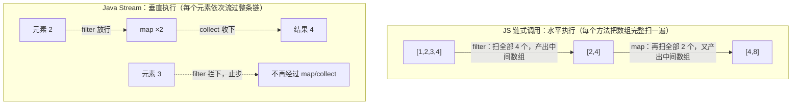
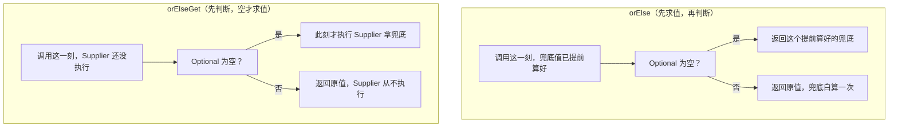

# 阶段一 · 小点 1：Java 8 函数式与核心库

> 所属：阶段一 Java 语言深化与 JVM 体系
> 定位：补齐函数式基础。你「了解 Java 基础语法」，但函数式和 Stream 不能默认掌握——这是后续一切代码阅读的地基：现代 Java 业务代码里 Stream 链、Optional、方法引用无处不在。Spring 的函数式 Bean 注册、Reactor 的操作符，全都构建在这一讲的概念上。

## 快速入门

> 本节为「函数式热身」：先认识本讲会反复用到的几个关键词与写法，能照抄跑通；「惰性求值怎么优化、Optional 什么时候别用」留在正文提高部分。

### 本讲核心关键词速查

| 关键词 | 一句话大白话 | 例子 |
|-|-|-|
| Lambda | 一个「简写的匿名函数」，用 `->` 表示 | `x -> x + 1` 表示「对 x 加 1」 |
| 函数式接口 | 只有一个抽象方法的接口，可以用 Lambda 实现 | `@FunctionalInterface interface Foo { int run(int x); }` |
| Stream | 一组数据的「流水线」，可过滤/映射/聚合，不直接改原集合 | `list.stream().filter(...).map(...).collect(...)` |
| Optional | 一个「可能为空也可能有值」的盒子，逼你先处理为空 | `Optional.ofNullable(user).map(User::getName)` |
| java.time | Java 新的时间 API（不可变、线程安全） | `LocalDate.now()`、`Instant.now()` |
| 方法引用 | Lambda 的简写：把「已有方法」直接当函数用 | `User::getName` 等价于 `u -> u.getName()` |

> 🧩 **前置 30 秒：泛型 `List<String>` 怎么读**——尖括号里的 `String` 是「类型参数」，`List<String>` 读作「装 String 的 List」，`Function<T,R>` 读作「吃 T 吐 R 的函数」。和 TS 泛型是**同一套心智**（TS 泛型本来就是从 Java/C# 这套学的），唯一差异：Java 泛型在运行时会被「擦除」（第 3 讲展开），TS 是编译后消失。本讲你只需会读会写。

### 本讲在解决什么问题

- **问题**：以前用 `for` 循环 + `if` 一层层处理集合，代码又长又易错。Java 8 引入函数式 + Stream，让你能用「声明式」写法处理数据：**「要什么」而不是「怎么遍历」**。
- **你要带走的一句话**：`list.stream().filter(...).map(...)` 是一条**流水线**——中间操作只是「登记」，真正开始跑是遇到**终端操作**（`collect` / `forEach` / `count`）那一刻。这也是你写 React 时 `array.filter().map()` 的 Java 版本。

### 最简可运行示例（照抄能跑）

```java
import java.util.*;
import java.util.stream.*;

public class StreamDemo {
    public static void main(String[] args) {
        List<String> names = List.of("Alice", "Bob", "Charlie");
        // 流水线: 只看名字长度>3 → 转成大写的名字 → 收集成新列表
        List<String> result = names.stream()
                .filter(name -> name.length() > 3)   // 中间操作: 过滤(留下长度>3)
                .map(String::toUpperCase)             // 中间操作: 转换(每个转大写)
                .collect(Collectors.toList());        // 终端操作: 真正执行, 收集结果
        System.out.println(result);                   // [ALICE, CHARLIE]
    }
}
```

> 代码备注（逐行解释）：
> - `names.stream()` 把集合变成一条「数据流」，后面才能链式操作。
> - `.filter(...)` 中间操作：留下满足条件的元素（这里是长度 > 3 的）。
> - `.map(...)` 中间操作：把每个元素转换（这里转成大写）。
> - `.collect(...)` 终端操作：**触发真执行**，把结果收集成新列表。没有它，前面的 filter/map 都不会跑。
> - 对比你熟悉的 JS：等价于 `names.filter(n => n.length > 3).map(n => n.toUpperCase())`。

### 关键方法 / 类说明

| 方法 / 类 | 干什么 | 最易踩的坑 |
|-|-|-|
| `filter` / `map` | 过滤 / 转换（中间操作） | 中间操作只是「登记」，不加终端操作不执行 |
| `collect` / `forEach` | 收集结果 / 遍历（终端操作） | 忘写 `collect` = 整条流水线白写 |
| `limit(n)` | 只取前 n 个（短路） | 配 `Stream.iterate` 无限流时可提前停 |
| `Optional.ofNullable` | 把可能为空的值包进 Optional | 别用 `get()`（可能抛异常），用 `orElse`/`ifPresent` |
| `@FunctionalInterface` | 标注函数式接口 | 只能有一个抽象方法，多了报错 |
| `List.of` | 创建不可变列表 | 返回的是不可变集合，别对它 `add` |

### 常用约定 / 命名提示

- **函数式接口三点**：用一个抽象方法、可以带 `default` 方法、用 `@FunctionalInterface` 校验。
- **Optional 使用边界**：方法**返回值**用 Optional 没问题；**字段 / 参数**别用（会让调用方困惑）。
- **java.time vs 老 Date**：`LocalDate` / `LocalDateTime` 不可变、线程安全，优先用它们；老 `Date` / `SimpleDateFormat` 是可变且有坑，见到旧代码别学。

## 精简大纲

1. Lambda 与函数式接口（`@FunctionalInterface`、内置函数式接口家族）
2. Stream：惰性求值、中间/终端操作、短路操作
3. Optional：用类型系统表达「可能没有值」
4. java.time：不可变时间 API
5. 方法引用：Lambda 的语法糖

## 学习内容详情

### 1. Lambda 与函数式接口

**函数式接口（Functional Interface）**：只有一个抽象方法的接口——Lambda 就是它的实例化语法。Java 不像 JS 有「一等公民函数」，函数必须挂在一个接口类型上才能传递（这是与 JS 箭头函数最核心的差异）。

> 🧩 **前置 30 秒：Java 的 interface 不是 TS 的 interface**——TS 的 interface 是纯类型声明（编译后消失）；Java 的 interface 是一个**能当变量类型用的真类型**（可以声明变量、做方法参数、被类实现），还允许带 `default` 方法（自带实现体的方法）。所以「函数式接口类型的变量」在 Java 里完全合法——Lambda 赋值给它，就像把一段逻辑装进一个有名字的容器。

**生活版（招聘启事与临时工）**：公司贴出一张**只招一个岗位**的招聘启事（比如只招「算折扣」这一个岗）。临时工（求职者）**拿着简历直接上岗**：不办入职手续、不建档案，干完就走。可临时工简历上没写「应聘哪个岗」——HR 只能凭启事上的岗位把他派去对应岗位；启事上若同时挂了两个岗，HR 就不知道这份简历是投给谁的，直接不收。启事里写死的固定条款（如「周末必须加班」）不算岗位，不影响分岗。

**换成 Java**：**函数式接口** = 那张**只招一个岗位的招聘启事**（抽象方法就是岗位）；**Lambda** = 临时工——Lambda 没有方法名、没有签名，编译器（HR）只能靠**目标类型**（= 启事上的岗位）推断它实现的是哪个方法。所以抽象方法**只能有一个**：岗位不唯一，推断就产生歧义，直接编译报错；`default` / `static` 方法自带实现体（= JD 里写死的固定条款），不影响「哪个才是岗位」的推断。

```java
// @FunctionalInterface 只是编译期检查注解：确保接口只有一个抽象方法
// 加上它，万一别人往接口里加了第二个抽象方法，编译直接报错
@FunctionalInterface
interface DiscountCalculator {
    double apply(double price);   // 唯一的抽象方法
}

// 老写法：匿名内部类（= 用 new 接口() {...} 现场写实现、连类名都不取的「一次性无名类」）——
//         整整齐齐五行，只为表达一个表达式
DiscountCalculator oldStyle = new DiscountCalculator() {
    @Override
    public double apply(double price) { return price * 0.9; }
};

// Lambda 写法：参数 -> 表达式，编译器知道目标类型是 DiscountCalculator
DiscountCalculator lambda = price -> price * 0.9;

System.out.println(lambda.apply(100.0));   // 输出: 90.0
```

#### 1.1 JDK 内置函数式接口家族（必背五个签名）

不用每个场合都自定义接口——JDK 已经把「一进一出」的组合空间标准化了。

> 🧩 **前置 30 秒：int vs Integer（自动装箱）**——下面会出现 `Predicate<Integer>` 而不是 `Predicate<int>`，为什么？Java 的 `int` 是裸的原始值（就是 32 位数字本身），**集合与泛型只能装「对象」不能装裸值**，所以要包一层用 `Integer`（int 的「盒子装版」）。int ↔ Integer 的自动互转叫**自动装箱/拆箱**（有微小开销，海量循环里要留意；底层细节第 8 讲集合框架会再遇到）。TS 没有这套区分——记住「集合里装的永远是盒子」即可。

| 接口 | 签名 | 一句话 | JS 对应物 |
|-|-|-|-|
| `Function<T,R>` | `R apply(T t)` | 输入 T 输出 R | `(t) => r` |
| `Predicate<T>` | `boolean test(T t)` | 输入 T 输出布尔 | `(t) => boolean` |
| `Consumer<T>` | `void accept(T t)` | 只消费不产出 | `(t) => void`（forEach 回调） |
| `Supplier<T>` | `T get()` | 无输入只产出 | `() => t`（惰性工厂） |
| `BiFunction<T,U,R>` | `R apply(T t, U u)` | 两输入一输出 | `(t, u) => r` |

```java
import java.util.function.*;

Function<String, Integer> strLength = s -> s.length();     // T -> R：映射
Predicate<Integer> isEven = n -> n % 2 == 0;               // T -> boolean：判断
Consumer<String> printer = s -> System.out.println(s);     // T -> void：副作用
Supplier<Double> randomPrice = () -> Math.random() * 100;  // () -> T：生产

System.out.println(strLength.apply("hello"));  // 输出: 5
System.out.println(isEven.test(4));            // 输出: true
printer.accept("只消费，不返回");                // 输出: 只消费，不返回
```

> **生活版（餐厅的五个岗位）**：把五个函数式接口想成一家餐厅的五个岗位——
> - `Supplier` **采购员**：不接单只出货（只管往外供货，厨房一要货才出手——对应正文里的「惰性工厂」）；
> - `Consumer` **服务员**：只上菜不回收（端走就算完事，不留返回）；
> - `Function` **厨师**：食材进、菜品出（一份进一份出，一对一加工）；
> - `Predicate` **质检员**：合格放行、不合格退回（只回答「行不行」）；
> - `BiFunction` **双手师傅**：两口锅同时颠（两份进、一份出）。
>
> **换成 Java**：上面括号里注的就是对应函数式接口的**签名**——岗位记牢，签名就记牢（`Supplier<T>` 是 `() -> T`，`Consumer<T>` 是 `T -> void`，`Function<T,R>` 是 `T -> R`，`Predicate<T>` 是 `T -> boolean`，`BiFunction<T,U,R>` 是 `(T,U) -> R`）。之后读 Stream 代码按岗位代入：`map(Function)` 是「过一遍厨师」，`filter(Predicate)` 是「过一遍质检」。

> **为什么必须背签名**：后面 Stream 的 `map(Function)` / `filter(Predicate)` / `forEach(Consumer)`、Optional 的 `orElseGet(Supplier)` 全用这套词汇表。不背它，读 Stream 代码就是看天书。

> 🧩 **顺带必须会：effectively final（面试 Q3 会考）**——先看定义：Lambda 只能捕获「不再被重新赋值的局部变量」。没声明 `final`、但事实上从没被改过的变量，就叫 effectively final（字面意思「事实上最终」）。
>
> **生活版（复印件）**：你办事前给窗口交了一张身份证**复印件**（= 变量被复制进 Lambda）。这份复印件交出去后，你原件上的信息就不能再改了——比如改地址——改了，复印件和原件就对不上账。
>
> **换成 Java**：Java 的捕获就是**按值捕获**——把变量值复制一份带进 Lambda。外部若还对这个变量重新赋值，副本和本体就「对不上账」，所以编译器直接禁止。例外注意：捕获 `List` 这类**可变对象**没问题——被复制的只是「引用」，往里 `add` 改的是对象内容，不是变量本身，不算重新赋值。

### 2. Stream：惰性求值（Lazy Evaluation）与短路操作（Short-circuiting）

**Stream**：数据流水线的声明式描述——先「描述要做什么」，终端操作触发时才真正执行。

#### 2.1 中间操作 vs 终端操作

- **中间操作**（`filter` / `map` / `flatMap` / `sorted`）：惰性，只把操作挂到流水线上，不执行
- **终端操作**（`collect` / `forEach` / `count` / `reduce`）：触发整条流水线一次性执行

```java
import java.util.List;
import java.util.stream.Collectors;

List<String> names = List.of("Alice", "Bob", "Charlie", "Dave");

// 没有终端操作 → 一行都不会跑（惰性：这只是流水线的「设计图」）
names.stream()
     .filter(n -> {
         System.out.println("filter 执行了: " + n);   // 永远不会打印
         return n.length() > 3;
     });

// 加上终端操作 collect → 设计图变成施工
List<String> result = names.stream()
     .filter(n -> {
         System.out.println("filter 执行了: " + n);   // 现在会打印
         return n.length() > 3;
     })
     .map(String::toUpperCase)
     .collect(Collectors.toList());

System.out.println(result);
// 输出: [ALICE, BOB, CHARLIE, DAVE]（Bob/Dave 各 4 个字符 > 3，都被保留）
```

> **为什么中间操作是惰性的**：Stream 是「拉取式」（pull-based）流水线——运行方向是「终端往回要」，不是「源头往前推」。元素不是每个操作各扫一遍，而是**逐个流过整条链**（filter 放行 → map 转换 → collect 收下）；直到终端操作出现，才开始「拉」第一个元素——在此之前，中间操作都只是「登记」，一行不跑。
>
> **惰性给 JVM 留出两个优化空间**：
> - **① 短路可停**：终端「拉够就停」——`limit(5)` 索要到第 5 个就收手，上游不必继续生产多余元素（细节见下节「短路操作」）；
> - **② 遍历合并**：整条链的遍历次数合并到接近一次，避开「每个方法各扫一遍」的重复开销。
>
> **生活版（自助餐传菜带）**：餐厅里一条自动传菜的转盘带——菜是**一盘接一盘**流经整条带子、到达取餐口（= 元素逐个流过整条链），而不是每个取餐台各自把整批菜重扫一遍。没人点菜时传菜带不空转上菜（= 没有终端操作就不跑）；你在取餐口说「要 5 盘就停」（= 终端操作 + `limit`），第 6 盘根本不用送上带。

> **与 JS 的关键差异**：
> - **JS：立即执行**——`Array.prototype.filter/map` 每调一个方法，就把整个数组**完整扫一遍**（水平执行，还逐个产出中间数组）；
> - **Java：先声明后触发**——`stream()` 之后到终端操作前都在「搭流水线」、不执行；元素一旦被触发，就**逐个流过全链**（垂直执行），不是每个操作各扫一遍。
> - **例外：** JDK 实现通常把整条流水线优化成尽量少的遍历（**多数场景确实一次**），但**这不是规范保证**——经过 `flatMap` 等复杂操作时可能引入额外处理，别把「一定只遍历一次」当成铁律记。

一张图看清「水平执行 vs 垂直执行」（JS 是先把整个数组过完 filter、再整体过 map；Java 是每个元素接力走完全链，才轮到下一个元素）：



> 记忆版：JS 是「分批过三道工序的传送带」，Java Stream 是「单件流水的组装线」——这就是为什么 Java 的短路操作（`limit` / `findFirst`）能「拉够就停」：第 5 个元素收进 collect 后，第 6 个元素根本没上过线。

#### 2.2 短路操作

（**短路** = 「够用即收手」：目标已经达成，就不再处理剩余元素——和 JS 里 `a && b` 只要 `a` 为假就不再算 `b`，是同一个「够用即停」的直觉。）

`limit` / `takeWhile` / `findFirst` / `anyMatch` 可以**提前终止**流水线、不遍历全量元素——处理无限流或大集合时的性能武器。

**为什么能提前终止**：拉取式流水线里，终端操作是「按需索取」——`limit(5)` 索要到第 5 个就收手，上游不必被迫生成第 6 个元素。这正是无限流（`Stream.iterate`）能配合 `limit` 安全运行的原因。

```java
import java.util.stream.Stream;

// 无限流 + limit：只「按需」生成前 5 个偶数——没有 limit 就是死循环
List<Integer> first5Even = Stream.iterate(0, n -> n + 2)  // 0, 2, 4, 6, 8, ...
     .limit(5)
     .collect(Collectors.toList());

// findFirst + filter：找到第一个就停，后面 100 万元素根本不碰
boolean hasLongName = names.stream()
     .peek(n -> System.out.println("检查: " + n))        // peek = 偷看，常用于调试
     .anyMatch(n -> n.length() > 6);                      // 命中 Charlie 后立即返回

System.out.println(first5Even);     // 输出: [0, 2, 4, 6, 8]
System.out.println(hasLongName);    // 输出: true（只检查到 Charlie 就短路了）
```

> 业务场景一句话：当日 10 万条风控日志按时间序流式处理，`riskLogs.stream().filter(Log::isAlert).limit(5)` 取最早 5 条告警——短路让后面的元素根本不扫，这是 `limit` 在企业代码里的主战场。

> ⏸️ **短期可以不学**：并行流（`parallelStream`）的线程安全陷阱先留给第 7 讲并发编程——绝大多数业务代码用默认串行流就够了，「方便」不等于「适合」，它会把公共 ForkJoinPool（全 JVM 共享的默认线程池，第 7 讲展开）、共享变量竞态、结果顺序不确定性一起带进来。**何时回来学**：需要压榨多核吞吐、或面试被问「并行流什么时候该用」时。**面试最低要求**：能说清「并行流默认用公共 ForkJoinPool、共享变量有竞态、结果顺序不保证」即可。

### 3. Optional：用类型系统表达「可能没有值」

**Optional**：一个「盒子」，要么装着一个值，要么是空的——把「可能返回 null」从口头约定升级为编译期类型签名，调用方一眼知道要不要防空。

```java
import java.util.Optional;

// 数据库查询的典型返回：查不到就 empty()，而不是 null
Optional<String> findUser(Long id) {
    return id == 1L ? Optional.of("Alice") : Optional.empty();
}

// ---- 反面教材：if-null 嵌套地狱 ----
String name = findUser(1L).orElse(null);
if (name != null) {
    if (name.length() > 3) { /* ... */ }
}

// ---- 正面教材：链式表达 ----
String greeting = findUser(1L)
     .map(String::toUpperCase)          // 有值才执行，空则整体为 empty
     .filter(n -> n.length() > 3)
     .orElse("匿名用户");                // 空时的兜底值

System.out.println(greeting);   // 输出: ALICE

// orElseGet 的价值：兜底逻辑有成本时用（惰性，只有真为空才执行 Supplier）
String lazy = findUser(2L).orElseGet(() -> expensiveDefault());
// findUser(1L) 有值时 expensiveDefault() 根本不会被调——orElse() 则总会执行

// orElseThrow：空时抛业务异常，替代返回 null 让调用方猜
String must = findUser(2L).orElseThrow(() -> new IllegalStateException("用户不存在"));
```

一张图看懂 `orElse` 与 `orElseGet` 的「求值时机」差别（左侧先把兜底算好再判断，右侧先判断、空才去算兜底）：



**使用边界**（社区共识）：

- ✅ 用作**方法返回值**——签名即文档
- ❌ 不用作**字段 / 方法参数**——字段套 Optional 增加序列化与内存成本，参数要求 Optional 把防御责任推给调用方

### 4. java.time：不可变时间 API

旧 `Date` / `Calendar` 是可变对象（set 来 set 去）且非线程安全——`SimpleDateFormat` 并发解析直接炸。JS 里你可能被 `Date` 的月份从 0 开始坑过，Java 新 API 全面向 ISO 8601（日期时间的国际标准写法，如 `2026-09-06`）看齐。

```java
import java.time.*;
import java.time.format.DateTimeFormatter;

LocalDate date = LocalDate.of(2026, 9, 6);       // 月份从 1 开始！（不是 0）
LocalDateTime now = LocalDateTime.now();
ZonedDateTime tokyo = ZonedDateTime.now(ZoneId.of("Asia/Tokyo"));

// 不可变设计：所有「修改」都返回新对象，原对象不变——天然线程安全
LocalDate nextWeek = date.plusWeeks(1);          // date 本身不变
System.out.println(date + " / " + nextWeek);     // 输出: 2026-09-06 / 2026-09-13

// Duration（时间量）与 Period（日期量）
Duration meeting = Duration.between(now, now.plusHours(2));
System.out.println(meeting.toMinutes());         // 输出: 120

// 格式化：DateTimeFormatter 线程安全，可以放心做成常量
DateTimeFormatter fmt = DateTimeFormatter.ofPattern("yyyy-MM-dd HH:mm:ss");
System.out.println(now.format(fmt));             // 输出: 2026-09-06 14:30:00（当前时刻）

// Instant：时间线上的绝对点（UTC），存储 / 传输用它，展示时再转时区
Instant ts = Instant.now();
```

### 5. 方法引用

**方法引用（Method Reference）**：Lambda 体只调用一个已有方法时的语法糖——`x -> foo(x)` 可以直接写成 `Foo::foo`，让流水线读起来像一句话。

```java
import java.util.List;
import java.util.stream.Collectors;

List<String> names = List.of("alice", "bob", "charlie");

// 四种形式，逐个对照 Lambda 写法：
// ① 类名::静态方法 —— Integer::parseInt 等价于 s -> Integer.parseInt(s)
List<Integer> lengths1 = names.stream()
     .map(String::length)                        // ③ 类名::实例方法（第一个参数作接收者）
     .collect(Collectors.toList());              //    等价于 s -> s.length()

// ② 对象::实例方法 —— 绑定到特定对象
var out = System.out;                            // System.out::println 等价于 s -> out.println(s)
names.forEach(System.out::println);              // 输出: alice bob charlie（各占一行）

// ④ 类名::new —— 构造器引用，等价于 () -> new ArrayList<String>()
List<String> copy = names.stream()
     .collect(Collectors.toCollection(java.util.ArrayList::new));

System.out.println(lengths1);                    // 输出: [5, 3, 7]
```

> **读代码肌肉训练**：看到 `map(User::getName)` 要立刻反应「从 User 流映射为姓名流」——方法引用是现代 Java 代码的「高频词」，不熟它阅读速度会慢一半。

### 坑点提醒

- **Stream 只能消费一次**：`stream.collect(...)` 之后再对同一个 stream 调用任何操作抛 `IllegalStateException`——要再次处理请从集合重新 `stream()`。
- **`orElse` vs `orElseGet`**：`orElse(expensive())` 里 expensive **永远执行**（先求值再传入）；`orElseGet(() -> expensive())` 只在空时执行。生活版：兜底动作是「给客户打一通电话」——`orElse` 是不管客户在不在家都先拨一遍，`orElseGet` 是确认没人应答了才拨。兜底逻辑有成本时必须用后者。
- **别在 Stream 里写副作用**：`forEach` 里改外部集合是并发隐患（尤其 parallelStream）；要聚合就正经用 `collect`。
- **`Optional.get()` 尽量不用**：空时抛 NoSuchElementException 且不带上下文——用 `orElseThrow` 抛带业务语义的异常。
- **旧 `Date` 只在对接老接口时出现**：新代码一律 `java.time`；`Date` ↔ `Instant` 用 `toInstant()` 桥接。

## 本节自检

- [ ] 能不查资料写出 `Predicate` / `Function` / `Consumer` / `Supplier` 的签名
- [ ] 能解释「中间操作不触发执行」，并说出 3 个短路操作
- [ ] 能把一段 `if (x != null) {...}` 嵌套改写为 Optional 链，并说明 `orElse` 与 `orElseGet` 的执行时机差异
- [ ] 能用 `LocalDateTime` + `Duration` 完成时间加减与格式化，不再碰 `Date` / `Calendar`

## 本节配套思考题

1. `list.stream().filter(...)` 之后没有任何终端操作就结束了，JVM 会报错吗？调试时怎么快速发现这种「白写流水线」的代码？
2. JS 的 `[1,2,3].map(f).filter(g)` 和 Java 的 `stream.map(f).filter(g).collect(toList())`，在「数组被遍历几遍」上有什么本质区别？
3. 为什么 `SimpleDateFormat` 并发不安全而 `DateTimeFormatter` 安全？从「可变状态」角度解释。

## 常见面试题

### Q1：Stream 的中间操作和终端操作有什么区别？为什么中间操作是惰性的？
**答**：**标准结论**：中间操作（`filter`/`map`/`sorted` 等）只「描述要做什么」，不执行任何计算；终端操作（`collect`/`forEach`/`count` 等）触发整条流水线真正执行。中间操作天然惰性，根因是 Stream 的**拉取式（pull-based）**设计。

**原理层**：
- 中间操作只是往流水线上「挂」一个处理节点，不干活；
- 元素在终端操作触发后**逐个流过整条链**，遇到终端操作才开始「拉」第一个元素；
- 拉取式设计带来两个收益：① 短路操作（`limit`/`findFirst`/`anyMatch`）可「拉够就停」，不必处理全量数据、配合无限流也安全；② 多个中间操作可合并为尽量少的遍历，避免 JS 数组链式方法每调一次就扫一遍数组的开销。

**工程层**：警惕「只挂节点、不触发」的**白写流水线**——没有终端操作，整条链一行都不会跑，且编译器不报错，只能靠代码审查与习惯发现（自检可加一条：写完 `stream().filter()...` 必须确认以终端操作结尾）。

### Q2：`orElse` 和 `orElseGet` 有什么区别？实际中怎么选？
**答**：**标准结论**：区别在**求值时机**——`orElse(value)` 的参数**先求值再传入**，即使 Optional 有值，`expensive()` 也一定会执行；`orElseGet(supplier)` 是惰性的，只有 Optional 为空时才会调用 Supplier。

**原理层**：
- `orElse` 收的是「已经算好的值」：调用它那一刻，参数就已求值完毕；
- `orElseGet` 收的是「一个还没执行的函数」：把 Supplier 挂起来，空时才拉取执行。

**工程层**：
- 兜底逻辑**有成本**（查库、构造大对象、打日志）就必须用 `orElseGet`，否则每次调用都在白白浪费；
- 兜底是**常量 / 字面量**时两者等价，用 `orElse` 读起来更直观；
- 延伸考点：Optional 的**使用边界**——只适合做**方法返回值**（签名即文档），不适合做**字段和参数**（增加序列化与内存成本、把防御责任推给调用方）；`Optional.get()` 空时抛 `NoSuchElementException` 且无上下文，应改用 `orElseThrow` 抛带业务语义的异常。

### Q3：Lambda 表达式和匿名内部类有什么区别？为什么 Lambda 捕获的外部变量必须是 effectively final？
**答**：**标准结论**：语法上 Lambda 更简洁，但本质差异有三点——① 编译形态；② `this` 指向；③ 捕获语义（由此引出「为什么必须 effectively final」）。

**原理层**：
- **① 编译形态**：Lambda 是「函数式接口的实例化」，编译期走 `invokedynamic`（JVM 的动态调用指令，运行时才把 Lambda 绑定到目标方法），不强制生成单独的 `.class` 文件；匿名内部类会生成类文件、引入额外类型；
- **② `this` 指向**：Lambda 里的 `this` 指向**外层类**，匿名内部类的 `this` 指向内部类自身；
- **③ 捕获语义**：Lambda 要求捕获的局部变量是 effectively final（没声明 `final` 但事实上没被重新赋值）——因为 Java 的捕获是**按值捕获**（变量被复制进 Lambda 的上下文），若变量还能被重新赋值，捕获的副本与外部变量就会不一致；设计上禁止重新赋值，语义才清晰。

**工程层**：捕获**可变对象**（如 `List`）只是引用不可变——被复制的是「引用」，往里 `add` 改的是对象内容、不算破坏 effectively final；真正被禁止的是对**变量本身**重新赋值。排错时若见「variable used in lambda should be final or effectively final」的编译报错，去检查该变量有没有被二次赋值。

### Q4：parallelStream 有什么坑？什么时候该用并行流？
**答**：**标准结论**：并行流默认使用**公共的 ForkJoinPool**（线程数 = CPU 核数 - 1），坑主要在四方面——共享变量竞态、公共池被占、结果顺序不保证、数据量小时反而更慢。正确用法 = **数据量大 + 无共享可变状态 + CPU 密集（或每个元素处理耗时长）**。

**原理层**：
- **① 共享变量竞态**：流里的操作若写外部可变状态（如 `forEach` 里往集合 `add`），结果不确定；
- **② 公共池被占**：ForkJoinPool 是全 JVM 共享的默认线程池，被阻塞任务占满会拖垮全应用的并行任务；
- **③ 顺序不保证**：并行收集不做顺序控制时，`collect(toList())` 的元素顺序可能不符合预期；
- **④ 小数据反更慢**：数据量小时，任务切分与线程切换的开销超过并行收益。

**工程层**：业务开发默认**串行**，性能压测证明并行收益后再换并行流；自定义线程池与公共池混用要谨慎，避免互相阻塞。
