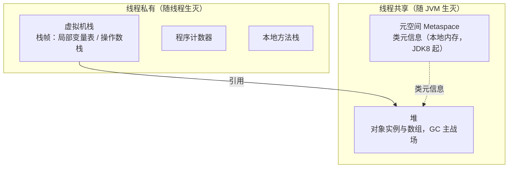

# 阶段一 · 小点 4：JVM 内存结构

> 所属：阶段一 Java 语言深化与 JVM 体系
> 定位：能排查 OOM、分析内存泄漏、理解字节码层面发生了什么。这是 JVM 题的「地图」——GC（第 6 讲）与运行时诊断（阶段五第 5 讲）都挂在这张地图上。**先建地图，再学开船。**

## 快速入门

> 本节为「JVM 地图速览」：先认识 JVM 运行时把内存分成了几块、各装什么；「怎么定位 OOM、JIT 怎么优化」留在正文提高部分。

### 本讲核心关键词速查

| 关键词 | 一句话大白话 | 例子 |
|-|-|-|
| JVM | 跑 Java 程序的「虚拟机」，负责把字节码翻译执行 | `java` 命令启动的就是 JVM |
| 堆（Heap） | 存放**对象实例**的大内存区（垃圾回收主战场） | `new` 出来的对象都在堆里 |
| 虚拟机栈 | 每个线程一个栈，放**方法调用**的栈帧 | 局部变量、方法参数在栈上 |
| 元空间（Metaspace） | 存放**类元数据**（类的定义信息），JDK 8 起替代方法区 | 类名、方法、字段的定义 |
| 程序计数器 | 记录当前线程执行到哪一行字节码 | 每个线程一个 |
| OOM | OutOfMemoryError：内存不够用了 | 堆 / 栈 / 元空间各自会抛 |
| 类加载器 | 把 `.class` 字节码加载成运行时的类 | 双亲委派加载 |
| JIT | 把热点字节码编译成本地机器码，越跑越快 | 服务启动慢、跑一段变快 |

### 本讲在解决什么问题

- **问题**：程序为什么「内存不够」会崩？为什么服务刚启动慢、跑一会儿变快？JVM 把内存分成几块来管理。
- **你要带走的一句话**：**对象在堆、方法调用在栈、类定义在元空间**。排查内存问题时先问「是堆满了、栈溢出，还是元空间满了」——这三类 OOM 的处理完全不同。

### 最简可运行示例（照抄能跑）

```java
// 堆内存溢出复现: 一直 new 对象, 把堆填满就抛 OOM
import java.util.*;

public class HeapOomDemo {
    public static void main(String[] args) {
        List<byte[]> list = new ArrayList<>();
        while (true) {
            list.add(new byte[1024 * 1024]);   // 每次塞 1MB, 直到堆满
        }
    }
}
// 运行: java -Xmx20m HeapOomDemo   把堆上限压到 20MB, 几秒内就 OOM
```

> 代码备注（逐行解释）：
> - `new byte[1024 * 1024]` 一次申请 1 兆字节数组，都是堆上的对象。
> - `while(true)` 无限循环往列表里塞，堆的对象只增不减，最终占满。
> - `-Xmx20m` 把堆的最大值压到 20MB——故意设小，很快能看到 `OutOfMemoryError: Java heap space`。
> - 印证了「对象在堆」：堆满了就抛 OOM，这叫**堆溢出**。

### 关键概念 / 参数说明

| 概念 / 参数 | 干什么 | 最易踩的坑 |
|-|-|-|
| `-Xms` / `-Xmx` | 堆的**初始 / 最大**大小 | 别把 `-Xmx` 设得太大，超出物理内存会直接起不来 |
| `-Xss` | 每个线程的**栈**大小 | 栈溢出通常是递归太深（`StackOverflowError`） |
| 堆 | 存放对象 | OOM 时先看是不是堆满了、是被谁占满 |
| 虚拟机栈 | 方法调用栈帧 | 递归无出口 → 栈溢出 |
| 元空间 | 类元数据 | 动态生成类（反射/CGLIB）过多会元空间溢出 |
| 双亲委派 | 类加载器逐级向上委托、父级加载不了再自己加载 | 保证核心类不被篡改、只加载一次 |

### 常用约定 / 命名提示

- **排查 OOM 三步**：看异常类型（`Java heap space` 堆 / `StackOverflowError` 栈 / `Metaspace` 元空间）→ 用 `jmap`/`jstat` 看内存构成 → 定位谁在涨（通常是某个集合/Cache 无限增长）。
- **服务启动慢、跑一会变快**：这就是 JIT 编译热点——别急着当 bug 排查。
- **遇到 OOM 先别狂加 `-Xmx`**：先看是不是内存泄漏（对象只增不减），加内存只是延缓，不是解决。

## 精简大纲

1. 运行时数据区：堆 / 虚拟机栈 / 方法区 / 元空间 / 程序计数器
2. 三类典型 OOM 的复现与定位
3. 类加载机制与双亲委派
4. JIT 分层编译与「预热」现象

## 学习内容详情

### 1. 运行时数据区

**运行时数据区**：JVM 把「跑一个 Java 程序需要的内存」划分成的几块各司其职的区域——哪块满了抛哪种错，一一对应。



| 区域 | 存什么 | 典型异常 |
|-|-|-|
| 虚拟机栈 | 每个方法调用生成一个**栈帧**（局部变量表 / 操作数栈 / 返回地址） | `StackOverflowError`（深递归） |
| 堆 | 对象实例与数组（**几乎所有 new 出来的东西**） | `OutOfMemoryError: Java heap space` |
| 元空间 | 类的元信息（类结构 / 方法字节码 / 常量池）——JDK 8 起在本地内存，替代旧「永久代」 | `OutOfMemoryError: Metaspace` |
| 程序计数器 | 当前线程执行到第几条字节码 | 无——唯一不会 OOM 的区域 |

> **与 JS 内存模型对照**：JS 里你关心的是「堆 + 调用栈」两块；Java 多出的「方法区 / 元空间」是因为类加载是运行时动态行为——类不是一次性解析好的，是用到才加载、加载了就有地方存放它的元信息。

### 2. 三类典型 OOM：复现比记忆重要

#### 2.1 栈溢出（StackOverflowError）

```java
public class StackOverflowDemo {
    static int depth = 0;

    static void recurse() {
        depth++;                       // 每次调用压一个新栈帧, 栈帧里有局部变量
        recurse();                     // 无终止条件 → 栈帧无限堆积直到超出栈深度限制
    }

    public static void main(String[] args) {
        try { recurse(); }
        catch (StackOverflowError e) {
            System.out.println("递归深度: " + depth);   // 数万层后崩溃
            System.out.println("栈深由 -Xss 控制(默认约 1MB/线程)");
        }
    }
}
```

- 真实场景：递归忘了写终止条件、递归太深（解析嵌套 JSON / 树遍历）。**生产解法不是加大 `-Xss`，是把递归改迭代 / 加深度上限**。

#### 2.2 堆内存溢出（heap OOM）

```java
// 启动参数: java -Xmx32m OomHeapDemo   ← 小堆方便复现
public class OomHeapDemo {
    static class Heavy { byte[] data = new byte[1024 * 1024]; }   // 每个 1MB

    public static void main(String[] args) {
        var list = new ArrayList<Heavy>();
        while (true) {
            list.add(new Heavy());      // 对象被 list 强引用 → GC 回收不了 → 堆越填越满
        }
        // Exception in thread "main" java.lang.OutOfMemoryError: Java heap space
    }
}
```

- **内存泄漏的通用指纹**：集合 / 缓存 / 监听器只进不出。排查路径：dump 堆（`jmap -dump`）→ MAT 看**支配树**——谁占着最大一块引用链。
- 与「流量大导致内存不足」的区分：泄漏是老年代单调涨、Full GC 后不回落；流量是年轻代高频 GC（第 6 讲展开）。

#### 2.3 元空间溢出（Metaspace OOM）

```java
// 动态生成类是典型诱因: 代理框架 / Groovy / 反复 new GroovyShell().parse(...)
// 概念示意: 运行时不断定义新类 → 元空间持续增长
// 真实事故画像: 每次请求都 CGLIB 生成一个新代理类且缓存写错 → Metaspace OOM
```

- 认知点：**类是有生命周期的对象**，动态类生成框架用不好就是元空间泄漏（不是堆泄漏，dump 分析方向不同）。

### 3. 类加载机制与双亲委派

**类加载**：把 .class 字节码读进内存变成 Class 对象的过程——加载 → 验证 → 准备 → 解析 → 初始化。

**双亲委派**：加载一个类时，先委托父加载器去加载，父加载器找不到才轮到自己动手——目的有二：核心类（`java.lang.String`）不可被篡改、同一个类只被加载一次。

```java
public class ClassLoaderDemo {
    public static void main(String[] args) throws Exception {
        Class<?> c = String.class;
        System.out.println(c.getClassLoader());              // null → 启动类加载器(Bootstrap, C++实现, Java里表现为null)

        var url = new java.net.URLClassLoader(             // 自定义加载器: 默认也遵守双亲委派
            new java.net.URL[]{ new java.net.URL("file:///tmp/myclasses/") });
        System.out.println(url.getParent());               // → 应用类加载器 AppClassLoader(它的"父"链继续向上)
    }
}
```

三层系统加载器链：Bootstrap（JDK 核心库）→ Platform（JDK 9 起取代 JDK 8 时代的 ExtClassLoader）→ Application（classpath）→ 自定义。

- **打破双亲委派的场景**知道即可：SPI（线程上下文类加载器反向加载）、热部署 / 模块化（OSGi 式的平级委派）。
- 前端类比：类加载 ≈ 模块解析，双亲委派 ≈ node_modules 查找的「反向」——先问根再问自己。

### 4. JIT 分层编译与「预热」

**JIT（即时编译）**：热点代码从「解释执行字节码」升级为「编译成本地机器码」——Java 是**先解释后编译**的混合模式。

| 层 | 状态 | 特征 |
|-|-|-|
| 0 | 解释执行 | 启动即能跑，速度慢 |
| 1-2（C1） | 客户端编译 | 快速出机器码，简单优化 |
| 3-4（C2） | 服务端编译 | 深度优化（内联 / 逃逸消除），要求代码跑够多次 |

```bash
# 观察 JIT 的触发: 热点方法被编译时打印一行
java -XX:+PrintCompilation HotLoopDemo
# 输出示例:
#     3   1       java.lang.String::hashCode (60 bytes)
#    12   2       HotLoopDemo::sum (45 bytes)          ← 调用次数过阈值, C2 接手编译
```

- 由此解释两类「玄学」：**服务刚启动 RT 偏高、跑一会儿变快**（预热 = JIT 爬升 + 缓存填充）；**反射 / 动态调用优化难**（调用点不固定，JIT 不敢内联——第 3 讲讲过的伏笔）。
- 工程对策：启动预热流量 / readiness 探针延迟放行（阶段五第 2 讲 startupProbe 的底层原因）。

### 坑点提醒

- **堆 OOM 别第一反应加 -Xmx**：先看 dump——泄漏加多大都会再 OOM，只是晚一点。
- **`-Xss` 调大救不了错误的递归**：它只是让你死得慢一点；改迭代 / 加深度限制才是解法。
- **元空间默认「无上限」**（只受本地内存约束），所以 Metaspace OOM 往往意味着动态类失控，不是「默认给小了」。
- **压测报告没预热**：冷启动前几分钟的数据是 JIT 解释执行阶段的，会严重误导容量结论——基线压测先跑够预热期。

## 本节自检

- [ ] 能画出运行时数据区图，标注哪些线程私有、哪些共享
- [ ] 能区分 `StackOverflowError` 与三类 `OutOfMemoryError`（heap / metaspace / 其他）的触发原因与定位手段
- [ ] 能说清双亲委派的流程，它防住了什么、哪些场景会打破它
- [ ] 能解释为什么服务启动初期 RT 偏高、跑一段变快（JIT 分层编译 + 预热）

## 本节配套思考题

1. 「一个 List 缓存只 put 不 remove」和「线程池队列无界」两种泄漏，最终 OOM 的位置和现象有何不同？dump 里分别怎么找到元凶？
2. K8s 里 `-Xmx` 与容器 memory limit 怎么对齐才不会被 OOM Kill？（提示：容器内 JVM 默认按宿主机还是 cgroup 读内存；再想想第 4 讲的 MaxRAMPercentage）
3. 为什么 `String.class.getClassLoader()` 是 null 而不是一个对象？「用 null 表示 C++ 写的加载器」这个设计你怎么评价？
