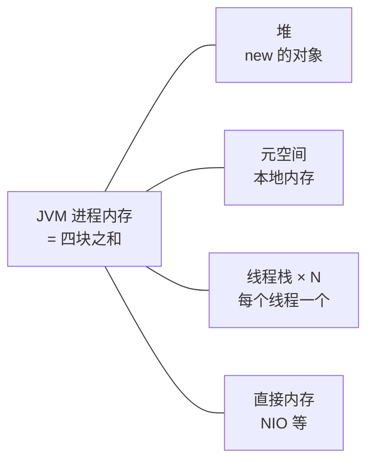
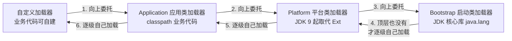
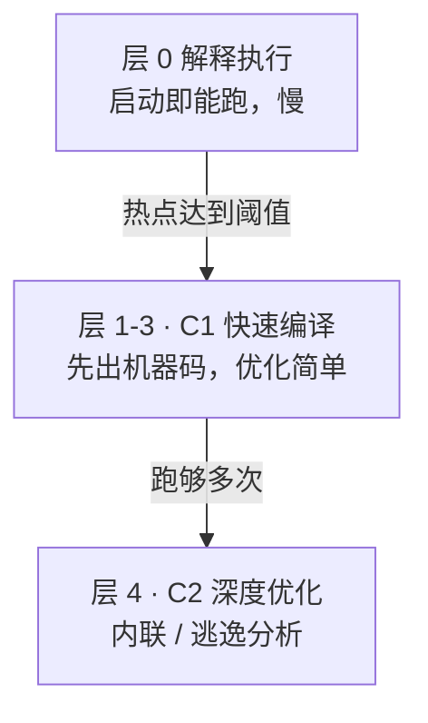

# 阶段一 · 小点 4：JVM 内存结构

> 所属：阶段一 Java 语言深化与 JVM 体系
> 定位：能排查 OOM、分析内存泄漏、理解字节码层面发生了什么。这是 JVM 题的「地图」——GC（第 6 讲）与运行时诊断（阶段五第 5 讲）都挂在这张地图上。**先建地图，再学开船。**

## 快速入门

> 本节为「JVM 地图速览」：先认识 JVM 运行时把内存分成了几块、各装什么；「怎么定位 OOM、JIT 怎么优化」留在正文提高部分。

### 本讲核心关键词速查

| 关键词 | 一句话大白话 | 例子 |
|-|-|-|
| JVM | 跑 Java 程序的「虚拟机」，负责把字节码翻译执行 | `java` 命令启动的就是 JVM |
| 堆（Heap） | 存放**对象实例**的大内存区（垃圾回收主战场） | `new` 出来的对象都在堆里 |
| 虚拟机栈 | 每个线程一个栈，放**方法调用**的栈帧 | 局部变量、方法参数在栈上 |
| 元空间（Metaspace） | 存放**类元数据**（类的定义信息），JDK 8 起替代方法区 | 类名、方法、字段的定义 |
| 程序计数器 | 记录当前线程执行到哪一行字节码 | 每个线程一个 |
| OOM | OutOfMemoryError：内存不够用了 | 堆 / 栈 / 元空间各自会抛 |
| 类加载器 | 把 `.class` 字节码加载成运行时的类 | 双亲委派加载 |
| JIT | 把热点字节码编译成本地机器码，越跑越快 | 服务启动慢、跑一段变快 |

### 本讲在解决什么问题

- **问题**：程序为什么「内存不够」会崩？为什么服务刚启动慢、跑一会儿变快？JVM 把内存分成几块来管理。
- **你要带走的一句话**：**对象在堆、方法调用在栈、类定义在元空间**。排查内存问题时先问「是堆满了、栈溢出，还是元空间满了」——这三类 OOM 的处理完全不同。

### 最简可运行示例（照抄能跑）

```java
// 堆内存溢出复现: 一直 new 对象, 把堆填满就抛 OOM
import java.util.*;

public class HeapOomDemo {
    public static void main(String[] args) {
        List<byte[]> list = new ArrayList<>();
        while (true) {
            list.add(new byte[1024 * 1024]);   // 每次塞 1MB, 直到堆满
        }
    }
}
// 运行: java -Xmx20m HeapOomDemo   把堆上限压到 20MB, 几秒内就 OOM
```

> 代码备注（逐行解释）：
> - `new byte[1024 * 1024]` 一次申请 1 兆字节数组，都是堆上的对象。
> - `while(true)` 无限循环往列表里塞，堆的对象只增不减，最终占满。
> - `-Xmx20m` 把堆的最大值压到 20MB——故意设小，很快能看到 `OutOfMemoryError: Java heap space`。
> - 印证了「对象在堆」：堆满了就抛 OOM，这叫**堆溢出**。

### 关键概念 / 参数说明

| 概念 / 参数 | 干什么 | 最易踩的坑 |
|-|-|-|
| `-Xms` / `-Xmx` | 堆的**初始 / 最大**大小 | 别把 `-Xmx` 设得太大，超出物理内存会直接起不来 |
| `-Xss` | 每个线程的**栈**大小 | 栈溢出通常是递归太深（`StackOverflowError`） |
| 堆 | 存放对象 | OOM 时先看是不是堆满了、是被谁占满 |
| 虚拟机栈 | 方法调用栈帧 | 递归无出口 → 栈溢出 |
| 元空间 | 类元数据 | 动态生成类（反射/CGLIB）过多会元空间溢出 |
| 双亲委派 | 类加载器逐级向上委托、父级加载不了再自己加载 | 保证核心类不被篡改、只加载一次 |

### 常用约定 / 命名提示

- **排查 OOM 三步**：看异常类型（`Java heap space` 堆 / `StackOverflowError` 栈 / `Metaspace` 元空间）→ 用 `jmap`/`jstat` 看内存构成 → 定位谁在涨（通常是某个集合/Cache 无限增长）。
- **服务启动慢、跑一会变快**：这就是 JIT 编译热点——别急着当 bug 排查。
- **遇到 OOM 先别狂加 `-Xmx`**：先看是不是内存泄漏（对象只增不减），加内存只是延缓，不是解决。

## 精简大纲

1. 运行时数据区：堆 / 虚拟机栈 / 方法区 / 元空间 / 程序计数器
2. 三类典型 OOM 的复现与定位
3. 类加载机制与双亲委派
4. JIT 分层编译与「预热」现象

## 学习内容详情

### 1. 运行时数据区

**运行时数据区**：JVM 把「跑一个 Java 程序需要的内存」划分成的几块各司其职的区域——哪块满了抛哪种错，一一对应。

```mermaid
flowchart TB
    subgraph 线程私有[线程私有（随线程生灭）]
        Stack[虚拟机栈<br/>每个员工工位：接一个任务压一叠单据<br/>叠太高塌了 = StackOverflowError]
        PC[程序计数器<br/>书签：当前读到哪一行字节码]
        NStack[本地方法栈]
    end
    subgraph 线程共享[线程共享（随 JVM 生灭）]
        Heap[堆<br/>大仓库：new 的货全进仓<br/>定期清理 = GC]
        Meta[元空间 Metaspace<br/>档案室：类的"岗位说明书"<br/>（本地内存，JDK8 起）]
    end
    Stack -->|引用| Heap
    Meta -.类元信息.-> Heap
```

**把 JVM 想成一家公司**：堆是公司的大仓库——进货（`new`）都先进仓，定期有人打扫（GC 把没人要的货清出去）；虚拟机栈是每个员工的工位——每接一个任务（方法调用）就压一叠单据（栈帧），单据叠太高会塌（StackOverflowError）；元空间是档案室——存每个类的「岗位说明书」（类定义信息）；程序计数器是你手里的书签——记着当前读到哪一行。四块各司其职，哪块出问题，抛的异常都不一样。

| 区域 | 存什么 | 典型异常 |
|-|-|-|
| 虚拟机栈 | 每个方法调用生成一个**栈帧（Stack Frame）**（局部变量表 / 返回地址；进阶名词：操作数栈=方法内部的临时计算区、动态链接=找符号对应的实现，先跳过不影响理解） | `StackOverflowError`（深递归） |
| 堆 | 对象实例与数组（**几乎所有 new 出来的东西**） | `OutOfMemoryError: Java heap space` |
| 元空间 | 类的元信息（类结构 / 方法字节码 / 常量池）——JDK 8 起在本地内存，替代旧「永久代」 | `OutOfMemoryError: Metaspace` |
| 程序计数器 | 当前线程执行到第几条字节码 | 无——唯一不会 OOM 的区域 |

**为什么 JDK 8 用元空间替代永久代**：永久代（PermGen）大小固定、由 JVM 管理，类加载一多（动态代理、热部署）就出现「`-XX:MaxPermSize` 调不准 → 莫名其妙 OOM」的经典事故；元空间改用**本地内存**（堆之外的、OS 直接管的内存，大小受 OS 内存约束），类元信息不再挤占 JVM 堆预算，字符串常量池（存字符串字面量的共享缓存区）也顺势移到了堆上——「调参救火」的问题从根上消失。

> **与 JS 内存模型对照**：JS 里你关心的是「堆 + 调用栈」两块；Java 多出的「方法区 / 元空间」是因为类加载是运行时动态行为——类不是一次性解析好的，是用到才加载、加载了就有地方存放它的元信息。

**JVM 进程内存全景**（容器排障必备）——别以为 JVM 内存只有堆，一个 Java 进程实际占用的内存是下面四块之和：



> ⚠️ **容器盲区提醒**：K8s 的 memory limit 看的是**整个进程内存**，不只是堆——堆（`-Xmx`）之外的元空间、线程栈、直接内存超了 limit 照样被 OOM Kill，这是 K8s 时代最常见的认知盲区（呼应本节思考题 2）。

### 2. 三类典型 OOM：复现比记忆重要

> 🧩 **前置 30 秒：GC 最低配词汇**——本节会提前用到第 6 讲的词：GC=自动回收「没人引用的对象」；强引用=被活着的变量拽着，GC 不敢动；年轻代/老年代=堆按「对象存活时间」分的新旧两区（新对象先进年轻代、活得久的晋升老年代）；Full GC=连老年代一起大扫除（最影响性能的回收动作）。

#### 2.1 栈溢出（StackOverflowError）

```java
public class StackOverflowDemo {
    static int depth = 0;

    static void recurse() {
        depth++;                       // 每次调用压一个新栈帧, 栈帧里有局部变量
        recurse();                     // 无终止条件 → 栈帧无限堆积直到超出栈深度限制
    }

    public static void main(String[] args) {
        try { recurse(); }
        catch (StackOverflowError e) {
            System.out.println("递归深度: " + depth);   // 数万层后崩溃
            System.out.println("栈深由 -Xss 控制(默认约 1MB/线程)");
        }
    }
}
```

- 真实场景：递归忘了写终止条件、递归太深（解析嵌套 JSON / 树遍历）。**生产解法不是加大 `-Xss`，是把递归改迭代 / 加深度上限**。

#### 2.2 堆内存溢出（heap OOM）

```java
// 启动参数: java -Xmx32m OomHeapDemo   ← 小堆方便复现
public class OomHeapDemo {
    static class Heavy { byte[] data = new byte[1024 * 1024]; }   // 每个 1MB

    public static void main(String[] args) {
        var list = new ArrayList<Heavy>();
        while (true) {
            list.add(new Heavy());      // 对象被 list 强引用 → GC 回收不了 → 堆越填越满
        }
        // Exception in thread "main" java.lang.OutOfMemoryError: Java heap space
    }
}
```

- **内存泄漏的通用指纹**：集合 / 缓存 / 监听器只进不出。排查路径：dump 堆（`jmap -dump`）→ MAT（Eclipse Memory Analyzer，堆转储分析工具）看**支配树**（MAT 里找「谁占着最大一块引用链」的视图）——谁占着最大一块引用链。
- 与「流量大导致内存不足」的区分：泄漏是老年代单调涨、Full GC 后不回落；流量是年轻代高频 GC（第 6 讲展开）。

#### 2.3 元空间溢出（Metaspace OOM）

```java
// 动态生成类是典型诱因: 代理框架 / Groovy / 反复 new GroovyShell().parse(...)
// 概念示意: 运行时不断定义新类 → 元空间持续增长
// 真实事故画像: 每次请求都 CGLIB 生成一个新代理类且缓存写错 → Metaspace OOM
```

- 认知点：**类是有生命周期的对象**，动态类生成框架用不好就是元空间泄漏（不是堆泄漏，dump 分析方向不同）。

### 3. 类加载机制与双亲委派

**类加载**：把 .class 字节码读进内存变成 Class 对象的过程——五步各记一个 5 字白话：**加载**=找到读入（把字节码文件读进内存）、**验证**=安检（字节码格式是否合法）、**准备**=划地盘（给静态变量分配内存、赋默认值）、**解析**=对门牌（符号引用 → 直接引用）、**初始化**=执行静态赋值（静态变量赋值 + 静态代码块）。

**双亲委派（Parent Delegation Model）**：先给前端对照——类加载 ≈ 模块解析，双亲委派 ≈ node_modules 查找的「反向」：先问根再问自己。具体说：加载一个类时，先委托父加载器去加载，父加载器找不到才轮到自己动手——目的有二：核心类（`java.lang.String`）不可被篡改、同一个类只被加载一次。为什么「防篡改」很重要：若应用类加载器能自己加载 `String`，业务代码里就能塞一个伪造的 `java.lang.String` 进来，类型系统的信任根基就塌了。

```java
public class ClassLoaderDemo {
    public static void main(String[] args) throws Exception {
        Class<?> c = String.class;
        System.out.println(c.getClassLoader());              // null → 启动类加载器(Bootstrap, C++实现, Java里表现为null)

        var url = new java.net.URLClassLoader(             // 自定义加载器: 默认也遵守双亲委派
            new java.net.URL[]{ new java.net.URL("file:///tmp/myclasses/") });
        System.out.println(url.getParent());               // → 应用类加载器 AppClassLoader(它的"父"链继续向上)
    }
}
```

三层系统加载器链：Bootstrap（JDK 核心库）→ Platform（JDK 9 起取代 JDK 8 时代的 ExtClassLoader）→ Application（classpath）→ 自定义。加载请求从最底层逐级向上委托，顶层都没有才逐级往下「自己动手」：



- **打破双亲委派的场景**知道即可：SPI（Service Provider Interface，JDK 的插件发现机制——框架声明接口、第三方提供实现，如 JDBC 驱动；靠线程上下文类加载器反向加载）、热部署 / 模块化（OSGi 式的平级委派）。

> ⏸️ **短期可以不学**：打破双亲委派（SPI 反向加载、热部署、OSGi 平级委派）是框架作者 / 中间件开发者才需要动手的内容，业务代码不会直接碰到。**何时回来学**：读 Tomcat / 内嵌容器源码、或面试被问「怎么打破双亲委派」时。**面试最低要求**：能说「正常是自下而上委托、父级加载不了才自己加载；打破的经典是 SPI 用线程上下文类加载器反向加载」即可。

### 4. JIT 分层编译与「预热」

**JIT（Just-In-Time，即时编译）**：热点代码从「解释执行字节码」升级为「编译成本地机器码」——Java 是**先解释后编译**的混合模式。

| 层 | 状态 | 特征 |
|-|-|-|
| 0 | 解释执行 | 启动即能跑，速度慢 |
| 1-3（C1） | 客户端编译 | 快速出机器码，简单优化；其中 Tier 3 为带 profiling 的 C1 |
| 4（C2） | 服务端编译 | 深度优化（方法内联 Inlining / 逃逸分析 Escape Analysis），要求代码跑够多次 |



**升级阶梯白话**：同一段热点代码，先解释跑着（保证启动快），被标记为热点后升到 C1 快速编译，再跑够多次升到 C2 深度优化——你其实早见过它：V8 的 Ignition 解释器 + TurboFan JIT 就是同一套思路。C2 里两个术语的白话版：**内联**=把小函数的代码抄进调用处，省一次跳转；**逃逸分析**=判断对象会不会被方法外的代码看到，看不到就干脆放栈上（省得 GC 管）。

**为什么不全量 AOT 编译**：机器码要基于运行时 profiling（哪段代码是热点、对象的真实形态是什么）才编得准——编译太早等于盲编；解释执行保证启动即能跑、边跑边收集 profile，再升级编译，本质是**启动速度与峰值性能的平衡**。

> ⏸️ **短期可以不学**：C1/C2 各层的触发阈值、profiling 细节不用背——日常不写 JVM 编译参数，知道「分层编译 + 预热」现象就够用。**何时回来学**：面试 JVM 岗、或排查「为什么这个方法没被 JIT 优化」时。**面试最低要求**：能说「热点代码从解释执行升级到 C1/C2 机器码、服务存在预热期」即可。

```bash
# 观察 JIT 的触发: 热点方法被编译时打印一行
java -XX:+PrintCompilation HotLoopDemo
# 输出示例:
#     3   1       java.lang.String::hashCode (60 bytes)
#    12   2       HotLoopDemo::sum (45 bytes)          ← 调用次数过阈值, C2 接手编译
```

- 由此解释两类「玄学」：**服务刚启动 RT 偏高、跑一会儿变快**（预热 = JIT 爬升 + 缓存填充）；**反射 / 动态调用优化难**（调用点不固定，JIT 不敢内联——第 3 讲讲过的伏笔）。
- 工程对策：启动预热流量 / readiness 探针延迟放行（阶段五第 2 讲 startupProbe 的底层原因）。

### 坑点提醒

- **堆 OOM 别第一反应加 -Xmx**：先看 dump——泄漏加多大都会再 OOM，只是晚一点。
- **`-Xss` 调大救不了错误的递归**：它只是让你死得慢一点；改迭代 / 加深度限制才是解法。
- **元空间默认「无上限」**（只受本地内存约束），所以 Metaspace OOM 往往意味着动态类失控，不是「默认给小了」。
- **压测报告没预热**：冷启动前几分钟的数据是 JIT 解释执行阶段的，会严重误导容量结论——基线压测先跑够预热期。

## 本节自检

- [ ] 能画出运行时数据区图，标注哪些线程私有、哪些共享
- [ ] 能区分 `StackOverflowError` 与三类 `OutOfMemoryError`（heap / metaspace / 其他）的触发原因与定位手段
- [ ] 能说清双亲委派的流程，它防住了什么、哪些场景会打破它
- [ ] 能解释为什么服务启动初期 RT 偏高、跑一段变快（JIT 分层编译 + 预热）

## 本节配套思考题

1. 「一个 List 缓存只 put 不 remove」和「线程池队列无界」两种泄漏，最终 OOM 的位置和现象有何不同？dump 里分别怎么找到元凶？
2. K8s 里 `-Xmx` 与容器 memory limit 怎么对齐才不会被 OOM Kill？（提示：容器内 JVM 默认按宿主机还是 cgroup（Linux 的资源隔离机制，容器 limit 的底层）读内存；再想想第 4 讲的 MaxRAMPercentage）
3. 为什么 `String.class.getClassLoader()` 是 null 而不是一个对象？「用 null 表示 C++ 写的加载器」这个设计你怎么评价？

## 常见面试题

### Q1：JVM 运行时数据区有哪些区域？哪些线程私有？哪些会抛 OOM？
**答**：运行时数据区分两类：线程私有——程序计数器、虚拟机栈、本地方法栈；线程共享——堆、元空间（JDK 8 起替代永久代 / 方法区）。各自职责：堆存对象实例与数组（GC 主战场）；虚拟机栈每个方法调用压一个栈帧（局部变量表、操作数栈、动态链接、返回地址）；元空间存类元信息；程序计数器记录当前线程执行到哪条字节码。异常对应：深递归 → `StackOverflowError`；堆满 → `OutOfMemoryError: Java heap space`；元空间满 → `OutOfMemoryError: Metaspace`；程序计数器是唯一不会 OOM 的区域。面试加分点：虚拟机栈也可能 OOM（栈深度超限默认 StackOverflowError，但栈大小申请失败会抛 OOM）；元空间用本地内存所以「默认无上限」，Metaspace OOM 几乎必然意味着动态类生成失控（反射 / CGLIB 缓存泄漏），不是参数给小了。

### Q2：双亲委派模型是什么？为什么这么设计？如何打破？
**答**：双亲委派是类加载器的协作模型：一个类要加载时，先逐级委托父加载器，父级加载不了才由自己加载。系统三层：Bootstrap（JDK 核心库，C++ 实现，Java 里表现为 null）→ Platform（JDK 9 起，JDK 8 时代是 Extension）→ Application（classpath）。设计目的有二：① 安全——核心类只能由 Bootstrap 加载，业务代码无法伪造 `java.lang.String`；② 一致性——同一个类只加载一次（类的唯一性由「全限定名 + 类加载器」共同决定）。打破双亲委派的经典场景：SPI（JDBC Driver 由 Bootstrap 启动但实现类在 classpath，用线程上下文类加载器反向加载）、Tomcat 容器（每个 Web 应用独立加载类，实现类隔离与热部署）、OSGi（平级委派）。自定义加载器只需继承 ClassLoader 覆写 findClass——默认遵守双亲委派，只有 loadClass 被覆写才是真正打破。

### Q3：永久代和元空间有什么区别？为什么用元空间替代永久代？
**答**：永久代（PermGen）是 JDK 8 之前的方法区实现，元空间（Metaspace）是 JDK 8 起的替代。区别：① 内存位置——永久代在 JVM 管理的堆内（受 `-XX:MaxPermSize` 限制），元空间用本地内存（默认只受 OS 内存约束）；② 管理方式——永久代大小固定、易「调不准就 OOM」，元空间按需扩展；③ 内容变化——字符串常量池从永久代移到堆上（JDK 7 起），类元信息进元空间。为什么换：永久代的「固定上限」与动态类加载（框架代理、热部署、Groovy 等）的矛盾无法调和，PermGen OOM 频繁成为线上事故；元空间把「类元信息的内存预算」交还给 OS，从根上消灭了这类调参事故。面试注意：Metaspace OOM 现在意味着动态类生成失控（如每次请求生成新代理类且缓存失效），而不是「默认给小了」。

### Q4：栈溢出和堆溢出怎么区分？堆 OOM 如何定位内存泄漏？
**答**：异常类型不同：栈溢出是 `StackOverflowError`——递归无出口或递归过深，栈帧压满栈；堆溢出是 `OutOfMemoryError: Java heap space`——对象只增不减把堆填满。定位方法：栈溢出先看堆栈打印找递归点，生产解法不是加大 `-Xss`（只是死得慢一点），而是改迭代或加深度上限；堆溢出三步走——① 看异常类型确认是堆；② 用 `jmap -dump` 或靠生产基线参数 `-XX:+HeapDumpOnOutOfMemoryError` 自动留 dump；③ 用 MAT 看支配树（Dominator Tree）——找「谁占着最大一块引用链」。内存泄漏的通用指纹是集合 / 缓存 / 监听器只进不出：List 只 put 不 remove、线程池队列无界、ThreadLocal 不 remove（线程池里 value 永远可达）都是经典元凶。区分「泄漏 vs 流量」：泄漏是老年代单调涨、Full GC 后不回落；流量是年轻代高频 GC 但能回收干净。

### Q5：为什么服务刚启动慢、跑一会儿变快？
**答**：这是 JIT 分层编译 + 缓存填充的预热现象。Java 先解释执行字节码，运行中 JVM 统计热点方法，达到阈值后逐级升级编译：C1（Client Compiler）快速产出机器码，C2（Server Compiler）基于 profiling 做深度优化（方法内联、逃逸分析、锁消除）。刚启动时大量代码还在解释执行、各类缓存（CPU 缓存、连接池、框架元数据）也未填充，所以 RT 偏高；跑一段后热点方法被编译成机器码，速度上来。工程对策：① 压测要跑过预热期再采数，否则冷启动数据严重误导容量结论；② 生产用启动预热流量 + readiness 探针延迟放行（K8s startupProbe），让服务完成预热再接入流量；③ 别把「刚启动慢」当 bug 排查，先确认是不是预热窗口。延伸：这也是「有些优化在 benchmark 里有效、生产无效」的底层原因之一。
