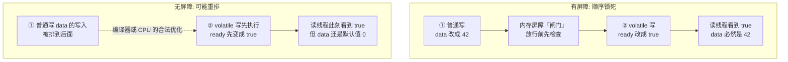
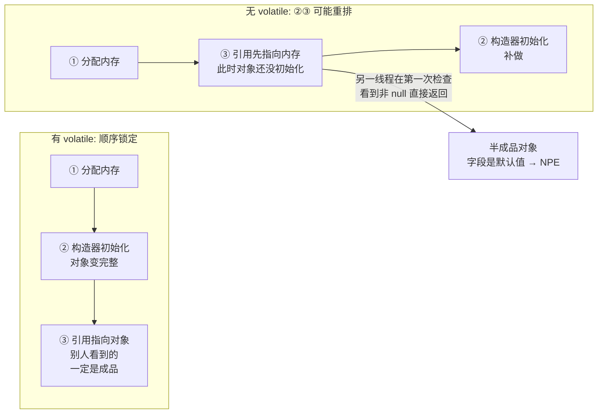
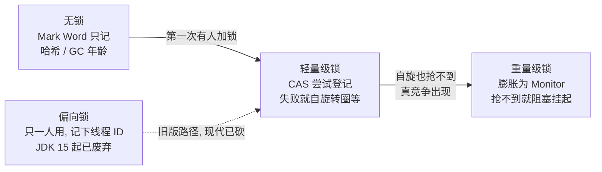
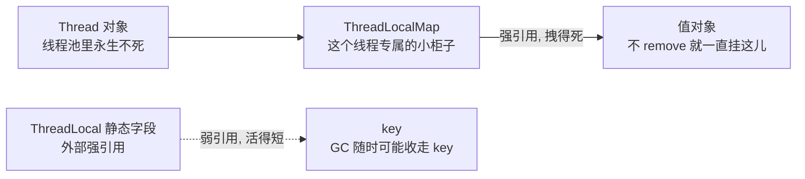

# 阶段一 · 小点 5：JMM（Java 内存模型）

> 所属：阶段一 Java 语言深化与 JVM 体系
> 定位：JMM 是并发编程正确性的理论地基。为什么 `i++` 会丢更新、为什么 DCL 单例少了 volatile 会出错、为什么「代码看着顺序执行了」但另一个线程看不到——这一讲给所有「并发玄学」一个官方答案。
>
> **重要辨析**：JMM（并发语义规范，定义 happens-before 等规则）与 JVM 内存结构（运行时数据区，第 4 讲）是**两个概念**，文档与面试中都不能混用。

## 快速入门

> 本节为「并发玄学解密前置」：先认识 JMM 为什么存在、它解决什么；「happens-before 推导、ThreadLocal 怎么泄漏」留在正文提高部分。

### 本讲核心关键词速查

| 关键词 | 一句话大白话 | 例子 |
|-|-|-|
| JMM | 定义「多线程之间变量何时可见」的规则 | 线程 A 改了变量，线程 B 什么时候能看到 |
| happens-before | JMM 的可见性承诺——「前一件事的结果，后一件事一定看得见」的排序承诺：A hb B 意味着 A 的结果对 B 可见 | 锁释放 hb 锁获取 |
| volatile | 保证可见性 + 禁止重排，**不保证原子性** | `volatile int flag` |
| 原子性（Atomicity） | 一步操作不可再分 | `i++` 不是原子（读-改-写三步） |
| 可见性（Visibility） | 一个线程的写何时对另一个线程可见 | `volatile` 保证，普通写不保证 |
| 重排序（Reordering） | 编译/CPU 为了优化打乱执行顺序 | `volatile` 可禁止部分重排 |
| 锁升级 | synchronized 从轻量级到重量级的膨胀过程 | 无锁 → 轻量级 → 重量级 |
| ThreadLocal | 线程私有的变量（各线程各存一份） | `ThreadLocal<String> traceId` |
| DCL（Double-Checked Locking，双重检查锁定） | 单例懒加载写法，必须配 volatile 防重排 | 单例懒加载 |

### 本讲在解决什么问题

- **问题**：多线程共享变量时，「A 改了、B 看不到」「`i++` 丢更新」这类并发玄学——到底为什么会发生？
- **答案**：JMM 定义了**共享变量跨线程的可见性规则**。核心是 happens-before：只要满足这条规则，A 的修改就对 B 可见；不满足，B 读到旧值很正常。
- **你要带走的一句话**：`i++` 之所以丢更新，是因为它其实是「读-改-写」三步，不是原子操作；`volatile` 能保证可见性，但不保证原子性。看到并发问题，先想「有没有 happens-before 保证」。

### 最简可运行示例（照抄能跑）

```java
// volatile 正确可见示例: 一个线程改, 主线程能立刻看到
public class VolatileDemo {
    // volatile 保证 ready 的修改对读线程"立即可见"
    private volatile boolean ready = false;
    private int data = 0;

    public void writer() {
        data = 42;          // ① 普通写
        ready = true;       // ② volatile 写 —— ① 的结果对读线程可见(happens-before)
    }

    public void reader() {
        if (ready) {        // ③ volatile 读
            System.out.println(data);   // ④ 必然看到 42
        }
    }
}
```

> 代码备注（逐行解释）：
> - `ready` 加了 `volatile`：写 `ready=true` 时，会把之前写的 `data=42`「刷到主存」，读线程看到 `ready=true` 也就能看到 `data=42`。
> - 如果 `ready` **不加** `volatile`：读线程可能看到 `ready=true` 但 `data` 还是 0——因为普通写不保证马上可见、可能被重排。
> - 这就是 JMM 的 happens-before：`data=42` happens-before `ready=true`（程序顺序），`ready=true` happens-before `ready` 的读取（volatile 规则），传递后 `data=42` 对读者可见。

### 关键概念说明

| 概念 | 干什么 | 最易踩的坑 |
|-|-|-|
| `volatile` | 可见性 + 禁重排 | **不保证原子性**，`volatile i++` 照样丢更新 |
| `synchronized` | 互斥 + 可见性（锁的 hb 规则） | 锁升级有开销；偏向锁已废弃 |
| `AtomicInteger` | 原子自增（CAS——Compare-And-Swap 比较并交换：只有内存里还是「我以为的值」才写入，否则重试，硬件级原子操作） | 单变量原子，多变量组合仍需锁 |
| `ThreadLocal` | 线程私有变量 | 记得 `remove()`，否则线程池复用会串/泄漏 |

### 常用约定 / 命名提示

- **判断并发问题**：先问「共享变量吗？（非局部变量）」→「有 happens-before 保证吗（volatile/synchronized/Atomic）？」——大多数「看不到」「丢更新」都能归到这儿。
- **JMM ≠ JVM 内存结构**：JMM 是「内存**模型**」（可见性规则），JVM 内存结构是「运行时数据区划分」（第 4 讲）——面试常考、别混。
- **线程本地变量用 ThreadLocal + finally remove**：尤其线程池里，忘了清理会串到下一个请求。

## 精简大纲

1. happens-before 规则：跨线程可见性的官方契约
2. volatile：可见性与禁用重排序（但不保证原子性）
3. DCL 单例：volatile 的经典战场
4. final 的安全发布语义
5. synchronized 锁升级（偏向锁已废弃：无锁 → 轻量级 → 重量级）
6. ThreadLocal 原理与内存泄漏

## 学习内容详情

### 1. happens-before：JMM 给的唯一契约

**happens-before**（「前一件事的结果，后一件事一定看得见」的排序承诺）：JMM 的核心规则——若操作 A happens-before 操作 B，则 A 的结果对 B 可见，且 A 排在 B 前。注意：**它定义的是「可见性承诺」，不是时间先后**。

**生活版——中央公告栏 vs 各自的草稿纸**：办公室只有一块中央公告栏（= 主内存），每个人手里有一张自己的草稿纸（= 工作内存，类似 CPU 缓存 / 寄存器那种私有小抄）。你改了一个数，先记在自己草稿纸上，并没有同步回公告栏；旁边同事抬头看公告栏，看到的还是旧值——这就是**可见性问题：你改了，他看不见**。`volatile` 的规矩：改这个数必须直接写公告栏，并向全办公室广播「这个数我改了」；`synchronized` / 锁的规矩：**只有拿到发言权（锁）的人才能上台改公告栏**，他改完下台，下一个上台的人必然看到他写下的全部内容。

**换成 Java**：普通写 = 只记在自己草稿纸上，什么时候刷回公告栏（主内存）不确定——别的线程可能读到旧值；`volatile` 写 = 直写公告栏，并让其他线程草稿纸上的旧副本作废（内存屏障 + 缓存一致性协议干的活，见下一节）；`synchronized` = 持锁线程退出同步块时把草稿内容全部「发布」到公告栏，解锁 happens-before 下一个加锁——所以锁既管互斥、又管传值。**JMM 的所有规则都在回答同一个问题：怎么安排操作顺序，才能保证「草稿纸上的内容同步回了公告栏」。**

```java
public class HappensBeforeDemo {
    private int data;                    // 普通变量
    private volatile boolean ready;      // volatile 开关

    class Writer extends Thread {
        public void run() {
            data = 42;                   // ① 普通写
            ready = true;                // ② volatile 写 —— ① happens-before ②（程序顺序规则）
        }
    }

    class Reader extends Thread {
        public void run() {
            if (ready) {                 // ③ volatile 读 —— ② happens-before ③（volatile 变量规则）
                System.out.println(data); // ④ 必然输出 42（传递性: ① hb ④）
            }
        }
    }
}
```

- 常用规则族（六条——面试常要求完整背出，每条独立成行）：
  - **程序顺序**：线程内按代码书写顺序，前一个操作 hb 后一个。
  - **监视器锁**：解锁 hb 后续对同一把锁的加锁。
  - **volatile 规则**：volatile 写 hb 后续对该变量的读。
  - **线程 start 规则**：`start()` 调用 hb 被启动线程的任何操作。
  - **线程 join 规则**：被 join 线程的所有操作 hb `join()` 返回。
  - **传递性**：A hb B 且 B hb C，则 A hb C。
- Go 迁移：channel 的「通信建立顺序」是同类保证——但 JMM 的规则按「操作对」粒度声明（锁 / volatile / final 各有条款），更细。

### 2. volatile：两件事、不做第三件事

**volatile** 的两个语义：① **可见性**——写后对其他线程立即可见，读线程看到的不是陈旧值；② **有序性**——禁止编译器和 CPU 跨越 volatile 读写做指令重排。字面好懂，难在「它底层到底怎么做到的」，见下。

#### 底层怎么做到：内存屏障 + 缓存一致性协议（MESI）

**生活版——安检与传送带**：登机口（volatile 写）是一道关卡。排在它前面要托运的行李（volatile 写之前的普通写）还没全部过完安检，登机口**不会**先放行你——**必须让前面的行李全部检查完、上了传送带，你才能过闸**。假如反着来：你先过了闸、行李还留在安检口（普通写还没落位），飞机到了对岸，接机的人看到「你到了」，行李却没到——这就是「看到标志、没看到数据」。

**换成 Java**：volatile 写就是那道关卡，volatile 读写周围会插入**内存屏障（Memory Barrier）**——安检闸口本身，一道插在指令流里的「闸门指令」。它保证两件事：

- **volatile 写之前的普通写，不能「滑」到 volatile 写之后**：必须先落对位置（把数据写进主存），再发布标志。
- **volatile 读之后的普通读，不能「滑」到 volatile 读之前**：否则读者先读数据、后读标志，读到的还是旧值。



**屏障管的是「顺序」，跨核心的「看得见」还要第二件武器**：屏障防止指令乱序，但要「改了让别的核心看得见」，还得配合 CPU 的**缓存一致性协议**（如 MESI）——两者一起干，才实现「改了就看得见」。

**MESI 白话版——草稿纸故事的「多核版」**：第 1 节说每个人手里有一张草稿纸（缓存）；换成真实多核 CPU，同一份数据可能被好几个核心各留一份副本（像办公室每人手一份打印件）。核心 A 改了这行数据，光改自己那份不够，还得**向全体广播「这行旧了」**——其他核心收到广播，把自己手里的旧副本作废，下次再读只能重新去主存抄最新值。MESI 就是协调这套流程的**四状态协议**：M 已修改 / E 独占 / S 共享 / I 失效，保证同一个变量的多份缓存副本不打架。


#### 注意：volatile 不做第三件事——不保证原子性

上面承诺的只有「可见性 + 有序性」两件事。注意它**不做第三件事——不保证原子性**：`volatile i++` 的「读-改-写」三步依旧会被交错，照样丢更新。

```java
// volatile 不保证原子性 —— 这是最高频的面试陷阱, 也是真实的丢更新 bug 来源
public class VolatileNotAtomic {
    volatile int counter = 0;

    public static void main(String[] args) throws Exception {
        var v = new VolatileNotAtomic();
        var t1 = new Thread(() -> { for (int i = 0; i < 10_000; i++) v.counter++; });
        var t2 = new Thread(() -> { for (int i = 0; i < 10_000; i++) v.counter++; });
        t1.start(); t2.start(); t1.join(); t2.join();
        System.out.println(v.counter);   // 几乎必然 < 20000!
    }
}
```

- 为什么丢：`counter++` 是「**读 → 加 1 → 写**」三步。两个线程都读到 100，各自写回 101——一次累加蒸发。**volatile 管的是「单次读/写」的可见性，管不了三步之间的原子性。**
- 正确写法：`AtomicInteger`（CAS）或加锁。
- volatile 的正确舞台：**状态标志位**（一写多读）、**DCL 防重排**（下一节）。

### 3. DCL 单例：没有 volatile 会怎样

```java
public class Singleton {
    private static volatile Singleton instance;   // volatile 不可省 —— 省了就是 bug

    private Singleton() { /* 初始化很重 */ }

    public static Singleton getInstance() {
        if (instance == null) {                   // 第一次检查: 无锁快路径
            synchronized (Singleton.class) {
                if (instance == null) {           // 第二次检查: 拿到锁后确认没被别人建过
                    instance = new Singleton();   // ⚠️ 危险的一行, 见下方拆解
                }
            }
        }
        return instance;
    }
}
```

`instance = new Singleton()` 在字节码层（字节码——Java 编译产物，JVM 执行的中间指令，相当于 JVM 的「汇编」）是三步：① 分配内存 ② 调用构造器初始化 ③ 把引用赋给 instance。volatile 的有无，是两条截然不同的时间线：



- ② 和 ③ **可能被重排序**（单线程视角无差别，JIT（Just-In-Time，运行时把热点字节码编译成机器码的编译器）合法优化）——重排后走的是下面「③ 在前」的路径。
- 重排后的另一线程在第一次检查处看到「instance 非 null 但还没初始化完」→ 拿到**半成品对象**——偶发、难复现、线上炸。
- volatile 禁止了 ②③ 重排：赋值发生在初始化之后，别人看到非 null 时一定是成品（上面「有 volatile」那条路径）。

### 4. final：安全发布的通行证

```java
// 正确构造的不可变对象: final 字段在构造器结束时对其他线程「必然可见」
public final class Money {
    private final long amount;       // final: 一旦构造完成, 任何线程通过任何路径拿到这个对象,
    private final String currency;   // 看到的都是构造完成后的值 —— 不需要额外同步
    public Money(long amount, String currency) {
        this.amount = amount; this.currency = currency;
    }
}
```

- 这是「**不可变对象天然线程安全**」的规范基础，也是 record（第 2 讲）能放心共享的底层依据。**为什么 final 有这种特权**：JMM 给构造器内 final 字段的写入安排了专属屏障——final 写不会被重排到构造器之外，任何线程拿到「构造完成」的对象，就必然看到 final 字段的最终值（唯一的例外：构造器里把 `this` 泄漏出去，即 this 逸出）。
- 边界：final 只保证**字段自身引用**的安全发布；final 指向可变对象（`final List<>`），列表**内容**的修改仍需同步。

### 5. synchronized 锁升级

**锁升级**：synchronized 不是一上来就「重量级」——按竞争程度渐进膨胀，低竞争走便宜路径。

**先认识登记牌**：每个对象自带一小块「登记信息块」（对象头里的 **Mark Word**，约十几字节）——哈希值、GC 年龄、当前锁状态都记在这块牌子上；锁升级就是这块牌子上写的「锁级别」在变。



白话流程：没人抢 → 无锁；第一个人来，用 CAS 在登记牌上快速记一笔（轻量级锁）；人多了、CAS 转圈也抢不到 → 升级成「交给内核排队」的正式机制（重量级锁）。至于「记下第一个人 ID、只让他一人免检」的偏向锁，撤销成本太高，JDK 15 起已废弃——现代升级路径只有三级（见下表）。

**为什么 synchronized 既互斥又保证可见性**：加锁 / 解锁对应 Monitor（监视器——JVM 给每个对象的锁配的「门卫」，记录谁持有锁、谁在排队）的进入 / 退出，JMM 的「监视器锁规则」规定解锁 happens-before 后续对同一把锁的加锁——解锁时线程的所有写都对拿到锁的线程可见，所以它管互斥、也顺带管传值（这正是「锁比 volatile 强在哪」的答案）。

| 阶段 | 实现 | 触发 |
|-|-|-|
| 无锁 | 对象头 Mark Word 记录哈希 / GC 年龄 | 初始状态 |
| 轻量级锁 | CAS 把 Mark Word 换成指向栈中锁记录的指针；失败则自旋 | 第一次有线程加锁、无竞争 |
| 重量级锁 | 膨胀为 Monitor（OS 互斥量），线程阻塞挂起 | CAS 自旋失败（真竞争出现） |

- **偏向锁已从 JDK 15 起废弃、默认关闭**——现代并发场景下它的「撤销成本」高于收益；现代升级路径就是上表的三级：**无锁 → 轻量级 → 重量级**（旧资料里的「偏向锁」一段直接划掉）。

> ⏸️ **短期可以不学**：Mark Word 的位级布局（哪几位存哈希、哪几位存锁记录指针）、轻量级锁 CAS 换 Mark Word 的具体字节细节——业务代码用不到，背结论就够面试。**何时回来学**：面试 JVM / 并发专项岗、或做锁相关底层优化时。**面试最低要求**：能说出升级路径「无锁 → 轻量级（CAS + 自旋）→ 重量级（Monitor）」且知道偏向锁已在 JDK 15 废弃即可。

> 🧩 **前置 30 秒：四种引用强度**——Java 的引用分四级：强引用（普通变量赋值，被它拽着 GC 永不回收）、软引用（内存不够才回收，适合缓存）、弱引用（下一次 GC 必回收，ThreadLocal 的 key 就是它）、虚引用（形同虚设只为收「死亡通知」）。记住一句话：**强引用拽得死、弱引用活得短**——ThreadLocal 泄漏的论证全靠这套词。

### 6. ThreadLocal：线程私有的便利与陷阱

#### ThreadLocal 是什么：每个线程各存一份的「专属小柜子」

**ThreadLocal**：每个线程持有一份独立变量副本，互不干扰——经典用途：数据库连接、SimpleDateFormat（线程不安全时代的产物）、请求上下文（MDC——Mapped Diagnostic Context，日志上下文映射：往日志里塞 TraceId 的工具，让同一次请求的日志能串起来，阶段二讲）。



#### 内存泄漏是怎么来的

**内存泄漏机制**（三步推演，配合上图看）：
1. key 是 ThreadLocal 的**弱引用**——ThreadLocal 外部强引用消失后，key 被 GC 回收、变成 null。
2. value 却被 Map 的强引用链吊着：Thread → Map → Entry.value，一路强引用，回收不掉。
3. **线程不死（线程池场景），value 永远可达、永远不清**——这就是慢性泄漏。

> 边界：get/set 时框架确实会顺带清理「key 已被 GC」的 Entry；但线程池里线程长存、key 也往往没失效，指望不上它——不 remove 的 value 会一直挂在线程上。

```java
public class ThreadLocalLeakDemo {
    private static final ThreadLocal<byte[]> CTX = new ThreadLocal<>();

    public static void main(String[] args) throws Exception {
        var pool = java.util.concurrent.Executors.newFixedThreadPool(4);  // 4 条"永生"线程
        for (int i = 0; i < 10_000; i++) {
            pool.submit(() -> {
                CTX.set(new byte[1024 * 1024]);   // ❌ 不 remove: 1MB 永远挂在线程的 Map 上
                // try { ... } finally { CTX.remove(); }   ← ✅ 正确姿势: 用完必须还
            });
        }
        pool.shutdown();
    }
}
```

#### 清理铁律与替代方案

- 铁律：**`try { ... } finally { threadLocal.remove(); }`**——尤其线程池 / 虚拟线程（JDK 21 的轻量级线程，一条进程能开几十万条）复用场景。
- 新代码替代：Java 25 的 `ScopedValue`（第 2 讲）——不可变 + 作用域自动清理，从根上消灭「忘 remove」。

### 坑点提醒

- **volatile 当锁用**：`if (flag) {...}` 检查后再操作 flag 仍是竞态（检查与修改之间被人插队）；volatile 标志位要求「一写多读」。
- **DCL 忘写 volatile**：编译期不报错、单测抓不到、上线偶发 NPE——三件套（volatile + 两次检查 + synchronized）一个都不能少。
- **ThreadLocal 配线程池忘 remove**：表现为内存缓慢爬升 + 偶发「上一个请求的数据串到下一个请求」——后者是**数据污染事故**，比内存更致命。
- **拿 happens-before 推「时间顺序」**：它只承诺可见性；业务上需要「先后」要靠锁 / join / CompletableFuture 等显式机制。

## 本节自检

- [ ] 能回答：`volatile int i; i++` 线程安全吗？为什么？怎么修？
- [ ] 能一句话说清 happens-before 给的是什么保证（跨线程可见性，不是时间先后）
- [ ] 能画出 ThreadLocal 引用链并指出哪条链导致泄漏，写出正确清理代码
- [ ] 能解释 DCL 单例为什么必须 volatile，重排发生在哪三步之间
- [ ] 能说出锁升级路径，并纠正「偏向锁」的过时认知

## 本节配套思考题

1. 「一写多读的标志位用 volatile，多写场景用 Atomic / 锁」——为什么一写多读是 volatile 的安全边界？多写时 volatile 会坏在哪一步？
2. MDC 的 TraceID 就是存在 ThreadLocal 里——结合线程池复用，解释为什么「上一个请求的 TraceID 串进下一个请求的日志」这类事故真实发生过，以及怎么修。
3. `record` 全是 final 字段，是不是可以不要「安全发布」的约束直接跨线程共享？它的边界条件是什么（构造器里把 this 泄漏出去会怎样）？

## 常见面试题

### Q1：volatile 能保证什么、不能保证什么？什么场景适合用它？
**答**：

**标准结论**：volatile 保证两点——① **可见性**：写后对其他线程立即可见；② **有序性**：禁止编译器和 CPU 跨越 volatile 读写重排指令。它**不保证原子性**。

**原理层**：
- 可见性的延伸：写前的普通写对读线程也可见，靠 happens-before 传递。
- 为什么危险：`volatile i++` 是「读-改-写」三步，两个线程交错执行照样丢更新。
- 实现上：volatile 读写会插入内存屏障，并依赖缓存一致性协议（MESI），保证「改了就看得见」。

**工程层**（适用 / 不适用场景）：
- 适用——状态标志位：一写多读（shutdown 标志、服务开关），写线程改、读线程检查。
- 适用——DCL 单例防重排：禁止「分配内存 → 赋值引用」被重排到「构造器初始化」之前。
- 适用——发布不可变对象（volatile 引用指向不可变对象）。
- 不适用——多写场景：改用 `AtomicInteger` / `AtomicBoolean` 或加锁。
- 不适用——复合操作：`if (flag) {...}` 检查后再修改仍是竞态窗口。

面试常考的精确表述：**volatile 保证可见性与有序性，不保证原子性**。

### Q2：happens-before 是什么？有哪些规则？与锁是什么关系？
**答**：

**标准结论**：happens-before（先行发生原则）是 JMM 定义「操作对之间可见性契约」的规则集——若操作 A happens-before 操作 B，则 A 的执行结果对 B 可见，且 A 的排列在 B 之前。注意它承诺的是**可见性与排序约束，不是时间先后**（A 可能实际更晚执行，但语义上 B 必须能看到 A 的结果）。

**原理层**（六条核心规则，面试常要求完整背出）：
- **程序顺序规则**：线程内按代码顺序，前一个操作 hb 后一个。
- **监视器锁规则**：解锁 hb 后续对同一把锁的加锁。
- **volatile 规则**：volatile 写 hb 后续对该变量的读。
- **线程 start 规则**：`start()` hb 被启动线程的任何操作。
- **join 规则**：线程的所有操作 hb `join()` 返回。
- **传递性**：A hb B 且 B hb C，则 A hb C。

**工程层**（与锁的关系 + 面试推导）：
- 与锁的关系：锁的加解锁本身构成 hb 边，所以 synchronized 同时提供互斥与可见性。
- 面试推导题（如 DCL）本质就是在找 hb 链——没有 volatile，DCL 里「instance 非 null」的读取与「初始化完成」之间没有 hb 保证。

### Q3：DCL 单例为什么必须加 volatile？不加会怎样？
**答**：

**标准结论**：DCL（Double-Checked Locking）单例里 volatile 的作用是**禁止指令重排**，防止拿到半成品对象。

**原理层**：
- `instance = new Singleton()` 在字节码层是三步：① 分配内存；② 调用构造器初始化；③ 把引用赋给 instance。
- 单线程视角下 ② 和 ③ 顺序无关紧要，JIT 就可能重排为 ① → ③ → ②。
- 此时线程 B 在第一次检查（无锁快路径）看到 instance 非 null，直接返回——但对象还没初始化完，拿到的是半成品：访问字段可能读到默认值、抛 NPE，且**偶发、难复现、上线才炸**。
- volatile 禁止 ②③ 重排后，赋值发生在初始化之后——任何线程看到非 null 就一定是成品。

**工程层**（面试延伸）：
- 现代 JDK（9+）构造器简单时，JIT 通常不会重排这一对指令；但 JMM 规范层面 volatile 仍是**必须的**——不写就是依赖未定义行为。
- 两次检查的作用不同：第一次是无锁快路径省锁，第二次保证只有一个实例被创建。

### Q4：ThreadLocal 的内存泄漏是怎么发生的？如何避免？
**答**：

**标准结论**：泄漏由引用链设计决定——每个 Thread 持有 ThreadLocalMap，Map 的 key 是 ThreadLocal 的**弱引用**，而 value 被强引用链吊着；**线程池场景线程长存，value 永远清不掉**。避免的铁律：`try { ... } finally { threadLocal.remove(); }`。

**原理层**（引用链三步推演）：
- 当 ThreadLocal 的外部强引用消失（静态字段被清理、局部变量出作用域），key 被 GC 回收变 null。
- 但 value 仍被「Thread → ThreadLocalMap → Entry.value」的**强引用链**吊着。
- 普通场景线程会死，线程一死整条链消失；**线程池场景线程长存**，value 永远可达、永远清不掉。

**工程层**（危害与治理）：
- 危害：每次请求往 ThreadLocal 塞大对象且不 remove，就是慢性内存泄漏；还伴随「上一个请求的数据串到下一个请求」的**数据污染事故**（比内存更致命）。
- 治理一：铁律 `try { ... } finally { threadLocal.remove(); }`——尤其线程池 / 虚拟线程复用场景。
- 治理二：框架虽在 get/set 时顺带清理「key 已失效」的 Entry，但 key 没失效时指望不上。
- 治理三：新代码可迁移到 Java 25 的 ScopedValue（不可变 + 作用域自动清理），从根上消灭「忘 remove」。

### Q5：synchronized 的锁升级过程？偏向锁为什么被废弃？
**答**：

**标准结论**：synchronized 的锁膨胀路径分三级，按竞争程度渐进升级：**无锁 → 轻量级锁 → 重量级锁**。

**原理层**（三级的机制）：
- **无锁**：初始状态，对象头 Mark Word 记录哈希 / GC 年龄。
- **轻量级锁**：第一次有线程竞争，CAS 把 Mark Word 换成指向栈中锁记录的指针，失败则自旋等待。
- **重量级锁**：自旋失败说明真竞争出现，膨胀为 Monitor（OS 互斥量），线程阻塞挂起、等待被唤醒。
- **设计动机**：大部分同步块竞争极低甚至无竞争，按竞争程度渐进升级——低竞争走便宜路径（CAS / 自旋），避免一上来就用昂贵的 OS 互斥。

**工程层**（面试注意）：
- 偏向锁已在 JDK 15 废弃并默认关闭：它是「消除无竞争时的 CAS」——但现代高并发场景（线程池、多核）里「撤销偏向」的成本（STW 批量重偏向）超过收益，JVM 团队直接砍掉。
- 别背旧资料里的「无锁 → 偏向锁 → 轻量级 → 重量级」四段式。
- 再补一句：锁升级解决的是「互斥成本」，与可见性无关——可见性由监视器锁的 happens-before 规则保证。
