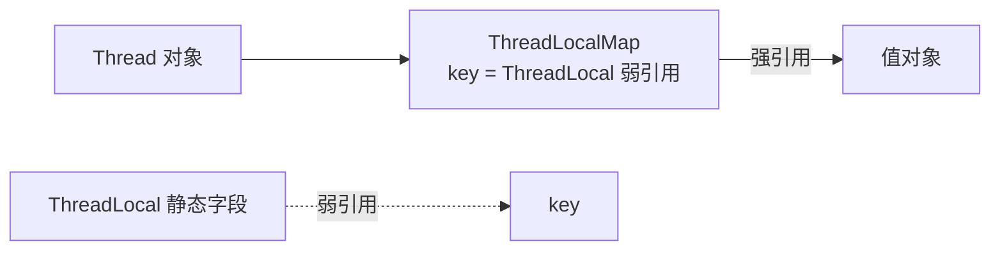

# 阶段一 · 小点 5：JMM（Java 内存模型）

> 所属：阶段一 Java 语言深化与 JVM 体系
> 定位：JMM 是并发编程正确性的理论地基。为什么 `i++` 会丢更新、为什么 DCL 单例少了 volatile 会出错、为什么「代码看着顺序执行了」但另一个线程看不到——这一讲给所有「并发玄学」一个官方答案。
>
> **重要辨析**：JMM（并发语义规范，定义 happens-before 等规则）与 JVM 内存结构（运行时数据区，第 4 讲）是**两个概念**，文档与面试中都不能混用。

## 快速入门

> 本节为「并发玄学解密前置」：先认识 JMM 为什么存在、它解决什么；「happens-before 推导、ThreadLocal 怎么泄漏」留在正文提高部分。

### 本讲核心关键词速查

| 关键词 | 一句话大白话 | 例子 |
|-|-|-|
| JMM | 定义「多线程之间变量何时可见」的规则 | 线程 A 改了变量，线程 B 什么时候能看到 |
| happens-before | JMM 的可见性承诺：A hb B 意味着 A 的结果对 B 可见 | 锁释放 hb 锁获取 |
| volatile | 保证可见性 + 禁止重排，**不保证原子性** | `volatile int flag` |
| 原子性 | 一步操作不可再分 | `i++` 不是原子（读-改-写三步） |
| 重排序 | 编译/CPU 为了优化打乱执行顺序 | `volatile` 可禁止部分重排 |
| 锁升级 | synchronized 从轻量级到重量级的膨胀过程 | 无锁 → 轻量级 → 重量级 |
| ThreadLocal | 线程私有的变量（各线程各存一份） | `ThreadLocal<String> traceId` |
| DCL | 双重检查锁定的单例写法，需要 volatile | 单例懒加载 |

### 本讲在解决什么问题

- **问题**：多线程共享变量时，「A 改了、B 看不到」「`i++` 丢更新」这类并发玄学——到底为什么会发生？
- **答案**：JMM 定义了**共享变量跨线程的可见性规则**。核心是 happens-before：只要满足这条规则，A 的修改就对 B 可见；不满足，B 读到旧值很正常。
- **你要带走的一句话**：`i++` 之所以丢更新，是因为它其实是「读-改-写」三步，不是原子操作；`volatile` 能保证可见性，但不保证原子性。看到并发问题，先想「有没有 happens-before 保证」。

### 最简可运行示例（照抄能跑）

```java
// volatile 正确可见示例: 一个线程改, 主线程能立刻看到
public class VolatileDemo {
    // volatile 保证 ready 的修改对读线程"立即可见"
    private volatile boolean ready = false;
    private int data = 0;

    public void writer() {
        data = 42;          // ① 普通写
        ready = true;       // ② volatile 写 —— ① 的结果对读线程可见(happens-before)
    }

    public void reader() {
        if (ready) {        // ③ volatile 读
            System.out.println(data);   // ④ 必然看到 42
        }
    }
}
```

> 代码备注（逐行解释）：
> - `ready` 加了 `volatile`：写 `ready=true` 时，会把之前写的 `data=42`「刷到主存」，读线程看到 `ready=true` 也就能看到 `data=42`。
> - 如果 `ready` **不加** `volatile`：读线程可能看到 `ready=true` 但 `data` 还是 0——因为普通写不保证马上可见、可能被重排。
> - 这就是 JMM 的 happens-before：`data=42` happens-before `ready=true`（程序顺序），`ready=true` happens-before `ready` 的读取（volatile 规则），传递后 `data=42` 对读者可见。

### 关键概念说明

| 概念 | 干什么 | 最易踩的坑 |
|-|-|-|
| `volatile` | 可见性 + 禁重排 | **不保证原子性**，`volatile i++` 照样丢更新 |
| `synchronized` | 互斥 + 可见性（锁的 hb 规则） | 锁升级有开销；偏向锁已废弃 |
| `AtomicInteger` | 原子自增（CAS） | 单变量原子，多变量组合仍需锁 |
| `ThreadLocal` | 线程私有变量 | 记得 `remove()`，否则线程池复用会串/泄漏 |

### 常用约定 / 命名提示

- **判断并发问题**：先问「共享变量吗？（非局部变量）」→「有 happens-before 保证吗（volatile/synchronized/Atomic）？」——大多数「看不到」「丢更新」都能归到这儿。
- **JMM ≠ JVM 内存结构**：JMM 是「内存**模型**」（可见性规则），JVM 内存结构是「运行时数据区划分」（第 4 讲）——面试常考、别混。
- **线程本地变量用 ThreadLocal + finally remove**：尤其线程池里，忘了清理会串到下一个请求。

## 精简大纲

1. happens-before 规则：跨线程可见性的官方契约
2. volatile：可见性与禁用重排序（但不保证原子性）
3. DCL 单例：volatile 的经典战场
4. final 的安全发布语义
5. synchronized 锁升级（偏向锁已废弃：无锁 → 轻量级 → 重量级）
6. ThreadLocal 原理与内存泄漏

## 学习内容详情

### 1. happens-before：JMM 给的唯一契约

**happens-before**：JMM 的核心规则——若操作 A happens-before 操作 B，则 A 的结果对 B 可见，且 A 排在 B 前。注意：**它定义的是「可见性承诺」，不是时间先后**。

```java
public class HappensBeforeDemo {
    private int data;                    // 普通变量
    private volatile boolean ready;      // volatile 开关

    class Writer extends Thread {
        public void run() {
            data = 42;                   // ① 普通写
            ready = true;                // ② volatile 写 —— ① happens-before ②（程序顺序规则）
        }
    }

    class Reader extends Thread {
        public void run() {
            if (ready) {                 // ③ volatile 读 —— ② happens-before ③（volatile 变量规则）
                System.out.println(data); // ④ 必然输出 42（传递性: ① hb ④）
            }
        }
    }
}
```

- 常用规则族：**程序顺序**（线程内操作按代码顺序 hb）、**监视器锁**（unlock hb 后续对同一把锁的 lock）、**volatile 写 hb 后续读**、**线程 start()** / **join()** 规则、传递性。
- Go 迁移：channel 的「通信建立顺序」是同类保证——但 JMM 的规则按「操作对」粒度声明（锁 / volatile / final 各有条款），更细。

### 2. volatile：两件事、不做第三件事

**volatile** 的两个语义：① **可见性**——写立即刷回主存并让其他 CPU 缓存失效，读强制从主存取最新；② **有序性**——禁止编译器和 CPU 跨越 volatile 读写做指令重排。

```java
// volatile 不保证原子性 —— 这是最高频的面试陷阱, 也是真实的丢更新 bug 来源
public class VolatileNotAtomic {
    volatile int counter = 0;

    public static void main(String[] args) throws Exception {
        var v = new VolatileNotAtomic();
        var t1 = new Thread(() -> { for (int i = 0; i < 10_000; i++) v.counter++; });
        var t2 = new Thread(() -> { for (int i = 0; i < 10_000; i++) v.counter++; });
        t1.start(); t2.start(); t1.join(); t2.join();
        System.out.println(v.counter);   // 几乎必然 < 20000!
    }
}
```

- 为什么丢：`counter++` 是「**读 → 加 1 → 写**」三步。两个线程都读到 100，各自写回 101——一次累加蒸发。**volatile 管的是「单次读/写」的可见性，管不了三步之间的原子性。**
- 正确写法：`AtomicInteger`（CAS）或加锁。
- volatile 的正确舞台：**状态标志位**（一写多读）、**DCL 防重排**（下一节）。

### 3. DCL 单例：没有 volatile 会怎样

```java
public class Singleton {
    private static volatile Singleton instance;   // volatile 不可省 —— 省了就是 bug

    private Singleton() { /* 初始化很重 */ }

    public static Singleton getInstance() {
        if (instance == null) {                   // 第一次检查: 无锁快路径
            synchronized (Singleton.class) {
                if (instance == null) {           // 第二次检查: 拿到锁后确认没被别人建过
                    instance = new Singleton();   // ⚠️ 危险的一行, 见下方拆解
                }
            }
        }
        return instance;
    }
}
```

- `instance = new Singleton()` 在字节码层是三步：① 分配内存 ② 调用构造器初始化 ③ 把引用赋给 instance。② 和 ③ **可能被重排序**（单线程视角无差别，JIT 合法优化）。
- 重排后（① → ③ → ②）的另一线程在第一次检查处看到「instance 非 null 但还没初始化完」→ 拿到一个**半成品对象**——偶发、难复现、线上炸。
- volatile 禁止了 ②③ 重排：赋值发生在初始化之后，别人看到非 null 时一定是成品。

### 4. final：安全发布的通行证

```java
// 正确构造的不可变对象: final 字段在构造器结束时对其他线程「必然可见」
public final class Money {
    private final long amount;       // final: 一旦构造完成, 任何线程通过任何路径拿到这个对象,
    private final String currency;   // 看到的都是构造完成后的值 —— 不需要额外同步
    public Money(long amount, String currency) {
        this.amount = amount; this.currency = currency;
    }
}
```

- 这是「**不可变对象天然线程安全**」的规范基础，也是 record（第 2 讲）能放心共享的底层依据。
- 边界：final 只保证**字段自身引用**的安全发布；final 指向可变对象（`final List<>`），列表**内容**的修改仍需同步。

### 5. synchronized 锁升级

**锁升级**：synchronized 不是一上来就「重量级」——按竞争程度渐进膨胀，低竞争走便宜路径。

| 阶段 | 实现 | 触发 |
|-|-|-|
| 无锁 | 对象头 Mark Word 记录哈希 / GC 年龄 | 初始状态 |
| 轻量级锁 | CAS 把 Mark Word 换成指向栈中锁记录的指针；失败则自旋 | 第一次有线程加锁、无竞争 |
| 重量级锁 | 膨胀为 Monitor（OS 互斥量），线程阻塞挂起 | CAS 自旋失败（真竞争出现） |

- **偏向锁已从 JDK 15 起废弃、默认关闭**——现代并发场景下它的「撤销成本」高于收益；现代升级路径就是上表的三级：**无锁 → 轻量级 → 重量级**（旧资料里的「偏向锁」一段直接划掉）。

### 6. ThreadLocal：线程私有的便利与陷阱

**ThreadLocal**：每个线程持有一份独立变量副本，互不干扰——经典用途：数据库连接、SimpleDateFormat（线程不安全时代的产物）、请求上下文（MDC）。



**内存泄漏机制**：key 是 ThreadLocal 的**弱引用**——ThreadLocal 外部强引用消失后 key 被 GC 回收变 null，但 value 被 Map 强引用链（Thread → Map → Entry.value）吊着；**线程不死（线程池），value 永远可达、永远不清**——线程池场景下这就是慢性泄漏。补一句边界：get/set 时框架确实会顺带清理「key 已被 GC」的 Entry，但线程池里线程长存、key 也往往没失效，指望不上它——不 remove 的 value 会一直挂在线程上。

```java
public class ThreadLocalLeakDemo {
    private static final ThreadLocal<byte[]> CTX = new ThreadLocal<>();

    public static void main(String[] args) throws Exception {
        var pool = java.util.concurrent.Executors.newFixedThreadPool(4);  // 4 条"永生"线程
        for (int i = 0; i < 10_000; i++) {
            pool.submit(() -> {
                CTX.set(new byte[1024 * 1024]);   // ❌ 不 remove: 1MB 永远挂在线程的 Map 上
                // try { ... } finally { CTX.remove(); }   ← ✅ 正确姿势: 用完必须还
            });
        }
        pool.shutdown();
    }
}
```

- 铁律：**`try { ... } finally { threadLocal.remove(); }`**——尤其线程池 / 虚拟线程复用场景。
- 新代码替代：Java 25 的 `ScopedValue`（第 2 讲）——不可变 + 作用域自动清理，从根上消灭「忘 remove」。

### 坑点提醒

- **volatile 当锁用**：`if (flag) {...}` 检查后再操作 flag 仍是竞态（检查与修改之间被人插队）；volatile 标志位要求「一写多读」。
- **DCL 忘写 volatile**：编译期不报错、单测抓不到、上线偶发 NPE——三件套（volatile + 两次检查 + synchronized）一个都不能少。
- **ThreadLocal 配线程池忘 remove**：表现为内存缓慢爬升 + 偶发「上一个请求的数据串到下一个请求」——后者是**数据污染事故**，比内存更致命。
- **拿 happens-before 推「时间顺序」**：它只承诺可见性；业务上需要「先后」要靠锁 / join / CompletableFuture 等显式机制。

## 本节自检

- [ ] 能回答：`volatile int i; i++` 线程安全吗？为什么？怎么修？
- [ ] 能一句话说清 happens-before 给的是什么保证（跨线程可见性，不是时间先后）
- [ ] 能画出 ThreadLocal 引用链并指出哪条链导致泄漏，写出正确清理代码
- [ ] 能解释 DCL 单例为什么必须 volatile，重排发生在哪三步之间
- [ ] 能说出锁升级路径，并纠正「偏向锁」的过时认知

## 本节配套思考题

1. 「一写多读的标志位用 volatile，多写场景用 Atomic / 锁」——为什么一写多读是 volatile 的安全边界？多写时 volatile 会坏在哪一步？
2. MDC 的 TraceID 就是存在 ThreadLocal 里——结合线程池复用，解释为什么「上一个请求的 TraceID 串进下一个请求的日志」这类事故真实发生过，以及怎么修。
3. `record` 全是 final 字段，是不是可以不要「安全发布」的约束直接跨线程共享？它的边界条件是什么（构造器里把 this 泄漏出去会怎样）？
