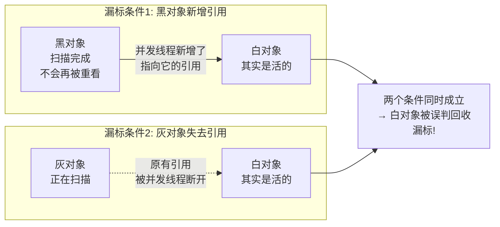

# 阶段一 · 小点 6：垃圾回收（GC）

> 所属：阶段一 Java 语言深化与 JVM 体系
> 定位：能根据业务场景选 GC，看懂 GC 日志，判断「是内存泄漏还是流量问题」。目标是工程判断力——不需要手写收集器，但要能在事故里靠日志做对决策。

## 快速入门

> 本节为「GC 速览」：先认识垃圾回收在干什么、有什么收集器；「三色标记、GC 日志怎么分叉判断」留在正文提高部分。

### 本讲核心关键词速查

| 关键词 | 一句话大白话 | 例子 |
|-|-|-|
| GC（垃圾回收） | 自动回收不再使用的对象内存 | JVM 帮你清「没人引用的对象」 |
| 堆（Heap） | 存放对象的内存区，GC 的主战场 | `new` 的对象都在堆 |
| 分代 | 按对象存活时间分成新生代/老年代分别回收 | 新对象在新生代、活得久的进老年代 |
| 可达性分析 | 从 GC Roots 出发，能连到的对象才活 | 引用链断了 = 可回收 |
| 收集器 | 具体执行回收的「引擎」 | G1（默认）/ ZGC / Shenandoah / Parallel（吞吐王） |
| 漏标 | 并发标记时把「还活着的对象」误判成垃圾（该标记的漏掉了） | 三色标记的坑 |
| GC 日志 | 记录回收事件与停顿 | `-Xlog:gc` 打开 |

### 本讲在解决什么问题

- **问题**：Java 程序对象越建越多，谁把用不到的清理掉？GC 自动做这件事，但不同业务要选不同收集器、要能看懂 GC 日志判断「是泄漏还是正常流量」。
- **你要带走的一句话**：GC 就是「自动回收没人引用的对象」。生产环境选 G1（默认）；停顿很敏感的场景选 ZGC；看日志时先问「老年代是不是只增不减」——是，多半泄漏；不是，多半是流量。

### 最简可运行示例（照抄能跑）

```java
// 触发一次 GC 的直观示例: 大量创建对象后, GC 会回收没人引用的
public class GcDemo {
    public static void main(String[] args) {
        for (int i = 0; i < 1_000_000; i++) {
            String s = new String("临时对象-" + i);   // 每次循环new, 用完没人引用
            // s 在循环结束后就不可达, 后续 GC 会回收它
        }
        System.gc();        // 显式建议回收(生产别主动调, 这里仅为演示)
        System.out.println("ok");
    }
}
```

> 代码备注（逐行解释）：
> - 循环里 `new String(...)` 每轮都造一个有引用的局部变量 `s`，但循环一结束 `s` 就不可达了。
> - 这些「没人引用」的对象就是垃圾，GC 会在合适的时机回收它们占的内存。
> - `System.gc()` 只是「建议」JVM 做一次回收，**不保证立即执行**——生产代码几乎不需要手动调，靠它反而是反模式。
> - 关键认知：**对象活着与否看「有没有从 GC Roots 出发的可达引用链」**，而不是看代码里写了什么。

### 关键概念 / 收集器说明

| 概念 / 收集器 | 干什么 | 最易踩的坑 |
|-|-|-|
| 新生代 / 老年代 | 按存活时间分两代分别回收 | 大对象直接进老年代 |
| G1（默认） | 面向服务的通用收集器，停顿可预测 | JDK 9+ 默认，大多数场景够用 |
| ZGC | 超低停顿（毫秒级），支持超大堆 | 有额外内存开销，量级没到不用换 |
| Shenandoah | 低停顿的另一个选项 | 依赖 JDK 发行版（Temurin/Corretto 等） |
| 可达性分析 | 从 GC Roots 判断对象是否存活 | 循环引用也能被正确回收（不是靠引用计数） |

### 常用约定 / 命名提示

- **怎么选 GC**：默认 G1；要秒级以下停顿 & 很大堆 → ZGC；一般业务**别过度调优**，G1 默认参数即可。
- **看 GC 日志判断**：老年代**单调增长且 Full GC 后不回落** → 泄漏；**YGC 频率暴涨但每次能回收干净** → 流量大。这是本讲最重要的工程判断。
- **容器里堆别写死**：用 `MaxRAMPercentage=75`（留 25% 给元空间/线程栈/直接内存（堆外内存，NIO 的 ByteBuffer 就住那儿）/代码缓存（JIT 编译出的机器码的存放区）），比写死 `-Xmx` 更稳。

## 精简大纲

1. 分代与回收算法的基本盘
2. 主流收集器：G1（默认）/ ZGC（分代）/ Shenandoah / Parallel（吞吐优先）
3. 三色标记与漏标（并发标记的正确性）
4. GC 日志分析：泄漏 vs 流量的分叉判断
5. 基础调优参数与心法

## 学习内容详情

### 1. 基本盘：对象何时「可回收」

- **可达性分析（Reachability Analysis）**：借书登记簿类比——图书馆有本「在借登记簿」（= GC Roots：正在运行的线程栈里的引用、静态字段（static 类级变量）、常量、JNI 引用（JNI——Java Native Interface，Java 调本地 C/C++ 代码的桥接机制；JNI 引用就是本地代码手里持有的对象引用））。管理员清库存时只认登记簿：从簿上的名字能顺着借阅记录（引用链）查到的书，都在用、不能销毁；查不到的 = 没人借阅记录的书，回收。换成 Java：从 GC Roots 出发走得到引用链的对象存活，走不到的对象即垃圾——**不是引用计数**（引用计数数「被几个人引用」，遇到循环引用（A 引用 B、B 引用 A，计数永不为 0）就成回收不了的孤岛，Python 的痛 Java 没有）。
- **分代假说（Generational Hypothesis）**：生活版——图书馆把书分「新书展示区」和「储藏室」：新书都先摆展示区，大家随手翻（对象朝生夕死，绝大多数用完就丢）；只有反复被借阅的少数老书才挪进储藏室。换成 Java：绝大多数对象朝生夕死 → 年轻代（Eden + Survivor，Minor GC（只回收年轻代的快速 GC）高频便宜）/ 老年代（活下来的少数，Major/Full GC（全堆回收，慢）低频昂贵）。

  新生代内部的流转是「复制 + 轮转」：

  ```mermaid
  flowchart LR
      N[新对象<br/>出生在 Eden] -->|Minor GC<br/>活着的复制到空区| S0[Survivor S0<br/>本轮的空区]
      S0 -->|下一轮 GC<br/>S0 / S1 角色互换| S1[Survivor S1<br/>下轮的空区]
      S0 -->|熬过默认 15 轮还活着| O[老年代<br/>长寿对象的家]
      S1 --> O
  ```

  为什么叫「复制」式回收：GC 时把 Eden 里活着的对象**复制**到空的 Survivor 区（S0 / S1 两个区交替当「空区」，总有一个是空的），复制完 Eden 整块清空——存活率低时复制成本极低，这就是 Minor GC「高频且便宜」的原因；熬过若干轮（默认 15 轮，`-XX:MaxTenuringThreshold` 可调）仍活着的对象晋升老年代。**为什么大对象直接进老年代**：新生代每次 Minor GC 都要「搬」一遍活对象，对象越大搬得越贵——大对象 = 钢琴，别放展示区，直接进储藏室（放年轻代意味着每次 GC 都要反复搬它）；G1 里超过 Region 一半的超大对象走 Humongous 区（Humongous——G1 的巨型对象区，超过 region 一半大小的对象直接进这里）。
- 回收动作的抽象：标记（谁活着）→ 整理（挪到一起消除碎片）→ 回收。**「并发」的全部难点在于：边标记边有人改引用。**
- **并发标记漏标的预演（仓库盘点故事）**：店员拿着旧名单在仓库盘点（= 标记阶段：对照名单确认每箱货是不是「在册」的活货）；但盘点同时，别的店员还在干活（= 用户线程并发改引用）——有人把货从 A 架转到 B 架（= 引用被改写），又有人往 A 架挂上新货（= 产生新引用）。名单是旧时刻的，边盘边变，就可能**漏记活货**（漏标：活对象被当垃圾）或**错记死货**。这就是并发 GC 最难的部分——下一节的三色标记 + 写屏障就是解法。

### 2. 主流收集器选型

| 收集器 | 特征 | 适用 |
|-|-|-|
| G1（默认） | 堆分 Region（把堆棋盘式切块）、可预测停顿目标（`-XX:MaxGCPauseMillis`）、并发标记 + Mixed GC（混合回收：不只年轻代，还捎带回收部分老年代 Region） | 大堆通用场景的默认选择 |
| ZGC（JDK 21 引入分代模式，JDK 23 起默认分代） | 着色指针（把标记信息编码进指针本身）+ 读屏障（每次读对象时顺带检查的哨卡指令），停顿亚毫秒且不随堆增大 | 超大堆 / 低延迟敏感（交易、实时服务） |
| Shenandoah | 与 ZGC 同代的低停顿收集器 | 低延迟备选；可用性取决于 JDK 发行版（Temurin、Corretto 等主流发行版内置；以所用发行版说明为准） |
| Parallel | 吞吐优先，全程 Stop-The-World（GC 时所有业务线程暂停）但总体回收时间最短 | 后台批处理任务（离线计算、数据仓库），能接受长停顿 |

- 一句话记住每个收集器的脾气：**G1 = 均衡全能的主流默认**（大多数场景闭眼选）；**ZGC = 花内存买超低停顿**（超大堆 + 对 P99 敏感才值得）；**Parallel = 大力出奇迹的吞吐王**（全程 STW 但总回收时间最短）；**Shenandoah = ZGC 的开源备胎**（同赛道的第二个选项）。
- 认知基线：**CMS 已死（JDK 14 移除）**（CMS——老一代低停顿收集器，JDK 14 已移除，「CMS 已死」指的就是它），现代默认 G1、低延迟上 ZGC；JDK 8 时代「Parallel 调参大全」的教程在 2026 年直接跳过。

**为什么 G1 要把堆切成 Region**：整代回收的粒度太大（要么扫整个老年代、要么整个新生代），停顿不可控；把堆切成约 2048 个 Region 后，G1 可以**只回收垃圾最多的若干 Region**（Mixed GC），停顿目标（`-XX:MaxGCPauseMillis`）才有得商量——「可预测停顿」是靠「回收量可裁剪」实现的。

> ⏸️ **短期可以不学**：ZGC 的着色指针（Colored Pointers）位级细节、读屏障的实现机制——知道「它靠读屏障换亚毫秒停顿」就够选型用了。**何时回来学**：面试 JVM 岗、或线上真的切到 ZGC 需要调它时。**面试最低要求**：能说「ZGC 用着色指针 + 读屏障实现并发回收，停顿亚毫秒且不随堆增大」即可。

> ⏸️ **短期可以不学**：Shenandoah 的原理细节——它和 ZGC 是低延迟赛道的「备胎二选一」，业务代码不会主动切到它。**何时回来学**：所用 JDK 发行版只有 Shenandoah 没有 ZGC、或面试被问两者差异时。**面试最低要求**：能说「Shenandoah 同为低停顿收集器，与 ZGC 实现路径不同（连接矩阵 + 读屏障），选型通常 ZGC 优先」即可。

### 3. 三色标记与漏标

**三色标记（Tri-color Marking）**：并发标记时给对象涂色——白（未访问）/ 灰（访问过、成员没扫完）/ 黑（扫描完成）。

> **生活版：你整理房间时，室友还在扔衣服**——你按清单给衣服归类（黑 = 已分好类不再碰、灰 = 正在分、白 = 还没碰）。可室友同时往抽屉里塞衣服 / 往外扔衣服（用户线程并发改引用）：你刚把一个抽屉标为「已整理」（黑），室友又往里面塞进一件白 T 恤——这个抽屉你认定了不复查（黑对象不会再被重看），白 T 恤就永远没人理了。换成 Java：**漏标 = 把活对象当垃圾回收**，需要下面两个条件**同时**成立：



**两种修法（两大流派）**：
- **增量更新（Incremental Update，CMS 采用）**：记「黑 → 白 新增引用」，标记结束后重新扫这些黑对象——思路直白，但要重扫，停顿长。
- **SATB（Snapshot-At-The-Beginning，原始快照，G1/ZGC 采用）**：记「灰 → 白 断开的引用」，按标记开始时的旧快照推进——不用重扫，停顿短。

- 工程层面只需记住结论：**G1/ZGC 用 SATB，代价是这一轮多留些「看似死去」的对象（下个周期再收）**——偶发一次 Mixed 回收偏多不是 bug。

### 4. GC 日志：判断「泄漏还是流量」

```bash
# 现代统一日志语法(JDK 9+): 打印 GC 类型/停顿/堆变化
java -Xlog:gc*:file=gc.log:time,uptime AppMain

# 一段典型 Young GC 日志(解读):
# [2.341s][info][gc] GC(0) Pause Young (Normal) (G1 Evacuation Pause) 24M->3M(256M) 4.218ms
#          ↑GC 序号   ↑类型      ↑原因(晋升压力等)          ↑回收前->回收后(堆总)  ↑停顿

# 一次危险的 Full GC 日志:
# [120.551s][info][gc] GC(42) Pause Full (G1 Compaction Pause) 240M->239M(256M) 1834.211ms
#                                          ↑ 回收后几乎没降 ← 关键信号! + 停顿 1.8s
```

**分叉判断（背下来）**：

| 现象 | 信号 | 下一步 |
|-|-|-|
| 疑似**内存泄漏** | 老年代单调增长、Full GC 后占用**不回落**、FGC 越来越频繁 | `jmap -dump` → MAT（Eclipse Memory Analyzer，堆快照分析工具）看支配树（Dominator Tree——MAT 里的视图：按「谁占着最大一块引用链」排对象，找泄漏元凶；细节在阶段五第 5 讲） |
| **流量 / 分配问题** | young GC 频率暴涨但每次回收干净、堆水位随 QPS 起落 | 查分配来源（火焰图——调用栈采样可视化：横轴是方法、纵轴是调用深度，越宽的条越吃 CPU/内存；alloc 模式专看内存分配）、扩容 / 限流 |

```bash
# 实时观察(不 dump): 每秒打印各代占比 + FGC 计数
jstat -gcutil <pid> 1000
# 列名图例: S0/S1 = 两个幸存者区(轮流当空区)、E = Eden(新对象出生地)、O = 老年代、M = 元空间; YGC/FGC = 年轻代/全堆 GC 次数, YGCT/FGCT = 各自累计耗时(秒)
#   S0     S1     E      O      M     YGC     YGCT    FGC    FGCT
#  0.00  98.21  45.30  88.77  31.02     342     1.20     17    9.85   ← O 持续>85% 且 FGC 涨 → 泄漏画像
```

### 5. 基础调优参数与心法

```bash
# 生产基线模板(容器内, 推荐): 用 MaxRAMPercentage 让堆随容器内存自适应 —— 别同时写死 -Xmx(后者会失效)
java \
  -XX:MaxRAMPercentage=75.0 \          # 堆占容器内存 75%: 留约 25% 给元空间/线程栈/直接内存/代码缓存
  -XX:MaxGCPauseMillis=50 \            # G1 停顿目标(不是承诺!)
  -XX:InitiatingHeapOccupancyPercent=45 \  # 老年代 45% 触发并发标记
  -Xlog:gc*:file=gc.log \
  -XX:+HeapDumpOnOutOfMemoryError \    # OOM 自动留 dump —— 事后定位的唯一门票
  -XX:HeapDumpPath=/data/dumps \
  -jar app.jar
```
> 注意：`-Xms/-Xmx` 与 `MaxRAMPercentage` **二选一**（同写则 MaxRAMPercentage 失效）。容器/K8s 推荐 `MaxRAMPercentage`（随内存上限自适应 + 留 25% 给元空间/栈/直接内存）；固定物理机想锁定堆才用 `-Xms/-Xmx`。

- **先默认值 + 看日志找证据，再动参数**；一次只改一个变量，改前留基线。
- 心法：GC 参数调的是「停顿 vs 吞吐 vs 内存」的三角平衡；分配速率过高的问题（循环 new 大对象、缓存无界）**调参治不了根**，回到第 2 讲与阶段六的代码优化。

### 坑点提醒

- **`-Xms ≠ -Xmx`**：堆动态伸缩带来周期性停顿与抖动，容器 CPU throttling（容器被 cgroup 限流 CPU——核用满了会被掐，表现为 CPU 使用率撞墙）会放大它——生产一律固定。
- **`MaxGCPauseMillis` 当硬承诺**：它是 G1 的努力目标，设太小（如 10ms）反而吞吐暴跌——G1 调优第一原则「别瞎设」。
- **只看 YGC 次数不看时长**：一次 500ms 的 Mixed 比一千次 5ms 的 Young 伤得多——监控盯停顿时间线（Grafana GC 面板），不是 GC 计数。
- **OOM 没留 dump**：`-XX:+HeapDumpOnOutOfMemoryError` 必须在生产基线参数里，否则现场没了。

## 本节自检

- [ ] 能说出默认收集器是 G1、低延迟场景换 ZGC 的理由
- [ ] 能解释三色标记漏标的两个必要条件，以及 SATB 流派大致怎么应对
- [ ] 拿到一段 GC 日志能读出：GC 类型、回收前后堆变化、停顿时长
- [ ] 能区分「老年代单调增长 + FGC 不回落」与「YGC 频率暴涨但回收干净」分别指向什么、下一步做什么
- [ ] 能默写生产 GC 基线参数模板里 HeapDumpOnOutOfMemoryError 的必要性

## 本节配套思考题

1. 「堆从 4G 扩到 16G 后，Full GC 从每次 2s 变成 8s，但次数少了」——对 RT 敏感的在线服务，这次调整算赚还是亏？该看哪个数（提示：停顿时间比 = GC 总停顿 / 总运行时间，和 P99 影响的关系（P99——99% 请求都能完成的耗时线，衡量长尾延迟的指标））？
2. 对象池 / 复用（如 StringBuilder 复用）号称减少 GC 压力——什么时候复用反而让事情更糟（老年代晋升、池本身泄漏）？
3. ZGC 的亚毫秒停顿靠读屏障换吞吐——什么类型的服务应该反过来选 Parallel GC（吞吐优先，能接受长停顿）？

## 常见面试题

### Q1：JVM 如何判断对象是否可回收？为什么不用引用计数？
**答**：JVM 用**可达性分析**判断对象存活：从 GC Roots（虚拟机栈 / 本地方法栈中的引用、静态字段引用、常量引用、JNI 引用）出发，沿引用链遍历，走不到的对象即垃圾。为什么不用引用计数：引用计数需要维护每个对象的被引用数，有两个问题——① 循环引用：A 引用 B、B 引用 A，两者计数永远不为 0，成为无法回收的孤岛；② 额外开销：每次赋值都要更新计数、还有原子操作成本。可达性分析天然免疫循环引用（从 Root 出发走不到就是垃圾，不管谁引用谁），这也是它与 Python 等引用计数语言的核心差异。工程延伸：「对象会不会被回收」只看可达性，不看代码里写了什么——局部变量出了作用域但被静态字段持有就仍活着；配合引用类型（强 / 软 / 弱 / 虚）还能实现缓存（软引用）与 ThreadLocal 的弱引用 key 设计（四种引用强度的白话版见第 5 讲 ThreadLocal 节前的「前置 30 秒」框——这里回顾一句：软引用 = 内存不够才回收，适合做缓存；弱引用 = 下一次 GC 必回收）。

### Q2：G1 和 ZGC 的区别？如何选型？
**答**：G1 是 JDK 9+ 的默认收集器，ZGC 是低延迟路线的选择。核心区别：① 回收模型——G1 把堆切成 Region，并发标记后**只回收垃圾最多的若干 Region**（Mixed GC），用「回收量可裁剪」换取可预测停顿（`MaxGCPauseMillis` 是努力目标不是承诺）；ZGC 用**着色指针 + 读屏障**实现几乎完全并发的回收，停顿亚毫秒且**不随堆大小增长**（JDK 21 引入分代模式，JDK 23 起默认分代）。② 停顿特征——G1 停顿通常几十毫秒级且随堆增大而劣化；ZGC 停顿稳定在亚毫秒，但牺牲吞吐（读屏障有运行期开销）和内存（需要额外内存装指针元数据）。③ 选型：默认 G1 覆盖绝大多数业务；超大堆（几十 GB+）+ 低延迟敏感（交易、实时服务、对 P99 敏感）上 ZGC；吞吐优先、能接受长停顿的批处理选 Parallel。面试加分：别把「ZGC 一定更好」当结论——读写路径短的服务里，ZGC 的读屏障开销可能让吞吐倒挂。

### Q3：什么是三色标记？漏标是怎么发生的？SATB 和增量更新有什么区别？
**答**：三色标记是并发标记的抽象模型：白 = 未访问、灰 = 正在访问（成员未扫完）、黑 = 扫描完成。**漏标**（把活对象当垃圾）需要两个条件同时成立：① 黑对象新增了指向白对象的引用（黑对象不会再被重扫，新引用无人发现）；② 灰对象到该白对象的路径断开（灰也扫不到它了）——白对象对所有灰色入口不可达，但实际是活的。两大修正流派：**增量更新（Incremental Update）**（CMS 采用）记录「黑 → 白新增引用」，标记结束后重新扫描这些黑对象，简单但需要重扫、停顿长；**SATB（Snapshot-At-The-Beginning，原始快照）**（G1/ZGC 采用）记录「灰 → 白断开的引用」，按标记开始时的旧快照继续推进，不用重扫、停顿短，代价是这一轮会多留一些「看似死去」的对象（下一轮再收）。工程认知：偶发一次回收量偏多不是 bug，是 SATB 的正常代价；面试要能画图讲清「黑→白新增 + 灰路径断开」的双条件。

### Q4：老年代单调增长、Full GC 不回落说明什么？怎么定位？
**答**：老年代单调增长、Full GC 后占用不回落、FGC 越来越频繁——这是**内存泄漏**的标准画像（对象只增不减，谁都回收不了）。定位三步：① 看 GC 日志确认画像（`-Xlog:gc*`，观察 Full GC 前后堆水位）；② 拿堆快照——`jmap -dump`，或靠生产基线参数 `-XX:+HeapDumpOnOutOfMemoryError` 自动留 dump；③ 用 MAT 分析支配树（Dominator Tree）——找「谁占着最大一块引用链」。常见元凶：集合只 put 不 remove、缓存无界且 key 不失效、ThreadLocal 不 remove（线程池里 value 永远可达）、监听器注册不注销、静态集合持有请求对象。与「流量大」的区分：流量是年轻代 GC 频率暴涨但每次能回收干净、堆水位随 QPS 起落（有涨有落）；泄漏是老年代只涨不落。面试延伸：调参治不了泄漏——加大 `-Xmx` 只是让泄漏慢一点，Full GC 的停顿反而更久；先找到引用链元凶再谈优化。

### Q5：GC 调优的思路和常用参数有哪些？
**答**：调优心法一句话：**先默认值 + 看日志找证据，再动参数；一次只改一个变量，改前留基线**。常用参数：① `-XX:MaxRAMPercentage=75`（容器场景：堆占容器内存 75%，留 25% 给元空间 / 栈 / 直接内存）——与 `-Xms/-Xmx` 二选一，同写则 MaxRAMPercentage 失效；② `-XX:MaxGCPauseMillis=50`——G1 停顿目标，别设太小（如 10ms），否则吞吐暴跌，G1 调优第一原则是「别瞎设」；③ `-XX:InitiatingHeapOccupancyPercent=45`——老年代占比达到该值触发并发标记；④ `-Xlog:gc*:file=gc.log`——日志是调优的输入；⑤ `-XX:+HeapDumpOnOutOfMemoryError` + `-XX:HeapDumpPath`——OOM 自动留 dump，事后定位的唯一门票。调优的本质是**停顿 vs 吞吐 vs 内存的三角平衡**：ZGC 用吞吐换停顿，Parallel 用停顿换吞吐，堆越大 Full GC 越贵。面试加分：GC 参数调不了「分配速率过高」的病（循环 new 大对象、缓存无界）——那种问题先回代码层解决；监控盯停顿时间线（Grafana GC 面板）而不是 GC 次数——一次 500ms 的 Mixed 比一千次 5ms 的 Young 伤得多。
