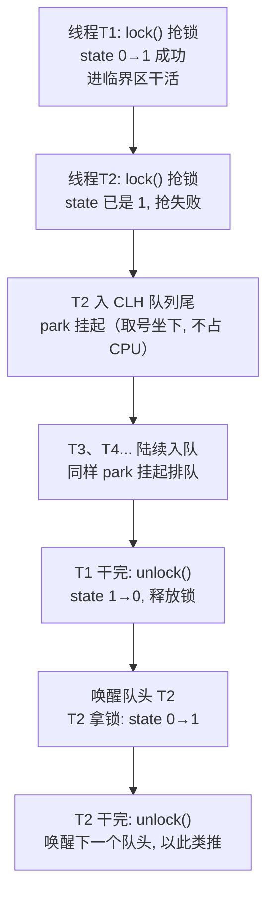
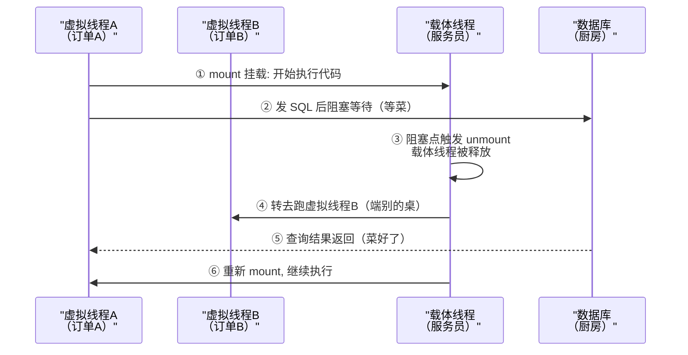
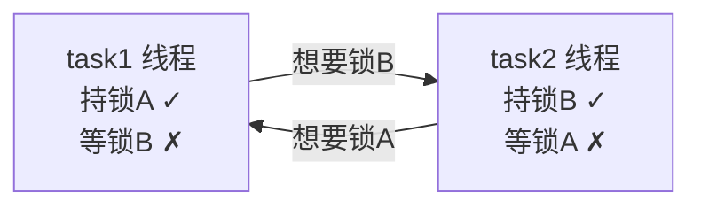

# 阶段一 · 小点 7：并发编程

> 所属：阶段一 Java 语言深化与 JVM 体系
> 定位：能写线程安全的代码；会用虚拟线程扛 IO 密集并发，并理解它不能替代 CPU 密集的并行计算。这一讲是阶段一工程价值最高的一讲——现代 Java 服务的并发骨架（池 / 组合异步 / 虚拟线程）全在这里。

## 快速入门

> 本节为「并发编程热身」：先认识几个高频并发工具怎么用、解决什么问题；「线程池参数怎么定、虚拟线程 pinning」留在正文提高部分。

### 本讲核心关键词速查

| 关键词 | 一句话大白话 | 例子 |
|-|-|-|
| 线程 | 一个「并发执行的执行单元」 | 同时处理多个请求 |
| 线程池 | 预先创建一批线程反复复用，避免频繁创建销毁 | `ExecutorService` |
| CAS | CPU 的原子「比较再交换」指令 | `AtomicInteger.incrementAndGet()` |
| AQS | JUC 锁工具的公共底座（state + 等待队列） | `ReentrantLock` / `Semaphore` |
| CompletableFuture | Java 的 Promise，异步任务组合 | 三个接口并发聚合 |
| 虚拟线程 | JVM 轻量线程，阻塞不占 OS 线程 | 扛海量 IO 并发 |
| Future | 代表「将来才有结果」的容器 | `.get()`, `.join()` |

### 本讲在解决什么问题

- **问题**：服务器要同时处理成千上万的请求，每个请求可能要去等数据库/HTTP（IO 等待）。如果每个请求占一个 OS 线程，几百个请求就能把系统拖垮；如果不用异步，等待时间又白白浪费。
- **你要带走的一句话**：**IO 密集**（等 DB/HTTP/文件）适合虚拟线程（阻塞不占 OS 线程）；**CPU 密集**（大量计算）才需要固定大小线程池（核数是硬上限）。线程池要显式参数，别用快捷工厂。

### 最简可运行示例（照抄能跑）

```java
import java.util.concurrent.*;
import java.util.concurrent.atomic.AtomicInteger;

public class ExecutorDemo {
    public static void main(String[] args) throws Exception {
        var seq = new AtomicInteger();          // 线程命名要用自增序号, 不能取调用线程 id
        // 显式创建线程池: 核心2, 最大4, 有界队列, 命名线程, 拒绝策略CallerRuns
        try (var pool = new ThreadPoolExecutor(
                2, 4, 60L, TimeUnit.SECONDS,
                new ArrayBlockingQueue<>(10),
                r -> new Thread(r, "io-pool-" + seq.incrementAndGet()),
                new ThreadPoolExecutor.CallerRunsPolicy())) {

            Future<Integer> f = pool.submit(() -> {
                Thread.sleep(500);         // 模拟 IO 等待
                return 42;
            });
            System.out.println("结果: " + f.get(3, TimeUnit.SECONDS));  // 带超时拿结果
        } // try-with-resources 自动关闭(等待任务完成)
    }
}
```

> 代码备注（逐行解释）：
> - `new ThreadPoolExecutor(2, 4, ...)`：核心线程 2、最大线程 4，显式控制。
> - `new ArrayBlockingQueue<>(10)`：**有界队列**——队列满才扩到最大线程，避免无限堆积 OOM。
> - 命名线程工厂：出问题能从线程名（`io-pool-xxx`）定位到是哪个池。
> - `CallerRunsPolicy`：队列满了让提交线程自己跑 = 反压（backpressure——下游处理不过来时向上游喊「慢点发」的机制：提交被拖慢，但任务不丢）。
> - `f.get(3, TimeUnit.SECONDS)`：**带超时**拿结果，避免下游卡死永久挂起。

### 关键工具 / 类说明

| 工具 / 类 | 干什么 | 最易踩的坑 |
|-|-|-|
| `ThreadPoolExecutor` | 显式线程池（七参数） | 别用 `Executors.newFixedThreadPool`（无界队列会 OOM） |
| `CompletableFuture` | 异步任务组合 | 不指定执行器会占用公共 ForkJoinPool，IO 阻塞会饿死它 |
| `AtomicInteger` | 原子自增 | `i++` 不原子；`volatile` 不解决原子性 |
| `ReentrantLock` | 可重入锁 | 必须 `finally` 解锁；虚拟线程下比 synchronized 更友好 |
| `Thread.startVirtualThread` | 开虚拟线程 | 零散任务用；批量用 `newVirtualThreadPerTaskExecutor` |

### 常用约定 / 命名提示

- **线程池红线**：有界队列 + 命名线程工厂 + 明确拒绝策略；**别用** `newFixedThreadPool` / `newCachedThreadPool`（堆积 OOM / 线程数失控）。
- **`Future.get()` 必须带超时**：不加超时，下游一卡就永久挂起。
- **虚拟线程别池化**：它廉价、用完即弃，用平台线程的「复用」心智管它是反模式。

## 精简大纲

1. CAS 与 Atomic 类：硬件级原子操作
2. AQS：JUC 一切锁工具的公共底座
3. 线程池：显式参数设计与拒绝策略
4. CompletableFuture：异步任务组合
5. 虚拟线程（Project Loom）：IO 密集并发的新答案
6. 并发事故排查实战：死锁 / 线程池拒绝 / CPU 飙高的定位范式

## 学习内容详情

### 1. CAS 与 Atomic 类

- **CAS（Compare-And-Swap）**：CPU 提供的原子指令——「我认为这个值是 A，如果是就改成 B，否则失败告诉我」。它是 Java 无锁编程的地基。
- 对比迁移：与 JS 里「乐观更新然后重渲染」的思路同宗——先假设没人改过，改的时候发现被人改了就重来。

```java
import java.util.concurrent.atomic.AtomicInteger;
import java.util.concurrent.atomic.LongAdder;

public class CasDemo {
    // AtomicInteger: 内部用 Unsafe(JDK 内部直通底层指令的后门类, 业务代码别碰)的 compareAndSetInt 实现, 单线程竞争下开销极小
    private final AtomicInteger count = new AtomicInteger(0);

    public void increment() {
        int old;                       // CAS 自旋: 拿旧值 → 算新值 → 原子替换(失败重试)
        do {
            old = count.get();         // 读当前值
        } while (!count.compareAndSet(old, old + 1)); // 替换失败说明有并发修改, 重来
    }

    public static void main(String[] args) {
        CasDemo d = new CasDemo();
        d.increment();
        System.out.println(d.count.get()); // > 1
    }
}
```

- **CAS 的三个坑**：ABA 问题（值从 A→B→A，CAS 认为没变过——生活版：你离开座位去打水，回来看到奶茶还在，以为没人动过，其实被人喝掉又倒了一杯同款；`AtomicStampedReference` 用版本号解——版本号就是杯套上的序号，序号变过就知道被动过了）、自旋开销（竞争激烈时空转烧 CPU）、只能保证单变量原子（多变量仍要加锁）。
- **LongAdder**：高并发计数用 `LongAdder` 替代 `AtomicLong`——把一个热点值拆成多个 Cell 分散竞争，`sum()` 时再合并（弱一致但快，监控计数场景首选）。

### 2. AQS：JUC 的公共底座

- **AQS（AbstractQueuedSynchronizer——并发锁工具的公共底座）**：`ReentrantLock` / `Semaphore` / `CountDownLatch` 全构建在它之上。核心就两样：一个 `volatile int state`（语义由子类定义——锁的占用 / 许可数 / 倒计数）+ 一条 CLH（Craig–Landin–Hagersten，一种「先到先服务」的排队纪律）等待队列——获取失败的线程不自旋空转，而是**挂起（park——线程暂停执行，像停车入库一样不占 CPU）排队**，释放时唤醒队头；把「等锁」从烧 CPU 变成让出 CPU，这是 AQS 能扛高并发争抢的关键设计。

**生活版（银行取号机）**：柜台前只有一台取号机。办业务先按一下抢号（抢 `state`）：抢到了直接去柜台；没抢到，你不会挤在柜台前反复问「到我没」（= 自旋空转烧 CPU），而是**取号坐下刷手机**（= park 挂起，不占资源），等叫号轮到你才起身。有人办完离开时叫下一个号（= 释放锁唤醒队头）——「先到先服务」，这就是 CLH 队列的排队纪律。

**换成 Java**：`lock.lock()` = 按取号机（state 的 CAS 0→1），抢失败 = 没取到号，线程 park 挂起进 CLH 队列；`lock.unlock()` = 办完业务叫号，唤醒队头线程。对比一下：自旋 = 挤在柜台前反复问「到我没」（CPU 空转），park = 取号坐下刷手机（不占资源）——这就是 AQS 选「排队挂起」而不是「原地自旋」的原因。

> 一点直觉：**上下文切换**（保存当前线程现场、换成另一个线程来跑）有固定成本。park 挂起虽然要多花两次切换（挂起一次、唤醒一次），但锁竞争激烈时，总开销远低于自旋几万次空转——「挂起排队」有时比「原地自旋」更划算，关键就在这。

```java
import java.util.concurrent.locks.ReentrantLock;

public class AqsUserDemo {
    // ReentrantLock = AQS 的 state: 0=没人锁, >0=重入次数
    private final ReentrantLock lock = new ReentrantLock();
    private int balance = 100;

    public void deduct(int amount) {
        lock.lock();                   // state CAS 0→1; 失败则进 AQS 队列挂起
        try {
            balance -= amount;         // 临界区(被锁保护的代码段): 可见性由 state 的 volatile 写保证
        } finally {
            lock.unlock();             // 必须 finally! state 1→0 并唤醒队头线程
        }
    }
}
```



> 读图：上半条链是「抢锁—排队」，下半条链是「释放—唤醒」；`D → E` 一条边把两条链接成循环——释放一次唤醒一个队头，周而复始。

- 掌握层次：会上面三个工具类 + 能讲清「state 的 CAS 修改 + 获取失败的线程入队挂起」即可，AQS 源码精读排在 08-学习时间规划的贯穿任务里。

> ⏸️ **短期可以不学**：AQS 源码逐行精读（CLH 队列的入队/出队、`acquireQueued` 对中断与超时的处理）投入产出比低——业务代码只消费 `ReentrantLock` / `Semaphore` 的 API，不会碰到它。**何时回来学**：面试 JUC 锁方向，或要自己实现同步器时。**面试最低要求**：能说清「`volatile int state` 的 CAS 修改 + 获取失败的线程入 CLH 队列挂起、释放时唤醒队头」即可。

### 3. 线程池：显式参数设计

- **线程池**：预先创建一组线程反复复用，避免「每任务建线程」的创建销毁开销——概念上等价 Node 的 Worker 池或 Go 的 goroutine 调度，但 Java 平台线程（普通线程，1:1 对应一条操作系统线程，约 1MB 栈、创建销毁都贵）是重资源，必须池化。

```java
import java.util.concurrent.*;
import java.util.concurrent.atomic.AtomicInteger;

public class PoolFactory {
    public static ThreadPoolExecutor ioPool() {
        return new ThreadPoolExecutor(
            8,                                      // corePoolSize: 常驻线程(承担稳态流量)
            16,                                     // maximumPoolSize: 队列满后才扩到上限(救急)
            60L, TimeUnit.SECONDS,                  // 非核心线程空闲 60s 回收
            new ArrayBlockingQueue<>(200),          // 有界队列! 无界队列会 OOM 而不是拒绝
            new ThreadFactory() {                   // 命名工厂: 出问题能从线程名定位到池
                private final AtomicInteger seq = new AtomicInteger();
                public Thread newThread(Runnable r) {
                    return new Thread(r, "io-pool-" + seq.incrementAndGet());
                }
            },
            new ThreadPoolExecutor.CallerRunsPolicy() // 拒绝策略: 让提交线程自己跑 → 天然反压
        );
    }
}
```

- **七个参数一张餐厅用工表**：把线程池想象成一家餐厅——

| 参数 | 餐厅类比 | 技术含义 |
|-|-|-|
| `corePoolSize` | 正式工——没客人也养着，工资照发 | 常驻线程，覆盖稳态流量 |
| `maximumPoolSize` | 旺季临时工——忙不过来才招，闲了就辞退 | 队列满后才扩到的救急线程 |
| `workQueue`（有界队列） | 门口排号凳——正式工+临时工都满，客人先坐着等 | 任务先入队排队，不直接拒绝 |
| `keepAliveTime` | 临时工试用期——多久没活干就辞退 | 非核心线程空闲回收时间 |
| `ThreadFactory` | 工牌——每个员工有编号，出了事知道找谁 | 线程命名，日志能定位到池 |
| `RejectedExecutionHandler` | 客满立牌「本店已满」——劝退（Abort），或让顾客自己端菜（CallerRuns） | 队列和线程全满时的处理策略 |

> 一句话串起执行流程：正式工先干活 → 忙不过来客人门口等（进队列）→ 等的人太多才招临时工 → 连等的位置都没了才立牌拒客。

- **参数怎么定**：CPU 密集 ≈ `核数 + 1`；IO 密集 ≈ `核数 × (1 + 等待时间/计算时间)`——起点估算，最终靠压测修正。
  - **代入算一遍**：8 核机器、任务等数据库/HTTP 花 90ms、本地计算花 10ms（比值 = 9）→ `8 × (1 + 9) = 80`，线程池 80 线程起步。
  - **核数怎么查**：`Runtime.getRuntime().availableProcessors()`——上线前打印出来核验一遍，别拍脑袋。
  - **为什么比值越大线程可以越多**：线程等 IO 时 CPU 是闲着的，多开线程就是拿这段「空等」去填别的任务；比值越大说明「空等」越久，能并行开的线程就越多。
- **拒绝策略选型**：`CallerRuns`（反压减速——调用者线程（比如 Tomcat 工作线程，Tomcat 是 Java 最主流的 Web 服务器，每个 HTTP 请求占一条工作线程，细节阶段二展开）自己执行任务，等于把压力反弹给上游；上游吞吐被拖慢是特性而非缺陷，选它就是选反压）/ `Abort`（抛异常，默认）/ `Discard`（静默丢，生产慎用）。
- **工程红线**：不用 `Executors.newFixedThreadPool`（内部是无界 `LinkedBlockingQueue`，堆积到 OOM）与 `newCachedThreadPool`（最大线程 `Integer.MAX_VALUE`），一律显式 `new ThreadPoolExecutor(...)`。

### 4. CompletableFuture：异步任务组合

> 🧩 **前置 30 秒：公共 ForkJoinPool 是什么**——JVM 自带的全局默认线程池：整个进程只有一份、线程数约等于 CPU 核数，设计初衷是跑「短平快的计算任务」。类比公司唯一一台共享打印机：谁拿去打几百页（IO 阻塞任务），全公司的打印任务（所有未指定执行器的异步任务 + 并行流）都得排队——这就是「饿死公共池」。前端对照：类似 Node 的 libuv 内置线程池——全进程共享、默认都在用。细节在阶段二（线程模型与并行流）展开。

- **CompletableFuture**：Java 版 Promise——一个「将来才有值」的容器，可链式组合、可聚合、可兜底。与 `async/await` 的差异：没有语法糖，靠链式调用，且**必须显式指定执行器**（不传则走公共 ForkJoinPool，IO 阻塞会饿死它）。

```java
import java.util.concurrent.*;

public class AggregateDemo {
    public static void main(String[] args) throws Exception {
        // 遵循全讲红线: 不用 Executors 快捷工厂, 一律显式 new ThreadPoolExecutor
        try (var pool = new ThreadPoolExecutor(
                3, 3, 0L, TimeUnit.MILLISECONDS,
                new ArrayBlockingQueue<>(100),                     // 有界队列: 无界会 OOM
                r -> new Thread(r, "agg-io-" + System.nanoTime()), // 命名线程工厂: 日志可定位
                new ThreadPoolExecutor.AbortPolicy())) {           // 显式执行器: IO 任务别占公共池
            var user  = CompletableFuture.supplyAsync(() -> fetchUser(), pool);   // 发起异步任务
            var order = CompletableFuture.supplyAsync(() -> fetchOrder(), pool);
            var point = CompletableFuture.supplyAsync(() -> fetchPoint(), pool);

            String result = CompletableFuture
                .allOf(user, order, point)                   // allOf: 等三路全部完成(≈ Promise.all)
                .thenApply(v -> {                            // 完成后聚合(≈ .then)
                    return user.join() + " | " + order.join() + " | " + point.join();
                })
                .exceptionally(e -> {                        // 兜底: 任何一路失败走这里(≈ .catch)
                    return "降级: 部分数据不可用 " + e.getMessage();
                })
                .get(5, TimeUnit.SECONDS);                   // 带超时的最终等待

            System.out.println(result);
        }
    }
    static String fetchUser()  { return "用户:u1"; }
    static String fetchOrder() { return "订单:o1"; }
    static String fetchPoint() { return "积分:100"; }
}
```

- 常用组合：`thenApply`（转换，同步） / `thenCompose`（串联两个异步，≈ flatMap） / `thenCombine`（两路合并） / `anyOf`（任一完成，≈ Promise.race） / `orTimeout`（超时）。

### 5. 虚拟线程（Project Loom）

- **虚拟线程**：JVM 调度的轻量线程——阻塞它不占用 OS 线程（JVM 会释放载体线程——背着虚拟线程跑代码的那条平台线程——去跑别的虚拟线程），因此「一请求一线程」的同步写法也能扛海量并发。
- 适用与不适用（**必背**）：**IO 密集**（等数据库 / HTTP / 文件）用虚拟线程；**CPU 密集**的并行计算它帮不了你（核数是硬上限，该用并行流 / 固定大小池）。
- **两种入口怎么选**：`Thread.startVirtualThread` 适合零散任务；批量任务首选 `Executors.newVirtualThreadPerTaskExecutor()`——它提供统一 `close()` 等待全部完成，生命周期可控。

**生活版（服务员端多桌订单）**：餐厅里服务员（载体线程）同时照看多桌客人。A 桌点完菜在等厨房出菜（阻塞），服务员不会举着点单机干站在 A 桌旁等——而是先去 B 桌记新单（unmount：释放载体线程去跑别的虚拟线程）；A 桌菜好了再端过去（唤醒后重新挂载）。

**换成 Java**：虚拟线程 = 一桌订单（一个任务），载体线程 = 服务员（平台线程）。虚拟线程遇到 `Thread.sleep()`、等数据库、等 HTTP 这类阻塞点时，JVM 把它从载体线程上卸载（unmount），载体线程转去跑别的虚拟线程——这就是「阻塞不占 OS 线程」；数据回来后，JVM 再把虚拟线程挂载（mount）回某个空闲载体线程继续跑。



```java
import java.time.Duration;
import java.util.concurrent.*;

public class VirtualThreadDemo {
    public static void main(String[] args) throws Exception {
        // 写法一: 直接创建(JDK 21+), 不需要池化 —— 虚拟线程廉价, 用完即弃
        Thread.startVirtualThread(() -> {
            try { Thread.sleep(100); }        // 阻塞点: JVM 自动释放载体线程, 不占 OS 线程
            catch (InterruptedException ignored) {}
        });

        // 写法二: ExecutorService 形态(兼容既有代码), 每任务一个新虚拟线程
        try (var executor = Executors.newVirtualThreadPerTaskExecutor()) {
            for (int i = 0; i < 10_000; i++) {            // 一万个并发任务: 平台线程早爆了
                int id = i;   // 复制一份: lambda 只能捕获不再改值的变量(effectively final), 不能直接用循环变量 i
                executor.submit(() -> {
                    Thread.sleep(Duration.ofMillis(200));  // 模拟 IO 等待
                    return "task-" + id + " done";
                });
            }
        } // close() 隐式等待全部完成
        System.out.println("10000 个 IO 任务全部完成");
    }
}
```

#### 5.1 Pinning：虚拟线程的头号坑

```java
import java.util.concurrent.locks.ReentrantLock;

public class PinningDemo {
    private static final ReentrantLock LOCK = new ReentrantLock();

    // ❌ badIo: synchronized 块内阻塞会让虚拟线程被"钉"在载体线程上(详见下方 Pinning 说明)
    // 这里故意用 synchronized(this) + wait 示意"在锁内阻塞", 意在展示 pinning 现象, 非业务推荐写法
    synchronized void badIo() throws Exception {
        wait();               // ❌ wait 必须持有 this 的锁(同步方法锁的是 this), 此处示意锁内阻塞
    }                         //    虚拟线程在锁内阻塞 → 载体线程无法释放, 并发能力退化回平台线程模型

    void goodIo() throws Exception {
        LOCK.lock();          // ✅ ReentrantLock 的阻塞会被 JVM 正确 unmount, 载体线程照常释放
        try { Thread.sleep(100); } finally { LOCK.unlock(); }
    }
}
```

- **Pinning（钉住）**：在 `synchronized` 块内执行阻塞操作时，虚拟线程无法从载体线程上卸载——热点路径用 `ReentrantLock` 替代 `synchronized` 可规避。JDK 24 起 `synchronized` 块内阻塞不再 pin 虚拟线程（JEP 491）；目前仍会 pin 的主要是 JNI/native 调用中的阻塞——新代码不用为 pinning 焦虑，老代码（Java 23-）才要警惕。
- **不要池化虚拟线程**：它是廉价的一次性资源，用平台线程的「复用」心智去管理它是反模式。
  - **生活版**：服务员（平台线程）是稀缺资源所以要复用——客人等菜时他不闲着，去招呼别的桌；而订单（虚拟线程）不是资源，随用随撕，用完扔掉即可，没有「回收再用」的必要。
  - **换成 Java**：虚拟线程创建/销毁开销接近零（不分配 1MB 栈、不占内核线程），池化省下的创建成本，远低于池本身的排队、复用管理开销——这就是官方「不要池化」的原因。

### 6. 并发出事排查实战（怎么写对之后，怎么查对）

> 前面讲「怎么写对」，本节讲「线上并发出事后怎么查」。步骤配合阶段五第 5 讲的 jstack/Arthas 工具，这里补三个最常见的**并发事故定位范式**。

#### 6.1 死锁：互相等待，谁都动不了

```java
// 典型死锁: 两个线程各自持一把锁, 又等对方那把
public class DeadlockDemo {
    private static final Object LOCK_A = new Object();
    private static final Object LOCK_B = new Object();

    public static void task1() {
        synchronized (LOCK_A) {              // ① 拿到 A
            try { Thread.sleep(100); } catch (Exception e) {}
            synchronized (LOCK_B) { }        // ② 还想拿 B —— 此时 task2 已拿 B 等 A
        }
    }
    public static void task2() {
        synchronized (LOCK_B) {              // ① 拿到 B
            try { Thread.sleep(100); } catch (Exception e) {}
            synchronized (LOCK_A) { }        // ② 还想拿 A —— 和 task1 互相等, 卡死
        }
    }
}
```

**生活版（走廊相遇）**：两个人各端着一盘汤，从走廊两头往里走，面对面卡住。你端着汤（持锁 A）没法侧身让路，可对方也端着汤（持锁 B），同样让不了。你等对方先让，对方等你先让，谁都不肯放下手里的汤（谁也不释放锁），就这么干站着。死锁就是这种循环等待：两个线程各持一把锁、又都等对方那把，谁都不退。



> 图中两条箭头互相指着对方 = 成环；环没有出口 = 死锁。

```bash
# 定位死锁: 抓线程栈, 搜 "Found one Java-level deadlock"
jstack <PID>  | grep -A30 "deadlock"        # 会直接告诉你哪两个线程、各卡在哪个锁
```

> 排查要点（逐条解释）：
> - 死锁 = 两个线程**互相持有对方要的锁**，谁都不释放。症状是**线程卡死、CPU 不高**（都在等锁，空转）。
> - `jstack` 里搜 `deadlock`，JVM 会直接给出「线程 A 持锁 X 等锁 Y、线程 B 持锁 Y 等锁 X」的成环证据。
> - **根治**：① 按固定顺序加锁（所有人先拿 A 再拿 B，就没环）；② 用 `tryLock(超时)`，拿不到就放弃重试，别无限等。这是死锁的标准解法。

#### 6.2 线程池拒绝：任务堆不下了

```bash
# 现象: 日志刷 "Task rejected from ..." / "RejectedExecutionException"
# 排查三步:
jstack <PID> > dump.txt
grep -i "reject\|pool-" dump.txt            # ① 找拒绝策略与线程池名
jstat -gcutil <PID> 1000                    # ② 看 GC / 内存是否把线程池挤满
```

> 排查要点：
> - **现象**：`RejectedExecutionException`——任务提交被拒。通常是有界队列满 + 线程都忙。
> - **原因**：要么任务量超过处理能力（下游慢/并发高），要么**无界队列 OOM**（`newFixedThreadPool` 的坑），要么线程里**阻塞占着不还**（如 `Future.get()` 无超时、DB 连接池耗尽）。
> - **判断方向**：先看是「真量太大」（需扩容/削峰）还是「假堵」（某个下游卡死拖住线程）。看日志里拒绝前的**卡点**在哪。

#### 6.3 CPU 飙高：自旋 / 死循环 / GC

```bash
# 现象: top 显示某进程 CPU 100%
top -Hp <PID>            # ① 看哪个线程 CPU 高, 记 TID
printf "%x\n" <TID>     # ② TID 转 16 进制(匹配 jstack 的 nid)
jstack <PID> > dump.txt
grep -A30 "0x<nid>" dump.txt    # ③ 看这个线程卡在哪段代码
```

> 排查要点：
> - **CPU 高 ≠ 线程多**。三个常见来源：**死循环/大计算**（代码问题）、**自旋 CAS**（竞争激烈）、**频繁 GC**（对象狂分配）。
> - 用 `top -Hp` 定位到具体线程，`jstack` 看它卡在哪——若卡在 `byte[]` 分配/GC 线程 = 内存分配太快；若卡在业务 while 循环 = 代码 bug。
> - 关键区分：**死锁 CPU 不高**（等锁）、**CPU 高是算/转**（自旋/循环/GC）——这两类事故症状相反，别混。

### 坑点提醒

- `volatile` 不是锁：它只保证**可见性**（写后其他线程立即能看到）与**有序性**（禁止指令重排），**不保证原子性**——`volatile int i; i++` 是读-改-写三步，依旧丢更新，改用 `AtomicInteger`。
- `CompletableFuture` 不指定执行器 → 公共 ForkJoinPool 被阻塞任务占满，全应用异步任务排队。
- 线程池无界队列 + `Discard` 拒绝策略 = 任务静默丢失，出问题时连日志都没有。
- 虚拟线程里跑 CPU 密集任务：不会更快，只会把调度开销加上去。
- `Future.get()` 不带超时：下游卡死你就永久挂起，生产代码一律带 `timeout`。

## 本节自检

- [ ] 能回答：虚拟线程适合 IO 密集还是 CPU 密集？为什么在 synchronized 块内执行阻塞操作可能导致 pin 住载体线程？
- [ ] 能默写 `ThreadPoolExecutor` 七参数并解释有界队列 + 命名工厂的必要性
- [ ] 能用 `CompletableFuture.allOf` + `exceptionally` 实现三路并发调用 + 单路失败兜底
- [ ] 能说清 AQS 的「state + 等待队列」模型，以及哪些 JUC 类构建在它之上
- [ ] 能列出 CAS 的三个问题与对应缓解手段

## 本节配套思考题

1. 200 个并发请求打到一个 `core=8 / queue=200 / 拒绝策略=Abort` 的线程池，第 209 个请求会发生什么？换成 `CallerRuns` 呢（提示：想想 Tomcat 工作线程被占用后的连锁反应）？
2. `thenApply` 与 `thenCompose` 都能接 lambda，什么场景必须用 `thenCompose`？（提示：想象两层嵌套的 `CompletableFuture<CompletableFuture<T>>`）
3. 为什么官方说「不要池化虚拟线程」？平台线程池解决的成本问题，在虚拟线程上还存在吗？

## 常见面试题

### Q1：线程池的七个参数分别是什么？核心线程数怎么定？实际项目里你遇到过哪些坑？

**答**：`ThreadPoolExecutor` 七参数：corePoolSize（核心线程）、maximumPoolSize（最大线程）、keepAliveTime + TimeUnit（非核心线程空闲存活时间）、workQueue（任务队列）、threadFactory（线程工厂）、RejectedExecutionHandler（拒绝策略）。执行流程是「先占满核心线程 → 任务进队列 → 队列满才扩到最大线程 → 队列和线程都满才触发拒绝策略」。核心线程数估算：CPU 密集 ≈ 核数 + 1（避免线程切换浪费 CPU）；IO 密集 ≈ 核数 ×（1 + 等待时间/计算时间）——起点只是估算，最终靠压测修正。工程红线：不用 `Executors.newFixedThreadPool` / `newCachedThreadPool`（无界队列 OOM、最大线程数失控），必须显式 `new ThreadPoolExecutor`，配**有界队列 + 命名线程工厂 + 明确拒绝策略**；`CallerRuns` 适合愿意接受反压的场景（调用方线程执行任务，把压力反弹给上游），`Abort` 是默认（抛异常要接住），`Discard` 静默丢任务生产慎用。常见误区：把核心线程数设成「并发请求数」——请求是瞬时的，稳态在线数才是核心线程该覆盖的；以及 `Future.get()` 不带超时，下游一卡整个池被拖死。

### Q2：volatile 和 synchronized 有什么区别？volatile 能保证线程安全吗？

**答**：不能。volatile 保证两条：**可见性**（写 volatile 变量立即刷主存，其他线程读时失效缓存重新加载）和**有序性**（禁止指令重排，防止「对象已发布但构造未完成」这类问题），但**不保证原子性**——`volatile int i; i++` 是读-改-写三步，两个线程同时执行依旧丢更新。synchronized 三者都保证：进入/退出监视器（Monitor）建立 happens-before 关系（可见性），并发的读-改-写被互斥串行化（原子性），同步块内外的重排被限制（有序性）。所以「多线程计数器」用 `AtomicInteger`（CAS），「单标志位可见」用 volatile（如状态开关、双重检查锁里的 instance 字段），「一段复合操作要互斥」用 synchronized / `ReentrantLock`。工程误区是「加了 volatile 就安全」——它管的是「看得见」和「不乱序」，管不了「两步操作之间别人插进来」。

### Q3：虚拟线程和平台线程有什么区别？为什么说它不能替代 CPU 密集的并行计算？

**答**：平台线程是 1:1 映射到 OS 线程的重资源（约 1MB 栈 + 内核调度实体）；虚拟线程（Project Loom，JDK 21 正式版）是 JVM 调度的轻量线程，阻塞时 JVM 会把载体线程释放去跑别的虚拟线程，因此「一请求一线程」的同步写法也能扛海量 IO 并发。但虚拟线程只是**把阻塞变得廉价**，并没有增加 CPU 核数——CPU 密集任务不需要等待，虚拟线程的挂载/卸载调度反而变成纯开销，此时该用并行流 / 固定大小线程池（核数是硬上限）。工程要点：虚拟线程不要池化（用完即弃）、`synchronized` 块内阻塞在 JDK 24 前会 pin 住载体线程（热点路径用 `ReentrantLock` 规避）、批量任务用 `Executors.newVirtualThreadPerTaskExecutor()` 统一生命周期。判断标准一句话：**在等（IO）用虚拟线程，在算（CPU）用并行计算**。

### Q4：CAS 的原理是什么？它有什么问题，怎么解决？

**答**：CAS（Compare-And-Swap）是 CPU 提供的原子指令：「我认为内存值是 A，如果是就改成 B，否则失败并返回当前值」。`AtomicInteger` 底层就是 `Unsafe.compareAndSetInt` 循环重试——拿旧值 → 算新值 → CAS 替换，失败说明有并发修改，重来。三个经典问题：① **ABA**——值 A→B→A，CAS 以为没人动过，用 `AtomicStampedReference`（带版本号）解决；② **自旋开销**——竞争激烈时空转烧 CPU，`LongAdder` 把单热点拆成多个 Cell 分散竞争；③ **只能保证单变量原子**——多变量要加锁或装进一个对象用 `AtomicReference`。与锁的取舍：CAS 无上下文切换、无死锁，适合轻量短临界区；但临界区长、竞争激烈时，锁（让出 CPU + 排队）反而吞吐更高——生产上「计数用 Atomic/LongAdder，复合操作用锁」是常见分工。
