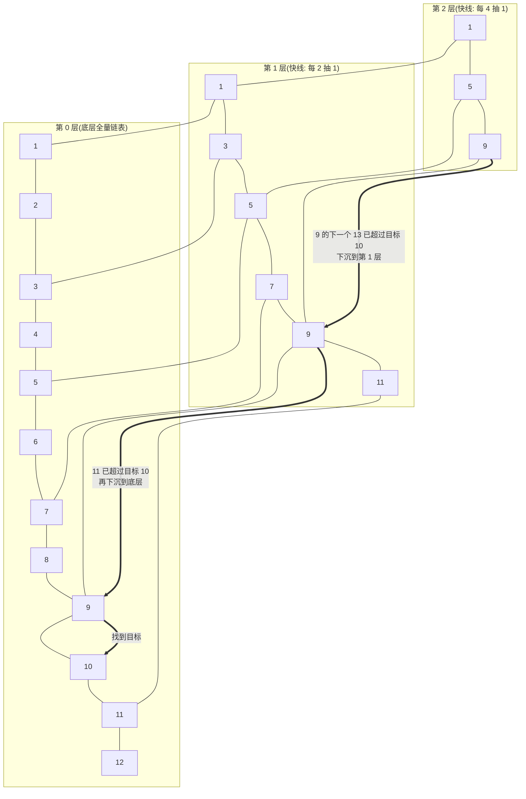

# 阶段一 · 小点 8：集合框架源码

> 所属：阶段一 Java 语言深化与 JVM 体系
> 定位：能手绘 HashMap 结构图，讲清为什么并发修改会抛 `ConcurrentModificationException`。集合是业务代码的空气，也是 Java 面试密度最高的板块——这一讲用「简化版手写实现」把源码的关键路径走一遍。

## 快速入门

> 本节为「集合速览」：先认识最常用的几个集合、怎么选；「HashMap 扩容、并发修改异常原理」留在正文提高部分。

### 本讲核心关键词速查

| 关键词 | 一句话大白话 | 例子 |
|-|-|-|
| List | 有序可重复的列表 | `ArrayList`（动态数组）/ `LinkedList`（双向链表） |
| Set | 不重复的集合 | `HashSet` / `TreeSet` |
| Map | 键值对 | `HashMap` / `ConcurrentHashMap` |
| ArrayList | 动态数组，按下标快速访问 | 常用读写场景 |
| HashMap | 键值对哈希表，平均 O(1) 查找 | 缓存 / 索引 |
| ConcurrentHashMap | 线程安全的 HashMap（桶级并发） | 多线程共享的 Map |
| 扩容 | 集合不够放时自动变大 | HashMap 达到阈值翻倍 |
| fail-fast | 迭代时检测到结构修改立即抛异常 | `ConcurrentModificationException` |

### 本讲在解决什么问题

- **问题**：业务里大量用到列表、去重、按键查找。不同场景选不同集合（数组/链表/哈希表/树），选错就慢或错。还要理解为什么并发修改会抛异常。
- **你要带走的一句话**：**查得快用 HashMap、要顺序用 ArrayList、要线程安全共享用 ConcurrentHashMap**。`HashMap` 之所以查得快，是「先算 hash 定位桶，再在桶里找」；迭代时被修改会抛 `ConcurrentModificationException`——这**不是并发保护，是错误检测**。

### 最简可运行示例（照抄能跑）

```java
import java.util.*;

public class CollectionDemo {
    public static void main(String[] args) {
        // List: 有序可重复
        List<String> list = new ArrayList<>();
        list.add("a"); list.add("b");
        System.out.println(list.get(0));           // a, 按下标取

        // Set: 自动去重
        Set<String> set = new HashSet<>();
        set.add("a"); set.add("a");                // 重复的 a 只留一个
        System.out.println(set.size());            // 1

        // Map: 键值对, 按键查找
        Map<String, Integer> map = new HashMap<>();
        map.put("apple", 3);
        System.out.println(map.get("apple"));      // 3, 按 key 取 value
    }
}
```

> 代码备注（逐行解释）：
> - `ArrayList`：本质是动态数组，`.get(i)` 按下标 O(1)，所以「按位置取」用它。
> - `HashSet`：内部用 HashMap，靠 `hashCode`/`equals` 去重，所以重复值只有一个。这里有一条铁律契约：**`equals` 相等 ⇒ `hashCode` 必须相等**。用身份证记：同一个人必须同号（equals 相同就必须 hash 相同），不同人尽量不同号（撞号了也没事，冲突了排在同一个桶里）。只重写 `equals` 不重写 `hashCode` = 同一个人办了两张不同号的证——`HashMap` 按号找桶就「找不到已存入的自己」。
> - `HashMap`：`put` 时算 `key.hashCode()` 定位到「桶」，`get` 时先定位桶再找——这就是「哈希表」查找快的原因。
> - 三个集合各有取舍：ArrayList 有序、HashSet 去重、HashMap 键值查找——选对场景才高效。

### 关键集合说明

| 集合 | 底层 | 适用 | 最易踩的坑 |
|-|-|-|-|
| `ArrayList` | 动态数组 | 按下标读、尾插 | 频繁头部插删慢（要整体搬移） |
| `LinkedList` | 双向链表 | 频繁头尾插删 | 按下标访问慢（要遍历） |
| `HashMap` | 哈希表（桶+链表+树） | 按键快速查找 | 扩容有开销；非线程安全 |
| `ConcurrentHashMap` | 桶级并发 | 多线程共享的 Map | 写时也非绝对快，但安全 |
| `CopyOnWriteArrayList` | 写时复制 | 读多写极少的白名单 | 写频繁代价极高（整组复制） |

### 常用约定 / 命名提示

- **别用 `Arrays.asList()` 当可变 List**：它返回定长视图，`add/remove` 会抛 `UnsupportedOperationException`。
- **遍历时别改结构**：迭代中 `add/remove` 会触发 `ConcurrentModificationException`——要改就用迭代器的 `remove()` 或收集到新集合。
- **线程共享 Map 用 `ConcurrentHashMap`**，别用 `HashMap` + 手动 `synchronized`（锁整个表，并发差）。

## 精简大纲

1. ArrayList / LinkedList：动态数组与双向链表
2. HashMap：定位桶 → 链表 → 树化 → 扩容
3. ConcurrentHashMap：桶级并发
4. fail-fast 机制：错误检测 ≠ 并发保护
5. 跳表：ConcurrentSkipListMap

## 学习内容详情

### 1. ArrayList / LinkedList

- **ArrayList**：底层 `Object[]` 动态数组；随机访问 O(1)，中间插删要搬移元素 O(n)。
- **LinkedList**：双向链表 + 同时实现 `Deque`（双端队列——头尾都能进出的队列，比如同时支持「队头取、队尾加」）；按下标访问要从头/尾遍历 O(n)。

```java
import java.util.*;

public class ListDemo {
    public static void main(String[] args) {
        var list = new ArrayList<Integer>();
        for (int i = 0; i < 12; i++) list.add(i);   // 默认容量 10, 放第 11 个元素时触发扩容

        // JDK 源码: newCapacity = oldCapacity + (oldCapacity >> 1)  即 1.5 倍
        // 10 → 15 → 22 → 33 ... 每次扩容都要 Arrays.copyOf 整体搬移 → 预估容量能省大量拷贝
        var big = new ArrayList<Integer>(10_000);   // 已知规模时给初始容量, 一次到位

        // LinkedList 虽然实现了 List, 但按下标访问是 O(n) 遍历 —— 下面这行在循环里就是 O(n²)
        var linked = new LinkedList<Integer>();
        linked.add(1);
        System.out.println(linked.get(0));          // 内部从 header 节点开始逐个走
    }
}
```

> **实践结论**：绝大多数场景选 `ArrayList`——「LinkedList 插入快」只在**已持有节点引用**时成立，按下标定位的成本会吞掉优势。

### 2. HashMap：put 的完整旅程

#### 2.1 结构图（面试手绘版）

```mermaid
flowchart LR
    A[put key-value] --> B[定位桶<br/>hash &amp; (n-1)]
    B --> C{桶空?}
    C -->|是| D[放链表首]
    C -->|否| E{链表长度 ≥ 8 且数组 ≥ 64?}
    E -->|是| F[树化 红黑树]
    E -->|否| G[尾插链表]
    G --> H{size &gt; 0.75n?}
    H -->|是| I[扩容 2 倍 + rehash]
    H -->|否| J[结束]
```

#### 2.2 用简化实现走一遍源码逻辑

```java
public class SimpleHashMap<V> {           // 教学版: 只保留 HashMap 的关键路径
    private static final int DEFAULT_CAP = 16;      // 容量必须 2 的幂(原因见下)
    private static final double LOAD_FACTOR = 0.75;
    private Node<V>[] table = new Node[DEFAULT_CAP];
    private int size;

    static class Node<V> { Object key; V value; Node<V> next; }

    public void put(Object key, V value) {
        int hash = key.hashCode() ^ (key.hashCode() >>> 16); // 扰动函数: 高16位异或低16位 (>>> 是无符号右移——连符号位一起右移补 0)
        int idx = hash & (table.length - 1);  // 位与代替取模: 前提是容量为 2 的幂, 快且均匀
        for (Node<V> n = table[idx]; n != null; n = n.next) {
            if (n.key.equals(key)) { n.value = value; return; }  // 同 key 覆盖
        }
        Node<V> node = new Node<>(); node.key = key; node.value = value;
        node.next = table[idx]; table[idx] = node;               // 为可读性用首插; JDK 8 实际是尾插 —— 头插并发扩容会成环(JDK 7 经典事故), 面试常追问
        size++;
        if (size > table.length * LOAD_FACTOR) resize();         // 超过阈值 → 扩容
    }

    private void resize() { /* 容量×2; 元素要么留原桶, 要么去 "原索引+旧容量" 桶 */}
}
```

- **JDK 7 头插扩容成环（3 步小故事，面试常追问）**：① 两个线程 A、B 同时触发扩容，都在搬同一桶的链表（原顺序 a→b→c）；② 头插法是「新节点插到新桶头部」，A 搬完桶里变成 c→b→a，而 B 拿着自己记下的旧顺序再插一遍，插着插着 a.next 指向 b、b.next 又指回 a——**环成了**；③ 之后任何 get 落到这个桶都会在环里绕不出去，死循环、CPU 100%。JDK 8 改尾插不再成环，但并发 put 仍有数据覆盖——并发场景别赌运气，直接上 `ConcurrentHashMap`。

- **三个关键数字**：默认容量 16 / 负载因子 0.75 / 树化阈值 8（退化阈值 6）。
- **扰动函数在算啥（看数字）**：假设 `hashCode()` = `0b1100_0101_1000_1111_0001_0010_0011_0100`，高 16 位 `1100_0101_1000_1111` 与低 16 位 `0001_0010_0011_0100` 异或得 `1101_0111_1011_1011`——低位里混进了高位的信息。为什么必须混：`hash & (n-1)` 只取 hash 的**低 log₂n 位**（n=16 时只看低 4 位），如果不扰动，两个对象高 16 位不同、低 4 位相同，算出来就挤到同一个桶；扰动后「定位只看低 4 位」时高位信息也参与，分布更均匀。
- **`hash & (n-1)` 就是取模（看数字）**：n=16 时 `hash & 15` 与 `hash % 16` 结果相同（15 的二进制是 `1111`，按位与正好留下低 4 位），但位运算比除法快得多——且**只有 n 是 2 的幂才成立**（n=15 时 `1110` 的按位与会把最低位永远丢弃，产生空洞，哈希退化成「偶数位」）。扩容 16→32 时旧桶 i 的元素新下标只有两个候选：hash 第 5 位是 0 就留原桶 i，是 1 就去「i+16」——rehash 只看 hash 多出来的那一位，这就是思考题「自己推 resize」的钥匙。
- **为什么容量必须是 2 的幂**：让 `hash & (n-1)` 等价于 `hash % n` 但快得多，且扩容后元素只需「留原桶」或「原索引 + 旧容量」二选一（rehash 只看 hash 多出来的那一位）。
- **为什么 JDK 8 引入红黑树（Red-Black Tree）**（**必答**）：红黑树是一棵**自平衡二叉搜索树**——靠给节点染色（红/黑）+ 旋转来维持树大致平衡，最坏情况下查找也是 O(log n)（不会退化成歪脖子链表）。哈希碰撞恶化时链表查找 O(n) → 树化后 O(log n)；本质是防「哈希碰撞攻击」（恶意构造同桶 key 把查询拖死，DoS 风险）。

> ⏸️ **短期可以不学**：树化阈值 8 的泊松分布源码推导、红黑树插入/删除的旋转与变色细节——业务开发用不到，投入产出比低。**何时回来学**：面试数据结构方向，或要手写树/跳表结构时。**面试最低要求**：能说清「链表 ≥ 8 且数组 ≥ 64 才树化、< 6 退化回链表；树化把最坏 O(n) 降到 O(log n)，同时是防哈希碰撞攻击的手段」即可。

### 3. ConcurrentHashMap：桶级并发

- **JDK 8+ 结构**：`Node` 数组 + 空桶 CAS 插入 + 非空桶 `synchronized` 锁桶头——**锁粒度到单个桶**，理论上并发度 = 桶数。演进逻辑：JDK 7 是分段锁（Segment 数组，粒度粗、结构复杂），JDK 8 改为「CAS + 锁桶头」——空桶插入走无锁 CAS（绝大多数写入恰好在空桶），非空桶才用 `synchronized` 锁住桶头（JDK 6 后 JVM 已把 synchronized 优化到与显式锁差距极小，且只锁一个桶、不连累其他桶）。
- **锁的演进（小区取快递类比）**：`Hashtable` = 全小区一把总锁，谁取快递全小区都排队（所有操作锁整张表）；JDK 7 分段锁 = 每栋楼一把大门锁，一栋楼取快递不碍着别的楼（默认 16 个段）；JDK 8 桶级 CAS + synchronized = **每户一把门锁**，你家门口排队不影响邻居（空桶直接无锁进，非空桶只锁那一个桶头）。锁粒度越细，并发度越高——这就是演进的方向。
- **弱一致**：`size()` 是 CounterCell（多计数单元）求和的估计值；遍历不保证看到最新写入。

```java
import java.util.concurrent.ConcurrentHashMap;

public class ChmDemo {
    public static void main(String[] args) throws Exception {
        var counters = new ConcurrentHashMap<String, Integer>();

        // ❌ 反模式: 先 get 后 put —— 两步之间另一线程可能已写入, 结果被覆盖
        // counters.put("uv", counters.getOrDefault("uv", 0) + 1);

        // ✅ 原子复合操作: computeIfAbsent 保证 "没有就创建" 这一步原子
        var set = counters.newKeySet();                        // 线程安全 Set 视图
        set.add("user-1");
        counters.computeIfAbsent("uv", k -> 0);                // 原子初始化
        counters.merge("uv", 1, Integer::sum);                 // 原子累加(≈ Redis INCR 的语义; Redis 是阶段三会学的缓存中间件, INCR 是它的原子自增命令)
        counters.merge("uv", 1, Integer::sum);
        System.out.println(counters.get("uv"));  // > 2  —— 两个线程同时 merge 也不会丢
    }
}
```

- 复合操作三件套：`computeIfAbsent`（无则建）/ `merge`（无则放、有则合并）/ `compute`（重算）。

### 4. fail-fast：错误检测 ≠ 并发保护

- **fail-fast（快速失败）**：迭代器每次 `next()` 检查 `modCount`（结构性修改计数）是否变化，变了就抛 `ConcurrentModificationException`——目的是**尽快暴露 bug**，不是保证并发安全。

```java
import java.util.*;

public class FailFastDemo {
    public static void main(String[] args) {
        var list = new ArrayList<>(List.of("a", "b", "c"));

        // ① 坑: 遍历中 add/remove → modCount 变化 → 下一次 next() 抛 ConcurrentModificationException
        try {
            for (String s : list) { if ("b".equals(s)) list.remove(s); }
        } catch (ConcurrentModificationException e) {
            System.out.println("单线程也会触发! fail-fast 是错误检测, 不是并发保护");
        }

        // ✅ 姿势一: 迭代器自己的 remove(会同步更新 expectedModCount)
        var it = list.iterator();
        while (it.hasNext()) { if ("b".equals(it.next())) it.remove(); }

        // ✅ 姿势二: JDK 8+ 集合流式删除(内部基于迭代器)
        list.removeIf("c"::equals);

        // ✅ 姿势三: 并发场景换 CopyOnWriteArrayList(写时复制, 读多写少专用)
        var cow = new CopyOnWriteArrayList<>(List.of("a", "b"));
        for (String s : cow) { if ("b".equals(s)) cow.remove(s); }  // 不抛异常
    }
}
```

- **CopyOnWriteArrayList 的代价**：写时全量复制数组，写多场景代价极高——只适合读多写极少的白名单、配置类数据；上面遍历中 remove 不抛异常，正是因为迭代器持有的是旧数组快照。

### 5. 跳表（ConcurrentSkipListMap）

**地铁快慢线类比（生活版）**：地铁有快线和慢车——慢车每站都停（底层全量链表），快线只停大站（上层索引抽点）。从始发站去 70 号站：先坐快线「哐哐」越过几十站，坐到接近 70 的大站（比如 64），再换慢车一站一站滑过去——几步就到了。

**换成 Java**：跳表就是在有序链表上面修了几条「快线」——底层全量链表保证每个元素都能走到，上层索引让查找先大步跳、接近目标后再下沉到下层精确找，所以平均 O(log n)。看下面的图：找 10 只需要 4 步（顶层跳两步 + 两次下沉 + 一步定位），比慢车从头数到尾快多了。



> 图里看查找 10：第 2 层 1→5→9 两步跳过 8 个数；9 的下一个 13 超过目标，于是**下沉**到第 1 层的 9；第 1 层 9 的下一个 11 也超过目标，**再下沉**到底层的 9；底层 9→10 一步命中——全程 4 步。层数越高「跳」得越狠，这就是「跳表」名字的由来。

- **跳表（Skip List）**：多层索引的有序链表——底层全量链表，上层抽取部分节点做「快速通道」，查找平均 O(log n)。用 CAS 维护并发安全，天然适合并发实现（红黑树旋转需要全局锁）。
- **Redis 为什么用它**：Redis 的 ZSet（有序集合——每个元素带一个分数、按分数排名的集合，如排行榜）底层就是跳表，而不用红黑树：一是实现简单不易写错；二是范围查询（ZRANGE 取分数区间）在链表上顺着走就行；三是并发下用 CAS 无锁化，比旋转需要全局锁的红黑树友好。

```java
import java.util.concurrent.*;

public class SkipListDemo {
    public static void main(String[] args) {
        // 有序并发 Map: 按 key 排序, 支持范围视图 —— 排行榜 / 延迟队列的时间轮询场景
        var delays = new ConcurrentSkipListMap<Long, String>();

        delays.put(1_700_000_010_000L, "任务A");   // key = 触发时间戳
        delays.put(1_700_000_005_000L, "任务B");
        delays.put(1_700_000_020_000L, "任务C");

        // headMap: 取 "早于某时刻" 的所有任务 —— 跳表让这种范围查询 O(log n) 起步
        var due = delays.headMap(1_700_000_010_000L);
        due.forEach((t, task) -> System.out.println("到期执行: " + task)); // > 任务B
    }
}
```

### 坑点提醒

- `Arrays.asList(...)` 返回定长视图：`add` 抛 `UnsupportedOperationException`，要可变得包一层 `new ArrayList<>(...)`。
- `Map.of(...)` / `List.of(...)` 不可变且**不允许 null**，存 null 会 NPE。
- HashMap 并发下可能死循环（JDK7 头插扩容成环）/ 数据覆盖（JDK8）——并发场景必须换 ConcurrentHashMap，别赌运气。
- 「链表长度 ≥ 8」树化还要求**数组容量 ≥ 64**，否则优先扩容不树化（小表先扩容更划算）。

## 本节自检

- [ ] 能手绘 HashMap 的 put 流程图（定位桶 → 链表/树化 → 扩容）
- [ ] 能回答：HashMap 的扩容流程？为什么 JDK 8 要引入红黑树转换？
- [ ] 能解释为什么并发修改会抛 `ConcurrentModificationException`，并写出三种正确遍历删除的写法
- [ ] 能说出 ConcurrentHashMap（JDK 8+）锁的粒度，以及为什么跳表比红黑树更适合并发容器
- [ ] 能说出容量必须是 2 的幂、树化阈值 8 与退化阈值 6 这三个数字背后的原因

## 本节配套思考题

1. 如果让你给 `SimpleHashMap` 实现完整的 `resize()`，你会怎么搬移元素？提示：扩容后每个元素的新下标只有两种可能，分别由哪一位决定？
2. `CopyOnWriteArrayList` 为什么只适合「读多写少」？写频繁时它的两个致命代价是什么？
3. `ConcurrentHashMap.merge` 和 Redis 的 `INCR` 在语义上像在哪？什么场景你会选前者而不是 Redis？

## 常见面试题

### Q1：HashMap 的底层结构是什么？put 的完整流程怎么走？为什么容量必须是 2 的幂？

**答**：JDK 8 的 HashMap 底层是「数组 + 链表 + 红黑树」。put 流程：① 对 key 做 `hashCode()` 后用扰动函数 `h ^ (h >>> 16)` 混合高低位；② 用 `hash & (n-1)` 定位桶（等价于取模但快得多）；③ 桶空直接放，桶非空则遍历——key 相同覆盖 value，否则尾插进链表；④ 链表长度 ≥ 8 且数组 ≥ 64 时树化为红黑树；⑤ `size` 超过「容量 × 0.75」（负载因子）就扩容翻倍。容量必须 2 的幂有两个原因：一是 `hash & (n-1)` 能替代取模运算（位运算更快且分布均匀）；二是扩容时每个元素只需看 hash 多出来的那一位是 0 还是 1——留原桶或去「原索引 + 旧容量」，rehash 成本极低。工程要点：预估规模时给初始容量（`new HashMap<>(1000)`），避免频繁扩容的整表拷贝；负载因子 0.75 是空间与冲突的平衡点，一般不动。

### Q2：HashMap 是线程安全的吗？并发下会出什么问题？ConcurrentHashMap 是怎么演进的？

**答**：不是。JDK 7 的 HashMap 并发扩容时头插法会形成循环链表，get 可能死循环（经典事故）；JDK 8 改为尾插不再成环，但并发 put 会数据覆盖、`size` 不准确。所以并发共享的 Map 必须用 ConcurrentHashMap。演进：JDK 7 是分段锁（Segment 数组，每段一把锁，默认 16 段，粒度粗、结构复杂）；JDK 8 改为「空桶 CAS 插入 + 非空桶 synchronized 锁桶头」，锁粒度细到单个桶，理论上并发度等于桶数；`size()` 是多个计数单元（CounterCell）求和的**弱一致**估计值。工程要点：先 get 后 put 这类两步操作在并发下依旧不安全，要用 `computeIfAbsent` / `merge` / `compute` 原子复合方法；遍历也不保证看到最新写入——需要强一致快照就得自己加锁。

### Q3：什么是 fail-fast？为什么遍历时修改集合会抛 ConcurrentModificationException？

**答**：fail-fast（快速失败）是 Java 集合的**错误检测机制**，不是并发保护。`ArrayList` / `HashMap` 内部维护 `modCount`（结构性修改计数），迭代器创建时记住 `expectedModCount`，每次 `next()` 都校验两者是否相等——不等就抛 `ConcurrentModificationException`。设计目的是「尽早暴露 bug」：迭代时修改结构，语义本就未定义，与其悄悄给出错误结果，不如立刻崩溃让你发现。注意**单线程也会触发**（遍历中 `list.remove()`），所以它是通用防御。正确做法：迭代器自己的 `remove()`（会同步更新 `expectedModCount`）、`removeIf`、收集到新集合再删；并发场景读多写少用 `CopyOnWriteArrayList`——迭代器持旧数组快照所以不抛异常，但每次写都全量复制数组，写频繁代价极高。

### Q4：ConcurrentHashMap 的锁粒度是什么？为什么跳表（ConcurrentSkipListMap）比红黑树更适合并发有序容器？

**答**：JDK 8 的 ConcurrentHashMap 锁粒度是**单个桶**：空桶插入用 CAS 无锁完成，非空桶用 synchronized 锁桶头节点，互不干扰的桶可完全并行——相比 JDK 7 的分段锁（16 个段）并发度大幅提升。跳表（Skip List）是「底层全量有序链表 + 上层抽点建索引」的多层结构，查找平均 O(log n)。它比红黑树更适合并发有序容器的原因：红黑树的插入/删除要旋转并调整全树结构，涉及多节点指针变更，并发下必须拿全局锁；而跳表的写操作只影响目标节点的邻居指针，可以逐节点用 CAS 原子更新，天然无锁化——所以 Java 的有序并发 Map 选了 `ConcurrentSkipListMap`。工程场景：排行榜、延迟任务（按时间戳 `headMap` 取到期任务）这类「有序 + 并发」需求。
