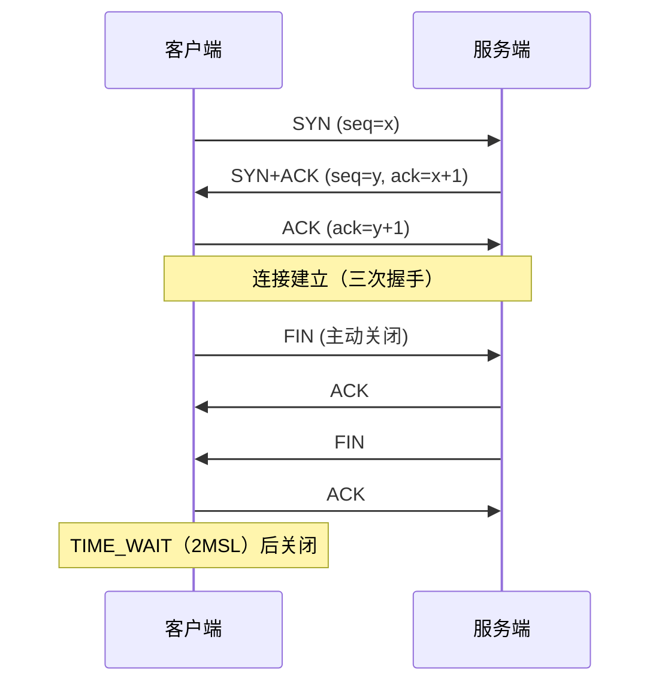
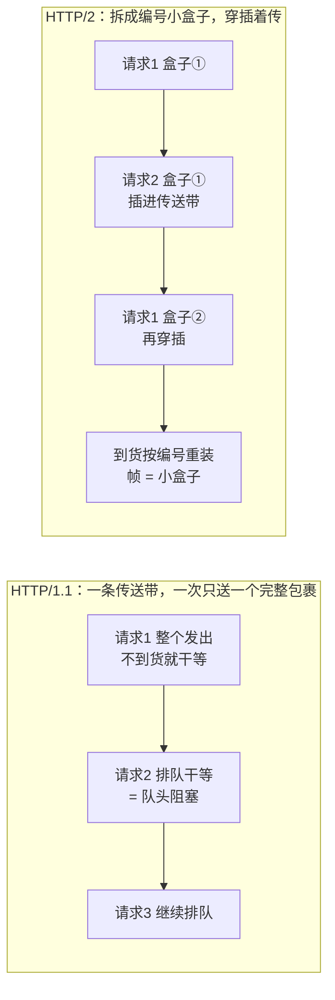
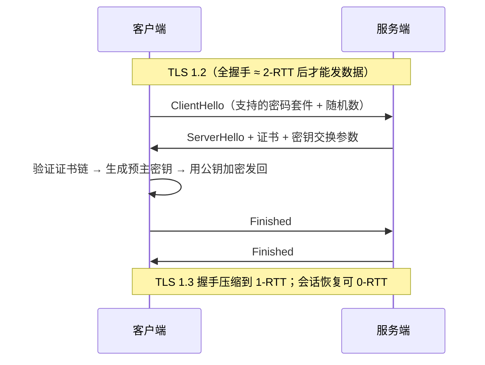

# 阶段一 · 小点 10：网络与协议基础

> 所属：阶段一 Java 语言深化与 JVM 体系
> 定位：后端开发的底层必修课——排查连接耗尽、慢请求都依赖这些。你写过前端，HTTP 应用层已有直觉，这里补齐传输层与协议演进，以及「出问题时的抓包三板斧」。

## 快速入门

> 本节为「网络速览」：先认识后端排查最常用的几个网络概念；「TIME_WAIT/CLOSE_WAIT 细节、TLS 0-RTT」留在正文提高部分。

### 本讲核心关键词速查

| 关键词 | 一句话大白话 | 例子 |
|-|-|-|
| TCP | 可靠的面向连接传输协议 | HTTP/HTTPS 底层用 TCP |
| 三次握手 | 建立连接前双方确认三次 | 连接建立的握手 |
| TIME_WAIT | 主动关闭方等待的短暂状态 | 频繁建连会堆积 |
| CLOSE_WAIT | 被动关闭方「等待本地关闭」状态 | 只增不减 = 代码没关连接 |
| HTTP/2 | 单连接多路复用（Multiplexing），比 1.1 快 | 一个 TCP 多个请求并行 |
| TLS | HTTPS 的加密层 | 握手后加密传输 |
| Kubernetes/DNS | 服务发现与域名解析 | 排查「连不上」 |

### 本讲在解决什么问题

- **问题**：后端报「连接数耗尽」「超时」，往往不是业务 bug，而是网络/连接管理出了问题。看懂连接状态 + 会抓包，才能定位。
- **你要带走的一句话**：排查连接问题先看两个状态——`CLOSE_WAIT` 只增不减 = 代码没主动关连接；`TIME_WAIT` 大量堆积 = 频繁建连（常见于短连接 + 高并发）。

### 最简可运行示例（照抄能跑）

```bash
# 排查连接状态的常用命令(正文展开更细)
ss -tan | grep -c CLOSE-WAIT    # 看 CLOSE_WAIT 数量: 持续上涨 = 连接没关
ss -tan | grep -c TIME-WAIT     # 看 TIME_WAIT 数量: 高并发短连接常见
lsof -i :8080                    # 看 8080 端口被谁占着
```

> 命令备注（逐行解释）：
> - `ss -tan`：列出所有 TCP 连接及其状态（`-t` TCP、`-a` 全部、`-n` 数字端口）。
> - `grep -c CLOSE-WAIT`：统计处于 `CLOSE_WAIT` 的连接数——**这只增不减、且不断上涨**，是本端代码没正确关闭连接（如忘了 `close()`/`finally`）。
> - `lsof -i :8080`：看看 8080 端口被哪些进程占用——排查「端口被占 / 服务起不来」。
> - 这三条是后端排查「连接耗尽 / 端口占用」的第一步。

### 关键概念说明

| 概念 | 干什么 | 最易踩的坑 |
|-|-|-|
| TCP 三次握手 | 建立可靠连接 | 大量未完成握手 = 可能是半连接攻击/连接队列满 |
| `TIME_WAIT` | 主动关闭方的收尾状态 | 高并发短连接会堆积，但正常，别当病 |
| `CLOSE_WAIT` | 被动关闭方等待关闭 | **只增不减 = 必然泄漏**（连接没 close） |
| HTTP/2 多路复用 | 单连接多请求并行 | 并发流有限（受 SETTINGS 帧——HTTP/2 里双方互相告知限制的配置帧——限制） |
| TLS | 加密传输 | 服务端要正确配置证书链 |

### 常用约定 / 命名提示

- **排查连接问题的顺序**：`ss` 看连接状态 → `lsof` 看端口占用 → `tcpdump` 抓包看内容。从「多少连接/什么状态」到「包里到底发了什么」。
- **CLOSE_WAIT 是代码 bug 铁证**：明确「服务端没关连接」，多半是忘了 `close()` 或连接池异常——排查时先看这个。
- **HTTP/2 时代**：合并小请求这类 HTTP/1.1 优化不再必要，但并发流仍受对端 SETTINGS 限制。

## 精简大纲

1. TCP：三次握手 / 四次挥手 / TIME_WAIT 与 CLOSE_WAIT
2. HTTP 演进：keep-alive → HTTP/2 多路复用 → HTTP/3 QUIC
3. TLS 握手：1.2 vs 1.3、0-RTT 的重放风险
4. 排查工具链：ss / tcpdump 实战

## 学习内容详情

### 1. TCP 连接管理

#### 1.1 握手与挥手（mermaid 手绘版）



- **为什么三次（先讲个打电话的故事）**：三次握手 = 打电话先确认「喂，听得到吗？」→「听得到，你听得到我吗？」→「听得到」，双方都确认自己发得出、对方收得到，才正式开聊。换成网络：`SYN`（SYN = 请求建连的旗语）让服务端确认「客户端的发送能力」；`SYN+ACK` 让客户端确认「服务端的收发能力」；最后的 `ACK`（ACK = 确认收到）让服务端确认「客户端的接收能力」。两次不够：无法防住「网络里迟到的历史 SYN」建立幽灵连接——就像对方早先喊过一嗓子、你现在才听到，误以为他要新开对话。
- **TIME_WAIT**：出现在**主动关闭方**，持续 2MSL（MSL = Maximum Segment Lifetime，报文最大存活时间——2MSL ≈ 等一个来回再加点余量）。类比打电话：主动挂电话的人在原地多等一会儿，确认对方没再说「等等，还有一句」——因为最后的 `ACK` 可能丢了、对方会重发 `FIN`，你要能收到并再补一次；同时让旧连接的报文在网络中自然消亡。
- **CLOSE_WAIT**：出现在**被动关闭方**收到了 `FIN`（FIN = 请求断开的旗语）却没调 `close()`——对方已经挂了电话，你还举着话筒不挂。大量 CLOSE_WAIT 几乎总是**应用层代码 bug**（忘关连接 / 连接池泄漏）。
- **连接队列（给思考题 3 埋伏笔）**：握手不是瞬间完成的——没握完的连接先放进「**半连接队列**」（`SYN` 到了但三次握手没做完，连接处于 `SYN-RECV` 状态；恶意伪造海量 `SYN` 打满这个队列 = 半连接攻击 / SYN Flood）；握完但还没被应用 `accept()` 取走的，放「**全连接队列**」（`backlog` 参数控制它的大小）。所以 `ss` 里看到大量 `SYN-RECV`，先查这两条队列。

#### 1.2 Java 侧看连接（HttpClient 长连接）

```java
import java.net.URI;
import java.net.http.*;
import java.time.Duration;

public class HttpKeepAliveDemo {
    // JDK 11+ HttpClient: 默认 HTTP/2 + 连接复用(keep-alive), 必须做成单例复用!
    // 每次请求 new HttpClient = 每次建新连接池 = 大量 TIME_WAIT + 握手延迟
    private static final HttpClient CLIENT = HttpClient.newBuilder()
            .version(HttpClient.Version.HTTP_2)          // 服务端不支持时自动降级 1.1
            .connectTimeout(Duration.ofSeconds(3))       // 连接超时: 防止对端不可达时挂死
            .build();

    public static void main(String[] args) throws Exception {
        for (int i = 0; i < 3; i++) {
            HttpRequest req = HttpRequest.newBuilder()
                    .uri(URI.create("https://httpbin.org/get"))
                    .timeout(Duration.ofSeconds(5))       // 响应超时: 与连接超时各管一段
                    .GET()
                    .build();
            HttpResponse<String> resp = CLIENT.send(req, HttpResponse.BodyHandlers.ofString());
            System.out.println(resp.statusCode() + " via " + resp.version());  // > 200 via HTTP_2
        }
        // 三次请求复用同一条连接 —— 握手只发生一次
    }
}
```

### 2. HTTP 协议演进

| 版本 | 关键机制 | 解决的问题 |
|-|-|-|
| HTTP/1.1 | keep-alive 长连接 | 免去每次请求重建 TCP 连接 |
| HTTP/2 | 二进制分帧（把数据拆成**编号的小盒子**，帧 = 小盒子）+ **单连接多路复用**（多个请求的盒子穿插着传、到货按编号重装）+ 头部压缩（HPACK——用索引表代替重复 Header） | 1.1 的 HTTP 层队头阻塞（前一个请求没处理完、后面的全部排队；浏览器被迫开 6 条并行连接绕路） |
| HTTP/3 | **QUIC（Quick UDP Internet Connections，基于 UDP）** | TCP 层队头阻塞 + 握手往返（0/1-RTT；RTT = Round Trip Time，一个来回的时延——做过前端性能优化的你其实见过这个指标） |

先看一张对比图（**生活版**：HTTP/1.1 是一条传送带，一次只送一个完整包裹，前一个没到、后一个干等 = 队头阻塞；**换成网络**：HTTP/2 把每个请求的包裹拆成编号的小盒子，多个包裹的盒子穿插着传 = 单连接多路复用，到货后按编号重装）：



- **多路复用 ≠ 无阻塞**：HTTP/2 解决了 HTTP 层排队，但**一个 TCP 包丢失仍会阻塞该连接上所有流**（TCP 要保证字节流有序）——这正是 QUIC 把可靠性做到 UDP 层、流之间独立恢复的动机。
- **「无限并行」有上限**：单连接的并发流数受对端 SETTINGS 帧限制（默认约 100 条）；超大资源（大文件传输）仍会长时间占住连接、挤占其他流的带宽。
- 迁移直觉：前端视角最直观的变化——HTTP/2 下「合并小请求 / 雪碧图」这类 1.1 时代的优化手段不再必要，甚至有害。

> ⏸️ **短期可以不学**：HTTP/3 / QUIC 的机制细节（连接迁移、流级独立恢复、0-RTT 会话恢复）——生产环境主流仍是 HTTP/1.1 与 HTTP/2，内网与网关对 QUIC 支持有限，业务开发短期用不到。**何时回来学**：公司真上了 HTTP/3，或面试网络方向被追问时。**面试最低要求**：能说「HTTP/3 基于 UDP 实现 QUIC，把可靠性做到 UDP 层、流之间独立恢复，解决 TCP 队头阻塞并降低握手往返」即可。

### 3. TLS 握手



- **TLS（Transport Layer Security，传输层安全协议）**：跑在 TCP 与 HTTP 之间的加密层，负责「加密 + 验明正身」。先讲个「护照与签证处」的故事，五个概念一次说清：
  - **CA（Certificate Authority）= 发护照的公信机构**——它签发的证书就是「官方护照」，浏览器 / JVM 认它才认你的站点；
  - **证书链 = 护照上的签发链条**——根 CA 签中间 CA、中间 CA 签站点证书，逐级验签：客户端拿到你的证书，一路向上查到「我内置信任的根 CA」，链条没断就信你；
  - **JVM 信任库 cacerts = 你手机里预装的「官方发证机构名单」**——名单里的机构发的证才认，这正是 HTTPS 无法被随意伪造的根基；
  - **SNI（Server Name Indication，服务器名称指示）= 一栋楼多家公司共用一个前台**——一个 IP 上挂多张证书时，客户端在握手时用 SNI 字段报出「我要找几楼几家公司」，前台（服务器）按你报的公司名发对应门禁卡（证书）——这是「单 IP 多域名共用 443 端口」的前提；
  - **mTLS（双向认证）= 双方都要出示证件**——不只是客户端验服务器，服务器也要验客户端证书，服务间零信任的基石，阶段六第 5 讲。
- **0-RTT 的重放风险**：0-RTT 数据在握手完成前就发出，攻击者可原样重放——只对**幂等请求**（同一操作做一次和做 N 次效果相同，如 GET、查询类）安全，非幂等接口必须在完成完整握手后发送。
- 补一个握手里的词：**密码套件**（一组加密算法的组合套餐，如 ECDHE 负责密钥交换 + AES 负责对称加密）——客户端在 ClientHello 里报出支持的清单，服务端挑一个用。

### 4. 排查工具链（背下这组命令）

```bash
# ① 连接状态分布: 一眼看穿 TIME_WAIT / CLOSE_WAIT 堆积
ss -tan state time-wait | wc -l        # TIME_WAIT 数量(短暂高峰正常, 持续数万要查)
ss -tan state close-wait | wc -l       # > 几百基本是应用忘 close() 的 bug
ss -s                                  # 连接总数摘要(TCP: x established...)

# ② 谁占用了端口
lsof -i :8080 -P -n                    # 进程号 + 进程名(PID/COMMAND 列)

# ③ 终极武器: 抓包(加 -s 0 抓全包, 过滤条件越早写越省性能)
sudo tcpdump -i any -nn -A 'tcp port 443 and host 10.0.0.5' -w debug.pcap
# 抓完拖进 Wireshark: Follow TCP Stream 看一次完整请求的三次握手→TLS→数据→挥手
```

> 这条 tcpdump 逐项拆解：
> - `-i any`：监听所有网卡（不确定流量走哪块网卡时用）。
> - `-nn`：不做域名 / 端口名反解析——直接显示 IP 和数字端口，更清晰也更快。
> - `-A`：以 ASCII 显示包内容（看请求体 / 明文协议时用）。
> - `-w debug.pcap`：把抓到的包存成 pcap 文件，供离线分析。
> - 过滤条件 `'tcp port 443 and host 10.0.0.5'` 越早写越省性能（内核里就过滤，不用抓全量再挑）。
> - 抓完把 `debug.pcap` 拖进 **Wireshark**（图形化抓包分析器）——用 **Follow TCP Stream** 看一次完整对话：三次握手 → TLS → 数据 → 挥手。

> 排查范式：**`ss` 看状态分布 → `lsof` 定位进程 → `tcpdump` 抓包看事实**。前两个回答「什么连接、多少、谁的」，最后一个回答「包里到底发生了什么」——阶段五第 5 讲会把这套工具接进完整排查链。

### 坑点提醒

- `HttpClient` / `OkHttp` 每请求新建实例 = 连接池形同虚设，TIME_WAIT 暴涨——客户端必须单例。
- 大量 TIME_WAIT 常见于「客户端频繁短连接主动关」——治本是连接复用，不是调内核参数 `tcp_tw_reuse`。
- CLOSE_WAIT 在服务端堆积 ≠ 内核问题，是**你的代码没关 socket**（finally 里 close / try-with-resources）。
- HTTP/2 多路复用在「单条 TCP 连接」上——代理 / LB（负载均衡器）若拆成两条连接，队头阻塞可能在中间设备复活。

## 本节自检

- [ ] 能默画三次握手 / 四次挥手图，并解释 TIME_WAIT 出现在哪一方、为什么等 2MSL
- [ ] 服务端出现大量 CLOSE_WAIT，你的第一判断是什么？
- [ ] 能说清 HTTP/2 的多路复用解决了什么、没解决什么（TCP 队头阻塞），QUIC 怎么补上
- [ ] 能描述 TLS 1.3 相对 1.2 的握手次数差异，以及 0-RTT 的重放风险
- [ ] 能按「ss → lsof → tcpdump」说出每步回答什么问题

## 本节配套思考题

1. 为什么 TIME_WAIT 的等待时长是 2MSL 而不是 1 个 MSL？（提示：最后一个 ACK 丢了，对端重发 FIN，这一来一回要多长？）
2. gRPC 强制使用 HTTP/2——若你的 LB / 网关只支持 HTTP/1.1 转发，会发生什么？你会怎么排查？
3. 你的服务 RT 突然劣化且 `ss` 显示大量 SYN-RECV——最可能的三个原因是什么？（提示：accept 队列满 / 半连接攻击 / backlog 配置）

## 常见面试题

### Q1：TCP 为什么要三次握手？四次挥手为什么要四次？TIME_WAIT 为什么是 2MSL？

**答**：三次握手的目的是双方确认「我的报文你能收到、你的报文我能收到」——SYN 让服务端确认客户端的发送能力，SYN+ACK 让客户端确认服务端的收发能力，最后的 ACK 让服务端确认客户端的接收能力。两次不够：无法防住「网络中迟到的历史 SYN」建立幽灵连接（旧报文被误当作新连接）。四次挥手是因为 TCP 是**全双工**——两个方向要各自独立关闭：A 发 FIN 表示「我发完了」，B 回 ACK 但还能继续发数据；B 发完再发自己的 FIN，A 回最后的 ACK，所以至少四次。TIME_WAIT 出现在**主动关闭方**，等 2MSL：一是保证最后一个 ACK 若丢失能重发（对端重发 FIN，一来一回就是 2 个 MSL）；二是让旧连接的所有报文在网络中自然消亡，避免与同四元组（源IP + 源端口 + 目的IP + 目的端口——一条连接的唯一身份证）的新连接混淆。工程上：服务端大量 TIME_WAIT 常见于高并发短连接，治本是连接复用，而不是调 `tcp_tw_reuse` 这类内核参数。

### Q2：服务端 CLOSE_WAIT 只增不减，你的排查思路是什么？

**答**：CLOSE_WAIT 是**被动关闭方**的状态——对端发来 FIN，本端回了 ACK，但应用层没调 `close()`，连接就挂在 CLOSE_WAIT 上。只增不减几乎必然是**应用层代码 bug**：要么忘了 `close()`（没用 try-with-resources / finally），要么连接池没正确释放，要么线程卡死来不及关连接。排查思路：① `ss -tan state close-wait | wc -l` 确认数量与增长趋势；② 结合 jstack 看哪些线程持有这些 socket（通常卡在某个方法）；③ 审代码里所有 `Socket` / 连接池的关闭路径，重点找「异常分支没 close」；④ 顺带排查下游是否被拖慢导致连接长时间占用。与 TIME_WAIT 的区分：TIME_WAIT 是主动方收尾的正常状态、会自然消散；CLOSE_WAIT 是对端已关、你还赖着不关——这是你的锅。

### Q3：HTTP/2 的多路复用解决了什么问题？没解决什么？HTTP/3 怎么补上？

**答**：HTTP/1.1 的问题：一个请求一个连接、响应必须按序返回，前面请求慢会阻塞后面的（HTTP 层队头阻塞），浏览器被迫开 6 条并行连接绕路。HTTP/2 用二进制分帧把多个流（stream）复用在一条 TCP 连接上，解决了 HTTP 层排队，还顺带做了 HPACK 头部压缩。但 HTTP/2 **没解决 TCP 层队头阻塞**：一条 TCP 连接上的字节流必须有序，一个包丢了，TCP 要重传并阻塞该连接上的所有流。HTTP/3 干脆基于 UDP 实现 QUIC（Quick UDP Internet Connections），把可靠性与**流级独立恢复**做进 UDP 层——丢包只影响那一个流，其他流继续走，还能 0/1-RTT 建连。工程坑：HTTP/2 的多路复用只在**单条 TCP 连接**上成立，代理 / LB 若拆成两条连接，队头阻塞可能在中间设备复活；并发流数也受对端 SETTINGS 帧限制（默认约 100 条）。

### Q4：TLS 1.3 相比 1.2 快在哪？0-RTT 有什么风险？

**答**：TLS 1.2 完整握手约 2-RTT：ClientHello → ServerHello + 证书 + 密钥交换参数 → 客户端验证证书、用公钥加密回传预主密钥 → 双方 Finished，之后才能发数据。TLS 1.3 把握手压缩到 1-RTT：密钥交换协议简化（移除 RSA 密钥交换等旧套件，改为 ECDHE），服务端一个 ServerHello 就能带齐参数，双方直接算出会话密钥；配合会话恢复（PSK，预共享密钥）可做到 0-RTT——客户端带着上次会话的票据直接发数据。0-RTT 的风险是**重放攻击**：数据在握手完成前就发出，攻击者可原样重放这个请求，所以 0-RTT 只对**幂等请求**安全（GET、查询类），非幂等接口必须等完整握手后发送。工程要点：JVM 的 TLS 信任链由 cacerts 决定；单 IP 多域名靠 SNI 选证书；服务间认证用 mTLS。
