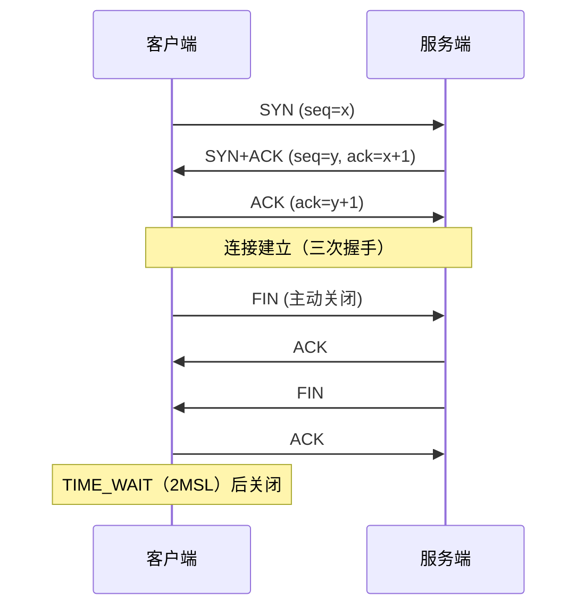
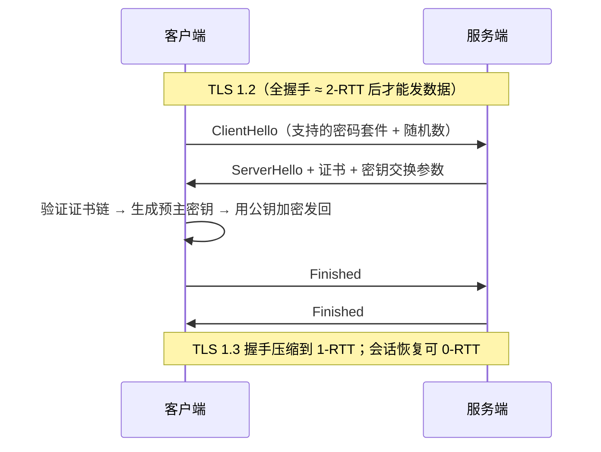

# 阶段一 · 小点 10：网络与协议基础

> 所属：阶段一 Java 语言深化与 JVM 体系
> 定位：后端开发的底层必修课——排查连接耗尽、慢请求都依赖这些。你写过前端，HTTP 应用层已有直觉，这里补齐传输层与协议演进，以及「出问题时的抓包三板斧」。

## 快速入门

> 本节为「网络速览」：先认识后端排查最常用的几个网络概念；「TIME_WAIT/CLOSE_WAIT 细节、TLS 0-RTT」留在正文提高部分。

### 本讲核心关键词速查

| 关键词 | 一句话大白话 | 例子 |
|-|-|-|
| TCP | 可靠的面向连接传输协议 | HTTP/HTTPS 底层用 TCP |
| 三次握手 | 建立连接前双方确认三次 | 连接建立的握手 |
| TIME_WAIT | 主动关闭方等待的短暂状态 | 频繁建连会堆积 |
| CLOSE_WAIT | 被动关闭方「等待本地关闭」状态 | 只增不减 = 代码没关连接 |
| HTTP/2 | 单连接多路复用，比 1.1 快 | 一个 TCP 多个请求并行 |
| TLS | HTTPS 的加密层 | 握手后加密传输 |
| Kubernetes/DNS | 服务发现与域名解析 | 排查「连不上」 |

### 本讲在解决什么问题

- **问题**：后端报「连接数耗尽」「超时」，往往不是业务 bug，而是网络/连接管理出了问题。看懂连接状态 + 会抓包，才能定位。
- **你要带走的一句话**：排查连接问题先看两个状态——`CLOSE_WAIT` 只增不减 = 代码没主动关连接；`TIME_WAIT` 大量堆积 = 频繁建连（常见于短连接 + 高并发）。

### 最简可运行示例（照抄能跑）

```bash
# 排查连接状态的常用命令(正文展开更细)
ss -tan | grep -c CLOSE-WAIT    # 看 CLOSE_WAIT 数量: 持续上涨 = 连接没关
ss -tan | grep -c TIME-WAIT     # 看 TIME_WAIT 数量: 高并发短连接常见
lsof -i :8080                    # 看 8080 端口被谁占着
```

> 命令备注（逐行解释）：
> - `ss -tan`：列出所有 TCP 连接及其状态（`-t` TCP、`-a` 全部、`-n` 数字端口）。
> - `grep -c CLOSE-WAIT`：统计处于 `CLOSE_WAIT` 的连接数——**这只增不减、且不断上涨**，是本端代码没正确关闭连接（如忘了 `close()`/`finally`）。
> - `lsof -i :8080`：看看 8080 端口被哪些进程占用——排查「端口被占 / 服务起不来」。
> - 这三条是后端排查「连接耗尽 / 端口占用」的第一步。

### 关键概念说明

| 概念 | 干什么 | 最易踩的坑 |
|-|-|-|
| TCP 三次握手 | 建立可靠连接 | 大量未完成握手 = 可能是半连接攻击/连接队列满 |
| `TIME_WAIT` | 主动关闭方的收尾状态 | 高并发短连接会堆积，但正常，别当病 |
| `CLOSE_WAIT` | 被动关闭方等待关闭 | **只增不减 = 必然泄漏**（连接没 close） |
| HTTP/2 多路复用 | 单连接多请求并行 | 并发流有限（受 SETTINGS 帧限制） |
| TLS | 加密传输 | 服务端要正确配置证书链 |

### 常用约定 / 命名提示

- **排查连接问题的顺序**：`ss` 看连接状态 → `lsof` 看端口占用 → `tcpdump` 抓包看内容。从「多少连接/什么状态」到「包里到底发了什么」。
- **CLOSE_WAIT 是代码 bug 铁证**：明确「服务端没关连接」，多半是忘了 `close()` 或连接池异常——排查时先看这个。
- **HTTP/2 时代**：合并小请求这类 HTTP/1.1 优化不再必要，但并发流仍受对端 SETTINGS 限制。

## 精简大纲

1. TCP：三次握手 / 四次挥手 / TIME_WAIT 与 CLOSE_WAIT
2. HTTP 演进：keep-alive → HTTP/2 多路复用 → HTTP/3 QUIC
3. TLS 握手：1.2 vs 1.3、0-RTT 的重放风险
4. 排查工具链：ss / tcpdump 实战

## 学习内容详情

### 1. TCP 连接管理

#### 1.1 握手与挥手（mermaid 手绘版）



- **为什么三次**：双方都要确认「我说的对方能收到，对方说的我能收到」；两次无法防住「网络里迟到的历史 SYN」建立幽灵连接。
- **TIME_WAIT**：出现在**主动关闭方**，持续 2MSL——保证最后一个 ACK 可达（丢了要能重发），并让旧连接的报文在网络中自然消亡。
- **CLOSE_WAIT**：出现在**被动关闭方**收到了 FIN 却没调 `close()`——大量 CLOSE_WAIT 几乎总是**应用层代码 bug**（忘关连接 / 连接池泄漏）。

#### 1.2 Java 侧看连接（HttpClient 长连接）

```java
import java.net.URI;
import java.net.http.*;
import java.time.Duration;

public class HttpKeepAliveDemo {
    // JDK 11+ HttpClient: 默认 HTTP/2 + 连接复用(keep-alive), 必须做成单例复用!
    // 每次请求 new HttpClient = 每次建新连接池 = 大量 TIME_WAIT + 握手延迟
    private static final HttpClient CLIENT = HttpClient.newBuilder()
            .version(HttpClient.Version.HTTP_2)          // 服务端不支持时自动降级 1.1
            .connectTimeout(Duration.ofSeconds(3))       // 连接超时: 防止对端不可达时挂死
            .build();

    public static void main(String[] args) throws Exception {
        for (int i = 0; i < 3; i++) {
            HttpRequest req = HttpRequest.newBuilder()
                    .uri(URI.create("https://httpbin.org/get"))
                    .timeout(Duration.ofSeconds(5))       // 响应超时: 与连接超时各管一段
                    .GET()
                    .build();
            HttpResponse<String> resp = CLIENT.send(req, HttpResponse.BodyHandlers.ofString());
            System.out.println(resp.statusCode() + " via " + resp.version());  // > 200 via HTTP_2
        }
        // 三次请求复用同一条连接 —— 握手只发生一次
    }
}
```

### 2. HTTP 协议演进

| 版本 | 关键机制 | 解决的问题 |
|-|-|-|
| HTTP/1.1 | keep-alive 长连接 | 免去每次请求重建 TCP 连接 |
| HTTP/2 | 二进制分帧 + **单连接多路复用** + 头部压缩（HPACK） | 1.1 的 HTTP 层队头排队（浏览器被迫开 6 条并行连接绕路） |
| HTTP/3 | **QUIC（基于 UDP）** | TCP 层队头阻塞 + 握手往返（0/1-RTT） |

- **多路复用 ≠ 无阻塞**：HTTP/2 解决了 HTTP 层排队，但**一个 TCP 包丢失仍会阻塞该连接上所有流**（TCP 要保证字节流有序）——这正是 QUIC 把可靠性做到 UDP 层、流之间独立恢复的动机。
- **「无限并行」有上限**：单连接的并发流数受对端 SETTINGS 帧限制（默认约 100 条）；超大资源（大文件传输）仍会长时间占住连接、挤占其他流的带宽。
- 迁移直觉：前端视角最直观的变化——HTTP/2 下「合并小请求 / 雪碧图」这类 1.1 时代的优化手段不再必要，甚至有害。

### 3. TLS 握手



- **TLS**：跑在 TCP 与 HTTP 之间的加密层——JVM 信任库（cacerts）决定「信哪些 CA」；**SNI**（一个 IP 多域名时标明要哪张证书）；**mTLS**（双向认证，服务间零信任的基石，阶段六第 5 讲）。
- **0-RTT 的重放风险**：0-RTT 数据在握手完成前就发出，攻击者可原样重放——只对**幂等请求**安全，非幂等接口必须在完成完整握手后发送。

### 4. 排查工具链（背下这组命令）

```bash
# ① 连接状态分布: 一眼看穿 TIME_WAIT / CLOSE_WAIT 堆积
ss -tan state time-wait | wc -l        # TIME_WAIT 数量(短暂高峰正常, 持续数万要查)
ss -tan state close-wait | wc -l       # > 几百基本是应用忘 close() 的 bug
ss -s                                  # 连接总数摘要(TCP: x established...)

# ② 谁占用了端口
lsof -i :8080 -P -n                    # 进程号 + 进程名(PID/COMMAND 列)

# ③ 终极武器: 抓包(加 -s 0 抓全包, 过滤条件越早写越省性能)
sudo tcpdump -i any -nn -A 'tcp port 443 and host 10.0.0.5' -w debug.pcap
# 抓完拖进 Wireshark: Follow TCP Stream 看一次完整请求的三次握手→TLS→数据→挥手
```

> 排查范式：**`ss` 看状态分布 → `lsof` 定位进程 → `tcpdump` 抓包看事实**。前两个回答「什么连接、多少、谁的」，最后一个回答「包里到底发生了什么」——阶段五第 5 讲会把这套工具接进完整排查链。

### 坑点提醒

- `HttpClient` / `OkHttp` 每请求新建实例 = 连接池形同虚设，TIME_WAIT 暴涨——客户端必须单例。
- 大量 TIME_WAIT 常见于「客户端频繁短连接主动关」——治本是连接复用，不是调内核参数 `tcp_tw_reuse`。
- CLOSE_WAIT 在服务端堆积 ≠ 内核问题，是**你的代码没关 socket**（finally 里 close / try-with-resources）。
- HTTP/2 多路复用在「单条 TCP 连接」上——代理 / LB 若拆成两条连接，队头阻塞可能在中间设备复活。

## 本节自检

- [ ] 能默画三次握手 / 四次挥手图，并解释 TIME_WAIT 出现在哪一方、为什么等 2MSL
- [ ] 服务端出现大量 CLOSE_WAIT，你的第一判断是什么？
- [ ] 能说清 HTTP/2 的多路复用解决了什么、没解决什么（TCP 队头阻塞），QUIC 怎么补上
- [ ] 能描述 TLS 1.3 相对 1.2 的握手次数差异，以及 0-RTT 的重放风险
- [ ] 能按「ss → lsof → tcpdump」说出每步回答什么问题

## 本节配套思考题

1. 为什么 TIME_WAIT 的等待时长是 2MSL 而不是 1 个 MSL？（提示：最后一个 ACK 丢了，对端重发 FIN，这一来一回要多长？）
2. gRPC 强制使用 HTTP/2——若你的 LB / 网关只支持 HTTP/1.1 转发，会发生什么？你会怎么排查？
3. 你的服务 RT 突然劣化且 `ss` 显示大量 SYN-RECV——最可能的三个原因是什么？（提示：accept 队列满 / 半连接攻击 / backlog 配置）
