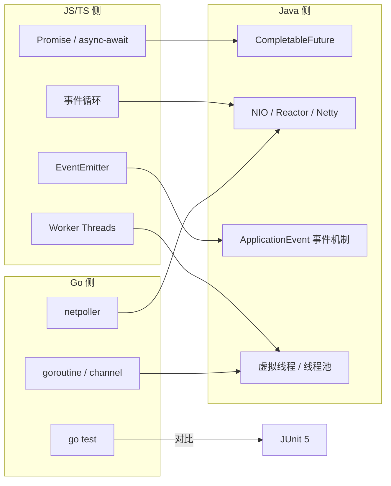

# 阶段一 · 小点 11：现有知识映射（JS/TS / Go → Java）

> 所属：阶段一 Java 语言深化与 JVM 体系
> 定位：把阶段零的「能力迁移对照」落到阶段一的技术点上——**每个映射给一段「同一件事的两种写法」对照代码**。学新概念时先来这里找锚点，学完后回来自验「细节可比」。
>
> ⚠️ **阅读顺序建议**：本文件是「迁移锚点速查」，理想上应放在阶段一最前（或并入阶段零）先读——但为保持编号稳定，它排在第 11。**建议你从阶段一第 1 讲开始，每学一个技术点回头查这里**，或干脆先通读本文件建立「Java ↔ 你熟悉的技术」的对照，再进阶段一正文，效率最高。

## 快速入门

> 本节为「迁移锚点速查」：先用你熟悉的前端 / Go 概念，快速对位到 Java 对应的写法；「细节差异与坑」留在正文提高部分。

### 本讲核心映射速查

| 你熟悉的 | Java 对应 | 一句话对比 |
|-|-|-|
| Promise | `CompletableFuture` | 都是「将来才有结果」的容器 |
| 事件循环 | 线程 / 虚拟线程 | 事件循环单线程非阻塞 vs Java 多线程/轻量线程 |
| EventEmitter | `ApplicationEventPublisher` | 都是发布订阅，但 Spring 事件长在事务上 |
| Worker Threads | 虚拟线程 | Worker 隔离 + 消息传递 vs 虚拟线程共享堆 |
| goroutine | 虚拟线程 | 都轻量、阻塞不占系统线程 |
| go test | JUnit + Mockito | 都是单元测试工具 |
| await/async | 同步 + 线程池/虚拟线程 | Java 无语法糖，靠调用 + 池/轻量线程 |

### 本讲在解决什么问题

- **问题**：你有前端 / Go 底子，很多概念已见过——但 Java 的实现方式不同。本讲帮你把「同一个概念的两种写法」对照起来，加速理解。
- **你要带走的一句话**：**概念是通用的，实现细节不同**。看到 Java 里不熟的写法，先到这里找「它对应我熟悉的哪个东西」，再补差异，效率最高。

### 最简对照示例（照抄能跑）

```java
// Promise ≈ CompletableFuture: 都是"将来才有值"的容器
import java.util.concurrent.*;

public class CfDemo {
    public static void main(String[] args) throws Exception {
        // JS:  Promise.all([a, b]).then(...)
        CompletableFuture<String> a = CompletableFuture.completedFuture("A");
        CompletableFuture<String> b = CompletableFuture.completedFuture("B");

        String result = CompletableFuture.allOf(a, b)          // 等两路都完成
            .thenApply(v -> a.join() + b.join())                // 完成后聚合
            .get(1, TimeUnit.SECONDS);                          // 带超时拿结果
        System.out.println(result);                             // AB
    }
}
```

> 代码备注（逐行解释）：
> - `CompletableFuture` 对应 JS 的 `Promise`：一个「将来才完成」的容器。
> - `CompletableFuture.allOf(a, b)` 对应 `Promise.all([a, b])`：等所有都完成。
> - `.thenApply(...)` 对应 `.then(...)`：完成后做下一步聚合。
> - `.get(1, TimeUnit.SECONDS)`：**带超时**拿结果——避免下游卡死导致永久挂起。
> - 区别：Java 没有 `async/await` 语法糖，靠链式调用 + 必须显式指定执行器（否则占公共池）。

### 关键映射 / 用法说明

| 你熟悉的 | Java 写法 | 差异要点 |
|-|-|-|
| `Promise.all` | `CompletableFuture.allOf` | Java 返回的 `.join()/.get()` 拿单个结果 |
| `EventEmitter` | `ApplicationEventPublisher` | Spring 事件默认**同步且在事务内**；要异步加 `@Async`，要事务边界用 `@TransactionalEventListener` |
| `goroutine` | `Thread.startVirtualThread` | Java 虚拟线程共享堆，共享可变状态要自己同步 |
| 事件循环（单线程） | 线程模型 | Node 单线程事件循环 vs Java 多线程/虚拟线程——并发模型不同 |

### 常用约定 / 迁移提醒

- **别把旧直觉硬搬**：如「回调别阻塞事件循环」在 Node 是对的，但 Java 虚拟线程时代，同步写法反而更简单（阻塞不占 OS 线程）。
- **Spring 事件 ≠ EventEmitter**：Spring 事件长在事务上（`@TransactionalEventListener(AFTER_COMMIT)`），这是 EventEmitter 没有的维度。
- **学新概念先找锚点**：到这张表对一下「对应我熟悉的什么」，再补差异——是这套文档反复强调的对比学习法。

## 精简大纲

1. 映射总图（7 条边）
2. 逐条对照代码：Promise / 事件循环 / EventEmitter / Worker / goroutine / netpoller / go test
3. 直觉迁移会踩的坑
4. 使用方式：学时查图、学后回图

## 学习内容详情

### 1. 映射总图



### 2. 逐条对照代码

#### 2.1 Promise → CompletableFuture

```javascript
// JS: Promise.all 并行三路 + 单路失败兜底
const [user, order] = await Promise.all([
  fetchUser(), fetchOrder(),
]).catch(() => [null, null]);        // catch 兜底整组
const name = user?.name ?? "匿名";     // 空值合并
```

```java
// Java 25: 同一件事 —— 注意 "必须显式执行器" 这个差异
try (var pool = java.util.concurrent.Executors.newFixedThreadPool(2)) {
    var user  = java.util.concurrent.CompletableFuture.supplyAsync(() -> fetchUser(), pool);
    var order = java.util.concurrent.CompletableFuture.supplyAsync(() -> fetchOrder(), pool);
    String name = java.util.concurrent.CompletableFuture
        .allOf(user, order)                          // ≈ Promise.all
        .thenApply(v -> user.join().name())          // ≈ await 之后的代码
        .exceptionally(e -> "匿名")                  // ≈ catch 兜底
        .join();
}
```

> **关键差异**：JS 的 Promise 由事件循环免费调度，Java 的必须指定线程池（否则走公共 ForkJoinPool，IO 阻塞会饿死它）；JS 有 `async/await` 语法糖，Java 靠链式 + `join()`。

#### 2.2 事件循环 → NIO Selector

```javascript
// Node: 事件循环藏在 runtime 里, 你只写回调
const server = http.createServer((req, res) => { res.end("ok"); });
server.listen(8080);   // libuv 在底层帮你 epoll/kqueue
```

```java
// Java: 事件循环是你自己写的那个 while(true)(或交给 Netty)
var selector = Selector.open();
// ... register(ACCEPT/READ) ...
while (true) {
    selector.select();                    // 等一批事件就绪 —— 你亲手控制循环
    for (var key : selector.selectedKeys()) {
        // 逐个处理就绪的连接(回调变成了显式的分发代码)
    }
}
```

> **关键差异**：Node 把事件循环封装进 runtime（单线程，回调不可阻塞）；Java 把循环暴露给你，默认多线程，可以阻塞（虚拟线程更进一步——直接允许同步写法）。

#### 2.3 EventEmitter → ApplicationEvent

```javascript
// Node: EventEmitter —— 发布订阅, 进程内
const { EventEmitter } = require("events");
const bus = new EventEmitter();
bus.on("order.paid", (order) => sendSms(order));   // 订阅
bus.emit("order.paid", { id: "o1" });              // 发布
```

```java
// Spring: 同一件事 —— 但监听器是 Bean, 且有事务边界变体
record OrderPaidEvent(String orderId) {}                        // 事件用 record(不可变)

@Component
class OrderListener {
    @TransactionalEventListener                       // 事务提交后才处理: 回滚了就不发短信
    public void on(OrderPaidEvent e) { sendSms(e.orderId()); }
}
// 发布方: applicationEventPublisher.publishEvent(new OrderPaidEvent("o1"));
```

> **关键差异**：`@TransactionalEventListener` 是 EventEmitter 没有的语义——「事务成功才触发」（阶段二第 1 讲展开）。

#### 2.4 Worker Threads → 虚拟线程

```javascript
// Node: Worker = 独立 isolate, 靠消息传递通信(内存不共享)
const { Worker } = require("worker_threads");
const w = new Worker("./heavy.js", { workerData: { n: 42 } });
w.on("message", (result) => console.log(result));   // postMessage 往返序列化
```

```java
// Java 25: 虚拟线程 = 共享堆的轻量执行单元, 成本低几个数量级
try (var exec = Executors.newVirtualThreadPerTaskExecutor()) {
    var future = exec.submit(() -> heavy(42));      // 直接传引用, 无序列化
    System.out.println(future.get());
}
```

> **关键差异**：Worker 是隔离的 isolate + `workerData` 一次性传值（安全但要序列化通信）；虚拟线程共享堆（传引用零成本，但共享可变状态必须自己做同步）——**成本模型完全不同，别用「Worker 很贵所以少开」的直觉套虚拟线程**。

#### 2.5 goroutine → 虚拟线程

```go
// Go: go 关键字随手开, channel 通信
ch := make(chan string, 3)
for i := 0; i < 3; i++ {
    go func(id int) { ch <- fetch(id) }(i)   // 每个任务一个 goroutine
}
for i := 0; i < 3; i++ { fmt.Println(<-ch) } // 收三份结果
```

```java
// Java 25: 虚拟线程对标 goroutine 的定位, 但无 channel, 用结构化并发/CompletableFuture 组合
try (var scope = new StructuredTaskScope.ShutdownOnFailure()) {   // JEP 505(预览): 结构化并发
    var a = scope.fork(() -> fetch(1));      // fork ≈ go, 但生命周期由 scope 管理
    var b = scope.fork(() -> fetch(2));
    scope.join().throwIfFailed();            // 任一失败 → 其余自动取消(比裸 go 更安全)
}
```

> **关键差异**：goroutine 配 channel 的 CSP 模型 Java 没有直接对应物；Java 的答案是**结构化并发**（任务组作为一个单元成败与共）+ 阻塞队列。

#### 2.6 netpoller → NIO（概念对照）

- Go 的 **netpoller**：runtime 内置的网络轮询器——`read` 一个未就绪的 fd 时，runtime 把这个 goroutine 挂起、把 fd 注册给 epoll，就绪后再唤醒。开发者完全无感。
- Java 把同样的机制暴露为 `Selector` API，再由 Netty / Tomcat 等框架封装。**机制同源（epoll/kqueue），暴露层级不同**——Go 藏得最深，Java 最显式。

#### 2.7 go test → JUnit 5

```go
// Go: 表驱动测试 + 内置断言
func TestDiscount(t *testing.T) {
    cases := []struct{ price, want float64 }{
        {100, 90}, {0, 0},                    // 表: 一处逻辑跑多组数据
    }
    for _, c := range cases {
        if got := discount(c.price); got != c.want {
            t.Errorf("discount(%v) = %v, want %v", c.price, got, c.want)
        }
    }
}
```

```java
// JUnit 5: @ParameterizedTest 是表驱动的正式版, AssertJ 断言失败信息更可读
@ParameterizedTest
@CsvSource({ "100, 90", "0, 0" })                     // 表就写在注解里
void discount(long price, double want) {
    assertThat(discount(price)).isEqualTo(want);      // 流式断言(AssertJ)
}
```

### 3. 直觉迁移会踩的坑

- **把 Promise 的微任务语义套到 CompletableFuture**：JS 的 `.then` 回调进微任务队列「几乎立即」执行；Java 的 `thenApply` 在**哪个线程**执行取决于完成时机（完成前注册 → 执行器线程；完成后注册 → 调用方线程）——依赖「下一个 tick」的代码会偶发错线程。
- **把 goroutine 成本模型套到平台线程**：`new Thread(...)` 每个都是 OS 级重资源（约 1MB 栈）；要 goroutine 的成本感必须用虚拟线程。
- **把 EventEmitter 的「同步调用回调」套到 Spring 事件**：默认 `@EventListener` 是同步的（在发布者线程执行、同一事务内）；要异步需 `@Async` + `@EnableAsync`，要「只在事务提交后触发」用 `@TransactionalEventListener(AFTER_COMMIT)`——跨了事务边界后行为完全不同。

### 4. 使用方式

1. **学新点时**：遇到 Java 概念先查总图找对应旧知识，用「类比 + 差异」两步建立记忆锚点（第 2 节每条的差异注记就是模板）。
2. **学完后**：回到第 2 节自问——只说得出「差不多」就是还没学透，回到对应小点补差异。

### 坑点提醒

- 映射表是**加速器不是等价声明**——每条「关键差异」注记都比代码本身重要，跳过它就是埋雷。
- 旧知识里的「最佳实践」未必迁移：JS「回调别阻塞事件循环」、Go「别共享内存靠通信」在 Java 虚拟线程时代的对应策略都变了。

## 本节自检

- [ ] 能脱稿画出映射总图（7 条边）
- [ ] 每条映射都能说出至少一个「Java 与旧知识的关键差异」，而不是停留在「概念一样」
- [ ] 能举出两个「直觉迁移会踩坑」的例子（微任务语义 / 成本模型 / 事件同步性）

## 本节配套思考题

1. 如果 Java 团队从 Node 迁移过来，最容易在「CompletableFuture 线程模型」上犯什么错？设计一个代码评审 checklist 防住它。
2. Go 开发者写 Java 常问「channel 在哪」——你会怎么向他解释 Java 选择了另一条路（结构化并发 + 阻塞队列），各自的取舍是什么？
3. 你计划用哪种语言特性做「迁移日记」（记录每次概念对照与踩坑）？这本身为什么值得做？
