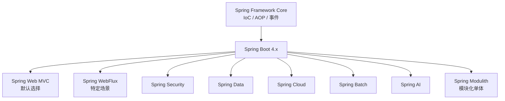
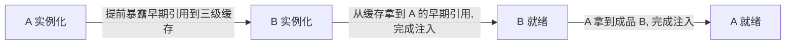

# 阶段二 · 小点 1：Spring Framework 核心

> 所属：阶段二 Spring 生态与 Web 开发核心
> 定位：Spring 是 Java 企业级开发的事实标准。你有 NestJS 经验——NestJS 的依赖注入、装饰器、模块化设计大量借鉴了 Spring，迁移成本比你想象的低。本讲先建立整个 Spring 生态的知识图谱，再吃透 IoC / AOP / 事件三大核心：**看不懂这一讲，后面所有 `@Autowired`、`@Transactional` 都只是「很神奇」**。

## 快速入门

> 本节为「零基础预热」：先认识本讲会用到的关键词与技术点，能照抄跑起来；「为什么这么设计、底层怎么实现」留在正文提高部分。

### 本讲核心关键词速查

| 关键词 | 一句话大白话 | 例子 |
|-|-|-|
| Spring 容器 | 一个「帮你造对象、帮你把对象之间连起来」的大管家 | 你只写 `@Service`，容器自动 new 并塞进需要的地方 |
| IoC（Inversion of Control，控制反转） | 对象不再由你自己 `new`，交给容器管理——你只声明「我要什么」 | 以前 `new OrderService()`，现在 `@Autowired OrderService` |
| DI（Dependency Injection，依赖注入） | 容器把你需要的依赖「递」给你，你不用自己找 | 构造器参数 `OrderRepository repo`，容器自动给 |
| Bean | 被容器管理起来的对象实例（一个普通对象，只是归容器管） | `@Service`/`@Component` 标注的类 |
| 注解 | 写在类/方法上的「标签」，告诉容器做什么 | `@Service`、`@Transactional` |
| AOP（Aspect-Oriented Programming，面向切面编程） | 把「每个方法都要但又不想每个都写」的逻辑抽出来统一做 | 日志、事务、权限校验 |
| @Transactional | 声明「这个方法要么全成功、要么全回滚」的事务切面 | 下单 + 扣库存必须一起成功 |
| 事件（Event） | 某件事发生后，广播给感兴趣的监听器去处理（解耦） | 下单成功 → 发短信 / 同步 ES |
| 代理对象 | 容器给你的其实是「替身」，替身在你调用前后插入额外逻辑 | 你注入的是代理，不是原始类 |

### 本讲在解决什么问题

- **问题**：一个企业后端，对象成千上万（service / repository / client），还要处理日志、事务、权限。如果把「怎么 new」「怎么连」「怎么记日志」「怎么开事务」全写进代码，就成一团乱麻。
- **Spring 的答案**：把「怎么造对象、怎么连对象」交给**容器**；把「日志/事务这类横切逻辑」交给 **AOP** 切面；把「某件事发生后的连锁反应」交给**事件**。你专注业务本身。
- **你要带走的一句话**：你写的每个 `@Service` / `@Autowired`，背后都是容器在替你完成「创建 + 连接」——所以**别在构造器里用依赖、别用 `this` 调事务方法**，因为容器给你的永远是「代理 + 已注入好的对象」。

### 最简可运行示例（照抄能跑）

```java
// ① 一个业务类：标注 @Service，Spring 就把它交给容器管理
@Service
public class HelloService {
    public String hello() { return "你好，Spring"; }
}

// ② 一个控制器：标注 @RestController，对外暴露接口；构造器注入让容器把 HelloService 递进来
@RestController
public class HelloController {
    private final HelloService helloService;    // final: 构造后不可变, 这是推荐写法

    // 构造器注入(单构造器可省 @Autowired): 依赖一目了然、可 final、单测好写
    public HelloController(HelloService helloService) {
        this.helloService = helloService;       // 容器自动把 HelloService 塞进构造器
    }

    @GetMapping("/hello")
    public String hello() {
        return helloService.hello();            // 直接调用，背后是容器给好的代理对象
    }
}
```

> 代码备注（逐行解释）：
> - `@Service` 告诉容器「这个类要交给容器管理、可以被别人注入」。
> - `@RestController` 告诉 Spring「这个类处理 HTTP 请求，返回值自动转成 JSON」。
> - **构造器注入**（推荐）：`public HelloController(HelloService helloService)`——容器自动把匹配的 Bean 塞进构造器；字段可 `final`、依赖一目了然。
> - `@GetMapping("/hello")` 表示「浏览器访问 `/hello` 这个地址，就执行下面的方法」。
> - 你从没写过一个 `new HelloService()`，但它却能正常执行——这就是 IoC：对象由容器创建装配。注解版 `@Autowired` 用在字段上是反模式（正文展开），本示例用更规范的构造器注入。

### 关键注解 / 类说明

| 注解 / 类 | 干什么 | 最易踩的坑 |
|-|-|-|
| `@Component` | 基础「交给容器」标注；`@Service`/`@Repository`/`@Controller` 是它的语义化变体 | 忘了标 = 容器不认识，注入时报「找不到 Bean」 |
| `@Autowired` | 从容器拿一个 Bean 注入 | 可省略（单构造器），但字段注入是反模式 |
| `@Configuration` + `@Bean` | 第三方库对象、需要定制逻辑的对象，用这种方式手动声明进容器 | 方法名即 Bean 名；返回值类型决定匹配 |
| `@Aspect` | 声明切面类（配合 `@Component`） | 忘了 `@Component` 切面不生效 |
| `@Transactional` | 方法级事务（成功提交/异常回滚） | `this` 自调用、非 public、受检异常默认不回滚——五大失效场景 |
| `ApplicationEventPublisher` | 发布事件 | 监听器默认同步且在事务内，副作用逻辑要用 `@TransactionalEventListener` |

### 常用约定 / 命名提示

- **注解分层命名**：`@Controller`（Web 入口）/ `@Service`（业务）/ `@Repository`（数据）——语义不同但效果都是「交给容器」。
- **构造器注入是惯例**：能 `final`、依赖一目了然、单测好写；字段注入（`@Autowired` 属性）是反模式，能不用就不用。
- **看到 `javax.*` 换 `jakarta.*`**：Boot 4 / Jakarta EE 11 已全量迁移，老教程里的 `javax.servlet` 等已废弃。
- **排查「Bean 注入失败」**：先问「这个类标 `@Component` 了吗」→「它在 Spring 能扫到的包下面吗」→「构造器参数容器里有对应 Bean 吗」。

## 精简大纲

1. Spring 生态知识图谱（本讲视角的全景）
2. IoC 容器：Bean 生命周期 / 作用域 / 循环依赖与三级缓存
3. AOP：动态代理选择、事务原理与五大失效场景
4. 事件机制：ApplicationEvent 与事务边界
5. 资源与环境抽象

## 学习内容详情

### 0. 生态知识图谱



> **IoC（Inversion of Control，控制反转）**：对象的创建与装配不由你自己 `new`，而是交给容器管理——你只声明「我需要什么」，容器负责「造好并递给你」。NestJS 的 `@Injectable()` + 依赖注入是同一个思想。
> **AOP（Aspect-Oriented Programming，面向切面编程）**：把日志、事务这类「每个方法都要但每个方法都不该写」的横切逻辑抽出来集中声明。
> **基线提示**：Boot 4 / Framework 7 基于 Jakarta EE 11，所有 `javax.*` 早已迁移为 `jakarta.*`（`jakarta.servlet`、`jakarta.persistence`……）——看到老博客里的 `javax.*` 要自觉换算。

### 1. IoC 容器

#### 1.1 Bean 的声明与注入

**Bean**：被 IoC 容器管理的对象实例（≈ NestJS 里 `@Injectable()` 标注后由框架容器实例化的 provider）。

```java
// 声明方式一：@Component 系列派生注解（按分层语义选，效果相同）
@Service                    // 业务层（NestJS 的 @Injectable() 通常放 service）
public class OrderService {

    private final OrderRepository repo;   // final：构造后不可变，线程安全的基础
    private final PriceClient priceClient;

    // ✅ 构造器注入（Spring 4.3+ 单构造器可省 @Autowired）
    // 为什么推荐：依赖一目了然、字段可 final、单测里直接 new 出来不需要容器
    public OrderService(OrderRepository repo, PriceClient priceClient) {
        this.repo = repo;
        this.priceClient = priceClient;
    }
}

// ❌ 字段注入的反例（能跑但工程上被弃用）
// @Autowired private OrderRepository repo;  // 依赖藏在类里、不能 final、离了容器没法测
```

```java
// 声明方式二：@Configuration + @Bean —— 用于「类不是你写的，没法加 @Component」的场景
// （第三方库对象、需要构造逻辑的对象），等价于 NestJS 自定义 Provider 的 useFactory
@Configuration
public class HttpClientConfig {

    @Bean                    // 方法返回值进容器，方法名默认是 Bean 名
    RestClient priceRestClient(RestClient.Builder builder) {
        return builder
                .baseUrl("https://price.internal")   // 专线默认地址
                .build();
    }
}
```

> 对照 NestJS：`@Configuration` + `@Bean` ≈ 自定义 Provider；`@ComponentScan` ≈ NestJS Module 的 `imports` 聚合——差异是 Spring 默认**隐式递归扫描**同包及子包，NestJS 的模块关系**显式声明**。排查「为什么这个 Bean 没被注入」时，Spring 查「扫描路径覆盖没有」，NestJS 查「Module 引了没有」。

#### 1.2 Bean 生命周期

```java
@Component
public class CacheWarmer {

    public CacheWarmer() {
        // ① 实例化：容器调构造器（此时字段还没注入，别在这里用依赖！）
    }

    @PostConstruct            // ③ 初始化回调：依赖注入完成之后、对外服务之前
    public void warmUp() {
        // 适合做：预热缓存、校验配置、注册 shutdown 钩子之外的一次性准备
        log.info("缓存预热完成");
    }

    @PreDestroy               // ④ 销毁回调：容器关闭时（K8s 滚动更新杀 Pod 前会走到）
    public void cleanup() {
        // 适合做：刷新缓冲、释放连接
    }
}
```

完整顺序（面试口径）：**实例化 → 属性填充 → Aware 回调 → BeanPostProcessor 的 `postProcessBeforeInitialization` → `@PostConstruct` / `afterPropertiesSet` / `init-method` → BeanPostProcessor 的 `postProcessAfterInitialization` → 就绪使用 → `@PreDestroy` → 销毁**。

> **BeanPostProcessor**：容器级的「加工流水线」钩子，对**所有 Bean** 的初始化前后各插一手。它不是给你业务用的——Spring 自己靠它实现大量魔法（如 `@Configuration` 的增强、AOP 代理的生成）。你知道「代理对象是在 `postProcessAfterInitialization` 这一步替换进容器的」即可解释很多现象。

#### 1.3 作用域

| 作用域 | 语义 | NestJS 对应 |
|-|-|-|
| `singleton`（默认） | 容器内一个实例，全局共享 | 默认单例 Provider |
| `prototype` | 每次注入 / 获取都新建 | `scope: Scope.TRANSIENT` |
| `request` / `session` | 每个 HTTP 请求 / 会话一个实例 | `scope: Scope.REQUEST` |

> 坑：singleton Bean 注入 prototype Bean 时，prototype 只在注入那一刻创建一次——「注入的 prototype 失效」。解法：注入 `ObjectProvider<T>` 按需 `getObject()`。

> ⏸️ **短期可以不学**：`request` / `session` 作用域在绝大多数业务里用不到（会话状态、租户隔离等特定场景才需要），且它让每个请求都新建 Bean、有额外开销。**何时回来学**：需要「跟随请求/会话」的有状态对象时。**面试最低要求**：能说清 singleton（默认）与 prototype 的区别，知道 request / session 是 Web 场景的扩展作用域即可。

#### 1.4 循环依赖与三级缓存

**循环依赖**：A 构造需要 B，B 构造又需要 A。Spring 用**三级缓存**解决 setter / 字段注入的环：



- 一级缓存 `singletonObjects`：成品 Bean；二级 `earlySingletonObjects`：提前曝光的半成品；三级 `singletonFactories`：**ObjectFactory**——关键在工厂可以延迟决定「返回原始对象还是 AOP 代理」，避免不必要的提前代理。
- **为什么必须是三级而不是两级**：AOP 代理是 Bean 初始化完成后由 BeanPostProcessor 才生成的，若只有「原始对象缓存」，就无法把代理暴露给循环引用方。若退而求其次用两级并提前生成代理，则每个 Bean 都得在实例化时就把代理造好——绝大多数 Bean 根本不参与循环依赖，白白多一层代理开销。三级缓存让「要不要代理」推迟到真正发生循环依赖的那一刻才做决定。
- **构造器注入的循环依赖无解**（Spring 直接启动报错）——这通常是设计问题（职责没拆开），该拆类而不是加 `@Lazy` 绕过。`@Lazy` 能解但要明白它只是把依赖推迟到首次使用。

### 2. AOP

#### 2.1 切面怎么写

```java
@Aspect                     // 声明这是一个切面类（还要 @Component 让容器管理它）
@Component
public class AuditLogAspect {

    // 切点表达式：对哪些方法生效。execution(修饰符 返回值 包名.类.方法(参数))
    // 下面含义：com.demo.order 包及子包下所有 Service 类的所有方法
    @Pointcut("execution(* com.demo.order..*Service.*(..))")
    public void serviceLayer() {}

    @Around("serviceLayer()")           // 环绕通知：完全接管方法执行（最强也最危险）
    public Object log(ProceedingJoinPoint pjp) throws Throwable {
        long start = System.nanoTime();
        try {
            return pjp.proceed();       // 放行目标方法；不调用 = 方法被「吃掉」
        } finally {
            log.info("{} 耗时 {}ms, 参数={}",
                    pjp.getSignature(),                 // 方法签名
                    (System.nanoTime() - start) / 1_000_000,
                    Arrays.toString(pjp.getArgs()));    // ⚠️ 生产要脱敏，别打密码/Token
        }
    }
}
```

> 底层就是阶段一第 3 讲的动态代理：容器注入给你的 `OrderService` 实际是**代理对象**——纯 Spring 5 默认「有接口走 JDK 代理、无接口走 CGLIB」；Spring Boot 2+ 默认 `spring.aop.proxy-target-class=true`，**一律用 CGLIB 生成子类**（不需要接口、能代理无接口类），方法调用先进切面链，再透传给真实对象。
> 对照 NestJS：能力上 ≈ Interceptor，但 Spring AOP 在**字节码代理层**工作——任何 Bean 方法都能切（包括 Service 内部方法间调用之外的入口），NestJS Interceptor 只包 Controller 路由。

#### 2.2 声明式事务与传播行为

`@Transactional` 本质是一个环绕切面：开启事务 → 执行方法 → 无异常提交 / 有异常回滚。

```java
@Service
public class OrderService {

    @Transactional                 // 默认对 RuntimeException 和 Error 回滚
    public void placeOrder(OrderCmd cmd) {
        orderRepo.save(cmd.toOrder());
        outboxRepo.save(new OutboxEvent("OrderPlaced", cmd.id()));  // 同一事务：要么都成功要么都回滚
    }

    @Transactional(propagation = Propagation.REQUIRES_NEW)
    public void audit(String action) {
        // REQUIRES_NEW: 挂起外层事务, 开独立新事务
        // 用途：操作日志「主事务回滚了也要留下来」的场景
        auditRepo.save(action);
    }
}
```

常用传播行为：`REQUIRED`（默认，有就加入没有就新建）/ `REQUIRES_NEW`（独立新事务——挂起外层并另占一条数据库连接，代价最贵）/ `NESTED`（保存点，可部分回滚，不换连接）/ `SUPPORTS`（有就有没有就没有）。

#### 2.3 五大失效场景（高频考点，必须能推导而不是背）

```java
@Service
public class OrderService {

    @Transactional
    public void placeOrder(OrderCmd cmd) { ... }

    public void placeOrderWrong(OrderCmd cmd) {
        // ❌ 失效场景 1：自调用 —— this.placeOrder() 走的是「原始对象」而不是代理对象,
        //    切面根本没机会介入（容器注入的才是代理, this 是裸对象）
        this.placeOrder(cmd);
    }

    @Transactional
    void internalMethod() {
        // ❌ 失效场景 2：非 public 方法 —— 代理拦截默认只覆盖 public 方法
    }

    @Transactional
    public void swallow() {
        try {
            risky();
        } catch (Exception e) {
            // ❌ 失效场景 3：异常被吞 —— 切面看不到异常, 照常提交
            log.warn("忽略", e);
        }
    }

    @Transactional
    public void wrongRollbackFor() throws Exception {
        // ❌ 失效场景 4（半失效）：默认不回滚「受检异常」。
        //    抛 Exception(受检) 不会回滚, 除非显式 rollbackFor
        throw new Exception("受检异常默认不触发回滚");
    }
}
// ❌ 失效场景 5：多线程边界 —— 事务上下文绑定在 ThreadLocal,
//    在 @Transactional 方法里开子线程做 DB 操作, 子线程不在同一事务里
```

> 推导心法：`@Transactional` = 代理对象上的环绕切面 + ThreadLocal 绑定的事务上下文。任何让「调用没经过代理」或「执行换了线程」的写法都会让它失效。

### 3. 事件机制

```java
// ① 定义事件：ApplicationEvent 的子类（或任意 POJO，Spring 4.2+ 不强制继承）
public record OrderPlacedEvent(Long orderId, BigDecimal amount) {}

@Service
public class OrderService {
    private final ApplicationEventPublisher publisher;   // 容器自带, 注入即用

    @Transactional
    public void place(OrderCmd cmd) {
        Long id = orderRepo.save(cmd.toOrder()).getId();
        publisher.publishEvent(new OrderPlacedEvent(id, cmd.amount()));
        // ⚠️ 事件此刻只是"发出", 监听器何时执行取决于监听器的事务绑定方式
    }
}

@Component
public class OrderPlacedListeners {

    @EventListener                       // 同步执行, 在发布线程里直接跑（默认在事务内！）
    public void syncNotify(OrderPlacedEvent e) { smsClient.send(...); }
    // 风险：监听器抛异常会回滚主事务 —— 发短信的失败不该拖垮下单

    @TransactionalEventListener(phase = TransactionPhase.AFTER_COMMIT)  // ✅ 事务提交后才执行
    public void afterCommitSyncEs(OrderPlacedEvent e) { esClient.index(...); }
    // 用途：落库成功后才同步 ES / 发通知 —— 「数据都进去了再做副作用」的标准写法
}
```

> 坑：`@TransactionalEventListener` 默认**只在「存在事务且提交成功」时执行**——方法没开事务时它直接静默跳过（设 `fallbackExecution = true` 才在无事务时也执行）。这是它和普通 `@EventListener` 行为差异最大的地方，线上「事件没发出去」先查这一条。

> 对照 NestJS 的 EventEmitter：同样是发布订阅，但 Spring 事件**长在事务上**——这是 NestJS 没有的维度，也是阶段四「Outbox / 事件驱动」的本地事务基础。

### 4. 资源与环境

```java
@Component
public class PriceGateway {
    public PriceGateway(Environment env) {
        // Environment：配置的统一读取门面（profile / 环境变量 / yml 都从这里出）
        String key = env.getProperty("price.api-key", "default");  // 带默认值
        String[] active = env.getActiveProfiles();                 // 当前激活的 profile
    }
}
```

- `Resource` 抽象统一 classpath / file / URL 三种资源定位（`@Value("classpath:rules.json")`）。
- `PropertySource` 体系：配置的多层来源按优先级叠加——Boot 的 `application.yml` 构建于此（下讲展开）。

> ⏸️ **短期可以不学**：`Resource` 抽象与 `PropertySource` 细节，日常业务开发基本碰不到——Boot 的 `application.yml` + `@ConfigurationProperties` 已经覆盖 99% 的配置读取需求。**何时回来学**：做框架 / 中间件开发、需要统一读取 classpath 与文件系统资源时。**面试最低要求**：知道 `@Value` 与 `Environment` 是两种配置读取入口即可。

### 坑点提醒

- **不要在构造器里用注入的依赖**——构造器执行时属性注入还没发生，需要初始化逻辑放 `@PostConstruct`。
- **自调用是 AOP 失效第一现场**：同类的 `this.method()` 一律不走代理。需要内部走切面时，构造器注入下可用 `ObjectProvider<T>` 延迟拿自身代理，或 `AopContext.currentProxy()`（需开启 `exposeProxy`）——但首选永远是拆类。
- **`@Transactional` 方法里别做远程调用 / 大文件 IO**——事务（数据库连接）被长时间占住，高并发下连接池瞬间打满。
- 事件监听器默认**同步且在事务内**：副作用类逻辑（通知 / 同步外部系统）一律 `@TransactionalEventListener(AFTER_COMMIT)`。
- singleton Bean 持有可变状态是并发 bug 之源——singleton 里只放**无状态**服务。

## 本节自检

- [ ] 能完整背出 Bean 生命周期，并指出 BeanPostProcessor 两个回调的确切位置
- [ ] 能画图讲清三级缓存怎么解决循环依赖，以及为什么构造器注入无解
- [ ] `@Transactional` 失效的五个场景能逐一推导（不是背）
- [ ] 能说清 `@TransactionalEventListener` 与普通 `@EventListener` 的差异及典型用途
- [ ] 能解释注入到你的 `OrderService` 为什么是代理对象、代理是什么时候生成的

## 本节配套思考题

1. 把上面「失效场景 1 自调用」改成不失效的两种方案，各自代价是什么？
2. `REQUIRES_NEW` 的操作日志事务如果卡死，外层下单事务会怎样？怎么兜底？
3. NestJS 的请求作用域 Provider 在性能上为什么不推荐？对应到 Spring 的 `request` 作用域，什么场景才真正需要它？

## 常见面试题

### Q1：Spring 中 Bean 的生命周期是怎样的？`@PostConstruct`、`InitializingBean`、`init-method` 的执行顺序？
**答**：标准答案是一串阶段：**实例化（new 出对象）→ 属性填充（注入依赖）→ Aware 回调（如 `BeanNameAware`）→ `BeanPostProcessor.postProcessBeforeInitialization` → 初始化回调（`@PostConstruct` → `InitializingBean.afterPropertiesSet` → `init-method`，三者按此顺序）→ `postProcessAfterInitialization` → 就绪使用 → 销毁（`@PreDestroy` → `destroy`）**。原理层：容器把「创建对象」拆成多个可插拔阶段，每个阶段都留扩展点，`BeanPostProcessor` 是**容器级**流水线，对容器里所有 Bean 生效——Spring 自己的魔法（AOP 代理生成、`@Configuration` 增强）都是挂在这里的。工程层：初始化逻辑放 `@PostConstruct` 而不是构造器——构造器执行时依赖还没注入完，在构造器里用注入字段必踩 NPE；且别把 `BeanPostProcessor` 当业务工具用，它作用于全局、影响面太大。

### Q2：Spring 是如何解决循环依赖的？为什么构造器注入的循环依赖解决不了？
**答**：标准答案：A 依赖 B、B 依赖 A 时，Spring 用三级缓存破环——`singletonObjects`（一级，成品）、`earlySingletonObjects`（二级，提前暴露的半成品）、`singletonFactories`（三级，ObjectFactory 工厂）。流程：A 实例化后先把工厂放进三级缓存并提前暴露；B 创建时从三级取工厂拿到 A 的早期引用、完成自己的注入后进入一级；A 再拿成品 B 完成注入。原理层：**为什么是三级而不是两级**——AOP 代理要等 BeanPostProcessor 在初始化后生成，三级缓存把「返回原始对象还是代理」的决策推迟到真正发生循环依赖那一刻，避免所有 Bean 都提前生成代理。工程层：该机制只救得了 setter / 字段注入；构造器注入的环在 Spring 看来是「构造器调用无法提前暴露对象」，直接启动报错——这通常是职责没拆开的设计信号，正确做法是拆类，而不是 `@Lazy` 一刀切绕过。

### Q3：`@Transactional` 有哪些常见的失效场景？
**答**：标准答案五大场景：①**自调用**——同类里 `this.method()` 走的是原始对象而非代理，切面没机会介入；②**非 public 方法**——代理默认只拦截 public；③**异常被吞**——try-catch 里把异常吃掉了，切面看不到异常照常提交；④**受检异常默认不回滚**——抛 `Exception`（checked）不触发回滚，需显式 `rollbackFor`；⑤**多线程边界**——事务上下文绑定在 ThreadLocal，在事务方法里开子线程做 DB 操作，子线程不在同一事务。原理层：`@Transactional` = 代理对象上的环绕切面 + ThreadLocal 绑定的连接/事务上下文，凡是让「调用绕过代理」或「执行换了线程」的写法都会失效。工程层：自调用优先拆类；业务异常一律自定义 `RuntimeException`（如 `BizException`），天然默认回滚，别依赖 `rollbackFor` 兜底；`@Transactional` 只标在 public 方法上。

### Q4：`REQUIRED`、`REQUIRES_NEW`、`NESTED` 三种传播行为有什么区别？各自适合什么场景？
**答**：标准答案：`REQUIRED`（默认）有事务就加入、没有就新建；`REQUIRES_NEW` 挂起外层事务、开一个全新的独立事务；`NESTED` 在外层事务里建**保存点（savepoint）**，内层回滚只回滚到保存点、不影响外层。原理层：`REQUIRES_NEW` 会另占一条数据库连接，内外层互不可见、必须等内层提交外层才能提交——代价最贵；`NESTED` 不换连接，靠数据库保存点实现「部分回滚」，代价低。工程层：操作审计日志用 `REQUIRES_NEW`——「主事务回滚了日志也要留下」；某个失败不影响全局的步骤（如批量处理中的单项失败）用 `NESTED`；绝大多数业务用默认 `REQUIRED` 就够了，别滥用前两者——连接被多占、长事务风险都随之而来。

### Q5：Spring AOP 默认用 JDK 动态代理还是 CGLIB？两者有什么区别？
**答**：标准答案：纯 Spring（Framework）默认「目标有接口走 JDK 动态代理、无接口走 CGLIB」；**Spring Boot 2+ 默认 `spring.aop.proxy-target-class=true`，一律用 CGLIB**。原理层：JDK 代理基于接口在运行时生成代理类、用反射调用目标方法，要求目标必须实现接口；CGLIB 基于字节码生成目标类的**子类**，不要求接口，但 `final` 类 / `final` 方法无法被继承增强。工程层：Boot 默认 CGLIB 是为了「不需要接口也能被切面覆盖」，代价是别把切面目标方法标成 `final`；这也是 `@Transactional` 失效场景的一个隐蔽变体——方法标了 `final`，CGLIB 增强不到，事务静默失效。判断线上用的是哪种，看启动日志里的 `proxyTargetClass` 或 DEBUG 日志即可。
