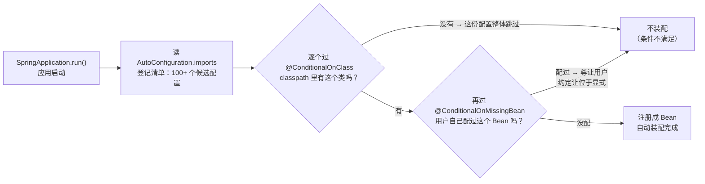
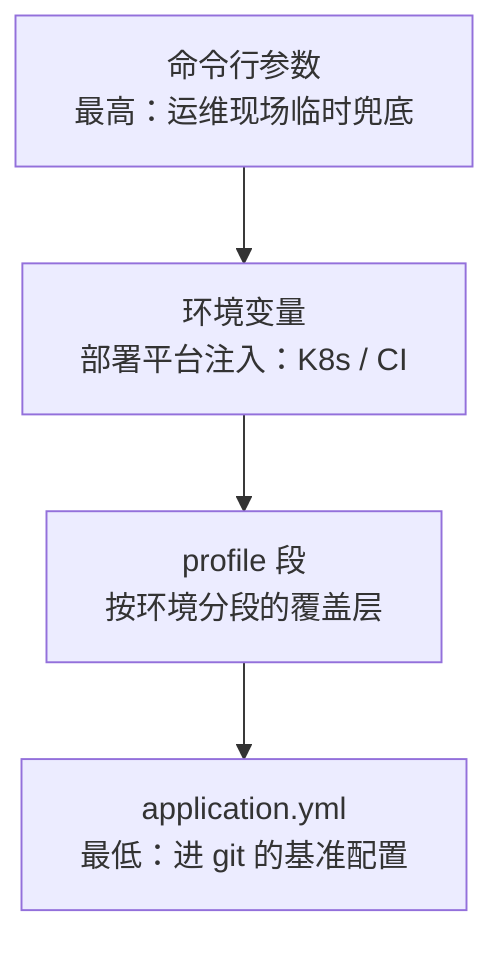
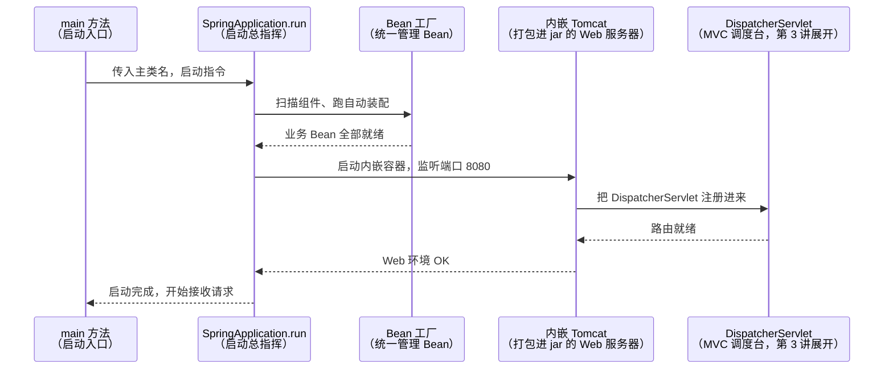
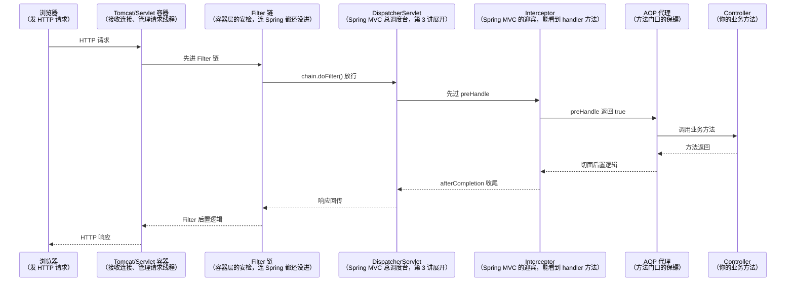
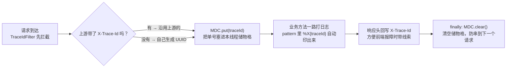

# 阶段二 · 小点 2：Spring Boot 4.x 实战

> 所属：阶段二 Spring 生态与 Web 开发核心
> 定位：Boot 的价值是「约定优于配置」——**理解自动装配后，它就从「魔法」变成「可以推理的系统」**：为什么引一个 starter 就有了数据源？为什么改个 yml 前缀就能连上别的 Redis？答案都在本讲。
> 版本基线：Boot 4 = Framework 7 = Jakarta EE 11 基线；starter 模块化细分、引入 JSpecify（标「这个参数/返回值可能为 null 还是非 null」的注解规范，配合静态检查在编译期抓空指针）空安全标注等——具体升级差异以官方迁移指南为准。

## 快速入门

> 本节为「Boot 速览」：先认识 Boot 怎么让一个项目跑起来、`application.yml` 配什么；「自动装配原理、starter 机制」留在正文提高部分。

### 本讲核心关键词速查

| 关键词 | 一句话大白话 | 例子 |
|-|-|-|
| Spring Boot | 让 Spring 项目「开箱即用」的框架 | 引依赖 + 写几个类就能出接口 |
| starter | 一个依赖包，引进来就自带一堆能力 | `spring-boot-starter-web` |
| @SpringBootApplication | 项目入口：自动配置+组件扫描+配置类 | 主类上标注 |
| 自动装配（Auto-Configuration） | Spring 看你要什么，自动建好 Bean | 引了 web 就有 Tomcat + 一堆自动配置 |
| application.yml | 项目配置文件 | 端口/数据库/日志写这里 |
| @ConfigurationProperties | 把配置映射成强类型 Bean | 配置文件 → Java 类 |
| Actuator | Boot 自带的监控端点 | `/actuator/health` |

### 本讲在解决什么问题

- **问题**：以前搭 Spring 要配一堆 XML/类，很繁琐。Boot 用「约定优于配置」——按套路放文件、引 starter，项目就能跑。
- **一句话类比——酒店定食 vs 从头点菜**：生活版：坐进 Boot 这家店，位子（端口 8080）、餐具（JSON 转换）、菜单结构（目录约定）都摆好了，你只负责下单；不满意可以换（改 yml），但不用从摆桌开始。换成 Spring：Boot 预置好默认端口、默认 JSON 序列化、约定的目录结构与扫描规则，你写的 `application.yml` 只是「订单备注」——覆盖默认值，而不是从头搭一套。
- **你要带走的一句话**：`@SpringBootApplication` 是入口，它同时干了「自动配置 + 组件扫描 + 自己是个配置类」三件事；写配置进 `application.yml`，很多能力靠「引 starter」就有了。

### 最简可运行示例（照抄能跑）

```java
// ① 主类: 加上 @SpringBootApplication 就是启动入口
@SpringBootApplication
public class DemoApplication {
    public static void main(String[] args) {
        SpringApplication.run(DemoApplication.class, args);   // 启动内嵌 Tomcat
    }
}
```

```yaml
# ② application.yml: 项目配置放在这里
server:
  port: 8080                 # 服务端口
spring:
  datasource:
    url: jdbc:mysql://localhost:3306/demo   # 数据库地址
    username: root
    password: ${DB_PASSWORD}     # 密钥用环境变量, 别写死
```

```java
// ③ 一个接口: 引了 spring-boot-starter-web 就能用 @RestController
@RestController
public class HelloController {
    @GetMapping("/hello")
    public String hello() { return "你好"; }
}
```

> 代码备注（逐行解释）：
> - `@SpringBootApplication`：让 Spring 自动配置、扫描组件、并把自己当配置类——一个注解搞定三件事。
> - `SpringApplication.run(...)`：启动内嵌 Tomcat 并运行业务。
> - `application.yml`：集中放端口、数据库等配置；`${DB_PASSWORD}` 从环境变量读密钥（不写死）。
> - `@RestController` + `@GetMapping`：引了 `spring-boot-starter-web` 后就有了 web 能力，写个类就能出接口。
> - 你只引了一个 starter、写了几行，项目就跑起来了——这就是 Boot「约定优于配置」。

### 关键概念 / 注解说明

| 概念 / 注解 | 干什么 | 最易踩的坑 |
|-|-|-|
| `@SpringBootApplication` | 启动入口（自动配置+扫描+配置类） | 每个项目只有一个；要放在能扫到所有包的顶层 |
| starter | 依赖包，引进即生效 | 别乱引多余 starter（会让自动配置打架） |
| `application.yml` | 配置文件 | 多环境用 `spring.profiles.active` 切换 |
| `@ConfigurationProperties` | 配置映射成强类型对象 | 前缀要跟 yml 对上 |
| `@Value` | 读单个配置值 | 多个相关配置用 `@ConfigurationProperties` 更好 |
| Actuator | 监控端点 | 记得加访问控制（阶段二第 6 讲），别裸奔公网 |

### 常用约定 / 命名提示

- **端口默认 8080**；改配置进 `application.yml` 的 `server.port`。
- **数据库密钥别写死**：用 `${ENV}` 从环境变量读，是这套文档反复强调的红线。
- **学了 `@ConfigurationProperties` 就用它**：别到处 `@Value` 散落配置，把一组配置收敛成强类型对象更清晰。
- **Actuator 端点要保护**：`/actuator/**` 一旦暴露公网，等于把配置/线程/堆交出去——记得加权限。

## 精简大纲

1. 自动装配原理：@SpringBootApplication 拆解与 starter 机制
2. 配置体系：application.yml / 多环境 / @ConfigurationProperties
3. 内置容器与 Filter / Interceptor 执行顺序
4. Actuator 监控
5. AOT 与原生镜像
6. 日志体系与 MDC TraceID

## 学习内容详情

### 1. 自动装配原理

#### 1.1 @SpringBootApplication 拆解

```java
@SpringBootApplication        // 这个注解 = 下面三个的组合
//  @SpringBootConfiguration   → 本质是 @Configuration：这个类是配置类（容器入口）
//  @ComponentScan             → 扫描本包及子包的 @Component（隐式递归, 范围=主类所在包）
//  @EnableAutoConfiguration   → 开启自动装配：把 classpath 里"认得"的组件自动配好
public class DemoApplication {
    public static void main(String[] args) {
        SpringApplication.run(DemoApplication.class, args);
    }
}
```

> **NestJS 对照**：`@SpringBootApplication` ≈ 自动配置版的 `@Module`——NestJS 里模块、控制器、服务都要你手动登记进 `@Module` 的 imports / controllers / providers；Boot 则靠这一个注解自动完成「组件扫描 + 自动配置」，登记手续省了一大半，代价是「隐式发生」——排查时才需要看背后的机制（本讲 1.2 节）。

> **starter**：一组依赖 + 一份自动配置的「套餐」，≈ 你熟悉的 npm 包——npm 装一个库会把它的依赖一起带上，starter 也一样，引一个依赖就得到全家桶。`spring-boot-starter-web` 引入即得 Tomcat + Spring MVC + Jackson（Jackson：JSON ↔ Java 对象互转库，对应你用过的 `JSON.stringify` / axios 自带的序列化）——「引了就有」不是依赖本身有魔力，而是它的 jar 里带着自动配置类。

#### 1.2 条件装配：自动配置的开关

```java
// 看一个自动配置类的骨架（简化自 spring-boot-autoconfigure 的真实源码）
@AutoConfiguration                          // Boot 3+ 替代旧 @Configuration 的语义化注解
@ConditionalOnClass(DataSource.class)       // 开关①: classpath 里有 DataSource 这个类才生效
                                              // （没引 JDBC 依赖时这份配置整体跳过）
@ConditionalOnMissingBean(DataSource.class) // 开关②: 容器里还没有用户自己配的 DataSource
                                              // （用户手动配了就尊让用户 —— "约定让位于显式"）
@ConditionalOnProperty(
        prefix = "app.datasource",          // 开关③: 配置开关 app.datasource.enabled=true
        name = "enabled", havingValue = "true")
public class DataSourceAutoConfiguration {

    @Bean
    @ConfigurationProperties("app.datasource")  // 把 app.datasource.* 的 yml 批量绑到属性
    DataSource dataSource(DataSourceProperties props) {
        return props.initializeDataSourceBuilder().build();
    }
}
```

- 装配清单登记文件：`META-INF/spring/org.springframework.boot.autoconfigure.AutoConfiguration.imports`（Boot 2.7 前是 `spring.factories`——旧资料常见，注意区分）。

自动装配的完整流程长这样——条件注解就是每一站的「开关」：



> 🏪 类比——**宜家说明书按包选装**。生活版：说明书列了 100 多个安装步骤，但你不必全做——箱子里（classpath）有那包螺丝（DataSource 类）才装那一步；你已经自己拧过螺丝（自定义 Bean），说明书就自动跳过那一页。换成 Spring：上面流程图里的条件注解，就是说明书上打勾的那一步——条件满足才装配、不满足就跳过，这就是「引依赖即生效」的机制内核（为什么必须靠条件注解，见下）。
- **为什么必须靠条件注解**：自动配置类对所有应用「一视同仁」加载，但每个应用引入的依赖千差万别——条件注解就是「这个环境需要我吗」的开关，让同一份自动配置在不同项目里各取所需，这正是「引依赖即生效」的约定式体验的来源。反过来，排查「自动配置为什么没生效」也从它入手。
- 排查工具：启动参数 `--debug` 会打印**条件评估报告**（哪个配置为什么没生效，`CONDITIONS EVALUATION REPORT`）。

#### 1.3 写一个自定义 starter（步骤）

```
my-spring-boot-starter/
├── pom.xml                          （只依赖 spring-boot-autoconfigure）
└── src/main/resources/META-INF/spring/
    └── org.springframework.boot.autoconfigure.AutoConfiguration.imports
        → 内容一行: com.demo.starter.WarnAutoConfiguration   （登记自动配置类的全限定名）
```

```java
@AutoConfiguration
@ConditionalOnClass(WarnClient.class)                 // 用户引了你的核心包才装配
@EnableConfigurationProperties(WarnProperties.class)  // 启用类型安全配置绑定
public class WarnAutoConfiguration {
    @Bean
    @ConditionalOnMissingBean                         // 用户自定义的 WarnClient 优先
    WarnClient warnClient(WarnProperties props) {
        return new WarnClient(props.getWebhook());    // 用 yml 里的配置构建客户端
    }
}
```

> ⏸️ **短期可以不学**：动手写自定义 starter 是中间件 / 基建团队的活，业务开发「会读」就够——面试考的是它背后的机制（自动装配 + 条件注解），不是你会不会写。**何时回来学**：公司要沉淀跨项目复用能力（埋点、认证、限流等打包成组件）时。**面试最低要求**：能说出 starter = 依赖 + 自动配置类 + `AutoConfiguration.imports` 登记文件，三步即可。

### 2. 配置体系

#### 2.1 多环境 profile

> **NestJS 对照**：profile ≈ 你熟悉的 `.env.development` / `.env.production`——同一个应用换一组配置就切换环境。区别：NestJS 是「按文件分」，Boot 的 profile 段写在同一个 yml 里、用 `---` 分隔，而且还能被环境变量 / 命令行参数继续覆盖（见 2.2 节下面「外部化配置优先级」）。

```yaml
# application.yml —— 公共配置
spring:
  application:
    name: order-service
  threads:
    virtual:
      enabled: true        # Java 21+ 虚拟线程一键启用（虚拟线程：JVM 管的超轻量「临时工线程」，便宜到 WebMVC 每请求派一个）

---
spring:
  config:
    activate:
      on-profile: dev     # dev profile：本地开发的覆盖段
price:
  api-key: dev-key-123

---
spring:
  config:
    activate:
      on-profile: prod    # prod profile：生产的覆盖段（敏感值实际来自环境变量, 见下）
price:
  api-key: ${PRICE_API_KEY}   # 占位符引用环境变量 → 密钥不进代码库
```

启动激活：`java -jar app.jar --spring.profiles.active=prod` 或环境变量 `SPRING_PROFILES_ACTIVE=prod`。

#### 2.2 类型安全绑定 @ConfigurationProperties

```java
// ✅ 推荐：一个前缀一个类, 字段类型即文档, 编译期就能发现拼写错
// 松散绑定: yml 的 remote-host 自动映射到 remoteHost
@ConfigurationProperties(prefix = "price")
public record PriceProperties(
        String apiKey,             // price.api-key
        Duration timeout,          // price.timeout: 3s → 自动转 Duration！
        List<String> endpoints     // price.endpoints[0], [1]...
) {}

// 再配上 JSR-303（Java 官方规范的编号，即 Bean Validation 标准，第 3 讲用的注解就是它的实现）校验,
// 配置缺失/非法直接启动报错（fail-fast 优于运行时 NPE）
// @Validated + @NotBlank String apiKey 即可
```

> **外部化配置优先级**（高 → 低）：命令行参数 → 环境变量 → profile 段 → `application.yml`。后一层是前一层的基准，越靠前越「运行时」、越不依赖代码库：



为什么是这个顺序——每一层都比下一层更不依赖代码库：

- **命令行参数**：`--spring.profiles.active=prod` 现场改现场生效，是运维最后的兜底开关。
- **环境变量**：来自部署平台（K8s / CI），不落代码库——同一份镜像靠它区分环境，这就是阶段五 CI/CD「一次构建处处部署」的基础。
- **profile 段**：随 yml 进 git，但只在对应 profile 激活时覆盖，天然是 dev/prod 的分段层。
- **application.yml**：进 git 的基准配置，任何环境都先读它、再被上面的层逐级覆盖。

> 🏠 类比——**一份菜谱的层层覆盖**。生活版：总店印了基础菜谱（底料、基础菜品）；分店在自家菜单上覆盖招牌菜；客人到店再加一句「不要香菜」；主厨临开火前还能补一句「这份少盐」——新一层只覆盖上一层，但最底层那本菜谱永远在。换成 Spring：`application.yml` 是总店基础菜谱，profile 段是分店覆盖，环境变量是客人加单，命令行参数是主厨临场叮嘱——越靠后越能「现场临时改」，但都站在 `application.yml` 这层地基上。

生产纪律：**密码 / Key 走环境变量，不落文件**。

### 3. 内置容器与三层拦截

> 🧩 **前置 60 秒：Servlet 与 Servlet 容器**——Servlet 是 Java 世界处理 HTTP 请求的标准接口（≈ Node 的 `http.createServer((req, res) => ...)` 里那对 req/res 的规范版）；Tomcat 是实现这套规范、帮你接收连接和管理请求线程的「容器」。传统 Java 要把 war 包丢给外置的 Tomcat 部署；Boot 把 Tomcat **打进 jar**——`java -jar` 起的就是一台自带 Web 服务器（这就是「内嵌」），这也是容器能换成 Jetty/Undertow 的前提。本讲与第 3、6 讲都会反复用这两个词。

`java -jar` 之后发生了什么——内嵌容器的启动时序，带你走一程：



```java
@Component
public class TraceFilter extends OncePerRequestFilter {   // OncePerRequestFilter：同一请求保证只走一遍的 Filter（防止重定向/错误再分发时跑两遍）；Filter 属 Servlet 规范层
    @Override
    protected void doFilterInternal(HttpServletRequest req,
                                    HttpServletResponse res,
                                    FilterChain chain) throws IOException, ServletException {
        res.setHeader("X-Trace", traceId());   // 最早执行：连请求体还没被解析
        chain.doFilter(req, res);              // 放行到下一层（Interceptor → Controller）
    }
}

@Component
public class AuthInterceptor implements HandlerInterceptor {  // Interceptor：Spring MVC 层
    @Override
    public boolean preHandle(HttpServletRequest req,
                             HttpServletResponse res, Object handler) {
        // 能拿到 handler（即将执行的方法对象——靠反射拿到，阶段一第 3 讲那套）→ 适合"按方法/路由"做鉴权与限流
        return checkToken(req);                // false = 中断, 不进 Controller
    }
    @Override
    public void afterCompletion(HttpServletRequest req, HttpServletResponse res,
                                Object handler, Exception ex) {
        // 视图渲染完成后（异常也已处理）→ 适合清理 ThreadLocal
    }
}
```

> **执行顺序**：`Filter(doFilter 前) → Interceptor(preHandle) → AOP(方法切面) → Controller → AOP → Interceptor(postHandle/afterCompletion) → Filter(后)`——去程一层层进、回程一层层出，像洋葱剥开再合上：



**为什么 Filter 在最外**：Filter 是 Servlet 容器规范，先于 Spring MVC 存在——请求进容器先走 Filter 链，才到 Spring 的 `DispatcherServlet`；Interceptor 是 MVC 内部的扩展点，所以它能拿到即将执行的 handler 方法，Filter 拿不到。
> 注意：静态资源、错误分发（ERROR dispatch——错误请求的分发通道：请求处理出错时，容器会用 ERROR 模式把请求再分发一次）等非 Controller 请求可能不经过完整链路，排查问题时先确认请求类型。
> 选型口诀：**跨技术栈的进 Filter（如 TraceID / CORS），跟路由方法绑定的进 Interceptor（如权限），跟 Bean 方法绑定的用 AOP（如审计日志）**。容器可换 Jetty / Undertow（另外两个 Servlet 容器实现，与 Tomcat 同属一个规范的三家厂子）：排除 `spring-boot-starter-tomcat` 引入替代 starter 即可。

### 4. Actuator 监控

> **NestJS 对照**：Actuator ≈ 你熟悉的 NestJS `/health` 端点 + pm2 monit——`/actuator/health` 报服务状态，`/actuator/metrics` 就是 pm2 面板上的请求数、耗时那些指标。差别：NestJS 的 `/health` 往往要自己装 `@nestjs/terminus` 写控制器，Actuator 是 Boot 内置的，配一段 `management` 就全有了。

```yaml
management:
  endpoints:
    web:
      exposure:
        include: health,info,metrics,prometheus   # 默认只开 health/info, 生产按需暴露
  endpoint:
    health:
      show-details: when-authorized               # 健康详情别裸奔给匿名
```

```bash
curl localhost:8080/actuator/health
# > {"status":"UP","components":{"db":{"status":"UP"},"redis":{"status":"UP"}}}

curl localhost:8080/actuator/metrics/http.server.requests
# > {"name":"http.server.requests","measurements":[
# >   {"statistic":"COUNT","value":1203},
# >   {"statistic":"MAX","value":"0.412s"}]}     ← 这些数据就是 K8s 探针和 Prometheus 的数据源
```

自定义 Endpoint：`@Endpoint(id = "warmup")` + `@ReadOperation` 方法。

> ⏸️ **短期可以不学**：自定义 Actuator Endpoint 属于平台型需求（暴露内部状态 / 触发运维动作），业务开发极少写。**何时回来学**：做运维平台对接、需要暴露自定义监控指标时。**面试最低要求**：知道 Actuator 提供 `/health`、`/metrics`、`/prometheus` 即可，`@Endpoint` 听过即可。

### 5. AOT 与原生镜像

> 先分清两个词：**JIT**（即时编译——Java 运行时把热点代码边跑边编译成机器码，阶段一第 4 讲那套）是默认模式；下面两种 **AOT**（提前编译——构建期就把代码编译好）都是拿「构建慢」换「启动快」。

> 🎤 类比——**乐队是「即兴」还是「先把整场排练好」**。生活版：一支乐队两种上台方式——即兴演奏（开场慢热，但越演越顺手、和观众越来越合拍），或提前把整场歌单全部排练好（排练耗时长，但开场第一秒就在状态）。换成 Spring：**JIT** 是即兴演奏——Java 运行时把热点代码边跑边编译，跑得越久越顺手；**AOT / 原生镜像** 是提前排练——构建期就把代码编译好，启动毫秒级，但这要求开场前就交代清楚所有没上台的细节（反射 / 动态代理在构建期看不见，得显式登记，这就是「封闭世界」假设）。

| 方案 | 启动 | 代价 |
|-|-|-|
| 传统 JIT | 数秒 | — |
| **Project Leyden AOT 缓存**（JDK 24 交付 / 25 可用） | 启动提速约 40%+（因应用而异） | 构建期预生成代码缓存，无封闭世界假设 |
| GraalVM Native Image | 毫秒级、内存减半 | 构建慢；**封闭世界**：反射 / 动态代理需显式配置 |

> **Leyden AOT 定位**：前瞻技术，了解即可；当前真正可落地的是 GraalVM Native Image，且只在 Serverless / 弹性伸缩敏感场景值得。

> ⏸️ **短期可以不学**：AOT 编译与 GraalVM Native Image 是部署优化技术，主线 9-10 个月里的绝大多数项目用不上，Leyden 还在演进，现在投入产出比极低。**何时回来学**：做 Serverless / 弹性伸缩敏感（冷启动致命）的服务，或公司要求镜像体积、启动时间达标时。**面试最低要求**：能说清 Native Image 的「封闭世界」假设（反射 / 动态代理需显式配置）与适用场景即可。

选型判断：Serverless / 弹性伸缩敏感（冷启动致命）才上 Native Image；常规长驻服务 Leyden AOT 或不动。

### 6. 日志体系与 MDC TraceID

- **SLF4J**（门面，只定义 API）+ **Logback**（Boot 默认实现）——门面模式（遥控器与电视：你按遥控器——SLF4J API——不关心背后是哪台电视——Logback / Log4j2）让实现可替换，业务代码只 `import org.slf4j.*`，换实现不用改业务代码。
- **MDC**（Mapped Diagnostic Context）：日志框架的 ThreadLocal 上下文——塞进去的值会自动出现在该线程打出的每条日志里。

> 🛵 类比——**外卖骑手的腰包**。生活版：每个骑手（线程）有自己专属的腰包（MDC），把单号（traceId）塞进腰包，这一路上的每张小票（日志）都自动盖上这个单号；每送完一单必须清空腰包，否则会把上一单的单号盖到下一单上——日志「串号」。换成 Spring：`MDC.put("traceId", ...)` 塞进 ThreadLocal（线程的私有储物格，别的线程碰不到），日志 pattern 里的 `%X{traceId}` 自动把它印出来，`finally` 里 `MDC.clear()` 就是「送完清包」——忘了这步，线上日志就会串请求。

```java
@Component
public class TraceIdFilter extends OncePerRequestFilter {
    @Override
    protected void doFilterInternal(HttpServletRequest req,
                                    HttpServletResponse res, FilterChain chain)
            throws IOException, ServletException {
        // 优先沿用上游传入（网关/调用方）, 否则自己生成 —— 保证链路不断
        String traceId = Optional.ofNullable(req.getHeader("X-Trace-Id"))
                                 .orElseGet(() -> UUID.randomUUID().toString().substring(0, 12));
        MDC.put("traceId", traceId);            // 进 MDC: 本线程后续所有日志自动携带
        res.setHeader("X-Trace-Id", traceId);   // 回写响应头, 前端报障时能提供线索
        try {
            chain.doFilter(req, res);
        } finally {
            MDC.clear();        // ⚠️ 线程会被复用（线程池）, 不清就"串号"到别的请求
        }
    }
}
```

TraceID 在一条请求里的完整生命周期——MDC 就是「本线程的专属储物格」：



```xml
<!-- logback-spring.xml 的 pattern 里加 %X{traceId} -->
<pattern>%d{HH:mm:ss} %-5level [%X{traceId}] %logger{20} - %msg%n</pattern>
```

> 输出效果：`14:02:11 INFO [a3f8c2e1d09b] o.s.d.OrderService - 下单成功 orderId=1001`
> 级别语义纪律（选级别先问「这条日志是给谁看的」）：
> - ERROR = 需要人介入
> - WARN = 能自愈但要关注
> - INFO = 关键路径节点
> - DEBUG = 开发期细节
> **敏感信息（手机号 / Token / 身份证）脱敏后再打**。

### 坑点提醒

- **`@Value` 与 `@ConfigurationProperties` 别混着用**：前者散落各处、无类型校验；统一后者，一个前缀一个 record。
- yml 同名 key 覆盖顺序看 profile 激活态，**公共配置别写进 profile 段**（否则关掉 profile 配置就丢了）。
- `management.endpoints.web.exposure.include: "*"` 在生产等于裸奔——`/actuator/env` 会吐出所有配置（含密码）。
- MDC 不 `clear()` 是线上「日志串请求」的经典原因——尤其线程池 / 虚拟线程复用场景。
- 启动报「没有某个 Bean」时，先 `--debug` 看条件报告，再查扫描范围，不要盲目加注解。

## 本节自检

- [ ] 能拆解 `@SpringBootApplication` 三个注解各自的作用
- [ ] 自动装配是怎么发生的？写一个自定义 starter 需要哪几步？
- [ ] 能说出外部化配置的优先级顺序，以及生产环境敏感配置的推荐位置
- [ ] 能说清 Filter / Interceptor / AOP 三层的执行顺序与典型分工
- [ ] 能描述 MDC + TraceID 的日志方案，以及 ERROR / WARN / INFO 的级别语义

## 本节配套思考题

1. 引入 `spring-boot-starter-data-redis` 但没配 host，应用为什么能启动、什么时候才报错？这个行为和自动装配的哪个特性有关？
2. 同一个配置在 yml、环境变量、命令行各写了一份，最终生效哪个？用这条规则解释「K8s 里改环境变量就能切配置」。
3. 虚拟线程开启后，`synchronized` 里做阻塞 IO 的老代码会发生什么（联系阶段一第 7 讲 pinning）？

## 常见面试题

### Q1：Spring Boot 的自动装配原理是什么？
**答**：

**标准结论**：入口是 `@SpringBootApplication` 里的 `@EnableAutoConfiguration`，它通过 `@Import` 引入 `AutoConfigurationImportSelector`（搬运工——专门负责把 imports 文件里登记的名单读出来、交给容器装配），扫描 `META-INF/spring/org.springframework.boot.autoconfigure.AutoConfiguration.imports` 文件（Boot 2.7 前是 `spring.factories`），把登记的所有自动配置类**一次性加载进容器**。

**原理层**：自动配置类不能盲目生效——每个类上都叠了一堆条件注解，全满足才装配：
- `@ConditionalOnClass`：classpath 里有对应依赖才装配（「引 starter 即有」的来源）
- `@ConditionalOnMissingBean`：容器里没有用户自定义 Bean 才装配（「用户自己配就尊让用户——约定让位于显式」）
- `@ConditionalOnProperty`：配置开关打开才装配

**工程层**：排查「Bean 没配出来」时，用 `--debug` 启动看**条件评估报告**（CONDITIONS EVALUATION REPORT）——它逐条告诉你哪个条件没满足，而不是靠猜。

### Q2：写一个自定义 starter 需要哪几步？常见的条件注解有哪些？
**答**：

**标准结论**——三步走：
1. 写自动配置类（`@AutoConfiguration` + 条件注解 + `@Bean` 方法）
2. 写配置属性类（`@ConfigurationProperties` 绑 yml 前缀）
3. 在 `META-INF/spring/org.springframework.boot.autoconfigure.AutoConfiguration.imports` 里登记自动配置类的全限定名，一行一个

**原理层**：starter 的本质是「依赖打包 + 自动配置登记」——用户引依赖 → 类出现在 classpath → `@ConditionalOnClass` 满足 → 装配发生。所以它没有任何运行时魔法，全是可推理的条件组合。常见条件注解要能数出：
- `@ConditionalOnClass`：有依赖才装
- `@ConditionalOnMissingBean`：用户没自定义才装，**尊重显式覆盖**
- `@ConditionalOnProperty`：配置开关打开才装
- `@ConditionalOnWebApplication`：Web 场景才装

**工程层**：写自动配置时务必给 `@Bean` 加 `@ConditionalOnMissingBean`——否则用户想替换你的默认实现都无从下手。

### Q3：Filter、Interceptor、AOP 的区别和执行顺序是什么？怎么选型？
**答**：

**标准结论**——执行顺序：`Filter(doFilter) → Interceptor(preHandle) → AOP(方法切面) → Controller → AOP → Interceptor(afterCompletion) → Filter`。三层的管辖范围逐层递进：
- **Filter** 是 **Servlet 容器规范**层：能拦住任何进入容器的请求（含静态资源），拿不到业务方法
- **Interceptor** 是 **Spring MVC** 层扩展点：能拿到 handler（即将执行的方法），但只在 DispatcherServlet 分发的请求里生效
- **AOP** 作用在 **Bean 方法**上：任何被容器管理的 Bean 方法都能切

**原理层**：三层分属不同抽象层，层层收窄——容器 → MVC → Bean。

**工程层**——选型口诀：
- **跨技术栈的进 Filter**（TraceID、CORS——不依赖 Spring 的东西）
- **跟路由方法绑定的进 Interceptor**（权限、限流）
- **跟 Bean 方法绑定的用 AOP**（审计日志、事务）

例外：别在 Filter 里做依赖 Spring 业务 Bean 的复杂逻辑——它执行时部分容器功能还没就绪。

### Q4：`@ConfigurationProperties` 和 `@Value` 有什么区别？为什么推荐前者？
**答**：

**标准结论**：`@Value` 读单个配置值，写在字段上；`@ConfigurationProperties` 把一组前缀下的配置整体绑定成一个强类型 Bean。区别四点：
- **类型安全**：前者拿到的是字符串，后者自动转 `Duration`、`List`、枚举等类型，编译期即校验
- **聚合性**：一组相关配置收敛到一个类里，还是散落各处
- **校验**：后者可配 `@Validated` + JSR-303 注解，配置缺失直接启动报错（fail-fast——越早暴露配置错越好），前者只能等运行时 NPE
- **松散绑定**：前者要求 key 严格匹配字段名，后者支持 `remote-host` 自动映射 `remoteHost`

**原理层**：`@ConfigurationProperties` 的绑定发生在容器启动的 `ConfigurationPropertiesBindingPostProcessor` 阶段，所以启动期就能发现配置问题。

**工程层**：一个前缀一个 record / class，作为团队的默认约定；`@Value` 只留给「确实只有一个孤立的配置」的场景。例外：两者不要混用于同一组配置，避免「一半走类型绑定、一半走字符串」的割裂。
