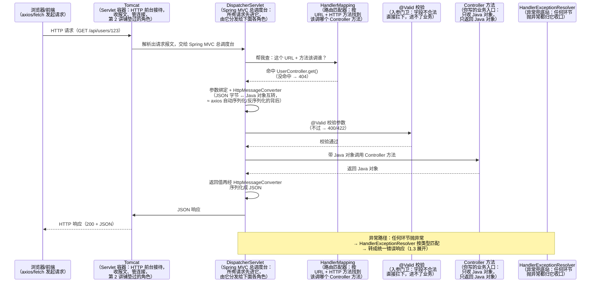
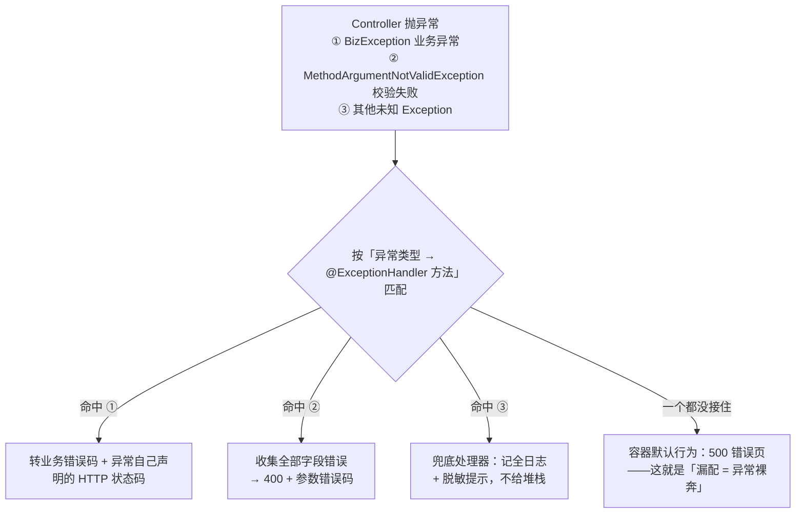
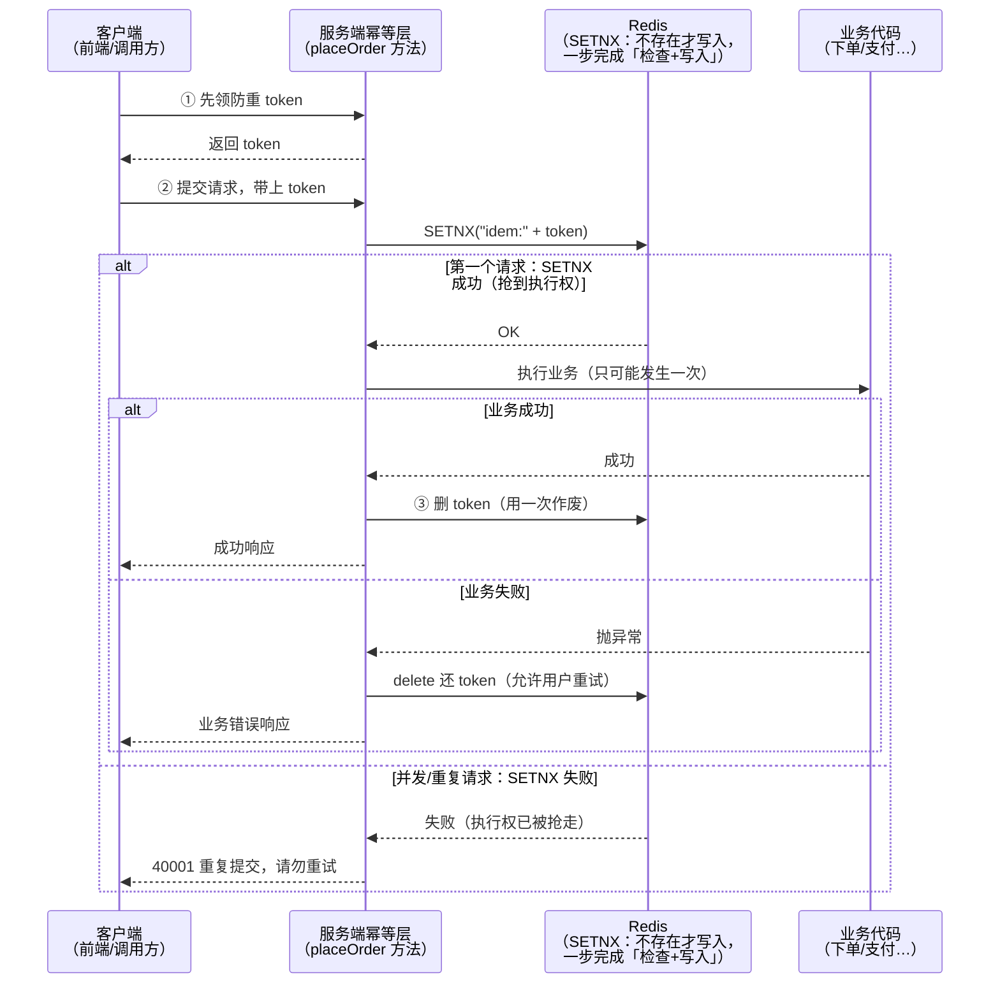

# 阶段二 · 小点 3：Spring Web MVC 与 API 设计

> 所属：阶段二 Spring 生态与 Web 开发核心
> 定位：Web 层是业务开发的日常主场。除框架用法外，本讲把「API 设计规范」（统一响应 / 错误码 / 幂等 / 分页）作为工程素养重点展开——**这是从「会写接口」到「接口可维护」的分水岭**：前端同事对接你的接口时是舒服还是骂人，取决于这一讲。

## 快速入门

> 本节为「写接口速览」：先认识怎么接参数、返回数据、统一响应；「幂等、分页、错误码规范」留在正文提高部分。

### 本讲核心关键词速查

| 关键词 | 一句话大白话 | 例子 |
|-|-|-|
| Controller | 处理 HTTP 请求的控制器 | `@RestController` |
| @GetMapping / @PostMapping | 接 GET / POST 请求 | 对应路由方法 |
| @RequestParam | 取 URL 查询参数 | `?name=xx` |
| @RequestBody | 取请求体 JSON | POST 传的对象 |
| 统一响应 | 所有接口返回一种格式 | `{code, message, data}` |
| 全局异常 | 一处处理所有报错 | `@RestControllerAdvice` |
| 幂等 | 同一请求执行多次不影响结果 | 防止重复支付/下单 |
| 分页 | 数据分批返回 | `?page=1&size=20` |

### 本讲在解决什么问题

- **问题**：写接口不难，难的是「接口可维护、前端对接舒服」。要统一响应格式、统一错误码、处理参数校验、分页、幂等。
- **你要带走的一句话**：好的接口 = **统一响应 + 明确错误码 + 参数校验 + 合理分页 + 幂等**。前端同事对接时舒服，是因为这些约定你在一开始就定好了。

### 最简可运行示例（照抄能跑）

```java
@RestController                        // 处理 HTTP 请求并返回 JSON
@RequestMapping("/api/users")
public class UserController {

    @GetMapping("/{id}")               // GET /api/users/123
    public ApiResponse<User> get(@PathVariable Long id) {     // @PathVariable: 取路径里的 id
        return ApiResponse.ok(userService.findById(id));
    }

    @PostMapping                       // POST /api/users
    public ApiResponse<Long> create(@RequestBody CreateUserReq req) {   // @RequestBody: 取 JSON 请求体
        return ApiResponse.ok(userService.create(req));
    }
}
```

> 代码备注（逐行解释）：
> - `@RestController`：这个类处理 HTTP 请求，返回值自动转 JSON。
> - `@RequestMapping("/api/users")`：类上统一加路径前缀。
> - `@PathVariable Long id`：从 URL 路径 `{id}` 里拿值（`/api/users/123` 的 123）。
> - `@RequestBody CreateUserReq req`：从 HTTP 请求体（JSON）反序列化成 Java 对象。
> - `ApiResponse.ok(...)`：统一响应包装——所有接口都返回 `{code, message, data}`，前端好写统一处理。

### 关键注解 / 概念说明

| 注解 / 概念 | 干什么 | 最易踩的坑 |
|-|-|-|
| `@PathVariable` | 取 URL 路径参数 | 路径模板里要写 `{id}` |
| `@RequestParam` | 取查询参数 | `@RequestParam(required=false)` 可选 |
| `@RequestBody` | 取 JSON 请求体 | 没这注解就拿不到 body |
| `@RestControllerAdvice` | 全局异常统一处理 | 别漏，否则异常直接裸奔 |
| `@Valid` / `@Validated` | 参数校验 | 校验注解（`@NotBlank` 等）要配 `@Valid` |
| 统一响应 `ApiResponse` | 打包返回格式 | 错误时 HTTP 状态码与 code 要对应 |

### 常用约定 / 命名提示

- **统一响应体**：`{code, message, data}`，成功 code=0，业务失败可回 HTTP 200 + 业务 code，系统错误回对应状态码。
- **幂等的三板斧**：防重 token / 唯一索引 / 状态机——用于支付、下单这种不能重复执行的场景。
- **分页约定**：页码式用 `page/size/total`，游标式用 `cursor/nextCursor`——按业务选。
- **错误码分段**：如 `4xxxx` 参数、`5xxxx` 业务、`9xxxx` 系统，前端按段决定提示方式。

## 精简大纲

1. Spring Web MVC 核心：RESTful / 参数绑定 / 全局异常 / 校验
2. API 设计规范：统一响应体 / 错误码 / 版本化 / 幂等 / 分页
3. 接口文档：SpringDoc / OpenAPI 3.0
4. 文件上传与 CORS

## 学习内容详情

### 1. Web MVC 核心

#### 1.0 一个请求的完整旅程（先看全貌，再抠细节）

> 学注解之前先看这张图：一个 `GET /api/users/123` 从浏览器出发，到 Tomcat，再进 Spring MVC，全程经过哪些角色、各角色干什么。后面的 1.1~1.4 每个知识点，都能回来对照图的某一站。Tomcat（Servlet 容器）是什么，阶段二第 2 讲的 🧩 前置 30 秒框已铺垫过——这里只补它把请求接力给 Spring MVC 的那一段。



> 这段旅程最值得对比的一个点：你在 NestJS 里 `@Get()` 装饰器到路由的匹配（`@Controller` + 装饰器 → Nest 内置 Router 完成），在 Spring 里是 **DispatcherServlet + HandlerMapping** 干的活——框架换了，分工没换。

#### 1.1 参数绑定与转换

```java
@RestController
@RequestMapping("/api/v1/orders")
public class OrderController {

    // @PathVariable：路径变量（RESTful 资源定位）
    @GetMapping("/{id}")
    public Order detail(@PathVariable Long id) { return orderService.find(id); }

    // @RequestParam：查询参数（GET /list?status=PAID&page=2）
    @GetMapping
    public Page<Order> list(@RequestParam String status,
                            @RequestParam(defaultValue = "1") int page) { ... }

    // @RequestBody：JSON 请求体 → DTO（POST/PUT 用；DTO 是啥见 1.2）
    @PostMapping
    public ApiResponse<Long> create(@RequestBody @Valid CreateOrderCmd cmd) { ... }

    // @RequestHeader：取头（如网关透传的用户身份）
    @GetMapping("/mine")
    public List<Order> mine(@RequestHeader("X-User-Id") Long userId) { ... }
}
```

> 对照 NestJS：`@Param()` ↔ `@PathVariable`、`@Query()` ↔ `@RequestParam`、`@Body()` ↔ `@RequestBody`——一一对应，换个注解包名而已。

#### 1.2 DTO 与校验（校验上移到入参对象）

> **DTO**（Data Transfer Object，数据传输对象）——专门在「接口层收数据」与「业务层用数据」之间搬运的字段袋子；你在 NestJS 里写的 `CreateUserDto` 就是它；Java 侧惯用 `record` 做 DTO（阶段一第 2 讲讲过：不可变 + 自动构造器/equals，字段上的注解就是契约）。

```java
// record 做 DTO（不可变 + 自动构造器/equals）：字段上的注解就是契约
public record CreateOrderCmd(
        @NotNull(message = "商品 id 不能为空")          // Jakarta Bean Validation 标准注解
        Long productId,

        @Min(value = 1, message = "数量至少为 1")
        @Max(value = 99, message = "单笔最多 99 件")
        Integer quantity,

        @Pattern(regexp = "^1\\d{10}$", message = "手机号格式不合法")
        String phone
) {}
// Controller 入参加 @Valid 即触发校验；失败自动 422/400（422 = 语义错误：请求格式对，但内容校验不过；400 = 请求本身格式错），不进业务代码（对照 NestJS 的 Pipe + class-validator）
// 为什么校验放 DTO 而不是 Service：无效请求在入口 fail-fast——校验放 Service 意味着每个方法都要重复防御，
// 放 DTO 是「一处声明、全员生效」；也保证脏数据进不了业务层（失败 422/400 即可，不需要走业务错误码）
```

#### 1.3 全局异常：@RestControllerAdvice

```java
// 统一异常处理：业务代码只管"抛", 转 HTTP 响应这件事全收口在这里
// （对照 NestJS 的 ExceptionFilter —— 概念完全一致）
@RestControllerAdvice
public class GlobalExceptionHandler {

    @ExceptionHandler(BizException.class)          // 业务异常：带错误码, 转 4xx/5xx 由异常自己声明
    public ResponseEntity<ApiResponse<Void>> biz(BizException e) {
        return ResponseEntity.status(e.getHttpStatus())
                .body(ApiResponse.fail(e.getBizCode(), e.getMessage()));
    }

    @ExceptionHandler(MethodArgumentNotValidException.class)   // @Valid 校验失败
    public ResponseEntity<ApiResponse<Void>> invalid(MethodArgumentNotValidException e) {
        List<String> errors = e.getBindingResult().getFieldErrors().stream()
                .map(f -> f.getField() + ": " + f.getDefaultMessage())
                .toList();                                     // 收齐全部字段错误 —— 只报第一个, 前端要修一版错一版
        return ResponseEntity.badRequest()
                .body(ApiResponse.fail(BizCode.PARAM_INVALID, String.join("; ", errors)));
    }
}
```

> 异常收口路径一图看清（上面代码的流程图版）：



> 底层机制（图注）：`@RestControllerAdvice` 是 Spring MVC `HandlerExceptionResolver`（异常解析体系——就是 1.0 旅程图里兜底那一站）的便捷封装——异常从 Controller 抛出后由 `DispatcherServlet`（总调度台）统一分发，按「异常类型 → 对应 `@ExceptionHandler` 方法」匹配；没匹配到任何处理器才落到容器默认行为（返回 500 错误页）。所以「漏配 = 异常裸奔」的本质是：这个异常没有任何解析器接得住。

> Spring 6+ 另有 RFC 7807（HTTP 官方的「错误响应标准格式」——出错的响应该长什么样、带哪些字段，RFC 给了统一标准；`ProblemDetail` 是它的 Java 实现）可用；但国内企业实践多为自定义统一响应体（下节），二选一、全公司统一即可。

### 2. API 设计规范（工程素养）

> 🧩 **前置 60 秒：RESTful 是什么**——URL 是名词（资源：`/users/123`）、HTTP 方法是动词（GET 读 / POST 建 / PUT 改 / DELETE 删）、状态码表结果——「资源 + 动词」风格。对照你见过的反例：`POST /queryUser?action=delete` 把动词塞进 URL 就是非 REST 风格。前端天天调的 `GET /api/users/123` 就是标准 REST。

#### 2.1 统一响应体与错误码

```java
// 所有接口只有一种成功结构 {code, message, data} —— 前端只写一套判断逻辑
public record ApiResponse<T>(int code, String message, T data) {
    public static <T> ApiResponse<T> ok(T data) {
        return new ApiResponse<>(0, "ok", data);          // 0 = 成功
    }
    public static <T> ApiResponse<T> fail(BizCode c, String msg) {
        return new ApiResponse<>(c.getCode(), msg, null);
    }
}

// 错误码分段规划：一看区间就知道该找谁
// 每个业务码同时声明对应 HTTP 状态码 —— 业务码与 HTTP 状态码的映射固化在枚举里, 异常处理器统一转换
public enum BizCode {
    PARAM_INVALID(40001, HttpStatus.BAD_REQUEST),          // 4xxxx: 调用方的问题（参数/鉴权/频率）
    ORDER_NOT_FOUND(40401, HttpStatus.NOT_FOUND),
    ORDER_STATUS_INVALID(50001, HttpStatus.CONFLICT),      // 5xxxx: 业务规则拒绝
    STOCK_NOT_ENOUGH(50002, HttpStatus.CONFLICT),
    SYSTEM_ERROR(90000, HttpStatus.INTERNAL_SERVER_ERROR); // 9xxxx: 系统级, 值得告警
    private final int code;
    private final HttpStatus httpStatus;
    BizCode(int code, HttpStatus httpStatus) { this.code = code; this.httpStatus = httpStatus; }
    public int getCode() { return code; }
    public HttpStatus getHttpStatus() { return httpStatus; }
}
```

> 响应示例：`{"code": 50002, "message": "库存不足", "data": null, "traceId": "a3f8c2e1"}`——`traceId` 联动上一讲的 MDC，前端报障时带上它，日志一查一个准。

> 🏥 **生活类比：HTTP 状态码 = 医院分诊台，业务 code = 科室医生给的诊断单**——分诊台只判断「这单通信本身有没有问题」：送到了（200）、没送到（404/500）、找错门（404/405）。它不负责告诉你病看得成不看成——挂号成功了吗、余额够不够，得等科室医生（业务层）看完，才在诊断单（body 里的 code）上写结论。所以「挂号成功但余额不足」时，分诊台依然算你顺利到达：HTTP 还是 200，真正的结果写在诊断单里。
> 换成接口：分诊台 = HTTP 状态码，诊断单 = 业务 code。带着这个分工看下面的技术论证——

> **为什么业务失败也回 HTTP 200（业务码在 body 里）**：HTTP 状态码语义有限（成功 / 客户端错 / 服务端错），表达不了「库存不足」这类业务拒绝；而且 4xx/5xx 会触发浏览器、网关、代理的缓存与重试等干预行为，业务错误没必要惊动它们。所以国内团队普遍「HTTP 管传输层对错、code 管业务层对错」双轨制；对外部第三方开放 API 时则更倾向纯 HTTP 状态码 + RFC 7807，二选一全公司统一即可。

#### 2.2 版本化策略

- **URL 路径版本**（`/api/v1/orders`，推荐中小团队）：直观、网关路由友好、curl 可复现；代价是 URL 里「版本」不符合纯 REST 纯洁癖——工程上不纠结这个。
- Header 版本（`Accept: application/vnd.demo.v2+json`）：无 URL 污染但调试麻烦。

> ⏸️ **短期可以不学**：Header 版本化（`Accept: application/vnd.*+json`）国内团队极少采用——调试要配 Header、网关路由不友好，投入产出比低。**何时回来学**：做开放平台 / 对外 SDK，接口被第三方程序化调用、需要严格版本契约时。**面试最低要求**：能说出两种版本化方案及优缺点，选型结论「默认 URL 路径版本」即可。

- 原则：**破坏性变更必须升版本**（v1 继续跑），非破坏性（加可选字段）不升。

#### 2.3 幂等设计（重试安全的基础）

**幂等（Idempotency）**：同一个请求发一次和发 N 次，效果相同。HTTP 重试（超时重试、用户狂点）天然存在，所以「写接口」必须幂等——这也是阶段四 RPC 重试的配套纪律。

```java
@Service
public class IdempotentOrderService {
    // Redis 是阶段三第 4 讲主角——这里只用它「不存在才写入」的命令实现幂等锁
    private final StringRedisTemplate redis;
    private final OrderRepository orderRepo;

    // 方案一：防重 token —— 客户端先领 token, 提交时带上, 服务端原子消费
    public Long placeOrder(String idempotencyKey, CreateOrderCmd cmd) {
        // SETNX: 不存在才写入成功 = 抢到"执行权"; 30s 过期兜底客户端不再回传的死 token
        Boolean first = redis.opsForValue()
                .setIfAbsent("idem:" + idempotencyKey, "1", Duration.ofSeconds(30));
        if (Boolean.FALSE.equals(first)) {
            throw new BizException(BizCode.DUPLICATE_REQUEST, "重复提交, 请勿重试");
        }
        try {
            return orderRepo.save(cmd.toOrder()).getId();   // 真正的业务只可能发生一次
        } catch (Exception e) {
            redis.delete("idem:" + idempotencyKey);         // 业务失败要还 token, 允许用户重试
            throw e;
        }
    }
}
```

> token 方案完整时序一图看清（原理解释见图注）：



> 图注（为什么用 SETNX 而不是「先 GET 判断、再 SET」）：后者是两步操作，两步之间并发请求可以插队——两个请求都能通过检查，幂等就被绕过了。`SETNX`（不存在才写入）是一条原子命令，「检查 + 写入」一步完成，天然保证只有第一个请求能抢到执行权。

```sql
-- 方案二：数据库唯一索引 —— 最后防线, 前面全被绕过它也能兜住
-- 业务唯一键建唯一索引, 重复插入直接报 DuplicateKeyException → 捕获后转"重复提交"
ALTER TABLE t_order ADD UNIQUE KEY uk_user_product (user_id, product_id, created_date);
```

- 方案三（状态机）：只允许合法状态迁移——`WHERE status = 'CREATED'` 的 UPDATE 天然拒绝第二次。
- 实践组合：**入口 token 拦一道 + 库表唯一索引兜底**，状态机用于业务流转本身。

#### 2.4 分页规范

```java
// 页码式：后台管理友好（能跳页）, 但深翻页 offset 越大越慢
// 字段约定: page / size / total / hasNext —— hasNext 免得前端自己算 total > page*size
public record PageResp<T>(List<T> items, long total, int page, int size, boolean hasNext) {}

// 游标式：返回 nextCursor, 客户端带上继续拉 —— 无限滚动 / App 信息流标配
// 字段约定: cursor(本次起点) / nextCursor / hasMore —— nextCursor 为 null 即没有更多
public record CursorResp<T>(List<T> items, String cursor, String nextCursor, boolean hasMore) {}
```

> 深翻页用游标（`WHERE id > :cursor ORDER BY id LIMIT 20`，索引范围内扫描）；后台用页码。别用页码做深翻页——第 10 万页的 `LIMIT 999980, 20` 是慢查询制造机：MySQL 得先扫出前 999980 行再丢弃，offset 越大扫描量越大、越慢（阶段三第 1 讲回收）。

### 3. 接口文档：SpringDoc / OpenAPI

```java
// SpringDoc（OpenAPI 3.0）注解直接长在 Controller 上（对标 @nestjs/swagger）
@Tag(name = "订单接口")                                 // 分组
@RestController
@RequestMapping("/api/v1/orders")
public class OrderController {

    @Operation(summary = "创建订单", description = "幂等：重复提交返回 40001")
    @PostMapping
    public ApiResponse<Long> create(@RequestBody @Valid CreateOrderCmd cmd) { ... }
}
```

```xml
<!-- pom.xml：一个依赖换来自动文档 + 调试 UI（/swagger-ui.html） -->
<dependency>
    <groupId>org.springdoc</groupId>
    <artifactId>springdoc-openapi-starter-webmvc-ui</artifactId>
    <!-- 版本红色: springdoc 2.x 仅兼容 Boot 3; Boot 4 需用 springdoc 3.x —— 具体版本以官方文档为准 -->
    <version>3.0.0</version>
</dependency>
```

进阶：OpenAPI 契约先行（先定 schema → 前端生成 TS 类型并行开发）→ 阶段七第 1 讲「API 契约管理」展开。

### 4. 文件上传与 CORS

```java
@PostMapping(value = "/avatar", consumes = MediaType.MULTIPART_FORM_DATA_VALUE)
public String upload(@RequestParam MultipartFile file) throws IOException {
    // ⚠️ 安全校验四件套(后缀/MIME/魔数/大小, 见代码块下方) + 存储文件名服务端生成
    String safeName = UUID.randomUUID() + ".jpg";
    Path target = Path.of("/data/upload", safeName);      // 拒绝客户端传文件名 —— 防 "../../" 路径穿越
    Files.copy(file.getInputStream(), target);
    return safeName;
}
```

上传校验四件套，每条一句话：

- **后缀白名单**：只放行 `.jpg` / `.png` 等白名单后缀——黑名单思维迟早漏掉新变种。
- **MIME 类型**：`file.getContentType()` 必须命中白名单——但它由客户端上报、可伪造，不能单独作准。
- **文件头魔数**：读文件前几个字节验证真实类型（JPEG 开头 `FF D8`，PNG 开头 `89 50 4E 47`）——后缀和 MIME 都能骗人，魔数不能。
- **大小上限**：`spring.servlet.multipart.max-file-size` 先限一道，代码里再校验一次——防恶意大文件打爆磁盘 / 内存。

```java
// CORS 全局配置（对照 NestJS 的 app.enableCors()）
@Configuration
public class WebConfig implements WebMvcConfigurer {
    @Override
    public void addCorsMappings(CorsRegistry registry) {
        registry.addMapping("/api/**")
                .allowedOrigins("http://localhost:5173")   // 本地前端 dev server
                .allowedMethods("GET", "POST", "PUT", "DELETE")
                .maxAge(3600);                              // 预检结果缓存 1h, 减少 OPTIONS 往返
    }
}
```

> 预检（OPTIONS）：非简单请求（自定义 Header / JSON POST 跨域）会先发 OPTIONS 试探——浏览器要先确认服务器「允许跨域 + 允许哪些方法/头」，才敢发出真正会产生副作用的请求；排查「接口没进 Controller 却返回 403」时先想到它。

### 坑点提醒

- `@RequestBody` 与 `@RequestParam` 不能同用一个参数来源：前者读 body 流（只能读一次——Node 的 `req` stream 同理，读过就没了，所以 `@RequestBody` 只能标一个参数），后者读 URL / 表单。
- 校验注解写在 `Map` / `String` 裸参数上不生效——**先包 DTO**，校验才有落点。
- GET 语义别承载写操作：浏览器预取 / 爬虫 / 代理缓存都会替你「执行」它。
- 幂等 token 的 Redis key 过期时间别设太长：用户 5 分钟后重试是合理行为，不该被拒。
- 全局异常处理器别把堆栈原样返回给前端（信息泄露）；日志里打全，响应里给「人话」。

## 本节自检

- [ ] 能搭出 `@RestControllerAdvice` 统一异常转码，让所有错误响应走同一结构
- [ ] 能为一个「创建订单」接口设计幂等方案（token / 唯一索引 / 状态机至少组合两种）
- [ ] 能说清路径版本与 Header 版本的取舍，以及深翻页为什么用游标
- [ ] 能用 SpringDoc 给接口加注解并生成可调试文档

## 本节配套思考题

1. 前端同时调 `POST /orders` 五次（网络重试），你的 token 幂等方案里 `setIfAbsent` 的过期时间取 3 秒 / 30 秒 / 10 分钟分别会出什么问题？
2. 为什么「错误码分段」（4xxxx / 5xxxx / 9xxxx）对前端和 On-Call 都重要？如果只有 `code=1/2/3` 会丢掉什么信息？
3. 用 NestJS 的思路口述一遍 Spring 这套「DTO 校验 → 全局异常 → 统一响应」链路，指出两个框架里各环节的对应物。

## 常见面试题

### Q1：Spring MVC 的全局异常处理是怎么实现的？`@RestControllerAdvice` 的底层机制是什么？
**答**：标准答案：用 `@RestControllerAdvice` + `@ExceptionHandler` 声明「异常类型 → 响应结构」的映射，业务代码只管抛异常，转 HTTP 响应统一收口在这一处。原理层：Spring MVC 的 `DispatcherServlet` 对每个请求的异常有**异常解析链（HandlerExceptionResolver）**——`@ExceptionHandler` 方法会被注册成 `ExceptionHandlerExceptionResolver`，它按「异常类型 → 处理器方法」做匹配（子类能命中父类的处理器）；整条链都没接住，异常才落到容器默认行为（500 错误页 / Tomcat 错误页）。`@RestControllerAdvice` 只是让这些处理器方法免于逐个注册的便捷载体。工程层：至少处理三类异常——业务异常（`BizException`，转业务错误码）、参数校验异常（`MethodArgumentNotValidException`，收集全部字段错误一次返回）、兜底的 `Exception`（记全日志 + 脱敏提示，别把堆栈原样返回给前端）；日志里打全量堆栈，响应里只给「人话」。

### Q2：接口幂等怎么做？「先查后写」为什么不行？
**答**：标准答案三板斧：**防重 token**（客户端先领 token，提交时带上，服务端用 Redis `SETNX` 原子消费——抢到执行权的请求才放行）、**数据库唯一索引**（业务唯一键建唯一索引，重复插入报 `DuplicateKeyException` 后转「重复提交」，是最后防线）、**状态机**（`WHERE status='CREATED'` 条件更新，天然拒绝第二次迁移）。原理层：幂等的本质是「并发下的原子检查-执行」——「先查再写」是两步，两步之间并发请求可插队，两个请求都能通过检查；`SETNX` 是一条原子命令，把「检查 + 写入」压成一步，才保证只有一个请求生效。工程层：生产组合是「入口 token 拦一道 + 唯一索引兜底」，状态机用于业务流转本身；注意 token 过期时间别设太短（用户 5 分钟重试是合理行为）也别太长（死 token 堆积）；业务失败要还 token，允许重试。

### Q3：深分页为什么慢？怎么优化？
**答**：标准答案：`LIMIT 999980, 20` 这类深 offset 翻页，MySQL 要先从表头扫出前 999980 行再**丢弃**，offset 越大扫描量越大——第 10 万页的代价和第 1 页完全不同，这就是深分页慢的本质。方案：**游标分页**（`WHERE id > :cursor ORDER BY id LIMIT 20`）——只扫描游标之后的数据，走索引范围扫描，翻页深度与性能无关，适合 App 信息流 / 无限滚动；**覆盖索引 + 延迟关联**（先只查主键再回表）可缓解页码式；海量场景还有 ES 等搜索引擎（覆盖索引 / 延迟关联 / 回表 / B+ 树均为阶段三第 1 讲内容，此处只需记住「游标分页避开了深翻页」这个结论）。原理层：B+ 树的索引扫描是「定位起点后顺序读」，游标方案把起点定位从「从头数 N 行」变成「直接定位到某条记录」，复杂度从 O(offset) 降到 O(1)。工程层：后台管理这种「能跳页」的场景保留页码式但限制最大页数 / 最大 offset；面向用户的分页一律游标。

### Q4：什么是 CORS 预检？排查跨域问题从哪几个点入手？
**答**：标准答案：浏览器同源策略下，跨域**非简单请求**（自定义 Header、`application/json` 的 POST 等）会先发一个 `OPTIONS` 预检请求，问服务器「允不允许这个源 / 这些方法 / 这些头」，服务器回 `Access-Control-Allow-*` 头表示放行，浏览器才发真实请求；**简单请求**（表单 GET/POST 等）不发预检。原理层：预检是浏览器替你做的**安全闸门**——真实请求可能产生副作用（写库、下单），浏览器先试探服务器意愿，避免「请求已执行、浏览器才拦截响应」的尴尬；服务端没配 CORS 时，预检或真实请求会被浏览器直接拦下（Network 里能看到请求但 JS 拿不到响应）。工程层：排查按序看——①预检有没有 200（`OPTIONS` 被鉴权 Filter 拦了会 403，常见于「接口没进 Controller 却 403」）；②响应头 `Access-Control-Allow-Origin` 是否包含前端源（别用 `*` 加 `withCredentials` 组合）；③`Allow-Methods` / `Allow-Headers` 是否覆盖实际请求；④`maxAge` 缓存预检结果，减少 OPTIONS 往返。
