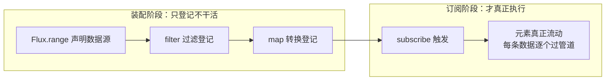
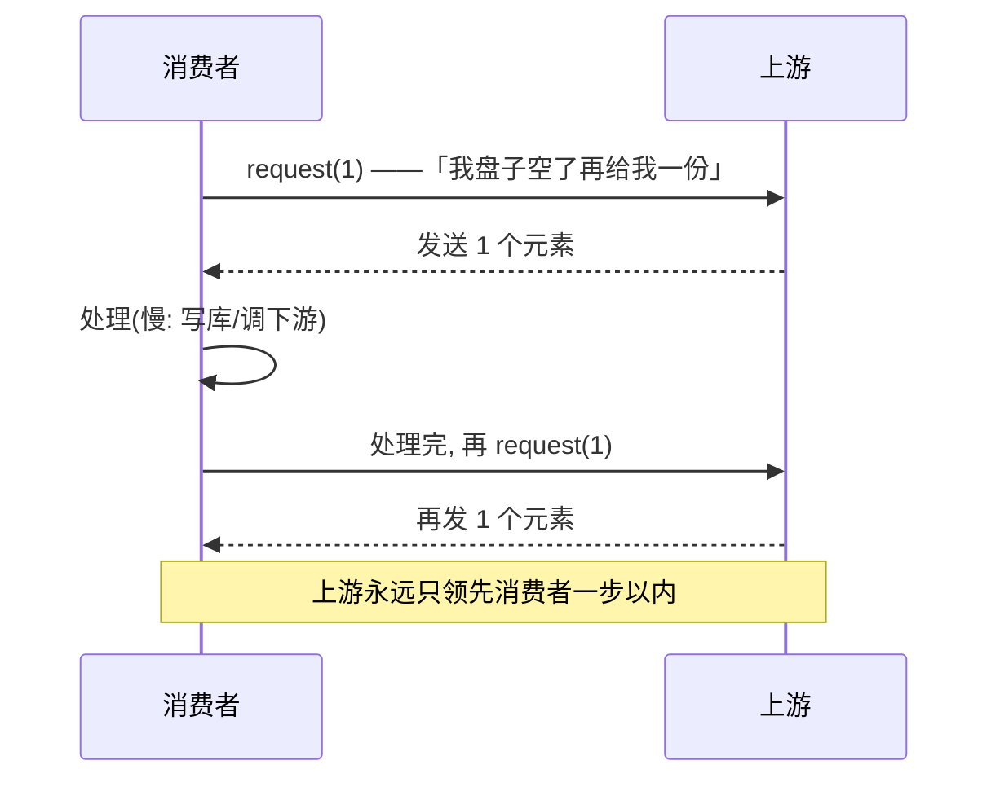
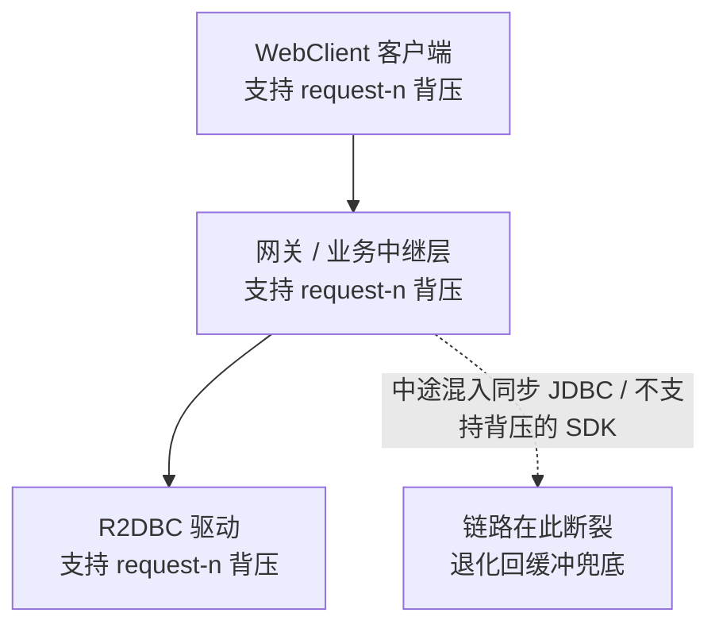
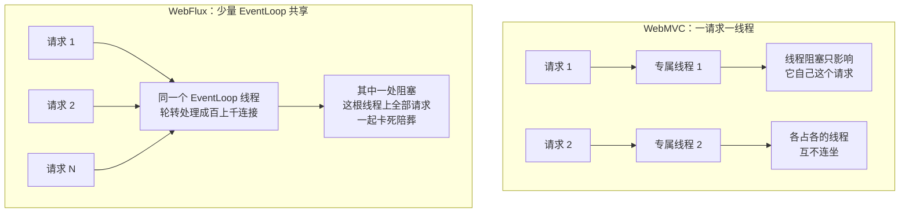
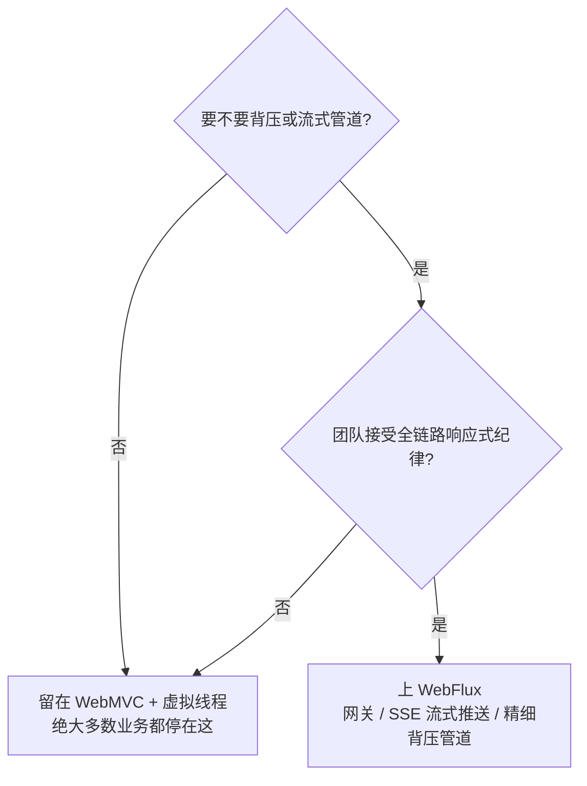

# 阶段二 · 小点 4：Spring WebFlux 与响应式选型

> 所属：阶段二 Spring 生态与 Web 开发核心
> 定位：**选型判断比框架用法更重要**——虚拟线程 GA 之后，绝大多数业务系统用 WebMVC + 虚拟线程即可获得高并发能力，学习优先级应放在 WebMVC 之后；WebFlux 主要用于 API 网关、SSE 流式推送、需要精细背压控制的管道型场景。**不要在响应式编程上过早投入。**

## 快速入门

> 本节为「响应式速览」：先认识 Mono/Flux 这个概念、WebFlux 是什么；「背压、选型怎么判断」留在正文提高部分。

### 本讲核心关键词速查

| 关键词 | 一句话大白话 | 例子 |
|-|-|-|
| WebMVC | 传统「一请求一线程」的 Web 模型 | 大多数业务默认选 |
| WebFlux | 响应式 Web 框架（基于 Reactor） | 网关 / 流式推送 |
| Mono | 0-1 个值的响应式容器 | `Mono<String>` |
| Flux | 0-N 个值的响应式容器 | `Flux<Integer>` |
| 背压（Backpressure） | 消费者告诉生产者「我只能消化这么多」 | 流式推送的流控 |
| Reactor | 响应式编程库（Mono/Flux 来源） | WebFlux 底层 |
| 虚拟线程 | 让「一请求一线程」也能扛高并发 | WebMVC 的高并发新答案 |

### 本讲在解决什么问题

- **问题**：要不要上响应式（WebFlux）？很多人以为「响应式 = 高性能 = 必须学」。实际上虚拟线程出现后，普通业务用 WebMVC + 虚拟线程就够。
- **你要带走的一句话**：**绝大多数业务用 WebMVC + 虚拟线程**；WebFlux 只在「API 网关、SSE 流式推送、要精细背压」时才上。别在响应式编程上过早投入。

### 最简可运行示例（照抄能跑）

```java
// Mono / Flux: 响应式的两种容器
import reactor.core.publisher.Mono;
import reactor.core.publisher.Flux;

public class ReactorDemo {
    public static void main(String[] args) {
        // Mono: 0 或 1 个值
        Mono<String> mono = Mono.just("hello");
        mono.subscribe(v -> System.out.println("mono: " + v));   // 订阅才触发

        // Flux: 0 到 N 个值
        Flux<Integer> flux = Flux.just(1, 2, 3);
        flux.map(x -> x * 10)
            .subscribe(v -> System.out.println("flux: " + v));    // 10 / 20 / 30
    }
}
```

> 代码备注（逐行解释）：
> - `Mono.just("hello")`：装 0-1 个值的容器（类似「最多一个结果的 Promise」）。
> - `Flux.just(1,2,3)`：装 0-N 个值的容器（流的来源）。
> - `.map(...)`：对每个元素转换（和 Stream 很像）。
> - `.subscribe(...)`：**订阅才真正执行**——没订阅，前面的操作都不会跑（这就是「响应式是惰性的」）。
> - 和 Stream 的关系：都是「流水线」心智，只是响应式更强调背压与异步。

### 关键概念说明

| 概念 | 干什么 | 最易踩的坑 |
|-|-|-|
| `Mono` | 0-1 个值的容器 | 别当成「必须有一个值」，它可能为空 |
| `Flux` | 0-N 个值的流 | 流式场景（SSE）用它 |
| `.subscribe()` | 触发订阅执行 | 没订阅 = 啥都不跑 |
| 背压 | 消费者控制上游流速 | 网关/流式里处理慢消费 |
| WebFLux vs WebMVC | 响应式 vs 传统 | 普通业务选 WebMVC + 虚拟线程 |

### 常用约定 / 命名提示

- **别默认上 WebFlux**：虚拟线程时代，WebMVC + 虚拟线程已是大多数业务的高并发方案（阶段一第 7 讲）。
- **WebFlux 适合的场景**：API 网关（Netty）、SSE 流式推送（Server-Sent Events——服务器单向推送的流式协议）、需要精细背压控制的管道。
- **响应式是惰性的**：`.map`/`.filter` 只是登记，`subscribe` 才算开始——跟 Stream 同一个心智。

## 精简大纲

1. Reactor 核心：Mono / Flux 与操作符
2. 背压：响应式独有的流控语义
3. RouterFunction 与两种编程模型
4. 选型判断：WebMVC + 虚拟线程 vs WebFlux（本讲最重要的输出）

## 学习内容详情

### 1. Reactor 核心

> 🧩 **前置 30 秒：Mono/Flux 与你已有的对照**——速记卡先收下：
> - **Mono ≈ 单值的 Promise**（装 0-1 个值）；**Flux ≈ RxJS 的 Observable**（装 0-N 个值的流）——前端心智可以直接搬。
> - 最大的差异只有一条：**Promise 是「急性」的**——`new Promise` 一出来立即开跑；**Mono/Flux 默认是「冷」的**——不订阅不执行，且每次订阅都从头重跑一遍。
> 所以把 RxJS 管道搬过来，最该改的不是操作符，而是「有没有 subscribe」这个心智——细节在本节下文「对照前端心智的另一个落差」小节展开。

**Reactor**：Spring 的响应式库——把「异步 + 序列」编码成类型：`Mono<T>`（0-1 个值）、`Flux<T>`（0-N 个值）。你有 RxJS 经验的话，概念几乎零成本迁移；最大落差是**调试**：调用栈被操作符切断，异常现场看不到你的业务代码。

> ⏸️ **短期可以不学**：Reactor 操作符全集（`flatMap` / `concatMap` / `zip` / `combineLatest`……）现在硬背没有抓手——没有真实流式场景，学完就忘，投入产出比低。**何时回来学**：真正开始做网关 / SSE 流式推送 / 数据管道，需要组装操作符链时。**面试最低要求**：能说清 `Mono`（0-1 个值）与 `Flux`（0-N 个值）、「惰性：订阅才执行」即可。

```java
import reactor.core.publisher.*;

Flux<Integer> pipeline = Flux.range(1, 1000)
    .filter(n -> n % 2 == 0)              // 惰性: 到这里一行代码都没执行
    .map(n -> n * n)
    .take(5)                              // 短路: 凑够 5 个就停, 后 990 个不产生
    .log();                               // 打印订阅日志——调试响应式流的标配第一步

pipeline.subscribe(v -> System.out.println(v));   // 终端: 订阅(≈ Observable.subscribe)才触发
// 输出: 4 16 36 64 100 —— 且 range 只"生产"到 10 就停了(take 向上游传 cancel)
```

- 与 WebFlux 的关系：WebFlux = Reactor 类型 + Netty（异步事件驱动网络框架，事件循环的主场——下文「纪律成本」细讲）事件循环 + 注解/函数式路由。Controller 返回 `Mono<User>` 时框架订阅它并把结果写出。
- `Mono.just()`（已有值）vs `Mono.defer()`（订阅时才求值）的差别，等价于 JS 里「传 Promise 还是传 `() => Promise`」——副作用场景选后者。
- 对照前端心智的另一个落差：Promise 是「急性」的——`new Promise` 立即开始执行；Mono 默认是「冷」的——不订阅不执行，且**每次订阅都从头重新执行**，所以副作用（发请求 / 写库）必须显式声明，别藏在操作符链里。

**为什么「冷」——装配 vs 订阅两阶段（图）**：



> **类比（生活版）：录像带 vs 直播**——春晚的直播一开播，所有观众同时在看，错过开场就真的错过了（热流）；录像带则每次放进播放器都从头放，播几次就看几次同一个开头（冷流）。**换成 Reactor**：Mono/Flux 默认是「录像带」——没人按播放键（subscribe）它不跑，且每个订阅者都独自从头看一遍；想要「春晚直播」式的一份数据多个人同时看，就要显式「烫热」成热流（进阶话题，先记住方向：热流靠 `share()` 之类的操作符把同一份数据分发给多个订阅者）。

### 2. 背压：消费者说「我只能吃这么多」

**背压（Backpressure）**：下游通过 `request(n)` 声明「我最多再要 n 个」，上游按需生产——解决「快生产者淹没慢消费者」的内存爆炸。

- **为什么 `take(n)` 模拟不来**：`take(n)` 只是消费端「截取 n 个就停」的单向动作，上游根本不知道你慢；
- **`request(n)` 是订阅协议里的双向协商**：上游会真的按 n 生产（EventEmitter 根本没有这个概念）。

**自助餐出餐口类比（生活版）**：生产者 = 后厨的出餐速度，大盘菜源源不断端出来；消费者 = 你的吃速。没有背压 = 出餐口不管你吃没吃完，一直往你桌上堆盘子，越堆越高直到「桌子塌了」——对应内存被未消费的元素撑爆。`request(n)` 就是你说「我盘子空了，再给我上一份」——节奏由消费者掌控，后厨永远只领先你一步。

**换成 Java**：`request(n)` 是订阅协议（Publisher ↔ Subscriber）里的双向协商，上游真的按 n 生产——下游慢，上游就跟着慢，没人抢跑。代码跑起来就是这个节奏：



```java
Flux.range(1, 1_000_000)                  // 百万个元素的"无限"源
    .log()
    .subscribeWith(new reactor.core.publisher.BaseSubscriber<Integer>() {
        @Override protected void hookOnSubscribe(Subscription s) {
            s.request(1);                 // 首次只索取 1 个 —— 拉取式节奏由消费者掌控
        }
        @Override protected void hookOnNext(Integer value) {
            doSlowWork(value);            // 模拟慢处理(写库/调下游)
            request(1);                   // 做完一个再要下一个: 上游永远领先消费者一步以内
        }
        @Override protected void hookOnError(Throwable t) { }
        @Override protected void hookOnComplete() { }
    });
```

- **规则**：内置缓冲策略（`onBackpressureBuffer` / `Drop` / `Latest`）是「上游不支持背压时」的兜底。
- **例外**：**能源头限流就不靠缓冲**——源头明明能控制节奏，就别拿缓冲硬扛。
- WebFlux 的 HTTP 客户端 / 数据库驱动（**R2DBC**——Reactive Relational Database Connectivity，响应式关系数据库连接协议，可以理解成 JDBC 的非阻塞版：不占线程傻等数据库）都支持 request 语义，链路才真正闭环。

**全链路背压闭合的样子（图）**：



> **类比（生活版）：接力传话**——食堂打饭，每个人只朝前面的师傅喊一句「下一个我要一份」，后厨就按这句备料，节奏由排队的人掌控；但中间若隔着一个不听话的师傅（自作主张把 100 份一次全端出来），整条队伍的节奏全乱。**换成 Reactor**：背压是订阅链路上每一环（WebClient → 网关 → R2DBC）都参与的「接力喊话」——每一环都认 `request(n)`，才能做到「你慢我也跟着慢」；任何一环掉队，就退化回「上游全量生产 + 缓冲硬囤」。

> ⏸️ **短期可以不学**：背压缓冲策略（Buffer / Drop / Latest）的取舍要等真正写流式管道才用得上，现在记等于背字典。**何时回来学**：做消息管道 / 数据同步 / 大流量 SSE 的削峰与降级时。**面试最低要求**：能讲清背压解决什么问题、`request(n)` 拉取机制怎么实现即可。

### 3. 两种编程模型

```java
// 模型一: 注解式(≈ WebMVC 写法, 迁移成本低) —— 返回 Mono/Flux 即为响应式
@RestController
class OrderHandler {
    @GetMapping("/orders/{id}")
    Mono<Order> get(@PathVariable Long id) { return service.findReactive(id); }

    @GetMapping(value = "/orders/stream", produces = MediaType.TEXT_EVENT_STREAM_VALUE)
    Flux<OrderEvent> stream() { return eventBus.events(); }   // SSE（Server-Sent Events，服务器推送事件）流式推送: WebFlux 的合理主场
}

// 模型二: 函数式 RouterFunction —— 路由即代码, 适合轻量管道型场景
RouterFunction<ServerResponse> routes(OrderHandler h) {
    return route(GET("/orders/{id}"), req -> ok().bodyValue(h.get(...)))
        .and(route(POST("/orders"), req -> ok().body(...)));
}
```

> ⏸️ **短期可以不学**：函数式路由（RouterFunction）是轻量管道型场景的备选写法，绝大多数业务用注解式就够——两种模型都熟练的成本没必要现在付。**何时回来学**：做网关 / 轻量 **BFF**（Backend for Frontend——专为前端聚合接口的薄后端层：一个接口帮你把多个下游数据拼好再返回）/ 不需要 Controller 层的纯管道服务时。**面试最低要求**：知道 WebFlux 有「注解式 + 函数式」两种编程模型、注解式是默认主力即可。

```java
// SSE 最小示例: Flux<ServerSentEvent<T>> 能带事件名/id/重试间隔 —— 这就是流式推送的落点
@GetMapping(value = "/events", produces = MediaType.TEXT_EVENT_STREAM_VALUE)
Flux<ServerSentEvent<ChatChunk>> sse() {
    return chatStream.chunks().map(c -> ServerSentEvent.builder(c).event("delta").build());
}
```

**两种线程模型对比（图）**：



- **纪律成本——为什么「阻塞是事故」**：WebFlux 跑在 Netty（Java 生态最主流的异步事件驱动网络框架，网关与 WebFlux 的事件循环都建立在它之上）的 **EventLoop**（事件循环——就是 Node 事件循环的同类机制，Java 版由 Netty 提供）上。
- **事故后果**：任何一处阻塞调用（同步 JDBC / `Thread.sleep` / 同步 HTTP）都会卡死整个 EventLoop 线程，殃及同线程全部请求——响应式项目里阻塞是事故，不是慢。
- **场景类比（生活版）**：一个核一个 EventLoop 线程，相当于餐厅一个核一个服务员——他跑去厨房帮忙洗碗（阻塞调用），他负责的所有桌子全部饿着（同线程全部请求陪葬）。
- **前端对照**：前端读者可对照「Node 事件循环里写一个同步死循环会卡死所有请求——同一个道理」。
- **全链路都要响应式驱动**：R2DBC / **WebClient**（Spring 自带的响应式 HTTP 客户端——≈ axios 的响应式版）/ Reactive Redis 全线参与。
- **例外**：混一个同步 ORM，全盘失效。

### 4. 选型判断（本讲最重要的一页）

| 维度 | WebMVC + 虚拟线程 | WebFlux |
|-|-|-|
| 编程模型 | 同步阻塞，直觉，好调试（栈是完整的） | 全链路异步声明式 |
| 并发能力 | 虚拟线程扛海量阻塞 IO（百万级并发） | EventLoop + 非阻塞 IO |
| 纪律成本 | 低：允许阻塞写法，JVM 自动释放载体线程 | 高：一处阻塞全盘卡死；全栈响应式生态要求 |
| 背压 | 无此概念 | `request(n)` 真流控 |
| 适用 | **绝大多数业务系统** | API 网关、SSE 流式推送、精细背压的管道 |

```java
// 结论的具体形态 —— WebMVC + 虚拟线程(Boot 3.2+ 两行开起来):
spring.threads.virtual.enabled=true
# Tomcat 的请求处理线程换成虚拟线程 → 同步写法 + 海量并发, 不需要 Reactor
```

> **判断口诀**：先问「要不要背压 / 流式管道」，再问「团队是否接受全链路响应式纪律」，两个都不是——留在 WebMVC。把 WebFlux 当「特定场景的专项工具」，不是「更先进的默认选择」。

**判断口诀图化（决策树）**：



### 坑点提醒

- **WebFlux 里写同步 JDBC**：上线即偶发「整个服务卡住」——EventLoop 线程只有核数个，一个卡死一批请求陪葬；阻塞代码一律 `publishOn(Schedulers.boundedElastic())` 甩出去。但要清楚：`boundedElastic` 本质是个弹性线程池，只是给阻塞代码划的「隔离区」——不解决背压问题，也不省内存，慢任务堆积照样会出事。
- **`Mono.just(expensiveCall())`**：方法调用在组装时立即执行且只执行一次——想要「每次订阅才发生」用 `Mono.defer()`。
- **返回 `Mono<Void>` 忘记 subscribe 链路闭合**：`return ok().build()` 这类要原样返回 Mono 给框架订阅；自己 `.subscribe()` 掉等于把异步变成 fire-and-forget（发射后不管——出了错没人善后）。
- **把背压当默认能力**：中间任何一环（HTTP body 解析、第三方 SDK）不支持 request 语义，整条链路背压即断裂，退化回缓冲兜底。

## 本节自检

- [ ] 能回答：WebMVC + 虚拟线程和 WebFlux 怎么选？各自适合什么场景？
- [ ] 能解释背压是什么问题、`request(n)` 机制怎么解决
- [ ] 能说出 WebFlux 的两条纪律成本（一处阻塞全盘卡死、全链路都要响应式）
- [ ] 能写出 `Mono` / `Flux` 的基本操作符链并说清惰性触发时机

## 本节配套思考题

1. SSE 流式对话（阶段七项目三）为什么 WebFlux 合理而普通 CRUD 接口不合理？它满足了选型口诀里的哪一条？
2. 把一段 NestJS 的 RxJS `Observable` 管道翻译成 Reactor，你会先核对哪些操作符语义差异（`mergeMap` 与 `flatMap` 的并发数默认值）？
3. 「虚拟线程让阻塞变廉价」——那背压的问题虚拟线程解决了吗？百万并发下「生产者快消费者慢」在 WebMVC + 虚拟线程模型里会发生什么？

## 常见面试题

### Q1：虚拟线程 GA 之后，还需要 WebFlux 吗？两者怎么选？
**答**：**标准答案**：绝大多数业务系统不需要——虚拟线程（Java 21+ 开启 `spring.threads.virtual.enabled=true`）让「一请求一线程」的同步写法也能扛百万级阻塞 IO，编程心智、调试体验、生态成熟度全部保留。WebFlux 只在三类场景值得：
- **API 网关**（Netty 非阻塞 + 请求转发管道）
- **SSE 流式推送 / 长连接**（背压控制）
- **需要精细背压的管道型服务**

**原理层**：两条线的分工不同：
- 虚拟线程解决「阻塞 IO 占线程」的成本问题——阻塞变成廉价操作
- WebFlux 解决「生产者快消费者慢」的流控问题
- 两者解决的不是同一个问题：WebMVC + 虚拟线程天然没有背压语义

**工程层**：选型口诀是「先问要不要背压 / 流式管道，再问团队接不接受全链路响应式纪律」，两个都不是就留在 WebMVC；WebFlux 是特定场景的专项工具，不是更先进的默认选择。

### Q2：Mono 和 Flux 是什么？为什么说响应式是惰性的？
**答**：**标准答案**：`Mono<T>` 是 0-1 个值的响应式容器，`Flux<T>` 是 0-N 个值的流；两者都来自 Reactor 库，是 WebFlux 的编程基础。惰性指的是：
- `.map` / `.filter` / `.flatMap` 这些操作符只是**登记**一条流水线，一行代码都不会执行
- 直到 `.subscribe()` 触发订阅才开始跑——等价于「定义了函数但没调用」

**原理层**：对比前端心智，Promise 是急性的（`new Promise` 立即执行），Mono/Flux 默认是**冷流**——不订阅不执行，且每次订阅都从头重新执行一遍，所以副作用（发请求 / 写库）必须显式表达，藏在操作符链里不会自动发生。

**工程层**：这个特性既是安全网也是坑：
- **安全网**：没订阅不会误触发副作用
- **坑**：忘记 subscribe 等于把异步变成 fire-and-forget（发射后不管——出了错没人善后）；返回 `Mono<Void>` 的接口原样返回给框架订阅即可
- `Mono.just(expensiveCall())` 会在组装时立即执行一次，想要「每次订阅才发生」要用 `Mono.defer()`

### Q3：什么是背压？`request(n)` 是怎么实现的？
**答**：**标准答案**：背压（Backpressure）是「快生产者 + 慢消费者」场景下的流控协议——下游通过 `request(n)` 声明「我最多再要 n 个」，上游按需生产，防止下游来不及消费导致内存被未消费元素撑爆。

**原理层**：
- Reactor 的订阅协议（`Publisher` ↔ `Subscriber`）里，订阅建立时上游把 `Subscription`（订阅凭证——下游拿它来 `request(n)` 拉数据、`cancel()` 叫停的控制把手）交给下游
- 下游每次 `request(n)` 才从上游「拉取」n 个元素，上游生产永远领先消费者一步以内
- `take(n)` 之类的消费端截断**不是**背压——它不通知上游按量生产，上游照样全量生产只是消费端丢弃

**工程层**：背压要全链路闭环才有意义：
- WebFlux 的 HTTP 客户端、R2DBC 驱动都支持 request 语义
- 中间任何一环（第三方 SDK、同步调用）不支持，链路就会退化回「全量缓冲 + 兜底策略」（`onBackpressureBuffer` / `Drop` / `Latest`）
- 所以能源头限流就别依赖缓冲

### Q4：为什么说「WebFlux 里阻塞调用是事故」？EventLoop 模型是怎样的？
**答**：**标准答案**：WebFlux 跑在 Netty 的 EventLoop（事件循环）上——**一个核一个 EventLoop 线程**，它用非阻塞 IO 循环处理成千上万个连接的事件；一旦某个 handler 里出现阻塞调用（同步 JDBC / `Thread.sleep` / 同步 HTTP），这个线程就卡住不动，**同线程上承载的所有请求全部陪葬**，服务表现为「偶发整体卡死」。

**原理层**：这是「少量线程 + 非阻塞 IO」模型的代价：
- 线程数少，所以每个线程都必须「占着茅坑不拉屎式」地永不阻塞
- 对比虚拟线程是「大量线程 + 阻塞廉价」，阻塞被 JVM 调度器吸收

**工程层**：纪律三条——
1. 全链路响应式驱动（R2DBC / WebClient / Reactive Redis），混一个同步 ORM 就全盘失效
2. 真有无法响应式的阻塞代码（遗留 SDK），用 `publishOn(Schedulers.boundedElastic())` 甩到隔离线程池，但要清楚它只是隔离区，不解决背压也不省内存
3. 面试被问「WebFlux 踩过什么坑」，这个模型和纪律成本是标准答案
