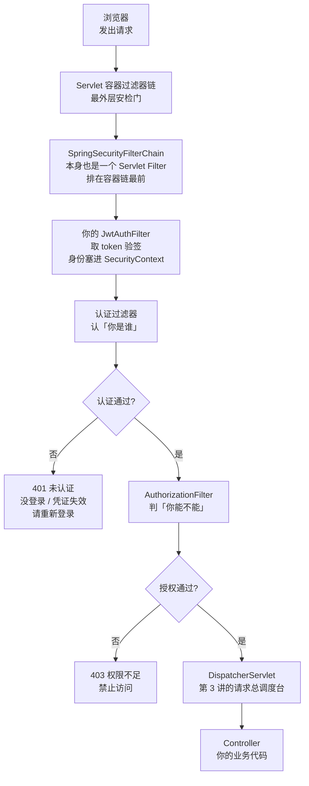
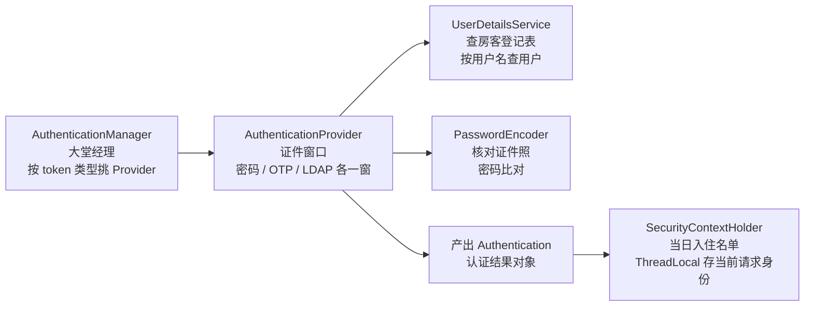
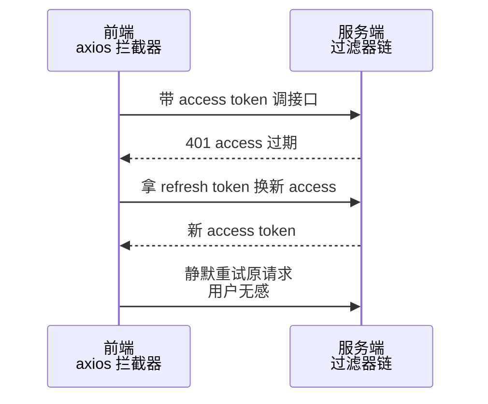
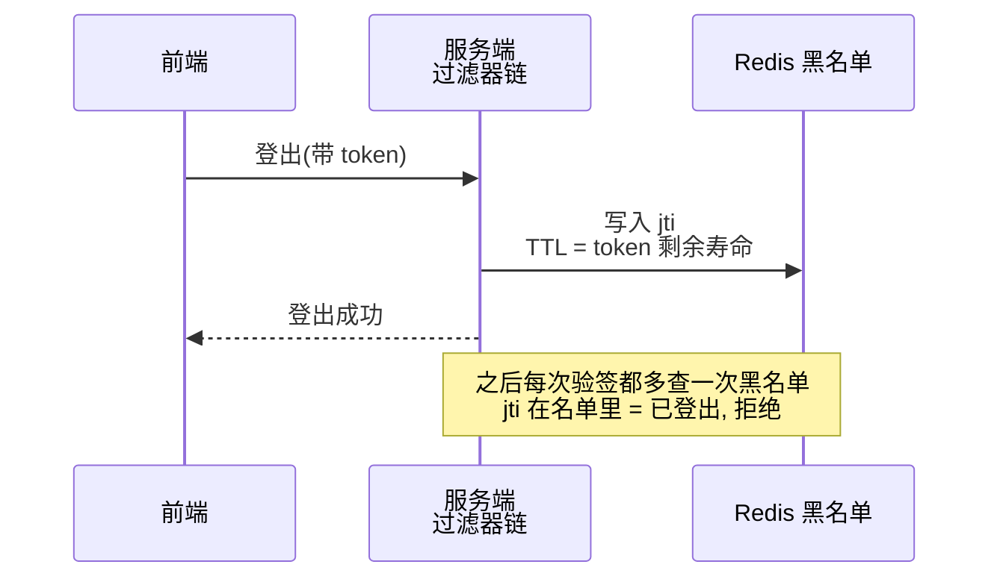
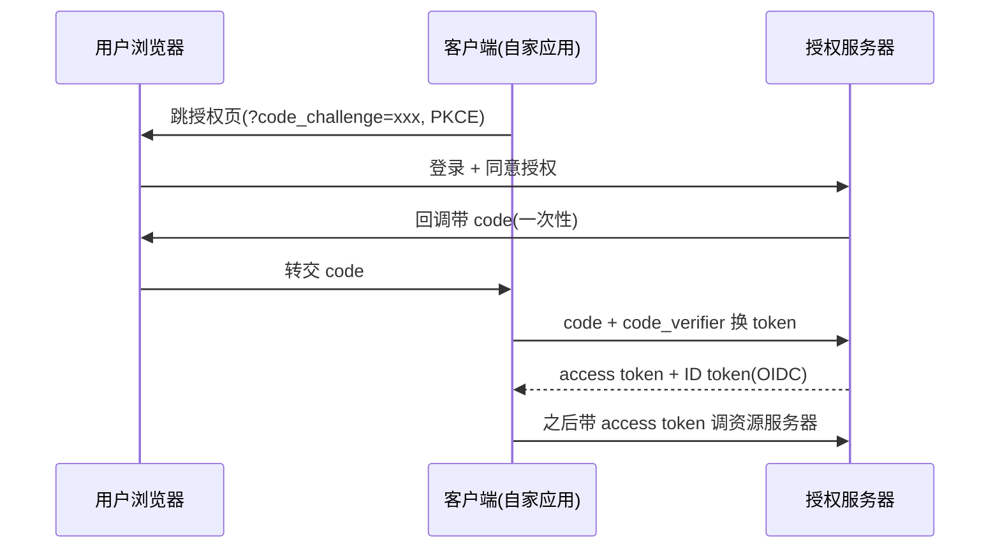
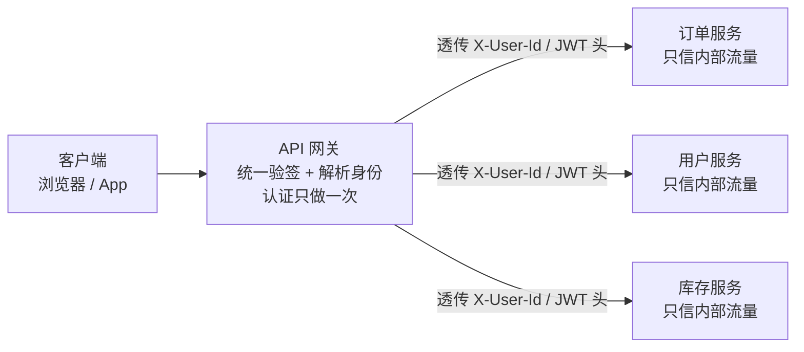

# 阶段二 · 小点 6：Spring Security 认证与授权

> 所属：阶段二 Spring 生态与 Web 开发核心
> 定位：企业级后端绕不开的一讲。Spring Security 以「配置复杂」著称，但它只是把两件事做透了——**过滤器链**（请求进来先过一串安检门）和**认证/授权分离**（你是谁 / 你能干什么）。从架构入手而不是从配置入手，它就不玄了。

## 快速入门

> 本节为「安全速览」：先认识认证（你是谁）与授权（你能干什么）的区别、JWT 是什么；「过滤器链细节、OAuth/PKCE」留在正文提高部分。

> 🧩 **前置 30 秒：你其实已经会一半**——Cookie 和 localStorage 存 token 的纠结、401（没登录 / 凭证失效，去重新登录）与 403（登录了但权限不够）、XSS / CSP、CORS，这些你在前端早已熟悉的概念，本讲原样复用，后端只是换个位置实现。本讲真正的新东西只有两件：**过滤器链**（请求进 Spring 要先过一串安检门）和**认证 / 授权的分层架构**（谁管「你是谁」、谁管「你能不能」）。细节在第 1 节「架构核心」展开。

### 本讲核心关键词速查

| 关键词 | 一句话大白话 | 例子 |
|-|-|-|
| 认证（Authentication） | 确认「你是谁」 | 登录、验密码 |
| 授权（Authorization） | 确认「你能干什么」 | admin 才能删用户 |
| JWT | 一种签名 token，自带用户信息 | 登录后发给前端，每次请求带上 |
| Security 过滤器链 | 一串安检门，请求逐个过 | 认证 → 授权 → 异常处理 |
| PasswordEncoder | 密码加密器（BCrypt） | 存密码前加密 |
| RBAC | 按角色判权限 | admin / ops / viewer |
| @PreAuthorize | 方法级权限校验 | `hasRole('ADMIN')` |
| 越权 | 不该访问的资源你访问到了 | 改 URL 里的 id 看别人订单 |

### 本讲在解决什么问题

- **问题**：接口不能裸奔——要确认「你是谁」（登录）和「你能干什么」（权限）。Spring Security 用一条过滤器链 + 认证/授权分离实现。
- **你要带走的一句话**：**认证**（Authentication）= 你是谁；**授权**（Authorization）= 你能干什么。JWT 是「自带用户信息 + 签名防篡改」的凭证；`@PreAuthorize` 在方法上校验权限。

### 最简可运行示例（照抄能跑）

```java
// JWT 过滤器骨架: 从请求头取 token, 解析后放进 SecurityContext
@Component
public class JwtAuthFilter extends OncePerRequestFilter {
    @Override
    protected void doFilterInternal(HttpServletRequest req, HttpServletResponse res, FilterChain chain)
            throws ServletException, IOException {
        String header = req.getHeader("Authorization");
        if (header != null && header.startsWith("Bearer ")) {    // Bearer = 持有者凭证: 谁拿到谁能用, 不记名
            var claims = jwtService.parse(header.substring(7));   // 验签 + 解析(返回自定义 record Claims; claims = JWT payload 里的键值对字段)
            var auth = new UsernamePasswordAuthenticationToken(   // 认证结果的数据载体, 名字是历史遗留, JWT 认证也用它
                claims.subject(), null, claims.authorities());    // record 访问器风格
            SecurityContextHolder.getContext().setAuthentication(auth);  // 放进上下文, 下游授权层读它
        }
        chain.doFilter(req, res);
    }
}
```

> 代码备注（逐行解释）：
> - `getHeader("Authorization")`：从请求头拿 token（约定 `Bearer xxx`——Bearer 即「持有者凭证」：谁拿到谁能用，token 不绑定设备、不记名，所以叫「不记名凭证」）。
> - `header.substring(7)`：去掉 `Bearer ` 前缀，拿到纯 token。
> - `jwtService.parse(...)`：**验签 + 解析** token，取出用户信息（subject）和权限。claims（声明）是 JWT payload 里的键值对字段——如 `sub`（用户 id）、`exp`（过期时间）、`roles`（角色），就是身份卡上的一格格信息。
> - `UsernamePasswordAuthenticationToken`：把解析出的身份包成一个「认证对象」。这个名字是历史遗留——它只是「认证结果的数据载体」，JWT 认证也用它，别被名字带偏。
> - `SecurityContextHolder...setAuthentication(auth)`：**关键**——放到线程上下文里，后面的 `@PreAuthorize` 授权层才能读到「你是谁、有什么权限」。
> - `chain.doFilter(req, res)`：**放行**——把请求交给链上下一个过滤器（FilterChain = 这条过滤器链本身，「链」字就在这），链全部走完请求才进得了 DispatcherServlet；某一步验证失败直接 `return` 不调用它，请求就被拦在安检门外。

### 关键概念 / 注解说明

| 概念 / 注解 | 干什么 | 最易踩的坑 |
|-|-|-|
| `@EnableWebSecurity` | 开启 Security 配置 | 配合 `SecurityFilterChain` |
| `@EnableMethodSecurity` | 开启 `@PreAuthorize` 方法级校验 | 忘开则注解不生效 |
| `PasswordEncoder` | 加密密码 | 用 BCrypt；work factor 别降到 4 |
| `@PreAuthorize` | 方法级权限校验 | AOP 代理失效场景（自调用/非 public）要小心 |
| `hasRole` / `hasAuthority` | 判角色 / 判权限 | `hasRole` 自动加 `ROLE_` 前缀，`hasAuthority` 不加 |
| 过滤器位置 | JWT Filter 插在哪 | 加在 `UsernamePasswordAuthenticationFilter` **之前** |

### 常用约定 / 命名提示

- **认证 vs 授权**：认证解决「你是谁」——校验凭据（密码 / token）证明身份可信；授权解决「你能干什么」——身份可信之后才判权限。**顺序固定：先认证后授权**，越过认证直接放行是漏洞根源。
- **JWT 不加密**：Payload 是 Base64 编码——注意**编码 ≠ 加密**：Base64 只是换个字符表示（把二进制转成可打印字符），没有密钥参与，任何拿到 token 的人都能原样解码读回；所以能被人看到，别放敏感信息。签名（Signature）保证的是**完整性**（Integrity，防篡改），不保证**机密性**（Confidentiality，防偷看）——敏感数据要么放服务端只存 id，要么用 JWE（JWT Encryption）加密整个 JWT。
- **越权（Privilege Escalation）是最常见漏洞**：「登录了就放行」≠「能访问这条资源」——每个资源接口都要校验属主（水平越权 Horizontal Privilege Escalation：拿别人的 id 看别人的数据）。
- **白名单要注意**：`/actuator/**`、`/v3/api-docs` 这些别裸奔公网，记得配访问控制。

## 精简大纲

1. 架构：过滤器链 / AuthenticationManager / UserDetailsService / PasswordEncoder
2. JWT：无状态认证 / 双 token 续期 / 登出黑名单
3. OAuth 2.1 / OIDC：授权码 + PKCE / 角色划分
4. RBAC / ABAC 与方法级安全
5. SSO 与微服务鉴权

## 学习内容详情

### 1. 架构核心

**过滤器链**：Security 是建在 Servlet Filter 上的一组有序过滤器——认证过滤器认「你是谁」、授权过滤器判「你能不能」、异常过滤器把拒了的转成 401/403。请求要闯过整条链才到得了 DispatcherServlet（第 3 讲的请求总调度台——所有请求进入 Spring 后最先落在这里，再分发给对应的 Controller）。整体流程如下：



> **位置说明**：`SpringSecurityFilterChain` 本身就是一个 Servlet Filter，排在容器过滤链**最前**；自定义 JWT Filter 加在 `UsernamePasswordAuthenticationFilter` 之前，语义是「先解析令牌填充 SecurityContext，再走标准认证/授权流程」——插错位置，后面的授权过滤器看到的就是空上下文。

> ⏸️ **短期可以不学**：Security 内部几十个过滤器的源码级剖析（DelegatingFilterProxy 如何桥接容器与 Spring、FilterChainProxy 如何编排）不影响日常配置，现在深挖投入产出比低。**何时回来学**：遇到「过滤器不生效 / 顺序错」且靠文档排不掉的诡异问题时。**面试最低要求**：能说清「SpringSecurityFilterChain 本身是一个 Servlet Filter、请求先闯完整条链才到 DispatcherServlet、自定义 JWT 过滤器插在 `UsernamePasswordAuthenticationFilter` 之前」即可。

```java
@Configuration
@EnableWebSecurity
@EnableMethodSecurity                         // 开启 @PreAuthorize 方法级注解(第 4 节)
public class SecurityConfig {

    @Bean
    SecurityFilterChain filterChain(HttpSecurity http, JwtAuthFilter jwtFilter) throws Exception {
        return http
            .csrf(csrf -> csrf.disable())     // 关 CSRF: 纯 JWT 方案可关, 原理见代码块下方正文 —— 一旦改回 Cookie+Session 必须开回来
            .sessionManagement(s -> s.sessionCreationPolicy(SessionCreationPolicy.STATELESS)) // 不建 session
            .authorizeHttpRequests(auth -> auth
                .requestMatchers("/api/v1/auth/**").permitAll()        // 登录/注册白名单
                .requestMatchers("/actuator/health").permitAll()
                .anyRequest().authenticated())                          // 其余一律要认证
            .addFilterBefore(jwtFilter, UsernamePasswordAuthenticationFilter.class) // 自定义 JWT 过滤器插位
            .build();
    }

    @Bean
    PasswordEncoder passwordEncoder() {
        return new BCryptPasswordEncoder();   // BCrypt: 每次加密生成随机盐(Salt), 盐和成本参数连同版本号一起嵌入密文,
                                             // 防彩虹表; 慢哈希(可调 work factor)指数级拖慢离线爆破
                                             // —— 对比: SHA-256/MD5 是「快哈希」, 快正是它们不能存密码的原因
    }
}
```

- **CSRF 为什么能关（Cookie 自动带 vs JWT 手动带）**：生活版——Cookie 是浏览器**自动带的门票**：每次请求浏览器都无脑把它塞进请求头，所以第三方网站只要诱导你访问一次恶意页面，就能借你身上这张门票替你发请求（转账、改密），这就是 CSRF（跨站请求伪造）；而 JWT 放 `Authorization` 头是**手动出示的门禁卡**：由 JS 显式携带，浏览器不会自动带，攻击者网站拿不到你的 token，自然伪造不出请求。换成 Spring Security——纯 JWT 方案天然免疫 CSRF，所以配置里 `csrf.disable()` 可以放心关；但**一旦改回 Cookie + Session 方案，必须开回来**。
- **认证四件套（酒店入住）**：生活版——办入住时，前台先查「当日入住名单」里有没有你的预订（查房客登记表），再核对证件照「人证是否一致」，不同证件走不同窗口（护照 / 身份证 / 驾照），大堂经理按你出示的证件类型把你分派到对应窗口，最后你的名字记进入住名单。换成 Spring Security——**AuthenticationManager** = 大堂经理（委派式：实际实现是 `ProviderManager`，按 token 类型把活派给对应 Provider；新增认证方式只加 Provider、不改主流程）；**AuthenticationProvider** = 证件窗口（一种认证方式一个 Provider——密码 / OTP 一次性验证码 / LDAP 企业目录服务认证协议，统一管理公司员工账号 / JWT）；**UserDetailsService** = 查房客登记表（你实现的「按用户名查用户」接口）；**PasswordEncoder** = 核对证件照（密码比对，第 1 节的 BCrypt）；**SecurityContextHolder** = 前台手里那份「当日入住名单」（ThreadLocal 存当前请求身份——Servlet 每请求一线程，身份随线程传递天然隔离，上下文生命周期 = 请求生命周期，请求结束即销毁，避免全局共享的并发脏读）。「四件套」协作如下：



### 2. JWT：无状态认证（Stateless Authentication）的代价与补法

```java
// 自定义过滤器: 验签 → 构造 Authentication → 塞进 SecurityContext (≈ NestJS 的 JWT Strategy 全在 passport-jwt 里, Spring 要自己写)
@Component
public class JwtAuthFilter extends OncePerRequestFilter {   // OncePerRequestFilter: 一个请求只过一次, 别用裸 Filter

    @Override
    protected void doFilterInternal(HttpServletRequest req, HttpServletResponse res, FilterChain chain)
            throws ServletException, IOException {
        String header = req.getHeader("Authorization");
        if (header != null && header.startsWith("Bearer ")) {
            try {
                var claims = jwtService.parseAndVerify(header.substring(7));  // HS256 验签(对称算法: 签与验用同一把密钥) + 过期检查
                var auth = new UsernamePasswordAuthenticationToken(
                        claims.subject(), null, claims.authorities());         // 解析出的身份
                SecurityContextHolder.getContext().setAuthentication(auth);    // 放进行文上下文, 下游 @PreAuthorize 读它
            } catch (JwtException e) {
                SecurityContextHolder.clearContext();                          // 验签失败 = 匿名, 后续授权层拒它
            }
        }
        chain.doFilter(req, res);
    }
}
```

- **双 token 续期**：短命 access token（15min，验签用，不落库）+ 长命 refresh token（7d，存 Redis（缓存数据库，阶段三第 4 讲展开）/DB，可撤销）→ 过期前用 refresh 换新 access；前端在 401 时静默刷新重试，整条链路如下：



> **前端回收**：你在前端写过的「401 拦截 → 刷新 token → 重试原请求」逻辑，就是这套方案的前端半边——后端只负责签发新 token，何时触发、怎么重试、怎么做到用户无感，全在 axios 拦截器里，前端经验直接平移。
- **登出怎么登**：JWT 天然无法撤销——登出时把 `jti`（JWT ID，签发时生成的全网唯一标识）写进 **Redis 黑名单**（TTL = token 剩余寿命），网关/过滤器验签后多查一次黑名单。「无状态」省了 session，但撤销需求一来，状态又回来了（只是换了地方）——这是 JWT 方案必须接受的代价。



### 3. OAuth 2.1 / OIDC：别把「授权」当「登录」



- **授权码模式 + PKCE**（Proof Key for Code Exchange）：code 走前端信道可能被截，**code_verifier**（一次性随机串 + 其哈希 challenge）让截到 code 也换不了 token——2.1 起移动/SPA 强制 PKCE。
- **角色划分**：授权服务器（**发** token：Spring Authorization Server）/ 资源服务器（**验** token：你的业务服务）/ 客户端。第三方登录 = 你是客户端、微信/ GitHub 是授权服务器。
- **OIDC（OpenID Connect）= OAuth + 身份层**：OAuth 只回答「允许它访问」；OIDC 多给一张签名的 **ID Token**（「这个人是谁、何时登录」）——拿 OAuth 当登录协议用是经典误用。

> ⏸️ **短期可以不学**：OAuth 全协议族（客户端模式、设备授权流、自建授权服务器等）绝大多数业务用不到——主流是「用第三方登录（现成 SDK）」或「单体 RBAC」，自己搭授权服务器是少数需求。**何时回来学**：产品要开放「第三方接入授权」、需自建授权服务器（Spring Authorization Server）时。**面试最低要求**：能画授权码 + PKCE 时序图、说清「OAuth 管授权、OIDC 管身份、授权 ≠ 登录」即可。

### 4. RBAC / ABAC 与方法级安全

```java
// RBAC 落地: hasRole 管「功能能不能进门」
@PreAuthorize("hasRole('ORDER_ADMIN')")                 // ROLE_ORDER_ADMIN
public void refund(Long orderId) { ... }

// ABAC 思路: 数据归属自己判 —— Spring EL 里直接读方法参数 + SecurityContext
// 注意: 参数必须是含 ownerId 的领域对象(如 Order order), 才能用 #order.ownerId; 传 Long 是取不到属性的
@PreAuthorize("#order.ownerId == authentication.principal.userId " +   // 「只能改自己的单」
              "or hasRole('ORDER_ADMIN')")                               // 管理员例外
public void cancel(Order order) { ... }   // 参数是 Order, 才有 .ownerId; principal 为自定义 UserDetails(含 userId)
                                          // UserDetails = 「用户信息的标准接口」(你实现它告诉 Security 当前用户是谁);
                                          // principal = 「当前登录主体」的泛称, 认证通过后 SecurityContext 里的那个人
```

- RBAC（Role-Based Access Control，基于角色）管功能入口，ABAC（Attribute-Based Access Control，基于属性：部门 / 数据范围 / 时间）管数据边界——企业后台通常 RBAC 为骨、数据权限（部门树 / 本人）为肉（项目一 RBAC 会完整落地）。
- 水平越权防护是**每个资源接口**的纪律：「登录了就放行」≠「能访问这条资源」（阶段六安全架构再敲一次）。

### 5. SSO 与微服务鉴权

- **SSO**：同一授权服务器签 token，多个子系统认同一张票；「在 A 站登录、B 站已登录」靠授权服务器侧的会话完成。
- **微服务鉴权分层**：网关统一验签 + 解析身份 → 透传 `X-User-Id` / JWT 头 → 下游服务只信「来自网关的内部流量」：



注意：网关传给后端的 `X-User-Id` 需配合内网隔离或内部签名/mTLS（双向证书认证——网关与服务互相验证证书，第 2 讲前置框同源的 TLS 知识），否则任何内网调用方都能伪造（阶段四第 5 讲、阶段六第 5 讲展开）。
- 反模式：每个服务各自对前端验 token + 各自维护权限表——权限逻辑散落，改一次密码策略发 N 个服务。

> ⏸️ **短期可以不学**：SSO 与网关统一鉴权建立在「多系统 / 微服务」架构上，单机单体项目用不上，且细节已在阶段四、阶段六对应讲次展开。**何时回来学**：项目拆成多个服务、或要接公司统一登录平台时。**面试最低要求**：能说出「网关统一验签 + 透传身份头 + 下游只信内部流量」的架构原则，以及「每服务各自验 token」是反模式即可。

### 坑点提醒

- **过滤器顺序错**：自定义过滤器加在 `AuthorizationFilter` 之后 = 授权判定先跑完才认证，永远匿名；加在 `UsernamePasswordAuthenticationFilter` **之前**是惯例位。
- **白名单漏配内部路径**：`/actuator/**`、`/v3/api-docs`、错误页 `/error`——actuator 裸奔到公网等于把配置 / 线程 / 堆全交出去。
- **把 BCrypt 强度调过低**：work factor 默认 10，别降到 4 换登录快——离线爆破成本骤降；觉得慢先查登录链路，不是降安全。
- **@PreAuthorize 打在非 public / 自调用方法上**：它是 AOP（第 1 讲），代理进不去切面就不生效——「加了注解没拦住」先查这两点。

## 本节自检

- [ ] 能画出 Security 过滤器链的请求处理流程，说清 SecurityContext 存在哪
- [ ] 能设计 access + refresh 双 token 的续期方案，并说明 JWT 登出的黑名单做法
- [ ] 能解释 PKCE 防的是什么攻击，OIDC 与 OAuth 的关系
- [ ] 能用 `@PreAuthorize` 同时表达「角色门禁」与「数据归属校验」
- [ ] 能说清网关统一鉴权时，下游服务「信什么、为什么敢信」

## 本节配套思考题

1. Session + Cookie 与 JWT 两种方案，在「服务端水平扩容」「登出即时生效」「移动端弱网」三个维度各输赢在哪？
2. 微信登录场景里，你是 OAuth 的哪个角色？「用微信返回的 openid 建账号」时，身份的可信边界在哪（openid 可被伪造吗，谁验）？
3. 把 `hasRole('ADMIN')` 写进每个方法是正解吗？什么规模下该收敛成统一授权服务（PAP / OPA 思想——把「谁有权做什么」的判定集中到一个统一策略引擎里，业务代码只问结果；知道名词即可）？

## 常见面试题

### Q1：Spring Security 中一个请求从进入到返回，认证和授权分别由哪些组件完成？

**答**：请求先进 Servlet 过滤器链，其中 `SpringSecurityFilterChain`（本身就是一个 Servlet Filter）接管。认证阶段由 `UsernamePasswordAuthenticationFilter` 等认证过滤器触发 `AuthenticationManager`（实际是 `ProviderManager`，委派给对应的 `AuthenticationProvider`），Provider 通过 `UserDetailsService` 查用户、`PasswordEncoder` 验密码，成功后构造 `Authentication` 放进 `SecurityContextHolder`（ThreadLocal）；授权阶段由 `AuthorizationFilter` 做 URL 级判定（permitAll / authenticated），方法级 `@PreAuthorize` 则由 AOP 在方法调用前用 `AuthorizationManager` 再判一次。

原理层：认证解决「你是谁」，产出可信的 `Authentication`；授权解决「你能干什么」，读 SecurityContext 里的权限判定。两者通过 SecurityContext 衔接——认证过滤器先填、授权过滤器后读，插位错误（认证在授权之后）会导致永远匿名。

工程层：无状态 JWT 方案里「认证」就是自定义 `JwtAuthFilter` 验签后手动 `setAuthentication`；排查顺序问题先开 DEBUG 级日志看过滤器链实际顺序，别上来就改代码。

### Q2：Session 和 JWT 你选哪个？JWT 的无状态化带来了什么、代价是什么？

**答**：两者都合法，按场景选：有强撤销 / 合规要求、服务端要完全掌控选 Session + Cookie；跨域、多端、移动端友好、要水平扩展免同步选 JWT。JWT 的「无状态」指服务端不存会话——验签通过即信，天然适配水平扩容。

原理层：JWT 是自包含凭证，签名保证完整性，任何服务端拿密钥验签即可确认身份，不需要查 session 存储；代价正是「服务端不存 = 无法主动作废」：登出要靠黑名单（jti 进 Redis）、泄漏的 token 在过期前都有效、续期要靠双 token（短命 access + 长命 refresh）。

工程层成熟方案：access 15min + refresh 7d 存 Redis 可撤销，前端 401 静默刷新重试；别把大 payload 塞 JWT（每个请求都带着走）；密钥走配置中心并定期轮换；如果业务处处需要即时撤销（封号、改密踢人），说明状态需求又回来了，Session 反而更简单。

### Q3：JWT 为什么不加密？签名和加密的区别？为什么 token 里不能放敏感信息？

**答**：JWT 的 Payload 只做 Base64 编码，任何人可解码阅读——签名只保证「没被篡改」，不保证「不被看见」：完整性（Integrity）≠ 机密性（Confidentiality）。

原理层：签名用 HMAC（HS256）或非对称（RS256）对 header.payload 计算摘要——对称算法（HS256）签和验用同一把密钥，适合单体服务自签自验；非对称算法（RS256）私钥签、公钥验，适合多服务共享公钥验签。验签通过说明内容未被改动，但内容本身是明文的；要保密得用 JWE（JWT Encryption）整体加密，但那会失去「任意服务端都能验」的轻量性，所以默认方案是「签名不加密」。

工程层：token 里只放 subject（用户 id）、角色、过期时间，绝不放密码 / 手机号 / 身份证；敏感数据放服务端，token 只做「钥匙」。CSRF 之所以不构成威胁，是因为 token 在 Authorization 头由 JS 显式携带（浏览器不会自动附带）；而 XSS 才是 JWT 方案的头号风险——脚本注入可直接窃取 token，所以 CSP、输入输出转义是必配。

### Q4：为什么密码存储用 BCrypt 而不是 MD5 / SHA-256？BCrypt 是怎么工作的？

**答**：MD5 / SHA-256 是「快哈希」——快对密码存储是灾难：GPU 每秒可算数十亿次，配合彩虹表（预计算哈希表）可秒破弱密码。BCrypt 的设计目标就是「刻意慢」：可调的 work factor 让单次哈希耗时指数级上升（默认 10 ≈ 数十到百毫秒级），把离线爆破成本抬高几个数量级。

原理层：BCrypt 每次加密生成随机盐（Salt），盐连同版本、成本参数一起内嵌进密文字符串（`$2a$10$...`）——同密码两次结果不同；盐消灭彩虹表，慢哈希消灭暴力破解；盐不需要单独存储，校验时直接从密文里读出。

工程层：Spring 用 `PasswordEncoder` 抽象，`new BCryptPasswordEncoder()` 即可；work factor 默认 10 别降——降到 4 换来的「登录快」以爆破成本骤降为代价；登录慢先查链路（网络 / DB / 重哈希）而不是降安全；历史库迁移用「旧算法验过 + 新算法重哈希」平滑升级。

### Q5：什么是水平越权和垂直越权？如何系统性防御？

**答**：越权分两类——垂直越权（Vertical Privilege Escalation）：低权限用户访问高权限功能，如普通用户调 admin 接口，靠 RBAC / 方法级鉴权解决；水平越权（Horizontal Privilege Escalation）：同权限用户访问他人数据，如改 URL 里的 orderId 看别人订单，靠「数据归属校验」解决。

原理层：鉴权分两层——功能层（能不能进这个门，`@PreAuthorize("hasRole('ADMIN')")`）和数据层（这条数据是谁的，`#order.ownerId == authentication.principal.userId`）。常见漏洞根源是只做了登录认证、没做资源级授权——「登录了就放行」≠「能访问这条资源」。

工程层：①全局基线：接口默认 require authenticated，白名单最小化；②每个资源接口做属主校验，抽公共基类 / 注解避免遗漏；③查询接口一律按当前登录用户过滤，不能前端传 userId 就信；④敏感操作留审计日志；⑤用两个不同角色 / 不同用户的账号做越权扫描（互换 token、遍历资源 id）自动化兜底；⑥复杂数据权限（部门树）再上 ABAC 或数据权限框架，简单场景 Spring EL 表达式足够。
