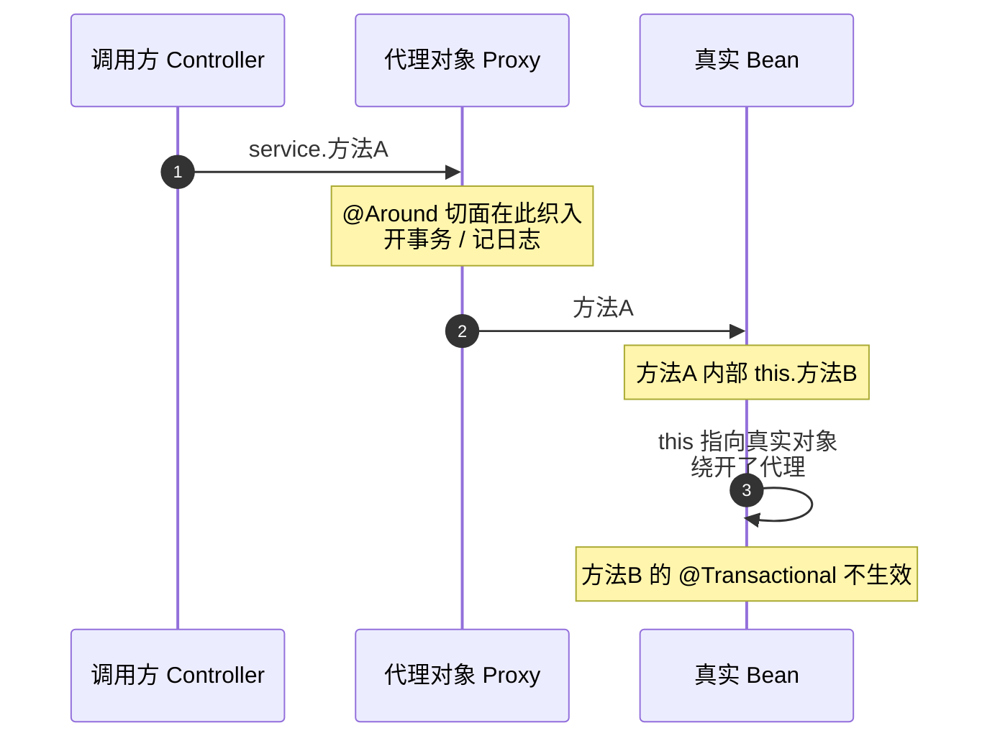
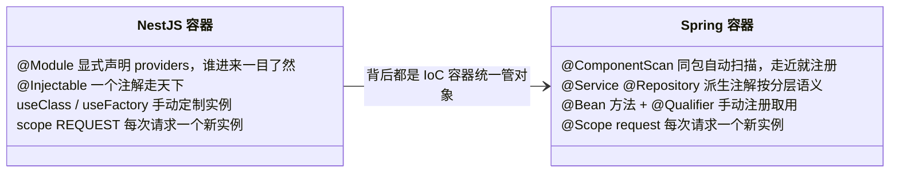
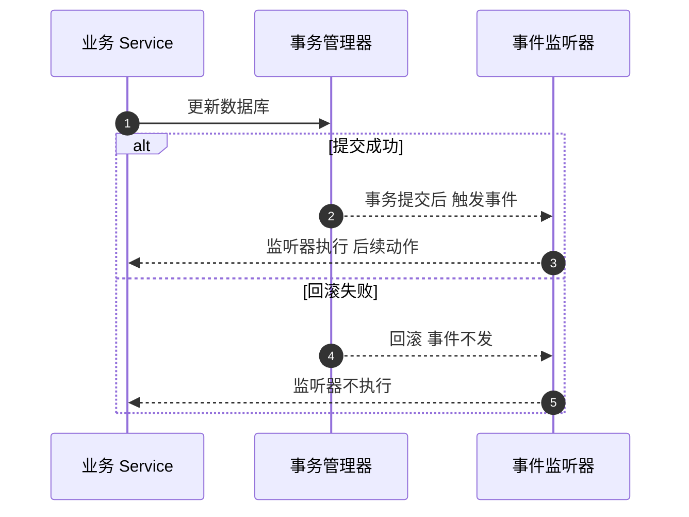

# 阶段二 · 小点 7：与 NestJS 的对比学习

> 所属：阶段二 Spring 生态与 Web 开发核心
> 定位：把整个阶段二收进一张对照表 + 三组「同一需求的两种写法」。NestJS 大量借鉴 Spring，这张表是你最快的学习加速器——**新概念先映射旧概念，再记差异**。

## 快速入门

> 本节为「对照速查」：先把你熟悉的 NestJS 概念对位到 Spring 对应写法；「深层差异原因」留在正文提高部分。

> 🧩 **前置 30 秒：五个请求件**——你已经会 NestJS 的五个「请求件」：Middleware（中间件，最外层横切）、Guard（守卫，鉴权）、Interceptor（拦截器，包响应流）、Pipe（管道，转参数）、ExceptionFilter（异常过滤器，兜底）。Spring 把同一套事情拆得更碎、摆在不同的层——所以本讲只做两件事：**对上名字**（下方映射表）、**指出它在哪一层**（第 1 节的生命周期对照图）。细节在「学习内容详情」第 2 节展开。

### 本讲核心映射速查

| NestJS | Spring | 一句话对比 |
|-|-|-|
| `@Module` | `@Configuration` + `@ComponentScan` | Spring 隐式组件扫描（Component Scan），NestJS 显式声明模块 |
| `@Injectable()` | `@Service` / `@Component` | 都是「交给容器管理」（IoC 容器 + 依赖注入 Dependency Injection） |
| `@Controller` | `@RestController` | 都是处理 HTTP 请求 |
| `@UseGuards(Guard)` | 过滤器链 / 拦截器 / `@PreAuthorize` | 鉴权是「三层组合」：链 + 拦截器 + 方法级注解 |
| `Pipe`（如 ParseIntPipe） | Converter + Bean Validation | 参数转换 + 校验分两个机制 |
| `Interceptor` | Spring AOP（Aspect-Oriented Programming，面向切面编程） | AOP 在字节码代理层，覆盖更广 |
| ExceptionFilter | `@RestControllerAdvice` | 全局异常统一处理 |
| 生命周期钩子 | Bean 生命周期回调 | `@PostConstruct` / `@PreDestroy` |
| EventEmitter | ApplicationEvent | Spring 事件默认同步执行，可挂事务提交时机（见下注）；详见面试题 Q4 |

> 注：`@TransactionalEventListener` 是把事件「钉」在事务上的监听注解——事务成功提交才触发、回滚则不发（EventEmitter 是纯广播，没有「跟事务走」这个维度）。

### 本讲在解决什么问题

- **问题**：你有 NestJS 底子，Spring 的很多概念其实似曾相识——只是名字、写法不同。本讲把「同一件事的两种写法」对照起来，学得最快。
- **你要带走的一句话**：**概念是通用的，实现方式不同**。看到 Spring 里不熟的写法，先映射到熟悉的 NestJS 概念，再记差异（隐式/显式、AOP 深度、校验位置）。

### 最简对照示例（照抄能跑）

```typescript
// NestJS: 一个接口, 用 Guard 鉴权、Pipe 校验
@Controller('users')
export class UserController {
  @Get(':id')
  @UseGuards(AdminGuard)            // Guard: 鉴权
  findOne(@Param('id', ParseIntPipe) id: number) {  // Pipe: 类型转换
    return this.service.findOne(id);
  }
}
```

```java
// Spring: 同一件事, 用 @PreAuthorize + @PathVariable 完成
@RestController
@RequestMapping("/users")
public class UserController {
    @GetMapping("/{id}")
    @PreAuthorize("hasRole('ADMIN')")        // 方法级权限校验(≈ Guard)
    public User findOne(@PathVariable Long id) {   // 参数绑定(≈ Pipe 的转换)
        return service.findOne(id);
    }
}
```

> 代码备注（逐行解释）：
> - NestJS 的 `@UseGuards(AdminGuard)` 对应 Spring 的 `@PreAuthorize("hasRole('ADMIN')")`——都是方法级鉴权。
> - NestJS 的 `ParseIntPipe`（把参数转 int）在 Spring 由 `@PathVariable Long id` 自动完成类型转换 + 校验注解分工。
> - Spring 的鉴权是「过滤器链 + 方法级注解」组合：链先做认证（你是谁），`@PreAuthorize` 做授权（你能干什么）。
> - 一个核心差异：Spring AOP 在**字节码代理层**工作（任何 Bean 方法都能切），NestJS Interceptor 只包 Controller 路由。

### 关键映射 / 用法说明

| NestJS | Spring | 差异要点 |
|-|-|-|
| `@Module` | `@Configuration` | NestJS 模块显式，Spring 组件扫描隐式 |
| Guard | 过滤器链 / 拦截器 / `@PreAuthorize` | 鉴权是三层组合而不是单一 Guard |
| Pipe | Converter + Bean Validation | 参数转换 / 校验两个机制 |
| Interceptor | AOP 切面 | AOP 覆盖更广（不只 Controller） |
| ExceptionFilter | `@RestControllerAdvice` | 统一异常处理 |
| 生命周期钩子 | `@PostConstruct`/`@PreDestroy` | Bean 生命周期回调 |

### 常用约定 / 迁移提醒

- **先映射、再记差异、最后练手**：新概念先对应熟悉的 NestJS 概念，再补差异——这就是本讲「对照表 + 关键差异列」的设计原理。
- 类比「**方言同义词典**」：就像广东话母语者学普通话，大部分词同源、看着就懂（映射表），少数词同形不同义、必须单独记（「关键差异」列），还有极少数词广东话里根本没有（Spring 独有的 AOP 代理层）。
- **Spring 隐式 vs NestJS 显式**：Spring 组件扫描是隐式的（同包自动扫），NestJS 模块关系是显式声明。
- 想象「**自动门 vs 刷卡进门**」：Spring 的 `@ComponentScan` 是自动门，走近就开、全靠约定（同包及子包即自动注册）；NestJS 的 `@Module` 是刷卡进门，不显式声明 providers 谁都不放行。
- 排查「Bean 没注入」时也因此兵分两路：Spring 查扫描路径、NestJS 查模块引用。
- **别把 NestJS 心智硬搬**：如「事件」——Spring 事件长在事务上（`@TransactionalEventListener`），和 EventEmitter 的「纯发布订阅」不同。

## 精简大纲

1. 框架级概念对照表（十组核心映射）
2. 同需求双栈实现：Guard vs Filter+Interceptor / Pipe vs @Valid / Module vs 自动扫描
3. 差异的深层原因：隐式 vs 显式、AOP 深度、校验位置
4. 使用方法：先映射、再记差异、最后练手验证

## 学习内容详情

### 1. 概念对照表

| NestJS 概念 | Spring 对应 | 关键差异 |
|-------------|-------------|----------|
| `@Module` | `@Configuration` + `@ComponentScan` | Spring 自动扫描更隐式，NestJS 更显式 |
| `@Injectable` | `@Service` / `@Component` | 概念一致，Spring 派生注解更多（按分层语义） |
| 自定义 Provider（useClass / useFactory / 自定义 token，见注） | `@Bean` + `@Qualifier` | 都是「手动注册 + 按名取用」；Spring 用 `@Bean` 方法返回实例、`@Qualifier` 限定注入哪个 |
| `@Injectable({scope: Scope.REQUEST})` | `@Scope("request")` | 都是「每次请求一个新实例」；Spring 作用域更全（singleton / prototype 等，见注） |
| `forwardRef`（循环依赖） | `@Lazy` / ObjectProvider | 循环依赖的兜底：Spring 构造注入默认能解（见注），少数场景才用 `@Lazy` / ObjectProvider 延迟获取 |
| `@Controller` | `@RestController` | 几乎一致 |
| Middleware | Servlet Filter / OncePerRequestFilter | 都在最外层做横切（日志 / 跨域等）；`OncePerRequestFilter` 保证一次请求只过一遍 |
| Guard | Filter / Interceptor | Spring 过滤器链更灵活、粒度更细 |
| Pipe | `@Valid` + Bean Validation | 标准化注解校验，生态更成熟 |
| Interceptor | HandlerInterceptor / AOP | AOP 能力远超 NestJS Interceptor |
| `ExceptionFilter` | `@RestControllerAdvice` + `@ExceptionHandler` | 概念一致：全局兜底、统一转 HTTP 响应 |
| TypeORM / Prisma | Spring Data JPA / MyBatis-Plus | JPA 是标准，MyBatis 对 SQL 掌控更直接 |
| Jest + Supertest | JUnit 5 + Mockito + Testcontainers | Java 测试工具链更重但更工程化 |
| 生命周期钩子（`onModuleInit` 等） | Bean 生命周期（`@PostConstruct` / `@PreDestroy` 等，见注） | 时机对应，Spring 粒度更细（见注） |

> 注：`useClass` / `useFactory` / 自定义 token + `@Inject('TOKEN')` 都是「告诉容器实例怎么建、再按名（token）取」的显式写法。
> 注：Spring 作用域更全：singleton 单例（默认就一个）/ prototype 每次要都新建 / request 每个 HTTP 请求一个新实例。
> 注：三级缓存＝解决「A 构造要 B、B 构造要 A」这类循环依赖的缓存机制（先登记半成品引用，让两边都能先拿到对方）；ObjectProvider＝延迟取 Bean 的「取货单」，要时才真去取。
> 注：生命周期回调对应关系看表头即可——`@PostConstruct`／`@PreDestroy`／`InitializingBean` 是三种记忆点（初始化后／销毁前／早期接口式）；Aware 接口族、BeanPostProcessor 是给框架作者的更细粒度扩展点（见第 3 节 ⏸️ 框）。

> **本讲最高价值的图：请求生命周期双栈对照**——上表对的是「名字」，这张图对的是「**位置和顺序**」。同一个 HTTP 请求，两个框架各走一条链：

```mermaid
flowchart LR
    subgraph nest[① NestJS 请求处理链]
        N1[Middleware<br/>中间件：最外层横切] --> N2[Guard<br/>守卫：鉴权能不能进]
        N2 --> N3[Interceptor 前<br/>拦截器：进方法前的横切]
        N3 --> N4[Pipe<br/>管道：参数转换与校验]
        N4 --> N5[Controller<br/>控制器：业务入口]
        N5 --> N6[Interceptor 后<br/>拦截器：包装响应流]
        N6 -- 抛异常时 --> N7[ExceptionFilter<br/>异常过滤器：统一转 HTTP 响应]
    end

    subgraph spring[② Spring 请求处理链]
        S1[Filter 链<br/>过滤器：最外层横切] --> S2[DispatcherServlet<br/>前端控制器：统一分发路由]
        S2 --> S3[HandlerInterceptor<br/>拦截器：preHandle 进方法前]
        S3 --> S4[AOP 层<br/>@Valid 校验 + @PreAuthorize 授权]
        S4 --> S5[Controller<br/>控制器：业务入口]
        S5 -- 抛异常时 --> S6[@RestControllerAdvice<br/>异常处理器：统一转 HTTP 响应]
    end
```

> 读图要点：
> - **同一件事，NestJS 一个词一个位置，Spring 拆三层**——NestJS 的 Middleware 在上面的映射表里都没出场，它的位置就是 Spring 的 Filter 链（最外层横切）。
> - **顺序差异**：NestJS 是 **Guard 先于 Pipe**（先问进不进，再转参数）；Spring 把「校验 + 授权」都收在 **AOP 层**（进 Controller 前一个层装两件事）——这正是 2.1 节「这段鉴权代码该放哪层」的决策场景，也是面试题 Q4 坑①「鉴权位置」的底层原因。
> - 两条链末端的 `-- 抛异常时 -->` 只在异常时才走：两边的「异常处理器」都是兜底，不参与正常业务流。

### 2. 同需求双栈实现

#### 2.1 请求前置校验（Guard）

```typescript
// NestJS: 一个 Guard 把「谁能进这个路由」管到底
@Injectable()
export class AdminGuard implements CanActivate {
  canActivate(ctx: ExecutionContext): boolean {
    const req = ctx.switchToHttp().getRequest();
    return req.user?.role === 'admin';          // 不满足直接抛 ForbiddenException（403），Controller 根本不会被执行
  }
}

@Controller('admin/stats')
@UseGuards(AdminGuard)                          // 路由级挂载, 位置一目了然
export class StatsController { /* ... */ }
```

```java
// Spring: 三种「位置」任选 —— 这正是差异所在
// 位置一: 过滤器链(最外层, 认证/鉴权统一处理, 阶段二第 6 讲的 JwtAuthFilter)
// 位置二: 拦截器(HandlerInterceptor, 仅 MVC 层)
@Component
class AdminInterceptor implements HandlerInterceptor {
    @Override
    public boolean preHandle(HttpServletRequest req, HttpServletResponse res, Object handler) throws Exception {
        var auth = SecurityContextHolder.getContext().getAuthentication();
        if (auth == null || !auth.getAuthorities().stream().anyMatch(a -> a.getAuthority().equals("ROLE_ADMIN"))) {
            res.setStatus(403);
            return false;                       // 返回 false = 请求到此为止(≈ canActivate 返回 false)
        }
        return true;
    }
}
// 位置三: 方法注解(@PreAuthorize, AOP 层 —— NestJS 没有对应物, 粒度到单个方法)
```

> NestJS 的 Guard ≈ Spring 的「Filter 链 / Interceptor / @PreAuthorize」**三者之一**——Spring 把能力拆成了更细的层次（见第 1 节的生命周期对照图），灵活，但「这段鉴权代码该放哪层」反而成了新决策（答：横切所有请求放过滤器链，MVC 层专属放拦截器，按方法 / 角色粒度放 @PreAuthorize）。

> 把上面的「决策」画成选择树——**放哪层，跟着「拦多大范围」走**：

```mermaid
flowchart TD
    A[鉴权需求来了<br/>这段代码放哪层] --> B{拦的范围多大}
    B -->|所有请求都要| C[过滤器链 Filter<br/>最外层 日志 / 认证<br/>如阶段二第 6 讲 JwtAuthFilter]
    B -->|只有部分路径前缀| D[拦截器 HandlerInterceptor<br/>preHandle 进方法前拦截]
    B -->|单个方法 / 角色粒度| E[@PreAuthorize 注解<br/>AOP 层 切到方法级]
    C --> F[都能在业务执行前把好门<br/>差异只在粒度与位置]
    D --> F
    E --> F
```

#### 2.2 入参转换与校验（Pipe vs Bean Validation）

```typescript
// NestJS: ParseIntPipe 转类型, class-validator 装饰 DTO
@Get(':id')
findOne(@Param('id', ParseIntPipe) id: number) { ... }

class CreateOrderDto {
  @IsInt() @Min(1) quantity: number;
}
```

```java
// Spring: 类型转换是 Converter 体系(隐式), 校验长在 DTO 字段上(注解标准统一)
@GetMapping("/{id}")
Order detail(@PathVariable Long id) { ... }              // String→Long 框架自动转

public record CreateOrderDto(
    @Min(value = 1, message = "数量至少为 1") Integer quantity) {}
// Controller 入参加 @Valid 即触发 —— 与 Nest 的 ValidationPipe 同一时机(进方法前)
```

> 对比小结：
> - **校验语义几乎一致**；差异在**生态**：Bean Validation 是 JSR（Java Specification Request，Java 官方规范的编号流程）标准（跨 Hibernate Validator、未来实现可换），class-validator 是 NestJS 生态专属件。
> - **一处分工差异**：`ParseIntPipe` 这类参数级转换，在 Spring 由 Converter（类型转换）+ Bean Validation（校验）两个机制分工完成——转换管「怎么从 String 变成目标类型」，校验管「变完合不合法」。

> **生活版类比（校验位置）**：前台收表时当场拿红笔帮你改格式，是「动态、可编程」的；但表格本身就是固定格式、填错格式就交不上来，是「静态、即契约」的。**换成 Java/Spring**：NestJS 的 Pipe 像前者——在参数层写代码处理，灵活可编程；Bean Validation 注解长在 DTO 字段上像后者——规则跟着字段走、改一处全工程生效。

#### 2.3 横切日志（Interceptor vs AOP）

```typescript
// NestJS Interceptor: 包一层响应流 —— 只能拿到"可观测的进出"
@Injectable()
export class LogInterceptor implements NestInterceptor {
  intercept(ctx: ExecutionContext, next: CallHandler) {
    const t0 = Date.now();
    return next.handle().pipe(tap(() => this.logger.log(`${ctx.getClass().name} +${Date.now() - t0}ms`)));
  }
}
```

> ⚠️ **别把响应式心智带进 Spring MVC**：NestJS 的 Interceptor 返回的是 Observable（RxJS 的异步数据流对象），而 Spring AOP 的对应物返回的是普通 Java 对象——Spring MVC 默认是同步阻塞的，不欢迎也不需要 `pipe` / `tap` 这套响应式包装。什么时候才真正需要响应式？见第 4 讲 WebFlux 的选型判断（绝大多数 CRUD 业务都不需要）。

```java
// Spring AOP: 切点表达式能指到「任意方法」—— 不止 Controller, Service 内部方法也行
@Aspect @Component
public class CostLogAspect {
    @Around("@annotation(CostLog)")          // 自定义注解定位: 要切谁就标谁(比表达式白名单更可控)
    public Object log(ProceedingJoinPoint pjp) throws Throwable {
        long t0 = System.nanoTime();
        try { return pjp.proceed(); }
        finally {
            log.info("{}.{} +{}ms", pjp.getSignature().getDeclaringType().getSimpleName(),
                     pjp.getSignature().getName(), (System.nanoTime() - t0) / 1_000_000);
        }
    }
}
```

> 能力差距的本质：
> - **NestJS Interceptor 活在「HTTP 请求边界」**——只在路由处理器外围走一遍，拦不到 Service 内部方法。
> - **Spring AOP 活在「方法调用边界」**——Bean 创建时被代理（Proxy）对象包装，任何方法调用都先经过切面逻辑（字节码代理，阶段一第 3 讲）；代理分 JDK 动态代理（基于接口）与 CGLIB（基于子类字节码增强）两种。
> - `@Transactional` 只能由 AOP 提供，就是这个差距最好的例证。

> **生活版类比（代理）**：你托前台转交文件给同事，前台会登记签收、全程经手；可你趁同事路过直接把文件塞给他，流程根本没走前台，自然没有登记存档。**换成 Java/Spring**：调 Bean 的公开方法都先过代理（事务 / 日志切面先执行）；同类内部 `this.method()` 自调用等于「绕过前台直达同事」，`@Transactional` / `@PreAuthorize` 这类注解就会静默失效。

> 用图看「自调用为什么失效」：



> ⏸️ **短期可以不学**：AOP 底层代理实现（JDK 动态代理 vs CGLIB 的差异、各自适用条件、代理失效的完整边界）不影响日常用注解写切面，现在深挖投入产出比低。**何时回来学**：遇到「`@Transactional` / `@PreAuthorize` 不生效」的同类自调用问题时。**面试最低要求**：能说清「AOP 靠代理拦截方法调用，同类自调用绕不开代理所以注解失效」即可。

### 3. 深层原因（比表格更值得记）

先把「名字映射」升级成「**容器长什么样**」——同一套 IoC 思想（控制反转：对象不自己 new，交给容器统一管），两个框架的容器结构对照：



> 读图：两列左边是「怎么把对象交给容器」，右边是「怎么把对象拿出来用」——NestJS 全靠显式声明「进场」，Spring 大半靠自动扫描「就近注册」。

- **隐式 vs 显式**：Spring 把「谁被注册」藏进组件扫描 / 自动装配；NestJS 的 Module 显式声明 imports / providers。调试装配问题时，Spring 查「扫描路径覆盖没有」，NestJS 查「Module 引了没有」。
- **注解语义密度**：Spring 的派生注解多——@Service / @Repository / @Controller 对容器而言都是同一个 @Component，但各自带语义分层 + MVC 特殊处理；NestJS 的 @Injectable 一词走天下。
- **学习期怎么记**：只记「哪个注解在哪些框架行为里有额外含义」就够——如 @Controller 被 MVC 扫描、@Configuration 有 CGLIB 增强等。
- **校验位置**：Pipe 在参数层拦截（动态、可编程）；Bean Validation 注解长在 DTO 字段上（静态、即契约）。

> ⏸️ **短期可以不学**：Bean 生命周期的深度扩展点（Aware 接口族、BeanPostProcessor）是框架作者 / 中间件才需要实现的 SPI（Service Provider Interface，JDK 的插件发现机制），业务代码几乎不碰。**何时回来学**：要自定义 Starter、写框架级组件时。**面试最低要求**：能说出生命周期大顺序（实例化 → 属性填充 → 初始化回调 → 使用 → 销毁）即可。

### 4. 使用方法

1. **先映射**：遇到 Spring 新概念，先在表中找 NestJS 对应物建立锚点。
2. **再记差异**：重点记「关键差异」列与第 3 节深层原因——直觉迁移踩坑都在这里。
3. **练手验证**：同一需求（「带 RBAC 的 CRUD 接口」）用两种栈各写一遍，差异自现。

### 坑点提醒

- **别把 NestJS 的「Guard」直译成 Spring Filter**：认证/授权/异常转码三件事在 Spring 分属过滤器链 / @PreAuthorize / @RestControllerAdvice——先问「我想拦在哪层」。
- **@Injectable 心智套到所有 @Component**：Spring 的 @Repository 等派生注解有**额外行为**（如 @Repository 触发持久化异常转译），不是纯改名。
- **module 显式声明的肌肉记忆会拖累你**：Spring 默认「同包及子包全扫」——Bean 没进容器先查扫描根路径（`@SpringBootApplication` 所在包就是扫描根），而不是找「哪个 Module 没引」。

## 本节自检

- [ ] 能默写十组概念映射，并为每组说出至少一条关键差异
- [ ] 能解释 Spring「隐式装配」与 NestJS「显式 Module」在调试排查路径上的不同
- [ ] 能说出 Spring AOP 为什么能实现 @Transactional 而 NestJS Interceptor 不能
- [ ] 能就「同一需求双栈实现」写出各自的 Guard/Pipe/Interceptor 对应代码骨架

## 本节配套思考题

1. NestJS 用 `@Module({providers: [...]})` 显式列出 provider；如果 Spring 也这么设计，会多付出什么、少踩什么坑？（想想大型工程里「为什么这个 Bean 存在 / 不存在」的可追溯性）
2. class-validator 的 `whitelist: true`（拒绝 DTO 外字段）防的是 mass assignment（批量字段赋值漏洞：前端多传一个 `role` 字段就能把自己提成 admin）；Spring 侧用什么挡它（@RequestBody + record 默认忽略未知字段吗，还是要配）？
3. 给一个纯 NestJS 同事做 15 分钟 Spring 入门分享：你会选哪三组概念对照当主线？其余的为什么不讲？

## 常见面试题

### Q1：NestJS 和 Spring 在设计哲学上最本质的差异是什么？

**答**：**标准结论**：最本质差异在「容器的深度」。两者都是 IoC + DI 思想，但 NestJS 的 DI 是「模块级显式声明」——`@Module` 里 imports / providers 一目了然；Spring 是「隐式组件扫描 + 自动装配」——同包及子包自动注册、`@Autowired` 按类型注入。所以 Spring 上手门槛更高，但大型工程里「新类写好注解即自动成为 Bean」的体验更顺。

原理层：
- Spring 的容器是完整的 IoC 容器（BeanFactory 是底层接口 / ApplicationContext 是包在外面的「总管容器」），管理 Bean 全生命周期：实例化 → 依赖注入 → 初始化回调 → 销毁。
- 衍生注解有额外语义：`@Repository` 触发持久化异常转译、`@Configuration` 被 CGLIB 代理。
- NestJS 容器更轻：生命周期钩子（`onModuleInit` 等）对应 Spring 的 `@PostConstruct` 等回调。

工程层差异：
- 排查「Bean 没注入」：Spring 查扫描根路径（`@SpringBootApplication` 所在包就是扫描根），NestJS 查模块 imports。
- 「先映射、再记差异、最后练手」的对比学习法，就是为这种「双心智」准备的。

> **生活版类比（容器深度）**：小饭馆自己买菜、自己跑堂、什么都是现管（轻量）；大食堂有中央厨房统一采购、冷藏、出餐流水线——食材「进系统就被管理」，谁要食材都从中央厨房领。**换成 Java/Spring**：NestJS 的 DI 像小饭馆——模块级显式声明，谁用谁登记；Spring 像中央厨房——ApplicationContext 把全部 Bean 的全生命周期托管起来（实例化 / 注入 / 初始化 / 销毁），新类经注解「进仓」即被统一管理。

### Q2：Spring AOP 为什么能实现 `@Transactional`，而 NestJS 的 Interceptor 做不到？

**答**：**标准结论**：因为两者的拦截边界不同。NestJS Interceptor 活在 HTTP 请求边界——只在路由处理器外围执行，拦不到 Service 层内部的任意方法调用；Spring AOP 活在方法调用边界——Bean 创建时被代理（JDK 动态代理或 CGLIB）包装，切点表达式可指向任意 Bean 的任意方法。`@Transactional` 本质就是在目标方法前后织入「开启 / 提交 / 回滚事务」的逻辑。

原理层：
- AOP 的关键是代理对象拦截：调用方持有的是**代理引用**，方法调用先经切面（`@Around` / `@Before` / `@After`），再反射进真实方法。
- 这就是为什么同类内 `this.method()` 自调用会让注解失效：`this` 是真实对象，不是代理。

工程层：
- NestJS 里事务要靠手动 `DataSource.transaction` / QueryRunner 包装；Spring 一个注解搞定——这是重业务后端选 Java 的重要理由。
- 但 AOP 不是万能：代理失效三查——非 public 方法、同类自调用、final 方法（CGLIB 靠子类重写实现，final 拦不住）。

### Q3：Spring 的隐式组件扫描与 NestJS 的显式模块声明，各有什么优缺点？

**答**：**标准结论**：两种机制互为镜像——**隐式省事但可追溯性差，显式可追溯但要多写样板**；没有绝对优劣，只有权衡点不同。

**隐式扫描（Spring）**
- **优点**：「零配置接入」——新类写好注解自动进容器，适合快速迭代，Spring Boot 的约定优于配置把它推到极致。
- **缺点**：「可追溯性」差——大型工程里一个 Bean 为什么存在、被谁依赖，要靠 IDE / 工具反查；隐式依赖在重构时容易漏改。

**显式声明（NestJS）**
- **优点**：模块依赖关系写在 imports 里，谁提供谁消费一目了然；缺失的 provider 在启动 / 编译期就报错（失败得快）。
- **缺点**：样板代码多——每个新 provider 都要记得注册。

**工程层结论**：两条路殊途同归。Spring 官方用 `@Configuration` 显式收口复杂装配、`@Import` 精确引入、ArchUnit（架构规则测试库，用代码断言「分层不能乱依赖」）做架构测试来补隐式的短板；NestJS 在大型项目里模块爆炸时同样需要分层治理。选型看团队规模与可追溯性要求——显式与隐式是权衡，不是优劣。

### Q4：从 NestJS 迁移到 Spring，最容易踩的三个坑是什么？

**答**：三个坑源于同一主题——**「NestJS 一个概念管一件事，Spring 拆成了多层机制」**；迁移时先问「这件事在 Spring 里拆在哪几层」。

**① 鉴权位置（最容易踩）**
- **标准结论**：NestJS 的 Guard 是单一概念；Spring 把能力拆成过滤器链 / 拦截器 / `@PreAuthorize` 三层。
- **落点**：横切所有请求放过滤器链，MVC 层专属放拦截器，按方法 / 角色粒度放 `@PreAuthorize`。
- **硬搬后果**：写出「放哪层都别扭」的代码。

**② 校验与转换位置**
- **标准结论**：NestJS 的 Pipe 在参数层动态处理；Spring 的类型转换（Converter）与校验（Bean Validation 注解长在 DTO 字段上）是两个机制。
- **关键认知**：Spring 的校验是**静态契约**——规则跟着字段走、跨层可复用（Service 层 `@Validated` 也能触发）。

**③ 「事件」心智与代理失效**
- **标准结论**：这两个「看不见的坑」是 NestJS 心智里完全没有的概念。
- **事件**：NestJS 的 EventEmitter 是纯发布订阅；Spring 事件默认同步，`@TransactionalEventListener` 让事件跟随事务提交时机（回滚则事件不发）。
- **代理失效**：`@Transactional` / `@PreAuthorize` 在同类自调用时静默失效——出问题时先按代理三查（非 public / 自调用 / final）排查。

> 「事件跟事务走」用图看：`@TransactionalEventListener` 就像在事务流水线上装的一道闸门，闸门只在「提交成功」时打开：


