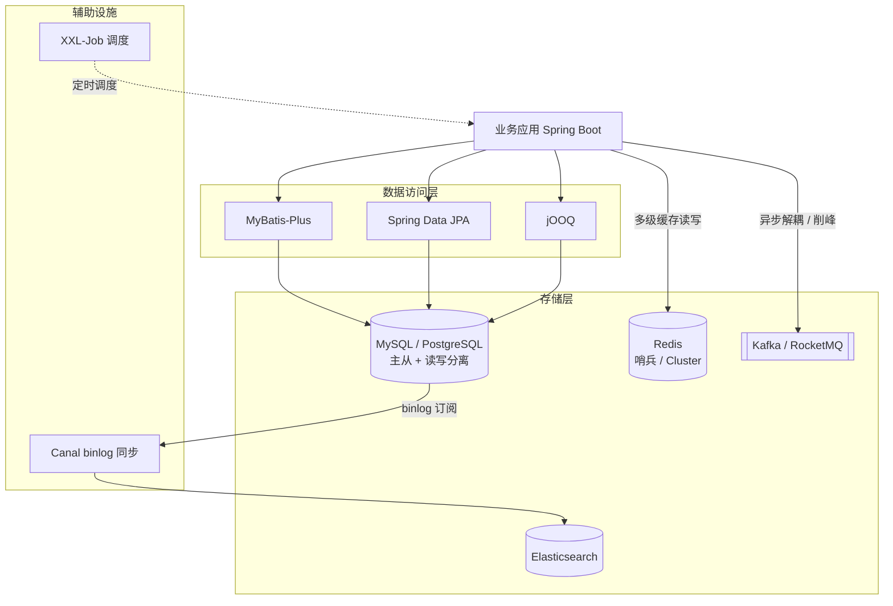

# 阶段三 · 小点 1：MySQL 内核与 SQL 优化

> 所属：阶段三 数据持久化与中间件
> 定位：数据层是后端的基石，前端转后端最容易踩坑的就是「数据库思维」——索引、事务、锁、慢查询在前端几乎不接触。本讲先给阶段三技术栈全景，再进 MySQL 内核：目标是「能看懂执行计划、能排查慢 SQL、能讲清一条 SELECT 背后发生了什么」。

## 快速入门

> 本节为「数据库速览」：先认识后端跟数据库打交道的基本动作；「B+树、MVCC、锁」留在正文提高部分。

### 本讲核心关键词速查

| 关键词 | 一句话大白话 | 例子 |
|-|-|-|
| MySQL | 最常用的关系型数据库（存业务数据） | 订单、用户表 |
| 索引 | 加速查询的「目录」，本质是排序的数据结构 | 给 user_id 加索引 |
| 主键 | 每条记录的唯一标识 | `id` 自增 |
| 聚簇索引 | 主键索引，叶子直接存整行数据 | 查主键最快 |
| 回表 | 用二级索引查到主键，再回主键索引取整行 | 慢查询常见源 |
| 覆盖索引 | 查询的列全在索引里，不用回表 | 优化慢 SQL |
| 事务 | 一组操作要么全成功要么全回滚 | 下单 + 扣库存 |
| 慢查询 | 执行很慢的 SQL | 秒级才返回 |

### 本讲在解决什么问题

- **问题**：前端几乎不碰数据库，但后端每天都在写 SQL。索引怎么建、为什么慢、事务怎么保证一致性——这些「数据库思维」是前端转后端最大的坎。
- **你要带走的一句话**：**索引是加速查询的目录**；`主键索引` 直接存整行（聚簇），`二级索引` 查到主键还要回表。SQL 慢，先看索引没用好、有没有回表。

### 最简可运行示例（照抄能跑）

```sql
-- 建表 + 加索引: 让查询变快的常见写法
CREATE TABLE `order` (
    id BIGINT PRIMARY KEY AUTO_INCREMENT,   -- 主键(聚簇索引, 存整行)
    user_id BIGINT NOT NULL,
    status TINYINT,
    created_at DATETIME
);
CREATE INDEX idx_user_status ON `order` (user_id, status);   -- 联合索引, 支持按 user_id 查

-- 用 EXPLAIN 看这条查询怎么执行(是否用上索引)
EXPLAIN SELECT id, status FROM `order` WHERE user_id = 10086 AND status = 1;
-- type=ref (用了索引), key=idx_user_status  → 说明索引生效了
```

> 代码备注（逐行解释）：
> - `id BIGINT PRIMARY KEY`：主键，默认建一个聚簇索引，存整行数据。
> - `CREATE INDEX idx_user_status`：建一个「user_id + status」的联合索引——按 user_id 查（并带有 status 条件）时能用到。
> - `EXPLAIN ...`：**看这条 SQL 怎么执行**——`key=idx_user_status` 表示用上了索引；若 `type=ALL` 则是全表扫，慢。
> - 这就是排查慢 SQL 的起点：`EXPLAIN` 看有没有用索引、还是全表扫。

### 关键概念说明

| 概念 | 干什么 | 最易踩的坑 |
|-|-|-|
| 主键索引（聚簇） | 叶子存整行 | 主键要小（用自增，别用 UUID 等大值做主键） |
| 二级索引 | 叶子存主键，要回表 | 查询列全在索引里可免回表（覆盖索引） |
| 联合索引 | 多列组合的索引 | 最左前缀：`(a,b)` 能命中 `a` 和 `a,b`，但不能只命中 `b` |
| 事务 | 保证 ACID（原子性 Atomicity / 一致性 Consistency / 隔离性 Isolation / 持久性 Durability） | 需要时加，别滥用（长事务占连接） |
| EXPLAIN | 看执行计划 | 排查慢 SQL 第一步 |
| HikariCP 连接池 | 复用数据库连接 | 连接数不是越大越好（吃内存） |

### 常用约定 / 命名提示

- **别用 `SELECT *`**：只取需要的列，尽量覆盖索引、减少回表。
- **字段类型速查**：金额用 `DECIMAL`（禁 FLOAT/DOUBLE）；状态用 `TINYINT`；时间用 `DATETIME`；定长短串选 `CHAR`/`VARCHAR`。
- **慢 SQL 排查三步**：开慢查询日志 → `EXPLAIN` 看执行计划 → 优化索引或改写 SQL。
- **数据库表结构变更用 Flyway**：别手工在库上跑 DDL——写进版本化迁移脚本（本讲后续展开）。

## 精简大纲

1. 阶段三技术栈全景
2. InnoDB 内核：聚簇索引 / 二级索引 / B+ 树选型论证
3. 回表与覆盖索引
4. MVCC 与 ReadView、四大隔离级别
5. 事务与锁：行锁 / 间隙锁 / Next-Key Lock
6. SQL 优化实战：慢查询日志 → EXPLAIN → 索引失效

## 学习内容详情

### 1. 阶段三技术栈全景



> 先记住一句话认知：**MySQL 是数据库服务器，InnoDB 是它默认的存储引擎**——SQL 语法、连接管理由 MySQL 层负责；数据怎么存、索引怎么建、事务怎么保证，全在 InnoDB 层。类比：MySQL ≈ Node.js 运行时，InnoDB ≈ V8 引擎。

### 2. InnoDB 内核：索引结构

#### 2.1 先建一张贯穿全阶段的订单表

```sql
-- 订单表：阶段三所有 SQL 示例都用这张表，保持业务连贯
CREATE TABLE `order` (
    id           BIGINT UNSIGNED AUTO_INCREMENT PRIMARY KEY,  -- 主键：聚簇索引的锚点
    order_no     VARCHAR(32)  NOT NULL,          -- 业务订单号（对外暴露用，不拿主键当业务号）
    user_id      BIGINT        NOT NULL,         -- 下单用户
    status       TINYINT       NOT NULL DEFAULT 0, -- 0待支付 1已支付 2已发货 3已完成
    amount       DECIMAL(10,2) NOT NULL,         -- 金额用 DECIMAL：浮点数会丢精度，钱不能算错
    created_at   DATETIME      NOT NULL DEFAULT CURRENT_TIMESTAMP,
    updated_at   DATETIME      NOT NULL DEFAULT CURRENT_TIMESTAMP ON UPDATE CURRENT_TIMESTAMP,
    UNIQUE KEY uk_order_no (order_no),           -- 业务唯一约束（幂等的最后防线，见阶段二）
    KEY idx_user_status (user_id, status)        -- 联合索引：最左前缀原则的主角
) ENGINE=InnoDB DEFAULT CHARSET=utf8mb4;
```

**字段类型速查**（建表规范，踩坑高发区）：

| 场景 | 类型 | 一句话理由 |
|-|-|-|
| 金额 | `DECIMAL` | 禁 FLOAT/DOUBLE——浮点丢精度，钱不能算错 |
| 状态/枚举 | `TINYINT` | 1 字节存枚举值，别拿 VARCHAR 存中文状态 |
| 时间 | `DATETIME` | TIMESTAMP 有 2038 上限 + 时区语义问题，按需选 |
| 布尔 | `TINYINT(1)` | MySQL 没有真布尔，约定 0/1 |
| 定长 vs 变长串 | `CHAR(n)` vs `VARCHAR(n)` | 手机号这类定长短串用 CHAR，其余 VARCHAR |
| 长文本 | `TEXT` | 存大段正文；不进主键/聚簇索引的考量 |

#### 2.2 聚簇索引 vs 二级索引

- **聚簇索引**（**Clustered Index**：表数据本身就按主键组织成的 B+ 树，叶子节点直接存整行）：主键就是这棵树的排序键。所以 InnoDB 表「必须有主键」，没显式指定会用第一个非空唯一索引或隐式生成 row_id。
- **二级索引**（**Secondary Index**：非主键索引，叶子节点存「索引列 + 主键值」而不是整行）：查到主键后还要去聚簇索引再查一次拿整行——这次「再查」就是**回表**（**Bookmark Lookup**）。


- 类比：二级索引像书附录的「术语表」（术语 → 页码），聚簇索引像书正文按页码排——查术语先翻附录拿页码，再翻正文，两次查找。

#### 2.3 为什么是 B+ 树（不是 B 树 / 跳表 / 哈希）（选读：项目实战阶段再深挖，主线记住结论即可）

| 候选结构 | 落选原因 |
|-|-|
| **B 树** | 每个节点都存数据 → 单页（16KB）容纳的键少 → 树更高 → 磁盘 IO 更多；且叶子不连链表，范围扫描要回到上层反复下降 |
| **跳表** | 内存结构（Redis ZSet 用它），磁盘页不友好；没有「一页多键」的高扇出 |
| **哈希** | 等值 O(1) 完美，但完全不支持范围查询（`BETWEEN` / `ORDER BY` 全废）——Memory 引擎才用 |

> **B+ 树**（B-Tree 变体：非叶子节点只存键不存数据、叶子节点存数据且用双向链表串联）胜出的两个理由：**矮胖**（高扇出，3-4 层就能存千万行，一次点查 = 3-4 次页 IO）+ **叶子链表**（范围查询顺着链表扫即可，`WHERE user_id > 100 ORDER BY id` 这种天然高效）。

> ⏸️ **短期可以不学**：B+ 树 vs B 树 / 跳表 / 哈希的选型论证属于存储引擎源码级推导，主线记住「高扇出 + 叶子链表」这个结论即可，不用逐条手推。**何时回来学**：需要做存储选型或排查索引失效、面试被问到存储引擎内核时。**面试最低要求**：一句话说出 B+ 树两个胜出理由（矮胖高扇出减少磁盘 IO、叶子链表天然支持范围查询）。

#### 2.4 覆盖索引：省掉回表

```sql
-- 需要回表：SELECT 里有 status 之外的列（amount 不在 idx_user_status 里）
-- 命中索引后还要拿 id 去聚簇索引取 amount
SELECT user_id, status, amount FROM `order` WHERE user_id = 10086 AND status = 1;

-- 覆盖索引：查询列全部落在 idx_user_status(user_id, status) 里
-- 不需要回表，EXPLAIN 的 Extra 会显示 "Using index"
SELECT user_id, status FROM `order` WHERE user_id = 10086 AND status = 1;
```

- **覆盖索引**（**Covering Index**：查询所需的所有列都在索引里，无需回表）：优化高频小查询的常用手段——把 `SELECT` 的列收窄，或把常一起查的列做进联合索引。

### 3. MVCC 与 ReadView

#### 3.1 为什么需要 MVCC

- **MVCC**（**Multi-Version Concurrency Control**，多版本并发控制）：让「读」不加锁——每行数据保留多个历史版本，读事务按规则挑一个「对自己可见」的版本。类比 Git：每行数据有自己的提交历史，不同读者可以 checkout 不同的版本。
- 实现材料：每行隐藏列 `trx_id`（最后修改它的事务 ID）+ `roll_pointer`（指向 undo log 里的上一个版本，形成版本链）。

#### 3.2 ReadView：可见性判定器

- **ReadView**（快照读事务开启时生成的「活跃事务清单」，用于判定哪个版本可见）：包含创建时刻所有**未提交**事务的 ID 列表。判断规则一句话：**某版本的 trx_id 如果是「已提交的、且在我之前提交的」事务，就可见；否则顺 roll_pointer 链找上一个版本**。

```sql
-- 演示可重复读（RR）的效果：两个会话，左侧是事务 A，右侧是事务 B
-- A（RR 隔离级别，默认）
START TRANSACTION;
SELECT amount FROM `order` WHERE id = 1;   -- 返回 100.00，生成 ReadView

-- B（另一个会话，独立事务）
UPDATE `order` SET amount = 200.00 WHERE id = 1;
COMMIT;                                    -- B 已提交

-- A 再次读
SELECT amount FROM `order` WHERE id = 1;   -- 仍然 100.00！
-- 原因：RR 下事务 A 全程复用第一个 ReadView，
-- 200.00 那个版本的 trx_id 不在 A 的可见集合里，A 顺版本链读到旧值
```

#### 3.3 四大隔离级别与当前读 / 快照读

| 隔离级别 | 现象 | InnoDB 实现 |
|-|-|-|
| 读未提交（RU） | 脏读（读到别人没提交的） | 基本不用 |
| 读已提交（RC） | 不可重复读（两次读不一致） | **每次 SELECT 生成新 ReadView** |
| 可重复读（RR，默认） | 幻读：快照读靠 MVCC 天然杜绝，加锁读靠 Next-Key Lock | **事务内复用第一个 ReadView** |
| 串行化 | 无并发问题 | 读也加锁，性能差 |

- **快照读（Snapshot Read）vs 当前读（Current Read / Locking Read）**：普通 `SELECT` 是快照读（走 MVCC 不加锁）；`SELECT ... FOR UPDATE` / `UPDATE` / `DELETE` 是**当前读**（必须读最新版本并加锁）——这是「明明 RR 还会出现幻读」的原因，也是悲观锁 `FOR UPDATE` 的理论基础。

### 4. 事务与锁

```sql
-- 事务的基本骨架：转不动就回滚，别让半成品数据留在库里
START TRANSACTION;
UPDATE `order` SET status = 2 WHERE id = 1 AND status = 1;  -- 带旧状态条件：天然的乐观锁（CAS 思想）
-- affected rows = 0 说明状态已被别人改走 → 走补偿逻辑，不能继续发货
COMMIT;
```

- **行锁**（锁住索引记录本身）、**间隙锁**（**Gap Lock**：锁住「两条索引记录之间的空隙」，阻止插入）、**Next-Key Lock**（行锁 + 间隙锁的组合，RR 级别防幻读的核心：锁住「记录 + 它前面的空隙」）。
- 死锁排查：

```sql
-- 两个事务互相持锁等待时，InnoDB 会自动检测并回滚代价小的一方
-- 死锁现场保存在这里（看 LATEST DETECTED DEADLOCK 段：谁持有谁等待）
SHOW ENGINE INNODB STATUS\G

-- 预防纪律：事务内按固定顺序访问资源（如都按 id 升序 UPDATE）、
-- 事务尽量短小、事务里绝不调外部 HTTP / 发 MQ（拖长持锁时间 = 死锁温床）
```

### 5. SQL 优化实战

#### 5.1 慢查询日志：找到要优化的 SQL

```sql
-- 开启慢日志（动态，重启失效；持久化要写 my.cnf）
SET GLOBAL slow_query_log = ON;
SET GLOBAL long_query_time = 0.5;   -- 超过 0.5s 记录；线上建议从 0.5s 起步逐步收紧
SET GLOBAL log_queries_not_using_indexes = ON;  -- 没走索引的查询也记（哪怕很快）
```

```text
# 慢日志文件里的一条记录（mysqldumpslow 可做聚合统计）
# Time: 2026-09-06T10:15:32
# Query_time: 2.318402  Lock_time: 0.000032  Rows_sent: 20  Rows_examined: 5823910
SELECT * FROM `order` WHERE order_no = 'A202609060001';
-- Rows_examined 582 万行才返回 20 行：典型的全表扫描，下一步上 EXPLAIN
```

#### 5.2 EXPLAIN 四看

```sql
EXPLAIN SELECT user_id, status FROM `order` WHERE user_id = 10086 AND status = 1;
```

```text
+----+-------------+-------+------------+------+-----------------+-----------------+---------+-------+------+----------+-------------+
| id | select_type | table | partitions | type | possible_keys   | key             | key_len | ref   | rows | filtered | Extra       |
+----+-------------+-------+------------+------+-----------------+-----------------+---------+-------+------+----------+-------------+
|  1 | SIMPLE      | order | NULL       | ref  | idx_user_status | idx_user_status | 9       | const |  120 |  100.00 | Using index |
+----+-------------+-------+------------+------+-----------------+-----------------+---------+-------+------+----------+-------------+
-- 四个必看列：
-- type=ref       走了非唯一索引的等值匹配（好）；ALL = 全表扫描（要警惕）
-- key            实际使用的索引；NULL = 没走索引
-- rows           预估扫描行数（120 vs 慢日志里的 582 万，这是质变）
-- Extra=Using index  覆盖索引免回表；Using filesort / Using temporary 则要优化排序/分组
```

#### 5.3 索引失效的四个经典场景

```sql
-- ① 对索引列做函数/运算 → 优化器无法使用索引（要把函数移到常量侧）
SELECT * FROM `order` WHERE DATE(created_at) = '2026-09-06';       -- 失效
SELECT * FROM `order`
WHERE created_at >= '2026-09-06 00:00:00'
  AND created_at <  '2026-09-07 00:00:00';                          -- 改写成范围查询，生效

-- ② 隐式类型转换：order_no 是 VARCHAR，传数字 → 隐式转成数字再比较 → 索引失效
--   本质：对索引列施加了函数/运算，破坏了 B+ 树按原值排序的定位能力，优化器只能放弃索引
SELECT * FROM `order` WHERE order_no = 20260906;                    -- 失效
SELECT * FROM `order` WHERE order_no = '20260906';                  -- 生效

-- ③ 前导模糊：B+ 树按前缀有序，'%xx' 前缀不定 → 无法定位起点
SELECT * FROM `order` WHERE order_no LIKE '%0906';                  -- 失效
SELECT * FROM `order` WHERE order_no LIKE '2026%';                  -- 生效（后缀模糊）

-- ④ 最左前缀被跳过：联合索引 (user_id, status)，user_id 不出现则整条废掉
SELECT * FROM `order` WHERE status = 1;                             -- 失效（跳过了 user_id）
SELECT * FROM `order` WHERE user_id = 10086;                        -- 生效（最左列命中）
```

> **最左前缀原则**（联合索引 `(a, b, c)` 只能按 `a` → `ab` → `abc` 的前缀命中，中间断档后剩余列不参与索引定位）：可以把联合索引类比通讯录——先按姓氏排、同姓氏再按名字排；只给名字不给姓氏，通讯录帮不了你。

#### 5.4 连接池：HikariCP 基础配置

```yaml
spring.datasource.hikari:
  maximum-pool-size: 20        # 起步值: CPU核数*2 左右, 压测调整
  minimum-idle: 5
  connection-timeout: 3000     # 拿不到连接 3s 快速失败, 别用默认 30s 干等
  max-lifetime: 1800000        # 必须小于 MySQL wait_timeout
```

HikariCP 是 Boot 默认连接池，起步配这几项就够。**连接池不是越大越好**：每个连接在 MySQL 侧都吃内存，池子过大反而上下文切换 + 锁竞争恶化。

### 6. 坑点提醒

- **`SELECT *` 是回表收割机**：能 `SELECT` 指定列就走覆盖索引，高频接口尤其如此。改写示例：``SELECT * FROM `order` WHERE user_id = 10086 AND status = 1`` → ``SELECT id, user_id, status FROM `order` WHERE user_id = 10086 AND status = 1``——后者的列全部落在 `idx_user_status` 里（二级索引叶子天然带主键 id），免回表。
- **隐式类型转换不报错**：MySQL 静默把字符串列转数字再比较，索引失效 + 结果可能全错（`'A1001' = 0` 为真），代码 review 重点盯。
- **加了索引 ≠ 走了索引**：优化器按成本估算选择，统计信息过期会导致选错——`ANALYZE TABLE` 更新统计信息后再看 EXPLAIN。
- **`FOR UPDATE` 必须命中索引**：条件没走索引时行锁会升级为对全表扫描到的行加锁（近似锁全表），并发瞬间崩塌。
- **大事务是万恶之源**：一个事务里 UPDATE 十万行 + 调外部接口，等于把锁和 undo log 都拖到最长。

## 本节自检

- [ ] 能回答：为什么 MySQL 用 B+ 树而不是 B 树、跳表或哈希索引？
- [ ] 能画出「二级索引 → 回表 → 聚簇索引」的完整流程图
- [ ] 能说清 RC 与 RR 在 ReadView 生成时机上的差异，及 Next-Key Lock 防幻读的原理
- [ ] 拿到一条慢 SQL：开慢查询日志 → EXPLAIN → 按 type / key / rows / Extra 四看定位 → 判断是否索引失效
- [ ] 能各举一例说明四种索引失效场景的改写方法

## 本节配套思考题

1. 为什么聚簇索引「主键最好自增」？（提示：随机主键如 UUID 会导致插入时页分裂，类比数组中间插值 vs 尾部 append）
2. `idx_user_status (user_id, status)` 索引下，`WHERE status = 1 AND user_id = 10086` 能走索引吗？`ORDER BY user_id` 呢？（提示：优化器会调整条件顺序，但 ORDER BY 依赖索引列顺序）
3. RR 隔离级别下，事务 A 先 `SELECT`（快照读）再 `UPDATE` 同一行，读到的是什么版本？为什么这可能导致「更新了看不见的数据」？

## 常见面试题

### Q1：线上一条 SQL 很慢，你是怎么排查的？

**答**：标准流程三步走：开慢查询日志（`long_query_time` 从 0.5s 起步）捞出慢 SQL → `EXPLAIN` 看执行计划 → 按 type / key / rows / Extra 四列定位并优化。底层原理：EXPLAIN 的 type 从好到坏是 const → ref → range → index → ALL，ALL 即全表扫描；rows 是优化器估算的扫描行数，和慢日志里的 `Rows_examined` 对得上才说明真在扫全表；Extra 出现 Using filesort / Using temporary 说明排序分组没走索引。索引失效的四大场景（对索引列做函数运算、隐式类型转换、前导模糊 `%xx`、联合索引跳过最左前缀）本质都是破坏了 B+ 树按列值有序定位的能力。工程实践：注意「加了索引 ≠ 走了索引」——统计信息过期会让优化器选错，先 `ANALYZE TABLE` 再看；也别一上来就加索引，先确认是不是数据量本身该归档（冷热分离）。常见误区：只盯 type=ALL，忽略了明明走了索引但 rows 依然巨大的情况。

### Q2：什么是回表？什么是覆盖索引？怎么避免回表？

**答**：标准结论：InnoDB 二级索引的叶子存的是「索引列 + 主键值」，查二级索引拿到主键后再回聚簇索引取整行，这次「再查」就是回表（Bookmark Lookup）；覆盖索引指查询所需的所有列都落在索引里（二级索引叶子天然带主键），不用回表。底层原理：InnoDB 表数据按主键聚簇存放，一次完整查询最坏要访问两棵 B+ 树——先走二级索引定位主键，再走聚簇索引取行，每次都是随机磁盘 IO，成本翻倍。工程实践：高频接口收窄 SELECT 列到索引覆盖范围，或把常一起查的列做进联合索引；用 EXPLAIN 看 Extra 是否有 "Using index"（覆盖）还是 "Using index condition"（索引下推，仍可能回表）。常见误区：以为「索引里有这列」就是覆盖——必须查询列全在索引里；也别为了覆盖索引盲目建超大联合索引，索引不是越宽越好（占空间、写放大）。

### Q3：MySQL 默认隔离级别是什么？MVCC 怎么实现可重复读？幻读怎么解决？

**答**：标准结论：默认可重复读（RR）。MVCC 靠每行隐藏列 `trx_id` + `roll_pointer` 版本链，配合 ReadView 判定可见性；RR 下事务内复用第一个 ReadView，所以快照读两次结果一致。幻读分两层：快照读（普通 SELECT）靠 MVCC 天然杜绝；加锁读（`FOR UPDATE` / UPDATE / DELETE）靠 Next-Key Lock（行锁 + 间隙锁）锁住记录及其前间隙，阻止并发插入。底层原理：ReadView 记录创建瞬间所有未提交事务的 ID 列表，判断规则是「某版本 trx_id 已提交且不在 ReadView 活跃列表」才可见，否则沿版本链找上一个版本；RR 复用第一个 ReadView，之后提交的事务对它全部不可见。工程实践：注意「快照读看到旧值，但 UPDATE/DELETE 是当前读」——会出现更新了看不见的数据这种隐蔽问题；生产上很多互联网团队用 RC（锁范围小、死锁概率低），MVCC 机制一致，差异在间隙锁。常见误区：以为 RR 完全没有幻读——不加锁的范围查询在并发插入下仍可能出问题。

### Q4：为什么 InnoDB 用 B+ 树做索引，不用 B 树、哈希或跳表？

**答**：标准结论：B+ 树胜在两点——高扇出（非叶子节点只存键，单页 16KB 能装更多键，树矮，3-4 层就能支撑千万行）+ 叶子链表（叶子用双向链表串联，范围查询顺链表扫）。底层原理：磁盘 IO 以页（16KB）为单位，树每高一层就多一次页 IO。B 树每个节点都存数据，单页装的键少、树更高，且叶子不串链表，范围扫描要反复回上层；哈希等值查询 O(1) 很快，但完全不支持范围查询和排序，只能做 Memory 引擎；跳表是内存友好结构，磁盘页利用率差。工程实践：这个结论直接指导建表——主键要小（页能装更多行）、要自增（顺序插入避免页分裂）、要能支撑范围查询。常见误区：回答「B+ 树比哈希快」——错了，等值查询哈希更快，B+ 树赢在「范围查询 + 磁盘友好」的组合；也别只背「3 层能存千万行」的数字而说不出为什么（高扇出）。

### Q5：线上遇到死锁，你怎么定位和处理？

**答**：标准结论：死锁是两个及以上事务互相持有对方需要的锁且都不释放；InnoDB 用等待图检测，自动回滚代价小的一方释放锁，应用收到 Deadlock 异常。定位看 `SHOW ENGINE INNODB STATUS` 的 LATEST DETECTED DEADLOCK 段——里面写着谁持有谁、谁等待谁。底层原理：死锁四要素是互斥、持有并等待、不可剥夺、循环等待；破坏「循环等待」就能根治。工程实践：事务内按固定顺序访问资源（如都按 id 升序 UPDATE）、事务短小、事务里绝不调外部 HTTP / 发 MQ（拖长持锁时间）、合理设置 `innodb_lock_wait_timeout`。常见误区：以为死锁只发生在两个 UPDATE 之间——INSERT 同样会因为唯一索引冲突、间隙锁而死锁；也别把死锁当事故，捕获异常后重试被回滚的事务即可。
