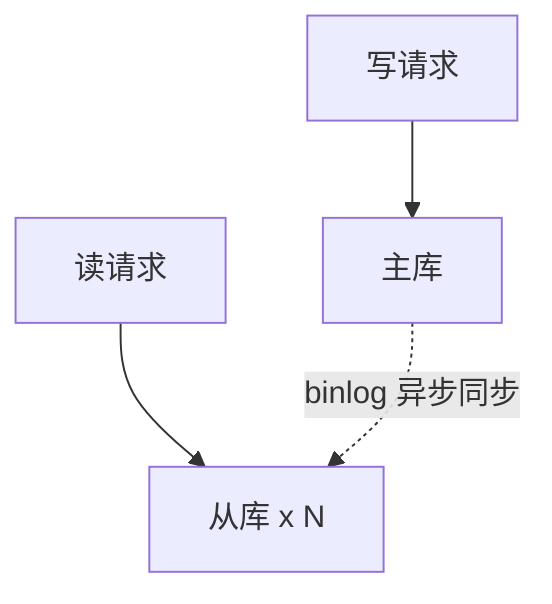

# 阶段三 · 小点 2：高可用、分库分表与 PostgreSQL

> 所属：阶段三 数据持久化与中间件
> 定位：单机数据库撑不住之后的所有演进路径。核心不是背 ShardingSphere 配置，而是建立「数据规模 → 演进动作」的决策树——知道什么阶段该做什么、什么动作是过度设计。

## 快速入门

> 本节为「数据库演进速览」：先认识单机撑不住后有哪些出路；「决策树怎么选、ShardingSphere 怎么配」留在正文提高部分。

### 本讲核心关键词速查

| 关键词 | 一句话大白话 | 例子 |
|-|-|-|
| 主从复制 | 主库写、从库读（数据副本） | 读多写少时用 |
| 读写分离 | 写走主库、读走从库 | 分担读压力 |
| 主从延迟 | 从库落后于主库的秒数 | 写完读不到 |
| 分库分表 | 把大表拆到多个库/表 | 单表太大时用 |
| 分片键 | 决定数据落在哪个分片的列 | `user_id` |
| ShardingSphere | 分库分表中间件 | 客户端/代理两种形态 |
| GTID | 全局事务ID（主从复制定位） | 断点续传自动 |
| 冷热分离 | 历史数据归档 | 老订单移走 |

### 本讲在解决什么问题

- **问题**：单库扛不住数据量/写入后，怎么演进？不是一上来就拆分，而是有**决策树**：先索引/慢查询治理 → 冷热分离 → 读写分离 → 才到分库分表。
- **你要带走的一句话**：**分库分表是最后手段**——它把「事务、join、全局ID」都打碎了。先确认慢的根因不是索引、冷热分离也解决不了，才做。什么量级做什么动作，这是决策树。

### 最简示例（分片键概念示意，完整配置见正文 3.2）

```yaml
# ShardingSphere-JDBC 分片键位置示意 —— 快速入门只看"分片键放哪、怎么路由", 完整字段见正文 3.2
spring:
  shardingsphere:
    rules:
      sharding:
        tables:
          order:
            actual-data-nodes: ds_${0..3}.order_${0..7}   # 4 库 × 8 表
            # 分片键在 database-strategy/table-strategy 下面的 sharding-column 里
            # 而不是在 tables 平级 —— 这才是真实配置结构
            database-strategy:
              standard:
                sharding-column: user_id     # 分库键: 按 user_id % 4 决定去哪个库
                sharding-algorithm-name: order-db-inline
            table-strategy:
              standard:
                sharding-column: user_id     # 分表键: 按 user_id % 8 决定进哪张表
                sharding-algorithm-name: order-table-inline
```

> 代码备注（逐行解释）：
> - `actual-data-nodes: ds_${0..3}.order_${0..7}`：声明真实拓扑（4 个库各 8 张表）。
> - **分片键在 `database-strategy` / `table-strategy` 下的 `sharding-column`**，不在 `tables` 平级——快速入门这里是简化位置说明，真实层级见正文 3.2 完整配置。
> - 分库/分表算法用取模：`user_id % 4` 决定去哪个库，`user_id % 8` 决定进哪张表。
> - 带分片键（user_id）的查询能精准定位到**一个分片**；不带分片键的查询只能「广播」到全部分片——所以分片键选择很关键。

### 关键概念说明

| 概念 | 干什么 | 最易踩的坑 |
|-|-|-|
| 主从复制 | 主写从读 + 高可用 | 有延迟；半同步更安全但略有性能损耗 |
| 读写分离 | 分担读压力 | 「写完读不到」要用强制读主/主键查主 |
| 分片键 | 决定数据落哪个分片 | **选最常查询的维度**；选错 = 大量广播查询 |
| 跨分片查询 | 不带分片键 = 广播 | 深分页地震化；后台查询走 ES/汇总表 |
| 公共表（广播表） | 全库副本 | 只放字典/配置类只读小表 |
| 分片数 | 起步留够 | 扩容 = 挪分片，重算模 = 全量迁移 |

### 常用约定 / 命名提示

- **演进顺序**：索引优化 → 冷热分离 → 读写分离 → 分库分表 → ES。跳级 = 过度设计（阶段六反模式）。
- **分片键选对**：C 端订单按 `user_id`、商家后台按 `shop_id`——按最高频查询维度选。
- **分片数一次定够**：线上扩分片 = 全量迁移；宁滥勿缺，扩容靠「挪分片」而非「重算模」。
- **跨分片是代价**：无法 join、无法单库事务、全局 ID 要自己生成（雪花算法）。

## 精简大纲

1. 主从复制：异步 / 半同步 / GTID
2. 读写分离与它的延迟问题
3. 分库分表：ShardingSphere 完整落地（配置 / 分片键 / 公共表 / 分页 / 扩分片）
4. PostgreSQL 特色：JSONB / 窗口函数 / MVCC 差异
5. 数据规模演进决策树

## 学习内容详情

### 1. 主从复制

#### 1.1 复制在做什么


- **binlog**（**Binary Log**：MySQL 的逻辑变更日志——记「什么语句改了什么数据」而非数据本身）：复制与数据订阅（Canal，第 6 讲）的共同数据源。
- **主从复制**（把主库的 binlog 拉到从库重放，实现数据副本）：解决的是**读扩展 + 高可用**（主库挂了从库顶上），不解决写扩展。

#### 1.2 配置与查看（真机操作）

```ini
# 主库 my.cnf —— GTID 模式（强烈建议，理由见下）
[mysqld]
server_id     = 1                    # 复制拓扑内唯一，重复会导致复制错乱
gtid_mode     = ON                   # 用 GTID 而不是「文件名+位点」定位复制位置
enforce_gtid_consistency = ON        # 保证事务与 GTID 一一对应
log_bin       = mysql-bin            # 开 binlog（8.0 默认开）
```

```sql
-- 从库上建立复制通道（MySQL 8.0.23+ 语法，旧版用 CHANGE MASTER TO）
CHANGE REPLICATION SOURCE TO
    SOURCE_HOST     = '10.0.0.11',
    SOURCE_USER     = 'repl',
    SOURCE_PASSWORD = '***',
    SOURCE_AUTO_POSITION = 1;        -- GTID 自动定位：从库按「自己缺的事务」拉，不用手工对位点
START REPLICA;

-- 巡检必看：双 Yes 才健康；Seconds_Behind_Source 就是「主从延迟秒数」
SHOW REPLICA STATUS\G
-- Replica_IO_Running: Yes
-- Replica_SQL_Running: Yes
-- Seconds_Behind_Source: 0     -- 持续增大 = 从库追不上（大事务 / 从库负载高 / 网络抖动）
```

#### 1.3 异步 / 半同步与 GTID

| 模式 | 机制 | 丢数据风险 |
|-|-|-|
| 异步（默认） | 主库提交即返回，不等从库 | 主库宕机时未传出的 binlog 丢失 |
| **半同步**（`rpl_semi_sync_master_wait_for_slave_count ≥ 1`） | 至少 1 个从库确认收到才返回 | 大幅降低，性能小损 |
| 组复制 / MGR | 多数派共识强一致 | 接近不丢，复杂度高 |

- **GTID**（**Global Transaction Identifier**：每个事务的全局唯一 ID `server_uuid:seq_no`）：替代「binlog 文件名 + 位点」定位复制位置——主从切换 / 断点续传从「运维灾难」变成自动定位。新集群无脑开。
- **降半同步**的典型事故：主库刚返回提交成功、binlog 还没到从库，主库宕机 → 切到从库 → 那笔事务消失。金融场景半同步起步。

### 2. 读写分离与延迟问题



- **读写分离**：写走主库、读走从库——让从库分摊读压力（绝大多数业务读写比 10:1 以上）。
- **延迟问题**（读写分离的头号坑）：写主库后立刻读从库，从库还没重放完 → 「我刚下的订单呢？」。

```java
// 对策落地示意（MyBatis-Plus 多数据源场景，伪代码展示思路）
// 对策一：写后短窗口强制读主库
@Service
public class OrderService {
    public Order create(CreateOrderDto dto) {
        Order order = repo.save(dto);
        dynamicDataSource.forceMaster();           // 标记：本请求内读走主库
        try { return order; }
        finally { dynamicDataSource.clear(); }     // ThreadLocal 标记必须清理，否则污染线程池里的下一个请求
    }
    // 对策二（更常用）：写后跳转的页面只读「刚写入的主键数据」→ 主键查询走主库
    // 对策三：前端「提交成功页」不立刻回查详情，给 200ms 级的宽容（产品层解法）
}
```

### 3. 分库分表

> 本讲的配置细节留到项目实战阶段再落地；主线先吃透决策树——什么量级做什么动作。

#### 3.1 什么时候才轮到它

> **分库分表是最后手段**：它把「一个数据库的事务、join、全局唯一 ID」全部打碎。先确认慢的根因不是索引 / 慢 SQL（第 1 讲），再确认冷热分离（历史订单归档）解决不了，才走这一步。

#### 3.2 分片键：最重要的一个决策

- **分片键**（**Sharding Key**：决定一条数据落在哪个分片的列，如 `user_id`）：选错 = 大量查询退化为「广播全分片」。
- 选法：**查询最高频的维度**——C 端订单几乎都按用户查，选 `user_id`；商家后台按店铺查，选 `shop_id`（或做两套冗余）。

```yaml
# ShardingSphere-JDBC（客户端分片：增强版 JDBC 驱动，无独立代理层）
# application.yml —— 按 user_id 哈希分 4 库 × 8 表，共 32 片
spring:
  shardingsphere:
    # ① 数据源：每个分片库一个 DataSource，全部配齐（ds_0..ds_3）
    datasource:
      names: ds_0,ds_1,ds_2,ds_3
      ds_0:
        type: com.zaxxer.hikari.HikariDataSource
        driver-class-name: com.mysql.cj.jdbc.Driver
        url: jdbc:mysql://10.0.0.11:3306/order_db_0
        username: order_app
        password: ${DB_PASSWORD_0}          # 密钥进环境变量（阶段二红线），不写死
      ds_1: { url: jdbc:mysql://10.0.0.12:3306/order_db_1, username: order_app, password: ${DB_PASSWORD_1} }
      ds_2: { url: jdbc:mysql://10.0.0.13:3306/order_db_2, username: order_app, password: ${DB_PASSWORD_2} }
      ds_3: { url: jdbc:mysql://10.0.0.14:3306/order_db_3, username: order_app, password: ${DB_PASSWORD_3} }
    rules:
      sharding:
        sharding-algorithms:
          order-db-inline:                       # 分库算法
            type: INLINE
            props:
              algorithm-expression: ds_${user_id % 4}      # 库 = 用户ID 取模 4
          order-table-inline:                    # 分表算法
            type: INLINE
            props:
              algorithm-expression: order_${user_id % 8}   # 表 = 用户ID 取模 8
        tables:
          order:
            actual-data-nodes: ds_${0..3}.order_${0..7}    # 真实拓扑：4 库各 8 表
            database-strategy:
              standard:
                sharding-column: user_id
                sharding-algorithm-name: order-db-inline
            table-strategy:
              standard:
                sharding-column: user_id
                sharding-algorithm-name: order-table-inline
            # ② 分片主键：用 Snowflake 生成，跨分片不撞（阶段四第 3 讲）
            key-generate-strategy:
              column: id
              key-generator-name: snowflake
        # ③ 公共表（广播表）：字典/配置/省市区这些「全库都要且只读小表」——
        #    每个分片都存一份完整副本，join 它不需要广播查询，也不拆
        broadcast-tables: [sys_dict, sys_config]   # 注意：只放「读多写极少」的全局只读表
        key-generators:
          snowflake:
            type: SNOWFLAKE
            props:
              worker-id: ${SHARDING_WORKER_ID}    # 每个实例唯一，避免同 ID 冲突
```

> **分片主键别用自增**：跨库自增 ID 必撞；Snowflake / 号段（Leaf）都能生成全局唯一 ID，ShardingSphere 把 `SNOWFLAKE` 算法内置了——`worker-id` 按实例唯一配置，是"多实例不撞 ID"的关键。

```java
// 客户端分片的体感：带分片键的 SQL 只打一个分片，不带则广播
orderMapper.selectList(                             // MyBatis-Plus 条件构造器
    new LambdaQueryWrapper<Order>()
        .eq(Order::getUserId, 10086L));             // ✅ 精准路由：ds_2.order_6，1 次查询

orderMapper.selectList(
    new LambdaQueryWrapper<Order>()
        .eq(Order::getStatus, 1));                  // ❌ 广播：32 个分片全查再归并
// 商家后台「按状态统计」这类查询 → 走 ES 或独立汇总表，别硬扫分片库
```

#### 3.3 跨分片的三个代价

1. **跨分片查询**：不带分片键 = 广播 + 内存归并（分页 `LIMIT 100000, 10` 会地狱化——每个分片都要取前 100010 行）。
2. **分布式主键**：分片间自增 ID 必撞——换雪花算法 / 号段模式（阶段四第 3 讲）。
3. **跨分片事务**：本地事务失效——走 Seata / 本地消息表（阶段四第 2 讲）。
- **ShardingSphere 两种形态**：JDBC（客户端，无网络多跳、性能好）vs Proxy（独立代理层，多语言友好但多一跳）——Java 单技术栈优先 JDBC。

#### 3.4 分片算法的选型对比

| 算法 | 原理 | 优点 | 坑 |
|-|-|-|-|
| **INLINE（内联表达式，常用作取模）** | 分片键 % 分片数（表达式写法） | 简单、路由精准、好排查 | `%` 只能均匀；分片数一变全量重排——**要么提前预留逻辑分片（如 0-1023）用大基数取模，要么换一致性哈希（见 3.6 扩容）** |
| **HASH_MOD（哈希取模）** | 先 hash 再取模 | 分布更均匀（尤其分片键本身有规律时） | 同样受分片数约束；**注意：不是一致性哈希**（一致性哈希见 3.6 扩容） |
| **RANGE（按范围）** | 按时间/数值区间分片（如 `created_at` 按月） | 扩容 = 加新区间即可，**老数据不用动**——适合时序类订单日志 | 热区在最新区间（当前月数据集中打进一个分片），可能逆成单点热点 |
| **BOUNDARY / COMPLEX** | 自定义边界 | 灵活 | 配置复杂、难维护 |

> 实际选法一句话：**C 端按用户维度查为主 → 取模（INLINE）；时序/日志类增量明显 → 范围（RANGE）**。多数业务订单选取模即可，但要想清楚「分片数一次定够」。

#### 3.5 分片后「分页难题」的缓解

跨分片分页是分库分表最痛的日常——每个分片取前 N 条再归并，`LIMIT 100000, 10` 直接拖垮所有分片。三个常规缓解（从轻到重）：

1. **浅分页无限翻**：业务上干脆不做超深分页——列表最多给到前 20 页，「加载更多」改游标式（`WHERE create_time < 上一页最后一条`），每个分片只取极少行，天然规避深 offset。
2. **深分页用「延迟关联」**：先只查 id 集（`SELECT id ... LIMIT 100000,10` 只取主键，避开回表大字段），再按 id 回表拿全行——字段少、归并轻。
3. **后台/报表类深分页**：别硬扫分片库——导到 ES 或独立汇总表（阶段六第 1 讲已示意）。

```java
// 游标式分页示意：只传「上一页最后一条的 create_time + id」，无深 offset
List<Order> nextPage(Long userId, LocalDateTime lastTime, Long lastId, int size) {
    return orderMapper.selectList(new LambdaQueryWrapper<Order>()
        .eq(Order::getUserId, userId)
        .and(w -> w.lt(Order::getCreateTime, lastTime)
                   .or(x -> x.eq(Order::getCreateTime, lastTime).lt(Order::getId, lastId)))
        .orderByDesc(Order::getCreateTime)
        .last("LIMIT " + size));                     // 每分片只取 size 行，归并轻
}
```

#### 3.6 平滑扩容：分片数不够了怎么办

> 分片数起步时「宁滥勿缺」（坑点已提），但真到要扩容时，**不是重新取模**——`user_id % 16` 换成 `% 32` 会让所有老数据落在错分片，等于全量迁移。
> 
> 平滑扩的三种路子，按成本从低到高：

| 方案 | 做法 | 代价 |
|-|-|-|
| **提前预留 + 虚分片**（推荐） | 一开始就用 64/128 个「逻辑分片」映射到少量物理库，扩容只需把逻辑分片挪到新物理库，数据不动 | 设计期多一点成本，扩容时最省 |
| **一致性哈希环** | 分片键 hash 落到环上，扩容只迁移环上极小一段 | 路由复杂，需要一致性哈希算法支持 |
| **双写过渡 + 全量迁移**（下策） | 老库只读、新分片全量同步，写完后再切流量 | 工程量最大，且要停机/灰度窗口 |

> 一句话：**分片数 「一次定够」，扩容思路是「挪分片」而不是「重算模」**——这才是分库分表长期不翻车的核心。这也是为什么第 3.2 节要求起步就留够分片数。

### 4. PostgreSQL 特色

```sql
-- ① JSONB：二进制 JSON 列 —— 半结构化数据免建宽表（表单字段灵活多变的场景）
--   对比 MySQL 的 JSON 类型：PG 的 JSONB 建 GIN 索引后可按内部字段高效查询
CREATE TABLE event_log (
    id     BIGSERIAL PRIMARY KEY,
    data   JSONB NOT NULL            -- JSONB = 已解析的二进制 JSON，可索引可查询
);
CREATE INDEX idx_event_data ON event_log USING GIN (data);   -- GIN: 倒排式索引，支持包含查询

SELECT * FROM event_log
WHERE data @> '{"event": "page_view"}'::jsonb;   -- @> 包含操作符：走 GIN 索引
-- 也有 ->> 取文本、-> 取 JSON 的运算符（data->>'user_id'）

-- ② 窗口函数：分组内排名 / 取每组最新 —— MySQL 8 也有，PG 实现更完整
--    场景：每个用户最近的一笔订单（前端做这个要用 reduce + Map，SQL 一行）
SELECT * FROM (
    SELECT o.*,
           ROW_NUMBER() OVER (PARTITION BY user_id        -- 按 user_id 分组
                              ORDER BY created_at DESC) rn -- 组内按时间倒序编号
    FROM "order" o
) t WHERE rn = 1;
```

- **MVCC 实现差异**（第 1 讲的延伸）：InnoDB 用 undo log 版本链（旧版本在回滚段）；**PG 无回滚段**——旧版本元组直接留在堆表里，靠 `VACUUM` 后台清理。代价：长事务会阻止 VACUUM，导致表膨胀（dead tuples 堆积）——PG 运维的头号课。

### 5. 数据规模演进决策树

```text
单表 < 1000w 行 / 查询健康   →  索引优化 + 慢查询治理（第 1 讲），到此为止
单表 1000w+ / 慢查询多       →  覆盖索引 / 冷热分离（历史订单归档表）
读多写少                      →  主从复制 + 读写分离 + 缓存（第 4 讲）
写瓶颈 / 单表 5000w+          →  分库分表（本讲 ShardingSphere）
复杂搜索 / 多维聚合            →  同步到 ES（第 6 讲），DB 只做 OLTP
```

> 心法：**每一层的动作都对应一个真实测到的瓶颈**，跳级 = 过度设计（阶段六反模式）。
>
> 顺带一句：**窗口函数与 CTE 是 MySQL 8.0 的新武器**——深分页（延迟关联）与「组内最新一条」这类经典难题优先用它们解，别急着上更重的架构。

### 6. 坑点提醒

- **半同步退化**：从库超时后半同步自动降级回异步——你以为的「不丢」只是「通常不丢」，降级要告警。
- **Seconds_Behind_Source = 0 ≠ 无延迟**：它只反映 SQL 线程的瞬时视角，大事务期间会「假性归零」；精确判断要比对 GTID 位点（`gtid_executed`）。
- **分片数一开始就要留够**：线上扩分片 = 全量数据迁移，代价极大；宁滥勿缺（如直接 32 分片起步）。
- **不带分片键的后台查询**直接打穿分片库——后台 / 报表类查询走只读从库或 ES，别和交易流量抢主库。
- **PG 长事务**：`SELECT; 睡 10 分钟; COMMIT` 会挡住 VACUUM 清理——连接池的 `idle_in_transaction_session_timeout` 要设上限。

## 本节自检

- [ ] 订单表 5000 万行、日增 100w，你的演进路线是什么？（按决策树给完整序列）
- [ ] 能说清异步 / 半同步的差异，以及读写分离后「写完读不到」的三种对策
- [ ] 能解释分片键怎么选、选错的后果，以及跨分片查询为什么要广播
- [ ] 能说出 PG 与 MySQL 在 MVCC 实现上的根本差异（无回滚段 + VACUUM）
- [ ] 能写出一个「数据源 + 分片规则 + 公共表 + Snowflake 主键」的 ShardingSphere 完整配置骨架
- [ ] 能解释分库分表后「深分页」为什么地狱化，并说出游标式 / 延迟关联的解法
- [ ] 能说清分片数是否可随便改，以及平滑扩容为什么是「挪分片」而非「重算模」

## 本节配套思考题

1. 主从延迟 30 秒且持续恶化，你的排查顺序是什么？（提示：从库负载 → 大事务 → 并行复制 `replica_parallel_workers` → 网络带宽）
2. `user_id % 4` 分库后，某大主播的单店铺查询要「按 shop_id 维度」怎么办？双写冗余分片 vs ES，各自的代价？
3. 为什么 GTID 模式下主从切换比「文件名 + 位点」模式简单得多？切换时从库怎么知道该从哪续传？
4. 用 `user_id % 4` 起步后想扩到 8 库：直接改 `% 8` 会发生什么？为什么「虚分片 + 逻辑分片映射」能让你规避这次全量迁移？
5. 「按状态统计」这类后台查询在分片库上跑，为什么不能直接 `GROUP BY status`？广播表为什么能 join 而不广播？
