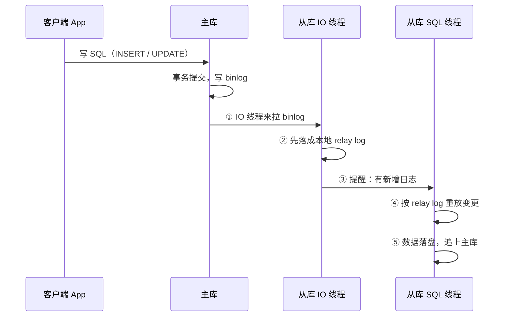
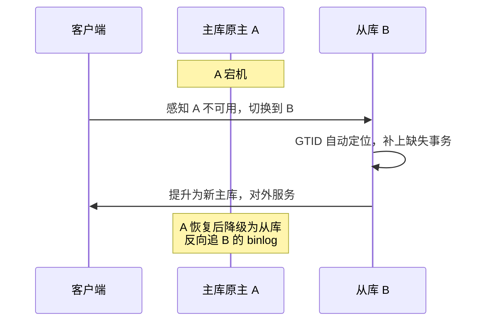
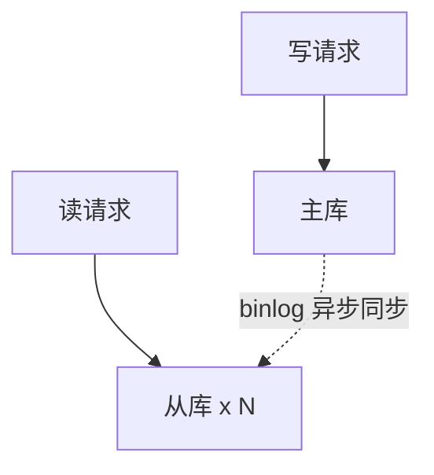
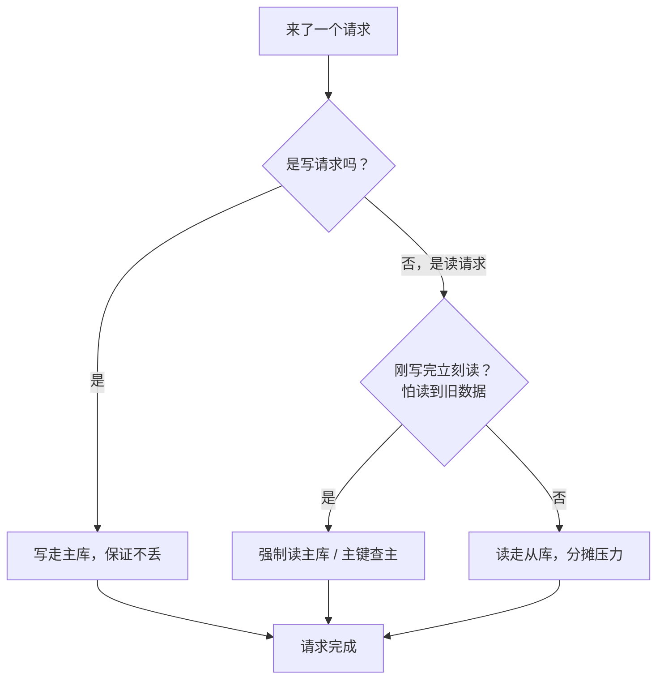
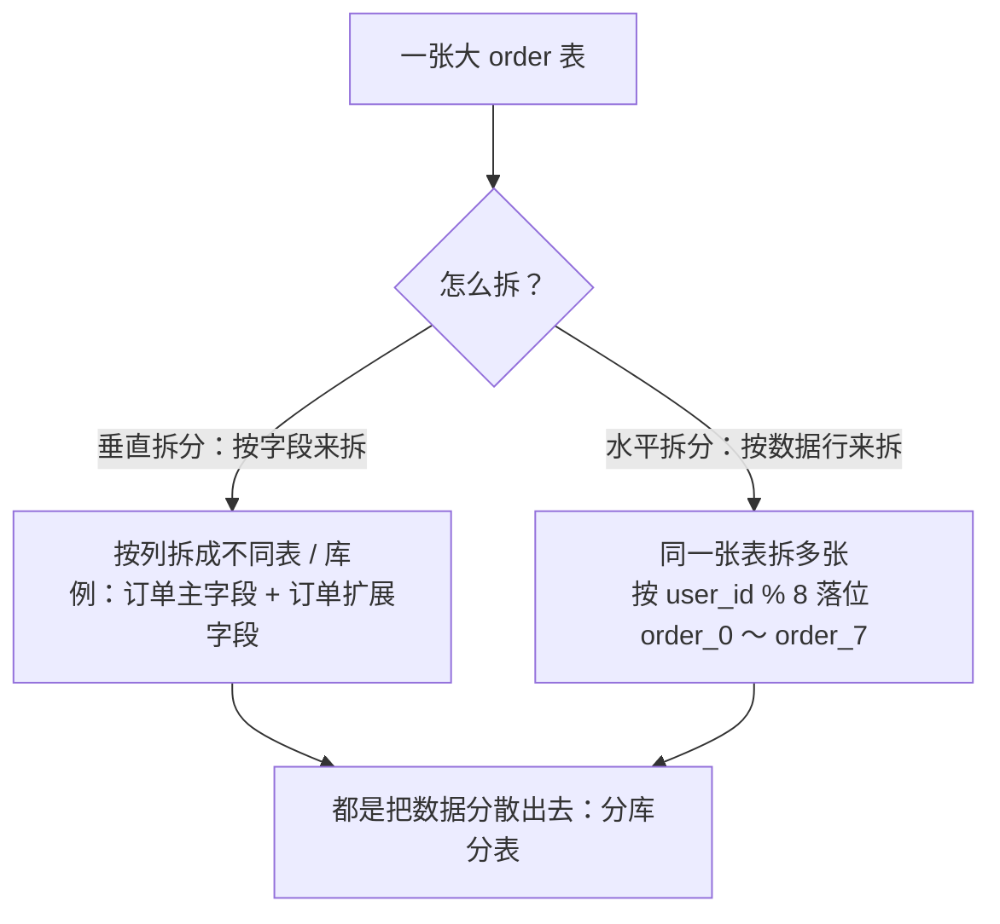
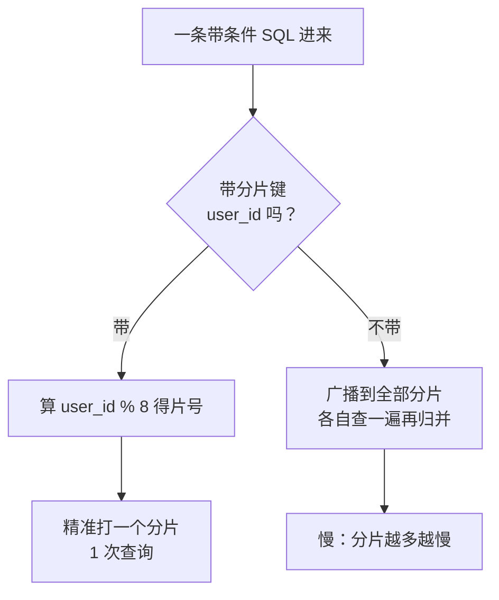

# 阶段三 · 小点 2：高可用、分库分表与 PostgreSQL

> 所属：阶段三 数据持久化与中间件
> 定位：单机数据库撑不住之后的所有演进路径。核心不是背 ShardingSphere 配置，而是建立「数据规模 → 演进动作」的决策树——知道什么阶段该做什么、什么动作是过度设计。

## 快速入门

> 本节为「数据库演进速览」：先认识单机撑不住后有哪些出路；「决策树怎么选、ShardingSphere 怎么配」留在正文提高部分。

### 本讲核心关键词速查

| 关键词 | 一句话大白话 | 本讲关注点 |
|-|-|-|
| 主从复制 | 主库写、从库复制出数据副本 | 支撑读扩展与故障切换，但存在延迟 |
| binlog | MySQL 记录数据变更的逻辑日志 | 复制、恢复、Canal 订阅都依赖它 |
| relay log | 从库暂存主库 binlog 的中继日志 | 从库先拉取、再重放，复制中断后可续追 |
| 读写分离 | 写走主库、读走从库 | 分担读压力；写后立刻读要强制读主 |
| 主从延迟 | 从库落后于主库的时间 | 典型现象是「写完读不到」 |
| 分库分表 | 把大表拆到多个库/表 | 最后手段，会打碎事务、join、全局 ID |
| 分片键 | 决定数据落在哪个分片的列 | 选最高频查询维度；选错会广播查询 |
| ShardingSphere | Java 常用分库分表中间件 | JDBC 性能好，Proxy 多语言友好但多一跳 |
| GTID | 每个事务的全局唯一编号 | 简化断点续传与主从切换 |
| 冷热分离 | 把历史数据归档到低频存储 | 分库分表前优先尝试 |

### 本讲在解决什么问题

- **问题**：单库扛不住数据量/写入后，怎么演进？不是一上来就拆分，而是有**决策树**：先索引/慢查询治理 → 冷热分离 → 读写分离 → 才到分库分表。
- **你要带走的一句话**：**分库分表是最后手段**——它把「事务、join、全局ID」都打碎了。先确认慢的根因不是索引、冷热分离也解决不了，才做。什么量级做什么动作，这是决策树。

### 最简示例（分片键概念示意，完整配置见正文 3.2）

```yaml
# ShardingSphere-JDBC 分片键位置示意 —— 快速入门只看"分片键放哪、怎么路由", 完整字段见正文 3.2
spring:
  shardingsphere:
    rules:
      sharding:
        tables:
          order:
            actual-data-nodes: ds_${0..3}.order_${0..7}   # 4 库 × 8 表
            # 分片键在 database-strategy/table-strategy 下面的 sharding-column 里
            # 而不是在 tables 平级 —— 这才是真实配置结构
            database-strategy:
              standard:
                sharding-column: user_id     # 分库键: 按 user_id % 4 决定去哪个库
                sharding-algorithm-name: order-db-inline
            table-strategy:
              standard:
                sharding-column: user_id     # 分表键: 按 user_id % 8 决定进哪张表
                sharding-algorithm-name: order-table-inline
```

> 代码备注（逐行解释）：
> - `actual-data-nodes: ds_${0..3}.order_${0..7}`：声明真实拓扑（4 个库各 8 张表）。
> - **分片键在 `database-strategy` / `table-strategy` 下的 `sharding-column`**，不在 `tables` 平级——快速入门这里是简化位置说明，真实层级见正文 3.2 完整配置。
> - 分库/分表算法用取模：`user_id % 4` 决定去哪个库，`user_id % 8` 决定进哪张表。
> - 带分片键（user_id）的查询能精准定位到**一个分片**；不带分片键的查询只能「广播」到全部分片——所以分片键选择很关键。

### 常用约定 / 命名提示

- 先看复制与读写分离，再看分库分表；不要跳过单库优化直接拆库。
- 分片相关内容按「什么时候拆 → 按什么拆 → 拆完损失什么 → 怎么扩容」理解。
- PostgreSQL 小节是横向补充；主线仍是 MySQL 高可用与分片演进。

## 精简大纲

1. 主从复制：binlog / relay log / GTID / 故障切换
2. 读写分离：延迟问题与业务场景
3. 分库分表：触发条件 / 分片键 / ShardingSphere / 分页 / 扩分片
4. PostgreSQL 横向补充：JSONB / 窗口函数 / MVCC 差异
5. 数据规模演进决策树

## 学习内容详情

### 1. 主从复制

#### 1.1 先把日志概念讲清楚

主从复制不是「从库直接读主库的数据文件」，而是围绕两类日志工作：

- **binlog**（Binary Log，二进制日志）：MySQL 主库记录数据变更的逻辑日志。它记录的是「这次事务改了什么」，用于主从复制、按时间点恢复、Canal 这类数据订阅。
- **relay log**（中继日志）：从库把主库的 binlog 拉到本地后先写成 relay log，再由 SQL 线程按顺序重放。这样「拉日志」和「执行变更」可以分开，复制中断后也能从本地日志继续追。
- **GTID**（Global Transaction Identifier，全局事务 ID）：给每个已提交事务一个全局编号。启用 GTID 后，从库不用手工指定 binlog 文件名和位点，只要告诉主库「我已经有哪些事务」，主库就能补发缺失事务。

一句话：**主库写 binlog，从库拉成 relay log，再重放成自己的数据；GTID 负责让断点续传和故障切换更稳。**

#### 1.2 复制在做什么


> 类比（生活版 → 技术）：主从复制就像「校对翻印」—编辑部把改好的稿子手动誊一份寄给分印厂，分印厂先收包、后按包印刷。换成数据库：**主编 = 主库**（写 binlog），**分印厂仓库 = 从库的 relay log**（先落一份临时日志），**印刷工人 = SQL 线程**（按日志重放成真实数据）。主库一写、从库照抄，得到副本。



- **主从复制**（Primary-Replica Replication，MySQL 8.0 起官方文档把 master/slave 改称 primary/replica）：把主库的 binlog 拉到从库重放，实现数据副本。解决的是**读扩展 + 故障切换基础**，不解决写扩展。

#### 1.3 配置与查看（真机操作）

```ini
# 主库 my.cnf —— GTID 模式（强烈建议，理由见下）
[mysqld]
server_id     = 1                    # 复制拓扑内唯一，重复会导致复制错乱
gtid_mode     = ON                   # 用 GTID 而不是「文件名+位点」定位复制位置
enforce_gtid_consistency = ON        # 保证事务与 GTID 一一对应
log_bin       = mysql-bin            # 开 binlog（8.0 默认开）
```

```sql
-- 从库上建立复制通道（MySQL 8.0.23+ 语法，旧版用 CHANGE MASTER TO）
CHANGE REPLICATION SOURCE TO
    SOURCE_HOST     = '10.0.0.11',
    SOURCE_USER     = 'repl',
    SOURCE_PASSWORD = '***',
    SOURCE_AUTO_POSITION = 1;        -- GTID 自动定位：从库按「自己缺的事务」拉，不用手工对位点
START REPLICA;

-- 巡检必看：双 Yes 才健康；Seconds_Behind_Source 就是「主从延迟秒数」
SHOW REPLICA STATUS\G
-- Replica_IO_Running: Yes
-- Replica_SQL_Running: Yes
-- Seconds_Behind_Source: 0     -- 持续增大 = 从库追不上（大事务 / 从库负载高 / 网络抖动）
```

#### 1.4 异步 / 半同步与主库故障

| 模式 | 机制 | 丢数据风险 |
|-|-|-|
| 异步（默认） | 主库提交即返回，不等从库 | 主库宕机时未传出的 binlog 丢失 |
| **半同步**（**Semi-Synchronous Replication**，`rpl_semi_sync_master_wait_for_slave_count ≥ 1`） | 至少 1 个从库确认收到才返回 | 大幅降低，性能小损 |
| 组复制 / MGR | 多数派共识强一致 | 接近不丢，复杂度高 |

> 类比（生活版 → 技术）：叫外卖，异步 = 商家「出餐即报成功」，路上有没有丢你不知道；半同步 = 至少一个骑手「扫码确认取到货」商家才算完成。换成数据库：**异步复制**就是主库写完 binlog 就说「提交成功」；**半同步**要等至少 1 个从库回执「我收到了」才向客户端报告成功。



主库挂了以后，标准动作是：健康检查确认主库不可用 → 选择延迟最小、日志最完整的从库 → 提升为新主库 → 应用或代理切换写流量 → 原主恢复后降级为从库，反向追新主的 binlog。主从复制只提供数据副本，**自动切换还需要 MHA、Orchestrator、ProxySQL、Keepalived、云数据库 HA 或自研控制面**。

数据会不会丢，取决于故障发生时 binlog 到了哪里：

| 场景 | 结果 |
|-|-|
| 异步复制，主库返回成功后 binlog 还没传到从库 | 主库宕机后可能丢最后一小段已返回成功的数据 |
| 半同步复制，至少一个从库确认收到 binlog 后主库才返回 | 丢失风险大幅降低，但有性能损耗 |
| 半同步从库超时，自动退化成异步 | 风险回到异步复制，必须告警 |

GTID 的价值就在故障切换阶段：从库提升或原主恢复时，可以按事务编号自动判断「还缺哪些事务」，不用人工对齐 binlog 文件名和位点。新集群建议默认开启。

### 2. 读写分离与延迟问题





- **读写分离**（**Read-Write Splitting**）：写走主库、读走从库——让从库分摊读压力（绝大多数业务读写比 10:1 以上）。
- **延迟问题**（读写分离的头号坑）：写主库后立刻读从库，从库还没重放完 → 「我刚下的订单呢？」。

读写分离不是「所有 SELECT 都走从库」，要按业务一致性要求分流：

| 场景 | 建议路由 | 原因 |
|-|-|-|
| 下单后立刻进入订单详情 | 读主库 / 主键查主 | 用户刚写入的数据必须马上可见 |
| 商品列表、首页推荐、公开内容 | 读从库 | 短暂延迟通常可接受 |
| 后台统计、报表导出 | 读从库 / 汇总表 / ES | 不和交易写流量抢主库资源 |

> 类比（生活版 → 技术）：编辑签字「本期定稿」后，校对才开誊第二版，前台已写着「新一期上线」，早来的读者看到的还是旧稿。换成数据库：**主库 = 编辑部**（已提交），**从库 = 校对誊写版**（还在追），中间隔的时间就是**主从延迟**——写主库后立刻读从库，读到旧数据就这么来的。

```java
// 对策落地示意（MyBatis-Plus 多数据源场景，伪代码展示思路）
// 对策一：写后短窗口强制读主库
@Service
public class OrderService {
    public Order create(CreateOrderDto dto) {
        Order order = repo.save(dto);
        dynamicDataSource.forceMaster();           // 标记：本请求内读走主库
        try { return order; }
        finally { dynamicDataSource.clear(); }     // ThreadLocal 标记必须清理，否则污染线程池里的下一个请求
    }
    // 对策二（更常用）：写后跳转的页面只读「刚写入的主键数据」→ 主键查询走主库
    // 对策三：前端「提交成功页」不立刻回查详情，给 200ms 级的宽容（产品层解法）
}
```

#### 2.1 主库写压力大怎么办

读写分离只能把读请求分给从库，**写请求仍然只能进主库**。主库写压力大时，不是先加从库，而是按下面顺序处理：

| 动作 | 解决什么 | 适用场景 |
|-|-|-|
| 优化写 SQL / 索引 | 降低单次写入成本 | 慢写入、索引过多、锁等待明显 |
| 批量写 / 合并写 | 减少提交次数 | 日志、埋点、库存流水等高频小写入 |
| 异步化 / 削峰 | 把瞬时写流量摊平 | 秒杀、活动、消息通知 |
| 垂直拆库 | 拆掉不同业务的写竞争 | 用户、订单、库存互相抢连接和 IO |
| 水平分库分表 | 真正扩展写容量 | 单业务单表写入和数据量都到瓶颈 |

多主写入不是常规解法。双主 / 多主会引入冲突检测、自增 ID、数据一致性和故障切换问题，通常只用于特定高可用或多地域场景，不作为普通业务的写扩展起点。

### 3. 分库分表

> 本讲的配置细节留到项目实战阶段再落地；主线先吃透决策树——什么量级做什么动作。

#### 3.1 什么时候才轮到它

> **分库分表是最后手段**：它把「一个数据库的事务、join、全局唯一 ID」全部打碎。先确认慢的根因不是索引 / 慢 SQL（第 1 讲），再确认冷热分离（历史订单归档）解决不了，才走这一步。

单库撑不住通常不是突然发生，而是这条链路逐步恶化：

```text
数据量变大
→ 索引变大，缓存命中下降
→ B+ 树层级、页分裂、磁盘 IO 增加
→ 慢查询、锁等待、连接堆积变多
→ 单库 CPU / IO / 连接数成为瓶颈
```

因此先做低成本动作：补索引、改慢 SQL、冷热分离、读写分离、异步削峰。只有这些仍解决不了单表体量或单主写瓶颈，才进入分库分表。

先把「拆」看清——「分库分表」四个字其实是**两个维度的两件事**：



本讲主线走的是**水平拆分**（按数据行拆）——读多写少、单表行数爆掉时，像切西瓜一样切平铺开。

#### 3.2 分片键：最重要的一个决策

- **分片键**（**Sharding Key**：决定一条数据落在哪个分片的列，如 `user_id`）：选错 = 大量查询退化为「广播全分片」。
- 选法：**查询最高频的维度**——C 端订单几乎都按用户查，选 `user_id`；商家后台按店铺查，选 `shop_id`（或做两套冗余）。

选分片键先看查询入口：

| 业务入口 | 高频查询条件 | 更合适的分片键 | 选错后的结果 |
|-|-|-|-|
| C 端用户查自己的订单 | `user_id` | `user_id` | 用户订单查询可精准路由 |
| 商家后台查店铺订单 | `shop_id` | `shop_id` | 如果只按 `user_id` 分片，店铺查询会广播全部分片 |
| 平台后台按状态统计 | `status`、时间范围 | 不适合直接做交易库分片键 | 走 ES、汇总表或离线报表 |

同一份订单同时服务 C 端和商家后台时，不能指望一个分片键覆盖所有查询；常见做法是冗余一份按 `shop_id` 组织的数据，或把后台多维查询交给 ES / 汇总表。

> 类比（生活版 → 技术）：快递分拣中心按「目的地城市首字」分滑槽——快递单写清城市就能直接投对槽；单子不写城市，只能广播喊人认领。换成数据库，**分片键 = 快递单上的「城市」栏**：SQL 带 `user_id` 直接命中一个分片；不带只能广播到全部分片再归并——这就是分片键选错（没人按它查）的真实代价。



```yaml
# ShardingSphere-JDBC（客户端分片：增强版 JDBC 驱动，无独立代理层）
# application.yml —— 按 user_id 哈希分 4 库 × 8 表，共 32 片
spring:
  shardingsphere:
    # ① 数据源：每个分片库一个 DataSource，全部配齐（ds_0..ds_3）
    datasource:
      names: ds_0,ds_1,ds_2,ds_3
      ds_0:
        type: com.zaxxer.hikari.HikariDataSource
        driver-class-name: com.mysql.cj.jdbc.Driver
        url: jdbc:mysql://10.0.0.11:3306/order_db_0
        username: order_app
        password: ${DB_PASSWORD_0}          # 密钥进环境变量（阶段二红线），不写死
      ds_1: { url: jdbc:mysql://10.0.0.12:3306/order_db_1, username: order_app, password: ${DB_PASSWORD_1} }
      ds_2: { url: jdbc:mysql://10.0.0.13:3306/order_db_2, username: order_app, password: ${DB_PASSWORD_2} }
      ds_3: { url: jdbc:mysql://10.0.0.14:3306/order_db_3, username: order_app, password: ${DB_PASSWORD_3} }
    rules:
      sharding:
        sharding-algorithms:
          order-db-inline:                       # 分库算法
            type: INLINE
            props:
              algorithm-expression: ds_${user_id % 4}      # 库 = 用户ID 取模 4
          order-table-inline:                    # 分表算法
            type: INLINE
            props:
              algorithm-expression: order_${user_id % 8}   # 表 = 用户ID 取模 8
        tables:
          order:
            actual-data-nodes: ds_${0..3}.order_${0..7}    # 真实拓扑：4 库各 8 表
            database-strategy:
              standard:
                sharding-column: user_id
                sharding-algorithm-name: order-db-inline
            table-strategy:
              standard:
                sharding-column: user_id
                sharding-algorithm-name: order-table-inline
            # ② 分片主键：用 Snowflake 生成，跨分片不撞（阶段四第 3 讲）
            key-generate-strategy:
              column: id
              key-generator-name: snowflake
        # ③ 公共表（广播表，Broadcast Table）：字典/配置/省市区这些「全库都要且只读小表」——
        #    每个分片都存一份完整副本，join 它不需要广播查询，也不拆
        broadcast-tables: [sys_dict, sys_config]   # 注意：只放「读多写极少」的全局只读表
        key-generators:
          snowflake:
            type: SNOWFLAKE
            props:
              worker-id: ${SHARDING_WORKER_ID}    # 每个实例唯一，避免同 ID 冲突
```

> **分片主键别用自增**：跨库自增 ID 必撞；雪花算法（Snowflake）/ 号段（Leaf）都能生成全局唯一 ID，ShardingSphere 把 `SNOWFLAKE` 算法内置了——`worker-id` 按实例唯一配置，是"多实例不撞 ID"的关键。

```java
// 客户端分片的体感：带分片键的 SQL 只打一个分片，不带则广播
orderMapper.selectList(                             // MyBatis-Plus 条件构造器
    new LambdaQueryWrapper<Order>()
        .eq(Order::getUserId, 10086L));             // ✅ 精准路由：ds_2.order_6，1 次查询

orderMapper.selectList(
    new LambdaQueryWrapper<Order>()
        .eq(Order::getStatus, 1));                  // ❌ 广播：32 个分片全查再归并
// 商家后台「按状态统计」这类查询 → 走 ES 或独立汇总表，别硬扫分片库
```

#### 3.3 跨分片后的能力损失

分片前，单库天然提供的能力会被拆散；分片后必须重新设计：

| 单库能力 | 分片后的问题 | 常见处理 |
|-|-|-|
| 本地事务 | 跨库 `BEGIN / COMMIT` 失效 | Seata / 本地消息表 / 最终一致 |
| 自增主键 | 多个库各自自增会撞 ID | Snowflake / 号段模式 |
| join | 数据可能落在不同分片 | 业务冗余 / 广播表 / 查询侧汇总 |
| 唯一约束 | 单库唯一索引只能约束本分片 | 以分片键参与唯一索引 / 全局唯一服务 |
| 分页与聚合 | 不带分片键要广播再归并 | 游标分页 / ES / 汇总表 |

最常见的退化是**跨分片查询**：不带分片键 = 广播 + 内存归并；分页 `LIMIT 100000, 10` 会被放大成每个分片都取前 100010 行。

> 类比（生活版 → 技术）：你要同时给两位朋友各转 5000，两家银行网点之间没有「同一个柜台」——要么两边账目最终都对得上（最终一致），要么请一个「总账房」两头撮合。换成数据库：单库的 `BEGIN / COMMIT` 只担保**一个库**，跨两个分片的「同库事务」天然失效。这是分库分表最贵的那根稻草——跨分片事务基本没有免费方案，所以 `3.1` 才反复强调「最后手段」。

> 事务对策先混个脸熟：**Seata**（开源的分布式事务框架，AT 模式：先记一条「回滚日志」，出错按日志反向补偿，业务代码无感）；**本地消息表**（把「业务提交」和「发消息」放进同一个本地事务，发不出去定时重试，保证最终一致）。细节在阶段四第 2 讲展开。

- **ShardingSphere 两种形态**：JDBC（客户端，无网络多跳、性能好）vs Proxy（独立代理层，多语言友好但多一跳）——Java 单技术栈优先 JDBC。

#### 3.4 分片算法的选型对比

| 算法 | 原理 | 优点 | 坑 |
|-|-|-|-|
| **INLINE（内联表达式，常用作取模）** | 分片键 % 分片数（表达式写法） | 简单、路由精准、好排查 | `%` 只能均匀；分片数一变全量重排（解法见下注 ①） |
| **HASH_MOD（哈希取模）** | 先 hash 再取模 | 分布更均匀（尤其分片键本身有规律时） | 同样受分片数约束；**注意：它不是一致性哈希**（见下注 ②） |
| **RANGE（按范围）** | 按时间/数值区间分片（如 `created_at` 按月） | 扩容 = 加新区间即可，**老数据不用动**——适合时序类订单日志 | 热区在最新区间（当前月数据集中打进一个分片），可能逆成单点热点 |
| **BOUNDARY / COMPLEX** | 自定义边界 | 灵活 | 配置复杂、难维护 |

> 注：
> ① INLINE 扩容解法二选一——**提前预留「逻辑分片」**（如先划 0-1023 的逻辑格子映射到少量物理库，扩库只挪格子、数据不动）；或**换一致性哈希**（Consistent Hashing：把 key 哈希落到环上，扩容只迁环上极小一段）。两者详见 3.6。
> ② HASH_MOD 先 hash 再取模让分布更均匀，**但它不是一致性哈希**——扩容时同样要重排；一致性哈希是另一种路由思路（3.6）。

> 实际选法一句话：**C 端按用户维度查为主 → 取模（INLINE）；时序/日志类增量明显 → 范围（RANGE）**。多数业务订单选取模即可，但要想清楚「分片数一次定够」。

> ⏸️ **短期可以不学**：INLINE / HASH_MOD / RANGE / 自定义边界的算法细节，主线只需记住「取模（均匀、扩容要全量迁移）vs 范围（增量友好、有热点）」两类取舍。**何时回来学**：真正设计分片方案、做扩容规划时。**面试最低要求**：能说出取模分片与范围分片各自的优缺点即可。

#### 3.5 分片后「分页难题」的缓解

跨分片分页是分库分表最痛的日常——每个分片取前 N 条再归并，`LIMIT 100000, 10` 直接拖垮所有分片。三个常规缓解（从轻到重）：

1. **浅分页无限翻**：业务上干脆不做超深分页——列表最多给到前 20 页，「加载更多」改游标式（`WHERE create_time < 上一页最后一条`），每个分片只取极少行，天然规避深 offset。
2. **深分页用「延迟关联」**：先只查 id 集（`SELECT id ... LIMIT 100000,10` 只取主键，避开回表大字段），再按 id 回表拿全行——字段少、归并轻。
3. **后台/报表类深分页**：别硬扫分片库——导到 ES 或独立汇总表（阶段六第 1 讲已示意）。

```java
// 游标式分页示意：只传「上一页最后一条的 create_time + id」，无深 offset
List<Order> nextPage(Long userId, LocalDateTime lastTime, Long lastId, int size) {
    return orderMapper.selectList(new LambdaQueryWrapper<Order>()
        .eq(Order::getUserId, userId)
        .and(w -> w.lt(Order::getCreateTime, lastTime)
                   .or(x -> x.eq(Order::getCreateTime, lastTime).lt(Order::getId, lastId)))
        .orderByDesc(Order::getCreateTime)
        .last("LIMIT " + size));                     // 每分片只取 size 行，归并轻
}
```

#### 3.6 平滑扩容：分片数不够了怎么办

> 分片数起步时「宁滥勿缺」（坑点已提），但真到要扩容时，**不是重新取模**——`user_id % 16` 换成 `% 32` 会让所有老数据落在错分片，等于全量迁移。

具体看一条数据：原规则是 `user_id % 4`，用户 `10086` 落在 `ds_2`；改成 `user_id % 8` 后，同一个用户应该落到 `ds_6`。老数据还在 `ds_2`，新查询却去 `ds_6`，结果就是「数据明明存在但查不到」。所以取模分片不能靠直接改分母扩容。

> 类比（生活版 → 技术）：写字楼要搬入新楼层——「挨个把每间工位连人和桌全抬过去」是重算模（全员搬家）；先给每间工位贴好「格子编号」（逻辑分片），新楼层只是把「贴纸映射表」改一改、工位本身不动，才是虚分片。换成数据库：**虚分片**= 先说好 128 个「逻辑格子」映射到哪几个物理库，扩库时只改映射表（挪格子），真实数据一行不用搬。

> 平滑扩的三种路子，按成本从低到高：

| 方案 | 做法 | 代价 |
|-|-|-|
| **提前预留 + 虚分片**（推荐） | 一开始就用 64/128 个「逻辑分片」映射到少量物理库，扩容只需把逻辑分片挪到新物理库，数据不动 | 设计期多一点成本，扩容时最省 |
| **一致性哈希环** | 分片键 hash 落到环上，扩容只迁移环上极小一段 | 路由复杂，需要一致性哈希算法支持 |
| **双写过渡 + 全量迁移**（下策） | 老库只读、新分片全量同步，写完后再切流量 | 工程量最大，且要停机/灰度窗口 |

> 一句话：扩容思路是「挪分片」而不是「重算模」。这也是为什么设计期要先预留足够的逻辑分片。

> ⏸️ **短期可以不学**：一致性哈希环、虚分片映射的具体实现细节属于扩容进阶设计，主线记住「扩容要挪分片、别重算模」这个结论即可。**何时回来学**：分片数真不够、要做平滑扩容方案时。**面试最低要求**：能说出「改取模 = 全量迁移」，以及「提前预留逻辑分片」这个思路。

### 4. PostgreSQL 横向补充

> ⏸️ **短期可以不学**：PostgreSQL 的 JSONB / 窗口函数 / VACUUM 细节属于「特定场景才需要」——团队不换 PG 就用不到，主线看懂示例即可。**何时回来学**：团队引入 PG，或面试被要求对比两大数据库时。**面试最低要求**：一句话说出 PG 与 MySQL 的 MVCC 差异（PG 无回滚段、旧版本留堆表靠 VACUUM 清理）。

```sql
-- ① JSONB：二进制 JSON 列 —— 半结构化数据免建宽表（表单字段灵活多变的场景）
--   对比 MySQL 的 JSON 类型：PG 的 JSONB 建 GIN 索引后可按内部字段高效查询
CREATE TABLE event_log (
    id     BIGSERIAL PRIMARY KEY,
    data   JSONB NOT NULL            -- JSONB = 已解析的二进制 JSON，可索引可查询
);
CREATE INDEX idx_event_data ON event_log USING GIN (data);   -- GIN: 倒排式索引，支持包含查询

SELECT * FROM event_log
WHERE data @> '{"event": "page_view"}'::jsonb;   -- @> 包含操作符：走 GIN 索引
-- 也有 ->> 取文本、-> 取 JSON 的运算符（data->>'user_id'）

-- ② 窗口函数：分组内排名 / 取每组最新 —— MySQL 8 也有，PG 实现更完整
--    场景：每个用户最近的一笔订单（前端做这个要用 reduce + Map，SQL 一行）
SELECT * FROM (
    SELECT o.*,
           ROW_NUMBER() OVER (PARTITION BY user_id        -- 按 user_id 分组
                              ORDER BY created_at DESC) rn -- 组内按时间倒序编号
    FROM "order" o
) t WHERE rn = 1;
```

- **MVCC 实现差异**（第 1 讲的延伸）：
  - **InnoDB**：用 undo log 版本链——旧版本在回滚段。
  - **PostgreSQL**：**无回滚段**——旧版本元组直接留在堆表里，靠 `VACUUM` 后台清理。
- **为什么这么设计**：让普通读完全不加锁、也不依赖回滚段的清理时机——旧版本就地留着，读按可见性规则挑版本即可，省去版本链回溯。
- **代价**：写放大（多版本占空间）+ `VACUUM` 必须按时跑——长事务会阻止 `VACUUM`，导致表膨胀（**dead tuples**：垃圾数据行，版本已过期、等 VACUUM 清理的废弃行，堆积越多查询越慢）——PG 运维的头号课。

### 5. 数据规模演进决策树

```text
单表 < 1000w 行 / 查询健康   →  索引优化 + 慢查询治理（第 1 讲），到此为止
单表 1000w+ / 慢查询多       →  覆盖索引 / 冷热分离（历史订单归档表）
读多写少                      →  主从复制 + 读写分离 + 缓存（第 4 讲）
写瓶颈 / 单表 5000w+          →  分库分表（本讲 ShardingSphere）
复杂搜索 / 多维聚合            →  同步到 ES（第 6 讲），DB 只做 OLTP（在线事务处理：下单、支付、扣库存这类高频小事务）
```

> 心法：**每一层的动作都对应一个真实测到的瓶颈**，跳级 = 过度设计（阶段六反模式）。
>
> 顺带一句：**窗口函数**（分组内排名、累计统计、取每组最新等分析函数）与 **CTE**（Common Table Expression，公共表表达式：把复杂 SQL 的中间结果临时命名，供后续查询复用）是 MySQL 8.0 的新武器——深分页（延迟关联）与「组内最新一条」这类经典难题优先用它们解，别急着上更重的架构。

### 6. 坑点提醒

- **半同步退化**：从库超时后半同步自动降级回异步——你以为的「不丢」只是「通常不丢」，降级要告警。
- **Seconds_Behind_Source = 0 ≠ 无延迟**：它只反映 SQL 线程的瞬时视角，大事务期间会「假性归零」；精确判断要比对 GTID 位点（`gtid_executed`）。
- **分片数一开始就要留够**：线上扩分片 = 全量数据迁移，代价极大；宁滥勿缺（如直接 32 分片起步）。
- **不带分片键的后台查询**直接打穿分片库——后台 / 报表类查询走只读从库或 ES，别和交易流量抢主库。
- **PG 长事务**：`SELECT; 睡 10 分钟; COMMIT` 会挡住 VACUUM 清理——连接池的 `idle_in_transaction_session_timeout` 要设上限。

## 本节自检

- [ ] 订单表 5000 万行、日增 100w，你的演进路线是什么？（按决策树给完整序列）
- [ ] 能说清 binlog、relay log、GTID 在复制链路中的职责
- [ ] 能说清异步 / 半同步的差异、主库挂了怎么切，以及读写分离后「写完读不到」的三种对策
- [ ] 能解释分片键怎么选、选错的后果，以及跨分片查询为什么要广播
- [ ] 能说出 PG 与 MySQL 在 MVCC 实现上的根本差异（无回滚段 + VACUUM）
- [ ] 能写出一个「数据源 + 分片规则 + 公共表 + Snowflake 主键」的 ShardingSphere 完整配置骨架
- [ ] 能解释分库分表后「深分页」为什么地狱化，并说出游标式 / 延迟关联的解法
- [ ] 能说清分片数是否可随便改，以及平滑扩容为什么是「挪分片」而非「重算模」

## 本节配套思考题

1. 主从延迟 30 秒且持续恶化，你的排查顺序是什么？（提示：从库负载 → 大事务 → 并行复制 `replica_parallel_workers` → 网络带宽）
2. `user_id % 4` 分库后，某大主播的单店铺查询要「按 shop_id 维度」怎么办？双写冗余分片 vs ES，各自的代价？
3. 为什么 GTID 模式下主从切换比「文件名 + 位点」模式简单得多？切换时从库怎么知道该从哪续传？
4. 用 `user_id % 4` 起步后想扩到 8 库：直接改 `% 8` 会发生什么？为什么「虚分片 + 逻辑分片映射」能让你规避这次全量迁移？
5. 「按状态统计」这类后台查询在分片库上跑，为什么不能直接 `GROUP BY status`？广播表为什么能 join 而不广播？

## 常见面试题

### Q1：主从复制和读写分离的原理是什么？写完读不到数据怎么办？

**答**：

**标准结论**：主库写 binlog，从库 IO 线程拉取写入 relay log，SQL 线程重放，得到数据副本；读写分离让写走主库、读走从库，把大部分读压力摊到从库。写完读不到是主从延迟的典型表现。

**底层原理**：
- binlog 是逻辑日志，记录「改了什么」；异步复制下主库提交即返回，binlog 传输 + 重放都存在时间差，延迟 = 从库重放速度追不上主库写入。
- GTID 模式用全局事务 ID 自动定位复制位点，断点续传、主从切换比「文件名 + 位点」简单得多。

**工程实践**：三个对策——
- 写后短窗口强制读主库（ThreadLocal 标记，必须 finally 清理防污染线程池）；
- 页面只回显刚写入的主键数据走主库；
- 产品层给 200ms 宽容；
- 延迟持续恶化按「从库负载 → 大事务 → 并行复制 → 网络」排查。
- 主库故障时由 HA 组件选择日志最完整的从库提升为新主，应用或代理切换写流量，原主恢复后降级追新主。

**常见误区**：
- 以为半同步就不丢——超时会自动降级回异步，要告警；
- `Seconds_Behind_Source=0` 也不代表没延迟，大事务期间会假性归零。

### Q2：什么量级才需要分库分表？分片键怎么选？

**答**：

**标准结论**：分库分表是最后手段，演进顺序是索引优化 → 冷热分离 → 读写分离 → 分库分表；分片键选查询最高频的维度，C 端订单选 user_id。

**底层原理**：
- 单表数据过大时，B+ 树层数、页分裂、IO 竞争同步恶化，索引和缓存都救不了「单表上亿行」。
- 分片会打碎「单库事务、join、全局唯一 ID」三个能力，所以不到万不得已不做。
- 分片键决定数据落哪个分片：带分片键的查询精准路由到一个分片，不带只能广播到全部分片再归并——分片键选错 = 大量查询退化成广播。

**工程实践**：
- C 端按 user_id 分、商家后台按 shop_id 分（或双写冗余）；
- 分片数一次定够（宁滥勿缺，扩分片 = 全量迁移）；
- 不带分片键的后台查询走 ES 或汇总表，别硬扫分片库。

**常见误区**：
- 拿创建时间做分片键——热区永远打在最新分片，等于没分；
- 数据量小就拆 1024 片属于过度设计。

### Q3：分库分表后，跨分片查询、分布式事务、全局 ID 这三件事怎么解？

**答**：

**标准结论**：
- 跨分片查询走 ES / 汇总表；
- 分布式事务用 Seata 或本地消息表（能最终一致就别上强一致）；
- 主键用雪花算法或号段（Leaf），自增 ID 跨库必撞。

**底层原理**：
- 分片后「一条 SQL 打一个分片」的前提是带分片键；不带只能广播到全部分片、内存归并，join 与子查询在中间件层有大量限制。
- 分布式事务的本质是跨库原子性：XA 两阶段提交有锁与性能代价，Seata AT 模式靠回滚日志实现，本地消息表则把「业务事务 + 发消息」合并成同一个本地事务。

**工程实践**：设计期就尽量避免跨分片访问——
- 按用户维度聚合数据；
- 公共表（广播表）只放字典类只读小表；
- 需要时做数据冗余。

**常见误区**：以为 ShardingSphere 能透明解决所有跨分片问题——join、分布式事务、聚合都有约束，分片前先想清楚查询模型。

### Q4：分库分表后，深分页为什么变慢？怎么缓解？

**答**：

**标准结论**：
- `LIMIT 100000, 10` 在 32 个分片上意味着每个分片都要取前 100010 行再归并丢弃，成本被分片数放大；
- 缓解三件套——游标式分页（search_after / keyset）、延迟关联、后台查询走 ES。

**底层原理**：MySQL 的 limit offset 无法下推给分片——每个分片不知道「全局第 100000 行」在哪，只能先把候选取满交给中间件归并，offset 越大取回的候选越多，网络与内存成本线性暴涨。

**工程实践**：
- C 端列表用「加载更多」替代翻页，传上一页最后一条的排序值（create_time + id）做游标，每个分片只取极少量行；
- 后台报表导到 ES 或独立汇总表。

**常见误区**：把「延迟关联」（先只查 id 再回表）当万能药——它对单库有效，跨分片时每个分片仍要取满 offset；深分页的真正解药是游标式，不是取巧。

### Q5：分片数定少了，能直接改大吗？平滑扩容怎么做？

**答**：

**标准结论**：
- 不能直接改——`user_id % 4` 换成 `% 32` 会让所有老数据落在错分片，等于全量迁移。
- 平滑扩容三条路：提前预留虚分片（推荐）、一致性哈希环、双写过渡 + 全量迁移（下策）。

**底层原理**：
- 取模路由的映射是「key % 分片数」，分片数一变映射全变，必须重新分布全部数据。
- 虚分片是把 128 个逻辑分片映射到少量物理库，扩容只需把部分逻辑分片挪到新物理库，数据本身不动；
- 一致性哈希把 key 哈希落到环上，扩容只迁移环上一小段。

**工程实践**：
- 设计期就用「逻辑分片 + 物理库」两层映射，起步直接 32 分片「宁滥勿缺」；
- 真到扩容时优先挪分片而非重算模。

**常见误区**：以为加机器数据会自动均衡——分片不会自迁移，没有虚分片 / 一致性哈希的设计，扩容就是灾难级全量迁移。
