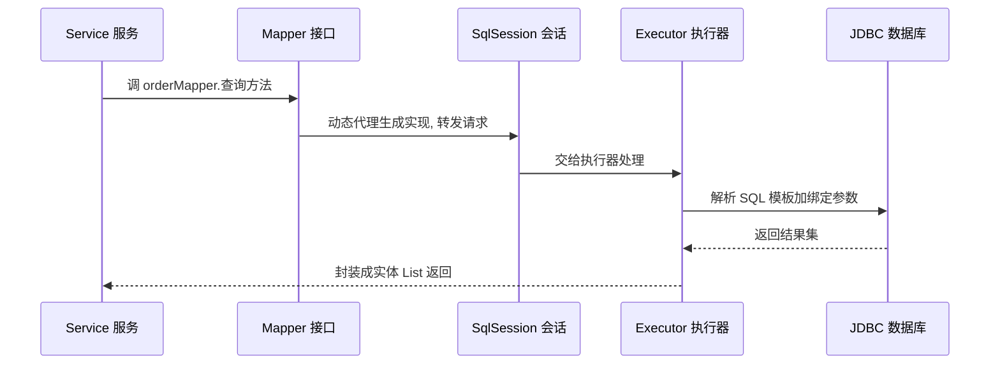
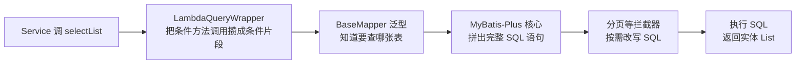
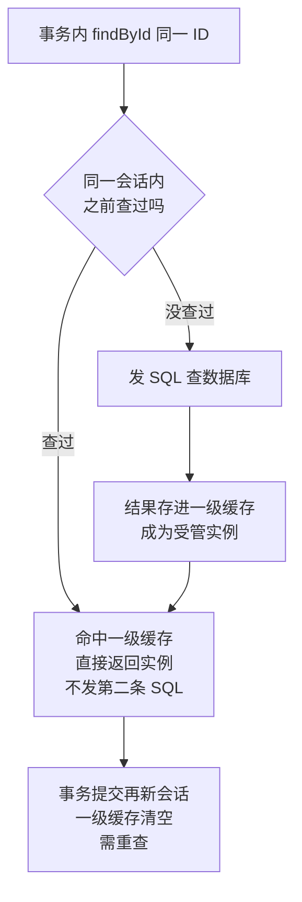
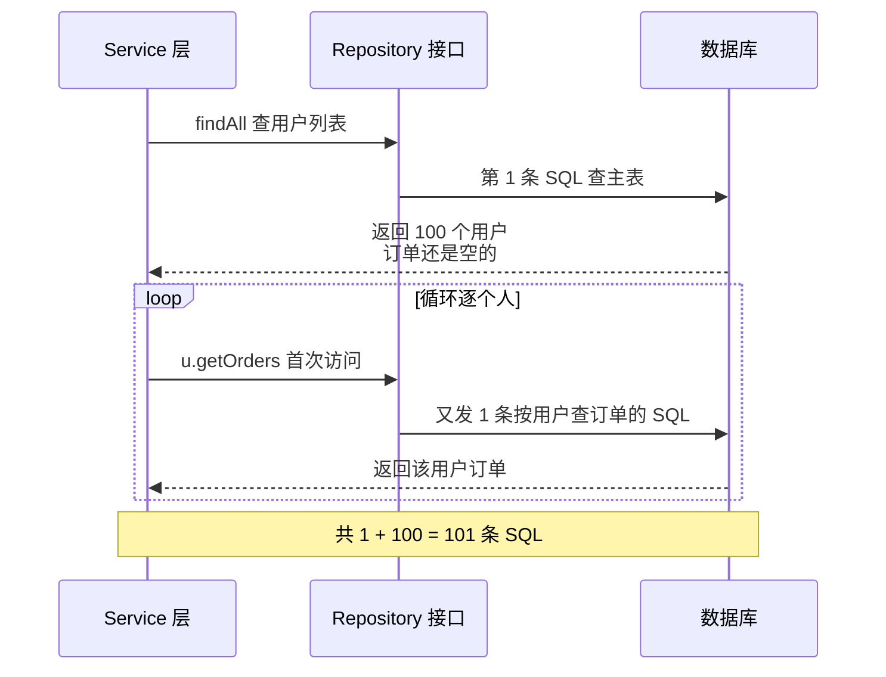

# 阶段三 · 小点 3：ORM 与数据访问（MyBatis / JPA / jOOQ）

> 所属：阶段三 数据持久化与中间件
> 定位：国内企业主流是 MyBatis-Plus，标准是 JPA，类型安全选项是 jOOQ——三者按「SQL 掌控力 ↔ 开发效率」的光谱分布。你写过 TypeORM / Prisma，概念可全量迁移；本讲补齐三件套的写法体感与选型判断。

## 快速入门

> 本节为「ORM 速览」：先认识 Java 访问数据库的几种方式、各自取舍；「N+1、多数据源」留在正文提高部分。

### 本讲核心关键词速查

| 关键词 | 一句话大白话 | 例子 |
|-|-|-|
| ORM | 用对象来操作数据库（对象关系映射） | 不用写 SQL，直接操作对象 |
| MyBatis-Plus | 国内主流，SQL 可控 + 易用 | 增删改查一行搞定 |
| JPA | Java 标准 ORM（Hibernate 实现） | `Repository` 接口 |
| jOOQ | 类型安全的 SQL DSL | 编译期检查 SQL 对错 |
| Entity | 映射到数据库表的 Java 类 | `@Table` 标注的类 |
| Repository | 数据访问接口 | `findById` 等方法 |
| N+1 问题（N+1 Query Problem） | 查 1 次列表 + 每行又查一次关联 | JPA 经典坑 |
| Mapper | MyBatis 的数据访问接口 | 无实现类也能跑 |

### 本讲在解决什么问题

- **问题**：Java 怎么操作数据库？是手写 SQL（MyBatis）、还是操作对象（JPA）、还是类型安全的 SQL（jOOQ）？三者在「SQL 掌控力 ↔ 开发效率」光谱上各有取舍。
- **你要带走的一句话**：**MyBatis-Plus** 国内主流（SQL 可控 + 好用）、**JPA** 是标准（领域建模省心）、**jOOQ** 类型安全（复杂查询编译期对错）。别在一套项目里混两种以上。

### 最简可运行示例（照抄能跑）

```java
// MyBatis-Plus: 用条件构造器查数据(不用手写 SQL)
@Service
public class UserService {
    private final UserMapper userMapper;       // MyBatis 的 Mapper 接口, 无实现类也能跑(动态代理)

    public List<User> findActive() {
        return userMapper.selectList(
            new LambdaQueryWrapper<User>()
                .eq(User::getStatus, 1));        // WHERE status = 1
    }
}
```

```java
// Spring Data JPA: 继承 Repository 接口, 方法名即查询
public interface UserRepository extends JpaRepository<User, Long> {
    List<User> findByStatus(int status);        // 方法名: SELECT * FROM user WHERE status=?
}
```

> 代码备注（逐行解释）：
> - MyBatis-Plus 的 `userMapper`：Mapped 接口**不用写实现类**——由 JDK 动态代理（Dynamic Proxy，阶段一第 3 讲）在运行时生成实现，这就是「Mapper 能跑」的原因。
> - `new LambdaQueryWrapper<User>().eq(...)`：用条件构造器拼查询条件，比手写 SQL 安全又不失控制。
> - JPA 的 `findByStatus(int)`：**方法名即查询**（Spring Data 按命名规则自动生成 SQL）——这是 JPA 最省事的地方。
> - 二者差异：MyBatis-Plus 显式、SQL 掌控强；JPA 隐式、靠命名规范，省心但底层不透明。

### 关键概念 / 技术说明

| 概念 | 干什么 | 最易踩的坑 |
|-|-|-|
| `@Table` / `@Entity` | 标注映射到表的类 | 表名字段要和实体对应 |
| `@Mapper` | MyBatis 数据接口 | 要能被扫描到 |
| `JpaRepository<T, ID>` | 标准 CRUD 接口 | 方法命名规范要记住 |
| `@EntityGraph` | 预加载关联（解 N+1） | 忘用会触发 N+1 |
| N+1 问题 | 列表查询逐条查关联 | 用 `JOIN FETCH`/`@EntityGraph` 解 |
| `ddl-auto` | JPA 自动建表 | 生产**禁用** `update`，用 Flyway 管表结构 |

### 常用约定 / 命名提示

- **DTO↔Entity 用 MapStruct**：编译期生成转换代码，别用 `BeanUtils` 反射拷贝（慢、字段改名不报错）。
- **表结构变更用 Flyway**：JPA 的 `ddl-auto` 在开发可以，生产禁用（唯一事实源是迁移脚本）。
- **选型别混**：一个项目尽量用一种 ORM（MyBatis-Plus 或 JPA 二选一为主），别混两套以上。

## 精简大纲

1. ORM 心智模型与三家定位光谱
2. MyBatis / MyBatis-Plus：国内主流必学
3. Spring Data JPA：Repository 抽象与 N+1 问题
4. jOOQ：类型安全的 SQL DSL
5. 多数据源与读写分离落地

## 学习内容详情

### 1. ORM 心智模型与选型光谱

- **ORM**（**Object-Relational Mapping**，对象关系映射：把「Java 对象 ↔ 数据库表行」的转换自动化，让你操作对象而不是拼 SQL 字符串）：概念与 TypeORM / Prisma 完全同构。

**生活版——货架 vs 名片夹**：仓库每件货都躺在一个货架格位（= 数据库的一行），而你办公桌上有一叠「货品名片」（= Java 对象），名片上印着「编号、品名、库存」。你平时只管翻名片、改名片，改完有人自动帮你把货架同步改掉——不必亲自跑去摆货。**换成 Java**：ORM 就是那张「名片 ↔ 货架」的自动同步契约——`@Entity` / `@Table` 标注好映射后，改对象字段就是改表行，省掉手写 SQL；代价是「货架长啥样」被藏起来了，复杂查询要另想办法（正好引出下面的选型光谱）。
- 三家定位：

```text
SQL 掌控力 ←—————————————————————→ 开发效率
  MyBatis(-Plus)      jOOQ            JPA/Hibernate
  SQL 自己写           SQL 类型安全生成    方法名自动生成 SQL
  国内企业主流         中小团队上升中      国际标准/快速原型
```

选型决策表：

| 你的情况 | 选 |
|-|-|
| 团队 SQL 文化强、要可控 SQL | MyBatis-Plus |
| 领域建模、标准 CRUD 为主 | Spring Data JPA |
| 类型安全 + 复杂查询编译期校验 | jOOQ |
| 任何情况 | **不要在一个项目里混用两种以上**——事务、缓存、审计各自为政，排障成本翻倍 |

### 2. MyBatis / MyBatis-Plus

**生活版——餐厅点单，你不进后厨**：你（Service）对着菜单（Mapper 接口）选菜下单，服务员（MyBatis 动态代理）记下菜单，交给后厨（SqlSession + Executor）按菜单做菜，最后菜端到你面前——**你从没见过后厨里锅铲怎么挥**。同理，MyBatis 里你只写接口 + SQL，中间链路由框架接管。

**换成 Java**：一次 `orderMapper.xxx()` 调用的完整链路是「Mapper 接口（动态代理）→ SqlSession → Executor → JDBC → 数据库」，每一步各司其职，SQL 越早确定越省事。



- **Mapper 接口（无实现类也能跑的替代方案）**：MyBatis 用 JDK 动态代理（阶段一第 3 讲）在运行时为接口生成实现类——在餐厅场景里就是那张看不见的「服务员」。
- **SqlSession（一次数据库会话的门面）**：打开一次「与数据库的对话」，事务、缓存都挂在它身上。
- **Executor（真正干活的执行器）**：把 SQL 模板和参数拼好，指挥 JDBC 干活。

#### 2.1 MyBatis 本体：SQL 写在 XML 里

```xml
<!-- OrderMapper.xml：SQL 与 Java 分离，动态 SQL 是它的灵魂 -->
<mapper namespace="com.demo.mapper.OrderMapper">

    <!-- ${} vs #{} 是安全分界线:
         #{} → 预编译参数占位符(PreparedStatement 的 ?)，防 SQL 注入，默认永远用它
         ${} → 字符串原样拼接，仅限"排序字段名"这类白名单值 -->
    <select id="selectByUser" resultType="Order">
        SELECT id, order_no, user_id, status, amount
        FROM `order`
        WHERE user_id = #{userId}
        <!-- 动态 SQL: 条件成立才拼进语句 —— 前端表单多条件筛选的标配 -->
        <if test="status != null">
            AND status = #{status}
        </if>
        <!-- foreach: 批量 IN 查询, 大量 ID 时比 OR 高效得多 -->
        <if test="orderNos != null and orderNos.size() > 0">
            AND order_no IN
            <foreach collection="orderNos" item="no" open="(" separator="," close=")">
                #{no}
            </foreach>
        </if>
    </select>
</mapper>
```

#### 2.2 MyBatis-Plus：把单表 CRUD 从 XML 里解放出来

```java
import com.baomidou.mybatisplus.annotation.*;
import com.baomidou.mybatisplus.core.mapper.BaseMapper;

// 实体：注解映射表结构（对应第 1 讲建好的 order 表）
@TableName("`order`")                        // order 是 SQL 关键字, 要反引号转义
public class Order {
    @TableId(type = IdType.ASSIGN_ID)        // ASSIGN_ID = 内置雪花算法生成分布式 ID
    private Long id;                         // (分库分表场景自增 ID 会撞, 雪花是标配)
    private String orderNo;
    private Long userId;
    private Integer status;
    private BigDecimal amount;

    @TableLogic                              // 逻辑删除: DELETE 变 UPDATE deleted=1
    private Integer deleted;                 // 查询自动拼 AND deleted=0, 业务无感

    @TableField(fill = FieldFill.INSERT)     // 自动填充: 创建时间交给框架, 不在每个方法里手写
    private LocalDateTime createdAt;
}
```

```java
// Mapper：继承 BaseMapper 即获得全部单表 CRUD，零 XML
public interface OrderMapper extends BaseMapper<Order> {}

// Service 里直接用条件构造器（类型安全的 Lambda 版，列名写错编译期就报错）
@Service
public class OrderQueryService {
    private final OrderMapper orderMapper;
    public OrderQueryService(OrderMapper orderMapper) { this.orderMapper = orderMapper; }

    public List<Order> paidOrdersOf(Long userId) {
        return orderMapper.selectList(
            new LambdaQueryWrapper<Order>()
                .eq(Order::getUserId, userId)          // WHERE user_id = ?
                .eq(Order::getStatus, 1)               // AND status = 1 —— 已支付
                .orderByDesc(Order::getCreatedAt)      // ORDER BY created_at DESC
                .last("LIMIT 20"));                    // last() 原样拼接: 只能放无注入风险的常量
    }
}
```

这一行代码背后的完整链路——「条件构造器 → 生成 SQL → 拦截器改 SQL → 执行」，每一步都由框架帮你兜底：



- **BaseMapper 泛型**：`extends BaseMapper<Order>` 的泛型参数 `Order` 就是「要操作哪张表」的定心丸——增删改查方法全部由框架按实体注解现拼。
- **LambdaQueryWrapper（把方法引用当列名用）**：`Order::getUserId` 不写字符串列名，规避拼写错误，还规避 SQL 注入。

```java
// 分页插件：物理分页(自动改写成 LIMIT offset,size)而非内存分页
@Configuration
public class MybatisPlusConfig {
    @Bean
    public MybatisPlusInterceptor mybatisPlusInterceptor() {
        var interceptor = new MybatisPlusInterceptor();
        interceptor.addInnerInterceptor(
            new PaginationInnerInterceptor(DbType.MYSQL));  // 拦截分页语句改写 SQL
        return interceptor;
    }
}
// 用法: orderMapper.selectPage(new Page<>(2, 20), wrapper) → 第2页每页20条
```

```java
// 自动填充：MetaObjectHandler 在 INSERT/UPDATE 时统一塞审计字段
@Component
public class AuditFillHandler implements MetaObjectHandler {
    @Override
    public void insertFill(MetaObject meta) {
        this.strictInsertFill(meta, "createdAt", LocalDateTime.class, LocalDateTime.now());
    }
    @Override
    public void updateFill(MetaObject meta) {
        this.strictUpdateFill(meta, "updatedAt", LocalDateTime.class, LocalDateTime.now());
    }
}
```

### 3. Spring Data JPA

#### 3.1 Repository：方法名即查询

```java
// Spring Data JPA：接口方法名派生查询 —— 不写 SQL，框架按方法名生成
public interface OrderRepository extends JpaRepository<Order, Long> {

    // 方法名就是查询语义: SELECT ... WHERE user_id = ? AND status = ?
    List<Order> findByUserIdAndStatus(Long userId, Integer status);

    // 复杂查询用 @Query(JPQL, 面向实体不是表)
    @Query("SELECT o FROM Order o WHERE o.amount > :min ORDER BY o.amount DESC")
    List<Order> findBigOrders(@Param("min") BigDecimal min);
}
```

- **JPA / Hibernate 关系**（**JPA** 是 Java 持久化 API **标准**，**Hibernate** 是其默认**实现**）：类比 SLF4J（门面）与 Logback（实现）；前端视角——就像「TypeORM 规范 + 具体 driver」，JPA 管接口约定，Hibernate 管跑数据库活。
- 好处：从 MySQL 迁 PG 几乎零改动（方言屏蔽）；代价：复杂 SQL 要跟框架搏斗（JPQL 语法受限、优化器黑盒）。
- **实体生命周期**（一句话：实体不是静态的 Java 对象，它在持久化上下文里换状态）——四态一行表：

| new / transient | managed | detached | removed |
|-|-|-|-|
| 刚 new 出来，未关联上下文 | 受管：脏检查自动同步 DB | 上下文关闭后脱管 | 标记删除，flush 时发 DELETE |

- **一级缓存（First-Level Cache，本质就是持久化上下文本身）**：同一持久化上下文里同 ID 只有一个受管实例——事务内重复 `findById` 不打第二条 SQL，脏检查（Dirty Checking）才能把修改统一写回。
- **Hibernate 默认只开一级缓存**；二级缓存（Second-Level Cache，跨会话共享的缓存）默认关闭——这点常被误解为「JPA 自带缓存」而忽略集群失效问题。

**生活版——开会时把发言稿揣兜里**：同一场会里，有人反复问你「刚才那个数字是多少」，你直接掏兜里的稿子念，不用再回办公室翻档案（= 一级缓存命中，不发第二条 SQL）；会议一散，稿子收起来（= 上下文关闭）。**换成 Java**：事务内 `findById` 同 ID 第二次调用直接返回受管实例；一级缓存的生命周期就跟 session / 事务同进退。



#### 3.2 N+1 问题：JPA 的头号坑

```java
// 场景: 查 100 个用户, 再逐个取他们的订单(关联是 LAZY 懒加载 Lazy Loading)
List<User> users = userRepository.findAll();      // ① 1 条 SQL: SELECT * FROM user
for (User u : users) {
    u.getOrders().size();                          // ② 每个用户首次访问订单 → 再发 1 条 SQL!
}
// 结果: 1 + 100 = 101 条 SQL —— 就是 N+1 问题
// (TypeORM/Prisma 一样有, 前端同学 migration 时最容易带进来的坑)
```

**生活版——点名报到，每叫一人再打一次电话**：先喊「全班集合」拿到 100 人名单（= 第 1 条 SQL），然后逐个点名、每点到一个人再单独给他家人打个电话问联系方式（= 循环里每人 1 条 SQL）。100 人 → 打了 101 个电话。**换成 Java**：`findAll()` 先回主列表，`for` 循环里每个实体首次访问 `getOrders()` 又各自触发 1 条 SQL——电话费（网络往返）从 1 通涨成 101 通。



- **根因**：关联默认 **LAZY（懒加载，Lazy Loading）**——查主表时不带关联，等代码逐个访问 `u.getOrders()` 才逐条发 SQL。ORM 越「省心」、SQL 越不可见，N+1 越容易被悄悄带进来。

```java
// 解法一: @EntityGraph —— 一条 JOIN SQL 把关联一起取出来(前端类比: include/with 预加载)
public interface OrderRepository extends JpaRepository<Order, Long> {

    @EntityGraph(attributePaths = "items")          // 生成 LEFT JOIN order_item, 一次取齐
    List<Order> findByUserId(Long userId);
}

// 解法二: DTO 投影 —— 直接 SELECT 需要的列, 不加载实体(最彻底, 报表类查询首选)
@Query("SELECT new com.demo.dto.OrderBrief(o.id, o.orderNo, o.amount) FROM Order o WHERE o.userId = :uid")
List<OrderBrief> findBriefByUserId(@Param("uid") Long uid);
```

#### 3.3 数据库变更管理：Flyway

- **为什么需要**：生产禁手工跑 DDL，表结构变更必须满足三性——
  - **可审查**：SQL 进代码评审，改动有人把关。
  - **可重复**：新环境跑一遍脚本就能一键建到最新结构。
  - **可追溯**：每个版本改了什么有记录、回滚有据。
- **约定**：脚本放 `src/main/resources/db/migration`，文件名即版本：`V1__init.sql`、`V2__add_order_status.sql`——Boot 启动时按序执行没跑过的，已跑的记录在 `flyway_schema_history` 表。
- **Boot 集成**：引入 `flyway-mysql` 依赖即自动执行（具体版本与配置以官方文档为准）。
- **与 JPA 的关系**：**禁用 `ddl-auto=update`**——表结构的唯一事实源是迁移脚本，实体只做映射不建表。

### 4. jOOQ：类型安全的 SQL DSL

```java
// jOOQ: 代码生成器按表结构生成强类型对象(ORDER 表、ORDER.USER_ID 列都是类型安全的常量)
// 写错列名 → 编译报错; 重命名列 → 重新生成后编译报错 —— "SQL 的 TypeScript"
Result<Record> rows = dsl
    .select(ORDER.ID, ORDER.ORDER_NO, ORDER.AMOUNT)
    .from(ORDER)
    .where(ORDER.USER_ID.eq(uid))                  // .eq 只接受 Long, 传 String 编译不过
    .and(ORDER.STATUS.eq(1))
    .orderBy(ORDER.CREATED_AT.desc())
    .limit(20)
    .fetch();                                      // 生成的 SQL 与手写等价, 无魔法
```

- 心智迁移：与 Prisma 的「schema 生成客户端」同宗——**契约由数据库结构出发，编译期守护**。适合喜欢类型安全的你；国内存量少，了解 + 试用即可。

> ⏸️ **短期可以不学**：jOOQ 在国内企业存量少、招人难，主线了解「类型安全 SQL」的定位即可，不用上手写业务。**何时回来学**：团队引入类型安全 SQL，或你主导复杂报表查询选型时。**面试最低要求**：一句话说出 jOOQ 解决什么问题（SQL 编译期类型校验）及它在光谱上的位置。

### 5. 多数据源与读写分离落地

```java
// 动态数据源路由: AbstractRoutingDataSource 按 ThreadLocal 标记决定本次连接走主库还是从库
public class DynamicDataSource extends AbstractRoutingDataSource {
    public static final ThreadLocal<String> HOLDER = new ThreadLocal<>();

    @Override
    protected Object determineCurrentLookupKey() {
        return HOLDER.get();        // "master" / "slave" —— 拿连接时调用
    }
}

// AOP 切面: 标了 @ReadOnly 的方法自动切从库
@Aspect
@Component
public class ReadOnlyAspect {
    @Around("@annotation(readOnly)")
    public Object route(ProceedingJoinPoint pjp, ReadOnly readOnly) throws Throwable {
        DynamicDataSource.HOLDER.set("slave");      // 读标记 → 从库
        try {
            return pjp.proceed();
        } finally {
            DynamicDataSource.HOLDER.remove();      // 必须 remove! 线程池复用, 泄漏标记会污染下一请求
        }
    }
}
// 写方法不标 → 默认 master。第 2 讲「写后读主」= 写完短窗口 set("master") + 最后 remove
```

整条路由的决策链——「读方法打标 → 切面塞标记 → 拿连接时按标记选库 → 用完必清」，一张图串起来：

```mermaid
flowchart TD
    A["Controller 调 Service 方法"] --> B{方法标了<br/>@ReadOnly 吗}
    B -->|是| C["AOP 切面<br/>ThreadLocal 塞入 slave 标记"]
    B -->|否| D["不标标记<br/>默认走 master 主库"]
    C --> E["拿连接时<br/>determineCurrentLookupKey 读标记"]
    D --> E
    E --> F{"HOLDER 读到的值"}
    F -->|slave| G["走从库读<br/>分担主库压力"]
    F -->|master| H["走主库写<br/>保证读到最新"]
    G --> I["finally 里 remove 标记<br/>防线程池复用污染下一请求"]
    H --> I
```

### 6. 坑点提醒

- **`${}` 只准出现在排序字段这类白名单**：任何来自用户的值过 `${}` 都是注入入口；页面排序字段用枚举白名单映射。
- **MyBatis-Plus 的 `last()`**：拼什么进什么，等价 `${}` 纪律。
- **JPA 默认 LAZY + Controller 里访问关联**：事务已关闭还触发加载 → `LazyInitializationException`（session 早没了）；要么 `@EntityGraph`，要么在事务内取完。
- **逻辑删除的盲区**：唯一索引会被「已删数据」占坑（删了又建同 order_no 冲突）——唯一索引要包含 deleted 列或用「删除时间戳」当 deleted 值。
- **自动填充只对 MP 自己的 INSERT/UPDATE 生效**：手写 XML 的原生 SQL 不会触发填充，混用时要留心。
- **DTO↔Entity 转换用 MapStruct**（编译期生成转换代码）：别用 `BeanUtils.copyProperties` 反射拷贝——慢，且字段改名不报错、悄悄丢值。

## 本节自检

- [ ] 能用 MyBatis-Plus 完成单表 CRUD + 分页 + 逻辑删除 + 自动填充的完整配置
- [ ] 能解释 N+1 问题怎么产生，并用 `@EntityGraph` 或 DTO 投影解决
- [ ] 能说出三者（MyBatis-Plus / JPA / jOOQ）在「SQL 掌控力 ↔ 开发效率」光谱上的位置与选型建议
- [ ] 能描述动态数据源路由的实现思路（AbstractRoutingDataSource + ThreadLocal + AOP）以及 finally remove 的原因

## 本节配套思考题

1. 同样是「对象 ↔ 表」映射，为什么国内选 MyBatis 而欧美更多 JPA？（提示：DBA 文化 / SQL 审核流程 / 复杂报表场景的差异）
2. `@TableLogic` 逻辑删除后，「订单号唯一」的语义怎么保证？给出至少两种方案并说明取舍。
3. 如果项目 80% 是简单 CRUD、20% 是复杂报表，你会怎么组合这两讲里的工具？（提示：MP 走日常 + jOOQ/原生 SQL 走报表）

## 常见面试题

### Q1：MyBatis 里 `#{}` 和 `${}` 有什么区别？怎么防 SQL 注入？

**答**：

**标准结论**：`#{}` 是预编译参数占位符，生成 PreparedStatement 的 `?`，值不参与 SQL 语法解析，天然免疫注入；`${}` 是字符串原样拼接进 SQL，用户输入可能变成 SQL 的一部分，有注入风险。

**底层原理**：
- `#{}`：预编译让 SQL 骨架先编译一次，参数通过绑定传递，数据库不会把参数内容当 SQL 解析。
- `${}`：拼接后整个字符串重新解析，`' or '1'='1` 这类输入就变成查询条件的一部分。

**工程实践**：
- 能选 `#{}` 永远选 `#{}`。
- `${}` 只准用于排序字段名、表名这类白名单值，且必须用枚举映射校验。
- MyBatis-Plus 的 `last()` 等价 `${}` 纪律，只拼无注入风险的常量。

**常见误区**：
- 以为过滤引号就安全——注入绕过方式很多（编码、注释符），预编译才是唯一正解。
- 也别把所有动态排序都禁掉，白名单映射是两全方案。

### Q2：什么是 N+1 问题？怎么解决？

**答**：

**标准结论**：查 1 条主表 SQL + N 条关联 SQL（1 + N = 101 条）。JPA 关联默认懒加载，遍历集合逐个访问关联属性时逐条发 SQL。解法：`@EntityGraph` / JOIN FETCH 预加载、DTO 投影、`@BatchSize` 批量抓取。

**底层原理**：
- 懒加载是「用到才查」，本身没错——问题在循环里每个实体都触发一次查询，把网络往返放大 N 倍。
- `@EntityGraph`：把 N 条查询改写为一条 LEFT JOIN，一次取齐。
- DTO 投影：根本不加载实体、只查需要的列。

**工程实践**：
- 列表类查询一律考虑预加载。
- 想保留懒加载，就靠批量抓取控住 SQL 条数。
- 排查靠日志里数 SQL 条数。

**常见误区**：
- 以为 N+1 只发生在 JPA——MyBatis 手写 SQL 循环查、TypeORM / Prisma 的 relation 加载一样会有。
- 「先取列表再循环」的代码模式在哪都可能踩。

### Q3：为什么国内用 MyBatis-Plus 而不用 JPA？

**答**：

**标准结论**：MyBatis 的 SQL 完全可控、易审查，契合国内「DBA 审核 SQL」的文化；JPA 是领域建模和快速开发的标准，但 SQL 生成黑盒、复杂查询受 JPQL 语法限制、优化空间小。

**底层原理**：
- 国内团队普遍有专职 DBA 和 SQL 评审流程，要求 SQL 显式可见、能交给 DBA 改写优化——MyBatis 把 SQL 写在 XML / 注解里天然满足。
- JPA 的实体生命周期、懒加载、一级缓存等概念对团队约束要求高，用不好容易出 N+1、长事务、意外加载等隐性问题。

**工程实践**：
- 纯 CRUD 密集 + 领域模型复杂 → 选 JPA，开发效率高。
- 团队 SQL 文化强、复杂报表多 → 选 MyBatis-Plus（BaseMapper + LambdaQueryWrapper 已把单表 CRUD 解放，不需要手写）。

**常见误区**：
- 以为 MyBatis 只能手写 SQL——MyBatis-Plus 的单表 CRUD、分页、逻辑删除都是开箱即用。
- 也别一个项目混两套 ORM，事务、缓存、审计各管各的，排障成本翻倍。

### Q4：LazyInitializationException 是什么？怎么避免？

**答**：

**标准结论**：JPA 的懒加载关联在事务 / 会话关闭之后被访问，Hibernate 抛出的运行时异常——「session 已经没了，还去查数据」。

**底层原理**：
- 懒加载的关联只有在持久化上下文（Session / EntityManager）存活时才能触发查询。
- 事务提交后上下文关闭，实体进入 detached（脱管）状态——再访问未加载的关联属性，Hibernate 找不到 session 执行 SQL。

**工程实践**：
- Controller 层不要碰实体的关联属性——要么在 Service 事务内用 `@EntityGraph` 预加载，要么用 DTO 投影返回。
- 把 `open-in-view: true` 当解药是错的：它只是把事务生命周期延长到视图渲染，连接被占满，高并发直接打爆连接池。

**常见误区**：以为加了 `fetch = EAGER` 就一劳永逸——急加载会让不需要关联的查询也带 JOIN，SQL 膨胀；正确做法是按查询场景决定加载策略。

### Q5：逻辑删除 + 唯一索引会踩什么坑？怎么解？

**答**：

**标准结论**：逻辑删除（DELETE 变 UPDATE deleted=1）后，被删数据仍占着唯一索引的位置——删了再建同 order_no 直接唯一键冲突。

**底层原理**：
- 唯一索引约束的是「当前存在的数据行」；逻辑删除不删行，唯一值就一直在。
- 要让「已删数据」不占坑，必须让唯一键随删除变化。

**工程实践**：
- **方案一**：唯一索引包含 deleted 列——deleted 默认 0、删除时写「删除时间戳」，每次删除值不同，历史删除互不冲突。
- **方案二**：对「可重建」的业务键，把删除时间戳直接拼进唯一键。

**常见误区**：以为唯一索引加 deleted 列就万事大吉——deleted 只有 0/1 时，删两条同 order_no 的数据照样冲突，要用「时间戳」当 deleted 值才能让每次删除唯一。
