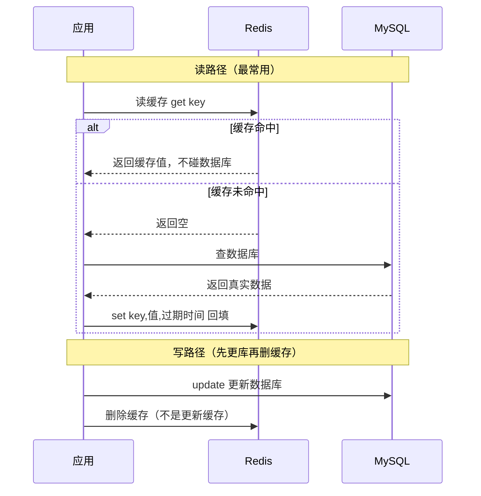
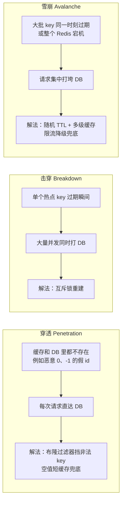
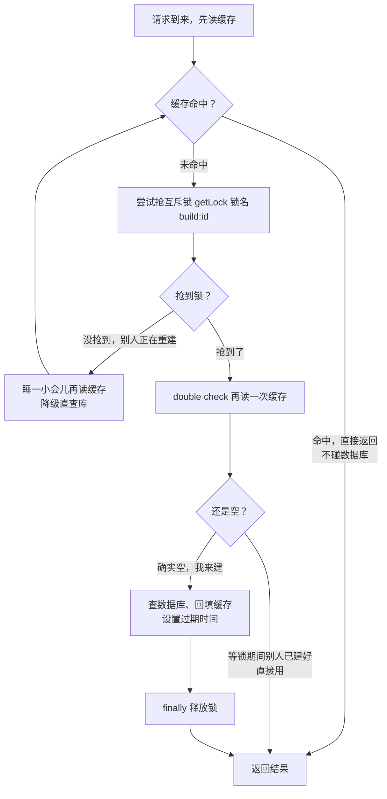
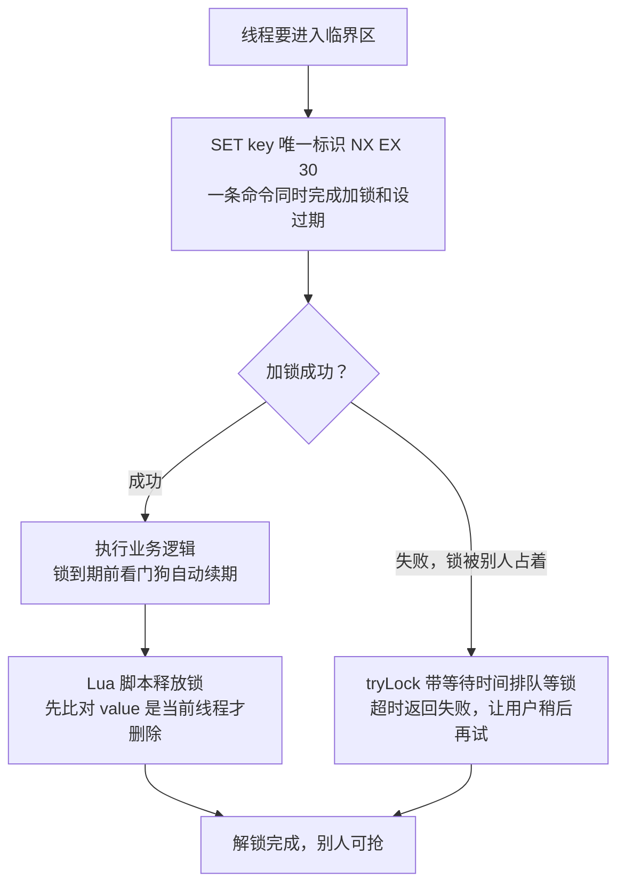
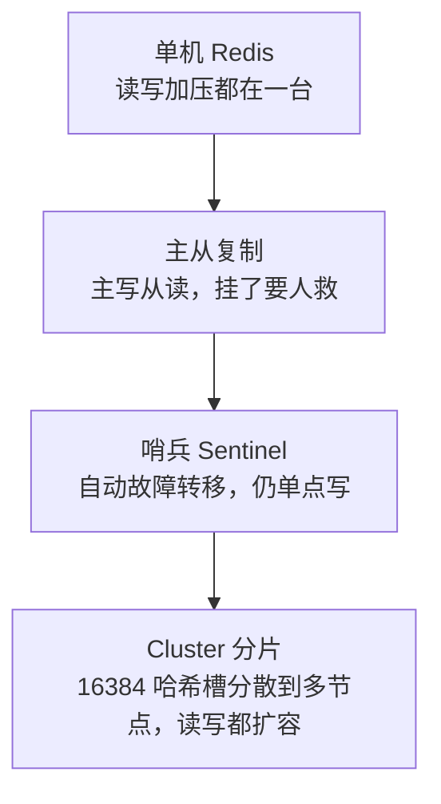
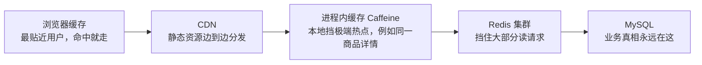

# 阶段三 · 小点 4：Redis 缓存体系

> 所属：阶段三 数据持久化与中间件
> 定位：从「会 set / get」到「能设计缓存架构」：数据结构选型、双写一致性、三大经典问题、分布式锁、高可用演进、多级缓存。**缓存的难从来不是用法，是一致性与失效设计。**

## 快速入门

> 本节为「缓存速览」：先认识 Redis 是什么、存什么、怎么用；「双写一致性、三大经典问题」留在正文提高部分。

### 本讲核心关键词速查

| 关键词 | 一句话大白话 | 例子 |
|-|-|-|
| Redis | 高性能的「内存数据库」，常用作缓存 | 存热点数据加快读取 |
| String / Hash / ZSet | Redis 的几种数据结构 | 计数 / 对象 / 排行 |
| 缓存 | 把热点数据放内存，免查数据库 | 用户信息缓存 |
| 过期时间（TTL） | 数据自动消失 | `SET k v EX 60` |
| 穿透 / 击穿 / 雪崩 | 缓存的三大经典问题 | 缓存失效导致 DB 被打 |
| 分布式锁 | 多实例竞争同一资源的锁 | 扣库存 |
| 缓存一致性 | 缓存与数据库保持一致 | 先更 DB 再删缓存 |
| 布隆过滤器 | 大概率判断「不存在」 | 挡缓存穿透 |

### 本讲在解决什么问题

- **问题**：数据库扛不住频繁读，把热点数据放 Redis 缓存。但「缓存怎么失效」「怎么保证和数据库一致」「怎么防缓存击穿打垮数据库」才是真难点。
- **你要带走的一句话**：缓存 = 把热点数据放内存免查库。**更新时先改数据库、再删缓存**（Cache-Aside）；三大经典问题（穿透/击穿/雪崩）各有对策。

### 最简可运行示例（照抄能跑）

```java
// 缓存读取的标准流程: 先查缓存, 没有再查库并回填
@Service
public class UserService {
    private final StringRedisTemplate redis;    // Redis 操作模板

    public User getById(Long id) {
        String key = "user:" + id;
        // ① 先查缓存
        String json = redis.opsForValue().get(key);
        if (json != null) return parse(json);            // 命中: 直接返回, 不碰 DB

        // ② 没命中, 查数据库
        User user = userRepo.findById(id);

        // ③ 回填缓存, 设过期时间(防止永远缓存)
        redis.opsForValue().set(key, toJson(user),
                Duration.ofMinutes(30));
        return user;
    }
}
```

> 代码备注（逐行解释）：
> - `redis.opsForValue().get(key)`：先查缓存。
> - 命中（`json != null`）直接返回，**不查数据库**——这就是缓存提速的原理。
> - 未命中再去查库，`userRepo.findById(id)`。
> - 查完**回填缓存** + 设置过期时间 `Duration.ofMinutes(30)`（防止数据永远不动、也防雪崩——不同 key 的 TTL 最好加一点随机扰动）。
> - 这就是 Cache-Aside（旁路缓存）标准模式：读先缓存、没命中查库回填。

### 关键概念说明

| 概念 | 干什么 | 最易踩的坑 |
|-|-|-|
| String（字符串） | 计数/缓存单值 | 适合简单值 |
| Hash（哈希） | 存对象 | 如购物车 `{skuId: cnt}` |
| ZSet（有序集合） | 排序/排行榜/延时队列 | score 决定顺序 |
| TTL 过期 | 自动清除 | 别设永久，防脏数据 |
| 分布式锁（Distributed Lock） | 跨实例互斥 | 必须 finally 释放 |
| 缓存一致性 | 库与缓存同步 | **先更 DB 再删缓存** |
| 穿透/击穿/雪崩 | 缓存三大坑（Penetration / Breakdown / Avalanche） | 布隆过滤器/互斥锁/随机TTL |

### 常用约定 / 命名提示

- **缓存 key 规范**：`业务:对象:id`（如 `user:profile:123`），便于清缓存。
- **更新策略**：**先更数据库、再删缓存**（Cache-Aside 标准）；别先删缓存再更库（会把旧数据放回）。
- **TTL 要有**：所有缓存都设过期时间，且加随机扰动防雪崩。
- **分布式锁**：多实例共享资源（库存、下单）用 Redisson；记得 `try/finally` 释放。

## 精简大纲

1. 数据结构与典型场景（含命令会话）
2. 缓存模式与双写一致性方案
3. 三大经典问题：穿透 / 击穿 / 雪崩
4. 分布式锁（Redisson 实战）
5. 持久化与高可用：RDB / AOF、主从 → 哨兵 → Cluster
6. 多级缓存与大 key / 热 key

## 学习内容详情

### 1. 数据结构与典型场景

```bash
# String: 缓存对象 / 计数器 / 分布式 session
SET user:1001 '{"name":"Alice"}' EX 300     # EX 设过期, 永不过期的缓存都是未来的内存炸弹
INCR uv:2026-09-06                            # 原子计数(日 UV 统计)

# Hash: 对象部分字段读写 —— 只改价格不用序列化整个商品
HSET item:9:stock cnt 100
HINCRBY item:9:stock cnt -1                   # 库存扣减的原子雏形

# ZSet: 排行榜(score 排序) / 延迟队列(到期时间戳做 score)
ZADD rank:daily 120 "user:1" 80 "user:2"
ZRANGE rank:daily 0 9 REV WITHSCORES           # Top 10（REV 倒序，分数高的在前）

# Set: 交并差(共同关注) / Bitmap: 签到 / HyperLogLog: 海量基数
SADD follow:1 2 3 5
SINTER follow:1 follow:2                       # 共同关注
PFADD uv:2026-09 "u1" "u2"                     # 0.81% 误差换 12KB 内存统计亿级 UV
```

- 选型直觉：**「按字段读写」用 Hash，「按序取范围」用 ZSet，「去重判存在」用 Set / Bitmap**——别什么都塞 String JSON。

### 2. 缓存模式与双写一致性

**Cache-Aside（旁路缓存，最常用）**：

```java
public Order get(Long id) {
    var cached = redis.get("order:" + id);
    if (cached != null) return parse(cached);               // 命中: 不碰 DB

    var order = orderRepo.find(id);                          // 未命中: 查 DB
    redis.set("order:" + id, json(order), Duration.ofMinutes(30));  // 回填
    return order;
}

// 写路径: 先更新 DB, 再删缓存(不是更新缓存!) —— "删"比"写"并发安全: 更新缓存会出现"旧值覆盖新值"的写写竞争,
//   而删缓存后并发读到旧值也顶多多打一次 DB, 下次读自然重建新值, 一致性窗口收敛
public void update(Order o) {
    orderRepo.save(o);
    redis.delete("order:" + o.getId());                      // ⚠️ 这步失败 = 脏数据窗口, 靠下面兜底
}
```

> 🧩 **为什么写路径是「先更 DB 再删缓存」，而不是「先删缓存」或「更新缓存」？**
>
> **生活版**：照片底片存在相册（数据库），墙上挂着洗好的照片（缓存）。要换新照片，正确顺序是：**先把相册里的底片换成新的（先更 DB），再顺手把墙上旧照片摘下来扔掉（删缓存）**——之后有人发现墙上没有，去相册拿新底片重新挂上即可。若反过来先摘旧照片、再换底片，这个间隙想看的人会去相册翻到旧底片重新洗一张挂上——等底片换成新的，墙上挂的已是旧照（旧数据放回缓存）；更糟的是你拿新底片先洗一张挂上去（更新缓存），别人同时拿旧底片也洗了一张再一挂，就把你的新照片盖掉了（旧值覆盖新值）。
>
> **换成 Redis**：写路径必须「先更 DB、再删缓存」，而不是「更新缓存」。删缓存后并发读到的至多是旧值，顶多多打一次 DB 下次读就重建，一致性窗口自动收敛；更新缓存则会出现「旧值覆盖新值」的写-写竞争，把新值冲掉，就是脏数据。

**Cache-Aside 读写全流程（一张时序图看穿「缓存怎么提速」「脏窗口从哪来」）：**



| 方案 | 一致性窗口 | 代价 |
|-|-|-|
| 先更 DB 再删缓存（标准） | 删失败 → 永久脏到下次过期 | 需重试 / binlog 兜底 |
| 延迟双删 | 更 DB 前后各删一次（间隔=主从延迟量级） | 治「回填旧值」竞态 |
| **订阅 binlog（Canal）** | 秒级最终一致 | 多一套组件，但业务零侵入——全景图链路 |

> **结论**：没有强一致方案，只有一致性窗口大小与复杂度的权衡——先问业务能否容忍秒级旧值，再选方案。

### 3. 三大经典问题

**先认人再动手——把三个「捣乱分子」放一张图对比（穿透 / 击穿 / 雪崩）：**



**一句话区别**：穿透是「查的东西根本不存在」，击穿是「单个热点刚好过期」，雪崩是「一大批一起失效或整个 Redis 倒掉」——三者对策不同，别混着背。

```java
// 穿透(Cache Penetration): 查的 key「缓存和 DB 里都不存在」——如恶意 0 / -1 / 超大随机 id
//   每次请求都穿缓存直达 DB, 即便没有并发也在持续浪费 DB 资源
// 解法一: 布隆过滤器挡非法 key(Guava 版示意; 生产用 Redis 版 RedisBloom)
var bloom = com.google.common.hash.BloomFilter.create(Funnels.stringFunnel(UTF_8), 10_000_000, 0.01);
bloom.put("order:1"); /* 初始化全部合法 key */
public Order getGuarded(Long id) {
    if (!bloom.mightContain("order:" + id)) return null;   // "一定不存在" → 直接拒
    return get(id);                                        // "可能存在" 才走正常流程(含空值缓存兜底)
}
// 解法二: 空值也缓存短 TTL("order:999" → "" , 60s) —— 简单, 但攻击者换 key 就绕

// 击穿(Cache Breakdown): 单个热点 key 在过期瞬间, 大量并发同时打到 DB → 互斥重建
//   与穿透的区别: 穿透是"查的数据根本不存在", 击穿是"数据存在、只是恰好过期", 别混淆
public Order getWithMutex(Long id) {
    var cached = redis.get(k(id));
    if (cached != null) return parse(cached);
    RLock lock = redisson.getLock("build:" + id);          // 谁拿到锁谁重建
    if (lock.tryLock()) {
        try {
            var fresh = redis.get(k(id));
            if (fresh != null) return parse(fresh);        // double check: 等锁期间别人可能已建好
            var order = orderRepo.find(id);
            redis.set(k(id), json(order), Duration.ofMinutes(30));
            return order;
        } finally { lock.unlock(); }
    }
    sleepThenRetry();                                      // 没抢到锁: 稍等再读缓存(或降级直查)
}

// 雪崩(Cache Avalanche): 大量 key 在同一时刻过期 / Redis 整体宕机 → 请求集中打向 DB
//   与击穿的区别: 击穿是"单个 key", 雪崩是"一大批 key 或整个 Redis"
// 解法: TTL 加随机扰动 set(key, v, base + RANDOM.nextInt(60)); 多级缓存 + 限流降级兜底 Redis 宕机
```

> 🧩 **布隆过滤器（Bloom Filter）——一个只肯说「可能」的查重神器。**
>
> **生活版**：小区前台登记访客，人太多记不全。改用一张大格子表：每个访客来了，在对应好几格里各打个勾（位数组里把几个位置置 1）。新访客到，先查他那几格——**只要有一格没勾，就能断言「这人肯定没登记过」**（一定不存在）；几格全勾呢？只能说「可能登记过」（还有假阳性的可能）。占的地方极小，代价是会误认。
>
> **换成 Redis**：缓存穿透防护里，启动时把全部合法 key（如 `order:1`）打散进布隆过滤器的位数组。查询时 `mightContain` 返回 false = 「一定不存在」，直接拒绝、不碰 DB；返回 true = 「可能存在」，才走正常查缓存流程（含空值缓存兜底）——**有假阳性、无假阴性**，正是它挡「不存在的恶意 id」的底气。

**击穿防护「互斥锁重建」的完整流程**（谁抢到锁谁查库回填，其余人等一等再读）：



### 4. 分布式锁（Distributed Lock，Redisson 实战）

```java
RLock lock = redisson.getLock("order:lock:" + orderId);   // 锁粒度: 按订单 ID, 别锁全局
try {
    // waitTime=3s 等锁, leaseTime=-1 → 看门狗模式: 默认 30s 且业务未完成自动续期
    if (lock.tryLock(3, -1, TimeUnit.SECONDS)) {
        doRefund(orderId);                                  // 临界区越短越好
    } else {
        throw new BizException("操作太快, 请稍后");
    }
} finally {
    if (lock.isHeldByCurrentThread()) lock.unlock();       // 必须校验持有者! 防释放了别人的锁
}
```

> 🧩 **看门狗（Watchdog）就是字面意思——一条负责「看门」的狗。**
>
> **生活版**：图书馆自习室座位靠抢占，管理员规定「每个座位给你 30 分钟，到点还坐着就续」。你不是紧盯闹钟，而是让管理员每隔几分钟确认一次「这人还在用吗」——还在用就自动帮忙续时，直到你真离开。这样哪怕你坐很久，座位也不会被没收；可一旦整栋楼停电（Redis 挂了），管理员也联系不上，座位这事就没人管了。
>
> **换成 Redis**：Redisson 默认 `leaseTime=-1` 即开启看门狗——锁默认 30 秒到期，只要业务线程没结束就自动续期，「业务没跑完锁先过期」就被化解。但它只保护「Redis 还活着」的情形，主从切换瞬间锁仍可能丢（异步复制的固有窗口），强正确性场景要换 ZK（阶段四第 3 讲）。

**加锁 → 执行业务 → 释放，一条完整闭环：**



- **看门狗（Watchdog）**：锁到期前自动续期，解决「业务没跑完锁先过期」——但只保护「Redis 活着」的情形；**主从切换瞬间锁可能丢**（异步复制的固有窗口）。
- **RedLock 争议**：多实例投票方案在时钟跳变 / 故障恢复下的安全性有学界争论（Kleppmann vs antirez）——**务实结论：单实例 Redisson + 主从通常已够用**，正确性要求更高就换 ZK（临时节点 + 会话，阶段四第 3 讲）。
- 锁三纪律：粒度小、临界短、finally 释放带持有校验。

> ⏸️ **短期可以不学**：RedLock 多实例投票方案与 Kleppmann / antirez 论文论战细节，主线不用深究，记住「单实例 Redisson + 主从通常已够用」这个务实结论即可。**何时回来学**：做跨机房、强正确性分布式锁选型时。**面试最低要求**：一句话说出 RedLock 争议焦点（Redis 主从异步复制 + 时钟问题下多实例锁的安全性存疑）与务实结论。

### 5. 持久化与高可用

- **RDB**：定时快照，恢复快、可能丢上次快照后的写入。
- **AOF**：追加写命令日志（`appendfsync everysec` 是默认甜点位），丢得少、文件大、重放慢。
- **混合持久化**（Redis 4+）：AOF 重写时「全量 RDB + 增量 AOF」——恢复快与丢得少兼得。
- **选择逻辑一句话**：能容忍分钟级丢失选 RDB（恢复快）；数据安全优先选 AOF 或混合（`everysec` 是折中）。

> 🧩 **主从 / 哨兵 / Cluster 三个词经常一起出现，一句话拆开：**
> - **主从复制（Master-Slave）**：一个「主」负责写，多个「从」跟着同步数据负责读——就像老板拍板、几个副手跟着执行；老板倒下没人自动顶上，得手动切换。
> - **哨兵（Sentinel）**：在集群边上盯着主从的「值班保安」——主挂了自动选新主并通知客户端，仍是单点写。
> - **Cluster（分片集群）**：把数据按 **16384 个哈希槽** 切到多个节点——一个 key 用 `CRC16(key) % 16384` 算出属于哪个槽，槽位映射到节点；像大仓库按编号分区存放，找货先算区号直达。



```text
高可用演进:
  主从复制   → 读扩展 + 手动切换(挂了要人救)
    → 哨兵 Sentinel → 自动故障转移(选新主+通知客户端), 仍单点写
      → Cluster 分片 → 16384 哈希槽: CRC16(key) % 16384 定位槽, 槽位映射到节点
        客户端请求错节点 → 服务端返回 MOVED <slot> <ip:port> 重定向
        smart client(如 Lettuce) 缓存槽位表 → ASK/MOVED 时本地更新, 下次直达
```

- **哨兵 vs Cluster 怎么选**：要读写扩展 / 自动故障转移且单机容量够 → 哨兵；容量真超单机内存 → Cluster。

- **大 key 治理**：`redis-cli --bigkeys` 找 → 拆分（Hash 按字段域拆）/ 异步删除（`UNLINK` 不阻塞主线程）。
- **热 key 治理**：单 key 打满单分片——本地缓存挡一层 / 多副本打散（`key#1..N` 随机读）。

### 6. 多级缓存



```text
浏览器缓存 → CDN → 进程内 Caffeine → Redis 集群 → DB
                    ↑ 本地挡"极端热点"(同一商品详情)     ↑ 挡大部分读
```

- 一致性权衡：本地缓存的失效传播是难题（短 TTL + MQ 广播失效 / 二八原则热点才上本地）——**层级每加一层，一致性弱一分**，按业务容忍度决定层数。

### 坑点提醒

- **`SETNX` 不设过期**：进程死在 setnx 与 expire 之间 = 死锁；一律 `SET key val NX EX 30` 一条命令。
- **缓存了用户权限又不设短 TTL**：改权限后用户「踢不走」——权限类缓存要主动失效 + 短 TTL 双保险。
- **把 Redis 当唯一存储**：AOF everysec 也有 1 秒窗口 + Cluster 迁移 / 淘汰（maxmemory-policy）可能丢数据——业务真相永远在 DB。
- **`KEYS pattern` 上生产**：O(N) 全库扫描阻塞主线程；一律 `SCAN` 游标。
- **`maxmemory-policy` 上线前必配**：默认 `noeviction`，内存打满后写命令直接报错；缓存场景常用 `allkeys-lru`。

## 本节自检

- [ ] 能回答：缓存与数据库双写一致性有哪些方案？各自的一致性窗口多大？
- [ ] 能回答：Redis Cluster 怎么定位一个 key 属于哪个节点？客户端为什么会收到 MOVED？
- [ ] 能设计穿透 / 击穿 / 雪崩的组合防护（布隆 + 互斥重建 + 随机 TTL）
- [ ] 能说出 Redisson 看门狗的作用、RedLock 争议的要点与务实结论
- [ ] 能默写 Cache-Aside 的读 / 写路径代码，并解释「删缓存」而非「更新缓存」的原因

## 本节配套思考题

1. 「先删缓存再更 DB」和「先更 DB 再删缓存」各在什么竞态下出问题？延迟双删的「延迟」该设多久，依据是什么？
2. 秒杀库存扣减用 Redis `DECR` 原子扣（本讲 Hash/String 能力）——扣成功后 DB 落库失败了怎么办？库存怎么回补才不超卖？
3. 布隆过滤器「有假阳性无假阴性」——用在缓存穿透防护上，假阳性多放过去一点请求打 DB 可以接受；反过来它能不能用来做「订单号合法性校验」？边界在哪？

## 常见面试题

### Q1：Redis 有哪些常用数据结构？各自适合什么场景？

**答**：

**标准结论**：五种基本结构——String（字符串）、Hash（哈希）、List（列表）、Set（集合）、ZSet（有序集合）；以及 Bitmap、HyperLogLog、Geo 等扩展结构。

**底层原理**（每种结构适合什么）：
- **String**：计数（`INCR` 原子自增）和单值缓存。
- **Hash**：按字段读写对象——改一个字段不用整个序列化，购物车 `{skuId: cnt}` 是典型。
- **List**：消息队列 / 时间线。
- **Set**：天然去重，交并差算共同关注。
- **ZSet**：以 score 排序，排行榜、延迟队列（到期时间戳做 score）都用它。

**工程实践**（选型直觉）：
- 「按字段读写」用 Hash、「按序取范围」用 ZSet、「去重判存在」用 Set / Bitmap。
- 别什么都塞 String JSON——序列化开销大且不能局部更新。

**常见误区**：
- 把 List 当消息队列不配可靠性——Redis 以内存为主，消费失败没有 Broker 级重试，业务真相永远在 DB。
- UV 统计用 HyperLogLog（0.81% 误差换 12KB 内存），别拿 String 硬记。

### Q2：缓存穿透、击穿、雪崩分别是什么？怎么解决？

**答**：

**标准结论**（三个问题及对策）：
- **穿透**（Cache Penetration）：查询的数据缓存和 DB 都不存在，每次请求都打 DB——用布隆过滤器挡非法 key，或空值短缓存兜底。
- **击穿**（Cache Breakdown）：单个热点 key 过期瞬间大量并发同时打 DB——用互斥锁重建。
- **雪崩**（Cache Avalanche）：大量 key 同一时刻过期或 Redis 整体宕机——用随机 TTL + 多级缓存 + 限流降级。

**底层原理**：
- 穿透的本质是「不存在的东西没法被缓存」——布隆过滤器用位数组概率性判「一定不存在」，有假阳性无假阴性。
- 击穿的根因是「重建成本高 + 并发放大」——互斥锁让并发里只有一个线程重建。
- 雪崩的根因是「失效时间同步 + 单点」——随机 TTL 把失效时间打散。

**工程实践**（三层组合防护最常用）：
- 入口参数校验挡非法 id；
- 布隆过滤器挡「不存在」；
- 互斥锁挡热点过期瞬间。

**常见误区**：
- 把空值缓存当穿透万能解——攻击者换 key 就绕过，布隆过滤器才挡「不存在」。
- 把击穿和穿透混为一谈——前者是「存在的热点刚好过期」。

### Q3：缓存和数据库双写一致性怎么保证？

**答**：

**标准结论**：
- 主流是 Cache-Aside——读先查缓存、未命中查库回填；写先更 DB 再删缓存（不是更新缓存）。
- 极端要求下用延迟双删或订阅 binlog（Canal）兜底。

**底层原理**：
- 缓存没有事务，与 DB 的两次写必然有一致性窗口。
- 「更新缓存」在并发下会出现旧值覆盖新值的写-写竞争，把新值冲掉；「删缓存」后即使并发读到旧值，也只是多打一次 DB，下次读自然重建新值，窗口收敛。
- 删除失败是脏数据的主因——缓存里永久留着旧值，只能靠重试或过期兜底。

**工程实践**：
- 删除失败要重试（本地重试表 / 订阅 binlog 兜底）。
- 能容忍秒级最终一致的业务用 Canal 最省心、业务零侵入。

**常见误区**：
- 追求「强一致」——缓存一致性只有「窗口大小 + 复杂度」的权衡，没有银弹。
- 先问业务能不能容忍秒级旧值，再选方案。

### Q4：Redis 持久化 RDB 和 AOF 的区别？生产怎么选？

**答**：

**标准结论**：
- RDB：定时全量快照，文件紧凑、恢复快，但可能丢最近一次快照之后的数据。
- AOF：追加写命令日志，丢得少（默认 everysec 最多丢 1 秒）、文件大、恢复慢。
- Redis 4+ 支持混合持久化。

**底层原理**：
- RDB 把内存状态序列化落盘，加载就是反序列化，所以恢复快。
- AOF 记录每一条写命令，恢复要重放命令，天然安全但重放慢。
- 混合持久化在 AOF 重写时生成「RDB 全量 + 增量 AOF」，恢复快和丢得少兼得。

**工程实践**：
- 能容忍分钟级丢失（缓存场景）选 RDB。
- 数据安全优先选 AOF 或混合，`everysec` 是默认甜点位。

**常见误区**：
- 以为开了持久化就不丢——AOF everysec 也有 1 秒窗口，主从切换、`maxmemory-policy` 淘汰都可能丢数据。
- Redis 永远别当唯一存储，业务真相在 DB。

### Q5：如何用 Redis 实现分布式锁？有什么坑？

**答**：

**标准结论**：
- 加锁用 `SET key value NX EX 30` 一条命令原子地「设置 + 过期」；释放用 Lua 脚本比对持有者后删除。
- 生产直接上 Redisson，自带看门狗续期。

**底层原理**：
- 加锁必须原子——`SETNX` 与 `EXPIRE` 分开写，进程死在中间就是永久死锁。
- 释放必须校验持有者（value 存唯一标识）——否则可能释放掉别人刚拿到的锁。
- 看门狗解决「业务没跑完锁先过期」：锁到期前自动续期，业务结束才释放。

**工程实践**：
- 锁粒度要小（按业务 ID，不锁全局）、临界区要短、finally 释放带 `isHeldByCurrentThread` 校验。

**常见误区**：
- 把 Redis 分布式锁当银弹——主从切换瞬间锁可能丢（异步复制窗口），强正确性场景（如扣款）要换 ZK / etcd。
- RedLock 多实例方案有学术争议，务实选择是单实例 Redisson + 主从。
