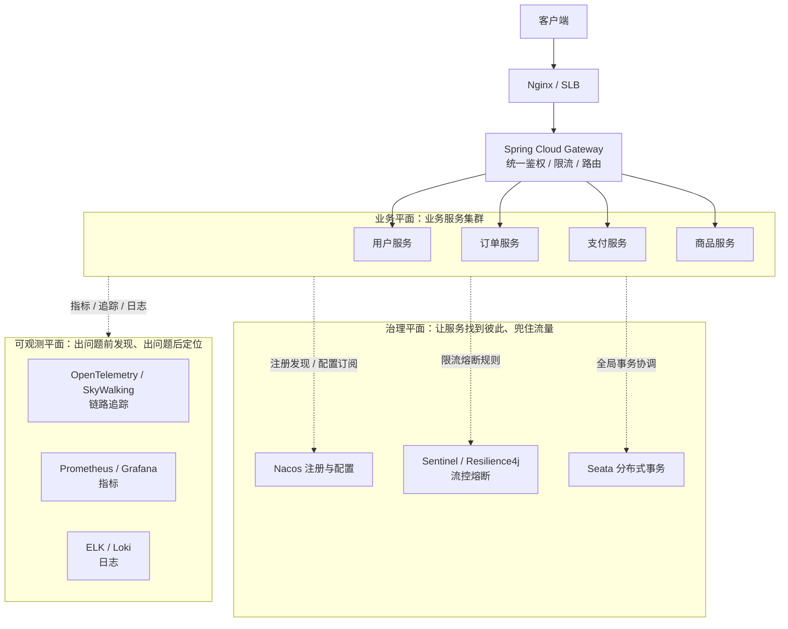

# 阶段四 · 小点 1：微服务认知与架构全景

> 所属：阶段四 微服务架构与分布式系统
> 定位：从单体到微服务，不仅是技术栈的变化，更是思维方式的转变——服务拆分、数据一致性、故障容错、链路追踪，每一个都是大坑。**先记住一个前提：微服务不是默认选项**。本讲建立「该不该拆、什么时候拆、怎么拆」的判断力，再给一张全景地图。

## 快速入门

> 本节为「微服务认知速览」：先认识微服务是什么、为什么它不是默认选项；「拆分信号、三平面全景」留在正文提高部分。

### 本讲核心关键词速查

| 关键词 | 一句话大白话 | 例子 |
|-|-|-|
| 单体 | 所有功能打包成一个应用 | 一个 jar 包含所有模块 |
| 微服务 | 按业务拆成多个独立服务 | 订单服务/库存服务 |
| 服务拆分 | 把大应用拆成小服务 | 按业务边界拆 |
| 注册中心 | 服务互相发现的「通讯录」 | Nacos |
| 网关 | 所有请求的统一入口 | 鉴权、路由 |
| 分布式事务 | 跨服务保证一致 | 下单+扣库存 |
| 模块化单体 | 单体内按模块划分，先不物理拆 | Modulith |
| 微服务不是默认 | 能单体的先单体 | 拆分有成本 |

### 本讲在解决什么问题

- **问题**：要不要把单体拆成微服务？很多人以为「微服务 = 先进 = 必须拆」。实际上**微服务不是默认选项**——它带来注册中心、分布式事务、链路追踪、运维成本一大堆麻烦。
- **你要带走的一句话**：**能单体的先单体**。微服务是「用组织复杂度换架构收益」，人不够、量不够时就是付利息不还本金。只有当出现**硬信号**（生产故障要隔离/发布互相阻塞/资源争用）才考虑拆。

### 最简示例（照抄能跑）

```text
单体（一个应用所有模块）:
  shop-app.jar
    ├── order       # 订单
    ├── inventory   # 库存
    └── user        # 用户

微服务（按业务拆成独立服务 + 注册中心）:
  order-service  ──┐
  inventory-service ─├── 注册中心(Nacos) —— 互相发现
  user-service    ──┘
  网关(所有请求入口) → 按路由转给对应服务
```

> 说明（逐行解释）：
> - **单体**：订单/库存/用户都在一个应用里，简单、好部署，但改一处要整体发版、各自资源争抢。
> - **微服务**：按业务边界拆成独立服务，各自独立部署扩容，通过注册中心互相发现，网关统一入口。
> - 拆分带来的**成本**：分布式事务（下单扣库存要一致）、链路追踪（一个请求跨多个服务）、运维复杂度——这些就是「拆分的利息」。
> - 所以前提是：**先单体，出现硬信号再拆**。这比「无脑微服务」务实得多。

### 关键概念说明

| 概念 | 干什么 | 最易踩的坑 |
|-|-|-|
| 单体 | 一个应用全包 | 简单但难独立扩容/发版 |
| 微服务 | 按业务拆分 | 要付分布式事务/追踪/运维的利息 |
| 注册中心 | 服务发现 | 选型有 AP/CP 差异 |
| 网关 | 统一入口 | 要做鉴权、限流、路由 |
| 模块化单体 | 单体内分模块 | 先划边界，别急着拆物理服务 |
| 拆分信号 | 触发拆分的开关 | 故障域隔离/发布阻塞/资源争用 |

### 常用约定 / 命名提示

- **团队规模是前提**：3 人及以下 100% 不该拆——人不够拆分就是付利息不还本金。
- **拆分顺序**：先单体 → 模块化单体（划清边界）→ 渐进拆分（按硬信号）。
- **服务拆分原则**：按限界上下文/业务边界拆（DDD，第 4 讲），别按技术层拆（如把「所有 Controller」拆成一个服务）。

## 精简大纲

1. 前提认知：微服务不是默认选项
2. 一笔成本账：单体 vs 微服务的真实开销测算
3. 微服务架构全景：业务 / 治理 / 可观测三平面
4. 什么时候才拆：三类触发信号与拆分顺序
5. 务实路线：单体 → 模块化单体 → 渐进拆分

## 学习内容详情

### 1. 前提认知：微服务不是默认选项

- 2026 年的主流认知是**「能单体的先单体」**：模块化单体（Spring Modulith）与轻量拆分在中小团队是更务实的选择。
- 微服务带来的不是「先进」，而是**一堆新问题**：服务间通信、分布式事务、链路追踪、运维复杂度——它的收益（独立部署、团队自治、故障隔离）只有在团队规模与业务复杂度真正需要时才兑现。
- **康威定律**：系统架构会复制组织的沟通结构——三个后端小组做的系统迟早长出三个「子系统」。反过来用它：想拆微服务，先看组织是否已经长出对应的团队边界；团队没变，强行拆架构只会得到一堆「伪服务」。

### 2. 一笔成本账：单体 vs 微服务的真实开销

假设一个日活 5 万的电商系统，两拨团队的两种走法：

| 成本项 | 单体（3 人维护） | 微服务（6 个服务） |
|-|-|-|
| 部署单元 | 1 个 jar，一条流水线 | 6 个镜像 × 各自流水线 |
| 一次全链路回归 | 本地起 1 个进程 | 注册中心 + 配置中心 + 网关 + 6 个服务 |
| 排查一次慢请求 | 单进程 Arthas trace | 全链路 TraceID 追踪 + 6 处日志聚合 |
| 数据一致性 | 单库事务（ACID） | Seata / 本地消息表 / Saga（第 2、3 讲） |
| 值班告警面 | 1 个服务的指标 | 6 服务 + 网关 + MQ + 注册中心的指标 |

> **结论**：微服务的每一行业务代码都没变快，变多的是「让它们协同工作」的非业务代码。这笔账在团队 < 10 人、业务域 < 3 个时，几乎总是负的。**团队规模是前提**：3 人及以下的团队 100% 不该拆——拆分是用组织复杂度换架构收益，人不够就是在付利息不还本金。

```text
拆分收益公式（直觉版）：
收益 = (独立发布的频次价值 + 故障隔离价值 + 团队并行价值)
     - (通信开销 + 数据一致性开销 + 运维平台开销)
前一项随团队与业务复杂度增长；后一项在拆分第一天就全额支付。
```

### 3. 微服务架构全景：三平面



- **业务平面**：真正写业务代码的地方，每个服务Owns 自己的数据与边界。
- **治理平面**：解决「拆开后产生的协同问题」——找到彼此（Nacos）、流量兜底（Sentinel）、跨服务事务（Seata）。本阶段第 2 讲逐个展开。
- **可观测平面**：解决「拆开后产生的定位问题」——阶段五第 4 讲展开。
- 认知锚点：**每引入一个治理组件，都是在为「拆分」这一决策付利息**。

### 4. 什么时候才拆：三类触发信号

#### 4.1 信号清单

- **组织信号**：多个团队在同一代码库上频繁冲突、发布互相阻塞（A 组的功能等 B 组的合并）。
- **架构信号**：模块边界腐化（到处跨模块调用、import 乱飞）、单模块的故障拖垮整个单体（一个 NPE 让全站重启）、单模块的资源需求与整体冲突（搜索模块要 32G 内存，其他模块 4G 够用）。
- **发布信号**：发布节奏被迫对齐——一个小功能要等大版本窗口，回滚一个 bug 要连累所有人的未发布代码。

#### 4.2 拆分顺序：先边界后服务

```text
错误顺序：上来按技术拆（user-service / common-service / api-service）
         → 得到一堆共享库 + 分布式单体

正确顺序：先在单体内按业务能力划模块（DDD 限界上下文，见第 4 讲）
       → 用包结构 + 架构测试强制边界
       → 对「变更最频繁 / 故障最独立」的边界逐个拆出
```

模块化单体的包结构长这样（Spring Modulith 风格）：

```text
com.example.shop/
├── order/                  # 订单限界上下文（模块）
│   ├── api/                #   对外暴露的接口（其他模块只准 import 这里）
│   ├── domain/             #   聚合、领域事件、仓储接口
│   └── internal/           #   模块私有实现，外部禁止访问
├── inventory/              # 库存上下文
│   ├── api/
│   └── ...
└── shared/                 # 真正全局的东西（极小：错误码、工具）
```

对应的架构测试（Modulith / ArchUnit 风格，让「越界 import」直接编译不过）：

```java
// ArchUnit：把模块边界变成可执行的规则，而不是 wiki 上的君子协定
@AnalyzeClasses(packages = "com.example.shop")
class ModuleBoundaryTest {

    @ArchTest
    static final ArchRule 模块只能通过api包对外暴露 =
        noClasses()                                   // 任何类
            .that().resideInAPackage("..order..")     // order 模块内的类
            .should().dependOnClassesThat()
            .resideInAPackage("..inventory.internal.."); // 不得触碰库存内部实现，只能经 api 包消费库存

    @ArchTest
    static final ArchRule 领域层不依赖框架 =
        noClasses()
            .that().resideInAPackage("..domain..")
            .should().dependOnClassesThat()
            .resideInAnyPackage("org.springframework.."); // 领域层保持纯净
}
```

### 5. 务实路线：单体 → 模块化单体 → 渐进拆分


- **从模块化单体走到物理拆分，触发条件是硬信号**：生产故障域需要隔离、发布互相阻塞、资源争用（对照第 4 节的信号清单）——「时间到了」「边界稳定半年」都不是理由。
- **反模式识别——分布式单体**：拆了微服务但没有自治。典型症状：改一个需求要同时发 3 个服务、服务间同步调用链拉满（一个请求串 5 个服务）、多个服务共享一个数据库。它比单体更糟：付出了网络的成本，没换来任何自治。
- **Strangler Fig（绞杀者）渐进迁移**：新旧并行，用网关按路由逐块把流量从旧系统「绞」到新实现——阶段六第 4 讲展开。

### 坑点提醒

- **拆分太早**：业务模型还没稳定（前 6-12 个月边界一直在变）就拆，等于把「最可能返工的地方」做成了「最贵返工的形态」。
- **按技术分层拆**：`web-service` / `db-service` / `common-service` 是最经典的错误拆法——服务边界没有对齐业务边界，任何需求都要跨服务改。
- **共享数据库**：两个服务读写同一个库 = 没拆。表结构一改，两个服务一起挂，这是分布式单体的最强信号。
- **把 Modulith 当过渡期敷衍**：模块内代码继续乱 import，架构测试一直红着——模块化单体的价值全在边界真实有效。

## 本节自检

- [ ] 能说清「微服务不是默认选项」的理由，以及分布式单体比单体更糟的三个症状
- [ ] 能画出三平面全景图并说出治理平面每个组件在为哪个拆分成本买单
- [ ] 能给一个真实系统判断当前是否到了拆分时机（对照三类触发信号）
- [ ] 能写出一个 ArchUnit 架构测试保护模块边界

## 本节配套思考题

1. 你现在的项目如果拆成微服务，用第 2 节的成本表算一算，哪些开销项会立刻翻倍？哪一项最先压垮团队？
2. 「先按业务能力划模块，再拆服务」和「直接按服务拆」半年后的差别是什么？提示：从边界返工成本角度想。
3. 如果团队只有 4 个后端，但业务同时有交易、履约、营销三条线，你会推荐单体、模块化单体还是微服务？为什么？
