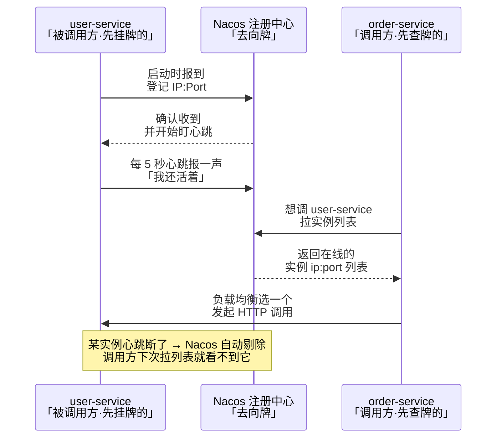
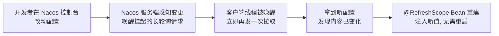
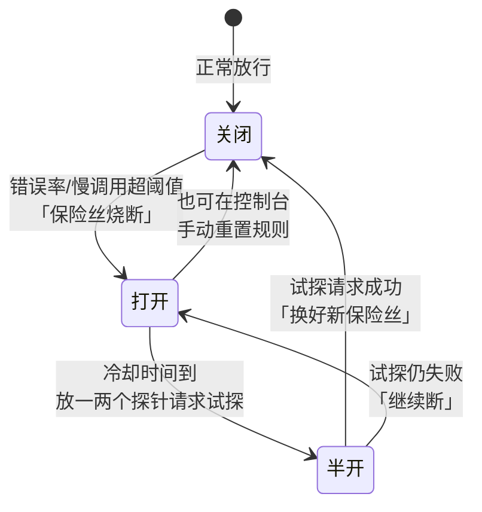
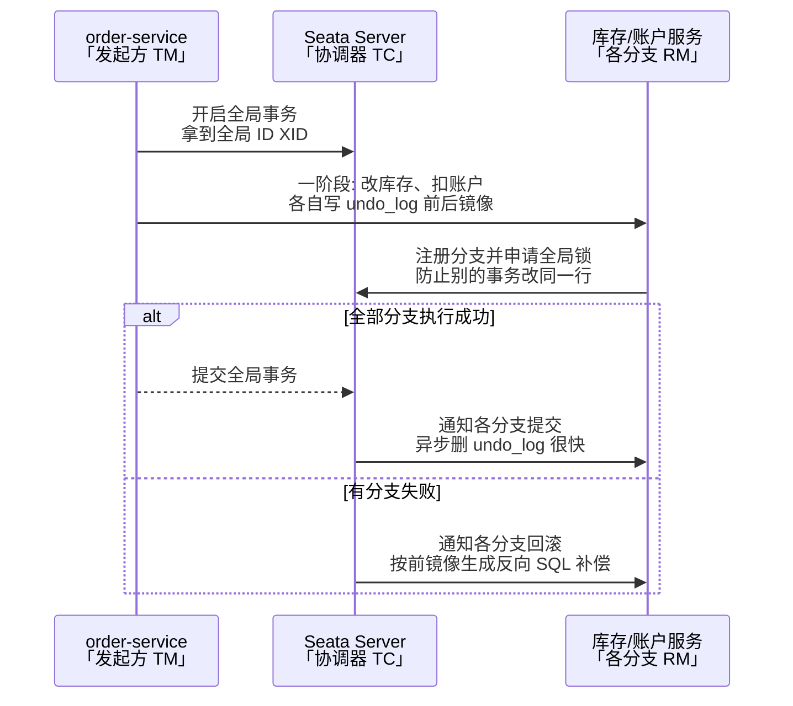
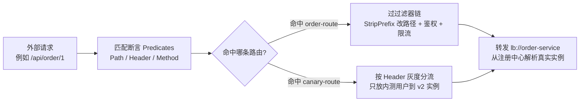

# 阶段四 · 小点 2：Spring Cloud Alibaba（Nacos / Sentinel / Seata / Gateway）

> 所属：阶段四 微服务架构与分布式系统
> 定位：国内企业主流的微服务治理全家桶。四个组件各管一段：Nacos 管「找到彼此」、Sentinel 管「流量兜底」、Seata 管「跨服务事务」、Gateway 管「统一入口」。本讲以最小可用的配置 + 代码建立手感。

> **版本红线**：Spring Cloud Alibaba / Seata / Spring Cloud / Boot 四者版本强耦合，动手前先对官方兼容矩阵；Seata 当前主线 2.x、存量项目多 1.x，undo_log 等表结构以所用版本的官方 DDL 为准——照抄博客配置前先核版本。

## 快速入门

> 本节为「微服务治理速览」：先认识四个组件各管什么、解决什么问题；「Seata 四种模式、限流算法」留在正文提高部分。

### 本讲核心关键词速查

| 关键词 | 一句话大白话 | 例子 |
|-|-|-|
| Nacos | 服务注册 + 配置（一体化） | 服务发现、动态改配置 |
| Sentinel | 流量兜底（限流、熔断） | 防大促打垮系统 |
| Seata | 分布式事务 | 跨服务下单扣库存 |
| Gateway | 网关（统一入口） | 鉴权、路由、灰度 |
| 注册中心 | 服务互相发现 | Nacos |
| 流控 / 熔断 | 控制流量 / 快速失败 | 限流、降级 |
| undo_log | Seata 回滚日志 | 自动补偿用 |
| 灰度发布 | 流量渐进切新版本 | 按 header/权重 |

### 本讲在解决什么问题

- **问题**：拆成微服务后，服务怎么互相发现（Nacos）、流量太猛怎么限流（Sentinel）、跨服务事务怎么保证（Seata）、所有请求怎么统一入口（Gateway）。
- **你要带走的一句话**：**Nacos** 管「找到彼此」，**Sentinel** 管「流量兜底」，**Seata** 管「跨服务事务」，**Gateway** 管「统一入口」——四个组件各管一段。

### 最简可运行示例（照抄能跑）

```java
// Sentinel 限流: 给一个方法加流控保护
@RestController
public class OrderController {

    @GetMapping("/seckill/{skuId}")
    @SentinelResource(value = "seckill", blockHandler = "seckillBlocked")   // 限流保护
    public String seckill(@PathVariable String skuId) {
        return "抢购成功:" + skuId;
    }

    // 兜底: 被限流时执行(签名 = 原方法参数 + BlockException 末尾)
    public String seckillBlocked(String skuId, BlockException e) {
        return "排队中, 请稍后重试";
    }
}
```

> 代码备注（逐行解释）：
> - `@SentinelResource(value="seckill", blockHandler="seckillBlocked")`：给 `seckill` 方法加 Sentinel 流控保护。
> - 触发限流时，不执行原方法，而是调用 `seckillBlocked` 兜底返回「排队中」。
> - `blockHandler` 方法签名要求：**原方法参数 + 末尾加 `BlockException`**，返回值类型一致——参数对不上会在触发时直接报错。
> - 这就是「流量兜底」：超过阈值不崩，而是优雅返回。这就是 Sentinel 的价值。

### 关键组件说明

| 组件 | 干什么 | 最易踩的坑 |
|-|-|-|
| Nacos | 注册中心 + 配置中心 | 临时实例 AP / 持久实例 CP 可切换；版本强耦合 |
| Sentinel | 流控/熔断/热点限流 | 规则默认存内存，重启丢——生产要接 Nacos 持久化 |
| Seata | 分布式事务 | AT/TCC/SAGA/XA 四种模式，选错复杂度高 |
| Gateway | 网关 | 是 WebFlux 栈（响应式、事件驱动），过滤器里**禁止阻塞调用** |
| 注册中心 | 服务发现 | 选型有 AP（临时）/CP（持久）差异 |

### 常用约定 / 命名提示

- **版本先对矩阵**：SCA / Seata / Spring Cloud / Boot 四者强耦合——动手前先查官方兼容矩阵，别照抄博客。
- **Sentinel 规则要持久化**：默认内存存，重启丢——生产必须接 Nacos/Apollo（推模式）。
- **Seata 选型**：AT 低侵入（自动补偿）、TCC 强（手写三段）、SAGA 长流程——但很多场景「本地消息表」比 Seata 更轻（阶段四第 3 讲）。

## 精简大纲

1. Nacos：注册中心 + 配置中心一体（长轮询动态刷新）
2. Sentinel：流控 / 熔断 / 热点限流 / 系统保护（对比 Resilience4j）
3. Seata：AT / TCC / SAGA / XA 四种模式与 undo_log 原理
4. Spring Cloud Gateway：路由断言 / 全局鉴权 / 灰度发布

## 学习内容详情

### 1. Nacos：注册中心 + 配置中心

- **Nacos**：一个组件同时干注册中心（服务注册与发现 Service Registry & Discovery——服务地址登记与发现）与配置中心（Configuration Center——配置集中管理与动态推送）两件事——对比 Eureka + Spring Cloud Config 的组合，运维面小一半。
- **命名空间 / 分组**：多环境（dev / staging / prod 用 namespace 隔离）与多业务线（group 隔离）的两级隔离维度。

#### 1.1 注册发现：服务上线即登记

**生活版**：公司前台有块「员工去向牌」，每个员工到岗就把名牌挂上、离岗取下；你要找人时先看牌子，就知道该打哪个电话、人还在不在——牌子与真人脱节（人走了牌没摘）会被行政纠正。

**换回技术**：这就是服务发现——服务启动时「挂牌」注册、调用方「查牌」拿实例列表、实例失联（心跳断了）自动「摘牌」剔除。Nacos 就是那块「去向牌」，`lb://` 前缀相当于「先查牌、再拨号」。



```yaml
# order-service 的 application.yml
spring:
  application:
    name: order-service        # 服务名 = 其他服务调用时用的「域名」
  cloud:
    nacos:
      discovery:
        server-addr: nacos.example.com:8848
        namespace: dev         # 环境隔离: dev 空间看不到 prod 的实例
```

```java
// 调用方不用写 IP: 从注册中心拿实例列表 + 客户端负载均衡
// pom 引入 spring-cloud-starter-loadbalancer 后, 直接用服务名发起 HTTP 调用
@RestController
class OrderController {
    private final RestClient restClient;   // Boot 3.2+ 的 HTTP 客户端

    OrderController(RestClient.Builder builder) {
        // lb:// 前缀 = 走负载均衡器解析, "user-service" 被翻译成某个真实实例的 ip:port
        // ⚠️ 注意: 这个 Builder 必须是 @LoadBalanced 修饰的 Bean 才能让 lb:// 生效, 否则只会当普通 URL 处理
        this.restClient = builder.baseUrl("lb://user-service").build();
    }

    @GetMapping("/order/{id}/user")
    String orderUser(@PathVariable Long id) {
        // 每次调用都会在多个 user-service 实例间轮询 —— 一个实例挂了, 列表自动剔除
        return restClient.get().uri("/user/" + id).retrieve().body(String.class);
    }
}
```

#### 1.2 配置动态刷新：长轮询

**生活版**：你问食堂「今天有没有红烧肉」，师傅不直接说没有，而是让你在窗口**等着**，红烧肉一出锅就立刻喊你——这比「你每隔 1 分钟跑来问一次」（纯拉取）更及时，也比「师傅同时盯着每个窗口的客人」（纯推送）省力得多。

**换回技术**：这就是长轮询——HTTP 请求「挂 30 秒」模拟出推送效果，改配置后 30s 内感知、秒级生效。

- **长轮询（long polling）**：客户端发起请求后，服务端「挂着不答」（默认 30s）——配置一变立刻返回通知，客户端再拉新配置。这是「推」与「拉」的平衡点。
- **为什么不用纯推送**：服务端要为每个客户端维护长连接，连接数随实例数线性膨胀、断线恢复也难。
- **为什么不用纯拉取**：做不到秒级生效。
- **长轮询的精髓**：连接用完即断、实现简单，配变更在 30s 内感知。**代价**：每个客户端至多一个挂起连接，对实例数可控的系统完全够用。

```yaml
spring:
  config:
    import: nacos:order-service.yaml     # 从 Nacos 拉取配置(优先级高于本地 application.yml)
  cloud:
    nacos:
      config:
        server-addr: nacos.example.com:8848
        file-extension: yaml
```

```java
@RestController
@RefreshScope        // 配置变更时, 这个 Bean 会被销毁重建以注入新值 —— 没它改了也不生效
class BannerController {
    @Value("${banner.text:默认横幅}")    // :后面是兜底值, 配置中心没有也不启动失败
    private String bannerText;

    @GetMapping("/banner")
    String banner() { return bannerText; }  // Nacos 控制台改 banner.text → 秒级生效, 无需重启
}
```



- **AP / CP 模式切换**：注册中心的一致性取舍（详见第 3 讲 CAP）——**AP**：临时实例走 Distro 协议，节点间异步同步，分区时宁可返回过期地址也要可用；**CP**：持久实例走 Raft 多数派，保证强一致不丢数据。按场景选，互联网服务默认 AP。

### 2. Sentinel：流量兜底

> **生活版——熔断为什么重要**：家里总闸的保险丝，电流一超大就自己烧断，宁可这屋断电，也别把全楼电路烧了。等故障排除，换根新保险丝重新通电。
>
> **换回技术**：这就是熔断——下游服务错误率超阈值就「断开」（快速失败、不再空耗线程），给它喘息时间；过一会儿「试探性放少量请求」，好了就恢复、没好继续断。

- **Sentinel**：阿里开源的流量防卫兵（流量兜底工具），能挡四类异常情况：
  - **流控**：挡超额流量——QPS 超过阈值就拒绝新请求，保护自己不被大促打垮。
  - **熔断降级**（Circuit Breaking & Degradation）：故障隔离——下游已挂就别再打，快速失败腾出线程。
  - **热点限流**：对参数值精准限流，如只对某个 skuId 单独限。
  - **系统自适应保护**：整体兜底——把系统整体负载当做一个资源，Load / CPU 过高就全局限流，防止「限了单个接口但整体还是被打垮」。
- **对比 Resilience4j**：Spring Cloud 官方推荐的 Resilience4j 更轻、函数式、无控制台依赖；Sentinel 强在**控制台可视化规则**与**热点参数限流**——国内业务治理用 Sentinel，轻量内嵌用 Resilience4j。



#### 2.1 资源定义与降级兜底

```java
import com.alibaba.csp.sentinel.annotation.SentinelResource;
import com.alibaba.csp.sentinel.slots.block.BlockException;

@RestController
class SeckillController {
    // @SentinelResource 把这个方法标记为"资源", Sentinel 的规则(控制台配)作用在它身上
    @GetMapping("/seckill/{skuId}")
    @SentinelResource(value = "seckill", blockHandler = "seckillBlocked")
    String seckill(@PathVariable String skuId) {
        return doSeckill(skuId);           // 正常业务逻辑
    }

    // blockHandler: 被流控/熔断拦下时走这里 —— 兜底而不是把异常抛给用户
    public String seckillBlocked(String skuId, BlockException e) {
        return "当前抢购人数过多, 请稍后再试";   // 有损服务的标准姿势: 明确提示, 不报 500
    }
}
```

- **blockHandler 签名要求**：方法签名 = 原方法参数 + 末尾追加 `BlockException`，返回值类型与原方法一致——参数对不上会在触发时直接抛异常，这是最常见的手滑。

#### 2.2 四种限流算法（Sentinel 的底层武器）

| 算法 | 原理 | 优点 | 缺点 |
|-|-|-|-|
| 固定窗口 | 每 N 秒一个计数器 | 实现最简单 | **临界突刺**：窗口交界处可放进 2 倍流量 |
| 滑动窗口 | 窗口切成小格子滚动统计 | 消除临界突刺（Sentinel 默认） | 内存与计算略重 |
| 令牌桶 | 匀速发令牌，桶满丢弃 | **允许突发**（攒的令牌一次用完），网关常用 | 需要稳定的发令牌时钟 |
| 漏桶 | 恒定速率流出 | 输出绝对匀速，保护脆弱下游 | 无法应对合理突发 |

> 选型口诀：**网关挡总量用令牌桶，业务资源保护用滑动窗口，保护第三方脆弱接口用漏桶**。四算法的完整对比在阶段六高可用（03 讲）还会从 SLO 视角再过一遍。

### 3. Seata：跨服务事务

- **Seata**：分布式事务协调框架。**TC（事务协调器）** 是独立部署的协调进程，**TM（事务管理器）** 是发起全局事务的一端，**RM（资源管理器）** 是各参与服务的数据库代理。

#### 3.1 四种模式选型表

| 模式 | 机制 | 侵入性 | 适用 |
|-|-|-|-|
| **AT**（默认） | 代理数据源自动记录 undo_log，回滚时反向补偿 | **零侵入** | 大部分短事务 |
| **TCC** | 业务手写 Try（预留）/ Confirm（提交）/ Cancel（释放） | 高（每接口三方法） | 精细控制资源预留（金融扣款） |
| **SAGA** | 长流程编排，每个正向步骤配一个补偿 | 中 | 长事务、跨企业调用 |
| **XA** | 数据库原生两阶段提交 | 低 | 强一致要求、并发低 |

> ⏸️ **短期可以不学**：XA 模式——它靠数据库原生两阶段提交保强一致，代价是全程持有数据库锁、并发极低，工程里实际使用率很低，Seata 的 XA 方案也不推荐优先考虑。**何时回来学**：业务真要求数据库级强一致短事务、又接受低并发时。**面试最低要求**：知道 XA 是「数据库原生 2PC」、Seata 只做协调方，以及它为什么并发低。
>
> ⏸️ **短期可以不学**：TCC 的手写实现（每个接口拆 Try/Confirm/Cancel 三方法）——侵入性高、心智负担重，没有资金级资源预留需求时用不上。**何时回来学**：要处理「热点行扣减、SQL 无法自动回滚」这类 AT 覆盖不了的资金场景时。**面试最低要求**：说出 TCC 三阶段机制（预留/确认/释放）与适用场景，能放进方案对比里选型即可。

#### 3.2 AT 模式实战

```yaml
# order-service 的 application.yml
seata:
  enabled: true
  application-id: order-service
  tx-service-group: shop_tx_group     # 事务组: 同一业务链路的服务配同一个组名
  service:
    vgroup-mapping:
      shop_tx_group: default          # 组 → TC 集群的映射
  # AT 模式下每个参与库都要建 undo_log 表(见下方 DDL)
```

```sql
-- 每个参与 AT 事务的数据库都需要这张表: 一阶段执行 SQL 时同步写入前后镜像(官方结构)
CREATE TABLE undo_log (
    id            BIGINT       NOT NULL AUTO_INCREMENT,   -- 自增主键
    branch_id     BIGINT       NOT NULL,                  -- 分支事务 ID
    xid           VARCHAR(100) NOT NULL,                  -- 全局事务 ID(由发起方生成, 跨服务透传)
    context       VARCHAR(128) NOT NULL,                  -- 回滚上下文(如序列化器)
    rollback_info LONGBLOB     NOT NULL,                  -- 前后镜像: 回滚时按它生成反向 SQL
    log_status    INT          NOT NULL,                  -- 0 正常 1 全局已完成
    log_created   DATETIME(6),                            -- 创建时间
    log_modified  DATETIME(6),                            -- 修改时间
    PRIMARY KEY (id),
    UNIQUE KEY ux_undo_log (xid, branch_id)               -- 唯一键: 一事务分支一条
);
```
> **注意**：`undo_log` 表结构以 Seata 官方为准（`id` 自增主键 + `UNIQUE(xid, branch_id)`，并含 `context`/`log_created`/`log_modified` 列）；别凭记忆建表。

```java
@Service
class OrderService {
    // @GlobalTransactional: 开启全局事务 —— 跨服务的 @Transactional
    // 下游服务(库存/账户)通过 XID 透传自动加入同一全局事务
    @GlobalTransactional(rollbackFor = Exception.class)
    public void placeOrder(Long skuId, int count) {
        orderMapper.insert(buildOrder(skuId, count));      // 本地事务①: 订单库
        inventoryClient.deduct(skuId, count);              // 远程调用②: 库存服务(也是分支事务)
        accountClient.charge(currentUserId(), price(count)); // 远程调用③: 账户服务
        // 任何一步抛异常 → TC 通知所有分支按 undo_log 反向补偿回滚
    }
}
```

#### 3.3 AT 的原理与边界（面试高频）



> **生活版——回滚像「撤销记账」**：Excel 里改账目前先按 Ctrl+Z 前存一份快照，后面算错了按快照把数改回去。AT 的 undo_log 就是这份「可撤销的快照」。
>
> **换回技术**：一阶段写前后镜像 = 记快照；二阶段失败时按前镜像生成反向 SQL = 执行撤销。

- **一阶段**：代理数据源拦截业务 SQL → 解析出「前镜像 / 后镜像」写入 undo_log → 执行 SQL → **注册分支到 TC 并申请全局锁** → 本地事务提交。
- **二阶段**：全局提交 → 异步删 undo_log（很快）；全局回滚 → 按前镜像生成反向 SQL 补偿 + 校验后镜像（防别人改过）。
- **全局锁**：分支事务修改行前要向 TC 申请该行的全局锁，防止**另一个全局事务**同时改同一行造成脏写。
- **AT 不适用的场景（换 TCC）**：全局锁竞争激烈的热点行（秒杀库存单行）；SQL 无法自动回滚的操作（DDL、存储过程、事务里夹外部 RPC）。

### 4. Spring Cloud Gateway：统一入口

> **生活版**：写字楼只有一个大堂前台——所有访客都先到这报到，前台先看工牌（鉴权）、再按「约了谁」帮你转语音（路由），还能把「老熟人」直接带去新装修的楼层（灰度）。

> **换回技术**：Gateway 就是一个应用层「前台」——所有外部流量从它进，先匹配断言（约了谁）、再按顺序过过滤器链（鉴权/限流/改写），最后转发到对应服务。



- **Gateway**：基于 WebFlux 的 API 网关（API Gateway）——所有外部流量统一入口，做路由、鉴权、限流、灰度发布（Canary Release，流量渐进切到新版本，错了能立刻切回）。

#### 4.1 路由 = 断言 + 过滤器

```yaml
spring:
  cloud:
    gateway:
      routes:
        - id: order-route                    # 路由 ID(唯一)
          uri: lb://order-service            # lb:// = 从注册中心解析并负载均衡
          predicates:
            - Path=/api/order/**             # 断言: 什么请求匹配这条路由
          filters:
            - StripPrefix=1                  # 过滤器: 去掉路径第 1 段(/api/order/x → /order/x)
        - id: canary-route                   # 灰度路由: 按 header 把内测流量切到 v2 实例
          uri: lb://order-service-v2
          predicates:
            - Path=/api/order/**
            - Header=X-Gray, true            # 带这个 Header 的请求才走 v2
```

#### 4.2 全局鉴权过滤器

```java
import org.springframework.cloud.gateway.filter.*;
import org.springframework.stereotype.Component;
import reactor.core.publisher.Mono;

@Component
class AuthFilter implements GlobalFilter, org.springframework.core.Ordered {
    // GlobalFilter 对所有路由生效 —— 网关统一验 token, 下游服务信任网关透传的身份头
    @Override
    public Mono<Void> filter(ServerWebExchange exchange, GatewayFilterChain chain) {
        String token = exchange.getRequest().getHeaders().getFirst("Authorization");
        if (token == null || !verifyJwt(token)) {           // 验签失败 → 401, 请求到此为止
            exchange.getResponse().setStatusCode(org.springframework.http.HttpStatus.UNAUTHORIZED);
            return exchange.getResponse().setComplete();
        }
        // 验签通过: 把解析出的用户身份塞进 Header 传给下游(下游不再重复验签)
        var mutated = exchange.mutate()
            .request(r -> r.headers(h -> h.set("X-User-Id", parseUserId(token))))
            .build();
        return chain.filter(mutated);                       // 放行到匹配的路由
    }

    @Override public int getOrder() { return -1; }          // 数字越小越先执行(要在路由转发前)
    private boolean verifyJwt(String t) { return t.startsWith("Bearer "); } // 演示用占位验签
    private String parseUserId(String t) { return "u-1001"; }
}
```

### 坑点提醒

- `@RefreshScope` 忘加：Nacos 配置改了但 Bean 不重建，值永远停在启动时刻——新值只对**新创建**的 Bean 生效。
- Seata AT 的 `undo_log` 表只在**一阶段写入又提交**——如果本地事务里夹了外部 RPC 且后续回滚，外部调用无法被反向补偿（AT 只管数据库）。
- Sentinel 规则默认存内存，重启即丢——生产必须接 Nacos / Apollo 做规则持久化（推模式，数据源配置以官方文档为准），否则限流规则跟着发布走丢。
- Gateway 是 WebFlux 技术栈：**过滤器里禁止任何阻塞调用**（JDBC / 同步 HTTP），一处阻塞全网关卡死——这呼应阶段二第 4 讲的响应式纪律。
- 灰度路由的断言顺序：具体规则（灰度）要放在通用路由**之前**，否则通用路由先匹配走，灰度永远不生效。

## 本节自检

- [ ] 能讲清 Seata AT 模式怎么用 undo_log 实现回滚，什么场景 AT 不适用要换 TCC？
- [ ] 一次跨 3 个服务的下单流程，你选 Seata、Saga 还是本地消息表，为什么？
- [ ] 能说出 Nacos 长轮询动态刷新的机制，以及 AP / CP 模式的选择依据
- [ ] 能写出一个带鉴权与灰度路由的 Gateway 配置
- [ ] 能对比四种限流算法的优劣，并说清 Sentinel 与 Resilience4j 的选型

## 本节配套思考题

1. `@GlobalTransactional` 的回滚依赖下游分支事务注册——如果下游服务在远程调用后、注册前就宕机了，这条「悬挂」的本地事务怎么办？提示：从 TC 的超时回滚与 undo_log 校验想。
2. 网关鉴权把用户身份透传给下游，下游完全信任 `X-User-Id` 头——如果有人绕过网关直接访问服务实例（K8s 内网），这个信任模型就破了。你会怎么补这个洞？
3. Sentinel 的滑动窗口把 1 秒切成 2 个 500ms 格子，临界突刺真的完全消除了吗？格子数越多越精确，代价是什么？

## 常见面试题

### Q1：Nacos 注册中心的工作原理是什么？为什么它能在 AP 和 CP 之间切换？
**答**：
**标准结论**：注册中心解决「服务怎么互相发现」——服务启动时把 IP:Port 注册到 Nacos，下线时注销；调用方通过服务名从 Nacos 拉实例列表，配合客户端负载均衡（lb://）选一个实例调用，实例挂了会被剔除。

**原理层**：Nacos 分两类实例——
- 临时实例走 **AP**（Distro 协议，节点间异步同步，分区时宁可返回过期地址也要可用）——适合注册中心：「查到过期地址」比「查不到服务」危害小。
- 持久实例走 **CP**（Raft 多数派，保证强一致）——适合配置这类必须不丢的数据。

**工程层**：互联网服务默认用临时实例（AP）；选型时记住 CAP——注册中心要 AP，协调器（选举/锁）要 CP，Nacos 一个组件两头通吃是它的核心卖点。

### Q2：Sentinel 的限流、熔断、降级有什么区别？Sentinel 和 Hystrix / Resilience4j 怎么选？
**答**：
**标准结论**：三个词解决不同问题——
- **限流**：「挡超额流量」——QPS 或并发数超阈值就拒绝新请求，保护自己不被打垮。
- **熔断**：「下游故障时快速失败」——错误率/慢调用率超阈值就打开开关，一段时间内不再调用下游，让它喘息（类似家里的保险丝）。
- **降级**：「系统压力大时主动舍弃非核心功能」——比如大促时把「积分明细」降级成「稍后可见」，保住下单主链路。

**原理层**：选型要分清阵营——
- Hystrix 已停更，不要用。
- **Sentinel** 强在控制台可视化规则、热点参数限流、规则持久化，国内业务治理首选。
- **Resilience4j** 更轻、函数式、无控制台依赖，适合轻量内嵌。

**工程层**：生产上规则必须持久化到 Nacos/Apollo，否则重启即丢。

### Q3：Seata 的四种分布式事务模式怎么选？为什么很多场景优先选本地消息表？
**答**：
**标准结论**：四种模式按「一致性强度 vs 侵入性」排——
- **AT**：零侵入、靠 undo_log 前后镜像自动回滚，适合大部分短事务，但热点行有全局锁竞争。
- **TCC**：手写 Try/Confirm/Cancel 三方法，侵入高但能精细控制资源预留（资金扣减）。
- **SAGA**：适合长流程、每步配补偿。
- **XA**：数据库原生 2PC、强一致但并发极低。

**原理层**：AT 用「数据库代理 + 全局锁」把回滚变成自动的，本质仍是补偿思想。

**工程层**：很多跨服务场景要的只是最终一致——本地消息表（业务表+消息表同库同事务+MQ 异步投递）成本比 Seata 低一个量级、不引入 TC 和全局锁。先问「是否真的需要全局事务」，再谈 Seata 选型。

### Q4：Spring Cloud Gateway 的工作原理是什么？它和 Nginx 有什么分工？
**答**：
**标准结论**：Gateway 基于 WebFlux 响应式栈，核心模型是「路由 = 断言 + 过滤器」——请求进来，先被一组断言匹配（Path、Header、Method 等），命中后按顺序过过滤器链（StripPrefix 改写路径、鉴权、限流），最后转发到 lb:// 解析出的真实实例。

**原理层**：过滤器分两条线——
- **GatewayFilter**（路由级）与 **GlobalFilter**（全局级），用 `Order` 控制执行顺序。

**工程层**：与 Nginx 的分工——
- Nginx 在流量入口做 L4/L7 转发、静态资源、最外层防护，属于基础设施。
- Gateway 在应用层做业务相关的统一处理（JWT 鉴权、灰度路由、按服务路由），能直接读注册中心。
- **工程铁律**：Gateway 是响应式线程模型，过滤器里禁止任何阻塞调用（JDBC/同步 HTTP），否则一个阻塞就卡死全网。
