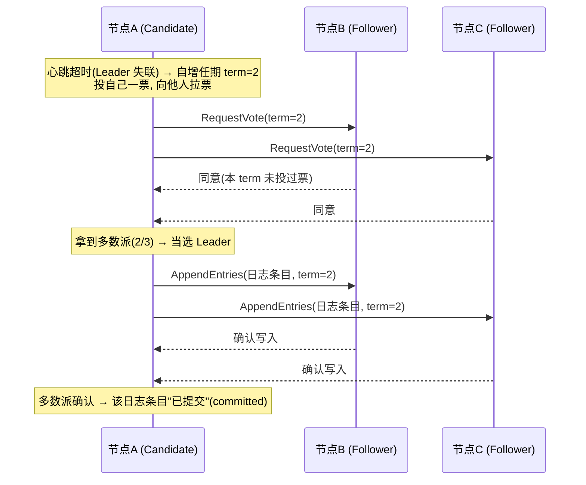

# 阶段四 · 小点 3：分布式核心理论（CAP / BASE / Raft / ID / 锁）

> 所属：阶段四 微服务架构与分布式系统
> 定位：组件会过时，理论不会。这一讲是后面所有分布式组件（注册中心 / 配置中心 / 分布式事务 / 分布式锁）选型的「为什么」。本讲以推演和代码为主——CAP 用一次「两节点脑裂」的完整推演讲透，Raft 用选举时序图讲清。

## 快速入门

> 本节为「分布式理论速览」：先认识几个高频词在说什么；「CAP 推演、Raft 选举」留在正文提高部分。

### 本讲核心关键词速查

| 关键词 | 一句话大白话 | 例子 |
|-|-|-|
| CAP | 分布式系统一致性 C / 可用性 A / 分区容错 P 的取舍 | 网络分区时选 C 或 A |
| BASE | 最终一致（AP 路线的工程化） | 允许短暂不一致，最终收敛 |
| Raft | 一致性算法（选主 + 日志复制） | etcd / Nacos CP 的底座 |
| 分布式事务 | 跨节点保证一致 | 下单扣库存 |
| 本地消息表 | 最终一致的最小可行方案 | 业务表 + 消息表同事务 |
| 雪花算法 | 分布式唯一 ID | 不冲突、时间就近 |
| 分布式锁 | 跨节点互斥 | 减库存 |
| 脑裂 | 节点分裂导致数据撕裂 | quorum 仲裁防 |

### 本讲在解决什么问题

- **问题**：分布式系统里，网络可能分区、节点可能挂。怎么选一致性、怎么生成唯一 ID、怎么加分布式锁？这些是选型背后的「为什么」。
- **你要带走的一句话**：**CAP** 是「网络分区时要在一致性和可用性之间取舍」；**BASE** 是最终一致的工程化。真实业务多用最终一致（本地消息表/事务消息），别迷信"强一致"。

### 最简可运行示例（照抄能跑）

```java
// 雪花算法生成分布式唯一 ID(避免跨实例自增撞号)
public class SnowflakeIdGenerator {
    private final long epoch = 1735689600000L;   // 起始时间戳(自定义)
    private long lastTimestamp = -1L;
    private long sequence = 0L;

    public synchronized long nextId() {
        long ts = System.currentTimeMillis();
        if (ts == lastTimestamp) {
            sequence = (sequence + 1) & 4095;     // 12 位序列
            if (sequence == 0) ts = waitNextMillis(ts);  // 序列用尽,等下一毫秒
        } else {
            sequence = 0;
        }
        lastTimestamp = ts;
        return ((ts - epoch) << 22) | (machineId << 12) | sequence;  // 时间戳+机器+序列
    }
}
```

> 代码备注（逐行解释）：
> - 雪花算法的核心：**64 位 ID = 时间戳(41位) + 机器ID(10位) + 序列号(12位)**。
> - `sequence = (sequence + 1) & 4095`：同一毫秒内递增序列，最多 4096 个。
> - 序列用尽（`sequence == 0`）时等下一毫秒。
> - 所以同一毫秒同一机器最多生成 4096 个 ID，跨机器靠 machineId 区分，**全局唯一**。
> - 为什么不用 UUID 做主键：无序（页分裂）+ 太长（索引体积大）——这就是雪花算法/号段方案的价值。

### 关键概念说明

| 概念 | 干什么 | 最易踩的坑 |
|-|-|-|
| CAP | C/A/P 取舍 | 分区必发生，只能 C 或 A 二选一 |
| BASE | 最终一致 | 大多数业务够用，别迷信强一致 |
| Raft | 共识算法 | etcd/Nacos CP 底座 |
| 雪花算法 | 分布式 ID | **团队 EPOCH 必须统一**，两套必撞 |
| 本地消息表 | 最终一致 | 比 Seata 更轻（有 MQ 就能用） |
| 分布式锁 | 跨节点互斥 | 资金级用 ZK/etcd，普通用 Redis |

### 常用约定 / 命名提示

- **主键别用 UUID**：页分裂 + 索引大；用雪花算法或号段（阶段四第 3 讲、SpringCloudAlibaba 有自己的 ID 生成）。
- **分布式锁选型**：性能优先用 Redis（Redisson），正确性优先（资金）用 ZK/etcd 或加 fencing token。
- **最终一致优先**：跨服务业务能用「本地消息表」就别上 Seata——成本低一个量级（正文对比表）。

## 精简大纲

1. CAP：分区容忍不可放弃，C 与 A 的取舍（含两节点脑裂推演）
2. BASE：柔性事务的理论基础
3. 本地消息表：最终一致的最小可行方案（BASE 的工程化落地）
4. 一致性算法：Raft 的选举与日志复制
5. 分布式 ID：雪花算法（含 Java 实现）/ 号段 / UUID 为什么不行
6. 分布式锁选型：Redis vs Zookeeper vs 数据库

## 学习内容详情

### 1. CAP：一次脑裂推演

- **CAP**：分布式系统在一致性（Consistency）、可用性（Availability）、分区容忍性（Partition tolerance）三者中最多同时满足两个。
- **P 为什么不可放弃**：网络分区（节点间失联）在分布式系统里**必然发生**——网线会断、交换机会重启、跨机房光缆会被挖断。P 不是「选项」，是物理世界的既定事实；所以真正的取舍只在 **C 与 A 之间**，且只在分区发生的时刻需要选。

#### 1.1 两节点脑裂推演

```text
设定：订单库主从两个节点，用户正在下单。

T0  正常状态: 主(M)接受写入, 从(S)同步复制, 读写都正常
T1  网络分区发生: M 和 S 互相失联(但都活着, 都能被部分客户端访问)

    分区后必须立刻做选择 ——

    选 C(拒绝部分写): M 检测到 S 失联 → 拒绝新写入 → 客户端收到报错
        → 数据永远一致, 但分区期间下单功能不可用

    选 A(继续写): M 继续接受写入, S 也可能被提升为新主接受写入
        → 服务不中断, 但分区恢复后两边数据有冲突要合并
        → 合并失败的那部分订单 = 丢了 / 重复了
```

#### 1.2 业务怎么选

- **选 C（宁可拒绝服务）**：账务、库存扣减——「返回旧数据 / 丢单」比「暂时下不了单」更危险。库存超卖一个的代价 >> 页面报错一次。
- **选 A（继续响应）**：缓存、推荐、内容——短暂不一致可接受，完全不可用不可接受。
- **组件定位**：ZooKeeper 是 **CP**——CP 的代价是分区时少数派整体不可用，这正是它适合做协调器（选举 / 配置）而不适合做注册中心（要 AP）的原因（结论对，但要知道为什么）；Eureka 是 **AP**（宁可返回过期地址）、Nacos 可切换（临时实例 AP / 持久实例 CP，第 2 讲）。

### 2. BASE：AP 路线的工程化

- **BASE**：**基本可用**（Basically Available，降级而非不可用）+ **软状态**（Soft state，允许中间态）+ **最终一致性**（Eventually consistent，停止写入后一段时间达成一致）——它是 CAP 中选 A 之后的工程补全：放弃强一致，但把「不一致的窗口和补偿」管理起来。
- 与 ACID 的关系：不是对立而是分工——单库事务用 ACID（阶段三第 1 讲），跨服务用 BASE + 补偿（Seata AT / 本地消息表 / Saga 都是 BASE 的实现形态——本地消息表下一节展开，其余见第 2 讲与第 5 讲）。

### 3. 本地消息表：最终一致的最小可行方案

- **动机**：不引入 TC 组件与全局锁，只依赖「本地事务 + MQ」——中小企业使用率最高的最终一致方案，学它优先于学 Seata（第 2 讲）。
- **做法（4 步）**：

```text
① 业务表与消息表同库同事务写入 —— 原子性交给本地事务, 要么都在要么都没
② 事务提交后立即尝试投递 MQ; 定时任务轮询消息表兜底(status / retry_count 字段驱动)
③ 消费方以业务键幂等 —— 业务键唯一索引 / 去重表, 扛住「至少一次」投递
④ 投递成功更新状态; 失败按 next_retry_at 退避重试, 超过阈值转死信并告警
```

- **表结构 sketch**（一行式）：`msg_id`（主键）｜`biz_type`（业务类型）｜`payload`（JSON 消息体）｜`status`（0 待投 / 1 已投）｜`retry_count`（已重试次数）｜`next_retry_at`（下次重试时间）
- **与其他方案选型对比**：

| 方案 | 一致性 | 侵入性 | 成本 | 适用 |
|-|-|-|-|-|
| **本地消息表** | 最终一致 | 低 | 低 | 有 MQ 就能用——大多数跨服务业务 |
| Seata AT（第 2 讲） | 偏强 | 低 | 高——TC 运维 + 全局锁 | 短事务 |
| TCC（第 2 讲） | 强 | 高——三接口 | 高 | 资金级精细控制 |
| Saga（第 2 讲） | 最终一致 | 中 | 中 | 长流程、跨企业 |
| 最大努力通知 | 弱 | 低 | 低 | 通知类（短信 / 对账回调） |

### 4. Raft：共识算法的工业标准

- **Raft**：让一组节点对「同一份日志」达成一致的算法——注册中心、配置中心、协调器的底层依赖。只干两件事：**选 Leader** 和 **复制日志**。



- **任期（term）**：Raft 的逻辑时钟，单调递增；看到更高 term 的消息立刻认怂（更新自己的 term 并转为 Follower）——这是防止旧 Leader 复活后捣乱的机制。
- **多数派（quorum）**：`N/2 + 1`——3 节点容忍 1 台故障，5 节点容忍 2 台。**脑裂时少数派无法凑够多数派确认，永远不会提交脏数据**——这就是共识算法对脑裂的防御。
- 各组件实现：ZooKeeper 用 **ZAB**（Raft 同族）、etcd / Nacos CP 模式 / Kafka KRaft 用 **Raft**——记住「共识算法的事实标准就是 Raft 系」即可，能讲清选举 + 复制就够了。

### 5. 分布式 ID

分库分表后自增主键会重复（每个分片都有自己的自增序列），需要全局唯一 ID。

#### 5.1 雪花算法（Snowflake）

- **雪花算法**：64 位整数 = 时间戳 + 机器 ID + 序列号的组合——本地生成（不依赖中心服务）、趋势递增（对 B+ 树友好）。最大的坑是**时钟回拨**（NTP 校时把机器时间往回调 → 可能生成重复 ID）。

```java
/**
 * 雪花算法最小实现：理解 64 位怎么分配比背代码重要。
 * 0 | 41 位时间戳 | 10 位机器ID | 12 位序列号
 *   41 位毫秒 ≈ 69 年；10 位 = 1024 台机器；12 位 = 每毫秒 4096 个 ID/台
 * 理论上限: 1024 台 × 4096/ms ≈ 4.19 亿 ID/秒 —— 对绝大多数系统绰绰有余
 */
public class Snowflake {
    private static final long EPOCH = 1_735_689_600_000L; // 2025-01-01 起算, 减小时间戳数值
    private static final long MACHINE_ID_BITS = 10L;      // 机器位宽度
    private static final long SEQUENCE_BITS = 12L;        // 序列号位宽度

    private static final long MAX_MACHINE_ID = ~(-1L << MACHINE_ID_BITS); // 1023
    private static final long SEQUENCE_MASK  = ~(-1L << SEQUENCE_BITS);   // 4095

    private final long machineId;
    private long sequence = 0L;
    private long lastTimestamp = -1L;                     // 上次生成时间: 检测时钟回拨的关键

    public Snowflake(long machineId) {
        if (machineId < 0 || machineId > MAX_MACHINE_ID)
            throw new IllegalArgumentException("machineId 必须在 0~" + MAX_MACHINE_ID);
        this.machineId = machineId;                       // 机器 ID 由部署平台分配(K8s StatefulSet 序号)
    }

    public synchronized long nextId() {
        long now = System.currentTimeMillis();

        if (now < lastTimestamp) {                        // ← 时钟回拨! 最危险的分支
            // 务实做法: 回拨小(如 <5ms)就自旋等待时钟追上; 回拨大就抛异常报警
            throw new IllegalStateException("时钟回拨 " + (lastTimestamp - now) + "ms, 拒绝发号");
        }

        if (now == lastTimestamp) {
            sequence = (sequence + 1) & SEQUENCE_MASK;    // 同一毫秒内递增序列号
            if (sequence == 0)                            // 4096 个用完了 → 等下一毫秒
                now = waitNextMillis(lastTimestamp);
        } else {
            sequence = 0L;                                // 新毫秒, 序列号归零
        }
        lastTimestamp = now;

        return ((now - EPOCH) << (MACHINE_ID_BITS + SEQUENCE_BITS))  // 时间戳放高位
             | (machineId << SEQUENCE_BITS)                          // 机器 ID 放中段
             | sequence;                                             // 序列号放低位
    }

    private long waitNextMillis(long last) {
        long now = System.currentTimeMillis();
        while (now <= last) now = System.currentTimeMillis();  // 自旋到下一毫秒
        return now;
    }
}
```

- **EPOCH 纪元**：选近期固定日期（如 2025-01-01）只是让时间戳位数值小一点，关键是**团队必须统一 EPOCH**——两套 EPOCH 的服务混在一起必撞 ID。
- **号段模式（Leaf）**：发号服务一次从 DB 批量取一个号段（如 1~1000）缓存在本地慢慢发——DB 尶时也扛得住（发号频次骤降千倍），但 DB 仍是指望，只是压力小一个数量级。

#### 5.2 UUID 为什么不适合做主键

```sql
-- UUID 是 128 位随机字符串(如 550e8400-e29b-...), 做主键有两个结构性问题:
-- ① 无序 → 每次插入的 B+ 树落点随机 → 频繁页分裂(数据页不满就被劈开)
--    反之自增 ID 永远追加到最右页, 页写满才开新页 —— 这就是"对 B+ 树友好"
-- ② 36 字符字符串 → 索引体积大(所有二级索引的叶子都存主键) → 内存能缓存的页变少
-- 工程结论: 全局唯一交给雪花算法; UUID 只用于无序要求场景(如追踪 ID)
```

### 6. 分布式锁选型

| 方案 | 优势 | 劣势 | 场景 |
|-|-|-|-|
| Redis（Redisson） | 性能高 | 主从切换瞬间可能丢锁（RedLock 有争议，阶段三第 4 讲展开过结论） | 性能优先的大多数业务 |
| Zookeeper | 可靠（临时节点 + 会话：持锁者宕机会话结束，锁自动释放） | 性能低一个量级（写走 ZAB 多数派） | 正确性优先 |
| 数据库 | 简单、无新组件 | 并发低、锁表风险 | 低并发兜底（如防重复初始化） |

```sql
-- 数据库锁的最小实现: 唯一索引即锁(插入成功 = 抢到锁)
CREATE TABLE dist_lock (
    lock_key  VARCHAR(64) PRIMARY KEY,   -- 锁名: 主键冲突 = 别人持有
    owner     VARCHAR(64) NOT NULL,      -- 持有者标识(释放前校验, 防误删他人的锁)
    expires_at DATETIME NOT NULL         -- 过期时间: 持有者宕机后锁能自动"腐朽"
);
-- 拿锁: INSERT 成功即持有; 释放: DELETE WHERE lock_key=? AND owner=?(校验属主)
-- 任务结束必须删, 且删之前校验 owner —— 和 Redis SETNX + Lua 校验属主是同一个模式
```

> 选型口诀：**性能优先用 Redis、正确性优先用 ZK、低并发偷懒用 DB**——多数业务场景 Redisson 单实例够用；资金级强一致（锁丢失 = 直接资损）要上 ZK / etcd 或加 fencing token 兜底（结论沿用阶段三第 4 讲，此处不重复展开 RedLock 争议）。

### 坑点提醒

- **把 ZK / etcd 当高可用注册中心**：它们是 CP——网络分区时少数派节点不可用，注册中心「查不到服务」比「查到过期地址」更致命，所以 Eureka / Nacos(AP) 才是注册中心的常态选择。
- **雪花算法机器 ID 手工配置**：两台机器配了同一个 ID → 大规模 ID 重复。机器 ID 必须由部署平台统一分配（K8s StatefulSet 序号 / 注册中心自动领号）。
- **时钟回拨只处理「抛异常」**：抛异常等于发号服务不可用——至少对小回拨做自旋等待 + 对大回拨做告警降级（切备用号段）。
- **用 UUID 做主键还怪索引慢**：先查主键类型，随机写入的页分裂是结构性问题，调参数救不了。

## 本节自检

- [ ] 能回答：CAP 的 P 为什么不可选？分区发生时你系统选 C 还是 A，依据是什么？
- [ ] 能完整复述两节点脑裂推演，并说出选 C 与选 A 各自的业务代价
- [ ] 能画出本地消息表的 4 步流程，并说清它与 Seata AT / TCC / Saga / 最大努力通知的适用边界
- [ ] 能讲清 Raft 选举 + 日志复制的流程，以及脑裂时为什么少数派自动失效
- [ ] 能画出雪花算法的 64 位分配图，并解释时钟回拨问题与应对
- [ ] 能解释 UUID 为什么不适合做主键（页分裂 + 索引体积两个理由）

## 本节配套思考题

1. Kafka 的 ISR（副本同步集合）和 Raft 的多数派提交，都是「凑够 N 个确认才算成功」——它们各自牺牲了什么换来了什么？提示：ISR 允许动态成员，多数派要求固定多数。
2. 如果让你给「用户头像 CDN 地址」设计 ID，用雪花还是 UUID？给「订单号」呢？判断依据是什么？
3. 数据库锁的 `expires_at` 过期后没人清理，这把「僵尸锁」怎么破？提示：谁抢到谁清理 + 事务化「检查 + 夺锁」。
