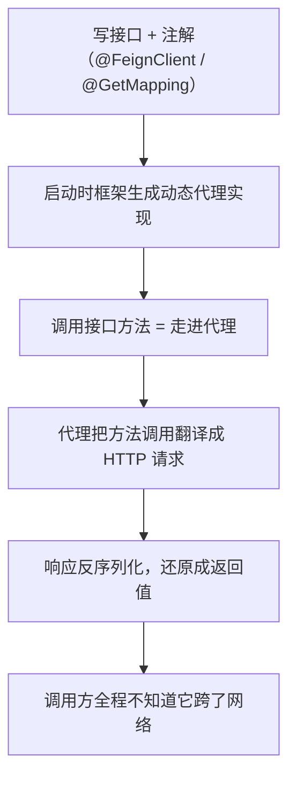
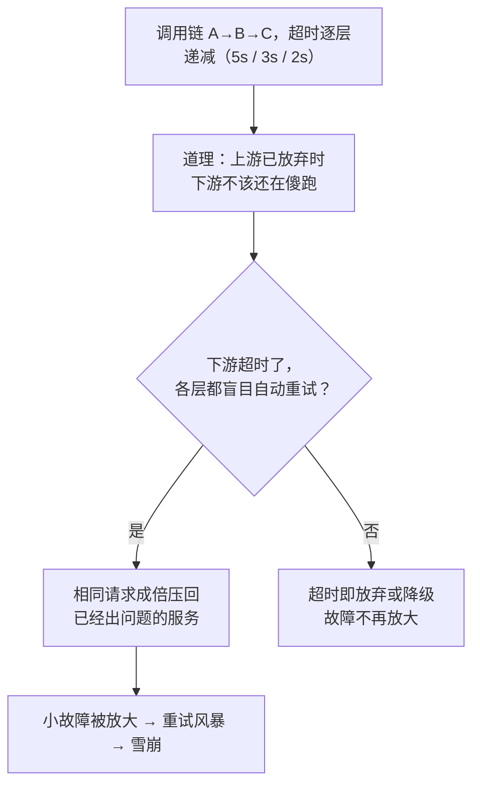
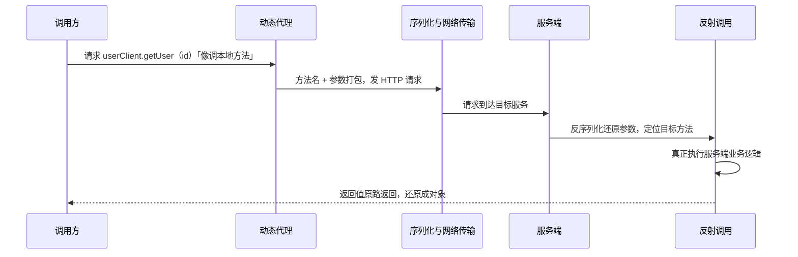
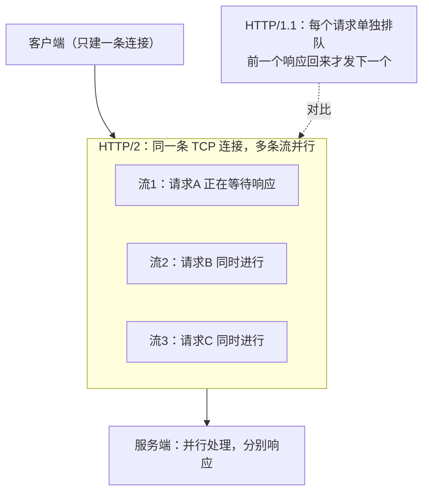
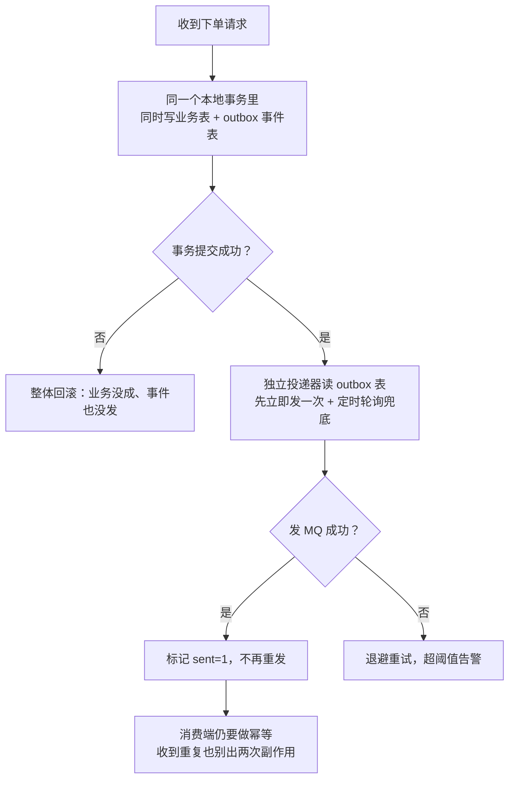

# 阶段四 · 小点 5：服务间通信与 RPC

> 所属：阶段四 微服务架构与分布式系统
> 定位：拆了服务就得回答「它们怎么说话」。同步（HTTP / RPC）与异步（事件）两条路线，加上各自的可靠性纪律——**通信的坑不在「怎么发」，在「超时了怎么办、重试了会不会重」**。

## 快速入门

> 本节为「服务通信速览」：先认识服务间通信的两种方式、几个核心概念；「Outbox、服务网格」留在正文提高部分。

### 本讲核心关键词速查

| 关键词 | 一句话大白话 | 例子 |
|-|-|-|
| 同步调用 | A 调 B 等结果返回 | HTTP / RPC |
| 异步通信 | A 发消息不等结果 | 事件 / MQ |
| OpenFeign | 声明式 HTTP 客户端 | 写接口 + 注解 |
| RPC | 像调本地方法一样调远程 | Dubbo / gRPC |
| gRPC | 高性能跨语言 RPC | HTTP/2 + Protobuf（Protobuf=把对象压成紧凑二进制、比 JSON 更省更快） |
| 幂等 | 重复调用结果一致 | 防重试重复下单 |
| Outbox | 落库 + 发事件原子 | 保证最终一致 |
| 事件驱动 | 发布事件、订阅处理 | 下单后发通知 |

### 本讲在解决什么问题

- **问题**：拆成微服务后，服务 A 怎么调服务 B？两条路线——同步（HTTP/RPC）和异步（事件）。**难点不是"怎么发"，是"超时了怎么办、重试会不会重"**。
- **你要带走的一句话**：同步调用要配**超时 + 重试 + 幂等**；异步通信要用 **Outbox** 保证「落库与发事件原子」。通信的可靠性纪律比通信方式更重要。

### 最简可运行示例（照抄能跑）

```java
// OpenFeign: 声明式调用另一个服务的接口
@FeignClient(name = "inventory-service", url = "http://inventory-svc")   // 声明调用谁
public interface InventoryClient {

    @GetMapping("/inventory/{skuId}")     // 对应 inventory 服务的接口
    boolean checkStock(@PathVariable("skuId") Long skuId);
}

// 用的时候像调本地方法一样
@Service
public class OrderService {
    private final InventoryClient inventoryClient;    // 注入 Feign 客户端

    public void create(OrderCmd cmd) {
        if (!inventoryClient.checkStock(cmd.skuId())) {   // 远程调用, 像本地方法
            throw new BizException("库存不足");
        }
        // ... 落库下单
    }
}
```

> 代码备注（逐行解释）：
> - `@FeignClient(name=..., url=...)`：声明一个「调用别的服务」的客户端。
> - 方法上写 `@GetMapping("/inventory/{skuId}")`：描述要调的那个接口长什么样。
> - `inventoryClient.checkStock(...)`：**像调本地方法一样**发起远程 HTTP 调用——这就是 Feign 的「声明式」。
> - ② 但它背后是网络调用会失败/超时——所以必须配**超时、重试、幂等**（正文展开）：一次超时重试可能就下两笔单（幂等问题）。

### 关键概念说明

| 概念 | 干什么 | 最易踩的坑 |
|-|-|-|
| OpenFeign | 声明式 HTTP 客户端 | 必须配超时 + 重试 + 幂等 |
| Dubbo 3 | 高性能 RPC | 协议 Triple（兼容 gRPC） |
| gRPC | HTTP/2 + Protobuf | 跨语言强类型 |
| 幂等 | 重复调用结果一致 | 防重 token / 唯一索引 / 状态机 |
| Outbox | 落库+发事件原子 | 本地事务写事件表 + 定时兜底 |
| 服务网格 | 服务通信的代理层 | 中小团队知道边界即可 |

### 常用约定 / 命名提示

- **同步调用的红线**：配了重试就必须幂等（一次超时重试 = 两笔订单）。
- **异步通信的底层**：事件驱动 + Outbox——本地事务里写事件表，再异步投递，保证「落库与发事件」原子。
- **RT 预算**：调用链 A→B→C 各层超时递减（5s/3s/2s），否则「上游都放弃了，下游还在跑」→ 重试风暴。

## 精简大纲

1. 同步调用：OpenFeign 与超时重试纪律
2. Dubbo 3 与 gRPC
3. 异步通信：事件驱动与 Outbox 模式
4. 服务网格：原理与适用边界

## 学习内容详情

### 1. OpenFeign：声明式 HTTP

**OpenFeign**：写一个接口 + 注解，框架生成 HTTP 客户端——本质是**动态代理**（阶段一第 3 讲的回收：接口方法调用被 InvocationHandler 翻译成 HTTP 请求）。

> **生活版类比——“跑腿助理”**：你只要开口「要一份宫保鸡丁」，助理替你排队、点单、取餐、端回来。换成 Java：你只要调用 `userClient.getUser(id)`，动态代理就替你序列化参数、打包 HTTP 请求、发出、收响应、反序列化还原成对象——调用方全程摸不到「网线」。



```java
// 订单服务调用用户服务: 声明即客户端
@FeignClient(name = "user-service", configuration = UserClientConfig.class)
public interface UserClient {
    @GetMapping("/user/{id}")
    UserDTO getUser(@PathVariable("id") Long id);
}

// 调用方看不出它是 HTTP —— 像调本地方法（NestJS 的 HttpService 包一层 ≈ 这个效果, 但 Feign 连包装都省了）
@Service
class OrderService {
    private final UserClient userClient;
    OrderVO detail(Long id) {
        var order = orderRepo.find(id);
        return new OrderVO(order, userClient.getUser(order.userId()));   // 跨服务调用
    }
}
```

**必配纪律**（默认值全是坑）：

```yaml
feign:
  client:
    config:
      user-service:
        connectTimeout: 1000      # 连接超时 1s: 建连慢说明网络/对方已不对
        readTimeout: 3000         # 读超时 3s: 上限 = 调用方自己的 RT 预算(网关 5s 就不能给对方 6s)
        loggerLevel: basic
  httpclient:
    enabled: true                 # 换 Apache HttpClient 连接池(默认 URLConnection 无复用)
    max-connections: 200
spring:
  cloud:
    loadbalancer:
      retry:
        enabled: true             # 实例级重试(换一台)安全; 接口级重试要幂等前提
        max-retries-on-same-service-instance: 0     # 坏机器不恋战
        max-retries-on-next-service-instance: 1     # 换一台试一次
```

> **红线（必答）**：Feign 配置了超时重试，接口设计上必须配合**幂等（Idempotency）**（防重 token / 唯一索引 / 状态机，阶段二第 3 讲的三板斧）——一次超时重试就是两笔订单。
> **幂等 vs 去重**：去重是「同一条请求只处理一次」（MQ 消费侧 / 网关层做）；幂等是「同一请求处理 N 次，效果与处理 1 次相同」（业务侧保证）。
> **为什么重试和幂等必须一起上**：网络超时的本质是「结果不确定」——请求可能根本没到、也可能到了但响应丢了，你永远不知道上一次成没成——所以重试方配超时、接收方配幂等，两个动作一起做才闭环。
> **RT 预算**：调用链 A→B→C 各层超时递减（5s / 3s / 2s）——否则「上游都超时放弃了，下游还在傻跑」。
> **生活版类比——“接力赛”**：第一棒 5 秒内交付、第二棒 3 秒、第三棒 2 秒，接不到就放弃，别傻等到底，否则整队卡死。换成服务调用：上游先放弃，下游若还在白耗，故障就会滚起来。
> **重试风暴（Retry Storm）**：每一层都超时重试、层层放大，故障时流量反而成倍涌向已经出问题的服务，把小故障滚成雪崩。



### 2. Dubbo 3 与 gRPC

- **RPC（Remote Procedure Call，远程过程调用）**：让调用方像调本地方法一样调远程服务——方法名、参数序列化、传输、反序列化、返回值还原全由框架代劳。**gRPC** 是 Google 开源的 RPC 框架（HTTP/2 + Protobuf）；OpenFeign 本质也是一种 RPC（HTTP 协议版），只是把「描述接口」做成了声明式注解。

> **白话补课——序列化**：把对象「打包」成能上网络的字节串，到对端再按格式「拆箱」还原成对象。类比寄快递：装箱寄出、拆箱收货，两头是同一个物件，中间只是箱子。下图的每一棒都由框架代劳，你只看到「接口方法」这一头。



| 维度 | OpenFeign | Dubbo 3 | gRPC |
|-|-|-|-|
| 协议 | HTTP/1.1 + JSON | Triple（**兼容 gRPC**）+ 自有 TCP | HTTP/2 + Protobuf |
| 定位 | 生态默认、上手即会 | 国内老牌企业大量存量、高性能 | 跨语言 / 云原生标准 |
| 服务发现 | 复用注册中心（Nacos） | **应用级服务发现**（实例注册 → 应用维度，注册数据量降一个数量级） | 需自配（K8s Service / xDS） |
| 选型依据 | 简单性 | 性能 + 治理能力（分组路由 / 泛化调用） | 多语言 + IDL 契约（IDL=接口描述语言：先写一份各语言都能读懂的服务合同） |

> ⏸️ **短期可以不学**：Dubbo 3 的深度特性——SPI 扩展机制、泛化调用、分组路由、多注册中心。**何时回来学**：公司技术栈是 Dubbo（国内老牌企业常见存量），你要在生产里用它的治理能力时。**面试最低要求**：知道 Dubbo 3 协议是 Triple（兼容 gRPC）、有应用级服务发现、性能强，选型时能说出它与 Feign 的分工。

```proto
// gRPC: IDL 先行(契约即 .proto), 代码生成强类型客户端 —— 与 tRPC 契约思想同宗(阶段七回收)
syntax = "proto3";   // 注意: syntax 后面要有等号, 这是 .proto 的固定写法
service Inventory {
  rpc Deduct(DeductReq) returns (DeductRes);            // 一元调用
  rpc Watch(WatchReq) returns (stream StockEvent);       // 服务端流: 库存变更推送
  rpc BatchSync(stream StockItem) returns (SyncAck);     // 客户端流: 批量上报
  rpc Chat(stream OrderMsg) returns (stream OrderMsg);   // 双向流
}
```

- **四种流模式**的直觉：一元 ≈ HTTP 请求响应；服务端流概念上接近 SSE（单向流），但协议与连接模型完全不同——SSE 的心智别直接平移；双向流 ≈ WebSocket——gRPC 把「流」做进了类型系统。
- **HTTP/2 多路复用**（阶段一第 10 讲的回收）：单 TCP 连接多请求并行，无队头阻塞（TCP 层除外）——gRPC 高吞吐的物理基础。

> **生活版类比——“一条宽车道”**：HTTP/1.1 像单车道收费站，一辆车（一个请求）过完、下一辆才能上——这就是队头阻塞；HTTP/2 像一条多车道高速，多辆车（多个请求）并排上路互不挡道。换成服务调用：客户端与服务端只建一条 TCP 连接，多个请求的「流」在上面并行跑。



> ⏸️ **短期可以不学**：gRPC 的工程深水区——拦截器（Interceptor）、流式背压、负载均衡策略、deadline 传播细节。**何时回来学**：公司真用 gRPC 做跨语言高性能通信、你要上手写服务时。**面试最低要求**：说出「HTTP/2 + Protobuf 强类型契约 + 四种流模式」三大卖点，以及它适合跨语言的原因。

### 3. 异步通信：事件驱动与 Outbox

- **事件驱动（Event-Driven）**：服务间不点名调用，而是「发事实、谁关心谁订阅」——积分 / 物流 / 通知各自监听 `OrderPaid`，新增订阅方零侵入（依赖方向反转）。
- **先问「该不该异步」——同步改异步决策清单**：

| 判定 | 场景 |
|-|-|
| **必须同步**（用户在等） | 支付结果确认、库存最终判定 |
| **可异步** | 通知、积分、日志、报表统计 |
| **拿不准** | 先同步——异步化引入的对账成本别低估 |

- **问题**：「本地事务成功」与「事件发出」怎么原子？裸写：`save(); publish();`——publish 前崩溃 = 事件丢；publish 后崩溃 = 状态不一致。标准答案是 **Outbox（事务性发件箱，Transactional Outbox）模式**：把「发消息」降级成「写一张表」，原子性交给数据库。

> **生活版类比——“草稿箱”**：你编辑邮件但没点发送，内容先存进草稿箱，确认真正发出后再删草稿。换成 Outbox：业务落库时把「要发的事件」一起写进 outbox 表，同库同事务——要么业务和事件都成、要么都回滚；投递器再把草稿（待发事件）慢慢发出，发完标记已发。

```java
// Outbox 模式: 把"发消息"降级成"写一张表" —— 与业务同一个本地事务, 原子性由 DB 保证
@Transactional
public void placeOrder(OrderCmd cmd) {
    orderRepo.save(cmd.toOrder());
    outboxRepo.save(new OutboxEvent("OrderPlaced", cmd.id(), json(cmd)));  // 同库同事务: 要么都在要么都没
}

// 独立投递器(定时轮询 / 事务提交后触发): 读 outbox → 发 MQ → 成功标记 sent
@Scheduled(fixedDelay = 5000)
public void relay() {
    outboxRepo.findUnsent(100).forEach(e -> {          // 批量限流防放大
        try { mq.send(e.topic(), e.payload()); e.markSent(); }
        catch (Exception ex) { e.retryCount++; if (e.retryCount > 10) alert(e); }  // 毒事件要告警
    });
}
```

```sql
CREATE TABLE outbox_event (
    id          BIGINT PRIMARY KEY,
    topic       VARCHAR(64)  NOT NULL,
    payload     JSON         NOT NULL,
    status      TINYINT      NOT NULL DEFAULT 0,     -- 0 待发 1 已发
    retry_count INT          NOT NULL DEFAULT 0,
    created_at  DATETIME     NOT NULL,
    INDEX idx_status_created (status, created_at)     -- 轮询走索引, 别全表扫
);
-- 消费端仍需幂等(至少一次投递): 业务键唯一索引 / offset 去重 —— 第 5 讲的 MQ 幂等同款纪律
```

- **投递节奏**：事务提交后先立即投递一次，轮询只做兜底——间隔太密只是白给 DB 加压。
- RocketMQ 事务消息是同一问题的另一种解（**半消息**=先发一条对方暂不可见的中间消息，本地事务成功 commit 后才可见；**回查**=MQ 主动问本地事务到底成没成）——**选型对比**：Outbox 不绑定 MQ 厂商、可重放、但多一张表和轮询延迟；事务消息实时但强耦合 RocketMQ。



### 4. 服务网格：知道边界即可

- **Istio / Envoy 的 Sidecar 模式**：每个 Pod 旁挂一个代理，接管进出流量——mTLS（双向 TLS 认证：客户端与服务端互验证书，防中间人）、重试 / 熔断 / 超时、流量镜像（复制一份影子流量打新版本）、全链路追踪都从「代码配置」变成「平台能力」，**应用零改造**。
- **适用边界**：收益出现在「多语言 / 大组织统一治理」；代价是每个 Pod 多一个代理（资源 + 延迟 + 运维复杂度）。**中小团队优先 Spring Cloud Gateway + K8s 原生能力**——别为了「先进」背 Sidecar 的运维债。

> ⏸️ **短期可以不学**：服务网格（Service Mesh）的深入——Istio / Envoy 的 Sidecar 配置、VirtualService / DestinationRule 规则、mTLS 与流量镜像的落地。本讲只需理解「把通信能力下沉到代理、应用零改造」的边界。**何时回来学**：公司真有多语言、大组织统一治理的诉求要上服务网格时。**面试最低要求**：一句话说出 Sidecar 模式是什么、收益（治理能力平台化、应用零改造）与代价（资源 + 运维复杂度）。

### 坑点提醒

- **Feign 不配超时用默认**：默认读超时 60s 起步 + 无熔断——一个慢下游拖死上游整个线程池（雪崩的标准起点）。超时预算是链路级设计。
- **循环依赖调用**：A→B→A（Feign 互调）= 分布式死锁 + 超时嵌套——用事件解耦或下沉公共依赖。
- **重试不配幂等**：5xx / 超时都自动重试，创建接口被重试两次 = 两笔订单——**重试开关和幂等方案必须一起上**。
- **gRPC deadline 不设**（deadline=整条调用最晚完成时间，超了强制放弃）：客户端已放弃、服务端还在跑白烧 CPU——gRPC 的 `withDeadlineAfter` 当纪律用（同 Feign 超时预算）。

## 本节自检

- [ ] 能回答：Feign 配置了超时重试，接口设计上必须配合什么？为什么？
- [ ] 能对比 OpenFeign / Dubbo 3 / gRPC 的协议与选型依据
- [ ] 能画出 Outbox 模式的完整流程，并说清它用什么机制保证了什么原子性
- [ ] 能说出服务网格的能力清单与「中小团队不用它」的两个理由
- [ ] 能解释为什么 gRPC 适合跨语言，以及它的四种流模式各对应前端的什么交互

## 本节配套思考题

1. 「同步 RPC 改异步事件」的决策清单：哪些调用可以异步化（下单后发通知），哪些必须同步拿结果（支付要等回执）？依据是什么？
2. Outbox 轮询间隔设 1s——对「用户体感」意味着什么？为什么「事务提交后立即尝试发一次 + 轮询兜底」的混合方案更常见？
3. 你的服务间调用链里，「超时预算递减」怎么在网关 / Feign / DB 三层各设一个具体数字（给出你项目的接口场景）？

## 常见面试题

### Q1：接口幂等性为什么必须做？常见的三种实现方式怎么选？

**答**：

**标准结论**：网络超时的本质是「结果不确定」——请求可能没到、也可能到了但响应丢了，自动重试会把同一个操作执行多次。对「创建/扣减」类非幂等操作，重试两次就是两笔订单、扣两次款，所以配了重试就必须配幂等。

**底层原理**：幂等是「效果等价」，不是「执行一次」——靠业务侧的状态与唯一性约束，把重复执行的效果收敛成一次。
- 唯一索引（防重表）：请求带业务键（如订单号），插入时靠唯一约束兜底，冲突即重复——最简单可靠，适合创建类。
- token 机制：前端先取 token，提交时校验并消费——适合防止表单重复提交。
- 状态机：订单只能「待支付→已支付→已发货」单向流转，重复操作因状态不匹配被拒绝——适合有明确生命周期的业务。

**工程实践**：三种实现可以组合，唯一索引是最通用的底座。

### Q2：同步调用和异步消息怎么选？哪些场景必须同步？

**答**：

**标准结论**：判断标准只有一个——**用户是否在等这个结果**。
- **必须同步**：支付结果确认、库存最终判定、登录鉴权——业务下一步依赖这个结果，异步会把不确定性抛给用户。
- **可异步**：通知、积分、日志、报表统计——主链路之外、结果可延迟，异步化还能削峰、解耦、让主链路更快。

**底层原理**：同步是「强依赖」——调用方必须拿到结果才能继续，链路上任何一个服务慢都会放大成用户等待；异步是「弱依赖」——发完事件就返回，接收方各干各的，代价是从「强一致」退化为「最终一致」，需要补对账。

**工程实践**：拿不准就先同步——异步化引入的对账成本、事件丢失排查成本别低估；已上异步的系统，投递可靠性用 Outbox 保证「落库与发事件原子」。

### Q3：Outbox 模式解决什么问题？和 RocketMQ 事务消息怎么选？

**答**：

**标准结论**：Outbox（事务性发件箱）解决「本地事务成功」与「事件发出」的原子性问题——业务表和 outbox 事件表**同库同事务**写入，原子性交给数据库。
- 独立投递器（事务提交后立即投一次 + 定时轮询兜底）读事件表发 MQ：成功标记 sent，失败退避重试、超阈值告警。
- 为什么不裸写 `save(); publish();`：publish 前崩溃事件丢，publish 后崩溃状态不一致。

**底层原理**：
- 数据库同事务保证：业务与事件「要么都在、要么都没」，原子性不依赖网络。
- RocketMQ 事务消息是同一问题的另一种解：先发半消息（对方暂不可见），本地事务成功后 commit，MQ 通过「回查」确认本地事务结果。

**工程实践（选型）**：
- Outbox：不绑定 MQ 厂商、事件可重放、实现与理解成本低；代价是多一张表和轮询延迟（秒级）。
- 事务消息：实时、无轮询；但强耦合 RocketMQ。
- 中小企业、已有 MQ 的场景优先 Outbox；注意消费端仍要做幂等（至少一次投递）——Outbox 保证的是「投递不丢」，不是「消费一次」。

### Q4：gRPC 为什么适合跨语言高性能通信？和 HTTP/REST、Feign 有什么区别？

**答**：

**标准结论**：gRPC 的三大卖点——二进制、多路复用、契约先行。
- **Protobuf 二进制序列化**：比 JSON 更紧凑、编解码更快。
- **HTTP/2 多路复用**：单条 TCP 连接并行多个请求，省去频繁建连——高吞吐的物理基础。
- **IDL 先行**：.proto 文件即契约，用工具生成各语言的强类型客户端与服务端桩代码，多语言团队不会出现「接口文档和实现不一致」。

**底层原理（与 Feign/REST 的区别）**：REST 面向资源、用 JSON、可读性好、调试方便，适合对外 API 和对内简单调用；gRPC 面向方法、强类型、性能好，适合内部服务间高吞吐通信和多语言场景，代价是契约变更要重新生成代码、调试工具不如 HTTP 直观。

**工程实践**：Java 生态内部服务间默认 Feign + 注册中心即可，gRPC 用在性能敏感或跨语言（如 Go/Java 混部）的场景。
