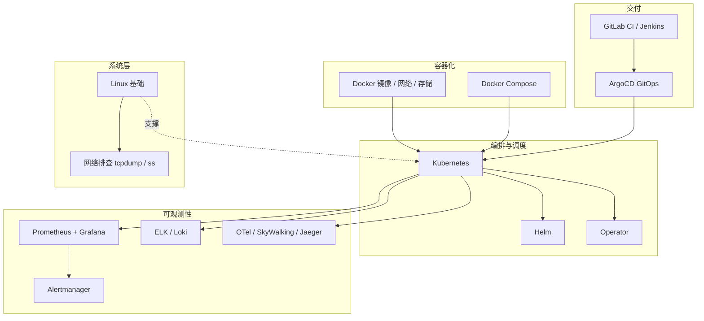

# 阶段五 · 小点 1：容器化基础（Docker / Compose）

> 所属：阶段五 云原生与运维工程
> 定位：「不会运维的后端不是好全栈」。企业级开发中，你写的代码最终要跑在 Kubernetes 上，出了问题你要能定位。容器是这条链路的最底层地基——先搞懂「镜像怎么打包才又小又安全」，再谈编排。

## 快速入门

> 本节为「容器速览」：先认识 Docker 是什么、解决什么问题；「多阶段构建、层缓存」留在正文提高部分。

### 本讲核心关键词速查

| 关键词 | 一句话大白话 | 例子 |
|-|-|-|
| Docker | 把应用和依赖打包成一个「容器」跑 | 一处构建到处运行 |
| 镜像 | 应用的「打包模板」（只读） | `nginx:latest` |
| 容器 | 镜像跑起来的「实例」 | `docker run` |
| Dockerfile | 描述怎么构建镜像的脚本 | `FROM` / `COPY` / `RUN` |
| 镜像分层 | 镜像由多层叠加 | 每层可缓存 |
| 多阶段构建 | 先编译再拷贝产物，镜像更小 | 构建→运行分离 |
| 仓库 | 存镜像的地方 | Docker Hub |
| Compose | 本地一键起多容器 | `docker-compose up` |

### 本讲在解决什么问题

- **问题**：「在我电脑上能跑」——换台机器就不行了。Docker 把「应用 + 依赖 + 环境」打包成镜像，一处构建、到处一致运行。
- **你要带走的一句话**：镜像 = 应用打包模板（只读），容器 = 镜像跑起来的实例。**打包的目标是「又小又安全」**：多阶段构建 + 非 root 运行 + .dockerignore。

### 最简可运行示例（照抄能跑）

```dockerfile
# 多阶段构建: 先在构建镜像编译, 再把产物拷进运行镜像 —— 镜像更小
# 阶段 1: 构建
FROM eclipse-temurin:25-jdk AS build      # 用带 JDK 的镜像做编译
WORKDIR /app
COPY . .
RUN ./mvnw -DskipTests package            # 编译出可运行的 jar

# 阶段 2: 运行(只拷产物, 用 JRE 够)
FROM eclipse-temurin:25-jre               # 运行只需 JRE
WORKDIR /app
COPY --from=build /app/target/app.jar app.jar
USER app                                  # 非 root 运行(安全基线)
ENTRYPOINT ["java", "-jar", "app.jar"]
```

> 代码备注（逐行解释）：
> - `FROM eclipse-temurin:25-jdk AS build`：第一阶段用 JDK 镜像，负责编译（写代码用 JDK）。
> - `RUN ... package`：编译出 `app.jar`。
> - 第二阶段 `FROM eclipse-temurin:25-jre`：运行**只需要 JRE**（省掉编译工具，镜像更小）。
> - `COPY --from=build /app/target/app.jar`：只把编译产物拷过来，不拷源码和依赖。
> - `USER app`：非 root 运行——安全基线，防止容器内提权（正文有安全清单）。
> - 这就是「多阶段构建」：构建和运行分离，最终镜像只装运行需要的，又小又安全。

### 关键概念说明

| 概念 | 干什么 | 最易踩的坑 |
|-|-|-|
| Dockerfile | 定义镜像构建 | 指令顺序影响层缓存 |
| 多阶段构建 | 编译/运行分离 | 别把 JDK 也带进运行镜像 |
| 层缓存 | 每层可缓存 | 先把依赖清单 COPY 再 COPY 源码 |
| `.dockerignore` | 排除不进镜像的文件 | 别把 `.git`/密钥 COPY 进去 |
| 镜像瘦身 | 让镜像更小 | Alpine 变体 / jlink 可选 |
| 安全基线 | 非 root 运行、最小权限 | root 运行 = 提权风险 |

### 常用约定 / 命名提示

- **构建顺序影响缓存**：先 `COPY package*.json`（依赖清单）再 `COPY 源码`——改代码不击穿依赖层缓存。
- **镜像安全三件事**：非 root 用户运行、`.dockerignore` 排除敏感文件、密钥不 COPY 进镜像（用环境变量/挂载）。
- **镜像名**：用 `eclipse-temurin` 官方组织名（别用 `temurin`），Alpine 变体以 Docker Hub tag 为准。

## 精简大纲

1. 阶段五知识体系全景
2. 镜像与容器的心智模型（分层结构 = 可复用的缓存层）
3. Dockerfile 最佳实践：多阶段构建 / 层缓存 / 镜像瘦身 / 安全基线
4. 镜像仓库与漏洞扫描
5. Docker Compose 本地开发环境

## 学习内容详情

### 1. 阶段五知识体系全景



> 本讲是最底层的容器化；往上依次是 K8s 编排（02）、CI/CD 交付（03）、可观测（04）、系统层排查（05）。

### 2. 镜像与容器的心智模型

- **镜像（Image）**：打包好的只读制品——类比 npm 包（`tarball`），build 一次到处分发。
- **容器（Container）**：镜像的一个运行实例——类比「`node_modules` 装好后跑起来的进程」，同一个镜像可以起 N 个互不干扰的容器。容器为什么轻量：它**不装操作系统**，多个容器共享宿主机内核，靠**命名空间隔离（Namespace）**切开进程 / 网络 / 文件系统的视野、靠**控制组（cgroup）**限住 CPU / 内存——这也是它和虚拟机（每个都带独立内核、由 Hypervisor 虚拟化硬件）的本质区别。
- **分层结构（最关键的心智）**：镜像由一叠只读层组成，每条 Dockerfile 指令生成一层：

```text
镜像层（自下而上，层与层叠加）
┌─────────────────────────────────────┐
│ L4: COPY app.jar（常变）            │ ← 源码一改这层就失效，上面全部重来
├─────────────────────────────────────┤
│ L3: RUN 下载依赖（少变）            │ ← 只在 pom.xml 变化时重建
├─────────────────────────────────────┤
│ L2: COPY pom.xml（很少变）          │
├─────────────────────────────────────┤
│ L1: 基础镜像 eclipse-temurin:25-jre │ ← 永远命中缓存
└─────────────────────────────────────┘
```

- 这就是 **Docker 层缓存**：类比 npm 的 `package-lock.json` + CI 缓存——「不常变的放前面，常变的放后面」，顺序错了每次构建都全量重来。
- **Docker ≠ 容器本身**：Docker 是容器生态的「第一个普及者」，但镜像格式与运行时协议早已交给 **OCI（Open Container Initiative，开放容器倡议）** 标准化——K8s 集群里真正跑镜像的是 containerd / CRI-O 这类 OCI 实现，`docker build` 出来的镜像它们照跑不误。理解「镜像 = OCI 制品」，就理解了为什么 Docker 不是唯一的容器引擎。

### 3. Dockerfile 最佳实践

#### 3.1 多阶段构建（Java 服务的标准写法）

**多阶段构建**：一个 Dockerfile 里先在「构建阶段」用全量 JDK + Maven 编译，再把**产物**复制到「运行阶段」的轻量 JRE 镜像——编译工具链不进最终镜像。

```dockerfile
# ========== 阶段一：构建（用完就丢，不进最终镜像） ==========
FROM maven:3.9-eclipse-temurin-25 AS builder
WORKDIR /build

# 为什么先只 COPY pom.xml？——依赖层只在 pom 变化时失效，
# 源码天天改也不会击穿「下载依赖」这个最耗时的缓存层（类比：先装依赖再 COPY 源码）
COPY pom.xml .
RUN mvn dependency:go-offline      # 预拉全部依赖到本地仓库

COPY src ./src
RUN mvn package -DskipTests        # 测试交给 CI 流水线，镜像构建保持快

# ========== 阶段二：运行（最终镜像只有这一段） ==========
FROM eclipse-temurin:25-jre           # 更小的 Alpine 变体以 Docker Hub 官方 tag 列表为准——别凭记忆猜 tag 名

# 安全基线：非 root 运行。root 容器被攻破 = 攻击者拿到 root 权限
# （Debian 系基础镜像用 groupadd/useradd；Alpine 镜像才是 addgroup -S / adduser -S）
RUN groupadd -r app && useradd -r -g app app
USER app

WORKDIR /app
COPY --from=builder /build/target/*.jar app.jar

# 容器化 JVM 必配：感知 cgroup 内存上限，堆最大占 75%（留余量给非堆）
ENV JAVA_OPTS="-XX:MaxRAMPercentage=75.0"

EXPOSE 8080
ENTRYPOINT ["sh", "-c", "java $JAVA_OPTS -jar app.jar"]
```

#### 3.2 构建与缓存验证

```bash
# 构建时观察层缓存：第二次构建依赖层应显示 CACHED
docker build -t my-app:1.0 .

# 输出示例（注释即预期）：
# => [builder 2/6] WORKDIR /build                  0.0s  ← 命中缓存
# => CACHED [builder 3/6] COPY pom.xml .           0.0s  ← 命中缓存
# => CACHED [builder 4/6] RUN mvn dependency:go... 0.0s  ← 关键：依赖层没重建
# => [builder 5/6] COPY src ./src                  0.1s  ← 只有源码层重建

# 改一行代码再 build：只有 L5/L6 重跑，秒级完成
docker build -t my-app:1.1 .
```

#### 3.3 镜像瘦身三方案

| 方案 | 原理 | 坑 |
|-|-|-|
| Alpine 基础镜像 | musl libc 替代 glibc，体积小一半 | 个别依赖要求 glibc（Netty 原生库等）——选 `eclipse-temurin` 的 Alpine 变体而非自己拼 |
| **Distroless** | 只有运行时没有 shell / 包管理器 | 没法 `docker exec sh` 进容器排查，只保留必要调试手段 |
| **jlink 定制 JRE** | `jdeps` 分析后只打包用到的 JDK 模块 | 模块清单要维护；反射加载的模块 jdeps 看不见，要手补 |

```bash
# jlink：按需裁剪 JRE（先分析依赖，再打包）
jdeps --print-module-deps --ignore-missing-deps app.jar
# 输出示例：java.base,java.sql,java.naming,java.management  ← 用到的模块清单

jlink --add-modules java.base,java.sql,java.naming,java.management \
      --strip-debug --no-man-pages --no-header-files \
      --compress zip-6 \
      --output /custom-jre          # 产出一个 ~40MB 的定制 JRE（完整 JDK 300MB+）

# 然后在 Dockerfile 里 COPY --from=jre-builder /custom-jre /opt/jre
```

> **版本提醒**：新版 jlink 默认已裁剪调试信息等，参数以当前 JDK 的 jlink 手册为准——老博客参数别照抄。
>
> ⏸️ **短期可以不学**：jlink 是三种瘦身方案里性价比最低的——Alpine / Distroless 已能满足绝大多数场景，而模块清单要持续维护。**何时回来学**：镜像体积成为硬指标（冷启动计费、边缘设备、私有化交付）时。**面试最低要求**：能说出 jlink 是「用 jdeps 分析依赖、按需裁剪 JDK 模块」即可。

#### 3.4 安全基线清单

- 非 root 用户（见上面 Dockerfile）。
- **readOnlyRootFilesystem 只读根文件系统**：根文件系统挂只读，要写的路径显式挂 tmpfs / emptyDir——落盘型攻击与脏数据无处发生。
- **capabilities 最小化**：默认 capabilities 按 `drop: ["ALL"]` 全丢、再按需 `add` 个别能力——容器用不上的 root 权限一律不给。
- **`.dockerignore`**：构建上下文里不相关的文件不上传——类比 `.gitignore`，但它省的是「发给 daemon 的上下文体积 + 意外泄密」：

```text
# .dockerignore：密钥与本地环境绝不能进镜像层（进去了就永久留在层历史里！）
.env
.env.*
*.key
.git
.idea
target/
node_modules/
```

> **红线**：`.env` 被任何一层 `COPY` 过，即使下一层删除也**仍然可以从层里读出来**——密钥永远通过运行时环境变量 / Secret 注入，不进镜像。

### 4. 镜像仓库与漏洞扫描

- **私有仓库（Harbor）**：企业内部镜像托管；支持**多环境 promotion**——`dev → staging → prod` 推的是**同一个 digest**（镜像内容的哈希），保证「测过的就是上线的那一个」。

> ⏸️ **短期可以不学**：自建 Harbor 只在私有化 / 合规场景才需要——云厂商的容器镜像服务（ACR / ECR）开箱即用。**何时回来学**：公司要求内网自托管镜像、或你要做镜像仓库运维时。**面试最低要求**：能说出 tag 可覆盖、digest 不可变，生产按 digest 锁定。

```bash
# digest（sha256:...）= 镜像内容的指纹；tag 可被覆盖，digest 不可变
docker push harbor.local/apps/my-app@sha256:abc123...
docker pull harbor.local/apps/my-app@sha256:abc123...   # 生产永远用 digest 锁定

# Trivy 扫描镜像层里的已知漏洞（CVE），CI 门禁用它拦截高危基础镜像
trivy image my-app:1.0 --severity HIGH,CRITICAL
# 输出示例（注释即预期）：
# eclipse-temurin:25-jre
# ====================================
# Total: 0 (HIGH: 0, CRITICAL: 0)   ← 干净，放行
```

### 5. Docker Compose 本地开发环境

**Compose**：用一个 YAML 声明「本项目要哪几个容器怎么互联」——本地一键拉起 MySQL + Redis + Kafka，等价于前端项目里「一条命令起全套依赖」的 compose 模板。**只用于本地，不用于生产**：Compose 只能管「一台机器上的进程」，没有调度、自愈、水平扩缩——这正是下一讲 Kubernetes 来补的能力。

```yaml
# docker-compose.yml：与 .env 里的组件配置一一对应
services:
  mysql:
    image: mysql:8.4
    # 环境变量优先读根目录 .env（compose 的默认行为），实现「一处配置两处生效」
    environment:
      MYSQL_ROOT_PASSWORD: ${MYSQL_ROOT_PASSWORD}
      MYSQL_DATABASE: app_db
    ports:
      - "3306:3306"
    volumes:
      - mysql_data:/var/lib/mysql        # 命名卷：容器删了数据还在
    healthcheck:                          # 健康检查：真正能连上才算"就绪"
      test: ["CMD", "mysqladmin", "ping", "-h", "localhost"]
      interval: 5s
      retries: 10

  app:
    build: .
    environment:
      SPRING_DATASOURCE_URL: jdbc:mysql://mysql:3306/app_db
      # 关键：depends_on + condition=service_healthy
      # 没有这个，app 会在 MySQL 还在初始化时就连接（经典启动竞态）
    depends_on:
      mysql:
        condition: service_healthy
    ports:
      - "8080:8080"

volumes:
  mysql_data:
```

```bash
# 日常命令
docker compose up -d            # 后台拉起全部服务
docker compose ps               # 看状态（注意 health 列，starting≠healthy）
docker compose logs -f app      # 跟踪某个服务的日志
docker compose down             # 停止并删容器（命名卷保留）
docker compose down -v          # 连数据卷一起删（彻底重置本地环境）
```

### 坑点提醒

- **层顺序错误 = 缓存全失效**：`COPY . .` 写在 `RUN mvn dependency:go-offline` 前面，每次改代码都重下依赖——把「少变的」放前面。
- **基础镜像用 `latest` tag**：某天 upstream 更新导致构建突变，且无法复现历史镜像——生产镜像**钉住具体版本或 digest**。
- **把 `.env` COPY 进镜像**：层历史里永久可提取，等于把密钥发布出去。
- **以 root 运行 + 没有内存限制**：容器被攻破即提权；JVM 看不到 cgroup 上限会按宿主机内存分配堆，直接被 OOM Kill。
- **Compose 忘配 healthcheck 的 depends_on**：应用启动报「Connection refused」，其实是 MySQL 还没就绪——竞态不是偶发，是必然。

## 本节自检

- [ ] 能写出一个 Java 服务的多阶段 Dockerfile，并解释为什么先 COPY pom.xml
- [ ] 能说出三种镜像瘦身方案及各自的坑（Alpine musl / Distroless 无 shell / jlink 反射盲区）
- [ ] 能解释 digest 与 tag 的差异，以及为什么生产用 digest 锁定
- [ ] 能用 Compose 拉起带健康检查的 MySQL + 应用，并解释 `depends_on: condition: service_healthy` 防的是什么竞态

## 本节配套思考题

1. 你的镜像构建从 30 秒劣化到 8 分钟，逐步说出你会检查 Dockerfile 的哪些地方？
2. 为什么「在镜像里删除 `.env`」不等于安全？层机制怎么把删掉的文件留在镜像里？
3. Distroless 镜像没有 shell，线上要排查问题时你还有什么手段？（提示：kubectl debug / 临时 sidecar / Ephemeral Container）

## 常见面试题

### Q1：容器和虚拟机有什么区别？
**答**：
- **标准结论**：两者都做资源隔离，但隔离层级不同。虚拟机（VM）通过 Hypervisor 虚拟出完整硬件，每个 VM 里跑一个独立操作系统；容器不虚拟硬件，多个容器共享宿主机内核，靠命名空间隔离（Namespace）切视图、控制组（cgroup）限资源。
- **底层原理**：VM 的隔离在 OS 之下，靠硬件虚拟化（KVM 等）实现，隔离最强但开销大——每个 VM 都要带一整套内核与系统库；容器是 OS 级虚拟化，隔离在进程层面，启动就是启动一个进程（毫秒级 vs VM 秒级），密度高一个量级。代价是隔离弱：共享内核，内核漏洞可能穿透容器边界——这正是容器安全基线强调非 root 运行、drop capabilities 的原因。
- **工程实践**：业务服务用容器（无状态、要密度与启动速度）；数据库、强隔离或异构 OS 场景用 VM。生产里常见组合是「VM 里跑 K8s，K8s 里跑容器」，不是二选一。加分句：「容器快，是因为没有第二个内核要启动」。

### Q2：Docker 镜像为什么是分层的？怎么给镜像瘦身？
**答**：
- **标准结论**：镜像由若干只读层叠加而成，每条 Dockerfile 指令生成一层；构建时层可缓存、分发时层可复用。瘦身三板斧：多阶段构建、Alpine / Distroless 基础镜像、jlink 定制 JRE。
- **底层原理**：层（Layer）本质是文件系统差异集——UnionFS 类文件系统把多层挂载成一个视图，层间共享：不同镜像共用基础层，分发只传差异。缓存命中的前提是「该层及以下所有层未变化」，所以「不常变的放前面、常变的放后面」。
- **工程实践**：先 COPY 依赖清单再 COPY 源码，依赖层不因改代码失效；生产钉版本不用 `latest`；`.dockerignore` 排除密钥与构建产物；最终镜像非 root 运行。误区：「删掉文件」不等于瘦身——被删内容仍留在底层里，瘦身必须从「不放进镜像」做起。

### Q3：多阶段构建解决了什么问题？为什么能显著减小镜像？
**答**：
- **标准结论**：一个 Dockerfile 里用多个 `FROM` 分阶段——构建阶段装全量 JDK + Maven 编译出 jar，运行阶段只把产物拷进轻量 JRE 镜像，最终镜像只含运行所需。
- **底层原理**：编译工具链（编译器、包管理器、源码、依赖缓存）动辄几百 MB，对运行毫无用处；多阶段构建用 `COPY --from=构建阶段` 在层层面只复制产物，把工具链留在可丢弃的构建镜像里。镜像小了：拉取快、启动快、攻击面小（工具链里常藏着可利用组件）。
- **工程实践**：Java 标准写法是 Maven 镜像构建 + Temurin JRE 运行；依赖层单独 `COPY pom.xml` 并 `RUN mvn dependency:go-offline` 保住缓存；测试交给 CI，镜像构建保持快。加分：把「构建时长（缓存）」与「镜像体积」两个优化维度分开讲。

### Q4：容器里的 JVM 为什么按宿主机内存设堆会 OOM？怎么让 JVM 感知容器限制？
**答**：
- **标准结论**：JVM 默认按宿主机内存算默认堆大小，容器里会误以为内存无限大，堆超配后被 cgroup 直接 OOM Kill。解决：`-XX:MaxRAMPercentage=75.0` 按容器内存百分比设堆，或显式 `-Xmx`。
- **底层原理**：JDK 10 起默认开启 `UseContainerSupport`，JVM 读 cgroup 的 `memory.limit_in_bytes` 感知容器上限——容器「可用内存」是 cgroup 配额而不是宿主机的 `/proc/meminfo`（旧 JDK 8 读的是宿主机的）。75% 是经验值：留余量给元空间、线程栈、直接内存（Netty 堆外）。
- **工程实践**：JDK 8 需显式 `-XX:+UseContainerSupport`（8u191+）否则完全不感知；`requests/limits` 必须与 JVM 参数联动对齐（如 limits 1536Mi ↔ 堆 75%）；容器 OOMKilled 先核对 limits 是否小于 JVM 峰值的 1.3 倍左右。加分：CPU 也有对应问题——容器核数读错会影响 JVM 线程数与 ForkJoinPool 并行度。
