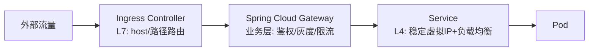

# 阶段五 · 小点 2：Kubernetes

> 所属：阶段五 云原生与运维工程
> 定位：企业级部署的事实标准。目标不是「会背对象清单」，而是掌握三件事：核心对象的心智模型、Spring Boot 上 K8s 的适配点、以及一套背下来的故障排查路径。

## 快速入门

> 本节为「K8s 速览」：先认识 K8s 是什么、解决什么问题、几个核心对象；「网络边界、发布策略」留在正文提高部分。

### 本讲核心关键词速查

| 关键词 | 一句话大白话 | 例子 |
|-|-|-|
| Kubernetes（K8s） | 容器编排平台（管理大量容器） | 自动部署、扩缩、自愈 |
| Pod | K8s 最小运行单元（一个或多个容器） | 一个应用实例 |
| Deployment | 管理 Pod 副本（部署清单） | 声明要几个副本 |
| Service | 稳定的访问入口 | 负载均衡到 Pod |
| Ingress | 外部访问的入口（L7 路由） | 域名→Service |
| 探针 | 健康检查（liveness/readiness/startup） | 判断容器活没活/就绪没 |
| 滚动发布 | 逐个替换 Pod 更新 | 不中断服务升级 |
| HPA | 自动扩缩容 | 按 CPU 加副本 |

### 本讲在解决什么问题

- **问题**：容器多了不好管——谁来调度、扩缩、自愈、更新？K8s 负责编排：声明「要什么」，它自动让集群变成那个样子。
- **你要带走的一句话**：**Pod** 是最小运行单元，**Deployment** 管副本，**Service** 提供稳定入口，**Ingress** 对外路由。核心是「声明期望状态，K8s 自动收敛」——你写 YAML 描述"要什么"，K8s 负责"变成那样"。

### 最简可运行示例（照抄能跑）

```yaml
# Deployment: 声明这个应用要有 3 个副本, 用哪个镜像, 探针怎么探
apiVersion: apps/v1
kind: Deployment
metadata:
  name: my-app
spec:
  replicas: 3                       # 期望 3 个副本
  selector: { matchLabels: { app: my-app } }
  template:
    metadata: { labels: { app: my-app } }
    spec:
      containers:
        - name: app
          image: registry/my-app:1.0
          ports: [ { containerPort: 8080 } ]
          startupProbe:   # 慢启动保护: 启动期别掐
            httpGet: { path: /actuator/health, port: 8080 }
            initialDelaySeconds: 15
          readinessProbe: # 就绪才接流量
            httpGet: { path: /actuator/health, port: 8080 }
          livenessProbe:  # 挂了重启容器
            httpGet: { path: /actuator/health, port: 8080 }
```

> 代码备注（逐行解释）：
> - `replicas: 3`：期望 3 个副本，K8s 会保证始终有这么多个在跑。
> - `template`：定义每个 Pod 用哪个镜像、端口、探针。
> - **三种探针**：`startupProbe`（慢启动保护）、`readinessProbe`（就绪才接流量）、`livenessProbe`（挂了重启）——这是 Spring Boot 上 K8s 最关键的适配点（用 Actuator 的 `/actuator/health`）。
> - **声明式**：你只写"要 3 个、健康才接流量、挂了重启"，剩下的 K8s 自动调度——这就是「编排」的核心。

### 关键概念说明

| 概念 | 干什么 | 最易踩的坑 |
|-|-|-|
| Pod | 最小运行单元 | 一个 Pod 通常一个主容器 |
| Deployment | 管理副本 | 声明式：要几个给几个 |
| Service | 稳定入口 | 负载均衡到 Pod |
| Ingress | L7 路由 | ingressClassName 指向集群控制器 |
| 三种探针 | 健康检查 | startup/readiness/liveness 别混用 |
| 滚动发布 | 逐个替换 | 配 preStop + gracePeriod 保优雅停机 |
| HPA | 自动扩缩 | 阈值要和容量规划对齐（阶段六第 6 讲） |

### 常用约定 / 命名提示

- **Spring Boot on K8s 适配**：探针用 Actuator 的 `/actuator/health`；优雅停机配 `preStop` + `gracePeriodSeconds`；容器资源写 request/limit。
- **故障排查三步**：先看状态（`kubectl get pods`）→ 看事件和日志（`describe`/`logs`）→ 定位是 CrashLoopBackOff/Pending/Service 不通。
- **安全基线**：K8s 网络默认全通，东西向要显式声明 NetworkPolicy；生产用 Pod Security（restricted）。

## 精简大纲

1. 从 Compose 到 K8s：为什么需要「编排」
2. 核心对象与第一个完整部署（Deployment + Service YAML 精读）
3. 网络三层边界：Service / Ingress / Gateway
4. 发布策略：滚动 / 蓝绿 / 金丝雀
5. Spring Boot on K8s 适配清单：探针 / 优雅停机 / 资源 / HPA
6. Helm 与故障排查路径
7. 安全基线：NetworkPolicy / PSS / 资源配额

## 学习内容详情

### 1. 从 Compose 到 K8s：为什么需要「编排」

- **Compose 管「一台机器上的多容器」**；**K8s 管「一堆机器上的大量容器」**：谁挂在哪台机器、挂了谁顶上、流量怎么找到它、发布怎么不中断——这四件事就是「编排」。
- **声明式 API**：你提交「期望状态」（YAML），K8s 的**控制器**持续把实际状态向期望收敛——类比 React 的 `setState`：你声明 UI 应该长什么样，框架负责 diff 并更新 DOM。排障心法也一致：别问「我改了什么」，问「期望状态和实际状态差在哪」。

### 2. 核心对象与第一个完整部署

| 类别 | 对象 | 职责 |
|-|-|-|
| 工作负载 | Pod / Deployment / StatefulSet / DaemonSet / Job / CronJob | 运行单元与副本管理 |
| 服务发现 | Service / Ingress | 稳定访问入口 / 七层路由 |
| 配置存储 | ConfigMap / Secret / PV / PVC | 配置注入与持久卷 |

- **Pod**：最小调度单元 = 一个或一组共生容器（共享网络与存储）。Deployment 管「Pod 要几个、什么样子」；StatefulSet 管有状态服务（数据库类，稳定网络标识 + 顺序伸缩）；DaemonSet 每节点跑一个（日志采集器）；Job / CronJob 跑一次性 / 周期任务。

```yaml
# deployment.yaml：Spring Boot 服务的完整生产级声明（逐段注释）
apiVersion: apps/v1
kind: Deployment
metadata:
  name: order-service
  labels: { app: order-service }        # 标签是 K8s 一切"选中"机制的基础
spec:
  replicas: 3                            # 期望副本数（HPA 会改这个字段）
  selector:
    matchLabels: { app: order-service }  # Deployment 认领 Pod 的方式：按标签匹配
  strategy:
    rollingUpdate:
      maxSurge: 1                        # 滚动时最多多起 1 个新 Pod（控制峰值资源）
      maxUnavailable: 0                  # 滚动时最少可用数不减（零中断发布的关键）
  template:                              # Pod 模板：从这里开始描述"每个 Pod 长什么样"
    metadata:
      labels: { app: order-service }     # 必须匹配上面的 selector，否则认领失败
    spec:
      containers:
        - name: order
          image: harbor.local/apps/order-service@sha256:abc123   # 用 digest 锁定版本
          ports: [ { containerPort: 8080 } ]
          env:
            - name: SPRING_PROFILES_ACTIVE
              value: "prod"
            - name: DB_PASSWORD
              valueFrom:
                secretKeyRef:            # 密钥从 Secret 注入，不进镜像也不进 YAML 明文
                  name: order-db-cred
                  key: password
          resources:
            requests:                    # 调度依据：声明"我至少要多少"，调度器按此选节点
              cpu: 500m                  # 500m = 0.5 核
              memory: 1Gi
            limits:                      # 上限：超内存 → OOM Kill；超 CPU → 限流(不杀)
              cpu: "1"
              memory: 1536Mi
          startupProbe:                  # 启动保护：Java 启动慢，先等它起来再谈存活
            httpGet: { path: /actuator/health/liveness, port: 8080 }
            failureThreshold: 30         # 最多容忍 30 次失败(30×2s=60s 启动窗口)
            periodSeconds: 2
          livenessProbe:                 # 存活：失败就重启容器（治"假死"，如死锁）
            httpGet: { path: /actuator/health/liveness, port: 8080 }
            periodSeconds: 10
          readinessProbe:                # 就绪：失败就摘流量（治"忙不过来/依赖故障"）
            httpGet: { path: /actuator/health/readiness, port: 8080 }
            periodSeconds: 5
          lifecycle:
            preStop:                     # 优雅停机前半段：见第 5 节详解
              exec: { command: ["sleep", "10"] }
```

```yaml
# service.yaml：给这组 Pod 一个稳定入口
apiVersion: v1
kind: Service
metadata:
  name: order-service
spec:
  selector:
    app: order-service                   # 按标签选中所有同名 Pod，流量自动负载均衡
  ports:
    - port: 80                           # 集群内访问端口
      targetPort: 8080                   # 转发到容器端口
---
# ingress.yaml：让集群外部的 HTTP 流量进来（七层路由）
apiVersion: networking.k8s.io/v1
kind: Ingress
metadata:
  name: app-ingress
spec:
  ingressClassName: nginx               # nginx 只是常见选项之一（traefik、contour 等）——ingressClassName 指向的是集群里装的控制器
  rules:
    - host: api.example.com
      http:
        paths:
          - path: /orders                # 路径级路由：订单流量 → order-service
            pathType: Prefix
            backend: { service: { name: order-service, port: { number: 80 } } }
          - path: /                      # 其余 → 网关
            pathType: Prefix
            backend: { service: { name: gateway, port: { number: 80 } } }
```

### 3. 网络三层边界（高频考点）



| 层 | 解决的问题 | 不解决的问题 |
|-|-|-|
| **Service** | 「集群内怎么找到一组会生会死的 Pod」——稳定虚拟 IP + 自动负载均衡 | 不懂 HTTP 路径/Header |
| **Ingress** | 「外部 HTTP(S) 流量怎么路由到哪个 Service」——七层规则、TLS 终止 | 不做业务鉴权、不做灰度策略 |
| **Gateway** | 「业务级路由」——统一鉴权、按 Header/权重灰度、业务限流 | 不直接暴露给公网（通常藏在 Ingress 后面） |

- Service 三种类型：`ClusterIP`（默认，仅集群内）/ `NodePort`（每节点开一个端口）/ `LoadBalancer`（云厂商 SLB）。

### 4. 发布策略

- **滚动更新**：默认策略——新 Pod 逐个起、旧 Pod 逐个停，`maxSurge/maxUnavailable` 控制节奏；`kubectl rollout undo` 一键回滚。
- **蓝绿**：新旧两套全量并存，流量一次性切换——回滚最快、资源翻倍。
- **金丝雀**：Argo Rollouts 按流量比例渐进（1% → 10% → 50% → 100%），每一步自动分析指标，异常自动回退——「滚动 + 权重 + 自动分析」的组合体。

### 5. Spring Boot on K8s 适配清单

#### 5.1 探针语义差异（配错就是事故）

- **liveness = 「要不要重启你」**：只该检查进程自身健康（死锁、假死）。
- **readiness = 「要不要给你流量」**：可以检查依赖（DB / 下游），依赖抖动 → 摘流量等恢复，进程不该被重启。
- **startup = 「启动慢的应用先别测我」**：Java 应用冷启动 + 预热期的保护。

> **经典事故**：liveness 探针配到了依赖下游的接口上——下游抖动 → liveness 失败 → K8s 认为「进程坏了」**把容器反复重启** → 重启期间服务全不可用 → 把「下游部分故障」放大成「本服务全灭」。依赖检查只能给 readiness。

#### 5.2 优雅停机：在途请求不丢的双保险

Pod 被杀时的时序：K8s 先发 `SIGTERM` →（同时）Endpoint 从 Service 摘除。**问题**：摘除是异步的，可能 SIGTERM 都到了、流量还在往这个 Pod 打。双保险：

```yaml
# 保单一（YAML 侧）：preStop 拖时间 —— 等 Endpoint 传播完成再开始停
lifecycle:
  preStop:
    exec: { command: ["sleep", "10"] }   # 拖住 10s：这期间摘流量已传播完，不会再有新请求
```

```yaml
# 保单二（应用侧）：graceful shutdown —— 收到 SIGTERM 后，处理完在途请求再退出
# application.yml
server:
  shutdown: graceful                      # SIGTERM 后不再接新请求，等存量请求完成
spring:
  lifecycle:
    timeout-per-shutdown-phase: 30s       # 最多等 30s，超过强制退出
```

- 两者缺一：只有 preStop 没有 graceful → 拖够了时间但停机瞬间仍有在途请求被切；只有 graceful 没有 preStop → 摘流量还没传播就停机，新请求照样撞死。

#### 5.3 资源对齐与 HPA

```yaml
# hpa.yaml：按 CPU 自动扩缩（指标来自 Metrics Server）
apiVersion: autoscaling/v2
kind: HorizontalPodAutoscaler
metadata:
  name: order-service
spec:
  scaleTargetRef: { apiVersion: apps/v1, kind: Deployment, name: order-service }
  minReplicas: 3
  maxReplicas: 20                         # 上限 = 容量规划结论(阶段六第 6 讲)
  metrics:
    - type: Resource
      resource:
        name: cpu
        target: { type: Utilization, averageUtilization: 65 }  # 均值超 65% 扩容
  behavior:
    scaleDown:
      stabilizationWindowSeconds: 300     # 缩容保守：5 分钟窗口内不连续缩，防抖动
```

- JVM 内存与 cgroup 对齐：容器 limits 给 1536Mi，JVM 用 `-XX:MaxRAMPercentage=75.0`（堆约占 1.1G，余量留给元空间 / 线程栈 / 直接内存）——不配的话 JVM 可能按宿主机内存自作主张，直接被 OOM Kill。

### 6. Helm 与故障排查路径

**Helm**：K8s manifest 的模板引擎——`{{ .Values.image.tag }}` 占位 + values 文件分环境注入，类比前端的「同一套组件、不同环境变量构建不同产物」。

```yaml
# values-prod.yaml：只覆盖与默认值不同的键
image:
  tag: "1.4.2"
replicas: 5
resources:
  limits: { cpu: "1", memory: 1536Mi }

# 用法：helm upgrade --install order ./charts/order -f values-prod.yaml -n prod
```

**故障排查路径**（三个场景背下来）：

```bash
# 场景一：Pod 一直 Pending（调度失败 —— 资源不足 / 亲和性 / PV 未绑定）
kubectl describe pod order-service-7d9f-xyz | tail -20
# Events 输出示例（注释即预期）：
#   Warning  FailedScheduling  ...  0/5 nodes are available:
#   5 Insufficient cpu.                     ← requests 加起来没有节点能满足 → 扩节点或降 requests
#   (或) 1 node(s) had untolerated taint... ← 污点/亲和性问题 → 检查 nodeSelector/tolerations
#   (或) 2 pod has unbound immediate PersistentVolumeClaims  ← PVC 没绑上 PV

# 场景二：CrashLoopBackOff（容器反复崩溃）
kubectl logs order-service-7d9f-xyz --previous      # --previous: 看上一次崩溃的日志(关键!)
kubectl logs order-service-7d9f-xyz --previous | tail -30
# 常见结局: ① 启动报连接 DB 失败(配置/Secret) ② OOMKilled(见 describe 里 Reason) ③ 抛异常退出
kubectl get pod order-service-7d9f-xyz -o jsonpath='{.lastState.terminated.reason}'
# > OOMKilled   ← limits 内存给小了或 JVM 堆超配

# 场景三：Service 不通（Pod 活着但访问 502/超时）
kubectl get endpoints order-service
# > order-service   <none>       ← endpoints 为空! Service 的 selector 与 Pod label 不匹配
kubectl get pod -l app=order-service --show-labels    # 核对 Pod 实际标签拼写
# endpoints 非空仍不通 → 检查 targetPort(8080) 是否等于容器真实端口
```

### 7. 安全基线

- **NetworkPolicy**：K8s 网络默认全通，东西向流量（服务间）要显式声明放行——别裸奔。
- **Pod Security Standards**：privileged / baseline / restricted 三档，生产用 restricted。
- **ResourceQuota / LimitRange**：命名空间的资源配额与默认 request/limit——防单个服务吃光集群。

### 坑点提醒

- **liveness 探依赖接口**：下游故障被放大成自我重启风暴（见 5.1，生产事故 Top 级）。
- **镜像用 `latest`**：无法回滚到「上一个真正跑过的版本」，且缓存导致「改了不生效」的错觉。
- **requests 与 limits 不设**：BestEffort 调度 → 资源争抢时最先被驱逐的就是你。
- **只有 graceful 没有 preStop**（或反过来）：滚动更新仍有少量 502，见 5.2 的双保险论证。
- **HPA 缩容太快**：流量抖动引发「扩了又缩、缩了又扩」，务必配 `stabilizationWindowSeconds`。

## 本节自检

- [ ] Pod 一直 Pending，你的排查步骤是什么？（describe → events → 三类原因定位）
- [ ] liveness 探针配到了一个依赖下游的接口上，会发生什么事故？能完整讲一遍放大链路
- [ ] Service、Ingress、Spring Cloud Gateway 三层各自解决什么问题？
- [ ] 滚动更新时怎么保证在途请求不丢？（preStop + graceful 双保险，能说清缺一不可的原因）
- [ ] 能解释 requests 与 limits 的差异（调度依据 vs 运行上限）以及 OOMKilled 的由来

## 本节配套思考题

1. 你的 Deployment replicas=3，但 `kubectl get endpoints` 显示只有 2 个地址，列出至少 3 种可能原因。
2. 为什么「liveness 失败 → 重启容器」在分布式系统里是危险操作？什么情况下重启反而是唯一解药？
3. 金丝雀发布相比蓝绿，牺牲了什么换来了什么？什么业务绝不能上金丝雀？
