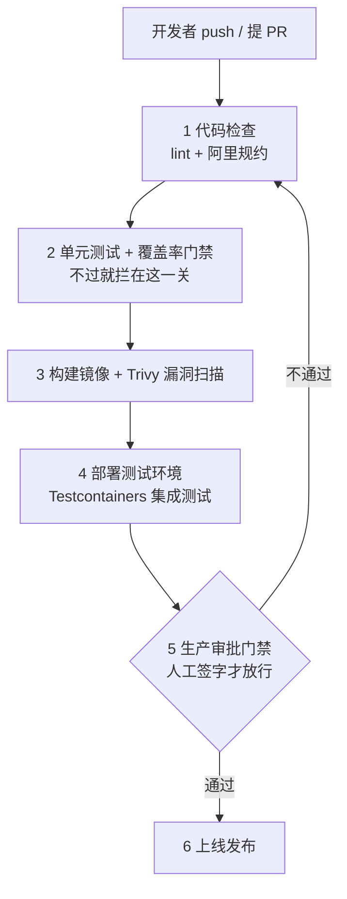
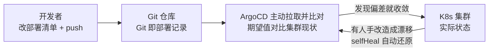
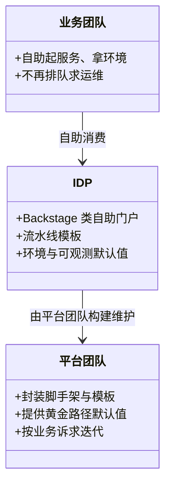
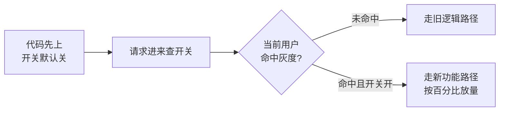

# 阶段五 · 小点 3：CI/CD 与平台工程

> 所属：阶段五 云原生与运维工程
> 定位：让「从代码到线上」变成一条可重复、可审计、可回滚的流水线。你写过前端 CI（GitHub Actions），概念全通——这里补 Java 侧的流水线形态与 GitOps 的部署范式。

## 快速入门

> 本节为「CI/CD 速览」：先认识 CI/CD 是什么、解决什么问题；「GitOps、平台工程」留在正文提高部分。

### 本讲核心关键词速查

| 关键词 | 一句话大白话 | 例子 |
|-|-|-|
| CI（持续集成） | 每次提交自动跑测试/构建 | 提交后自动构建 + 单测 |
| CD（持续交付/部署） | 自动发布到环境 | 构建后自动部署 |
| 流水线 | CI/CD 的步骤编排 | lint→test→build→deploy |
| GitLab CI / GitHub Actions | 常见 CI 工具 | 写 `.gitlab-ci.yml` / `.github/workflows` |
| GitOps | 用 Git 声明部署，自动收敛 | ArgoCD |
| 镜像 | 构建产物 | `app:1.0.0` |
| 特性开关 | 代码先上、开关控制 | 灰度发布的软开关 |
| 门禁 | 不满足就不让合并/发布 | 测试覆盖率、审批 |

### 本讲在解决什么问题

- **问题**：改完代码怎么从「本地能跑」到「线上稳定」？靠手动部署容易出错。CI/CD 把「构建→测试→部署」变成自动、可重复、可回滚的流水线。
- **你要带走的一句话**：CI（Continuous Integration，持续集成）是「每次提交自动跑测试+构建」，CD 是「自动发布到环境」。注意 CD 有两个层次：**持续交付（Continuous Delivery）** = 随时可发布、按按钮上线；**持续部署（Continuous Deployment）** = 合并即自动上线。**门禁（Quality Gate）是灵魂**——测试不过、覆盖率不够就不让合并不让发布。

### 最简可运行示例（照抄能跑）

```yaml
# GitHub Actions 流水线骨架: push 后自动跑单测 + 覆盖率门禁
name: Java CI
on: [push]                       # 触发: 每次 push
jobs:
  build:
    runs-on: ubuntu-latest
    steps:
      - uses: actions/checkout@v4         # 拉取代码
      - uses: actions/setup-java@v4       # 装 JDK
        with: { distribution: temurin, java-version: '25' }
      - run: mvn test jacoco:report jacoco:check   # 跑单测 + 覆盖率门禁
      - run: mvn package -DskipTests      # 打包(跳过测试, 上面已跑)
      - run: docker build -t app:1.0 .     # 构建镜像
```

> 代码备注（逐行解释）：
> - `on: [push]`：触发条件——每次 push 都自动跑这条流水线。
> - `actions/checkout`：拉取代码到运行环境。
> - `actions/setup-java`：装 JDK，指定版本 `java-version: '25'`。
> - `mvn test jacoco:report jacoco:check`：**跑单测 + 覆盖率门禁**——覆盖率不够会让构建失败（这就是门禁，测试不过不许合并）。注意 `jacoco:check` 要真正拦截，前提是在 pom 里配了 `<rules>` 阈值（阶段二第 5 讲），否则只是出报告不拦截。
> - `docker build`：构建镜像，用来后续部署。
> - 这就是 CI 的最小形态：**提交 → 自动测试 → 构建产物**，让「每次改动都有验证」成为习惯。

### 关键概念说明

| 概念 | 干什么 | 最易踩的坑 |
|-|-|-|
| CI | 提交自动测试构建 | 快速反馈（5 分钟内） |
| CD | 自动部署 | 环境差异要外置（配置/环境变量） |
| 流水线 | 步骤编排 | 分段：MR 级/主干级 |
| 覆盖率门禁 | 测试不过不让合 | MR 层跑单测+IT，主干跑全量 |
| GitOps | Git 声明部署 | ArgoCD 拉取式 + selfHeal 风险 |
| 特性开关 | 代码发布解耦 | 记得「开关债」，用完清理 |

### 常用约定 / 命名提示

- **门禁分层**：MR 级跑快测（单测+覆盖率），主干级跑全量（集成+端到端）——速度与可信的平衡。
- **多环境 promotion 铁律**：同一个镜像 digest 走 dev→staging→prod，环境差异全部外置（配置/环境变量），别为 prod 重新构建。
- **代码审查 ≠ 上线审批**：MR merge 是质量门禁，上线审批是独立的发布环节。

## 精简大纲

1. 流水线设计：完整分段与各段职责
2. GitLab CI / Jenkins / GitHub Actions
3. GitOps：ArgoCD 声明式部署
4. 平台工程：IDP 与特性开关

## 学习内容详情

### 1. 流水线设计

```text
代码检查(lint+规约) → 单测 → 构建镜像 → 推送仓库 → 部署测试环境 → 集成测试 → 生产发布(审批门禁)
   ↑ MR 级: 分钟级快反馈          ↑ 主干级: 完整质量与发布
```

- 两段分层：**MR 级**（每次提 PR 跑：规约扫描 + 单测 + 切片测试，目标 5 分钟内）与**主干级**（合并后跑：镜像构建 + 集成测试 + 部署）——合起来才是「快速反馈 + 完整守门」。
- Java 侧的段内容：SpotBugs / PMD / 阿里规约插件 → `mvn test`（JUnit，阶段二第 5 讲）+ JaCoCo 覆盖率门禁 → `docker build` 多阶段（第 1 讲）→ Trivy 镜像扫描 → 部署 → Testcontainers 集成测试 → 人工审批 → 生产。

> **生活版**：大超市进货有一套验货关——每批货进仓库前质检员抽查，不合格整批退回，合格才上架。**换成 CI/CD**：门禁（Quality Gate）就是流水线上的质检员，覆盖不够、测试不过、漏洞高危，在对应关口直接拦下，「带着质量问题往前走」是流水线不允许的。



### 2. GitLab CI / Jenkins / GitHub Actions

```yaml
# .gitlab-ci.yml：Pipeline as Code —— 流水线配置进版本库，随代码一起评审
stages: [check, test, build, deploy]

lint:
  stage: check
  script: [mvn -q compile, "mvn pmd:check"]          # 编译级静态检查 + 规约
  rules:
    - if: '$CI_PIPELINE_SOURCE == "merge_request_event"'

unit-test:
  stage: test
  script: [mvn -q test jacoco:report jacoco:check]   # 单测 + 覆盖率门禁(阶段二第 5 讲阈值)
  artifacts: { paths: [target/site/jacoco] }           # 报告留档, MR 页面可看趋势

build-image:
  stage: build
  script:
    - mvn -q package -DskipTests
    - docker build -t $CI_REGISTRY_IMAGE:$CI_COMMIT_SHA .
    - docker push $CI_REGISTRY_IMAGE:$CI_COMMIT_SHA   # tag = commit SHA: 镜像与代码一一对应
  cache: { key: m2, paths: [.m2/repository] }          # Maven 本地仓库缓存: 提速最大杠杆

deploy-staging:
  stage: deploy
  script: [kubectl set image deployment/order order=$CI_REGISTRY_IMAGE:$CI_COMMIT_SHA -n staging]
  environment: { name: staging }

deploy-prod:
  stage: deploy
  when: manual                                        # 生产发布 = 显式人工触发(审批门禁)
  script: [argocd app set shop-prod -p imageTag=$CI_COMMIT_SHA]  # 或交给 GitOps(下节)
```

- **Jenkinsfile**（Groovy DSL）表达同样分段，胜在自建生态与复杂编排；中小团队 GitLab CI / GitHub Actions 更省心。
>
> ⏸️ **短期可以不学**：自建 Jenkins 需要专职维护（插件兼容矩阵、Agent 资源池），是「有存量才用」的工具。**何时回来学**：所在团队已有 Jenkins 存量、或流水线需要自托管 Agent 与复杂并行编排时。**面试最低要求**：能说出 Jenkins 的 Master / Agent 模型 + Pipeline as Code（Jenkinsfile 入版本库）。
- **多环境 promotion 铁律**：同一个 digest 的镜像走 dev → staging → prod，**环境差异全部外置**（配置 / 环境变量，阶段二第 2 讲）——「为 prod 重新构建一次」= 把未测试过的产物推上线。

> **生活版**：啤酒厂同一批号灌装的啤酒，出厂后批发给各家超市只做分装陈列，绝不会为某家超市「重新酿一遍」——重新酿造的那批货就没有原批次的质量背书了。**换成 Java 部署**：同一个镜像 digest 从 dev 一路滚到 prod，各环境只在配置层转接头（数据库地址、密钥），「为 prod 重新构建」等于把没在 staging 验证过的产物直接推上线。

### 3. GitOps：ArgoCD

**GitOps**：期望状态（K8s manifests，即描述「集群该长什么样」的 YAML——前端可对照 package.json 里的依赖声明；Helm values 是它的模板化参数）存 Git 仓库，ArgoCD 持续比对集群实际状态并**拉取式收敛**——Git 是唯一事实源。

> **生活版**：装修公司的施工图纸——所有工种都照同一张图纸施工，谁想改都走项目经理改图纸，工人在现场绝不私自改墙。**换成 GitOps**：Git 仓库就是施工图纸（唯一事实源），ArgoCD 是盯着施工的项目经理——现场（集群）跟图纸（Git）不一致就马上改回图纸的样子，回滚就是「把图纸退回上一版」。

```yaml
# argo-application.yaml：告诉 ArgoCD「盯着哪个仓库的哪个目录，同步到哪个集群哪个 ns」
apiVersion: argoproj.io/v1alpha1
kind: Application
metadata: { name: shop-prod }
spec:
  project: shop
  source:
    repoURL: https://git.internal/infra.git     # 部署清单仓库(Git 即部署记录, 天然审计)
    path: apps/shop-prod
    targetRevision: main
  destination: { server: https://kubernetes.default.svc, namespace: shop }
  syncPolicy:
    automated:
      prune: true        # Git 里删了的资源, 集群同步删除
      selfHeal: true     # 有人 kubectl 手改 → 自动还原(漂移纠正)
                          # ⚠️ 应急止血的手改同样会被还原——生产环境慎用, 或配合 sync window / 审批兜底
```



- 与传统推送式 CD（CI 里 `kubectl apply`）的两个核心差异：
  - **拉取式**：集群内 ArgoCD 自己拉，CI 不再持有集群凭证——权限收敛。
  - **例外 / 推送式的代价**：CI 手里握着集群 admin 凭证，凭证一泄露整个集群失守。
  - **Git 为事实源**：回滚 = git revert，漂移检测 = 比对报告。
- CI/CD 分界：CI 产出镜像 + 改 Git 仓库里的 imageTag（`kustomize edit set image` / PR 到 infra 仓库）；**部署动作归 ArgoCD**——「构建」与「部署」解耦，审批就是 merge 一个 MR。
  - **例外 / 别混为一谈**：代码审查（质量门禁）≠ 上线审批（发布门禁），后者是独立的发布环节。

### 4. 平台工程

- **内部开发者平台（IDP）**：把「起一个服务」的脚手架 / 流水线模板 / 环境 / 可观测默认值封装成自助产品（Backstage 类门户）——平台团队输出「内部产品」，业务团队自助消费，不再排队求运维。
>
> ⏸️ **短期可以不学**：平台工程是组织形态方向——普通业务开发主线只需知道「IDP 解决排队求运维」这个动机。**何时回来学**：你进入平台团队、要为业务团队搭自助平台时。**面试最低要求**：能说出 IDP 的三个组成部分（自助门户 / 脚手架模板 / 黄金路径默认值）即可。


- **特性开关（Feature Flag）**：发布与上线解耦——代码先上（开关默认关），业务随时远程开启 / 按用户灰度百分比；**回退 = 关开关**（秒级，不用回滚代码）。

> **生活版**：大楼配电箱里是一排分路闸——每个闸管一层电，某层短路只拉那一个闸，绝不停整栋楼。**换成 Java 部署**：特性开关就是代码里的分路闸——新功能代码先上线（就像电路已铺好），要放量就打开对应闸（按用户灰度拨百分比），出问题关掉那一路闸就行，不用动整栋楼的电（不用回滚发布）。



- 代价：**开关债**——上线全量后要及时删开关与旧路径，否则代码库里长满 `if (flag)` 化石。

### 坑点提醒

- **CI 缓存穿透到构建产物**：`.m2` 缓存要配「依赖不变则命中」，把 target/ 也缓存 = 脏构建偶发成功、重跑失败。
- **生产凭据塞进 CI secrets 全家桶**：所有能触发流水线的人都持有——改 GitOps 拉取式，CI 只改 Git 不碰集群。
- **「绿灯 = 可以发」的错觉**：流水线测的是 staging 配置，prod 的流量 / 数据量差异仍可能炸——发布要有金丝雀阶段观察指标，不是一键全量。
- **MR 级流水线跑全量集成测试**：15 分钟的反馈把人逼回「直接 push 主干」——反馈速度决定流程是否被遵守。

## 本节自检

- [ ] 能画出完整流水线分段，并解释为什么镜像要「一次构建处处部署」
- [ ] 能说出 GitOps 与传统推送式 CD 的两个核心差异
- [ ] 能配置一个 ArgoCD Application 并解释 prune / selfHeal 的行为
- [ ] 能说清特性开关解决了什么耦合，以及它的债怎么还

## 本节配套思考题

1. 你的 GitHub Actions 经验里「缓存 key 怎么设计」决定速度——Maven 的 `.m2` 缓存 key 该包含什么文件（`pom.xml` 的哈希够吗，多模块呢）？
2. 如果「审批」做成 MR merge 而不是点按钮，code owner 规则要满足什么条件才算真正的门禁？
3. 一个服务 40 个特性开关上线半年没删——设计一个机制（CI 检查项 / 开关平台 TTL）让开关债自然到期。

## 常见面试题

### Q1：CI 和 CD 的区别？持续交付和持续部署又有什么区别？
**答**：
- **标准结论**：CI（持续集成）把「每次代码提交 → 自动构建 + 测试 + 反馈」变成流程；CD（持续交付）让产物随时可发布——两者合起来是「代码 → 可上线产物」的自动化流水线。
- **底层原理**：
  - **CI 治「集成的痛苦」**：分支合得越晚冲突越大，频繁合并 + 自动验证让问题在提交后几分钟就暴露。
  - **CD 治「发布的痛苦」**：手动步骤多、易错、不可审计，CD 把发布流程标准化、可回滚。
  - **最后一公里的分界**：交付（Continuous Delivery）= 产物随时可部署、按按钮上线（人工审批门禁）；部署（Continuous Deployment）= 合并到主干即自动上线。
  - **适用性判断**：部署适合自动化成熟、可观测与回滚完备的团队，否则按钮那一下人工确认是「有意的减速带」。
- **工程实践**：生产发布加 `when: manual` 或审批门禁——不是不信任自动化，而是给「止损决策」留位置；CD 的前提是镜像不可变 + 环境差异外置 + 数据库变更可回滚。加分：说「部署自动化的尽头是 GitOps」——把按钮也去掉，合并 MR 就是发布。

### Q2：GitOps 是什么？和传统推送式 CD 有什么区别？
**答**：
- **标准结论**：GitOps 用 Git 仓库作为部署的「唯一事实源」——期望状态（K8s manifests / Helm values）存 Git，集群里的 Agent（ArgoCD）持续比对并收敛实际状态。回滚 = git revert，审计 = git log。
- **底层原理**：
  - **第一差异：拉取式 vs 推送式**。传统 CI 推 `kubectl apply`：CI 持有集群凭证，CI 挂了部署跟着挂；GitOps 由集群内 Agent 主动拉取：CI 只改 Git（写权限）、集群内 Agent 只读 Git（读权限），凭证泄露半径大幅缩小。
  - **第二差异：谁更有话语权**。推送式是「CI 说了算」，GitOps 是「Git 说了算」——部署动作收敛到「改 manifest / merge MR」这一个入口。
  - **声明式是地基**：正因为 K8s 的「期望状态可声明」，Git 里的 YAML 才能成为期望状态的载体，GitOps 是声明式 K8s 的自然延伸。
- **工程实践**：CI 与 CD 分工——CI 产出镜像、把 imageTag 写进 infra 仓库的 Git（PR 评审即审批），ArgoCD 检测到 Git 变化自动同步；`selfHeal` 慎开：应急 kubectl 手改会被自动还原，止血动作要先考虑同步窗口 / 审批。加分：说「GitOps 把部署记录变成 Git 历史，出问题能 diff 到具体哪次变更」。

### Q3：设计一条 Java 服务的 CI 流水线，怎么分段、门禁放哪？
**答**：
- **标准结论**：分段：lint / 静态检查 → 单测 + 覆盖率 → 镜像构建 + 漏洞扫描 → 推送仓库 → 部署测试环境 → 集成测试 → 生产发布（审批）。门禁分层：MR 级快反馈（分钟级）+ 主干级全量守门。
- **底层原理**：
  - **分段依据 = 反馈速度与可信度的平衡**：MR 每次提交都跑，必须快（5 分钟内），所以只跑静态检查 + 单测 + 覆盖率；主干级频率低，可以跑全量（集成测试、端到端）。
  - **门禁本质 = 把质量决策前置**：覆盖率不够不让合并、高危漏洞不让推送、测试不过不让上线——每道门拦一类错误，让问题在离它最近、成本最低的关口暴露。
  - **可追溯暗线**：镜像 tag = commit SHA，让「代码版本 → 镜像 → 部署」一一可追溯。
- **工程实践**：缓存（Maven `.m2`）是提速最大杠杆，但别缓存 `target/`；Trivy 扫 CVE 放构建后（拦高危基础镜像）；Testcontainers 集成测试连真实依赖（MySQL / Redis）而非 mock；生产发布 `when: manual` + 金丝雀观察指标。加分：说「绿灯 = staging 绿灯」，prod 的流量差异仍可能炸，发布后盯黄金信号而不是一键全量。

### Q4：特性开关（Feature Flag）解决了什么问题？有什么代价？
**答**：
- **标准结论**：特性开关把「代码发布」与「功能上线」解耦——代码先上（开关默认关），业务随时远程开启、按用户 / 百分比灰度，回退 = 关开关（秒级）。
- **底层原理**：
  - **没有开关时**：发布和上线是同一件事——代码要上线就必须功能全开，出问题只能回滚（慢、影响面大）。
  - **开关的做法**：把「变更生效点」从「部署时刻」移到「运行时决策」，于是可以小范围试、随时停、AB 对照。
  - **代价**：引入分支状态（`if (flag)`）——每多一个开关就多一条代码路径，测试矩阵翻倍。
- **工程实践**：开关必须可观测（谁开了、何时开、灰度给谁）、默认关闭、上线全量后及时删除（开关债——半年不删就长成化石）；灰度开关配监控指标对比，异常秒级关闭；支付、权限类安全开关慎用并留审计。加分：说「开关是回滚的降级方案」——能关开关解决的事不必回滚代码。
