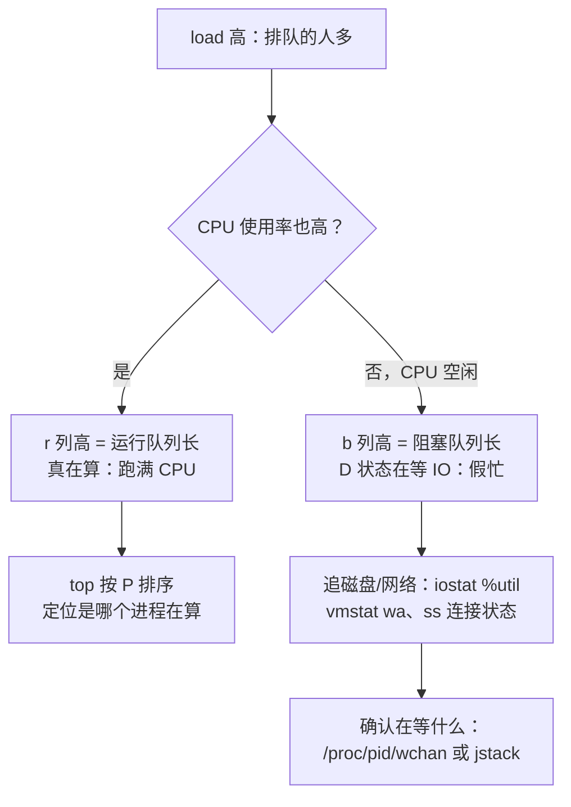
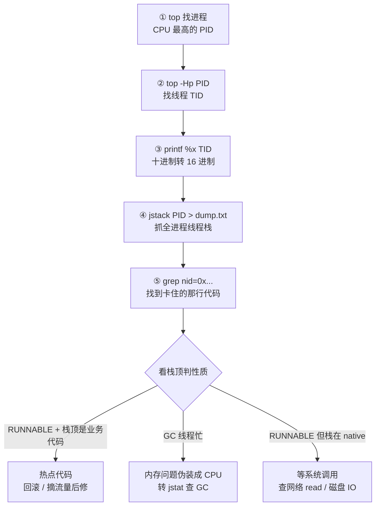
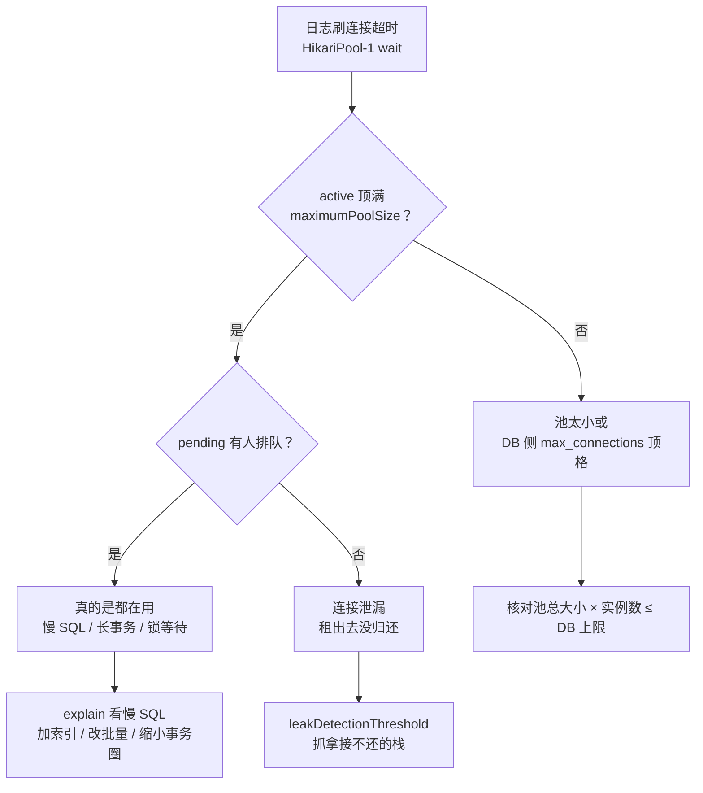

# 阶段五 · 小点 5：Linux 与系统排查

> 所属：阶段五 云原生与运维工程
> 定位：问题最终都落在「某台机器的某个进程」上。这一讲把 OS 层工具与 Java 进程诊断工具接起来，形成**从现象到代码行**的完整排查链——并背下一个必考范式的五步流程。

## 快速入门

> 本节为「故障排查速览」：先认识排查要用哪些命令、各自看什么；「五步范式、火焰图」留在正文提高部分。

### 本讲核心关键词速查

| 关键词 | 一句话大白话 | 例子 |
|-|-|-|
| 进程 / 线程 | 运行中的程序 / 进程内的执行单元 | `ps` / `top` |
| CPU 100% | 进程一直在算 | 死循环/自旋 |
| 内存 | 进程占用内存 | 堆/直接内存 |
| jstack | 打印 Java 线程栈 | 看线程在干嘛 |
| jmap | 看堆内存快照 | OOM 分析 |
| jstat | 看 GC 统计 | 内存健康 |
| Arthas | 在线诊断工具 | 不改代码看方法耗时 |
| 火焰图 | 看 CPU 热点的方法 | 一眼看到热点 |

### 本讲在解决什么问题

- **问题**：线上 CPU 飙高、内存 OOM、连接池耗尽——你只能看日志猜？这一讲教你用 OS 工具 + Java 诊断工具，**从「现象」定位到「代码行」**。
- **你要带走的一句话**：排查主线是「**top 看进程 → top -Hp 看线程 → printf 线程 id 转 16 进制 → jstack 看线程栈 → 定位到代码**」。CPU 100% 用这条链，一步到代码行。

### 最简可运行示例（照抄能跑）

```bash
# CPU 100% 排查五步: 从进程到代码行
top                                          # ① 看哪个进程 CPU 高(记下 PID)
top -Hp <PID>                                # ② 看该进程里哪个线程 CPU 高(记下 TID)
printf "%x\n" <TID>                         # ③ 把线程 10 进制转 16 进制(nid 用)
jstack <PID> > dump.txt                      # ④ 抓该进程的线程栈
grep -A20 "<16进制nid>" dump.txt             # ⑤ 在栈里找到那个线程, 看它卡在哪段代码
```

> 命令备注（逐行解释）：
> - `top`：看哪个进程 CPU 高，记下 PID。
> - `top -Hp <PID>`：看这个进程里哪个**线程** CPU 高，记下 TID。
> - `printf "%x\n" <TID>`：把线程 ID 转成 16 进制——因为 `jstack` 输出里线程号是 16 进制（`nid=0x...`）。
> - `jstack <PID>`：抓整个进程的线程栈，保存成文件。
> - `grep -A20 "0x..."`：在栈里找到那个高 CPU 的线程，看它卡在哪段代码——**从现象到代码行**。

### 关键工具说明

| 工具 | 干什么 | 最易踩的坑 |
|-|-|-|
| `top` / `top -Hp` | 看进程/线程 CPU | 记下 PID/TID 再抓栈 |
| `jstack` | 线程栈 | 线程号是 16 进制，要转换 |
| `jmap` / `jstat` | 堆 / GC 统计 | OOM 分析用 |
| `Arthas` | 在线诊断 | `dashboard` / `thread -n 5` / `trace` |
| `printf "%x\n"` | 十进制转十六进制 | 匹配 jstack 的 nid |
| 火焰图 | CPU 热点 | 最宽的不是最高（栈宽=占比） |

### 常用约定 / 命名提示

- **排查模板**：CPU 高用五步（top→top -Hp→printf→jstack→grep）；连接池耗尽看 `HikariPool-1 - wait`（正文场景二）。
- **容器里优先 `kill -3`**：某些容器环境不方便上 Arthas 时，`kill -3 <pid>` 也能触发线程栈输出（正文展开）。
- **Arthas 三连**：`dashboard`（总览）→ `thread -n 5`（最忙线程）→ `trace`（跟踪方法耗时）。

## 精简大纲

1. 基础命令：进程 / 网络 / 磁盘
2. Java 进程诊断四件套：jstack / jmap / jstat / Arthas
3. 火焰图：async-profiler
4. 实战范式：CPU 100% 从现象到代码行
5. 实战场景二：连接池耗尽（HikariCP）

## 学习内容详情

### 1. 基础命令（按问题类型选）

```bash
# 进程与资源：先看全局负载再看单进程
top                     # 概览: 1 看 load average(负载均值, 运行队列长度), 3 看 %wa(IO等待) CPU st(steal)
vmstat 1                # 每秒一行: r(运行队列) b(阻塞) si/so(换页) us/sy/wa —— 趋势定位层
iostat -x 1             # 磁盘: %util 接近 100 + await 高 = 磁盘饱和
pidstat -p <pid> 1      # 单进程 CPU/IO 明细

# 网络：连接状态是第一现场
ss -s                   # 汇总: TCP 连接数分布, TIME-WAIT/CLOSE-WAIT 计数
ss -tanp | grep order   # 某服务的连接清单(含进程)
ss -tinp <五元组>      # 单连接的拥塞窗口/RTT —— 慢链路排查(-i 内部信息, -n 数字, -p 进程)
lsof -p <pid> | wc -l   # 文件描述符(File Descriptor, fd)占用(连接耗尽先看这个)
tcpdump -i any host 10.0.0.5 and port 3306 -w db.pcap   # 抓包终审(阶段一第10讲伏笔): 拿 pcap 进 Wireshark

# 磁盘
df -h                   # 空间满了: 日志没轮转 / dump 忘删 是 K8s 外的另一类"驱逐"
du -sh /var/log/*       # 找占用大头
```

#### load average（负载均值）≠ CPU 使用率

命令注释里的「load average」是对新人最容易看懵的一行，先单独讲清它再往下走。

**生活版类比**：奶茶店有 2 个店员（2 核 CPU）。**load 统计的是「正在调奶茶的 + 门口排队等的人」**，而 **CPU 使用率只问「2 个店员忙不忙」**。于是两种反差都合理：高峰时店员忙到 100%、但门口没人排队（load ≈ 2）；或者店员全去仓库搬货（等磁盘），柜台空着、CPU 空闲，但 load 照样高。

**换成 Linux 排查**：`top` 第一行的 load（1 / 5 / 15 分钟）与 `%Cpu` 那行是两个指标，要对照着看——



> **换页（si/so）类比**：内存不够时，OS 把暂时不用的内存块挪到磁盘 swap 分区腾地方——像宿舍住满时把换季衣服塞进行李箱。但磁盘比内存慢几个数量级，反复挪进挪出（`vmstat` 的 si/so 两列持续有值）就是「抖动」，性能会被拖垮，本质是内存不够，不是磁盘的锅。

> ⏸️ **短期可以不学**：tcpdump / Wireshark 的深度分析是「终审手段」——平时网络链路问题常有 SRE / 网络团队兜底，主线会基本用法即可。**何时回来学**：跨环境调不通、慢链路需要自己拿证据时。**面试最低要求**：能说出 `-w` 落盘 + BPF 过滤（host / port）两个基本动作。

#### 一次请求在 Linux 上的旅程（把命令串成链）

上面按「问题类型」列命令，但真实排查时是先有一条请求，再倒着找它卡在哪一环。先把请求从进到出的每站认一遍，之后看命令就知道自己在看哪一站。

**生活版类比**：寄快递——大门收件（网卡）→ 分拣中心（内核协议栈）→ 快递员派送（业务线程）→ 按地址放进写字楼第 3 层（进程内存）→ 盖回执章、写单（写磁盘 / 日志）→ 揽收完成送出去（网卡发包）。

**换成 Linux 排查**：请求慢就沿着这条链，每站挂一个对应命令——


> 对照工具：链路每慢一环都能用命令对号入座——`ss` 看 TCP 连接状态（CLOSE-WAIT 就是卡在「收到关闭但本地没关」的中途站）；jstack 栈顶停在 `socketRead` / `FileInputStream.read` 这类名字，就知道卡在 D 站 / F 站；卡哪里，上一节的 load/IO 判断链就排到哪里。

### 2. Java 进程诊断四件套

| 工具 | 看什么 | 典型场景 |
|-|-|-|
| **jstack** | 线程快照（Thread Dump） | 死锁（直接 `Found one Java-level deadlock`）、高 CPU 线程（配合第 4 节）、线程池饿死 |
| **jmap** | 堆直方图 / 堆转储（Heap Dump） | `jmap -histo:live <pid> | head -20` 快速看谁占堆 → `-dump:live` 留现场给 MAT |
| **jstat** | GC 实时统计 | `jstat -gcutil <pid> 1000`：O 列持续 >85% + FGC 递增 → 内存泄漏画像（第 6 讲） |
| **Arthas** | 在线方法级诊断 | 不重启进程看参数 / 耗时链 / 类加载来源 |

```bash
# Arthas 三连（attach 到进程后）：
$ dashboard                  # 全景: 线程TOP/内存/GC 实时面板 —— 先看面
$ thread -n 5                # 最忙的 5 个线程的栈 —— 直接给"凶手行号"
[Busy Threads] Id=88 "http-nio-8080-exec-15" RUNNABLE, cpu 99.9%
    at com.demo.report.RegexValidator.check(RegexValidator.java:41)   # ← 定位到了
$ trace com.demo.OrderService detail                  # 方法内部耗时分解(火焰图的定点版)
`---ts=...-#164 method=detail duration=1834ms
    +---[15ms] orderRepo.find()
    `---[1800ms] priceClient.query()                 # ← 慢在下游调用
$ watch com.demo.PriceClient query '{params, returnObj}' -x 2   # 抓一次真实出入参复现脏数据
```

- **Arthas 纪律**：`watch` / `trace` 有开销且会打全量日志到终端——生产用完即 `stop` 退出，别常驻；`-n 3` 限制采样次数。

### 3. 火焰图

```bash
# async-profiler: 采样 30s 生成 CPU 火焰图(对目标进程 99 倍频采样, 开销 <1%)
./asprof -d 30 -f cpu.html <pid>
```

```text
怎么读(横宽 = 占样本比例, 纵高 = 调用深度):
  ┌────────────────────────────────────────────┐
  │              java.lang.Thread.run          │
  │  ┌──────────────┬───────────────┐          │
  │  │  GC 线程 35% │ OrderService 40% │       │  ← GC 占 1/3 宽度 = 分配速率过高(回查 new)
  │  └──────────────┴───────┬───────┘          │  ← 单个业务方法 40% = 里面必有慢段, 点开展开
  │                ┌────────┴────────┐         │
  │                │ RegexValidator 38% │      │  ← 热点收敛到一处: 优化目标出现
  │                └─────────────────┘         │
  └────────────────────────────────────────────┘
  目标: 找"最宽的板", 不是最高的塔; 优化前后两张图 = 绩效证据
```

### 4. 实战范式：线上 CPU 100%，五步定位到代码行

先把五步的「决策链」画出来，再看下面的命令细节——每步卡在哪、分岔往哪走，一目了然：



```bash
# 步骤 1: 定位进程
top -c                                  # 按 P 排序, 找到 %CPU 爆表的 pid

# 步骤 2: 定位线程
top -Hp <pid>                           # -H 展开线程列表; 记下最耗 CPU 的线程 TID(如 12345)

# 步骤 3: 线程号转十六进制
printf '%x\n' 12345                     # → 3039
# 为什么能对上: Linux 是 1:1 线程模型(NPTL), 每个 Java 线程 = 一个内核线程,
# jstack 里的 nid 就是 OS 线程 TID 的 16 进制 —— 所以 top 看到的 TID 能直接 grep 到栈

# 步骤 4: 线程栈里找对应 nid
jstack <pid> | grep -A 30 'nid=0x3039'
#   "http-nio-8080-exec-15" #88 daemon prio=5 os_prio=0 tid=0x... nid=0x3039 runnable
#       at java.util.regex.Pattern$CurV...match(Pattern.java:4500)   ← 正则回溯!
#       at com.demo.report.RegexValidator.check(RegexValidator.java:41)
#       at com.demo.OrderController.export(OrderController.java:66)
#   （输出格式随 JDK 版本有差异——盯「线程名 / 状态 / nid」三要素即可，别背格式）

# 步骤 5: 判性质并止血
#   RUNNABLE + 栈顶业务代码 → 热点代码, 回滚/摘流量后修
#   GC 线程忙                → 是内存问题伪装成 CPU(第 6 讲 jstat)
#   RUNNABLE 但栈在 native  → 查 syscall(网络 read? 磁盘 io?)
```

- 常见结局速查：正则灾难性回溯（嵌套量词 `(a+)+b`）、死循环、GC 满负荷（其实是堆问题）、热点方法里的同步 IO、加密 / 序列化风暴。
- **K8s 场景变体（先排除环境，再谈代码）**：CPU 100% 被 **throttling**（节流——像高速路限速，`limits.cpu` 给了你一条「限速车道」，超出的时间片被强制切成碎片）≠ 真 CPU 不够。
  - **判据**：`container_cpu_cfs_throttled_periods` 指标高，表现为 CPU 用不满但请求变慢。
  - **落点**：先对齐 requests/limits 与 JVM 参数（第 2 讲），再谈调代码。

### 5. 实战场景二：连接池耗尽（HikariCP）

- **现象**：日志刷 `HikariPool-1 - Connection is not available, request timed out`——请求全在等连接，不一定是 DB 挂了。
- **排查路径第一步，看指标**：连接池 metrics 看活跃连接数与等待队列——`hikaricp_connections_active` 是否顶满 maximumPoolSize、`hikaricp_connections_pending` 排多长。
- **排查路径第二步，查归还慢**：慢 SQL 拖住连接不归还（explain → 加索引 / 改批量）→ 代码层连接 / 事务泄漏（未关闭、长事务）→ 数据库侧连接数上限。

> 两条分支的换算逻辑就是下面的决策链——池就那么多把枪，先分清「全被占着」还是「有人借了不还」：



### 坑点提醒

- **jstack 要在「事发时」抓**：事后重启现场就没了——线上容器带 `kill -3 <pid>`（打印线程栈到标准输出）的肌肉记忆，比装完 Arthas 再 attach 快。
- **OOM dump 没留现场**：`-XX:+HeapDumpOnOutOfMemoryError` 必须在启动参数里（第 6 讲），事后 `jmap` 的 `-dump:live` 只抓得到活对象、还会触发一次 Full GC。
- **jstack 输出里 BLOCKED 很多 ≠ 死锁**：死锁是互相等（jstack 直接标注）；大量 BLOCKED 是锁竞争热点——顺着等锁栈找持锁者。
- **tcpdump 忘 -w 文件**：默认打终端，海量包把终端刷死——抓包落盘再分析；生产抓包加 BPF 过滤（host/port）缩小量。

## 本节自检

- [ ] 线上 Java 进程 CPU 100%，用 jstack / Arthas 怎么定位到代码行？（五步完整复述）
- [ ] 能说出 jstack / jmap / jstat / Arthas 各自回答什么问题
- [ ] 能读懂火焰图的横轴含义，说出「最宽的板」读图法
- [ ] 能区分「CPU 真高」「GC 伪装」「容器 throttling」三种 CPU 100% 现象与下一步
- [ ] 能用 ss / lsof 定位连接数异常，用 tcpdump 的过滤语法抓指定链路

## 本节配套思考题

1. 「load average 20 但 CPU 空闲 90%」——load 的计数里谁在充数（提示：D 状态），第一反应查哪两个命令？
2. 你的 jstack 显示所有 http 线程都在等 `HikariPool-1 - wait`——从这条线往下画一条完整排查链到根因（结合阶段六第 2 讲的瓶颈清单）。
3. Arthas `trace` 与火焰图都能找慢方法——什么时候选 trace（已知入口验证假设），什么时候选火焰图（无方向全局采样）？

## 常见面试题

### Q1：线上 Java 服务 CPU 100%，完整的排查步骤？
**答**：
- **标准结论**：五步定位：① `top` 找 CPU 高的进程（记 PID）；② `top -Hp PID` 找 CPU 高的线程（记 TID）；③ `printf '%x' TID` 转 16 进制；④ `jstack PID` 抓线程栈，grep `nid=0x...`；⑤ 分析栈顶判断性质并止血。
- **底层原理**：
  - **为什么能定位到行**：Linux 是 1:1 线程模型（NPTL），每个 Java 线程对应一个内核线程，jstack 的 nid 就是 OS TID 的 16 进制；jstack 抓的是线程栈快照，高 CPU 线程的栈顶就是它正在执行的代码（含行号）。
  - **常见结局（栈顶长什么样）**：正则灾难性回溯（`(a+)+b` 类嵌套量词）、死循环、热点方法里的同步 IO、GC 满负荷（其实是内存问题伪装成 CPU）。
- **工程实践**：
  - **先排除环境**：容器环境先排除 throttling（`container_cpu_cfs_throttled_periods` 高 = limits 配额不够，不是代码问题）。
  - **抓栈时机**：事发时抓栈才有意义，事后重启现场就没了——线上练出 `kill -3` 打印线程栈的肌肉记忆。
  - **工具与验证**：生产用 Arthas `thread -n 5` 比手抓栈更快；优化前后各抓一次栈对比验证。
  - **加分**：说「RUNNABLE 但栈在 native 方法」说明在等系统调用（网络 read / 磁盘 IO），要往下查 syscall。

### Q2：线上 OOM 怎么排查？
**答**：
- **标准结论**：三步——
  - ① 确认现象：进程被杀 / 抛 OutOfMemoryError，看 `jstat -gcutil` 或容器 OOMKilled。
  - ② 拿堆转储（Heap Dump）：启动参数 `-XX:+HeapDumpOnOutOfMemoryError` 自动留存，或 `jmap -dump` 手动抓。
  - ③ 用 MAT 分析：找占堆最大的对象，Dominator Tree 看引用链。
- **底层原理**：
  - **OOM 分两类**：堆 OOM（对象占满堆、GC 顶不住）和堆外 OOM（元空间、直接内存、线程栈）。
  - **MAT 怎么找**：堆转储记录了崩溃瞬间的对象快照，MAT 从 GC Root 做可达性分析，找到「明明该被回收却还被引用」的泄漏路径。
  - **注意启动参数**：`-XX:+HeapDumpOnOutOfMemoryError` 必须在启动参数里——事后 `jmap -dump:live` 只抓活对象、还会触发一次 Full GC，现场已被污染。
- **工程实践**：
  - **先后顺序**：先止血（重启 / 扩容 / 回滚）再分析，dump 要带现场。
  - **常见根因**：ThreadLocal 持有大对象、静态集合只增不减、连接池 / 缓存无限增长、日志框架堆栈泄漏。
  - **容器特判**：容器环境 OOMKilled ≠ Java 堆 OOM——可能是 cgroup 内存上限（含堆外）被突破，先核对 limits 与 JVM 参数。
  - **加分**：说「OOM 排查的产出一份内存基线」——把正常与异常的对象分布对比，比单看一次 dump 更高效。

### Q3：怎么用 jstack 排查死锁和线程阻塞？
**答**：
- **标准结论**：死锁会被 jstack 直接标注（`Found one Java-level deadlock`），列出互相等待的线程和锁；大量 BLOCKED 不是死锁而是锁竞争——顺着等锁栈找持锁者；线程池饿死表现为大量线程在 WAITING 等任务。
- **底层原理**（三种「等」的区分）：
  - **死锁** = 两个线程各持一把锁互等对方那把（循环等待），jstack 做静态分析可直接判定。
  - **锁竞争** = 很多人等一把快锁，现象是同一把锁下挂一堆 BLOCKED——顺着等锁栈找到持锁线程（往往 RUNNABLE），看它卡在哪个慢操作上。
  - **线程池饿死**是第三种：任务在排队但无空闲线程，栈上全是 pool 线程在 WAITING。
- **工程实践**：
  - **抓栈次数**：要「连续抓多次」（间隔几秒），单次快照会漏掉瞬时状态。
  - **可读性**：线程名规范（业务线程起名）让栈一眼可读；容器里 `kill -3` 触发栈输出到 stdout 配合日志留存。
  - **治理方向**：缩小锁粒度、无锁化（CAS / 并发容器）、异步化。
  - **加分**：说「大量 BLOCKED + CPU 不高」更像锁问题，「大量 RUNNABLE + CPU 高」更像计算热点。

### Q4：load average 很高但 CPU 空闲，可能是什么原因？
**答**：
- **标准结论**：load average（负载均值）统计「运行队列 + 不可中断睡眠（D 状态）」的线程数，不只是 CPU 忙的线程——CPU 空闲但 load 高，典型原因是大量 D 状态线程：磁盘 IO 等待（`iostat` %util 高 + await 高）、网络 IO 阻塞、NFS / 锁等待。
- **底层原理**：
  - **load 怎么算的**：Linux 的 load 把 TASK_UNINTERRUPTIBLE（D 状态，不可被信号打断、等 IO 完成）也计入——设计动机是「这些线程虽然没占 CPU，但系统同样不可用」，所以 load 是「系统整体繁忙度」而非「CPU 利用率」。
  - **D 状态类比**：生活版——等电梯时，只要按了楼层按钮就不再按面板、死等电梯到（不可被信号打断），中间怎么喊它都不受理，只能等电梯到或换一部。换成 Linux——D 状态线程正等磁盘 / 网络 IO 返回，期间连 `kill` 都杀不动，只能等 IO 结束或系统放弃。
  - **怎么区分**：CPU 忙时 load 高是健康信号，IO 卡住时 load 高是故障信号——用 `vmstat` 的 r（运行队列）/ b（阻塞队列）列区分：r 高 = CPU 问题，b 高 = IO 问题。
- **工程实践**：
  - **第一反应**：`vmstat 1` 看 r / b 与 wa、`iostat -x 1` 看磁盘 %util / await。
  - **确认在等什么**：D 状态进程可查 `/proc/<pid>/stack` 或 wchan 确认等什么。
  - **容器注意**：容器内看到的 load 是宿主机的，别被误导。
  - **加分**：说「load 是趋势指标，单点值没意义，看 1 / 5 / 15 分钟的斜率」。

### Q5：Java 服务连接池耗尽（HikariCP）怎么排查？
**答**：
- **标准结论**：现象是日志刷 `HikariPool-1 - Connection is not available, request timed out`——请求全在等连接。排查路径：先看连接池指标（active 是否顶满 maximumPoolSize、pending 排多长）→ 慢 SQL 拖住连接不归还 → 代码层连接 / 事务泄漏（未关闭、长事务）→ 数据库侧连接数上限。
- **底层原理**：
  - **连接池是什么**：连接池是「有限的珍贵资源」——每个连接背后是 DB 进程的一个会话（内存 / CPU 开销），池的意义是把「建连成本」摊销成「复用」。
  - **耗尽公式**：池耗尽 = 租出速度 > 归还速度，两类原因：单条连接占用太久（慢 SQL、长事务、锁等待），或占用后不归还（泄漏——try 里拿连接、finally 外忘关，事务注解圈住外部调用）。
  - **两个指标**：HikariCP 的 active 与 pending 就能区分「都被占着」还是「有人排队」。
- **工程实践**：
  - **建观测**：开 HikariCP metrics 进 Grafana，把 active / pending 与慢 SQL 日志对照。
  - **慢 SQL**：用 explain 分析、加索引、改批量。
  - **事务圈**：尽量小（读操作不开事务、事务里别调远程）。
  - **抓泄漏现场**：连接泄漏用 HikariCP 的 leakDetectionThreshold。
  - **DB 侧对账**：`max_connections` 也要对账（池总大小 × 实例数 ≤ DB 上限）。
  - **加分**：说「连接池不是越大越好」——大池 × 多实例可能打爆数据库，池大小按 DB 容量规划。
