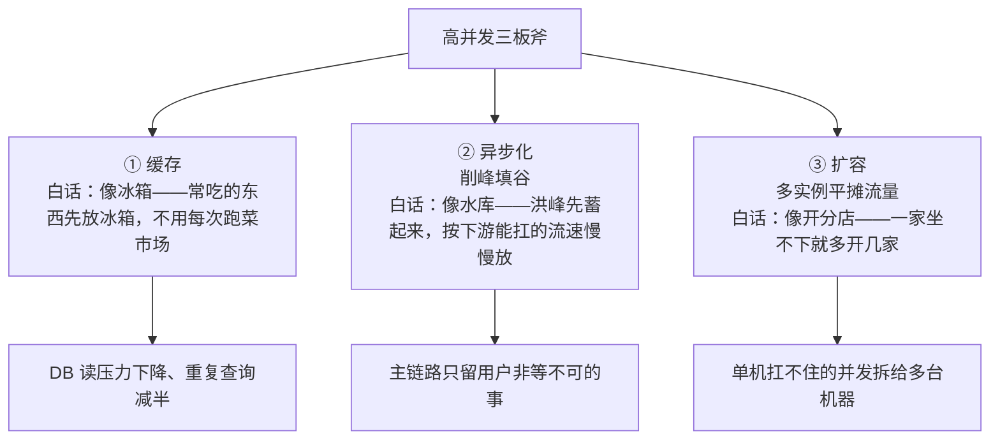
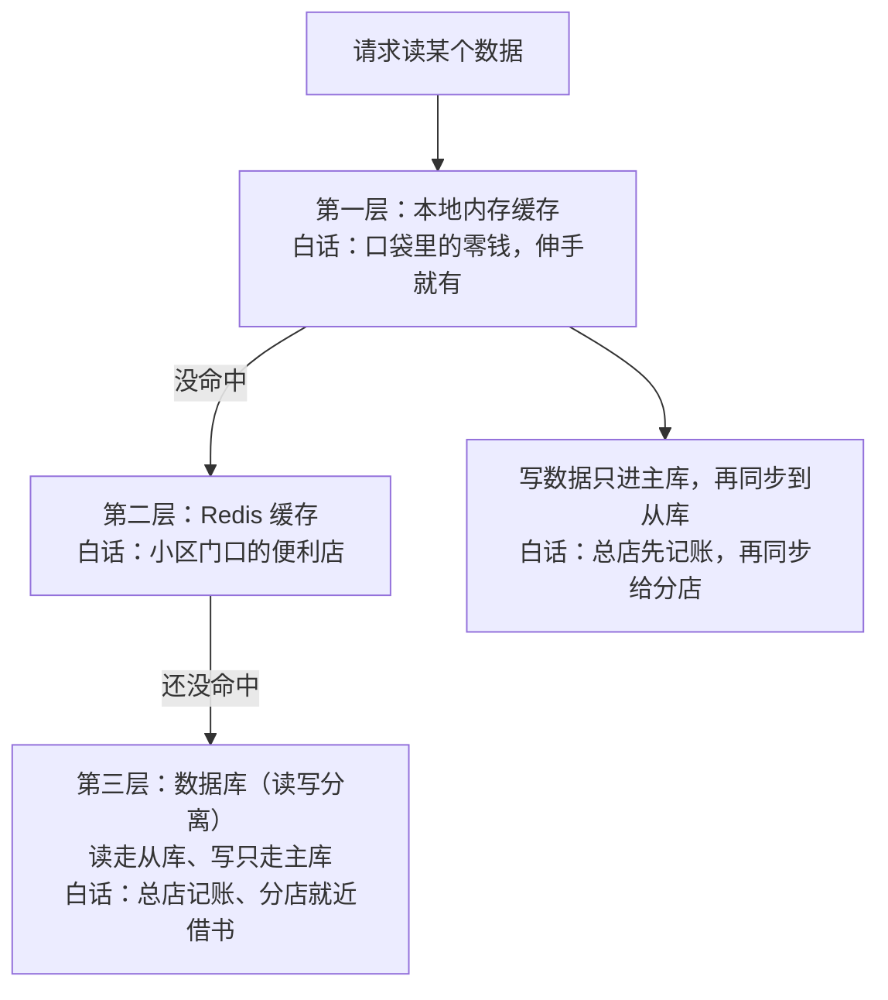
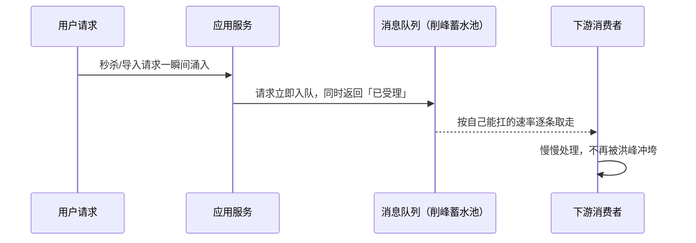
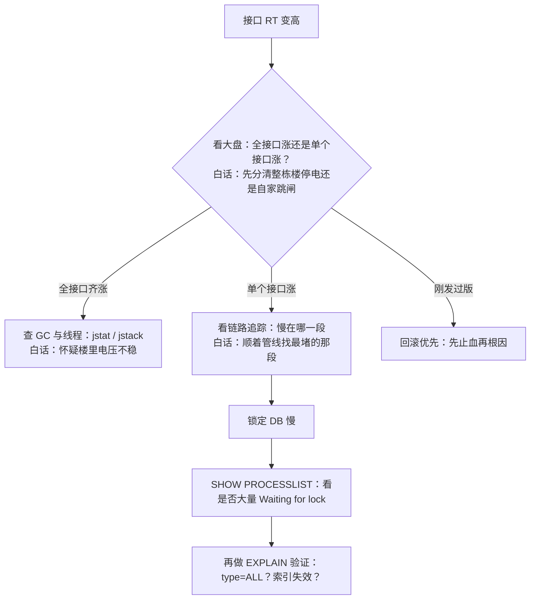

# 阶段六 · 小点 2：高性能架构

> 所属：阶段六 架构设计与服务端思维
> 定位：优化不是「哪里慢改哪里」，是有方法论的自上而下流程。本讲的核心产出是一套**排查动作序列**（RT 从 50ms 涨到 2s 时前 5 个动作做什么）和 **p99 分位数思维**（平均值会骗人）。

## 快速入门

> 本节为「性能优化速览」：先认识优化的正确顺序、几个高频瓶颈；「p99 思维、排查动作」留在正文提高部分。

### 本讲核心关键词速查

| 关键词 | 一句话大白话 | 例子 |
|-|-|-|
| RT（Response Time，响应时间） | 一次请求从发出到返回的耗时 | 50ms / 2s |
| QPS | 每秒请求数 | 系统吞吐 |
| 瓶颈 | 拖慢系统的那个环节 | 慢 SQL / 无缓存 |
| p99（99th Percentile，99 分位） | 99% 请求快于该值 | 长尾比平均值真实 |
| 缓存 | 减少重复查询 | 挡住 DB 压力 |
| N+1 查询 | 循环逐条查关联 | 高频性能问题 |
| 慢查询（Slow Query） | 执行很慢的 SQL | 索引没用好 |
| 预计算 | 提前算好存起来 | 报表、计数 |

### 本讲在解决什么问题

- **问题**：RT 从 50ms 涨到 2s，是哪里慢？优化不是猜，而是**自上而下、先测量再优化**——先确认瓶颈在哪层，再动手。
- **你要带走的一句话**：优化顺序「**业务裁剪 → 架构调整 → 代码优化 → JVM 调优 → OS/硬件**」。先测量（看证据）再优化，别上来就改代码。

### 最简可运行示例（照抄能跑）

```sql
-- 排查慢 SQL 的第一动作: EXPLAIN 看这条查询怎么执行
EXPLAIN SELECT id, status, total_amount FROM `order`
WHERE user_id = 10086 AND created_at >= '2026-09-01';
-- 若 type=ALL (全表扫) → 索引没生效, 慢的根源
-- 优化: 建覆盖索引 (user_id, created_at, status, total_amount)
```

> 代码备注（逐行解释）：
> - `EXPLAIN ...`：看这条 SQL 的执行计划——是走索引还是全表扫。
> - `type=ALL` 表示全表扫（最慢）；`key=xxx` 表示用上了某个索引。
> - 优化方向：建一个**覆盖索引**（Covering Index）——查询需要的列都包含在索引树里，读完索引就拿到全部数据，**不用再按主键回聚簇索引查一次（回表）**，省掉一次随机 IO。
> - 这就是「先测量再优化」——先看 EXPLAIN 确认瓶颈在索引，再建索引，而不是盲目加机器/改代码。

### 关键概念说明

| 概念 | 干什么 | 最易踩的坑 |
|-|-|-|
| 慢 SQL | 执行慢 | 先 EXPLAIN 看索引，别盲目加索引 |
| N+1 查询 | 循环逐条查关联 | 用批量 in / JOIN / fetchJoin 解 |
| 缓存 | 挡读压力 | 有一致性问题（先更 DB 再删缓存） |
| p99 | 长尾指标 | 平均值会骗人（p99 才真实） |
| 预计算 | 提前算好 | 报表/计数场景 |
| 分析工具 | 定位瓶颈 | Arthas / 火焰图 / JFR |

### 常用约定 / 命名提示

- **优化顺序**：业务裁剪 → 架构调整 → 代码优化 → JVM 调优 → OS/硬件——从上层到下层，别上来就调 JVM。
- **先测量再优化**：看证据（EXPLAIN、trace、指标）再动手，不靠猜。
- **平均值会骗人**：看 p99（99% 请求多快）而不是平均——少数慢请求就能拉高平均值。

## 精简大纲

1. 优化方法论：自上而下 + 先测量再优化
2. 常见瓶颈清单：七类瓶颈的特征与对策
3. 实战推演：RT 50ms → 2s 的前 5 个排查动作
4. p99 分位数思维：为什么平均值会骗人
5. 分析工具：Arthas / 火焰图 / JFR

## 学习内容详情

### 1. 优化方法论

#### 1.1 自上而下的顺序

```
① 业务裁剪   →  这个功能能不能不做 / 少做 / 延迟做？   ← 杠杆最大、成本最小
② 架构调整   →  加缓存、异步化、读写分离、预计算       ← 改变流量分布, 收益数量级
③ 代码优化   →  算法、数据结构、循环内 IO             ← 常量级收益
④ JVM 调优   →  GC 选型、堆大小、分配速率             ← 消除毛刺
⑤ OS / 硬件  →  网卡、磁盘、内核参数                  ← 最后的手段
```

> **为什么业务裁剪排第一**：「报表实时算」改成「每小时预计算一次」，RT 从 2s 到 50ms，一行性能代码没写。架构师的第一直觉应该是「这流量该不该存在」，而不是「这流量怎么扛」。
>
> **先测量再优化**：没有 profile 数据的优化是赌博。任何「我猜是慢 SQL」都必须先被数据证实（第 3 节的推演就是标准动作）。
>
> ⏸️ **短期可以不学**：⑤ 层的 OS/硬件调优（内核参数 sysctl、TCP 缓冲区、网卡/磁盘队列）是 SRE 与平台团队的日常，业务开发一年难遇一次。**何时回来学**：压测/容量治理时证据显示网络栈或磁盘层已成为瓶颈，或转岗 SRE/平台向。**面试最低要求**：说出它在优化顺序里排最后——「先证明瓶颈在 OS/硬件层，再动它」。

「② 架构调整」在业界有个更名场面：**高并发三板斧**——缓存、异步、扩容。前面那些调参大多治标，这三板斧改变流量本身的分布：



#### 1.2 前端迁移：你早就会这套思维

性能优化方法论与前端完全同构——**Web Vitals 优化路径**就是这个顺序的浏览器版：

| 后端 | 前端对应 |
|-|-|
| ① 业务裁剪（首屏不做那么多模块） | 首屏按需加载、砍掉首屏三方脚本 |
| ② 架构调整（缓存 / 异步） | CDN、HTTP 缓存、`requestIdleCallback` 延迟计算 |
| ③ 代码优化 | 防抖节流、虚拟列表、memo |
| 先测量再优化 | Lighthouse / Performance 面板打点 |

### 2. 常见瓶颈清单

| 瓶颈 | 特征 | 对策 |
|-|-|-|
| 慢 SQL | DB RT 高、连接池等待 | EXPLAIN 四看、索引 / 重写（阶段三第 1 讲） |
| N+1 查询 | 循环单查 / 懒加载逐条查 | 批量 in 查询、JOIN、JPA 的 fetchJoin / @EntityGraph |
| 锁竞争 | CPU 不高但 RT 高、线程 BLOCKED | jstack 看 BLOCKED 链、缩小锁粒度、无锁化 |
| GC 停顿 | RT 毛刺与 GC 日志时间点对齐 | 选 GC / 调参 / 降分配速率（阶段一第 6 讲） |
| 连接池打满 | `getConnection` 等待超时 | 池参数与流量匹配、回查慢查询 |
| 缓存命中率劣化 | DB 流量突增 | 命中率监控、TTL / 预热策略回查 |
| 序列化开销 | 大 payload / 高频序列化 | Protobuf、字段裁剪、压缩 |

> 注：N+1 的「特征」展开——**1 条主查 + N 条关联查**，单条 SQL 都不慢，接口 RT 却高，所以靠单条 SQL 耗时看不出来。
>
> **生活版类比——“衣柜找衣服”**：常穿的衣服放衣柜里，出门先看衣柜，有就直接拿（命中）；没有才跑商场现买（未命中）。衣柜放得越准，跑商场的次数越少。换成缓存：**缓存命中率 = 请求在缓存里直接拿到的比例**，命中率越高，DB（商场）被访问的次数越少——监控里缓存命中率劣化（DB 流量突增）说明缓存没起到「衣柜」作用，该回查 TTL 是否过短、预热策略是否失效。

> **EXPLAIN 四看**：`type`（访问类型：ALL 全表扫 < index < range < ref < eq_ref < const，越靠右越好，出现 ALL 就是最大嫌疑）、`key`（实际用到的索引，`NULL` 说明索引没生效）、`rows`（预估扫描行数）、`Extra`（出现 `Using filesort` / `Using temporary` 就是隐性地雷）——四看齐了才叫「定位到问题」，只看 type 不算。
>
```yaml
# 连接池打满的典型配置病灶（HikariCP, Spring Boot 默认池）
spring:
  datasource:
    hikari:
      maximum-pool-size: 10        # 默认值! 5 个实例 × 10 = DB 侧 50 连接
                                   # DB max_connections=100 时, 扩到第 10 个实例就连接耗尽
      connection-timeout: 3000     # 拿不到连接 3s 报错 —— 比「无限等」好, 快速暴露问题
```

> **连接池大小的反直觉**：不是越大越快——`活跃连接 = 并发数 × RT`（Little's Law，第 6 讲），连接池超过这个值只会让 DB 上下文切换更慢。经验起点：`(核数 × 2) + 有效磁盘数`，再压测修正。
>
> **生活版类比——“餐厅只有固定几张桌”**：餐厅好不好不取决于临时多搬椅子——客人再多，翻台也只跟桌数和厨师有关，加凳子的后果是大家都挤着干等、上菜队越排越长。换成连接池：**一个连接就是一条数据库会话**，同时能「真正干活」的连接 ≈ 并发 × RT，池开得太大时多出的连接不是在干活、而是在排队等锁/等 IO，反而增加 DB 上下文切换。

「② 架构调整」里的**读写分离 + 多级缓存**，读链路长这样，每一层都是为了「少让最底下的 DB 被直接打到」：



**异步化怎么做到「削峰填谷」**——请求立刻被响应，真正的重活在队列那头慢慢做：



> **生活版类比——“水库放水”**：上游暴雨（洪峰）若直接往下排，下游河堤会被冲垮；水库先把水蓄起来，再按下游扛得住的流速慢慢放。换成异步：**MQ 就是这座水库**——请求峰瞬间涌入时先全部丢进队列「蓄起来」、立即返回「已受理」，消费者按自己的处理速度慢慢消费，下游系统始终在安全水位。这就是「削峰填谷」四个字的来历。

### 3. 实战推演：RT 50ms → 2s 的前 5 个排查动作

假设监控告警：`/api/order/create` 的 p99 从 50ms 涨到 2s。**顺序**比动作本身更重要——从全局到局部，先定位层再下钻：

```bash
# 动作 1: 看监控大盘 —— 定位是"我"还是"别人"
#   同一时刻其他接口的 p99 也涨了吗? 应用 CPU / GC 正常吗?
kubectl top pods                          # 实例 CPU/内存是否打满
# 看 Prometheus: 如果全接口 RT 齐涨 + GC 频率暴增 → GC / 实例级问题, 跳到动作 4
# 如果只有 order/create 涨 → 接口自身链路问题, 进动作 2

# 动作 2: 看链路追踪 —— 找到慢在哪一段
#   SkyWalking/OTel 的 Trace 视图: 网关→服务→Redis/DB/RPC 每段耗时
#   发现: DB span 1.8s, 其余正常 → 锁定 DB, 进动作 3

# 动作 3: 拿证据 —— 慢 SQL / 锁 / 连接池三选一
SHOW PROCESSLIST;                         # 当前在跑的 SQL, 是否大量 Waiting for lock
# 看 HikariCP 指标: pending connections > 0 → 连接池等
EXPLAIN SELECT id, status, total_amount FROM `order`
    WHERE user_id = 10086 AND created_at >= '2026-09-01';  # type=ALL 全表扫 → 索引失效(阶段三第 1 讲)

# 动作 4: 应用自身 —— 线程与 GC
jstack <pid> | grep -c BLOCKED            # 大量 BLOCKED → 锁竞争
jstat -gcutil <pid> 1000                  # FGC 频率 / 老年代占用飙升 → 内存问题伪装成 RT 问题

# 动作 5: 关联变更 —— "今天发过什么?"
kubectl rollout history deployment/order  # 刚发的版本是否引入慢查询/N+1
git log --oneline -10                     # 回滚是止血的第一选项, 别急着"边查边修"
```

> **前 5 个动作的顺序记忆**：大盘（谁的问题）→ 链路（哪一段）→ 证据（SQL/锁/池）→ 线程与 GC（应用自身）→ 变更（最近改了什么）。**先止血再根因**：回滚 / 扩容 / 降级在排查序列里优先于「修复代码」。

整条决策链浓缩成一句话「**先分清是谁的问题，再顺着链路找证据**」：



### 4. p99 分位数思维

#### 4.1 平均值怎么骗人

```json
// 同一个接口的两份"平均 RT = 80ms" —— 用户体感完全不同
// 样本 A（平稳）: [78, 79, 80, 81, 82]              → 平均 80, p99 = 82 ✅ 体验一致
// 样本 B（长尾）: [10, 10, 10, 10, 400]              → 平均 88, p99 = 400 ❌ 每 100 人有 1 人等 400ms
```

> **生活版类比——“全班平均 80 分”**：平均 80 的班有两种可能：全班都在 79~81 分（人人体验一致），或 90% 的人 90+、10% 的人只考 40（少数差生拉低平均）。家长问「孩子实际体验如何」，看平均分毫无意义——**p99 就是「最差的那 1% 到底有多差」**，是真实体验的底线。

```java
// 为什么监控必须看分位数: 用 Micrometer 直方图桶才能算 p99（平均值聚合不出分位数!）
DistributionSummary.builder("order.create.latency")  // Boot/Micrometer 埋点
    .publishPercentileHistogram()                    // 直方图桶: 服务端可聚合出 p95/p99
    .publishPercentiles(0.95, 0.99)                  // 客户端预聚合 p95/p99
    .register(registry)
    .record(elapsedMs);                              // 每次请求记录耗时
```

- **p99**：把所有请求按耗时排序，第 99% 位置的值——「最慢的 1% 请求的耗时底线」。
- **SLO 与容量规划全部用分位数**（p95 / p99）：核心链路盯 p99（长尾伤留存），管理后台盯 p95 即可。
- 前端类比：Core Web Vitals 的 LCP/INP 看的就是 75 分位——同一个「别让长尾毁体验」的哲学。

### 5. 分析工具

| 工具 | 定位 | 典型产出 |
|-|-|-|
| **Arthas** | 在线诊断（不重启进程） | `trace` 方法耗时链、`watch` 出入参 |
| **async-profiler** | 采样火焰图 | CPU / 内存热点一眼可见 |
| **JFR**（JDK Flight Recorder） | JVM 内置低开销录制 | 事后分析 GC / 锁 / 分配 |
| **jconsole / jvisualvm** | JDK 自带、本地开发阶段够用的轻量选手 | 内存 / 线程概览——不必事事上 Arthas |

```
# 火焰图怎么读(横向 = 该栈帧占总样本比例):
#   ┌──────────────────────────────────────┐
#   │           java.lang.Thread.run       │
#   │    ┌─────────────┬─────────────┐     │
#   │    │ com.a.Order │  GC 线程 35% │     │  ← GC 占 1/3 宽度: 分配速率过高
#   │    │  .create 40%│             │     │  ← 单个业务方法 40%: 里面必有慢段
#   └────┴─────────────┴─────────────┴─────┘
# 横宽越宽 = 越热; 目标永远是"最宽的那块板", 优化前后的对比图就是绩效证明
```

### 坑点提醒

- **先优化再测量**：没有 before 数据，优化效果无法证明，也无法证明没引入新问题。
- **只盯平均值**：平均 80ms + p99 = 2s 的接口在平均值报表上「一切正常」。
- **调 GC 参数当第一反应**：GC 问题多数是「分配速率过高」的代码问题（循环里拼大对象、缓存无限增长），先查分配来源再动参数。
- **在低峰期压测得出的容量基线**拿去扛大促——流量模型不同（缓存命中率、连接竞争行为都不同），基线必须场景压测（第 6 讲）。

## 本节自检

- [ ] 能按顺序背出 RT 恶化的前 5 个排查动作（大盘 → 链路 → 证据 → 线程与 GC → 变更）
- [ ] 能解释平均值为什么不能作为性能指标，p99 什么时候比 p95 更该盯
- [ ] 能背诵自上而下的优化顺序，并说明为什么业务裁剪排第一
- [ ] 能读懂火焰图：横轴是什么、目标选哪块板

## 本节配套思考题

1. 「加索引后接口快了 10 倍，但一周后又慢回来了」——列举至少三种可能原因（数据量增长改变了执行计划？索引被写坏了？流量模型变了？）。
2. 为什么说「回滚也是性能优化手段」？什么情况下回滚比继续排查更优先？
3. 如果只能保留一个性能监控指标（平均 / p50 / p95 / p99），你选哪个？分场景讨论。

## 常见面试题

### Q1：线上接口 RT 突然从 50ms 涨到 2s，你的排查思路是什么？

**答**：

**标准结论**：按「先止血再根因、从全局到局部」的顺序排查，四步走：
- ① 看监控大盘，区分是「我」还是「别人」——同一时刻其他接口也涨吗？CPU / GC 正常吗？**全接口齐涨优先怀疑实例级问题**（GC、资源耗尽）。
- ② 看链路追踪（SkyWalking / OTel），定位慢在哪一段——网关、Redis、DB、RPC 每段耗时一目了然。
- ③ 拿证据：慢 SQL 用 `SHOW PROCESSLIST` + EXPLAIN；锁竞争看 `jstack` 的 BLOCKED 线程；连接池看 pending connections。
- ④ 查变更：`kubectl rollout history` + `git log`——最近发布的版本往往就是元凶，**回滚是止血的第一选项**。

**原理层**：RT 是整条链路的叠加，任何一层劣化都会体现为接口 RT 升高，所以必须先定位层、再下钻到段。

**工程层**：排查顺序比动作本身更重要——先测量再优化，没有 profile 数据的猜测都是赌博；生产应急优先级是「回滚 / 扩容 / 降级」先行，而不是一上来就「修复代码」。

### Q2：平均 RT 很低但用户反馈卡，为什么？p99 和平均值有什么区别？

**答**：

**标准结论**：平均值的致命缺陷是会被少数慢请求稀释掩盖：同样「平均 80ms」——样本 A（平稳分布）的 p99 是 82ms，样本 B（长尾分布）的 p99 可能是 400ms，**每 100 个用户就有 1 人等 400ms，恰好是这批用户在投诉**。
- **p99（99th Percentile）定义**：把所有请求按耗时排序，取第 99 分位的值，即「最慢的 1% 请求的耗时底线」。

**原理层**：监控系统算分位数必须埋**直方图桶**（Micrometer 的 `publishPercentileHistogram`）——把耗时归入固定区间桶，服务端才能聚合出 p95 / p99；只记平均值的话，事后什么分位数也算不出来。

**工程层**：核心链路盯 p99（长尾伤留存），管理后台盯 p95 即可；SLO 与容量规划全部用分位数——「平均 80ms」里可能藏着一个 p99 = 2s，拿平均值当容量基线必然出事。

### Q3：EXPLAIN 怎么看执行计划？哪些字段是关键？覆盖索引为什么快？

**答**：

**标准结论**：EXPLAIN 输出里最值得看四个字段：
- `type`：访问类型，ALL 全表扫 < index < range < ref < eq_ref < const，越靠右越好。
- `key`：实际用到的索引，`NULL` 说明索引没生效。
- `rows`：预估扫描行数，与实际差距大说明统计信息过期。
- `Extra`：出现 `Using filesort`、`Using temporary` 是隐性地雷。

**原理层**：InnoDB 索引底层是 **B+ 树**（白话：把数据按大小逐层排序、查找像翻字典一样每层砍掉一半范围的树形结构），等值命中主键只需 O(log n) 层查找（白话：数据越多，只多查很少几层），全表扫则要线性读每一行——这就是 `type` 从 const 到 ALL 的代价差距。**覆盖索引（Covering Index）** 的快在于「索引即数据」：查询需要的列全部包含在索引树里，读完索引就拿到结果，不用再按主键回聚簇索引查一次（回表），省掉一次随机 IO。

**工程层**：联合索引按「等值列在前、范围列在后」建；避免在索引列上做函数运算 / 隐式类型转换（会让索引失效）；用 EXPLAIN 验证而不是拍脑袋加索引。

### Q4：什么是 N+1 查询？如何定位和解决？

**答**：

**标准结论**：N+1 是 ORM 懒加载的经典陷阱：先查 1 条主记录，循环访问每条记录的关联字段时再触发一次查询——100 条订单 + 每条查一次用户 = 1 + 100 条 SQL。特征很隐蔽：单条 SQL 都毫秒级，但 101 次网络往返叠起来接口 RT 就爆了。

**原理层**：N+1 的本质是「把一次集合查询拆成了 N 次点查」，多出的开销是 N 次网络往返 + 解析执行成本，不是 SQL 本身慢。
- 定位方法：开启 MyBatis / JPA 的 SQL 日志（或慢查询日志），看到「循环内重复的相同 SQL」就是它；更直接的是链路追踪里 DB span 数量异常多。

**工程层**：解决三件套——批量 `WHERE id IN (...)` 一次查全、显式 JOIN 一次拿全、JPA 用 `fetchJoin` / `@EntityGraph` 预加载。写接口时先想「这个列表要几条 SQL」，超过常量级就要警惕；在 Service 层外（如序列化 JSON 时）访问懒加载关联字段最容易踩坑。

### Q5：数据库连接池大小设多大合适？为什么不是越大越好？

**答**：

**标准结论**：连接池不是越大越好——**活跃连接 = 并发数 × RT（Little's Law）**（白话：池里同时需要「干活中」的连接，只取决于「同时多少人 × 每人占多久」，多出来的都是干等）。连接池超过「并发 × RT」这个值后，多出来的连接只在排队等锁、等 IO，反而增加 DB 侧上下文切换和内存开销。经验起点：`(核数 × 2) + 有效磁盘数`（如 4 核 SSD 机器 ≈ 9 条），再配合压测修正。

**原理层**：一个连接就是一条数据库会话，每条会话要占内存和线程；CPU 密集的 SQL 在「并发 ≈ 核数」量级就能跑满 CPU，盲目设 200 只会让大部分连接处于 sleep 空转。

**工程层**：更常见的问题不是「池太小」而是「SQL 太慢占着连接不放」——池打满时先查慢 SQL（`SHOW PROCESSLIST` 看 long-running query / Waiting for lock），而不是先调池参数；多实例部署要算总账：5 实例 × 池 10 = DB 侧 50 连接，别超过 DB 的 `max_connections`。
