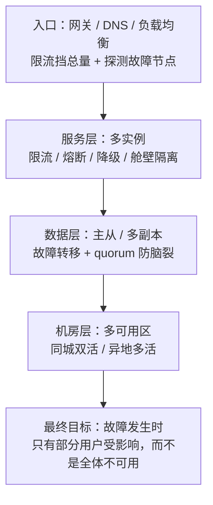
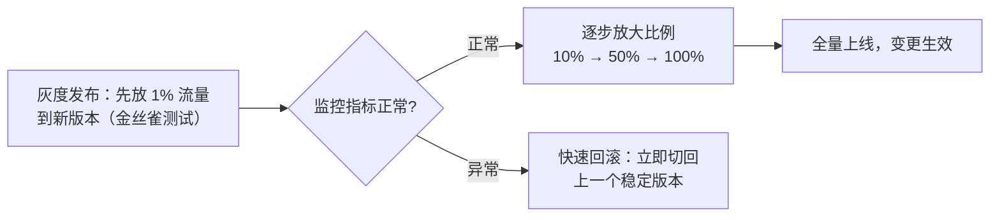
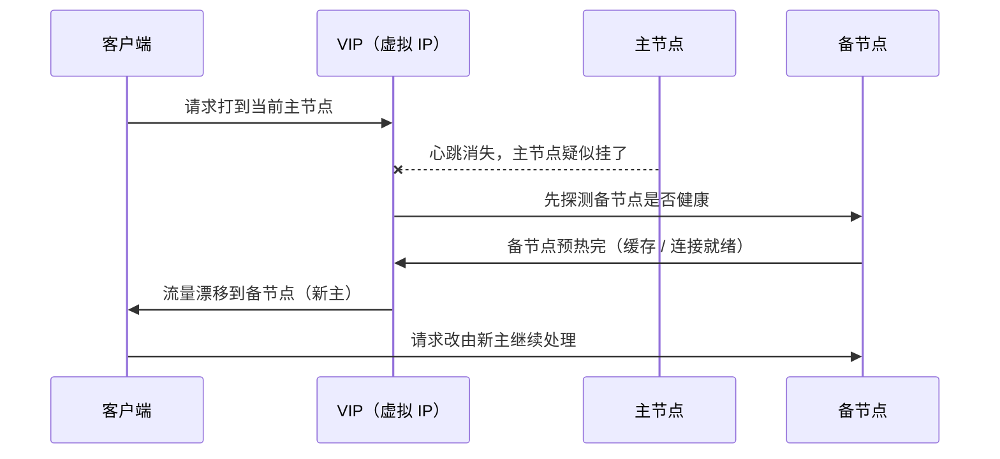
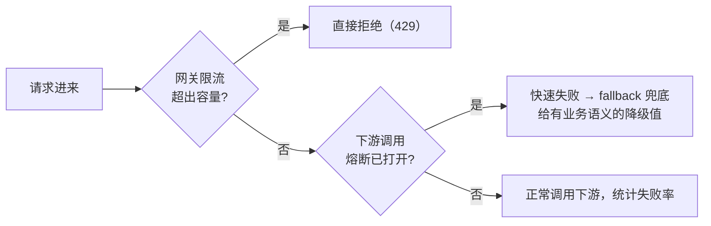
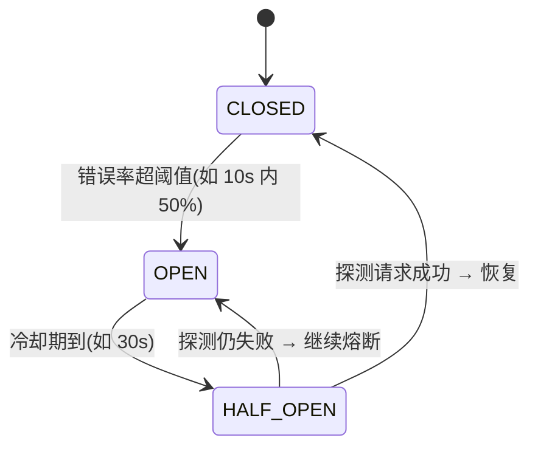
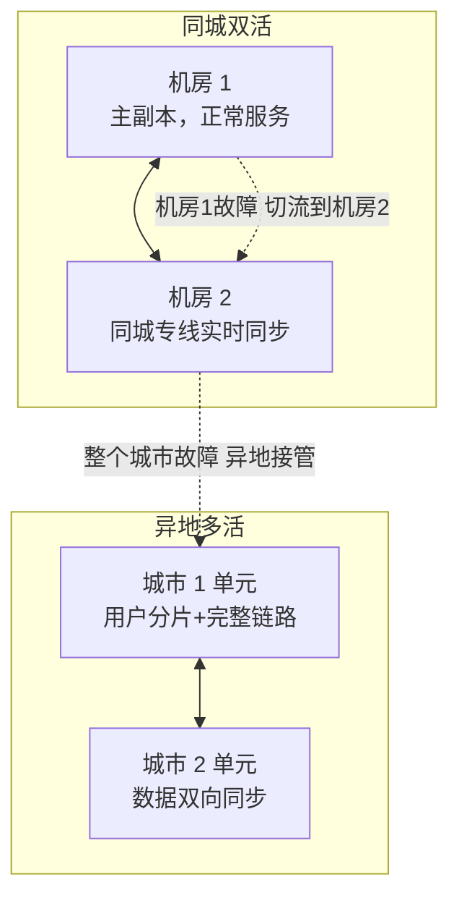

# 阶段六 · 小点 3：高可用架构

> 所属：阶段六 架构设计与服务端思维
> 定位：可用的定义是可量化的（SLA），可用的手段是成体系的（冗余 / 流控 / 演练）。本讲把「几个 9」翻译成停机预算，把限流熔断写成可运行的 Java——前端类比：限流就是后端版的节流（throttle），熔断就是电路保险丝。

## 快速入门

> 本节为「高可用速览」：先认识「几个 9」是什么、限流和熔断是干嘛的；「四种限流算法、三态熔断」留在正文提高部分。

### 本讲核心关键词速查

| 关键词 | 一句话大白话 | 例子 |
|-|-|-|
| SLA（Service Level Agreement，服务等级协议） | 对外的可用性承诺 | 99.9% |
| SLO（Service Level Objective，服务等级目标） | 内部要达到的目标 | 99.95% |
| SLI（Service Level Indicator，服务等级指标） | 实际测量的指标 | 可用率 |
| 限流（Rate Limiting） | 控制单位时间请求量 | 每秒最多 1000 |
| 熔断（Circuit Breaker，熔断器） | 下游挂了就快速失败 | 电路保险丝 |
| 降级（Degradation，服务降级） | 关键时刻砍掉次要功能 | 砍推荐、保下单 |
| 冗余（Redundancy） | 多份备份 | 多实例、主从 |
| 异常演练 | 主动注入故障验证 | 杀实例、断依赖 |

### 本讲在解决什么问题

- **问题**：系统怎么保证「可用」？不是靠运气，而是靠可量化的目标（几个 9）+ 成套手段（冗余、限流熔断、演练）。
- **你要带走的一句话**：**限流** = 控制流量（后端版节流），**熔断** = 下游挂了快速失败（电路保险丝），**降级** = 关键时刻砍次要保核心。先把「可用」翻译成数字，再上手段。

### 最简可运行示例（照抄能跑）

```java
// 熔断: 下游接口挂了就快速失败, 并走降级
@CircuitBreaker(name = "inventory", fallbackMethod = "degrade")
public boolean checkStock(Long skuId) {
    return inventoryClient.checkStock(skuId);   // 调用下游库存
}

// 降级: 下游挂了时返回的兜底
public boolean degrade(Long skuId, Throwable t) {
    log.warn("库存服务不可用, 降级: 默认允许", t);
    return true;      // 产品或靠缓存/默认值兜底(需业务语义)
}
```

> 代码备注（逐行解释）：
> - `@CircuitBreaker(name="inventory", fallbackMethod="degrade")`：给 `checkStock` 加熔断——下游库存服务故障频繁时，自动进入「打开」态，快速失败不再调下游。
> - `fallbackMethod="degrade"`：触发熔断/失败时，调用 `degrade` 兜底（返回一个默认值，别让请求就这么失败）。
> - 三个状态：**关闭**（正常调用）→ **打开**（快速失败）→ **半开**（放点探测流量，成功就关闭）。
> - 这就是「熔断 + 降级」：下游挂了不拖垮自己，而是优雅地给个兜底答案。

### 关键概念说明

| 概念 | 干什么 | 最易踩的坑 |
|-|-|-|
| SLI / SLO / SLA | 测什么 / 目标 / 承诺 | 别把 SLO 当 SLA 承诺 |
| 限流 | 控流量 | 教学级算法不直接上生产（用 Redis/Redisson） |
| 熔断 | 快速失败 | 失败率基于滑动窗口近期调用 |
| 降级 | 砍次要保核心 | 兜底值要有业务语义 |
| 冗余 | 多份备份 | 脑裂要 quorum 仲裁 |
| 错误预算 | 允许的失败额度 | 作为发布/止损的依据 |

### 常用约定 / 命名提示

- **「几个 9」成本**：99.9% 每月停 43 分钟，99.99% 每月停 4 分钟——越高成本越陡，别盲目追。
- **限流的坑**：手写固定窗口/滑动窗口仅供理解原理，生产用 Redis 原子脚本 / Redisson / 网关层（正文标注教学级）。
- **降级兜底要有业务语义**：库存降级返回「紧张」而不是编造的精确数字——那是事故。

## 精简大纲

1. 度量：SLI / SLO / SLA 与「几个 9」的真实成本
2. 冗余与故障转移：脑裂与 quorum 仲裁
3. 限流：四种算法的 Java 实现（固定窗口 / 滑动窗口 / 令牌桶 / 漏桶）
4. 熔断与降级：三态转换 + Sentinel / Resilience4j 配置
5. 异地多活与混沌工程

## 学习内容详情

> **先看全景再学细节**：高可用不是某一个组件强，而是**四层各自冗余、层层兜底**——从入口到机房，任何一层挂了都只是局部降级，而不是全站瘫痪。



### 1. 度量体系：SLI / SLO / SLA

- **SLI（Service Level Indicator）**：测什么——成功率、p99 延迟等服务质量指标。
- **SLO（Service Level Objective）**：目标——「成功率 ≥ 99.9%」。类比前端的 Core Web Vitals 目标（LCP < 2.5s）。
- **SLA（Service Level Agreement）**：对外合同承诺，违反有赔付——SLO 是内部努力目标，SLA 是法律层面。
- 三者是一条链：**SLI 是「测什么」、SLO 是「目标多少」、SLA 是「对外承诺多少」**；且 SLA 通常比 SLO 订得宽松一档（如内部 SLO 99.95%、对外承诺 99.9%）——给自己留足容错余地，别把内部目标直接写成合同条款。

#### 1.1 「几个 9」的真实成本（背下来）

💁 **生活版**：小区门口的便利店贴出「全年无休」——可要真做到 365 天随时有人，店长就得排三班店员、备两台收银机、主电源断了还得自动切发电机。**换成 Java**：SLA 里的「几个 9」就是给自己定「允许坏多久」的预算——承诺 99.9%，一年只有 8.76 小时停机额度；9 越多，达成手段越贵（从「人肉重启」一路升到「全自动切换」）。

| 可用性 | 年停机预算 | 靠什么达成 |
|-|-|-|
| 99%（两个 9） | 3.65 天 | 单机 + 及时重启就行 |
| 99.9%（三个 9） | 8.76 小时 | 冗余部署 + 监控告警 + 值班响应 |
| 99.99%（四个 9） | 52 分钟 | 自动故障转移 + 变更管控（人肉修不完，必须自动化） |
| 99.999%（五个 9） | 5.26 分钟 | 全链路无单点 + 多活 + 自愈 |

> **四个 9 为什么必须自动化**：52 分钟 / 年的预算里，一次「人收到告警 → 看群 → 登录 → 定位 → 手工切换」的全流程就要 20-30 分钟——一年只够犯两次人肉错误。多数线上事故来自**变更**（发布 / 配置修改），所以变更管控（灰度 / 回滚 / 审批）比「加机器」更接近高可用的本质——灰度发布就是「把变更也分层」：



#### 1.2 错误预算（Error Budget）思维

```
SLO = 成功率 99.9%  →  每月允许失败请求 = 总量 × 0.1%
预算没用完  → 可以激进: 多发版、上激进的新功能
预算耗尽    → 冻结变更, 只修稳定性 —— 用数据平息"业务要快"和"系统要稳"的争论
```

### 2. 冗余与故障转移

#### 2.1 无单点与故障转移

💁 **生活版**：直播间主播掉线，导播不是把直播停掉，而是**早就备好备播画面**（双机位），确认直播信号稳了才切过去（预热 + 优雅切换）——观众几乎无感。**换成 Java**：冗余部署买的是「转移预案」而不是「备份日志」：主节点挂了，备节点要**先预热好再优雅接管**流量，客户端靠重试与重连兜住这次切流。

- 每个组件至少双副本，跨可用区部署；主从切换要点：**预热 + 优雅切换**（VIP 漂移 / DNS 切换 / 控制面提升），客户端有重试与重连。
- 数据层高可用矩阵：MySQL 主从 / MGR、Redis 哨兵 / Cluster、Kafka 多副本 ISR（阶段三各自展开）——本讲把它们串成「转移预案」。



#### 2.2 脑裂与 quorum

💁 **生活版**：部门配了 A、B 两个「经理」，中间的对讲机坏了——A 以为 B 休假、B 以为 A 休假，于是一南一北同时指挥，两份互相冲突的指令都下发出去。**换成 Java**：脑裂就是网络分区后两个节点都「以为自己是主」、同时接受写，数据互相覆盖撕裂；quorum（过半投票，quorum 法定人数）就是那条「少数服从多数」的规则，保证任何时刻最多一边能写。

**脑裂（split-brain）**：网络分区后两个节点都认为自己是主，同时接受写——数据撕裂。

```text
3 节点集群, 网线断成了 1 + 2 两半:
  [A]  ←—断—→  [B] [C]
  A 想当主: 只有 1 票 < 半数(2)  → A 自动降级只读 ✅
  B 想当主: B+C 共 2 票 ≥ 半数   → B 当主 ✅
  —— quorum(过半投票)保证了任何时刻最多一边能写

偶数节点为什么危险?  2+2 分区时两边都凑不到"过半"(需要 3)
  → 要么全停(C), 要么引入第三方 witness(奇数仲裁)
```

- **quorum（法定人数）**：写操作需要超过半数节点确认——这是 Raft / ZK / etcd 一切「多数派」设计的出发点（阶段四第 3 讲）。

### 3. 限流：四种算法的 Java 实现

**限流（Rate Limiting）**：控制在时间窗口内最多放行多少请求——后端版的节流（throttle），区别是节流丢的是「事件」，限流丢的是「请求」。

> **先说清定位**：以下实现用于理解原理（教学级）；生产用 Redis 原子脚本 / Redisson / 网关层现成能力，别把手写实现搬上生产线。

#### 3.1 固定窗口：最简单，有临界突刺

```java
// 固定窗口计数器: 每 1 秒一个独立计数器
// —— 实现最简单, 但有"临界突刺": 0.9s 放满 100 + 1.1s 又放满 100
//    实际 200ms 内放进 200 个请求, 下游可能瞬间被打穿
public class FixedWindowLimiter {
    private final int limit;
    private long windowStart = System.currentTimeMillis();
    private int count = 0;

    public FixedWindowLimiter(int limit) { this.limit = limit; }

    public synchronized boolean tryAcquire() {
        long now = System.currentTimeMillis();
        if (now - windowStart >= 1000) {     // 进入新窗口: 重置
            windowStart = now;
            count = 0;
        }
        return ++count <= limit;             // 窗口内超限即拒绝
    }
}
```

#### 3.2 滑动窗口：消除临界突刺（Sentinel 默认）

```java
// 滑动窗口思想: 把 1 秒切成 N 个小格子, 统计"最近 1 秒"= 最近 N 格之和
// —— 窗口边界不再是精确的整秒, 突刺被分摊掉; Sentinel 的 LeapArray 就是这个结构
public class SlidingWindowLimiter {
    private final int slots = 10;                     // 1s 切 10 格, 每格 100ms
    private final int[] counts = new int[slots];
    private long lastSlotStart = System.currentTimeMillis();

    public synchronized boolean tryAcquire() {
        long now = System.currentTimeMillis();
        int slotShift = (int) ((now - lastSlotStart) / 100);   // 距上次的格子数
        if (slotShift > 0) {
            for (int i = 0; i < Math.min(slotShift, slots); i++)   // 滚动: 老格子清零
                counts[(int) ((lastSlotStart / 100 + i + 1) % slots)] = 0;
            lastSlotStart += slotShift * 100L;
        }
        int idx = (int) ((now / 100) % slots);
        counts[idx]++;
        int sum = 0; for (int c : counts) sum += c;    // 最近 1s 总量
        return sum <= 100;
    }
}
```

#### 3.3 令牌桶：允许突发（网关首选）

```java
// 令牌桶: 匀速往桶里放令牌, 请求拿到令牌才放行, 桶满则令牌丢弃
// —— 关键特性: 低谷期攒下的令牌可以应对"合理突发"(比如用户连点 3 次)
public class TokenBucket {
    private final int capacity = 100;          // 桶容量: 最多攒 100 个令牌
    private final double rate = 10.0;          // 每秒生成 10 个令牌(即稳态 10 QPS)
    private int tokens = capacity;
    private long lastRefill = System.nanoTime();

    public synchronized boolean tryAcquire() {
        long now = System.nanoTime();
        tokens = (int) Math.min(capacity,                     // 补令牌, 但不超过桶容量
            tokens + (now - lastRefill) * rate / 1_000_000_000L);
        lastRefill = now;
        if (tokens >= 1) { tokens--; return true; }           // 有令牌: 放行
        return false;                                        // 没令牌: 拒绝(对应 429)
    }
}
```

#### 3.4 四算法对照与选型口诀

| 算法 | 优点 | 缺点 | 用在哪 |
|-|-|-|-|
| 固定窗口 | 实现最简单 | 临界 2 倍突刺 | 后台任务等低要求场景 |
| 滑动窗口 | 消除突刺 | 内存 / 计算略重 | 业务资源保护（Sentinel 默认） |
| 令牌桶 | **允许突发** | 依赖发令牌时钟 | 网关挡总量 |
| 漏桶 | 输出绝对匀速 | 无法应对合理突发 | 保护脆弱的第三方接口 |

> **口诀**：网关挡总量用令牌桶，业务资源保护用滑动窗口，保护脆弱下游用漏桶。

### 4. 熔断与降级

💁 **生活版**：餐厅爆满（限流）——门口排队，别让更多人进店堵上过道；后厨的灶坏了（熔断）——马上挂出「今日不售这道菜」快速回绝，别让点了的客人干等半小时；主菜没货了（降级）——给客人换一份盘中餐顶上，总比让人空着肚子走强。**换成 Java**：限流挡「进来的流量」，熔断不「傻等必挂的下游回来」，降级在故障已发生时给出有业务语义的兜底答案。

> **限流 / 熔断 / 降级，先分清再使用**：三者都防故障，但管的对象和时机完全不同：
> - **限流**管「进来的流量」：主动控制单位时间放行量，防止系统超出自身容量（**限的是请求量**）。
> - **熔断**管「出去的调用」：下游故障率高时快速失败，不再傻等一个必挂的下游（**保的是自己**）。
> - **降级**管「返回什么」：故障已经发生，用有业务语义的兜底值替换正常结果（**保的是核心体验**）。
> - 口诀：**限流是「别让它进来」，熔断是「别等它回来」，降级是「先给个答案」**。

**三者协同的调用链**（层层设防，从入口到每次调用）：



#### 4.1 熔断三态转换

**熔断器（Circuit Breaker）**：像电路保险丝——下游故障率超阈值时「跳闸」，后续请求不再真正调用下游而是快速失败，保护自己不被拖死。



#### 4.2 生产配置（Resilience4j）

```yaml
# Resilience4j: Spring Cloud 官方推荐, 函数式, 无控制台依赖
resilience4j:
  circuitbreaker:
    instances:
      inventoryService:                    # 针对"库存服务"这个下游
        slidingWindowSize: 20              # 基于最近 20 次调用统计
        failureRateThreshold: 50           # 失败率 ≥50% → 熔断打开
        waitDurationInOpenState: 30s       # 打开后冷却 30s 再探测
        permittedNumberOfCallsInHalfOpenState: 3   # 半开状态放 3 个探测请求
  timelimiter:
    instances:
      inventoryService:
        timeoutDuration: 2s                # 单次调用 2s 超时 —— 与熔断配合, 超时也算失败
```

> **窗口语义**：失败率基于滑动窗口内最近 N 次调用统计（`slidingWindowSize` 决定 N）——是「近期表现」，不是「任意时刻」。

```java
import io.github.resilience4j.circuitbreaker.annotation.CircuitBreaker;
import io.github.resilience4j.timelimiter.annotation.TimeLimiter;

@Service
class InventoryClient {
    // 注解式熔断: inventoryService 配置(见上方 yaml), 失败率超阈值自动打开
    @CircuitBreaker(name = "inventoryService", fallbackMethod = "deductFallback")
    @TimeLimiter(name = "inventoryService")
    public CompletableFuture<Integer> deduct(String sku, int count) {
        return CompletableFuture.supplyAsync(() -> realDeduct(sku, count));
    }

    // fallback: 熔断/超时/异常统一走这里 —— 降级预案的代码形态
    private CompletableFuture<Integer> deductFallback(String sku, int count, Throwable t) {
        // 兜底策略三选一(按业务定): ①旧缓存 ②有损服务 ③异步补
        return CompletableFuture.completedFuture(getCachedStock(sku));
    }
}
```

- **降级预案**（要在故障**之前**写好并演练）：兜底数据（缓存旧数据 / 默认值）、有损服务（关推荐保下单）、异步化（先落库后处理）。
- **兜底默认值必须有业务语义**：库存显示「紧张」、列表返回缓存快照——别返回一个编造的精确数字（「还剩 37 件」），那是事故。
- **Sentinel 对比**：有控制台可视化规则 + 热点参数限流（阶段四第 2 讲）——国内治理用 Sentinel，轻量内嵌用 Resilience4j。

### 5. 异地多活与混沌工程

> ⏸️ **短期可以不学**：单元化 / Set 化部署的落地细节（流量分片规则、数据双向同步、切流编排）和混沌工程工具链（ChaosBlade / Chaos Mesh）——成本极高，只有头部大厂核心交易链路才玩得转，且多为 SRE/平台团队维护。**何时回来学**：业务量级达到需要两地三中心 / 多活，或参与架构评审、容灾演练设计时。**面试最低要求**：能说出单元化的核心思路（流量按用户分片到自治单元，单元内链路与数据完整，故障时整体切流）和混沌工程的目的（把「我们扛得住」从假设变成证据）。

- **异地多活**：**单元化架构**（流量按用户分片到单元，每个单元有完整链路 + 自有数据）、数据双向同步、故障时流量调度切单元——成本极高，按业务等级（交易 > 查询）选择性建设，不是所有系统都需要。容灾先认两个目标词：**RTO（Recovery Time Objective，恢复时间目标）** = 挂了之后最多多久恢复服务（多久能爬起来）；**RPO（Recovery Point Objective，恢复点目标）** = 最多容忍丢多少数据（数据回退到几秒前）。双活 / 多活努力的方向，就是让 RTO、RPO 都趋近于 0——恢复得够快、丢得够少。
- **混沌工程**：主动注入故障（杀 Pod / 断网 / 慢盘）验证「稳态假设」——不是搞破坏，是把「我们扛得住」从假设变成证据。工具：ChaosBlade / Chaos Mesh。
- 前端类比：混沌工程 ≈ 前端的「断网 / 慢速 3G」DevTools 模拟——都是主动制造恶劣环境验证韧性。

**同城双活 vs 异地多活**——都是「多机房」，区别在距离与数据同步方式：



### 坑点提醒

- **限流阈值拍脑袋**：没压测基线的阈值要么形同虚设（设太高）要么误伤（设太低）——阈值必须来自第 6 讲的容量推演。
- **熔断没有 fallback**：只有熔断没有降级 = 用户直接看 500——跳闸保护了自己，却把故障原样转嫁给用户。
- **重试风暴**：下游一抖，上游全部同步重试 ×3，流量瞬间 ×3 把下游彻底打死——重试要配**指数退避 + 抖动**，且只在幂等接口上。指数退避（Exponential Backoff）让每次重试的间隔成倍拉长；抖动（Jitter）给间隔加随机扰动——否则所有客户端会在同一个「退避到点」上再次撞车（惊群式重试）。幂等（Idempotent）指同一请求执行 N 次和 1 次结果相同，只有满足这一点重试才安全——否则网络重试会变成「重复扣款」「重复下单」。
- **演练缺失的预案**：写在 wiki 里的「切流预案」从没执行过，真故障时第一步就是打开 wiki 搜命令——预案必须定期演练成肌肉记忆。

## 本节自检

- [ ] 能说出四个 9 意味着什么（年停机 52 分钟），以及为什么必须靠自动化而非人力
- [ ] 能手写固定窗口 / 令牌桶两个限流器，并说清各自缺陷
- [ ] 能画出熔断三态转换图，并解释半开状态的探测逻辑
- [ ] 能为自己的服务写一份降级预案（兜底数据 / 有损服务 / 异步化各一条）
- [ ] 能解释脑裂的发生条件与 quorum 怎么防护

## 本节配套思考题

1. 为什么「多数线上事故来自变更」这个事实，反而让灰度发布比冗余部署更重要？
2. 令牌桶容量 100 / 速率 10 QPS——前 5 秒没人来，第 6 秒突然涌进 150 个请求，放行多少？这体现了令牌桶的什么特性、什么风险？
3. 如果你的服务依赖的第三方接口 SLA 只有 99%（年停 3.65 天），你的 SLO 能承诺到多少？怎么用架构手段把第三方故障对你的影响压缩？

## 常见面试题

### Q1：限流、熔断、降级有什么区别？各解决什么问题？

**答**：**标准结论**：三者都防故障，但管的对象和时机完全不同。口诀：**限流是「别让它进来」，熔断是「别等它回来」，降级是「先给个答案」**。

**原理层**：各管一段——
- **限流（Rate Limiting）** 管「进来的流量」：主动控制单位时间放行量，防止系统超出自身容量（**限的是请求量**）。
- **熔断（Circuit Breaker）** 管「出去的调用」：下游故障率高时快速失败，不再傻等一个必挂的下游（**保的是自己**）。
- **降级（Degradation）** 管「返回什么」：故障已经发生，用有业务语义的兜底值替换正常结果（**保的是核心体验**）。
- 各自防什么：限流防「自己被打穿」，熔断防「被下游拖死」（服务雪崩的链式反应就靠它切断），降级防「故障被原样转嫁给用户」。

**工程层**：三者常配合使用——网关限流挡总量、应用层熔断切故障、fallback 方法做降级；**注意熔断必须有 fallback**，只有熔断没有降级 = 用户直接看 500。

### Q2：限流算法对比：计数器、滑动窗口、漏桶、令牌桶各自的原理和适用场景？

**答**：**标准结论**：四种算法是精度与能力的递进——固定窗口最简单但有临界突刺；滑动窗口削突刺；令牌桶允许突发；漏桶绝对匀速。

**原理层**：
- ① **固定窗口计数器**：每秒一个计数器，超限拒绝——实现最简单，但有临界突刺（0.9s 和 1.1s 各自放满，200ms 内放进 2 倍流量）。
- ② **滑动窗口**：把窗口切成 N 个小格子，统计「最近一个窗口」= 最近 N 格之和——突刺被分摊，Sentinel 的 LeapArray 就是这个结构，代价是内存和计算略重。
- ③ **令牌桶**：匀速往桶里放令牌，请求拿到令牌才放行，桶满令牌丢弃——**允许突发**（低谷攒的令牌应对合理突发），网关挡总量首选。
- ④ **漏桶**：请求先进桶再匀速漏出——输出绝对匀速，但无法应对合理突发，适合保护脆弱的第三方接口。
- 一句话底层：限流的本质是「给流量整形」——令牌桶允许「平均速率 + 突发」，漏桶只保证「恒定速率」，取决于下游能容忍什么形状的流量。

**工程层**：生产别手写——用 Redis 原子脚本 / Redisson / 网关（Spring Cloud Gateway 的 RequestRateLimiter）/ Sentinel；阈值必须来自压测基线而非拍脑袋。

### Q3：什么是服务雪崩（Cascading Failure）？如何防止？

**答**：**标准结论**：服务雪崩是故障的链式放大——一个下游服务变慢 → 上游服务线程被占满等待 → 上游自身请求堆积、RT 飙升 → 再拖垮它的上游……像多米诺骨牌一样整条链崩掉。

**原理层**：底层机制是**资源被耗尽，而不是「它只是慢」**——线程池和连接池是有限的，一个响应 10s 的下游，能让 100 个线程全部阻塞，新请求全部排队超时。防止手段按层布置：
- ① **超时**（TimeLimiter）：给每次调用设超时，超时即失败，别无限等。
- ② **熔断**：下游错误率超阈值快速失败，切断故障链路。
- ③ **限流**：超出容量直接拒绝，保护自己不被超量流量打穿。
- ④ **隔离**（Bulkhead 舱壁）：按下游划分线程池，支付打满不影响库存。
- ⑤ 冗余 + 快速失败 + 异步化。

**工程层**：面试答「超时 + 熔断 + 限流 + 隔离」四件套，再举一个真实案例（某服务 OOM 导致全链路 RT 飙升）比背定义更有效。

### Q4：熔断器三态转换的原理是什么？半开状态为什么重要？

**答**：**标准结论**：熔断器（Circuit Breaker）模拟电路保险丝，三态流转：**CLOSED（关闭）→ OPEN（打开）→ HALF_OPEN（半开）**，再视探测结果恢复或继续熔断。

**原理层**：
- **CLOSED（关闭）**：正常调用，同时统计滑动窗口内的失败率；失败率超阈值（如最近 20 次调用失败 ≥ 50%）→ 转为 **OPEN（打开）**。
- **OPEN（打开）**：后续请求不再真实调用下游，直接快速失败，保护自己不被拖死；冷却期（如 30s）后进入 **HALF_OPEN（半开）**。
- **HALF_OPEN（半开）**：放少量探测请求（如 3 个）试探下游，成功则恢复 CLOSED，失败则继续 OPEN。
- **为什么半开重要**：解决「下游何时恢复」的探测问题——不探测就永远不知道下游好了没有；只放「少量」而非全部请求，是怕下游还没恢复时又被打垮。

**工程层**：失败率必须基于**滑动窗口近期调用**统计（Resilience4j 的 slidingWindowSize），不是累计值；配置要点：超时也算失败（TimeLimiter 配合）、半开探测数要小、冷却期要够下游恢复；生产用 Resilience4j 或 Sentinel，别自己写状态机。

### Q5：SLA 99.9% 和 99.99% 差多少？错误预算（Error Budget）是什么？

**答**：**标准结论**：先算账——99.9%（三个 9）年停机 8.76 小时，99.99%（四个 9）年停机 52 分钟，**差了一个数量级**，而达成成本成倍增长。

**原理层**：
- 达成成本阶梯：三个 9 靠冗余部署 + 监控告警 + 值班响应就够；四个 9 必须自动故障转移 + 变更管控；五个 9 要全链路无单点 + 多活 + 自愈。
- **为什么四个 9 必须自动化**：52 分钟里「人收到告警 → 看群 → 登录 → 定位 → 手工切换」一套就要 20-30 分钟，一年只够犯两次人肉错误。
- **错误预算（Error Budget）** = 1 - SLO，即「允许失败的量」：预算没用完可以激进发版、上新功能；预算耗尽就冻结变更、只修稳定性——用数据平息「业务要快」和「系统要稳」的争论。
- 一句话底层：多数线上事故来自**变更**（发布 / 配置），预算制本质是把「稳定性」变成可度量的资源，让发版节奏有据可依。

**工程层**：SLI / SLO / SLA 是一条链——SLI 是测量、SLO 是目标、SLA 是含赔付的对外承诺（通常比 SLO 宽松一档）；面试提到「变更管控（灰度 / 回滚 / 审批）比加机器更接近高可用的本质」是加分项。
