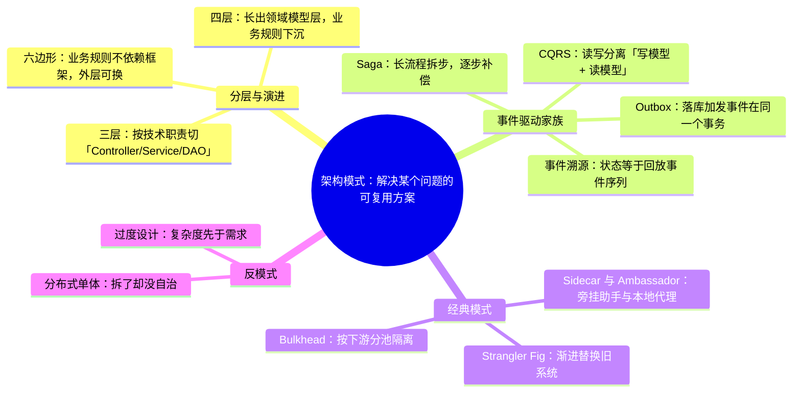
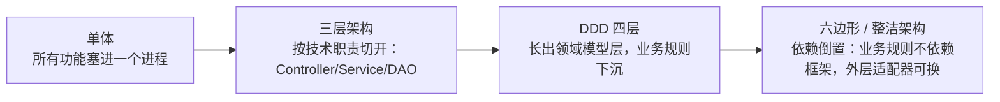
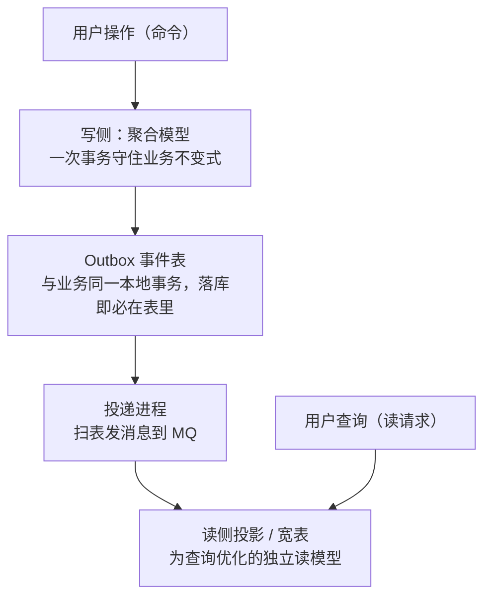

# 阶段六 · 小点 4：架构模式

> 所属：阶段六 架构设计与服务端思维
> 定位：把散落的模式串成体系——分层如何演进、事件驱动怎么落地、经典模式各解决什么迁移问题；以及最重要的能力：**识别反模式**（知道什么不该做）。

## 快速入门

> 本节为「架构模式速览」：先认识几个高频模式解决什么问题；「事件驱动家族、反模式识别」留在正文提高部分。

### 本讲核心关键词速查

| 关键词 | 一句话大白话 | 例子 |
|-|-|-|
| 分层架构 | 按职责分层（Controller/Service/DAO） | 三层架构 |
| DDD 四层（Domain-Driven Design，领域驱动设计） | 领域建模的分层 | interface/application/domain/infra |
| CQRS（Command Query Responsibility Segregation，命令查询职责分离） | 读写分离 | 读走宽表、写走聚合 |
| 事件溯源 ES（Event Sourcing） | 事件序列为唯一事实源 | 状态=回放事件 |
| Outbox（Transactional Outbox，事务性发件箱） | 落库+发事件原子 | 保证最终一致 |
| Saga | 长流程编排 | 跨服务补偿 |
| Strangler Fig | 渐进替换旧系统 | 新旧并行迁移 |
| 反模式 | 不该做的做法 | 分布式单体、过度设计 |

### 本讲在解决什么问题

- **问题**：架构不是一堆技术名词，而是「为了什么、解决什么」。本讲把模式串成体系，更教你**识别反模式**——知道什么不该做比知道做什么更值钱。
- **你要带走的一句话**：模式是「解决某个问题的可复用方案」，但不是万金油。**最能体现架构功力的是识别反模式**——分布式单体（拆了却没解耦）、过度设计（为未来的高并发买单）都是负资产。

### 层结构速览（正文展开更细）

```text
三层:     Controller → Service → DAO
DDD 四层: interface(接口) → application(应用) → domain(领域) → infrastructure(基础设施)
                           [依赖倒置: domain 不依赖 infra, 通过接口]
```

> 说明（逐行解释）：
> - **三层**：Controller（接口）、Service（业务）、DAO（数据）——最基础，适合简单业务。
> - **DDD 四层**：多了 `domain`（领域核心，业务规则）和 `infrastructure`（数据库/框架等实现细节）。
> - **依赖倒置（Dependency Inversion Principle，DIP）**：domain 层不依赖基础设施，而是依赖接口（infra 实现接口）——这是 DDD 的关键。
> - **演进**：从三层到四层再到六边形/整洁架构，核心是「让业务规则不依赖框架与基础设施」。

### 关键模式说明

| 模式 | 干什么 | 最易踩的坑 |
|-|-|-|
| CQRS | 读写分离 | 查询要求高才值得；写法复杂 |
| 事件溯源 | 事件为事实源 | 只有强审计/溯源才用，别默认 |
| Outbox | 落库+发事件原子 | 本地事务写事件表 + 投递 |
| Saga | 长流程补偿 | 有中间状态，需补偿 |
| Strangler Fig | 渐进迁移 | 新旧并行 = 双份维护 |
| Bulkhead | 隔离资源 | 防一个依赖打满线程池 |

### 常用约定 / 命名提示

- **识别反模式**：分布式单体（拆了却没解耦，跨库 join、本地事务全没）、过度设计（为「未来百万 QPS」上分库分表，当前日活一万）——这些是负资产。
- **模式是工具不是信仰**：CQRS/ES 等重模式，只有在「有明确收益」时才上（如前期的操作日志表够用就别上 ES）。
- **Strangler Fig 的终点**：新旧长期并行 = 双份维护——要规划好「绞杀终点」，别一直双跑。

## 精简大纲

1. 分层与演进：三层 → DDD 四层 → 六边形 / 整洁架构
2. 事件驱动家族：CQRS / ES / Outbox / Saga
3. 经典模式：Strangler Fig / Sidecar / Ambassador / Bulkhead
4. 反模式识别：分布式单体与过度设计

## 学习内容详情

先把 4 条大纲画成一张全景图——读之前先想清楚「谁解决什么问题」。



### 1. 分层与演进

```text
三层架构            DDD 四层                 六边形/整洁架构
Controller   →   接口层              外层: 适配器(HTTP/MQ/DB)
Service        应用层(编排)         ──依赖箭头──→  内层: 应用服务(用例)
DAO            领域层 ★规则          中心:   领域模型(框架无关)
               基础设施层           
```

- 三层 → DDD 四层的变化：业务规则从 Service（**事务脚本（Transaction Script）**：一行行动作按过程排布，事务边界就是方法边界）下沉到**领域层**，Service 瘦成编排（阶段四第 4 讲）。
- **六边形架构（Hexagonal Architecture，即 Ports and Adapters 端口-适配器）/ 整洁架构（Clean Architecture）**（同一思想的两种名字）：核心是**依赖方向指向领域**——外圈（Web / DB / MQ）都是可替换的**适配器**，领域模型不 import 任何框架注解。
- **生活版类比**：一台打印机把所有功能焊死在里面，换个墨盒要拆整机；改成「主机 + 可插拔接口」后，换墨盒、加扫描头都不用动主机。**换成 Java**：单体把业务规则和 JDBC、Servlet、日志实现焊在一起；六边形 / 整洁架构把「业务规则」当主机，把「数据库 / REST / 消息」当可插拔的适配器——从 MySQL 换成 Postgres、从 JSON 改 protobuf，领域层代码一行不用动。
- **具体抓手**：
  - 严格说，六边形强调端口-适配器边界、整洁架构强调依赖规则——落地抓一条就够：**业务规则不依赖框架与基础设施**。
  - **判据**：把 JPA 注解从实体上抠下来，领域层还能编译吗？
- 演进逻辑：从「按技术分层」到「按领域组织 + 依赖倒置保护领域」——分层的目的从来不是「整齐」，是**让变化快的（业务规则）不依赖变化慢的（技术设施）**。



### 2. 事件驱动家族（四件套对照）

| 模式 | 核心机制 | 一句话使用判断 |
|-|-|-|
| **CQRS** | 写侧聚合 + 事务保不变式；读侧独立模型（宽表 / ES） | 读写负载 / 模型需求分化才上 |
| **Event Sourcing** | 事件序列是唯一事实源，状态 = 回放（阶段四第 4 讲） | 强审计 + 时间旅行才上，复杂度高 |
| **Outbox** | 本地事务写事件表，异步可靠投递（阶段四第 5 讲） | 「落库 + 发事件」要原子就上——低成本高收益 |
| **Saga** | 长事务拆本地事务序列 + 每步配补偿 | 跨服务流程，配补偿器 |

- **为什么 CQRS 要拆读模型**：写侧聚合模型是为了守住**业务不变式**（一次事务内保证数据规则），它天生不适合当查询模型——列表页要宽表、大字段、多表冗余，硬在聚合模型上查等于反复 join + 聚合；拆出独立读模型后，读侧可以建宽表 / 专用索引 / 独立扩容，读写互不拖累。
- **为什么 Outbox 能保证原子**：业务变更和事件写入**同一个本地事务**——提交则事件必在 outbox 表里，回滚则事件必不存在；再由独立投递进程扫表发 MQ，发成功才标记已投递。它把「分布式事务」降级成「本地事务 + 兜底补偿」，所以低成本高收益。
- **生活版类比**：餐厅大厨不自己接电话，只通过「下单窗口」接单——点单写成小票放进去；营业结束后，另有专人把小票整理成「今日销量表」供统计，翻报表和翻原始小票是两回事。**换成 Java**：用户操作（命令）只能写「聚合模型」——守着业务规则的那份数据；查询页面不直接查聚合，改查另一套为展示优化过的「读模型」（宽表 / 投影），各自演进、各自扩容。前端对照：这很像 store/reducer 里唯一的改写入口 vs 组件里 memo 好的派生状态（selector）——都是「写入口唯一、读形状专用」。
- **一张图看懂写读分离**：



> ⏸️ **短期可以不学**：CQRS + Event Sourcing 组合的深度实践（事件建模、投影重建、快照策略）——学习与运维成本双高，读写模型分化不明显时是负资产。**何时回来学**：读侧与写侧模型严重分化、或有强审计与「回放历史」需求，且团队已有 DDD 基础时。**面试最低要求**：能说出 CQRS 是「架构级的读写分离」（读模型独立于聚合模型）、ES 是「状态 = 事件回放」，以及它们各自解决什么问题。

```java
// Saga 的两种编排形态（同一个「下单」流程）：
// ① 协同式(orchestration-free): 各自订阅事件自行响应 —— 松耦合, 但"流程在哪"只存在于文档里
//    order: OrderPlaced → inventory 收到扣库存 → 发 StockDeducted → payment 收到扣款 → ...
// ② 编排式: 一个协调器持有状态机, 逐步驱动与补偿 —— 流程集中可见, 协调器是中心
//    SagaCoordinator: step1 createOrder; step2 deductStock; 失败→按序补偿 cancelOrder
```

- 选择依据：流程短、参与方少、无回滚顺序要求 → 协同式（事件 + DLQ 兜底）；流程长、有严格补偿顺序（资金）→ 编排式（Seata SAGA / 状态机引擎）。
- 补偿三纪律：**每步可补偿**（操作写成可逆）、**补偿幂等**（重试可能补偿两次）、**业务键关联**（一个 sagaId 串起所有步骤）。
- **生活版类比**：报一个「机票 + 酒店 + 租车」旅游套餐，最后一环租车没订上——不会就此收场，而是把已订的机票、酒店**按顺序退掉**。**换成 Java**：Saga 把一个长事务拆成本地事务序列，每步配一个「反悔动作」即补偿；中途任一步失败，靠 sagaId 把已成功步骤串起来**依序补偿**，和退行程一样不能只退最后一环。

### 3. 经典模式

- **Strangler Fig（绞杀者）**：新旧系统并行运行，按「门面 + 路由」逐块把流量从旧系统切到新系统，旧的逐渐废弃——遗留单体渐进改造的标准打法（阶段四第 1 讲的拆分落地形态：先在门面下拆模块，边界验证成熟后物理拆分）。
- **Sidecar（边车）**：主进程旁挂辅助进程共享 Pod 资源——日志采集器 / Envoy 代理；关注点分离，K8s Pod 设计的基石（阶段五第 2 讲）。Java 视角：最常见的形态就是同 Pod 的 Envoy / 日志采集 agent——Spring 应用本身不做 sidecar，知道这个模式「谁挂在谁旁边」即可。
- **Ambassador（大使）**：客户端与远端服务之间的本地代理，代理连接池 / 重试 / 熔断——「把出向流量治理挪出业务代码」（Feign+Ribbon 就是 Java 进程内版的 ambassador 思想）。
- **Bulkhead（舱壁）**：像船舱隔水——**一个下游的故障只淹它自己的池**：按依赖划线程池 / 连接池（库存一个池、支付一个池），支付打满不影响库存。

```java
// Bulkhead 落地形态(Resilience4j): 每个下游独立信号量/线程池配额
resilience4j:
  thread-pool-bulkhead:
    instances:
      inventoryService: { maxThreadPoolSize: 10, coreThreadPoolSize: 2 }
      paymentService:   { maxThreadPoolSize: 5,  coreThreadPoolSize: 1 }
  # 库存 10 个并发打满时, 支付请求仍可用自己池子的配额 —— 不被一起淹
```

### 4. 反模式识别

- **分布式单体**：拆了微服务但没有自治——同步调用链拉满（A 等 B 等 C）、共享一个数据库、发布必须一起发。比单体更糟：多了网络与运维成本，没得到自治收益。**判据三连**：改一个需求要同时上线几个服务？一个服务挂了连锁全挂？服务间能不能各自独立部署独立数据？
- **过度设计**：为「未来可能的百万 QPS」上分库分表 + 多活，当前日活一万——复杂度先于需求到来就是负资产（呼应阶段四第 1 讲「微服务不是默认选项」）。
- 识别心法：**每个架构决策对应当前真实的问题**——写不出「它解决我现在什么问题」的架构图层，就是装饰。
- 前端类比：分布式单体 ≈ 微前端拆了应用却共享状态和构建；过度设计 ≈ 给 3 页官网配 SSR + 边缘渲染 + 微前端。

### 坑点提醒

- **把六边形当教条**：小 CRUD 项目硬凑 Ports/Adapters 三层接口套壳——架构服务于规模与变更率；单体三层写清楚也远好于四层糊。
- **Saga 补偿写进正向事务里**：补偿逻辑必须独立、幂等、可重放——别指望「反向调用一下原接口」（原接口可能不幂等、有副作用）。
- **Strangler Fig 没有绞杀终点**：门面切完流量旧代码不删——新旧长期并行 = 双份维护。迁移计划要含「下线旧路径」的时间点。
- **一个 Bulkhead 池 = 所有依赖共用**：按下游分池才有隔离意义；单一大池 = 舱壁只有一个舱。

## 本节自检

- [ ] 能画出六边形架构的依赖方向，说清它与 DDD 四层的关系
- [ ] 能对比 Saga 编排式与协同式的取舍，说出补偿三纪律
- [ ] 能用自己的话解释 Strangler Fig 怎么用于「单体渐进拆微服务」
- [ ] 能用判据三连识别一个系统是微服务还是分布式单体
- [ ] 能解释 Bulkhead 的隔离粒度为什么必须是「按下游」

## 本节配套思考题

1. 你的项目一（中后台）适合六边形架构吗？给出「适合 / 不适合」各一条理由，以及你会保留哪一层。
2. 「事件驱动是解耦神器」——什么业务场景事件驱动反而让排障变难（流程散在订阅者里）？如何补偿（可视化 / sagaId 贯穿）？
3. 给老板讲「为什么现在不拆微服务」：用过度设计 + 分布式单体两个反模式各画一张成本图。

## 常见面试题

### Q1：CQRS 和普通读写分离（主从复制）有什么区别？

**答**：

**标准结论**：两者是不同层面的「读写分离」——**主从复制**是物理层面的（同一个数据模型，主库写、从库读，只解决读压力）；**CQRS（Command Query Responsibility Segregation，命令查询职责分离）** 是模型层面的（写侧聚合模型 + 读侧独立模型，读写各自演进、各自扩展）。

**底层原理**：
- **主从复制**：模型完全相同，只解决读压力——把读流量水平扩展分摊到从库。
- **CQRS**：读模型针对查询场景单独设计（宽表 / 专用投影），可以来自多表聚合甚至独立存储；聚合模型是为了守**业务不变式**（一次事务内保证数据规则），天生不适合查询——列表页要宽表、大字段、多表冗余，硬在聚合模型上查等于反复 join。
- 读模型独立后，读写可以各自演进、各自扩展。

**工程实践**：绝大多数系统用主从复制 + 缓存就够，CQRS 只在「读写模型需求分化明显」时才上——比如报表查询侧与交易写侧模型差异巨大。**面试答「主从解决流量，CQRS 解决模型分化」就抓住了本质。**

### Q2：分布式事务有哪些方案？Saga 和 Outbox 各解决什么问题？

**答**：

**标准结论**：分布式事务的主流方案按一致性要求取舍——**Saga 解决「跨服务长流程」，Outbox 解决「落库 + 发消息原子性」**。

**底层原理**：
- **方案横向对比**：
  - 2PC（两阶段提交）：强一致，但性能差、协调者易成单点。
  - TCC（Try-Confirm-Cancel）：业务侵入大。
  - **Saga**：长事务拆成本地事务序列 + 每步配补偿，最终一致。
  - **本地消息表 / Outbox**：业务与事件同库原子写，异步投递。
- **Saga 解决「跨服务长流程」**：下单要扣库存 + 扣款 + 通知，任一失败按序补偿（回滚库存、退款）。两种形态——编排式（协调器持有状态机逐步驱动，流程集中可见）、协同式（各自订阅事件自行响应，松耦合但流程散在代码里）。
- **Outbox 解决「落库 + 发消息原子性」**：业务变更和事件写入**同一个本地事务**，提交则事件必在表里，独立投递进程扫表发 MQ——把分布式事务降级成「本地事务 + 兜底补偿」，低成本高收益。
- **底层原因**：分布式环境下无法保证跨服务强一致，工程上退而求「最终一致 + 可补偿」。

**工程实践**：补偿三纪律——**每步可补偿（可逆）、补偿幂等（重试不重复）、业务键关联（sagaId 贯穿所有步骤）**。

### Q3：什么是分布式单体（Distributed Monolith）？如何识别和避免？

**答**：

**标准结论**：分布式单体是「拆了微服务但没拆干净」——服务拆了，但**没有自治**：同步调用链拉满、共享一个数据库、发布必须一起发。它比单体更糟：多了网络与运维成本，却没得到独立部署、独立扩展、故障隔离的收益。

**底层原理**：
- **典型症状**：同步调用链拉满（A 等 B 等 C）、共享一个数据库、跨服务事务、发布必须一起发。
- **本质**：微服务是「把变更边界和故障边界切成一致」——如果模块间变更强耦合（改一处要动多处），拆开只会把本地调用变成网络调用，把快问题变成慢问题。

**工程实践**：
- **识别判据三连**：① 改一个需求要同时上线几个服务？② 一个服务挂了是否连锁全挂（没有隔离）？③ 服务间能否各自独立部署、独立数据？**任何一条答否，就是分布式单体。**
- **避免的正确顺序**：「先内后外」——先在单体内部按领域边界拆模块（Strangler Fig 绞杀者模式），边界验证成熟后再物理拆分。
- **拆不动就别拆**：一个清晰的分层单体远好于糊弄的微服务。

### Q4：事件驱动架构在什么场景下是负资产？

**答**：

**标准结论**：事件驱动（Event-Driven Architecture）的核心收益是**解耦**，代价是**排障变难**——生产者只管发事件，不关心谁消费，但「流程」藏进了订阅关系里，一个下单流程散在 5 个消费者中，「这笔订单为什么卡住」要顺着事件流逐个排查。

**底层原理**：解耦的代价是「因果链不可见」——同步调用栈天然记录了调用关系，事件流则要靠额外基建重建。

**工程实践**：
- **负资产场景**：
  - ① 流程短、参与方少、变更频率低：同步调用一次搞定，事件化只是自找麻烦。
  - ② 强实时一致需求：用户下单要立刻看到库存扣减，事件最终一致会让体验奇怪。
  - ③ 团队没有事件流追踪设施：没有事件总线大盘和 traceId / sagaId 贯穿，故障时无从下手。
- **判断标准**：「解耦收益 > 排障成本」；落地用事件规范化 + DLQ + 链路追踪把排障成本压下来。
- **面试加分词**：「事件驱动不是解耦神器，是有代价的解耦工具」。

### Q5：如何用 Strangler Fig 模式把单体渐进改造成微服务？

**答**：

**标准结论**：Strangler Fig（绞杀者）的比喻来自**榕树绞杀宿主树**——新旧系统并行，逐块把流量从旧系统切到新系统，旧的逐渐废弃。

**底层原理**：改造最大的风险是「一刀切」——重构 + 架构变更 + 上线一次做完，出了问题无法定位；绞杀者把风险拆成「小步、可回滚」的增量，每次切换失败都能切回去。

**工程实践**（落地四步）：
- ① 在**门面层（API Gateway / 反向代理）** 做路由——按 URL / 用户维度把部分流量切到新服务，其余仍走旧系统。
- ② **逐块迁移**：按业务边界选一个「内聚、低耦合」的模块先拆（如用户、商品），新服务独立部署、独立数据，通过门面接入。
- ③ 边界验证成熟后再拆下一块。
- ④ **规划绞杀终点**——旧代码要设「下线日期」，切完即删，否则新旧长期并行 = 双份维护成本。
- **选块标准**：先拆的模块要满足「变更频繁 + 边界清晰 + 数据可迁移」；门面层路由配置要有灰度能力（按用户比例切流）。
- **面试答法**：「门面 + 路由 + 渐进切换 + 绞杀终点」四步即合格。
