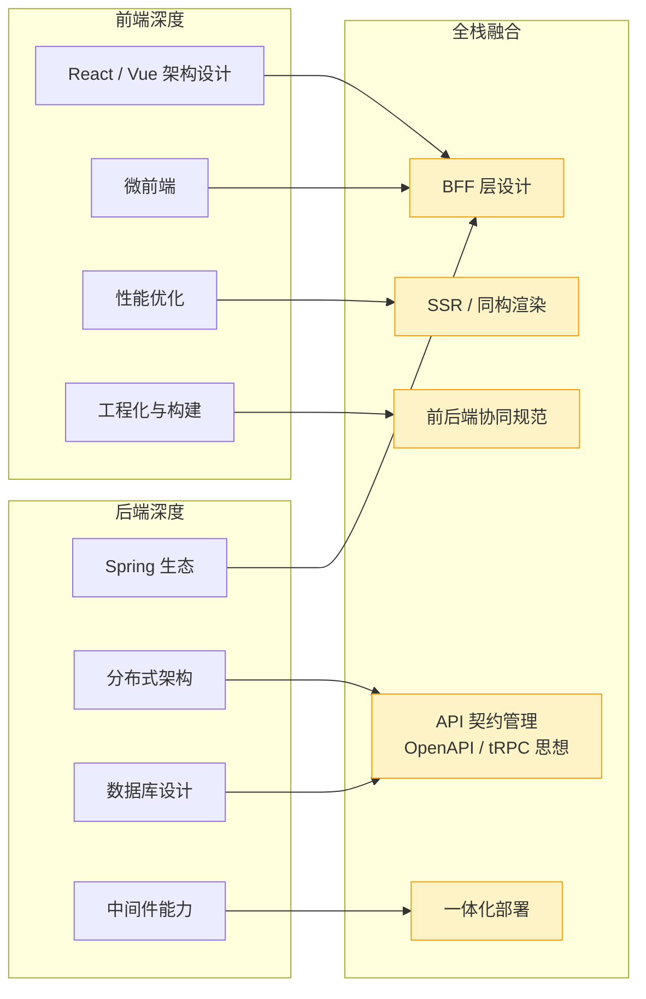

# 阶段七 · 小点 1：全栈能力模型

> 所属：阶段七 全栈融合与项目实战
> 定位：把前端能力和后端能力真正打通，形成「全栈架构」思维。你最大的优势是前端底子厚——不要丢，要把它变成差异化竞争力。本讲给出五个「前后端都要深才有竞争力」的融合点，每个都配可落地的代码骨架。

## 快速入门

> 本节为「全栈能力速览」：先认识全栈融合的五个点是什么、各自解决什么问题；「BFF、契约管理」留在正文提高部分。

### 本讲核心关键词速查

| 关键词 | 一句话大白话 | 例子 |
|-|-|-|
| 全栈 | 前后端都能搞定 | 既写 React 又写 Java |
| BFF | 为某类前端聚合接口的中间层 | 聚合订单/用户/积分 |
| 契约先行 | 先定接口契约再开发 | OpenAPI |
| OpenAPI | 接口描述标准 | `openapi.yaml` |
| 契约测试 | 校验实现与契约一致 | 前后端不漂移 |
| SSR | 服务端渲染 | 快首屏 + SEO |
| 前后端协同规范 | 统一的响应/错误码约定 | `{code,message,data}` |
| 一体化部署 | 前后端一起交付 | nginx + 后端 |

### 本讲在解决什么问题

- **问题**：纯前端做不了、纯后端做不好的交叉地带，恰恰是你的差异化竞争力。五个融合点：BFF、API 契约、SSR、一体化部署、协同规范。
- **你要带走的一句话**：**BFF**（聚合页面的中间层）+ **契约先行**（OpenAPI 定接口，双方从契约生成代码）是你最能体现全栈价值的两块——把「前端底子厚」变成「前后端都深」的差异化优势。

### 最简示例（照抄能跑）

```yaml
# OpenAPI 契约: 接口的唯一事实源(契约先行)
openapi: 3.0.3
info: { title: 首页 BFF API, version: 1.0.0 }
paths:
  /api/app/home/{userId}:
    get:
      operationId: getHomePage        # 生成的 TS client 方法名来自它
      parameters:
        - { name: userId, in: path, required: true, schema: { type: integer } }
      responses:
        "200":
          content:
            application/json:
              schema: { $ref: "#/components/schemas/HomePageView" }
```

> 说明（逐行解释）：
> - 先定义**接口契约**（OpenAPI YAML）——前端和后端都从它出发。
> - 前端：用 `openapi-typescript` 从契约生成强类型 client（后端改字段 → 前端编译期报错）。
> - 后端：用 SpringDoc 注解「钉」在契约上（启动后 `/v3/api-docs` 自动生成）。
> - CI 里做**契约测试**：校验实现和契约没漂移（删字段/改类型会让构建失败）。
> - 这就是「契约先行」：把「前后端不一致」从联调期提前到提交时——这是全栈工程师的核心竞争力。

### 关键概念说明

| 概念 | 干什么 | 最易踩的坑 |
|-|-|-|
| BFF | 为端聚合视图 | 别写业务规则（只裁剪/编排） |
| OpenAPI | 接口契约标准 | 契约先行的唯一事实源 |
| 契约测试 | 防前后端漂移 | 破坏性变更会让构建失败 |
| SSR | 服务端渲染 | 前后端各有承载位 |
| 一体化部署 | 前后端统一交付 | 环境差异要外置 |
| 协同规范 | 统一响应/错误码 | 成功 HTTP 200 + code=0 |

### 常用约定 / 命名提示

- **统一响应体**：`{code, message, data}`——成功 HTTP 200 + code=0；系统错误回对应状态码，别把所有失败塞进 200。
- **BFF 的纪律**：不写业务规则、不直连数据库、按端一份（Web-BFF / App-BFF 分开），别膨胀成第二个业务层。
- **契约先行配 CI 契约校验**：否则 YAML 没人更新、生成的类型全是 `any`，形同虚设。

## 精简大纲

1. 全栈能力模型总图：前端深度 × 后端深度 → 五个融合点
2. BFF 层设计：为多端裁剪聚合的视图适配层
3. API 契约管理：OpenAPI 契约先行 + 类型生成 + 契约测试
4. SSR / 同构渲染与一体化部署
5. 前后端协同规范：错误码 / 分页 / 版本化的统一约定

## 学习内容详情

### 1. 全栈能力模型



> 用法：五个融合点是「纯前端工程师做不了、纯后端工程师做不好」的交叉地带——求职叙事里它们就是你的差异化标签。

### 2. BFF 层设计

**BFF（Backend For Frontend）**：为某一类前端（Web / App / 小程序）专门服务的后端薄层——把多个领域服务的接口按「这个端需要的视图」裁剪聚合。它不是第二个网关：**网关管流量（路由 / 限流 / 鉴权），BFF 管视图（聚合 / 裁剪 / 适配）**。

- 为什么需要：App 首页要「用户 + 订单 + 积分 + 通知」四个域的数据，让 App 直调四个微服务 = 四次移动网络往返 + 客户端拼装逻辑；BFF 一次聚合返回。
- 类比你熟悉的东西：BFF ≈ 前端的「容器组件」——容器负责取数与拼装，展示组件保持纯粹；BFF 把这层从浏览器挪到了服务端。

```java
// BFF 聚合接口：一个请求喂饱一个「页面」
// 技术要点全部来自阶段一第 7 讲：CompletableFuture 并发 + 显式执行器 + 超时兜底
@RestController
@RequestMapping("/api/app/home")
public class HomePageBffController {

    private final UserClient userClient;        // 领域服务的 HTTP 客户端(OpenFeign)
    private final OrderClient orderClient;
    private final PointClient pointClient;
    private final Executor bffExecutor;         // 专用线程池: BFF 的聚合 IO 不许占用别处的池

    public HomePageBffController(UserClient u, OrderClient o, PointClient p, Executor e) {
        this.userClient = u; this.orderClient = o; this.pointClient = p; this.bffExecutor = e;
    }

    @GetMapping("/{userId}")
    public ApiResponse<HomePageView> home(@PathVariable Long userId) {
        // 三路并发拉取——串行调用会把三段 RT 加起来, 并发后总 RT ≈ 最慢的那一路
        var user  = CompletableFuture.supplyAsync(() -> userClient.getProfile(userId), bffExecutor)
                                     .orTimeout(800, TimeUnit.MILLISECONDS);   // 单路超时: 一路慢不拖垮整页
        var order = CompletableFuture.supplyAsync(() -> orderClient.latestOrders(userId, 5), bffExecutor)
                                     .orTimeout(800, TimeUnit.MILLISECONDS);
        var point = CompletableFuture.supplyAsync(() -> pointClient.summary(userId), bffExecutor)
                                     .completeOnDefault(PointSummary.EMPTY);   // 超时/失败给默认值: 积分挂了首页照样出

        CompletableFuture.allOf(user, order).join();   // 只等强依赖; 积分已兜底无需等
        return ApiResponse.ok(new HomePageView(user.join(), order.join(), point.join()));
    }
}
```

```java
// 视图 DTO：按「端的渲染需要」裁剪，用 record 表达不可变（阶段一第 2 讲）
// 注意它不等于领域模型——领域服务的 User 有 30 个字段, App 首页只需要 3 个
public record HomePageView(
    UserProfileBrief user,        // 昵称/头像, 不带手机号等敏感字段
    List<OrderBrief> orders,      // 最近 5 单, 只要编号/状态/金额
    PointSummary point            // 可能为 EMPTY(降级), 前端按空态渲染
) {}
```

- **BFF 的纪律**：不写业务规则（编排归应用层）、不直连数据库（只调领域服务）、按端一份（Web-BFF / App-BFF 分开部署，避免互相污染）。

### 3. API 契约管理：契约先行的工作流

**契约先行（Contract-First）**：先定义接口契约（OpenAPI 文档），前端 mock 并行开发、后端按契约实现，最后用契约测试验证两边没漂——对比「代码先行 + 联调对字段」的传统模式，它把「发现不一致」从联调期提前到提交时。

```yaml
# openapi/home-api.yaml —— 契约是唯一事实源, 双方都从它生成代码
openapi: 3.0.3
info: { title: 首页 BFF API, version: 1.0.0 }
paths:
  /api/app/home/{userId}:
    get:
      operationId: getHomePage          # 生成的 TS client 方法名就来自它
      parameters:
        - { name: userId, in: path, required: true, schema: { type: integer, format: int64 } }
      responses:
        "200":
          content:
            application/json:
              schema: { $ref: "#/components/schemas/HomePageView" }
components:
  schemas:
    HomePageView:
      type: object
      required: [user, orders, point]
      properties:
        user:  { $ref: "#/components/schemas/UserProfileBrief" }
        orders: { type: array, items: { $ref: "#/components/schemas/OrderBrief" } }
        point: { $ref: "#/components/schemas/PointSummary" }
```

后端用 SpringDoc 把实现「钉」在契约上（注解即文档，启动后 `/v3/api-docs` 自动生成）：

```java
@Operation(summary = "App 首页聚合视图", tags = "home-bff")
@ApiResponses(@ApiResponse(responseCode = "200", description = "聚合成功; point 可能为降级空值"))
@GetMapping("/{userId}")
public ApiResponse<HomePageView> home(
    @Parameter(description = "用户 ID") @PathVariable Long userId) { ... }
```

前端从契约生成强类型 client——这是 **tRPC「端到端类型安全」思想在 Java 生态的等价物**（tRPC 依赖 TS 类型系统跨界，Java 做不到，就用「契约 → 代码生成」达到同样效果）：

```bash
# 前端工程里: 从 OpenAPI 契约生成 TS client(每次契约变更重新生成)
npx openapi-typescript ./openapi/home-api.yaml -o ./src/api/schema.d.ts
```

```typescript
// 生成的类型 + 轻封装的 client —— 后端改字段名/改类型, 这里编译期直接报红
import type { components } from "@/api/schema";

type HomePageView = components["schemas"]["HomePageView"];   // 与后端 record 一一对应

export async function getHomePage(userId: number): Promise<HomePageView> {
  const res = await fetch(`/api/app/home/${userId}`);
  const body = await res.json();
  return body.data;   // 统一响应体的 data 字段(见第 5 节约定)
}
```

```xml
<!-- 契约测试: CI 里 diff 实现(openapi.json)与契约(home-api.yaml)
     破坏性变更(删字段/改类型)会让构建失败——这就是"防漂移"的执行者 -->
<plugin>
    <groupId>org.openapitools.openapistylevalidator</groupId>
    <artifactId>openapi-style-validator-maven-plugin</artifactId>
    <executions>
        <execution>
            <phase>verify</phase>
            <goals><goal>validate</goal></goals>
        </execution>
    </executions>
</plugin>
```

### 4. SSR / 同构渲染与一体化部署

- **SSR（服务端渲染）/ 同构渲染**：首屏 HTML 由服务端产出（快的首屏 + SEO），hydration（注水）后由 React 接管交互。你在 Next.js 里做过，Java 侧的支撑点是：SSR 服务要调的 BFF 接口同机房内网调用、缓存策略（页面级 CDN 缓存 + 数据级 Redis 缓存的分层失效）。Java 端最小承载形态 = **Nginx 反代 + Spring Boot 返回服务端渲染 HTML（Thymeleaf）**，或后端只出 JSON 给前端同构层——前后端各有 SSR 承载位，具体选型主线不用深挖，知道位子在哪即可。
- **一体化部署**：前端静态资源与后端服务统一交付。典型形态——前端构建产物打进 nginx 镜像，nginx 同时做静态托管与 API 反代：

```dockerfile
# 一体化镜像: 前端产物 + nginx 反代, 后端单独一个 Spring Boot 镜像
FROM node:20-alpine AS fe-build
WORKDIR /fe
COPY frontend/package*.json ./
RUN npm ci
COPY frontend/ .
RUN npm run build                        # 产物 dist/

FROM nginx:1.26-alpine                   # 以 Docker Hub 当前稳定 tag 为准
COPY --from=fe-build /fe/dist /usr/share/nginx/html
COPY deploy/nginx.conf /etc/nginx/conf.d/default.conf
# nginx.conf 两段: / → 静态文件(index.html 回退支持前端路由);
#                 /api/ → proxy_pass http://backend:8000 (K8s Service 名)
```

> 部署形态选择：中小项目用上面的「nginx + 后端双镜像」；规模上来后静态资源上 CDN、后端只暴露 API——但「前端构建产物如何随版本发布」的命题不变。

### 5. 前后端协同规范

统一约定一次，联调成本降一半——这些约定要在项目第一周就定下来（对应 NestJS 项目里的 interceptor / filter 规范，Java 侧用 `@RestControllerAdvice` 实现，阶段二第 3 讲）：

| 约定项 | 规范 | 说明 |
|-|-|-|
| 响应体 | `{code, message, data}` 三段式 | 成功 code=0 且 HTTP 200；业务失败可回 HTTP 200 + 业务 code，但系统性错误（鉴权失败 / 限流 / 参数错）要回对应 HTTP 状态码——别把所有失败都塞进 200 |
| 错误码分段 | 4xxxx 参数 / 5xxxx 业务 / 9xxxx 系统 | 前端按段决定 toast / 页面 / 登出 |
| 分页 | `{list, total, page, size}` | 游标翻页用 `nextCursor` 字段 |
| 版本化 | URL 路径 `/api/v1/` | 网关友好，调试直观 |

```typescript
// 前端统一的响应处理: 所有接口走这一个入口, 错误策略集中在一处
async function request<T>(url: string, init?: RequestInit): Promise<T> {
  const res = await fetch(url, { ...init, headers: { "Content-Type": "application/json", ...init?.headers } });
  const body = await res.json();                    // {code, message, data}

  if (body.code === 40101) { location.href = "/login"; }   // 约定: 40101 = 登录态失效
  if (body.code !== 0) { throw new BizError(body.code, body.message); }  // 业务错: 走页面级提示

  return body.data as T;                            // 正常路径: 调用方拿到的就是纯数据
}
```

### 坑点提醒

- **BFF 膨胀成「第二个业务层」**：聚合逻辑里悄悄写了 if-else 业务规则——BFF 只做裁剪与编排，规则一律下沉领域服务。
- **契约文档与实现两张皮**：SpringDoc 注解不写、YAML 契约没人更新，生成的类型全是 any——契约先行必须配「CI 契约校验」否则形同虚设。
- **BFF 单路慢拖垮整页**：聚合接口忘了 `orTimeout`，下游一个抖动让首页整体超时；非核心数据一律 `completeOnDefault` 降级。
- **一体化镜像里嵌环境变量**：前端构建时把 API 地址打包进 JS（`VITE_API_URL`），换个环境就得重新构建——应该运行时注入或走相对路径 + nginx 反代。

## 本节自检

- [ ] 能画出全栈能力模型图，并标注自己五个融合点的当前水平
- [ ] 能说清 BFF 与网关 / 领域服务的边界（BFF 是视图聚合层，不是第二个网关）
- [ ] 能描述「契约先行」在 Java + React 项目里的完整落地链路（OpenAPI → 代码生成 → 契约测试）
- [ ] 能用 CompletableFuture 实现一个带超时与降级的 BFF 聚合接口

## 本节配套思考题

1. BFF 按端拆分（Web-BFF / App-BFF）与共用一个聚合层，各自的代价是什么？什么规模下值得拆？
2. 如果契约测试在 CI 里报「后端删了 `PointSummary.expiredAt` 字段」，这个流水线失败保护了谁？绕过它强行合并会发生什么？
3. tRPC 的类型安全不需要代码生成步骤，而 OpenAPI 方案需要——这多出来的一步除了类型，还给团队带来了什么流程资产？
