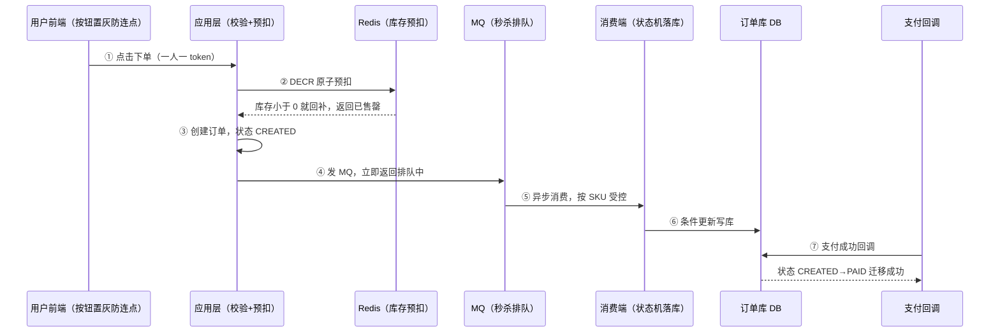
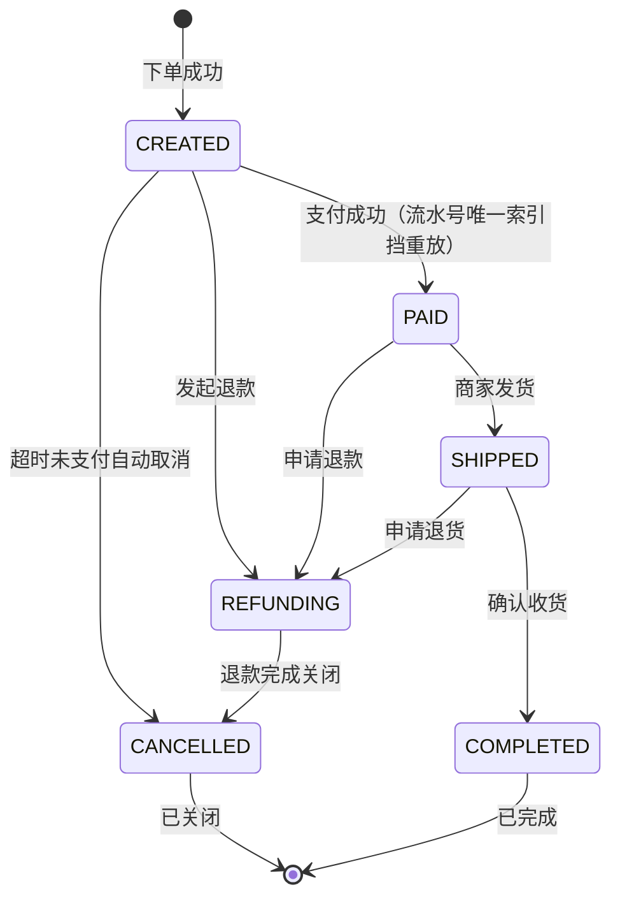
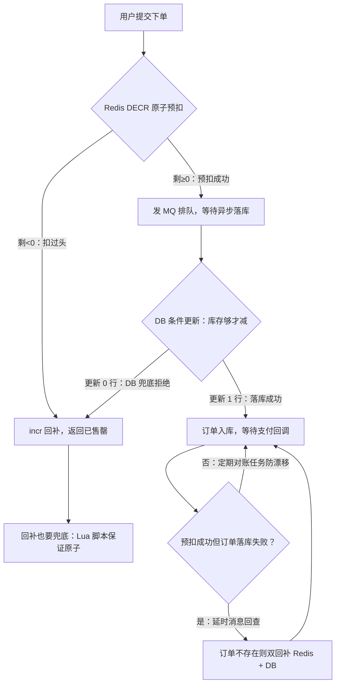
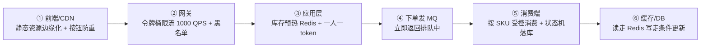

# 阶段七 · 小点 3：项目 2 —— 电商订单系统（高并发方向，阶段 6 后启动）

> 所属：阶段七 全栈融合与项目实战
> 定位：高并发方向的毕业项目——把阶段 3-6 的**核心**技术（缓存 / 状态机 / 限流降级 / 压测 / MQ）串成一个真实业务系统，并产出压测报告。检验标准不是「功能能跑」，是**每个技术选型都能说出它挡住了哪个问题**。
>
> ⚠️ **与阶段六结论不冲突**：阶段六第 1 讲推导的是 500w 日单 / 1w DAU 量级「不需要分库分表」；本项目是**掌握技术本身**，不是该量级的必然选择。分库分表、SkyWalking、K8s 一律放到「延后扩展」——先把一条核心链路做透，别 45 天摊 7 个组件每个都浅尝辄止。

## 快速入门

> 本节为「项目二速览」：先认识这个项目做什么、技术栈怎么分档、要先跑通什么；「状态机/库存扣减细节」留在正文提高部分。

### 项目二核心关键词速查

| 关键词 | 一句话大白话 | 例子 |
|-|-|-|
| 电商订单 | 下单/支付/库存的核心链路 | 秒杀、抢购 |
| 状态机 | 订单状态流转（枚举+迁移表） | CREATED→PAID |
| 库存扣减 | 减库存的并发正确性 | 不超卖 |
| 幂等（Idempotency） | 重复请求结果一致 | 防重复下单 |
| 秒杀 | 高并发抢购 | 削峰填谷 |
| 限流降级 | 控制流量/快速失败 | 保住核心 |
| 压测 | 模拟高并发 | k6 测水位 |
| 消峰 | 高峰暂存平稳消费 | MQ 排队 |

### 项目二做什么（三阶段递进）

- **定位**：高并发方向的毕业项目——把阶段 3-6 的**核心**技术（缓存/状态机/限流降级/压测/MQ）串成一个真实业务系统，产出压测报告。
- **检验标准**：不是「功能能跑」，是**每个技术选型都能说出它挡住了哪个问题**。
- **分三档推进**（别一次全上，会浅尝辄止）：
  - **核心链路（必做）**：Spring Boot + MyBatis-Plus + Redis 预扣库存 + 订单状态机 + 限流降级 + k6 压测。
  - **扩展链路（选做）**：RocketMQ 异步化 + 延时消息 + 分段库存。
  - **延后扩展（可选）**：ShardingSphere、SkyWalking、K8s——学完阶段 5 再回来做「架构升级」练习。

### 核心难点速览（正文展开更细）

```text
难点① 订单状态机 + 幂等:  枚举 + 合法迁移表 + WHERE status=? 防重复/乱序
难点② 库存扣减并发正确性:  Redis 原子预扣 + DB 条件更新 + 回补对账 + 分段
难点③ 秒杀全链路削峰:     CDN→网关限流→应用令牌→MQ排队→消费端匀速→DB
```

> 说明（逐行解释）：
> - **状态机**：订单状态用枚举 + 合法迁移表，「非法迁移（`WHERE status=?`）」天然拒绝重复/乱序请求——这就是幂等三板斧之三。
> - **库存扣减**：Redis 原子预扣挡掉绝大多数必失败请求，DB 条件更新做最终一致防线，再加回补 + 对账。
> - **秒杀削峰**：从 CDN 到数据库，每一层都比上一层挡掉更多流量，把「洪峰」变成「长队」。
> - 压测验收：k6 模拟 5w 点击，看「进应用的只剩 1k、MQ 积压能消费回零、DB QPS 平稳」——四段数字画进报告。

### 关键功能说明

| 功能 | 干什么 | 最易踩的坑 |
|-|-|-|
| 订单状态机 | 状态流转 + 幂等 | 迁移表收进枚举 + 测试 |
| 库存扣减 | 不超卖 | 预扣成功但落库失败要回补对账 |
| 秒杀 | 高并发抢购 | 热点 key 要分段 |
| 压测报告 | 验证水位 | 单接口压测危险，要做场景压测 |
| 高可用演练 | 手动断依赖 | 别上 Chaos Mesh，脚本即可 |

### 常用约定 / 命名提示

- **先做透核心档**：核心链路（下单+库存+状态机+限流+压测）做透，再往扩展档走——别 45 天摊 7 个组件。
- **异步只用于旁路**：核心写路径（订单落库）必须同步成功或显式补偿，别把「都丢给 MQ」当万金油。
- **状态机要画图再写**：CREATED→{PAID,CANCELLED}；PAID→SHIPPED→COMPLETED；所有迁移边落进枚举测试。

## 精简大纲

1. 技术栈与功能清单（三阶段递进）
2. 核心难点 1：订单状态机与幂等
3. 核心难点 2：库存扣减的并发正确性
4. 重点场景：秒杀全链路（每层削峰手段）
5. 工程产出：压测报告 + 演练

## 学习内容详情

### 1. 技术栈与功能清单（三阶段递进）

按「核心跑通 → 扩展渐进 → 可选加餐」分三档，**先做透核心档**：

- **核心链路（必做）**：Spring Boot + MyBatis-Plus + Redis（库存预扣）+ 订单状态机 + 限流降级 + k6 压测。
- **扩展链路（选做）**：RocketMQ 异步化 + 延时消息取消 + 分段库存。
- **延后扩展（可选，阶段 5 学完后回来）**：ShardingSphere 分库分表、SkyWalking 链路追踪、K8s 部署——对已有项目做「架构升级」练习，而不是一开始就上。

> ⏸️ **短期可以不学**：ShardingSphere 分库分表、SkyWalking、K8s 属于「架构升级练习」——主线阶段五之前别碰，它们对「把核心链路做透」没有增量。**何时回来学**：学完阶段 5 后拿本项目做升级练习，或面试明确要求聊分布式时。**面试最低要求**：能说出分库分表的触发信号（数据量/写入 QPS 超单库水位）与引入成本，比背组件配置更值钱。

- **核心功能**：下单、支付回调、库存扣减、订单状态机流转。（ES 搜索、Redis Hash 购物车标为**扩展/选做**，不进核心链路。）

> ⏸️ **短期可以不学**：ES 商品搜索、Redis Hash 购物车是扩展/选做项——主线把核心链路做透即可，它们不会进压测报告的核心结论。**何时回来学**：核心链路跑通后有余力、或面试要讲搜索方案时。**面试最低要求**：说出 ES 解决什么问题（全文检索/复杂过滤）与「ES 是检索加速层、业务真相在 MySQL」的定位即可。
- 对应关系先摆明：缓存三问 ← 阶段三第 4 讲；削峰 ← 第 5 讲；限流降级 ← 阶段六第 3 讲。（ES 搜索 ← 阶段三第 6 讲、追踪 ← 阶段五第 4 讲属于延后扩展，进了扩展档再用到。）

**先看整条「下单 → 支付 → 库存」链路**：下文每个难点（状态机、库存扣减、秒杀削峰）都是这条链路上的一个环节，先搭骨架再看细节——前端下单页你熟悉的「排队中」提示，就是下面第 ④ 步 MQ 在排队：



### 2. 核心难点 1：订单状态机（State Machine）与幂等（Idempotency）

```java
// 状态机 = 枚举 + 合法迁移表; 非法迁移(WHERE status=from)天然拒绝重复/乱序请求 —— 幂等三板斧之三
public enum OrderStatus { CREATED, PAID, SHIPPED, COMPLETED, CANCELLED, REFUNDING }

public boolean transit(Long orderId, OrderStatus from, OrderStatus to) {
    // 一条 SQL 完成"检查+迁移": 并发两个 PAID 回调只有一个能 UPDATE 成功(affected=1)
    int n = orderMapper.update("UPDATE `order` SET status=? WHERE id=? AND status=?",
            to.name(), orderId, from.name());
    if (n == 0) {                                  // 状态已被别人迁过 —— 重复回调/乱序回调
        log.warn("非法状态迁移被拒: order={} expect-from={}", orderId, from);
        return false;                              // 支付对账兜底: 别静默
    }
    outboxRepo.save(event(orderId, to));           // 迁移成功 + 发事件同事务(Outbox 事务发件箱: 事件与业务写入同一个事务, 再异步投递, 保证不丢事件——阶段四第5讲)
    return true;
}
// 支付回调入口再叠一层幂等: 支付流水号唯一索引 —— 状态机挡业务, 唯一索引挡重放(token 同)
```

> **生活版**：电影票只能刷一次进场——闸机扫过一次就作废，拿同一张票重复刷会被拦在门外。商家「先检查票用过没、再放行」这两件事是连在一起的。
>
> **换回技术**：状态机的并发正确性就是这么「一张票只放行一次」——`WHERE status=?` 条件更新 = 闸机验票，「检查当前状态 + 迁移到新状态」原子完成；状态已被别人迁过的订单，重复到来的支付回调第二次 UPDATE 影响 0 行，等于「票已刷过，拒绝放行」（幂等三板斧之三）。

把完整迁移图画出来再写代码，所有迁移边落进枚举测试：



- 超时未支付自动取消：**RocketMQ 延时消息**（下单即发 level=30m）→ 到期消费检查状态，已支付则忽略、未支付则取消——比轮询扫表省一个数量级（阶段三第 5 讲落地）。
- 状态图先画再写：CREATED→{PAID, CANCELLED}；PAID→SHIPPED→COMPLETED；PAID/SHIPPED→REFUNDING→…——所有迁移边落进枚举测试表驱动用例（阶段二第 5 讲）。

### 3. 核心难点 2：库存扣减的并发正确性

```java
// 第一道闸: Redis 原子预扣(阶段三第 4 讲能力) —— 挡掉绝大多数"必失败"请求, DB 零压力
long left = redis.decr("stock:" + skuId);            // DECR 原子: 并发下不超卖
if (left < 0) { redis.incr("stock:" + skuId); return fail("已售罄"); }  // 扣过头要回补, 别把库存扣成负数

// 第二道闸: DB 条件更新(最终一致防线, Redis 故障/超卖兜底)
int n = stockMapper.updateDeduct(skuId, count);      // UPDATE stock SET cnt=cnt-? WHERE sku_id=? AND cnt>=?
if (n == 0) redis.incr("stock:" + skuId);            // DB 拒绝 → 回补 Redis

// 一致性: 预扣成功但订单落库失败(崩溃/业务拒) → 延时消息回查订单, 不存在则双回补(Redis+DB)
//          Redis 与 DB 定期对账任务(XXL-Job 分片, 阶段三第 6 讲)防漂移
```

把上面两道闸画成一张图（请求走一条道，每一处失败都有回补出口）：



> **生活版**：演唱会放 1000 个座位，官方先按顺序发 1000 张「排队资格券」——先到先得，发完即止，后面的人直接被劝退；真正入座前再验券核销，哪怕有人拿了券没来，最多空几个座位。**绝不可能出现 1200 人挤进 1000 个座位**（就像前端下单页里的「已抢完」提示，就是这套机制的对外表现）。
>
> **换回技术**：资格券 = **Redis 预扣**，`DECR` 把库存减一，减到负数就说明「券发完了」；验券核销 = **DB 条件更新**确认 `cnt >= ?` 才扣；失约回购 = **回补（incr + 对账）**。三道都在，才不会超卖。

- **回补失败兜底**：上面的 incr 回补本身也可能失败（Redis 抖动）——**别把正确性押在一句会失败的 incr 上**，两个更稳的做法：
  - **方案 A · Redis Lua 脚本**：把「扣减 + 判断 + 回补」写进一个 **Redis Lua 脚本**，用 `redis.call('DECR')` 后判断，为负时在**同一条脚本**内回补，原子性由脚本保证。
  - **方案 B · 先扣再兜**：下单前先用 `DECRBY` 原子包装，失败走 DB 兜底扣减。

- 热点行问题：爆款 SKU 单行 UPDATE 锁排队 → **库存分段**：1 万库存拆 10 行（`stock_3_0..stock_3_9`），扣减随机选段、某段耗尽再合并——把单点行锁竞争摊薄到 10 倍并发（秒杀全链路的「库存分段」即此）。

```java
// 分段库存示意: 大 SKU 拆成 N 段, 扣减时按"用户"或"随机"选段, 摊薄单 SKU 热点
// ⚠️ 注意: 别用 skuId.hashCode() 选段 —— 那是确定性哈希, 同一 SKU 永远落在同一段, 热点没摊开
int seg = ThreadLocalRandom.current().nextInt(10);     // 按请求随机选段, 把同 SKU 的流量散到 10 段
String key = "stock:" + skuId + ":" + seg;             // stock:skuId:seg
long left = redis.decr(key);                            // 只减一段, 其他段可并行
if (left < 0) { /* 该段售罄, 换下一段或走公共兜底段 */ }
```

> 补充：若希望「同一用户始终走同一段」以便后续核对/退款，可按 `userId % N` 选段（用户维度的确定性 + 多用户摊开）；纯粹为了扛并发，用随机选段即可。


### 4. 重点场景：秒杀全链路（每一层怎么削峰）

```text
用户点击 → ① CDN/前端: 静态资源边缘化 + 按钮防重(点击即置灰) —— 挡误操作与脚本点击
        → ② 网关: 令牌桶(Token Bucket)限流(1000 QPS) + 黑名单 —— 挡超额总流量, 超了直接"排队中"
        → ③ 应用: 库存预热到 Redis + 令牌校验(一人一 token, 防脚本连刷)
        → ④ 下单: 不直写 DB —— 发 MQ 立即返回"排队中", 前端轮询/推送结果   ← 同步写变异步消费
        → ⑤ 消费端: 按 SKU 并行度受控消费, 分段库存扣减 + 状态机落库          ← 匀速写保护 DB
        → ⑥ 缓存/DB: 详情读走 Redis(可选+ES), 下单写走单库条件更新             ← 读写分离
```

把上面这条链画成图——每一层都比上一层挡掉更多流量：



> 注：令牌桶（Token Bucket）——限流用的「蓄水池」：按固定速率往桶里**放 token**，请求拿到 token 才放行，突发流量被常年水位拦住。类比体育馆按出口流量分批放观众入场，再挤也最多挤进桶里的量。（实现见阶段六第 3 讲）

> **生活版**：早高峰地铁站台不会一次性放行所有人——护栏把人群切成一小批一小批放进去，车进站匀速上客。人还是那么多，但「瞬时洪峰」被拉成「匀速长队」，站台不会挤爆。
>
> **换回技术**：秒杀链路里 CDN→网关限流→应用令牌→MQ 排队，每一层都是一道「站台护栏」——**把「洪峰」变成「长队」（削峰填谷）**：用户体感是「排队中」而不是「500 错误」，系统体感是匀速消费而不是瞬时打满。
- 压测验收：k6 模拟 5w 点击 → 网关后只剩 1k 进应用 → MQ 积压曲线可消费回零 → DB QPS 平稳——**四段数字都画进报告**（阶段六第 6 讲）。

### 5. 工程产出

| 产出 | 内容 | 对应学段 |
|-|-|-|
| 压测报告 | 容量水位 + 拐点曲线 + 扩容/降级预案（k6 场景流量模型） | 阶段六第 6 讲 |
| 高可用演练 | 手动模拟：用脚本 stop 一个实例 / 清空 Redis 缓存 / 重启依赖 → 观察熔断降级是否按预案动作 | 阶段六第 3 讲 |
| （延后）链路追踪 | SkyWalking 拓扑图 + 一次慢请求 trace 分析——进了「延后扩展」再补（阶段五第 4 讲） | 阶段五第 4 讲 |

> 高可用演练不必上 Chaos Mesh——先用脚本手动打断依赖、看系统自愈，成本低一个量级，认知收获足够。

### 坑点提醒

- **Redis 预扣后直接返回成功，异步落库失败不回滚**：用户看到「下单成功」实际无货——预扣只配挡流量，**成功态必须等 DB 落库确认**，异步结果回推用户。
- **MQ 削峰但消费端比生产端还慢**：积压曲线不收敛 = 削峰变「延迟显形」——消费能力（分段并行度）要按峰值容量目标反推，不是默认并发数。
- **热点 Key 没做分段**：单 SKU 打满一个 Redis 分片——缓存热点与 DB 热点要一起治理（阶段三第 4/6 讲）。
- **状态机只存在于文档**：代码里散着 `if (status == 2)`——迁移表收进枚举 + 测试，乱序回调当天就能测出来。

## 本节自检

- [ ] 能画出秒杀场景从 CDN 到数据库每一层的削峰手段（对应阶段六第 1 讲链路图）
- [ ] 库存扣减的并发正确性方案能说清（Redis 预扣 + DB 条件更新 + 回补对账 + 分段）
- [ ] 订单状态机能画出完整迁移图，并解释非法迁移请求如何被 `WHERE status=?` 拒绝
- [ ] 压测报告包含：单接口与场景压测对比、容量拐点、扩容与降级预案

## 本节配套思考题

1. 「预扣回补」链路里有三个可能失败的点（扣 Redis 后崩溃 / 落库失败回补失败 / 对账任务漏跑）——每个的兜底是什么，最终一致性收敛靠哪个机制？
2. 延时消息取消订单 vs 定时扫表（`WHERE status=CREATED AND created_at < now()-30m`）——两种实现的成本模型各是什么？如果真数据量大到要分库分表（进「延后扩展」），扫表会变成什么问题？
3. 大促当天推荐服务把库存服务的 Feign 线程池打满——用 Bulkhead（舱壁隔离模式：每个依赖独立线程池，一个依赖耗尽不影响其他） + 降级预案各解决这问题的哪一半？

## 常见面试题

### Q1：订单状态机怎么设计？并发下两个支付回调同时进来会不会把状态搞乱？

**答**：**标准结论**：订单状态机的核心是「枚举 + 合法迁移表」——状态定义成枚举，每条合法迁移边落进枚举校验，非法迁移直接拒绝；并发正确性靠一条条件更新 SQL 兜底。为什么它比散落的 `if (status == 2)` 强：迁移规则集中一处、可测试（表驱动用例枚举所有边）、乱序回调当天就能测出来。

**原理层**：
- **枚举即状态全集**：CREATED / PAID / SHIPPED / COMPLETED / CANCELLED / REFUNDING，所有可能状态一次列全，不存在状态间的「野生跳转」。
- **合法迁移表即规则**：CREATED→PAID、PAID→SHIPPED… 每条迁移边都进枚举校验，规则外的迁移直接拒绝。
- **化学作用在 WHERE 子句**：`UPDATE order SET status=? WHERE id=? AND status=?` 把「检查当前状态 + 迁移到新状态」合成一个原子操作——两个并发 PAID 回调只有一个能 affected=1，另一个判定为重复/乱序回调，走对账告警而不是静默吞掉。

**工程层**（三个配套别漏）：
- **事件不丢**：状态迁移后的事件用 Outbox（事务发件箱，事件与业务写入同事务再异步投递）同事务落库。
- **重放有人挡**：支付回调入口再叠「支付流水号唯一索引」挡消息重放——状态机管业务、唯一索引管重放。
- **失败不静默**：迁移失败要有对账任务兜底，不能装作没发生。

### Q2：库存扣减怎么保证并发不超卖？Redis 预扣和 DB 扣减各是什么角色？

**答**：**标准结论**：三层防线——**预扣挡流量、条件更新保一致、对账收敛最终一致**。

**原理层**（三道防线各司其职）：
- **第一道 · Redis 原子预扣**：`DECR` 是原子操作，并发下不会超卖；结果为负说明超卖，回补并返回「已售罄」——Redis 挡掉绝大多数「必失败」请求，DB 零压力。
- **第二道 · DB 条件更新（最终一致防线）**：`UPDATE stock SET cnt=cnt-? WHERE sku_id=? AND cnt>=?`，条件判断与扣减在一条 SQL 里原子完成，Redis 故障或抖动时兜底。
- **第三道 · 回补与对账**：预扣成功但订单落库失败要双回补（Redis + DB）；再用定时对账任务（XXL-Job，分布式定时调度器）定期核对两边防漂移。

**工程层**（三个常见误区）：
- 别把正确性押在一句可能失败的 `incr` 回补上——「扣减 + 判断 + 回补」应写进 Redis Lua 脚本保证原子性。
- 别「Redis 预扣后直接返回成功」——异步落库失败不回滚，用户看到「下单成功」实际无货，成功态必须等 DB 落库确认。
- 爆款 SKU 单行 UPDATE 锁排队 → 库存分段（1 万拆 10 行随机选段）摊薄热点。

**标准话术**：预扣挡流量、条件更新保一致、对账收敛最终一致。

### Q3：订单超时未支付自动关闭，用延时消息、时间轮还是定时扫表？为什么？

**答**：**标准结论**：没有银弹——按数据量选型：量级不大用**延时消息 + 扫表兜底查漏补缺**；真到海量短延时场景上**时间轮**。

**原理层**（三种方案对比）：
- **定时扫表**：`WHERE status=CREATED AND created_at < now()-30m` 周期执行，实现最简单；但精度差（扫描间隔内不关单），数据量大时全表扫描成本高——扫描间隔和精度互相拉扯。
- **延时消息**：下单即发一条 RocketMQ 延时消息（30 分钟后到期），到期消费时检查订单状态，已支付就忽略、未支付就取消。精度高、实现直观，**比扫表省一个数量级**——扫表是按扫描周期白扫全表，延时消息只唤醒该醒的那条。缺点是延时有最大时长与吞吐上限，海量订单时 MQ 里积压大量「待触发」消息。
- **时间轮（Timing Wheel）**：内存里「槽位 + 环形队列 + 指针转动」，到期回调——像钟表指针每走一格，就唤醒这一格到期的那批任务（槽位按时长切成 3600 格，指针每秒进一格）。精度高、吞吐大，适合海量短延时场景（如支付 5 分钟过期）；但进程重启会丢任务，要配合持久化兜底（重启后扫表补漏）。

**工程层**：面试要说清「延时消息省一个数量级」的直觉和「没有银弹、要有兜底」的取舍——实现按数据量递增，别一上来就引时间轮的复杂度。

### Q4：设计一个秒杀系统，从用户点击到落库，每一层怎么削峰？

**答**：**标准结论**：核心思想是把「洪峰」变成「长队」——用户体感是「排队中」而不是「500 错误」，系统体感是匀速消费而不是瞬时打满。从用户到 DB 逐层挡流量，每层都比上一层挡掉更多。

**原理层**（六层分层削峰）：
- ① **前端/CDN**：静态资源边缘化 + 按钮点击即置灰，挡误操作与脚本。
- ② **网关**：令牌桶限流（比如 1000 QPS）+ 黑名单，超了回「排队中」。
- ③ **应用层**：库存预热进 Redis + 一人一 token 防脚本连刷。
- ④ **下单不直写 DB**：发 MQ 立即返回「排队中」，前端轮询/推送结果——同步写变异步消费。
- ⑤ **消费端**：按 SKU 并行度受控消费，分段库存扣减 + 状态机落库，匀速写保护 DB。
- ⑥ **DB**：单库条件更新。

**工程层**：
- **压测验收就四段数字**：k6 模拟 5w 点击 → 网关后只剩 1k 进应用 → MQ 积压曲线能消费回零 → DB QPS 平稳，四段都画进压测报告。
- **追问一「MQ 削峰但消费端比生产端还慢怎么办」**：积压不收敛就是削峰变延迟显形——消费并行度要按峰值容量目标反推，不是默认并发数。
- **追问二「热点 key」**：单 SKU 打满一个 Redis 分片——库存分段 + 读缓存分段一起治理。

### Q5：MQ 消息消费怎么保证幂等？重复消费了怎么办？

**答**：**标准结论**：先承认现实——MQ 是「至少一次」投递语义，重复消费是常态，幂等是消费端的责任。三个层次的方案按场景叠加。

**原理层**（防重三招）：
- **天然幂等**：操作本身可重复执行且结果一致（如 UPDATE 把状态设为固定值）。
- **业务唯一键去重**：把业务流水号（支付单号、订单号）做成唯一索引或 Redis SETNX（Set if Not eXists，像「占座」——键不存在才写入，重复消息写不进即视为已处理）；支付回调重放就靠「支付流水号唯一索引」挡。
- **状态机配合**：`WHERE status=?` 条件更新，状态已被迁过的消息自然被拒。

**工程层**：
- **为什么不能只依赖消息本身**：消息可能被消费端处理成功后没来得及 ACK 就崩溃，broker 重投——业务侧必须能识别「这事已经做过了」。
- **选型落点**：落库幂等用唯一索引最稳；Redis 去重要注意 set 的过期时间与并发窗口。
- **加分点**：主动说出「生产端幂等（发消息前先查业务状态）与消费端幂等要一起设计」。
