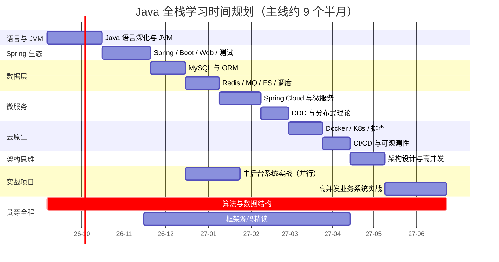

# 学习时间规划（主线约 9-10 个月）

> 计划假设：在职学习（每天 2-3 小时 + 周末加量）。时间不足时可拉长周期，只需保持每完成一个阶段做一轮「能力自检」复盘。

## 总排期（gantt）

## 主线说明

- 主线任务 a1 → a11 串行推进，约 **285 天**（合计约 9 个半月）。
- **中后台实战在数据层完成后即启动**（a10），与微服务、云原生阶段并行——让每个阶段的新知识都有落点。
- 高并发业务系统实战（a11）放在架构思维完成之后，承接阶段 6 的全部内容。

## 贯穿全程的任务

| 任务 | 节奏 | 说明 |
|-|-|-|
| 算法与数据结构 | 每天持续（全程 290 天） | LeetCode 持续刷（每天 1-2 题），Java 后端面试的中等难度题为主 |
| 框架源码精读 | Spring 学完之后（约 150 天） | 顺序建议：Spring IoC → MyBatis → Spring Boot 自动装配 → 线程池 / AQS（JDK） |

## 阶段并行关系

- 阶段 4（微服务）与阶段 5（云原生）都依赖阶段 3 完成后启动；两者先后推进，共同作为阶段 6（架构思维）的前置。
- 阶段 3 完成后即可并行启动项目 1（中后台系统），不必等阶段 4-6。
- 阶段 1-3 是硬基础、不可跳过；阶段 4-6 可根据工作需要调整优先级。
