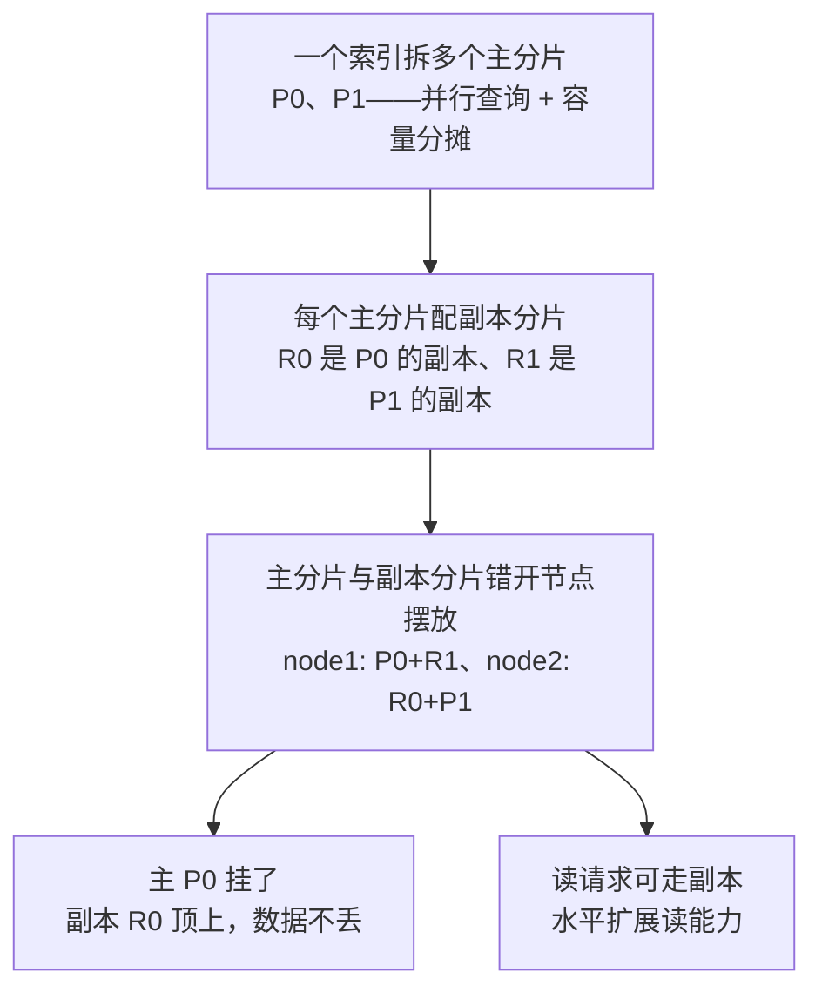

# Elasticsearch：从基础到资深进阶

> 所属：阶段八 数据库专家
> 定位：Elasticsearch 是**全文搜索引擎 + 日志/分析引擎**，核心是倒排索引 + 分词 + 聚合。适合「搜索、日志分析、复杂聚合」场景。**记住一条红线：ES 是检索加速层，不是 OLTP 主库**——业务真相存 MySQL/PG，ES 只做搜索和分析。

## 快速入门（能跑）

### 核心关键词速查
| 关键词 | 一句话大白话 | 例子 |
|-|-|-|
| 索引（Index） | ≈ 数据库表 | `products` |
| 文档（Document） | ≈ 一行记录 | 一个商品 |
| 分片（Shard） | 索引的并行单元 | 一个索引拆多个分片 |
| 倒排索引 | 词 → 文档 | 搜"手机"找到相关商品 |
| 分词 | 把文本切成词 | `ik_max_word` |
| DSL | ES 的查询语法（JSON） | `match`/`bool` 查询 |
| 聚合 | 分组统计 | 按价格区间统计 |

### 最简可运行示例
```java
// 用 Elasticsearch Java Client 查询(带详细注释)
import co.elastic.clients.elasticsearch.ElasticsearchClient;
import co.elastic.clients.elasticsearch.core.SearchResponse;

@Service
public class ProductSearch {
    private final ElasticsearchClient client;   // ES 客户端(自动注入)

    public ProductSearch(ElasticsearchClient client) { this.client = client; }

    public SearchResponse<Product> search(String keyword) throws Exception {
        return client.search(s -> s
            .index("products")                    // 查哪个索引(≈ 表)
            .query(q -> q.bool(b -> b             // bool 查询: 组合条件(≈ WHERE)
                .must(m -> m.match(mq -> mq.field("name").query(keyword)))  // 全文匹配 name
                .filter(f -> f.term(t -> t.field("status").value("1")))      // 精确 filter status=1（keyword 字段用字符串）
            )),
            Product.class);                       // 反序列化成 Product 对象
    }
}
```

> **代码备注（逐行解释）**：
> - `client.search(...)`：发起搜索请求。
> - `.index("products")`：指定在哪个「索引」里搜（≈表）。
> - `.bool(...)`：**bool 查询**用来组合条件；`must`（必须满足，算分≈AND）、`filter`（精确过滤，不算分）。
> - `.match(field("name").query(keyword))`：**全文匹配**——按分词找，智能匹配同义词/词形。
> - `.term(field("status").value("1"))`：**精确匹配**（≈`WHERE status='1'`），走 filter 不算分更快；`keyword` 字段要传字符串。
> - 对比 SQL：ES 用 JSON DSL 表达「过滤+全文检索+排序+聚合」，在复杂搜索上远比 `LIKE` 强大。

## 核心概念

### 1. 倒排索引与分词
```text
-- 倒排索引: "词 → 文档列表", 反过来了
CREATE INDEX idx_goods_name ON goods (name);  -- MySQL 的索引是"列→行"
-- ES 相反: 把 "[苹果手机] [华为手机]" 切词 → "苹果"→doc1, "手机"→doc1,doc2
```

| 分词器 | 用途 | 说明 |
|-|-|-|
| `ik_max_word` | 最细粒度切分 | 索引端收录词最全，避免漏搜 |
| `ik_smart` | 智能切分 | 更精准，词更少 |

> **类比一下（词典 vs 逐页翻书）**：生活版——一本 500 页的书想找「手机」这个字，从头一页页翻是全文苦力；出版社在书尾印「索引表」，把「手机」直接标在第几页，一查就到。换成 ES/MySQL——MySQL 是按列排好队、点对点查值；ES 把每篇文档先切词，维护一张「词 → 文档号」的索引表，查询直接命中——图见上方流程块。

> **该怎么做**：中文用 IK 分词，**索引端与搜索端保持一致**（最稳）——否则两端分词粒度不同，查询词切出来的 token 对不上索引里已有的 token，会「漏搜/误搜」。
> **常见组合**：① 索引 `ik_max_word` + 搜索 `ik_smart`（收录全、查询准，但需理解粒度差异）；② 两端统一用 `ik_max_word`（最不易踩坑）。
> `text` 字段做全文、`keyword` 字段做精确/排序。

> ⏸️ **短期可以不学**：倒排索引的内核实现——term dictionary（词表，记录有哪些词、词指向哪个文件块）的 FST 压缩、posting list（词下的文档号列表）的 Roaring Bitmap、段（segment，一次 refresh 生成的可独立检索小文件）合并细节。**何时回来学**：做 ES 内存/查询性能深度优化、或开始读 ES 源码时。**面试最低要求**：说出「倒排索引 = 词 → 文档列表，靠 term dictionary 定位词、posting list 存文档号」即可。

### 2. 索引与数据结构（mapping）
```json
PUT /products
{
  "mappings": {
    "properties": {
      "name": { "type": "text", "analyzer": "ik_max_word", "search_analyzer": "ik_smart" },   // 索引用 ik_max_word、搜索用 ik_smart（见上）
      "price": { "type": "double" },
      "status": { "type": "keyword" },                          // 精确匹配/排序
      "created_at": { "type": "date" }
    }
  }
}
```
> **该怎么做**：`text` 用于全文检索，`keyword` 用于精确过滤/排序/聚合——**一个字段可能需要双字段**（如 `name` 全文 + `name.keyword` 排序）。`search_analyzer` 单独指定搜索端分词器，若不写则默认等于 `analyzer`。
> **不该怎么做**：把所有字段都设 `text`——精确匹配会变成全文匹配，排序也出问题。

> **为什么 text 与 keyword 分开**：`text` 会先分词再建倒排索引，命中靠「词匹配」，无法精确等值与排序；`keyword` 不分词、整体存储，走列式 **doc_values**，支持精确过滤/排序/聚合——所以「一个字段双映射」（`name` 全文 + `name.keyword` 排序）是常见做法。

> **为什么 ES 是近实时（NRT, Near Real-Time）**：写入→可见要过三道工序，见下图。


> **类比一下（账本 vs 货仓）**：生活版——下单的快递信息先记进「记账本」（translog），货还在仓里没出库，别人查不到；仓库每整点把待发单子统一打包出库（refresh），出库后快递单号才查得到；下班前财务把出库记录正式归档入册（flush）。换成 ES——对应写 buffer+translog、按批 refresh 成段、最后 flush 落盘，把「每条写入都随机写盘」换成批量写盘。

> **为什么这么设计**：每秒批量生成 segment，避免「每条写入都随机写盘」（LSM 的批量合并思想）；translog 就是 WAL（Write-Ahead Log）——机器宕机时靠 translog 重放未落盘写入，防数据丢失。这就是「写入即达、约 1 秒才可见」的原因，也解释了为什么 ES 不能当 OLTP 主库。

## 进阶

### 1. 深分页问题（ES 的头号坑）
```text
-- from+size 翻页很深: 每分片取满 from+size 条再丢弃 → 慢
-- 第 1000 页(size=10, from=9990) → 每分片取 10000 条; 且 max_result_window=10000 封死
SELECT * FROM products LIMIT 9990, 10;  -- (MySQL 的类比)
```
| 翻页方式 | 适用 | 说明 |
|-|-|-|
| `from+size` | 浅分页（<1w） | 深了会爆 |
| `search_after` | 深分页/滚动加载 | 用上一页最后一条的排序值做游标，恒定成本 |
| PIT + `search_after` | 深分页 + 一致性快照/全量导出 | **PIT 不是翻页方式**，它只锁住索引快照防滚动中数据变；必须配 `search_after` 使用 |
> **该怎么做**：深翻页用 `search_after`（游标式）；全量导出用 **PIT + `search_after`**（PIT 保一致快照，避免导出中途索引被改；`scroll` 已不推荐）。
> **不该怎么做**：`from=100000` 硬翻——每个分片取 10 万条再丢，直接拖垮。

### 2. 聚合（分析统计）
```json
GET /orders/_search
{
  "size": 0,
  "aggs": {
    "by_status": { "terms": { "field": "status" } },        // 按状态分组统计
    "avg_amount": { "avg": { "field": "amount" } }          // 平均金额
  }
}
```
> **该怎么做**：报表/统计用 ES `aggs` 聚合（快），别拉全量到内存算。
> **为什么 aggs 聚合快**：字段默认开启 **doc_values（列式存储）**——把每个字段按列连续存放（类比列存数据库），聚合/排序直接顺序扫一列，不用逐行读文档；所以 `text` 字段默认没有 doc_values（文本不可聚合），`keyword`/数值字段才能高效聚合排序。全量拉数据到内存是 O(数据量) 的序列化与传输开销，doc_values 是 O(结果集) 的列式扫描，量级天差地别。
> **不该怎么做**：`size` 不加 `0`（默认返回 10 条命中，浪费）。

### 3. 数据同步（MySQL → ES）
| 方案 | 方式 | 适用 |
|-|-|-|
| 双写 | 业务代码同时写 MySQL 和 ES | 简单，但要处理失败 |
| MQ 异步 | 写 MySQL 后发消息，消费端同步 ES | 解耦，推荐 |
| Canal | 订阅 binlog 自动同步 | 无侵入，但要部署 |
> **该怎么做**：用 MQ 异步同步（体验好 + 解耦）；严格一致场景可双写 + 对账补偿。
> **不该怎么做**：ES 当主库——它**没有 ACID 事务**且是**准实时**（默认 `refresh_interval=1s`，写入后约 1 秒才可搜索到；可调 `refresh` API 强制刷新），读你刚写入的可能还没刷出来。

### 4. 索引模板与别名（企业级惯用法）
```json
// 索引模板: 自动给新索引套上统一的 mapping/setting —— 日志按天建索引时必备
PUT /_index_template/logs
{
  "index_patterns": [ "logs-*" ],                       // 匹配 logs-开头的索引名
  "template": {
    "settings": { "number_of_shards": 3, "number_of_replicas": 1 },
    "mappings": {
      "properties": {
        "message": { "type": "text", "analyzer": "ik_max_word" },
        "level":   { "type": "keyword" }
      }
    }
  }
}

// 别名: 优雅地切换索引(读写走 alias, 背后索引可换)
POST /_aliases
{ "actions": [ { "add":  { "index": "logs-2026-09", "alias": "logs-write" } } ] }
```
> **代码备注（逐行解释）**：
> - **索引模板**：`index_patterns` 匹配 `logs-*` 就自动套用 mapping/settings——新索引不用手动配。
> - `number_of_shards`：主分片数（并行/容量上限），一次定够；`number_of_replicas`：副本数（高可用 + 读）。
> - **别名（alias）**：应用层「读写走 `logs-write` 这个别名」，背后索引可无缝切换（升级/重建不中断）。
> - 组合使用：按天建 `logs-2026-09`，模板统一 mapping，读写走别名，ILM 管理生命周期。

### 5. 集群与性能（分片/副本/高可用）

> **类比一下（一套书按册分上架）**：生活版——一套 60 本的百科书，图书馆若全塞一个书架，查书只能由一个人在架子上慢慢找；分成 12 个书架就能并行找，但书架总量固定，拆得越多每个书架越薄。换成 ES——**分片**就是并行查询的粒度，也决定容量上限，所以**一次定够**；每本主书再影印一份副本放隔壁库房（**副本分片**），主书被借走副本顶上（高可用），两家库房同时供人查阅（读扩展）。

- **主分片（primary shard）**：数据的实际存储单元，并行查询的粒度——**一次定够，多了反而慢（跨分片聚合）**。
- **副本分片（replica）**：主分片的副本——**高可用（主挂了副本顶上）+ 读扩展**。
- **集群角色**：`node.roles` 可配置 `master`（管元数据）/ `data`（存数据）/ `ingest`（预处理）/ `ml` 等——**大集群分离部署**（master 与 data 分开）。
- **纯协调节点（coordinating）= `node.roles: []` 空数组**：它不存数据、只接收并分发请求；「coordinating」不是 `node.roles` 里的合法值。
- **索引生命周期（ILM，Index Lifecycle Management）**：日志索引的「自动管家」——按天/月建索引，配 ILM 做 hot→warm→cold 冷热分层（类比自己数据：先放常取的抽屉，几个月后挪到地下室冷库，到期直接销毁）+ 定期 delete——**无限增长的单一大索引是事故源**。
- **快照备份**：定期 `snapshot` 到对象存储（S3/MinIO），防数据丢失。



```json
// 查看集群健康(分片是否 all 分配)
GET /_cluster/health
{ "status": "green", "number_of_nodes": 3, ... }   // green=主分片+副本都就绪
```
> **该怎么做**：分片数一次定够；副本 ≥1 保高可用；日志类配 ILM 冷热分层。
> **不该怎么做**：主分片设太多（每个查询跨过多分片，聚合慢）；单节点无副本。

> ⏸️ **短期可以不学**：分片路由与分配策略的内核细节——routing 哈希计算、shard allocation/rebalance 调度、节点故障后的分片恢复流程。**何时回来学**：集群出现分片分配不均/恢复慢、需要做容量与节点规划时。**面试最低要求**：能说出「文档按 _id 哈希路由到主分片、分片数一次定够、副本做高可用与读扩展」即可。

## 场景与红线（怎么做 / 不该怎么做）

| 场景 | ✅ 该怎么做 | ❌ 不该怎么做 |
|-|-|-|
| 商品/文档全文搜索 | ES（倒排索引+分词） | MySQL `LIKE %xx%` 硬扛 |
| 日志分析 | ES 索引 + 冷热分层（ILM） | 日志塞 MySQL |
| 复杂聚合统计 | ES `aggs` | 拉全量到内存算 |
| 核心交易数据 | MySQL（唯一事实源） | ES 当主库（无事务、准实时） |
| 数据量小无分词 | MySQL LIKE + 索引就够 | 为「显得专业」上 ES |

## 红线小结（必背）

1. **ES 是检索/分析引擎**：核心业务数据存 MySQL/PG，ES 只做搜索和聚合。
2. **`text` 与 `keyword` 分清**：全文用 text，精确/排序/聚合用 keyword。
3. **深分页用 `search_after`**：别 `from` 硬翻。
4. **中文用 IK 分词**：默认分词对中文不友好。
5. **数据同步用 MQ 异步**：最终一致 + 对账补偿。
6. **分片数一次定够、副本 ≥1**：主分片多了聚合慢；副本保高可用。
7. **日志用索引模板 + 别名 + ILM**：统一 mapping、优雅切换、冷热分层。
8. **什么时候才上 ES**：数据量大 + 有分词/全文/聚合需求；数据小无分词需求 → MySQL 够用，别过度设计。

## 进阶自测

- [ ] 能说清倒排索引与 MySQL B+ 树索引的本质区别
- [ ] 能写出一个 `bool` 查询（must + filter）并解释 match/term 差异
- [ ] 能说清 `text` vs `keyword` 的适用场景与双字段做法
- [ ] 能解释深分页为什么慢、为什么 `search_after` 能解决
- [ ] 能用索引模板统一日志索引 + 别名切换 + ILM 冷热分层
- [ ] 能说清主分片/副本分片的作用，以及分片数为何一次定够
- [ ] 能设计 MySQL→ES 的同步方案（MQ 异步 + 对账补偿）
- [ ] 能说出「什么时候才该上 ES、什么时候 MySQL 够用」

## 常见面试题

### Q1：倒排索引的原理？和 MySQL 的 B+ 树索引本质区别是什么？

**答**：

**标准结论**：倒排索引（Inverted Index）是「词 → 文档列表」的反向映射，B+ 树是「值 → 行位置」的正向有序结构。

**底层原理**：文档写入时分词，每个词对应一个 posting list（文档 ID 列表，含词频/位置），搜索时先查词、再对文档列表做并/交操作。
- 「搜词」是 O(词数) 的查找而不是全表扫。
- MySQL 的 `LIKE '%xx%'` 无法利用 B+ 树前缀匹配，只能全表扫——这就是两者检索性能差距的本质。

**工程实践**：B+ 树适合 OLTP 的等值/范围点查，倒排索引适合「不知道精确值、只知道关键词」的全文检索；两者是互补关系——MySQL 存事实、ES 做搜索，别互相替代。

### Q2：ES 为什么是近实时？refresh 和 translog 是什么？

**答**：

**标准结论**：写入先进内存 buffer + translog，每秒一次 refresh 生成可搜索 segment，所以「约 1 秒后才可见」（NRT）。

**底层原理**：
- translog 是 WAL（Write-Ahead Log）——每次写入先记 translog 防宕机丢数据。
- refresh 把 buffer 批量转成 segment，避免逐条随机写盘（LSM 批量合并思想，用批量换吞吐）。
- flush（commit）才把 segment 落盘并清空 translog。

**工程实践**：对可见性要求高的场景可调小 `refresh_interval`（如 100ms）或调 refresh API 强制刷新，但会牺牲写吞吐；数据安全上「副本数 ≥1 + 定期快照」比追求秒级可见更重要——这也是 ES 当不了 OLTP 主库的原因之一。

### Q3：深分页为什么慢？search_after 为什么能解决？

**答**：

**标准结论**：`from+size` 深翻页时每个分片都要取「from+size」条再全局合并丢弃，且 `max_result_window` 默认 10000 封死；`search_after` 用上一页最后一条的排序值做游标，成本恒定。

**底层原理**：
- 分布式下没有「全局第 N 条」，from+size 必须把每个分片的前 N 条全拉出来归并排序，N 越大成本越高。
- search_after 只向后取一页，天然避免重复跳过已看过的数据。

**工程实践**：
- 网页翻页（<1w 条）用 from+size 没问题；无限滚动/深翻页用 search_after。
- 全量导出用 PIT + search_after 锁一致性快照（scroll 已不推荐）。
- **常见误区**：search_after 不能任意跳页，且排序值要唯一（加 `_id` 兜底）。

### Q4：text 和 keyword 有什么区别？分词器怎么选？

**答**：

**标准结论**：text 分词建倒排索引做全文匹配，keyword 不分词整体存做精确过滤/排序/聚合。

**底层原理**：
- text 走 analyzer（分词器）拆成 token，match 查询靠词匹配命中。
- keyword 走 doc_values 列式存储，term 查询整体等值。
- **分词器**：默认 standard 对中文只能按字/标点切、效果差；中文生产用 IK 分词器（`ik_max_word` 最细、`ik_smart` 智能），索引端与搜索端保持一致或用 max_word + smart 组合。

**工程实践**：一个字段既要全文又要排序就做双字段（name + name.keyword）；别把时间/状态/ID 设成 text，否则无法精确匹配与排序聚合。

### Q5：MySQL 和 ES 的数据怎么同步？为什么不能把 ES 当主库？

**答**：

**标准结论**：双写 / MQ 异步 / Canal（binlog 订阅）三种，生产推荐 MQ 异步 + 对账补偿。

**底层原理**：
- ES 没有 ACID 事务，写入是近实时、刷盘靠 refresh/flush——当主库意味着「刚写的读不到、宕机可能丢」。
- ES 的强项是倒排检索而不是 OLTP 点查。

**工程实践**：
- 以 MySQL 为唯一事实源，写操作只动 MySQL，通过 MQ 异步同步 ES，消费失败重试 + 定时对账补偿兜底。
- Canal 订阅 binlog 无侵入但要部署维护。
- **面试高频追问**「一致性怎么保证」——回答最终一致 + 对账，而不是承诺强一致。
