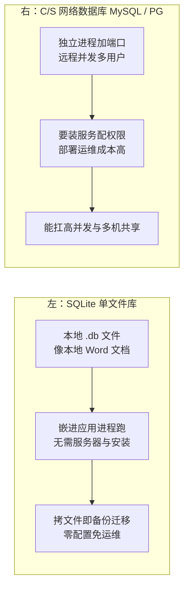

# SQLite：从基础到资深进阶

> 所属：阶段八 数据库专家
> 定位：SQLite 是**嵌入式的关系型数据库**——零配置、单文件、无需服务器，整个数据库就是一个 `.db` 文件。适合「移动 App、本地工具、单机免运维、原型验证」场景。**记住：它是单机/嵌入式的最佳选择，但不适合高并发写入和多机共享（没有网络服务器）。**

## 快速入门（能跑）

### 核心关键词速查
| 关键词 | 一句话大白话 | 例子 |
|-|-|-|
| 单文件数据库 | 整个库就是一个文件 | `app.db` |
| 零配置 | 无需服务器/安装 | 直接打开用 |
| 嵌入式 | 嵌进应用进程 | 移动 App 本地库 |
| 事务 | 一组操作原子提交 | `BEGIN/COMMIT` |
| WAL | 写前日志，并发读更好 | `journal_mode=WAL` |
| PRAGMA | 数据库设置指令 | 设置配置 |

### 最简可运行示例
```java
// 用 JDBC 操作 SQLite(带详细注释)
import java.sql.Connection;
import java.sql.DriverManager;
import java.sql.PreparedStatement;
import java.sql.ResultSet;

public class SqliteDemo {
    private Connection conn;   // SQLite 连接(单文件即库)

    public SqliteDemo(String dbFile) throws Exception {
        this.conn = DriverManager.getConnection("jdbc:sqlite:" + dbFile);   // 连接即打开/创建文件
    }

    // 建表
    public void init() throws Exception {
        conn.createStatement().execute(                              // 执行 DDL
            "CREATE TABLE IF NOT EXISTS note (id INTEGER PRIMARY KEY, content TEXT, ts INTEGER)");
    }

    // 插入(用 PreparedStatement 防注入)
    public void add(String content) throws Exception {
        try (PreparedStatement ps = conn.prepareStatement(          // 预编译, 防 SQL 注入
                "INSERT INTO note (content, ts) VALUES (?, ?)")) {
            ps.setString(1, content);                               // 第1个 ? 填 content
            ps.setLong(2, System.currentTimeMillis());              // 第2个 ? 填时间戳
            ps.executeUpdate();                                     // 执行更新(插入/改/删)
        }
    }

    // 查询
    public String query(int id) throws Exception {
        try (PreparedStatement ps = conn.prepareStatement(
                "SELECT content FROM note WHERE id = ?")) {
            ps.setInt(1, id);
            try (ResultSet rs = ps.executeQuery()) {                 // 执行查询
                if (rs.next()) return rs.getString("content");       // 取列 content
            }
        }
        return null;                                                 // 无结果返回 null
    }
}
```

> **代码备注（逐行解释）**：
> - `jdbc:sqlite:` + 文件名：连接即「打开或创建」这个 `.db` 文件——**零配置、单文件**。
> - `createStatement().execute(...)`：执行 DDL（建表）。
> - `PreparedStatement` + `?` 占位：**防 SQL 注入**（用 `setString/setLong` 填值，而不是拼接字符串）。
> - `executeUpdate()`：插入/更新/删除；`executeQuery()`：查询返回 `ResultSet`。
> - `rs.next()` + `rs.getString("content")`：游标式读取，`next()` 移到下一行，`getString(列名)` 取值。
> - `try-with-resources`：自动关闭资源（PreparedStatement/ResultSet），避免泄漏。

## 核心概念

### 1. 为什么用 SQLite
| 优势 | 说明 |
|-|-|
| 零配置 | 无服务器、无端口、无权限管理 |
| 单文件 | 整个库一个 `.db`，备份/迁移拷文件即可 |
| 嵌入式 | 嵌进应用进程，访问极快（无网络开销） |
| 跨平台 | 几乎所有平台支持 |

> 💡 **生活版类比（本地 Word 文档 vs 共享文档服务器）**：SQLite 像**本地 Word 文档**——装了办公软件就能打开，双击编辑、保存即完成，发给同事就是拷贝文件；MySQL/PG 则像**公司共享文档服务器**——要先连内网、登录账号才能改，还要专人运维。「没有服务器也想用数据库」，用文档文件式的 SQLite 就够了。
> **换回 SQLite**：前端 `localStorage`/`IndexedDB` 的心智可直接迁移——`localStorage` 是浏览器里的「单机单值库」，SQLite 是它背后的**完整关系型数据库**；两者的共同决策点都是「**不需要服务器**」。



### 2. 事务（SQLite 的强项）
```java
void batchInsert(List<String> contents) throws Exception {
    conn.setAutoCommit(false);              // 关闭自动提交, 开启事务
    try {
        for (String c : contents) add(c);   // 批量插入
        conn.commit();                      // 全部成功才提交
    } catch (Exception e) {
        conn.rollback();                    // 任一失败, 全部回滚
        throw e;
    } finally {
        conn.setAutoCommit(true);           // 恢复自动提交
    }
}
```
> **该怎么做**：批量写入用事务包裹——否则每条都单独提交，巨慢。为什么慢？每次提交都要把数据**落盘（fsync）**才算数，单条提交 = 每条写都等一次磁盘；包进一个事务，只在结束时落盘一次，性能差几个量级。
> **不该怎么做**：不关自动提交循环插入——每次提交一个事务，性能差几个量级。

> 💡 **生活版类比（只有一支签字笔的签到处）**：SQLite 整库只有**一把文件级写锁**，同一时刻只能一个人「落笔」——像签到台只有一支笔，拿在手里时别人只能等（等太久就放弃，报 `database is locked`）。
> **换回事务与锁**：`BEGIN` = 伸手要笔，`COMMIT` = 写完放下笔，唯有放下笔下一个人才能写——写天然串行，这就是 `database is locked` 的由来。


## 进阶

### 1. WAL 模式（并发读优化）
```java
conn.createStatement().execute("PRAGMA journal_mode=WAL");   // 启用 WAL(写前日志)
```
> **该怎么做**：启用 WAL 模式——写不阻塞读、读不阻塞写，并发读性能大幅提升。
> **不该怎么做**：默认 rollback journal（回滚日志——写前先把旧内容存到一份日志，写一半崩溃时好回撤）模式在并发读写时会互相阻塞。
> **为什么 WAL 能让读写互不阻塞**（分三步看）：
> 1. **写者不碰主文件**：写操作只**顺序追加**到 `.wal` 日志文件尾部（追加写比随机改页快得多），主库文件原样不动。
> 2. **读者照旧读快照**：读者照常读主库文件的**旧快照**——日志还没合并，库里还是提交前的样子。
> 3. **结果互不阻塞**：写者在 `.wal`、读者在主文件，各走各的文件；默认 rollback journal 模式则必须在主文件上加**独占锁**，把读者挡在门外。

> 💡 **生活版类比（记账先生）**：写操作先记在**小便签本**上，顾客看的还是**大账本**，互不耽误；打烊后（checkpoint，把日志合并回主文件）再统一誊进大账本，誊错了就按便签重誊（崩溃时按日志重放恢复）。
> **换回 WAL**：便签本 = `.wal` 日志文件，大账本 = 主库 `.db` 文件，誊写 = checkpoint，按便签重誊 = 日志重放。注意 WAL 是**「一写多读」**——多个读者可并行，写者之间依然互斥（同一时刻只有一个写事务能提交）。


### 2. 索引与优化
```sql
CREATE INDEX idx_note_ts ON note (ts);   -- 按时间查询优化
-- SQLite 优化建议: WAL + 适当索引 + 大批量循环用事务
```
> **该怎么做**：按查询建索引；关联/排序字段放索引。
> **不该怎么做**：全表扫描——数据多了就慢。

### 3. 备份与迁移（单文件，拷文件即可）
```bash
# ① 直接拷 .db 文件(安全备份前先确保没有打开中的写事务)
cp app.db app.db.bak
# ② 用 SQLite 在线备份(推荐, 安全)
sqlite3 app.db ".backup app.db.bak"
# ③ 迁移: 拷 .db 到目标机器即可(单文件无需安装)
```
> **该怎么做**：备份用 `.backup`（在线安全备份）；迁移拷 `.db` 文件即可——这是 SQLite 单文件的巨大优势。
> **不该怎么做**：`cp` 拷正在写的库文件——可能拷到不一致的中间状态；用 `.backup` 更稳。

### 4. 常用 PRAGMA（优化设置）

> ⏸️ **短期可以不学**：`synchronous`、`cache_size` 这类细粒度调参属于嵌入式数据库的调优细节，开发期默认值完全够用，背了不用很快忘。**何时回来学**：产品真遇到读写性能瓶颈、需要压榨 SQLite 时按官方文档逐个调。**面试最低要求**：能说出 WAL、`synchronous`、`busy_timeout` 三个 PRAGMA 各自解决什么问题。

```sql
PRAGMA journal_mode=WAL;            -- WAL 模式(并发读)
PRAGMA synchronous=NORMAL;          -- 性能折中(数据安全=FULL)
PRAGMA foreign_keys=ON;             -- 开启外键约束(默认关!)
PRAGMA busy_timeout=5000;           -- 锁等待 5s, 避免"database is locked"
PRAGMA cache_size=-20000;           -- 缓存 20MB(负数=KB)
```
> **该怎么做**：生产配置 `WAL + synchronous=NORMAL + busy_timeout`；要外键开 `foreign_keys=ON`。
> **不该怎么做**：`synchronous=OFF`（性能极快但有崩溃丢数据风险）；不开 `busy_timeout`（并发写频繁报 locked）。

### 5. 两种典型用法
- **嵌入式 / 移动 App**：本地离线缓存、设置、聊天记录——单文件随 App 一起。
- **本地工具 / 单机**：桌面工具、开发调试、数据导出导入——免部署。
- **原型验证**：先用 SQLite 快速验证业务模型，数据大了/要并发再迁 MySQL/PG——**SQLite 是迁移成本最低的起点**。

## 场景与红线（怎么做 / 不该怎么做）

| 场景 | ✅ 该怎么做 | ❌ 不该怎么做 |
|-|-|-|
| 移动 App 本地存储 | SQLite（单文件/免运维） | 每次联网查 |
| 桌面/本地工具 | SQLite | 装一套 MySQL |
| 开发原型/调试 | SQLite 快速起 | 一上来就装 MySQL |
| 高并发 Web 后端 | MySQL/PostgreSQL | SQLite（单机无网络） |
| 多机共享读写 | MySQL/PG | SQLite（文件锁，不支持多进程并发写） |

## 红线小结（必背）

1. **SQLite 是单机/嵌入式神器**：零配置、单文件、免运维——移动端/本地工具首选。
2. **不适合高并发 Web 后端**：没有网络服务器；且整库只有**一把文件级写锁**（单写者模型），同一时刻只有一个进程能写，多进程并发写要么排队超时报 `database is locked`。
3. **批量写入要开事务**：否则单条提交性能差。
4. **启用 WAL 模式**：并发读场景必备；配 `busy_timeout` 防 locked。
5. **SQLite 没有主从/副本**：单机定位，不需要副本；靠 `.backup` 备份 + 拷文件迁移。
6. **什么时候用 SQLite**：单机、免部署、嵌入式、原型——一句话「不需要服务器的时候」。
7. **别用它扛 Web 并发**：那是 MySQL/PG 的活。

## 进阶自测

- [ ] 能说清 SQLite 的四点优势（零配置/单文件/嵌入式/跨平台）
- [ ] 能用 JDBC + PreparedStatement 完成增删查（防注入）
- [ ] 能说清为什么要用事务包裹批量写入
- [ ] 能说清 WAL 模式解决了什么（并发读写）
- [ ] 能列出常用 PRAGMA（WAL/synchronous/busy_timeout）及作用
- [ ] 能说清 SQLite 为什么没有主从，以及如何备份（.backup）与迁移（拷文件）
- [ ] 能判断「什么时候用 SQLite、什么时候用 MySQL」（核心判断力）

## 常见面试题

### Q1：SQLite 和 MySQL 有什么区别？什么场景选 SQLite？

**答**：**标准结论**：
- SQLite：嵌入式关系型数据库——零配置、单文件、无服务器，整个库就是一个 `.db` 文件，嵌进应用进程跑。
- MySQL：C/S 架构的网络数据库——独立进程 + 端口 + 权限管理。
- 适用场景：移动 App 本地存储、桌面工具、单机免运维、原型验证；不适用：高并发 Web 后端、多机共享。

**底层原理**（对比两侧）：
- **SQLite 优势**：没有网络层，读写直接走文件系统，少了进程间通信与网络开销，单机小数据量下性能极高。
- **SQLite 代价**：没有并发访问模型——整库一把文件级写锁，多进程同时写会互斥等待或报 `database is locked`。
- **MySQL 定位**：由服务器进程统一管理连接与缓冲池，能支撑大量并发连接，但部署运维成本高得多。

**工程实践**：
- 选型口诀：**「不需要服务器的时候就用 SQLite」**。
- 起步迁移路径：原型先用 SQLite 快速验证，数据量和并发上来再迁 MySQL/PG——标准 SQL + 单文件搬走，迁移成本最低。
- 面试加分点：别只说「它是个文件」，要说出**嵌入式（in-process）、单写者模型**这两个本质。

### Q2：为什么 SQLite 不适合高并发写入？

**答**：**标准结论**：三个原因——单文件、文件级锁、单写者模型：整个数据库一把写锁，同一时刻只有一个进程/连接能提交写事务，其余写请求排队或直接失败。**本质 = 写只能「串行」。**

**底层原理**（分三点）：
- **锁实现在文件上**：SQLite 的锁直接在数据库文件上实现（默认模式的 RESERVED/EXCLUSIVE 锁，WAL 模式下的写锁），没有 MySQL 那样的行级锁与 MVCC（多版本并发控制——让每个读者看到自己开启时的旧版本，读写互不堵）。
- **WAL 也救不了写串行**：WAL 模式最多做到「一写多读」——读可并行，写仍串行。
- **文件锁受操作系统限制**：NFS（网络文件系统）等网络场景上锁不可靠；多连接并发写时，`busy_timeout` 到期没拿到锁就抛 `database is locked`。

**工程实践**：
- **若必须多进程写，手段有限**：写请求串行化（单写进程/队列）、缩短事务、设 `busy_timeout`、开 WAL。
- **本质结论**：这不是「调优能解决」的——写并发是 Web 后端的量级，该换 MySQL/PG。
- 面试关键点：不是「慢」，是「**串行**」——并发写场景是锁竞争与超时问题。

### Q3：WAL 模式解决了什么问题？原理是什么？

**答**：**标准结论**：WAL（Write-Ahead Logging，预写日志）解决默认 rollback journal 模式下「读写互相阻塞」的问题——让读不阻塞写、写不阻塞读。

**底层原理**（对比两种模式）：
- **默认 rollback journal 模式**：写事务改主库文件前先把旧内容拷贝到回滚日志，期间对主文件加**独占锁**，读者被挡在门外。
- **WAL 模式**：写操作只**顺序追加**到 `.wal` 日志文件尾部（追加写比随机改页快得多），主库文件不动，读者照常读主库文件的**旧快照**——读写各走各的文件，自然互不阻塞。
- **日志后处理**：日志在 checkpoint 时异步合并回主文件，崩溃时按日志重放恢复——日志就是「写前日志」。
- **边界**：WAL 下写者之间仍互斥（同一时刻仍只有一个写事务）。

**工程实践**：
- 读多写少、读写混合场景开 `PRAGMA journal_mode=WAL` 是基本操作。
- 配套 `synchronous=NORMAL`（WAL 下安全且快，只在 checkpoint 时 fsync）；配合 `busy_timeout` 缓解锁竞争。
- 面试技巧：画一下「写者追加日志、读者读主文件」的画面，比背结论有说服力。

### Q4：SQLite 怎么备份？为什么不能直接 cp 正在写的库文件？

**答**：**标准结论**：
- 推荐在线备份：`sqlite3 app.db ".backup app.db.bak"`。
- 简单场景拷文件（`cp`）也行，但必须确保**没有活动写事务**。
- 迁移 = 拷 `.db` 文件到目标机器——单文件免安装是 SQLite 最大优势。

**底层原理**（对比两种拷贝）：
- **直接 cp 的问题**：cp 是文件系统层的字节拷贝，若拷贝期间写者正在提交，主文件可能处于**不一致的中间状态**（部分页新、部分页旧，日志未合并），拷出的库可能损坏或丢数据。
- **`.backup` 好在哪**：由 SQLite 自己执行在线备份协议——逐页拷贝 + **事务快照**保证拷贝期间数据库视图一致，WAL 模式下还正确处理日志合并。

**工程实践**：
- 生产备份用 `.backup`（或编程接口的 online backup API）。
- 拷完后最好开库跑一次 `PRAGMA integrity_check` 验证。
- 面试要点：备份要的是「**一致性视图**」，文件级 cp 拿不到，数据库自带的备份接口才能给。

### Q5：SQLite 报 "database is locked" 是怎么回事？怎么解决？

**答**：**标准结论**：
- **触发条件**：SQLite 是单写者模型——多个连接同时写，或读事务持有时间过长拿不到写锁，就报 `database is locked`。
- **解决三板斧**：设 `busy_timeout`、缩短事务/避免长事务、写操作串行化。

**底层原理**（分三点）：
- **锁在文件上，且默认不等待**：SQLite 的锁是数据库文件上的锁，默认 busy timeout 为 0——拿不到锁**立刻报错**，不会等待。
- **常见触发**：① 两个连接同时写（WAL 下写者仍互斥）；② 一个连接开了事务又不提交，挡住另一个连接的写；③ 长读事务拖住 checkpoint。
- **WAL 的边界**：WAL 能大幅缓解读写互锁，但**写-写竞争依旧存在**。

**工程实践**：
- 设 `PRAGMA busy_timeout=5000` 让写等待而不是立刻报错。
- 事务只包必要语句、尽快提交；写集中到单线程/单连接（如写入队列）。
- 排查是否误用长连接 + 长事务。
- 面试要点：说出「锁等待 + 超时」机制，并区分 `database is locked`（写锁竞争）与 WAL 下读锁相关报错的场景。
