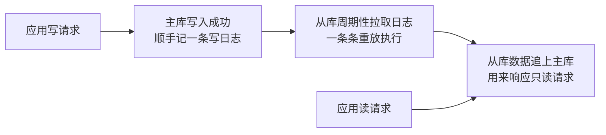
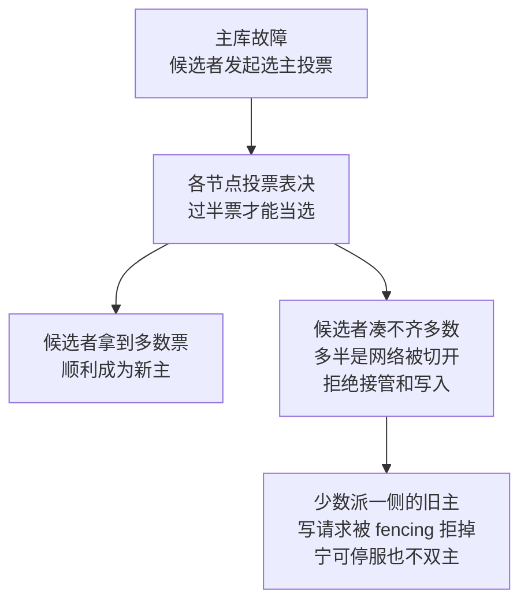

# 数据库主从/副本设计（已拆分到各库）

> 所属：阶段八 数据库专家
> ☝️ **重要说明**：主从/副本/高可用是**每个数据库自己的事**，不是一套通用方案。本文件已**拆分到各数据库自己的教程里**，请直接到对应文件读：
>
> | 数据库 | 去哪里读主从/副本 |
> |-|-|
> | MySQL | [`02-MySQL.md`](02-MySQL.md) → 「主从复制与读写分离」 |
> | PostgreSQL | [`03-PostgreSQL.md`](03-PostgreSQL.md) → 「流复制 / Patroni 主从」 |
> | Redis | [`01-Redis.md`](01-Redis.md) → 「主从 / 哨兵 / Cluster」 |
> | Elasticsearch | [`04-Elasticsearch.md`](04-Elasticsearch.md) → 「分片 / 副本 / ILM」 |
> | MongoDB | [`05-MongoDB.md`](05-MongoDB.md) → 「副本集 / 分片集群」 |
> | Neo4j | [`07-Neo4j.md`](07-Neo4j.md) → 「因果集群（core + read-replica）」 |
> | SQLite | [`06-SQLite.md`](06-SQLite.md) → 单机无主从，看「备份 / 迁移」 |

## 通用概念速查（各库实现不同，但规律一致）

> ⏸️ **短期可以不学**：各库高可用的**完整部署运维细节**（Patroni 全套配置、Orchestrator 架构、哨兵调参、副本集选主参数）不是主线重点，机制懂了即可，背部署步骤很快会忘。**何时回来学**：公司真让你搭建/运维某库的 HA 集群时，再按对应数据库文档逐项学。**面试最低要求**：能说出"每个库都有主从/副本机制 + 自动选主 + 读扩展"的通用规律，并说出 MySQL/Redis/MongoDB 各自的选主组件名。

| 通用概念 | MySQL | PostgreSQL | Redis | Elasticsearch | MongoDB | Neo4j |
|-|-|-|-|-|-|-|
| 主从/读写分离 | 主从 + GTID | 流复制 + Patroni | 主从 + 哨兵 | 主分片 + 副本分片 | 副本集 | core + read-replica |
| 自动故障转移 | MGR / InnoDB Cluster / Orchestrator | Patroni 选主 | 哨兵 | 集群重分配 | 副本集自动选主 | 因果集群多数派 |
| 读扩展 | 从库读写分离 | 备库只读 | 从库 | 副本分片 | secondaryPreferred | read-replica |
| 水平扩展 | 分库分表 | 分区（单机） / Citus | Cluster 分片 | 分片 | 分片集群 | （写不可横向扩展） |

> **一句话**：每种数据库的副本机制不同，但都回答「读扩展 + 主故障高可用」两个问题，实现各在其文件里。

> **通用原理（面试重点，各库一致）**：
> - **复制与 CAP**：主从复制的本质是**可用性优先（AP 倾向）**——主库收到写请求即确认成功，从库异步/半同步追赶，系统时刻可用；代价是数据**最终一致**，复制延迟窗口内各节点数据不同。
>   - 代价的兑现方式：要「强一致读」就得牺牲可用性或性能——读主库、等多数派确认（如 MongoDB `w: majority`、Redis `WAIT`）、或改用半同步复制。
> - **共识（Consensus）≠ 一致性（Consistency）**：这是两个层面的词，别混。
>   - **共识**（Raft / Paxos）是协议/算法，解决「多个节点对谁是主、日志按什么顺序复制达成一致」——它是选主、复制日志的**手段**。
>   - **一致性**描述的是**副本之间的数据状态**（是否相同）。
>   - 结论：选主共识保证「同一时刻只有一个主、选主不分裂」，但不保证副本数据实时相同——那属于复制延迟问题。
> - **读写分离的读己之写问题（read-your-writes）**：写完主库立即读从库，可能因复制延迟读到旧值。缓解：关键读走主库、监控从库延迟并告警（如 MySQL `Seconds_Behind_Master`）、强一致读用 WAIT/多数派读、业务层"写后一段时间读主"兜底。

> **三个易踩误区（特别提醒）**：
> - **PG 分区表不是水平扩展**：分区是在**单机内**把大表拆小（按范围/哈希），**不跨节点、不提升写入吞吐**；PG 真正的水平分片要 **Citus** 或分库中间件。
> - **MySQL MHA 已停止维护**：别在文档/方案里再推 MHA，现代用 **MGR / InnoDB Cluster / Orchestrator**。
> - **Neo4j 因果集群「写不横向扩展」**：它解决高可用 + 读扩展，但**写入仍是单 leader**；别把「因果集群」当成水平写扩展。

## 常见面试题

### Q1：主从复制的原理是什么？同步复制和异步复制有什么区别？

**答**：

**标准结论**：主从复制的本质是**日志重放**——从库重放主库记下的写日志，复现主库的写入路径。
- 主库把写操作记进**日志**（MySQL binlog、PG WAL、MongoDB oplog），从库拉取日志并重放，实现数据复制。
- 复制同步方式分三档：**异步**——主库写入成功即返回，不等待从库确认；**全同步**——要等全部从库确认；**半同步**——等至少一个从库确认。

**底层原理**：日志是「状态变化的序列」，重放日志等于复现主库的写入路径——这是复制的通用范式。
- 日志复制比传数据文件更高效：增量小、可断点续传。
- 异步的代价是**丢数据窗口大**：主库已确认写入、日志却还没到从库时宕机，这段写入永久丢失。
- 同步的代价是**性能**：每次写都要等网络往返，吞吐下降，主库还会被慢从库拖累。

> **类比 · 丢数据窗口**：生活版——前台对客户说「快递已寄出」，其实快递员还没来取件，当晚仓库起火，合同烧没了，客户以为寄到、实际已丢。换回技术——主库写成功就回「成功」，但日志还没同步到从库，此刻主库宕机，这笔写入就永久丢了；「日志从主库传到从库之前」的这段时间，就是丢数据窗口。

**工程实践**：生产主流是**半同步 + 异步结合**，把「不丢数据」的承诺收敛到「主库崩溃且至少一台从库已确认」这个约定内，别追求极端的全同步。
- MySQL 半同步复制（至少一台从库确认）+ 主从延迟监控。
- 面试要点：复制的本质是日志重放，异步/同步是「等不等确认」的取舍。

> 主从复制通用链路：写走主库并记日志 → 从库拉日志重放 → 读走从库，这就是「读写分离」的基本盘。

### Q2：主从延迟怎么治理？读写分离后怎么保证读到最新数据？

**答**：

**标准结论**：治理延迟三板斧：**监控、优化、分摊**；要强一致读就直接**读主库**，或写后等待从库追上再读。
- 监控：如 MySQL `Seconds_Behind_Master`，掌握从库落后多少。
- 优化：并行复制、合理索引、拆分大事务。
- 分摊：从库只承接可容忍旧数据的请求。

**底层原理**：延迟 = 从库落后主库的时间，根源是**从库重放能力跟不上主库写入**（MySQL 传统复制单线程重放，5.7+ 并行复制才缓解），再加上大事务、大 DDL 在从库执行更慢。
- 复制延迟导致的典型问题是**读己之写（read-your-writes，写完立刻读自己刚写的数据）**：写完主库立即读从库可能读不到——读请求被路由到了没追上的从库。

**工程实践**：方案分级，容忍度从宽到严：
- ① 业务容忍：从库只服务报表、搜索、feed 流等可旧数据。
- ② 关键路径读主库：如「支付后查余额」。
- ③ 写会话内短时读主：写后 N 秒内该用户读主库。
- ④ 从库延迟超阈值自动摘流量并告警。
- 面试必答「读己之写」四个字，并给出「容忍旧数据 + 关键读主 + 延迟摘流」的三层方案。

### Q3：主库挂了怎么自动选新主？什么是脑裂？怎么避免？

**答**：

**标准结论**：现代方案依赖**共识协议自动选主**，各库组件如下：
- MySQL：MGR / InnoDB Cluster。
- PostgreSQL：Patroni（etcd/zk 共识）。
- Redis：Sentinel / Cluster。
- MongoDB：副本集（Raft 变体）。
- Neo4j：因果集群（Raft）。
- 核心机制是**多数派（quorum）投票**——只有获得多数派支持的节点能成为主；quorum 即「超过半数的节点都点头，才算数」。

**底层原理**：脑裂（Split Brain）发生在网络分区时——主库与从库失联，两边都以为自己是主、各自接受写入，网络恢复后数据互相覆盖。防脑裂靠两条通用手段：
- ① **多数派原则**：只能联系到多数派节点的候选者才能当选，少数派一侧**拒绝服务**。
- ② **租约 / fencing**：新主上任前用分布式锁（租约）或 fencing token 让旧主**物理上无法再写**——旧主写请求带旧版本号会被拒绝。

> **类比 · fencing token**：生活版——公司门禁每人一张胸牌，老总的胸牌被吊销后，他原来的那张就再也刷不开任何一扇门。换回技术——fencing token 就是一个「不断涨大的版本号」：新主上任后旧主手里的 token 全部作废，它再发写请求都会被节点拒绝，物理上堵死「旧主还在写」的可能。

**工程实践**：节点要「奇数 + 严格 quorum」（3 节点可挂 1 个，5 节点可挂 2 个）。
- 切换要快（秒级）但更要稳——**宁可多等几秒也不要双主**。
- 切换后先等从库追平，再恢复读写分离。
- 面试加分项：能说出「多数派 + fencing」是防脑裂的标准组合。

> 选主与防脑裂：多数派投票定新主；网络分区时少数派拒绝服务，配合 fencing 物理封掉旧主的写，双保险。

### Q4：Raft/Paxos 共识和"一致性"是一回事吗？CAP 定理怎么理解？

**答**：

**标准结论**：不是一回事。
- **共识（Consensus）**是协议/算法（Raft、Paxos），解决「多个节点对同一决策（谁是主、日志顺序）达成一致」。
- **一致性（Consistency）**是数据层面「副本间状态是否相同」的性质。
- 一句话：**共识是实现一致性（及选主）的手段，不是一致性本身**。

**底层原理**：
- Raft 把问题拆成选主、日志复制、安全性三块，靠多数派 + 任期号（term）保证任何时刻最多一个主、日志有序——它保证的是「决策不分裂」，不保证「数据零延迟相同」（那是复制延迟问题）。
- CAP 的准确表述：**只有网络分区（P）发生时**，才需要在一致性（C）与可用性（A）间二选一——没有分区时两者可以兼得。
- 多数派协议提供的是线性一致性（linearizability，所有并发读写看起来都像按一个全局时间点依次发生）级别的强一致，不是「所有副本实时相同」。

**工程实践**：被问「MySQL 是 CP 还是 AP」时别贴标签，要分析：
- 纯异步主从是 AP 倾向（最终一致）；MGR 半同步 + 多数派确认则偏 CP。
- 准确回答 = 说明「在什么配置下是什么行为」。
- 理解「共识 ≠ 一致性」，还能接住「Raft 选了主但副本仍有延迟」这类追问。

### Q5：如何设计一套数据库高可用 + 读写分离架构？

**答**：

**标准结论**：以 MySQL 为例，一套高可用 + 读写分离架构 = 四件套拼装：
- **一主多从**（1 主 2 从）读写分离。
- **自动选主**：MGR / InnoDB Cluster 或 Patroni。
- **访问层**：VIP/代理故障切换。
- **从库延迟监控**。
- 数据层面：核心写走主，读按「可容忍旧数据程度」分流到从库。

**底层原理**：高可用的目标是「主故障用户无感」，拆开是四件事：
- 复制：数据不丢，配合半同步。
- 共识选主：谁接管，多数派。
- 路由切换：流量怎么走，VIP 漂移或代理感知主从变化。
- 防脑裂：fencing。
- 读写分离的目标是「读扩展」，代价是延迟与一致性窗口，所以要分层：强一致读走主，弱一致读走从。

**工程实践**：常见坑——
- ① 只做读写分离不做自动选主，主挂了还是要人工介入。
- ② 从库延迟不监控，读到旧数据无感知。
- ③ 切换后从库没追平就放流量。
- ④ 应用直连主库地址，切换失效——要接 VIP/代理。
- 面试框架：复制、选主、路由、监控四件套，缺一不可。
