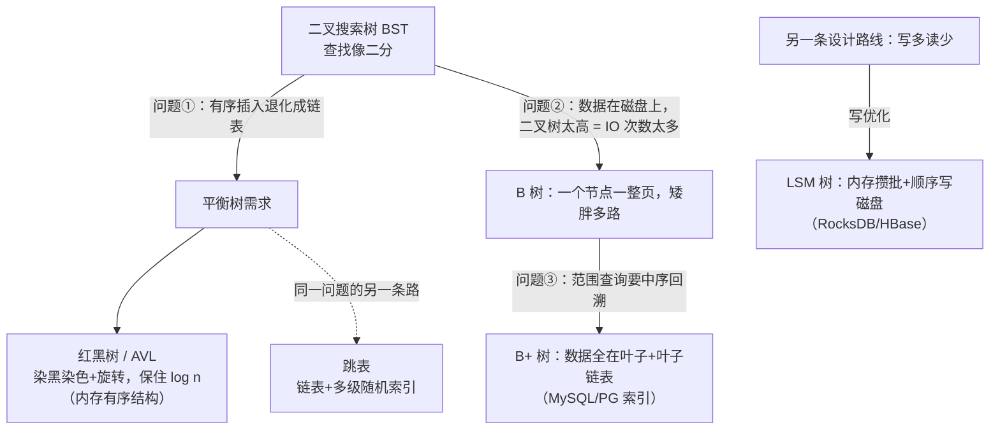
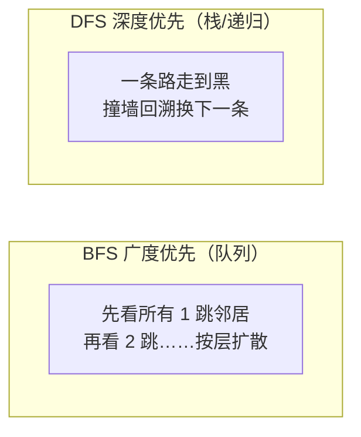

# 阶段八 · 09：树与图的算法基础

> 所属：阶段八 数据库专家
> 定位：补齐**数据库背后的数据结构**——本阶段每一讲都在跟这些结构打交道：B+ 树是 MySQL/PG 索引的骨架、红黑树藏在 HashMap 的树化里、跳表撑起 Redis 的 ZSet、LSM 树是写密集型存储的引擎、图是 Neo4j 的本体。你缺的不是概念名，是「**为什么演进出这个结构**」的因果链——每个结构都是为了解决上一个结构的某个致命缺陷而生的。

## 快速入门（能跑）

### 核心关键词速查

| 关键词 | 一句话大白话 |
|-|-|
| 二叉搜索树（BST） | 左小右大的二叉树——查找像二分，但**有序插入会退化成链表** |
| 红黑树 | 自平衡的 BST：靠「染红染黑 + 旋转」保住 O(log n)——内存有序表的事实标准 |
| B 树 / B+ 树 | 「矮胖」多路平衡树：一个节点占一整页磁盘——为**减少磁盘 IO**而生 |
| 跳表（Skip List） | 有序链表 + 多级索引——靠随机层数实现 log n 定位，实现极简 |
| LSM 树 | 「先写内存、攒一批顺序写磁盘」的**写优化**结构——写密集存储的引擎 |
| 邻接表 / 邻接矩阵 | 图的两种存法：每个点存邻居列表 vs 存 N×N 的表 |
| BFS / DFS | 广度（队列、按层）/ 深度（栈、一条道走到黑）两种遍历 |
| 拓扑排序 | 把「依赖关系」排成「先做谁后做谁」的顺序 |

### 最简可运行示例

用 30 行 Java 手写一棵最小 BST，直观看「**中序遍历 = 有序输出**」这个 BST 的灵魂性质：

```java
import java.util.*;

public class BstDemo {
    static class Node {
        int val; Node left, right;
        Node(int v) { val = v; }
    }

    static Node insert(Node root, int v) {
        if (root == null) return new Node(v);
        if (v < root.val)      root.left  = insert(root.left, v);   // 小的往左
        else                  root.right = insert(root.right, v);  // 大的往右
        return root;
    }

    static void inorder(Node n, List<Integer> out) {   // 中序遍历：左 → 自己 → 右
        if (n == null) return;
        inorder(n.left, out);
        out.add(n.val);
        inorder(n.right, out);
    }

    public static void main(String[] args) {
        Node root = null;
        for (int v : new int[]{50, 30, 70, 20, 40, 60, 80}) root = insert(root, v);
        List<Integer> out = new ArrayList<>();
        inorder(root, out);
        System.out.println(out);   // [20, 30, 40, 50, 60, 70, 80] —— 中序遍历天然有序！
    }
}
```

> 代码备注：
> - `insert` 的每一步就是「二分」：比较一次扔掉一半——这就是 BST 查找 O(log n) 的来源。
> - **试着换一组有序数据插入**（1,2,3,4,5...）：每个新数都往右走，树退化成一条链表，查找变 O(n)——这正是下一节「平衡树」要解决的问题。
> - 前端直觉对照：BST ≈ 对数据建好了索引的 DOM 树——按路径定位节点而不是全树扫描。

## 核心概念

### 1. 树的演进链：一个问题推动一次进化



**① 红黑树：内存场景的「够用的平衡」**

- **五条性质**一句话版：节点非红即黑；根是黑；红节点的孩子必须全黑（**红不相邻**）；任一节点到叶子的黑节点数相同（**黑高一致**）。合起来的效果：最长路径不超过最短路径的 2 倍——**近似平衡**。
- **为什么不选更严格的 AVL**（左右子树高度差 ≤1）：AVL 查找略快（更平衡），但**插入/删除要做的旋转多**；红黑树用「稍微歪一点」换来修改代价低——查找、增删都频繁的工程场景（`TreeMap`、`HashMap` 链表长度到 8 的树化、Linux epoll 的就绪 fd 管理）全选了红黑树。
- 前端对照：TS 的 `Map` / V8 的对象属性表用哈希，**一旦需要「有序遍历 + 增删」就是红黑树的位置**——Java `TreeMap` ≈ 需要按 key 排序遍历时的 `Map`。

**② B 树 → B+ 树：磁盘场景的「矮胖」**

- 核心账本：**一次磁盘 IO（~10ms 级）比一次内存比较（~ns 级）贵一万倍**——优化目标不是「比较次数少」而是「**IO 次数少**」。
- B 树的招：让一个节点占满一整页（MySQL InnoDB 16KB），一页塞几百上千个键——树从「瘦高二叉」变「**矮胖多路**」，2000 万行树高只有 3 层 ≈ **3 次 IO 定位一行**。
- B+ 树再补两刀（数据库为什么不用纯 B 树）：**非叶子节点只存键不存数据**（同样一页塞更多键，树更矮）；**所有数据在叶子层且叶子串成有序链表**（范围查询 `WHERE id BETWEEN` 顺着链表扫，不用中序回溯整棵树）。
- 这就是 [02-MySQL](02-MySQL.md) 里「B+ 树矮胖、三层覆盖两千万行」结论的完整来龙去脉。

**③ 跳表：用「随机」换「简单」**

- 结构 = 有序链表上叠多级稀疏索引（每隔一个节点抽到上一层，**随机决定层高**）。查找从顶层跳着走，像走楼梯时只看路口指示牌。
- **Redis ZSet 为什么用跳表不用红黑树**（经典面试）：实现简单得多的增删改；范围查询（`ZRANGE`）顺着底层链表直接走；按排名（rank）定位天然高效——三个工程理由，没有一个是为了绝对性能。
- 对照：跳表定位 ≈ 你在**有序数组上做二分**，只不过二分的「中点」由链表的索引层提前标好了。

**④ LSM 树：把「随机写」翻译成「顺序写」**

- 思路：写入先落**内存表**（追加+排好序），攒满一批**顺序刷**成磁盘上的一个有序小文件（SSTable），后台再**分层合并**（Level 0 → 1 → 2 …）。磁盘顺序写 ≈ 内存写的速度量级。
- 代价：**读要查多层**（可能新旧数据散在不同层，读放大）、删除是打墓碑标记（空间放大）——所以 LSM 是「写密集、读可容忍」场景的选择：RocksDB / HBase / LevelDB / 很多时序库；而 B+ 树是「读密集、写可容忍」（每次写要更新页、可能页分裂）。**LSM 与 B+ 树是读优化与写优化的两端**。

**一张总表**：

| 结构 | 平衡方式 | 场景 | 读写倾向 | 你在哪用到它 |
|-|-|-|-|-|
| 红黑树 | 染色+旋转 | 内存 | 均衡 | Java TreeMap / HashMap 树化 / epoll |
| B/B+ 树 | 分裂+合并，节点=磁盘页 | 磁盘 | 读优化 | MySQL / PG / MongoDB 索引 |
| 跳表 | 随机层高 | 内存 | 均衡+范围友好 | Redis ZSet / LevelDB memtable |
| LSM | 分层合并 | 磁盘 | **写优化** | RocksDB / HBase / 时序库 |

### 2. 图的基础：从存到走

**图的表示**——邻接表 vs 邻接矩阵（N 个点 N×N 的表）：

```text
邻接表（每个点存"我认识谁"）           邻接矩阵（N×N 表，1=有边）
A → [B, C]                                 A  B  C
B → [C]                               A [  0  1  1 ]
C → []                                B [  0  0  1 ]
                                      C [  0  0  0 ]
```

- 稀疏图（好友数 << 总人数）邻接表省空间；邻接矩阵换「O(1) 判断两点是否相邻」。社交图天然稀疏，所以都用邻接表——**Neo4j 的物理存储本质就是「把邻接表做成指针」**（边直接存对端节点的地址，遍历=指针跳转，见 [07-Neo4j](07-Neo4j.md)）。
- 前端对照：邻接表就是 **npm 的依赖树描述**——`package.json` 的 dependencies 列表 = 每个节点存自己的邻居。

**遍历：BFS 与 DFS**



- **BFS = 层序遍历**（你写过的二叉树 level-order）：队列实现；**无权图的最短路就是 BFS**——第一次到达某点时走的层数就是最短跳数。
- **DFS = 递归/栈**：适合连通性判断、环检测（递归栈里出现「正在访问」的点=有环）。
- 工程对应：Webpack 模块打包前的**依赖解析**（找到入口的所有传递依赖=DFS/BFS 都行）；React 组件树的渲染（DFS 先序）。

**拓扑排序：给依赖关系排顺序**

- 问题形态：「A 依赖 B 和 C，B 依赖 C」→ 合法构建顺序必须 C → B → A。
- **Kahn 算法**直觉：反复挑「当前没有任何未完成前置」的节点出队（入度为 0），删除它并给后继减入度——像多米诺骨牌从没有前置压力的那张开始推。
- **前端天天见**：npm install 的包安装顺序、构建工具的 chunk 依赖图、ESLint 的规则执行序——本质都是拓扑排序。**图里有环 = 依赖死循环**（你的 npm 循环依赖警告就是这么检出来的——DFS 检测环）。

**最短路（认识即可）**：无权图 BFS 就是最短路；带权非负图用 Dijkstra——直觉是「每次从边界里挑离起点最近的点敲定」，像水波扩散时总沿最短的边先到。数据库阶段不需要实现，知道「地图导航/关系路径查询（Neo4j 的 `shortestPath`）背后是它」即可。

## 进阶

### 3. 为什么 MySQL 不用红黑树 / 跳表做索引？（面试高频）

三个结构查找都是 O(log n)，差距在**常数和 IO 模型**：

- **红黑树是二叉**：2000 万行树高约 25 层 ≈ 25 次磁盘 IO——「矮胖」的 B+ 树 3 层搞定，**差 8 倍**。二叉结构每层只利用一页里的一小部分，而 B+ 树一页几百键。
- **跳表层数是随机期望 log n**，同样太高；且内存友好≠磁盘友好（节点分散分配，无法像 B+ 树那样按页聚集顺序读）。
- **哈希索引**倒是 O(1)，但**不支持范围查询与排序**（`WHERE id BETWEEN`、`ORDER BY` 直接废）——所以只有 Memory 引擎和自适应哈希这种辅助场景用。
- 结论：**磁盘索引 = B+ 树是「页对齐 + 矮胖 + 叶子链表」三重磁盘友好的合体**，不是因为它算法复杂度更优。

### 4. 红黑树怎么「藏」进 HashMap 的？

数组 + 链表的哈希桶里，某桶链表长度 ≥ 8 且数组容量 ≥ 64 时，该桶**链表转红黑树**（树化）——把最坏查找从 O(n) 压到 O(log n)。细节在阶段一 [08-集合框架源码](../01-阶段一-Java语言深化与JVM体系/08-集合框架源码.md)讲过；本讲补的是「为什么选红黑树」——桶内节点是纯内存结构，正落在红黑树的属地。

### 5. 一图流：结构选型决策

| 你的问题 | 结构 | 理由回顾 |
|-|-|-|
| 内存里的有序字典、增删查都频繁 | 红黑树 | 近似平衡，修改代价低 |
| 磁盘上的索引、读密集 | B+ 树 | 矮胖少 IO + 叶子链表范围查询 |
| 内存有序 + 需要 rank/范围 + 想少写代码 | 跳表 | 随机层高，天然按序链表 |
| 磁盘写吞吐压倒一切 | LSM | 顺序写 + 攒批合并 |
| 关系多跳遍历 | 图（邻接表+遍历 或 Neo4j） | 关系是存储事实不是查询计算 |

## 场景与红线（怎么做 / 不该怎么做）

| 场景 | 该怎么做 | 不该怎么做 |
|-|-|-|
| 理解 MySQL 执行计划里的「3 层 B+ 树」 | 从磁盘 IO 成本账理解树高 | 只背「树高 3」不问为什么 |
| 面试被问索引结构 | 讲演进链（BST 退化→平衡→磁盘矮胖→叶子链表） | 直接背「B+ 树快」 |
| 依赖解析/构建顺序 | 拓扑排序（Kahn 或 DFS） | 手写递归硬猜顺序 |
| 无权最短路（几跳好友） | BFS | DFS（找到的不保证最短） |
| 写吞吐敏感的存储选型 | LSM 系（RocksDB）当写是主矛盾时 | 无脑 B+ 树（写页分裂代价） |

## 红线小结（必背）

1. **树的一切演进都为两件事**：平衡（防退化，红黑树）与磁盘友好（矮胖少 IO，B+ 树）——跳表是简单性路线、LSM 是写优化路线
2. **内存选红黑树、磁盘选 B+ 树**：二叉 vs 多路的分界就是「一次 IO 多贵」
3. **BFS=按层+无权最短路， DFS=回溯+环检测，拓扑排序=依赖排序**；图里有环，拓扑排序必失败——这本身是最常用的环检测
4. **结构选型先问读写比例**：读密集 B+ 树、写密集 LSM——没有全维度最优的结构

## 进阶自测

- [ ] 能讲出 BST 的两个致命问题分别催生了哪两个结构（退化→平衡树；磁盘高→B 树）
- [ ] 能解释红黑树「最长不超过最短两倍」的近似平衡为什么在工程上胜过 AVL 的严格平衡
- [ ] 能算账：为什么 2000 万行的 B+ 树树高只有 3 层而红黑树要 25 层（16KB 页 × 每页几百键）
- [ ] 能说出 B+ 树对 B 树的两个数据库特化（非叶子只存键 / 叶子链表）各自解决什么
- [ ] 能用 BFS 写无权最短路、用拓扑排序解析依赖、并说明两者怎么检测环

## 常见面试题

### Q1：为什么 MySQL 的索引用 B+ 树，而不用红黑树、跳表或哈希表？

**答**：标准结论：核心账是**磁盘 IO 成本**——一次页 IO 比一次内存比较贵一万倍，索引结构的优化目标是「从根到叶的 IO 次数」而不是「比较次数」。B+ 树三个磁盘友好特性：①**多路矮胖**——节点按页（16KB）对齐，一页几百键，2000 万行树高仅 3 层 ≈ 3 次 IO；②**非叶子只存键**——同样一页扇出更大、树更矮；③**叶子层有序链表**——范围查询顺链表扫，不必回溯。对比：红黑树二叉、2000 万行高约 25 层 ≈ 25 次 IO（差 8 倍）；跳表随机层高同样是内存友好非磁盘友好，且节点分散无法按页聚集顺序读；哈希表 O(1) 但不支持范围与排序。底层原理：B+ 树是「页对齐 + 矮胖 + 叶子链表」三重磁盘优化的合体；哈希和二叉结构各卡死一个查询形态。工程实践：Memory 引擎用哈希（纯内存、等值场景）；InnoDB 自适应哈希索引是运行期自动为热点页加的旁路优化——都不动摇 B+ 树主索引的地位。

### Q2：红黑树和 AVL 树有什么区别？工程上为什么多选红黑树？

**答**：标准结论：两者都是自平衡 BST，差别在**平衡的严格度**——AVL 严格（任一节点左右子树高度差 ≤1，查找更快），红黑树近似（最长路径 ≤ 最短路径的 2 倍，修改更便宜）。底层原理：AVL 插入/删除可能引起从修改点到根的连锁旋转（O(log n) 次旋转）；红黑树靠变色+最多两次旋转即可恢复性质——**查询频率远高于修改时 AVL 才有优势**，而真实工程里增删查混合，红黑树的综合成本更稳。工程实践：Java 的 TreeMap/HashMap 树化、Linux epoll（就绪 fd 的红黑树）、C++ STL 的 map 全是红黑树；AVL 主要出现在教科书和读极密集的静态字典场景。加分点：红黑树的五条性质可压缩成两句记忆——「红不相邻、黑高一致」。

### Q3：Redis 的有序集合（ZSet）为什么用跳表而不用红黑树？

**答**：标准结论：三个工程理由——①**实现简单**：跳表插入删除只是改几个前向指针+随机层数，红黑树要处理旋转与染色的多种情况，代码量与出错面差一个量级；②**范围操作天然高效**：`ZRANGE`/`ZRANGEBYSCORE` 沿底层有序链表直接走，红黑树范围查询要中序回溯；③**按排名（rank）定位**：跳表沿链表数经过节点数即排名，`ZRANK`/`ZREVRANGE` 高效。底层原理：跳表用「随机层高」以期望 O(log n) 逼近平衡树的性能，把「维护平衡」的成本从确定性的旋转简化成概率性的抽签——是**用简单性换可控性能下界**的设计。工程实践：LevelDB 的 memtable 也是跳表（简单+内存场景）；这说明选型不总是选「理论最优」，实现复杂度、代码可维护性、目标操作的形态同样是硬指标。

### Q4：BFS 和 DFS 分别适合解决什么问题？拓扑排序的用途和失效条件？

**答**：标准结论：BFS（队列、按层扩散）适合**层次类与无权最短路径**问题——第一次到达某节点时的层数就是最短跳数；DFS（栈/递归、走到黑回溯）适合**连通性、环检测、路径枚举**——递归栈天然记录当前路径。拓扑排序解决「依赖排序」：把 DAG（有向无环图）的节点排成线性序，使每条边的起点都排在终点前——构建顺序、课程先修、包安装顺序都是它；Kahn 算法反复摘「入度为 0」的节点，DFS 逆向输出也是经典实现。失效条件：**图里有环则拓扑序不存在**——Kahn 的队列提前空、DFS 检测到「正在访问中」的节点，两者都是环检测的实用手段（npm 循环依赖报警就是这个原理）。工程实践：无权最短路直接 BFS 别用 DFS（DFS 找到的是「某条」路径不保证最短）；带权非负最短路是 Dijkstra（数据库阶段知道概念即可，Neo4j 的 `shortestPath` 背后是它的变种）。
