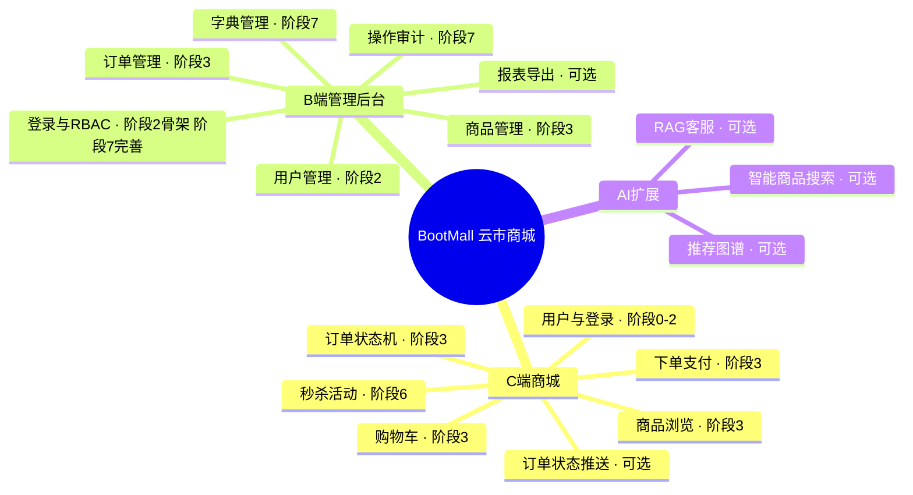
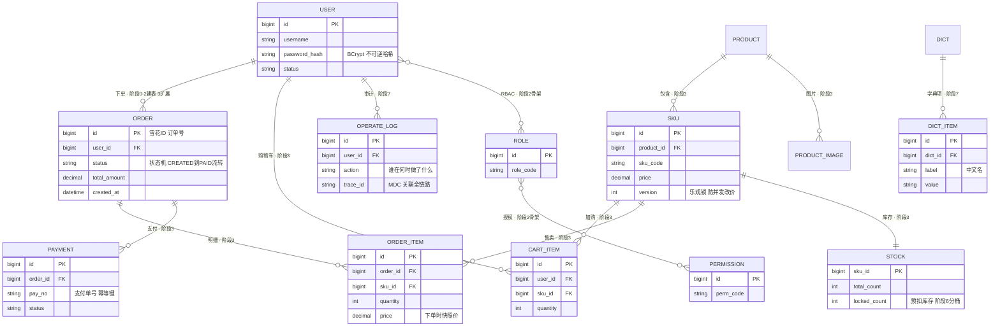
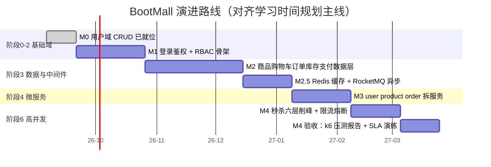

# BootMall「云市商城」实战产品蓝图

> **一句话定位：一个渐进演进的电商平台。**
>
> 这份蓝图回答一个问题：**学到的东西往哪儿落**。它把 docs/ 里各阶段的知识点，映射到一个真实产品的功能上——每学完一个阶段，回到这里查映射表，往 boot-app/ 里落一块功能。蓝图不是新讲义（概念细节以 docs/ 各讲正文为准），而是学习路线与实操工程之间的「施工图」。
>
> 对应关系：产品 BootMall = 阶段七三个实战项目合一（C 端商城 = 项目二、B 端后台 = 项目一、AI 扩展 = 项目三）；配套工程 = 仓库已有的 [boot-app](../boot-app/README.md)（Spring Boot 4.0.0 + Java 25 + MyBatis-Plus 3.5.17 + H2 多模块）。

## 1. 产品定义

### 1.1 一句话定位与三个端

**云市商城 BootMall**：一个从单体 CRUD 逐步演进到能扛秒杀高并发的电商平台，面向三个使用群体：

| 端 | 是什么 | 对应阶段七项目 | 主线角色 |
|-|-|-|-|
| **C 端商城**（用户侧） | 商品浏览 / 购物车 / 下单 / 支付 / 秒杀 | [项目二 电商订单系统](07-阶段七-全栈融合与项目实战/03-项目二-电商订单系统.md) | **高并发主线**，贯穿阶段 3-6 |
| **B 端管理后台**（运营侧） | 用户 / 商品 / 订单管理 + RBAC 权限 + 字典 + 操作审计 | [项目一 中后台管理系统](07-阶段七-全栈融合与项目实战/02-项目一-企业级中后台管理系统.md) | **工程化闭环**，阶段 2 起步、阶段 7 完善 |
| **AI 扩展**（可选） | 智能商品搜索 / RAG 客服（检索增强生成：先查资料再问模型） | [项目三 AI 应用平台](07-阶段七-全栈融合与项目实战/04-项目三-AI应用平台.md) | 可选加分项，主线稳定后再接 |

### 1.2 为什么一个产品能贯穿全程

- docs/ 里阶段七的三个项目本来就是「同一套电商业务」的三个切面：中后台管数据，商城消费数据，AI 增强体验。**把它们合一，学习节奏完全不变**——每个阶段该学的知识点一个不少，只是落点从「三个项目」收敛成「一个产品的三个端」。
- 工程上天然支持：boot-app/ 采用 `infrastructure/`（公共底座）+ `services/`（独立业务服务）结构，加一个模块就多一个功能域，与蓝图演进一一对应，后续拆微服务时 `services/` 下的模块直接升级为独立服务。

### 1.3 使用方法

1. 学完一个阶段（或阶段内某讲），回到**第 4 节**查该阶段映射表，按「boot-app 落点」列落一块功能
2. 在 boot-app/ 新增或改造模块，跑通验证（步骤见 [boot-app 快速开始](../boot-app/README.md)）
3. 大技术选型前先看 **4.7 防过度设计边界**——没有启用信号就不上
4. 对照**第 5 节**交付计划，确认自己还在主线节奏上；当前进度见**第 6 节**

### 1.4 项目边界：把它做成作品，不做成技术展览

BootMall 的目标是完成一条可演示、可测试、可解释演进原因的电商链路；不是在一个练习项目里凑齐所有中间件。每次新增能力前，先回答「当前业务问题是什么、最简单方案为什么不够、怎样证明新方案有效」。

| 现在必须交付 | 有信号再交付 | 当前明确不做 |
|-|-|-|
| 用户、认证授权、商品、购物车、下单、支付模拟、库存、后台管理、测试与接口文档 | Redis、MQ、搜索、微服务、限流熔断、压测、对象存储 | 真实支付渠道、营销全家桶、复杂推荐、服务网格、多地域多活 |

> 🧩 前置 30 秒：**完成定义（Definition of Done，DoD）**——不是「代码写完」，而是功能能走通、关键规则有自动化测试、接口能被别人调用、失败场景可说明。像前端功能不仅要组件渲染出来，还要处理 loading / error / 权限状态并能验收。

### 1.5 实践工作流：每次只推进一张小卡片

每张实践卡片控制在 0.5-2 天，按这个格式记录在 issue、任务清单或提交说明中：

| 字段 | 要写清什么 |
|-|-|
| 目标 | 一个用户可感知的结果，例如「管理员能禁用用户」 |
| 规则 | 成功条件、失败条件与权限边界 |
| 改动范围 | 模块、表、接口、配置；不顺手重构无关代码 |
| 验证证据 | 至少一个自动化测试 + 一条可复现的接口验证命令 |
| 复盘 | 遇到的坑、取舍与下一张卡片 |

## 2. 产品功能地图

三端的功能域全景，每个功能标注**首个落点阶段**（同一功能后续阶段会强化）。

> 说明：标注「可选」的功能对应 4.6 扩展落点与第 7 节后置内容；「阶段 2 骨架、阶段 7 完善」表示该功能先做出可用版本，后续阶段按需强化（如 RBAC 阶段 2 先跑通，阶段 7 补字典 + 审计）。

## 3. 核心域模型

下图是**完整目标域模型**，不是要求第一天一次建完的表清单。当前工程只有 `t_user`；其余表按里程碑增量创建。阶段 3 之前使用 H2 的 `MODE=MySQL` 方言（已对齐 MySQL，切换成本最低），建表 SQL 统一放各服务 `db/schema.sql`。

| 里程碑 | 本次新增的核心数据 | 不提前做什么 |
|-|-|-|
| M0 | `t_user` | 不建角色、商品、订单等未来表 |
| M1 | 角色、权限、用户-角色、角色-权限 | 不做组织、菜单、数据权限等复杂 RBAC |
| M2 | 商品、SKU、购物车、订单、订单明细、支付模拟、库存 | 不上分库分表、跨服务事务 |
| M3 | 服务各自拥有的数据与 Outbox 发件箱表 | 不保留跨服务物理外键 |
| M4 | 秒杀活动、库存分桶、压测观测数据 | 不为了练习虚构多活架构 |

> 说明：RBAC 中「用户-角色」「角色-权限」是多对多，物理上用关联表实现（阶段二第 6 讲）；「订单状态机」指订单状态按规则流转（CREATED → PAID → SHIPPED → DONE / CANCELLED），用枚举 + 状态迁移校验实现（阶段三 03 讲、阶段七项目二）。阶段 4 拆服务后，图中的跨服务关系只保留为**逻辑关联**，不再建立跨库物理外键；服务通过接口或消息协作。

## 4. 业务场景 × 技术方案映射表

### 4.0 怎么读这张表

**三问原则**——每一行都回答三个问题：①**什么业务问题**？②**为什么是它**（对比了哪些备选方案）？③**恰好在哪个阶段学到**？

> 🧩 前置 30 秒：**技术选型的正确姿势**——先有问题再找技术，不是学完技术找问题。就像前端不是「学了 Redux 就到处引状态管理」，而是「组件状态复杂到传参混乱才引入」。下表所有行都是「问题在前、方案在后」；细节在第 4.7 节与对应讲次展开。

### 4.1 阶段 0-2 映射表（当前主线）

| 业务场景 / 问题 | 技术方案（为什么是它） | 对应文档 | boot-app 落点 |
|-|-|-|-|
| 工程骨架怎么搭、依赖版本谁管 | **Boot 多模块聚合工程**：`infrastructure/` 底座 + `services/` 服务，父 pom 用 **BOM**（依赖清单）锁版本 | 阶段二第 2 讲 | ✅ 已就位 |
| 接口返回结构不统一，前端到处判字段 | 统一响应体 `Result` + 全局异常 `@RestControllerAdvice`（异常集中转统一 JSON，像 axios 拦截器统一处理 error） | 阶段零 05 讲 / 阶段二第 3 讲 | `Result` ✅ 已就位（common-core）；全局异常 ⏭️ 待补 |
| 用户重复点击 / 网络重试造成重复下单 | **幂等**（同一请求重复提交只生效一次）**三板斧**：token（先领后付）→ 唯一索引（数据库防重）→ 状态机条件更新（「只有 CREATED 状态才改」），**按成本递增选**，先上 token 够用就停 | 阶段二第 3 讲 | 幂等注解 + 拦截器 |
| 参数错误散落一堆 if 判断 | 参数校验 `@Valid` + 校验注解（声明式校验，像前端 zod / yup 的 schema） | 阶段二第 3 讲 | Controller 加注解 |
| 密码明文入库，拖库即泄露 | **BCrypt** 单向哈希（不可逆 + 自动加盐，撞库成本高），绝不存明文 | 阶段二第 6 讲 | 注册接口改造 |
| 登录态怎么做（服务端 session 还是别的） | **JWT**（无状态令牌：服务端不存会话，天然支持水平扩展；像前端把 token 放 localStorage，每次请求带上） | 阶段二第 6 讲 | ⏭️ 下一步 |
| 谁有权访问什么接口 | **RBAC**（角色-权限模型：用户挂角色、角色挂权限，像前端路由的权限守卫） | 阶段二第 6 讲 | 角色 / 权限表 + 鉴权注解 |
| 日志 / 鉴权 / 参数处理等横切逻辑重复 | **Filter → Interceptor → AOP 三层拦截**（Filter 管 Servlet 层、Interceptor 管 Handler 层、AOP 管方法级业务，由外到内分工，像前端中间件洋葱模型） | 阶段二第 1/3 讲 | 登录校验拦截器 |
| 前后端分离，浏览器跨域被拦 | **CORS 配置**（跨域资源共享：白名单放行前端域名） | 阶段二第 3 讲 | 配置类 |
| 接口文档靠口头约定，联调对不上 | **SpringDoc OpenAPI**（注解自动生成文档，像 Swagger / Apifox 的契约来源） | 阶段二第 3 讲 | 依赖 + 配置 |
| dev / prod 配置混在一起，切环境手忙脚乱 | 多环境 **profile**（`application-{env}.yml`，像前端 `.env.development / .env.production`） | 阶段二第 2 讲 | 拆 dev / prod 配置 |
| 注册后发通知等非核心操作拖慢主流程 | `@Async` + Spring 事件（发布-订阅解耦，像前端 EventBus） | 阶段二第 1 讲 | 注册成功事件 |
| 订单超时未付需要自动处理 | `@Scheduled` 定时任务（单机版先够用；多实例重复执行的问题到阶段 3 学分布式锁再解决） | 阶段二第 2 讲 | 待阶段 3 业务成熟启用 |
| 并发修改同一条记录，后写覆盖先写 | **乐观锁 `@Version`**（更新时比对版本号，冲突少时近乎零成本；**冲突率高且事务短**才换悲观锁 `FOR UPDATE`） | 阶段三第 3 讲（MP） | 实体加 version 字段 |
| 上线靠手工点，回归靠肉眼 | 测试门禁：**JUnit5 + Mockito + Testcontainers**（单测 / 打桩 / 起真实容器做集成测试；像 CI 里 jest + vitest 不通过不许合） | 阶段二第 5 讲 | service 测试目录 |
| 线上日志一条请求串不起来 | **MDC TraceId**（日志上下文：入口生成 traceId 全程透传，像前端 Sentry 的 traceId） | 阶段二第 3 讲 | 日志拦截器 |
| 详情页 / BFF 串行拉多个接口，耗时叠加 | **CompletableFuture 并行聚合 + orTimeout 超时降级**（像前端 `Promise.all` + 竞速兜底） | 阶段一并发章节 / 阶段七第 1 讲 | 商品详情聚合接口 |
| DTO 写一堆 getter / setter | Java 21+ 的 **record** 作不可变 DTO（像 TS 的 interface，声明即定义） | 阶段零 05 讲 | 入参 / 出参改造 |
| 文件上传（用户头像） | `MultipartFile` 接收 + 本地目录暂存（生产换 OSS，见 4.6） | 阶段二第 3 讲 | 头像上传接口 |

### 4.2 阶段 3 映射表（数据层与中间件）

| 业务场景 / 问题 | 技术方案（为什么是它） | 对应文档 | boot-app 落点 |
|-|-|-|-|
| 零安装跑库，clone 即启动 | **H2 嵌入式数据库**（`MODE=MySQL` 已对齐 MySQL 方言，切换成本最低） | 阶段二第 5 讲 | ✅ 已就位 |
| 数据量 / 特性要求超出 H2 | H2 → **MySQL** 切换（引驱动 + 改一处 datasource url） | 阶段三第 1 讲 | 新 profile + 依赖 |
| 连接反复创建销毁，拖慢请求 | **HikariCP 连接池**（复用连接，Boot 默认自带，像 axios 的连接复用） | 阶段三第 1 讲 | 默认即有，调参数 |
| 慢查询拖垮接口 | **索引设计 + EXPLAIN 慢 SQL 优化**（先看执行计划再谈分库分表） | 阶段三第 1 讲 | 订单 / 明细建索引 |
| 单表数据到千万级、慢 SQL 优化到头 | **分库分表**（信号驱动！见 4.7——本产品 500w 日单量级不需要） | 阶段三第 2 讲 | 不落地，写 ADR |
| ORM 样板代码重复 | **MyBatis-Plus**：BaseMapper / IService（单表 CRUD 免写 SQL，像封装好的 axios 层）+ 自动填充 / 分页插件 | 阶段三第 3 讲 | ✅ 已就位，新增业务 Mapper |
| 下单 = 多表写（订单 + 明细 + 库存），中途失败留半截数据 | **事务 `@Transactional`**（ACID 原子性：要么全成要么全回滚）+ 隔离级别与锁（MVCC 快照读） | 阶段三第 1 讲 | 下单事务边界 |
| 购物车高频读写数据库扛不住 | **Redis Hash**（`cart:{userId}` 内存结构，像前端把购物车状态放全局 store 而非每次请求服务端） | 阶段三第 4 讲 | cart 模块 |
| 字典 / 商品列表反复查库 | `@Cacheable` + **Caffeine 多级缓存**（本地缓存 Caffeine + 远端 Redis；是否需要多级以命中率数据为准，见 4.7） | 阶段三第 4 讲 | 字典缓存 |
| 热点 key 过期瞬间打爆数据库（**缓存击穿**） | 互斥重建 + **Redis 分布式锁**（单机锁在多个应用实例下管不到别的进程，所以要分布式的） | 阶段三第 4 讲 | 商品详情热点 key |
| 高并发扣库存**超卖**（库存扣成负数） | 三层防线：**Redis Lua 预扣**（脚本原子执行，先挡必失败请求）→ **DB 条件更新** `cnt >= ?`（最终一致兜底）→ 定时**对账**（修正偏差） | 阶段三第 4 讲 / 阶段六第 2 讲 | 库存服务 |
| 下单链路被非核心操作拖慢 | **RocketMQ** 异步化（下单成功 → 发消息 → 扣积分 / 发通知；像前端消息总线解耦） | 阶段三第 5 讲 | 订单事件 |
| 超时未支付订单取消 | RocketMQ **延时消息**（下单后 15 分钟自动催付 / 关单，代替轮询扫表） | 阶段三第 5 讲 | 延时 topic |
| 商品名模糊搜索慢、体验差 | **Elasticsearch**（倒排索引全文检索；信号驱动——LIKE 查询慢且有真实体验问题才上，见 4.7） | 阶段三第 6 讲 | 可选 |
| 订单 / 库存跨天对账 | **XXL-Job 分布式调度**（定时任务集群化，失败重试 + 分片执行） | 阶段三第 6 讲 | 对账任务 |

### 4.3 阶段 4 映射表（服务拆分与治理）

| 业务场景 / 问题 | 技术方案（为什么是它） | 对应文档 | boot-app 落点 |
|-|-|-|-|
| 多人并行开发互相阻塞、模块要独立扩缩容 | **服务拆分**（user / product / order 拆独立服务）——先有信号再拆，否则保持模块化单体（见 4.7） | 阶段四第 1 讲 | services/ 下加模块 |
| 服务多了，地址靠手写配置不可维护 | **Nacos** 注册中心 + 配置中心（服务自动注册发现，像前端微前端里统一的模块注册表） | 阶段四第 2 讲 | 引入依赖 |
| 统一入口：鉴权 / 限流 / 路由前置 | **Gateway 网关**（所有请求先进网关，像前端的 nginx 入口 / BFF 层） | 阶段四第 2 讲 | 新 gateway 模块 |
| 服务间调用怎么发起 | **OpenFeign** 声明式 HTTP 客户端（接口 + 注解即调用，像前端封装好的 api 层） | 阶段四第 5 讲 | 服务间调用 |
| 订单号全局唯一、还不能泄露量级 | **雪花算法 ID**（趋势递增，索引友好）vs **UUID**（随机但索引膨胀）vs 号段——按场景选，订单号用雪花 | 阶段四第 3 讲 | common-core 加 ID 生成器 |
| 跨服务改库的事务怎么保证（下单 + 扣库存） | 首选**避免跨服务事务**（各自本地事务 + 消息补偿）；必须时 **Seata AT 模式**（信号驱动，见 4.7） | 阶段四第 2/3 讲 | 不落地，写 ADR |
| 微服务洪峰下的限流熔断 | **Sentinel**（流量控制 / 熔断降级，集群限流细节见阶段 6 表） | 阶段四第 2 讲 | 限流规则 |
| 发消息成功但本地事务回滚了（消息与数据不一致） | **Outbox 发件箱模式**（本地事务里同写业务表 + 发件箱表，定时扫箱发消息，保证不丢不重） | 阶段四第 3 讲 | order 落点 |
| 接口被脚本重放刷单 | **接口签名防重放**（timestamp + nonce + sign 验签，像前端请求加密签名） | 阶段四第 5 讲 | 网关过滤器 |
| 业务边界混乱、改一处崩一片 | **DDD 限界上下文**（按领域划边界：订单域不直接碰库存表，只通过接口） | 阶段四第 4 讲 | 包结构重构 |

### 4.4 阶段 6 映射表（秒杀与高可用）

| 业务场景 / 问题 | 技术方案（为什么是它） | 对应文档 | boot-app 落点 |
|-|-|-|-|
| 秒杀洪峰，请求量是平时的百倍 | **六层削峰全链路**（前端静态化 → 网关限流 → 预扣库存 → MQ 排队 → 异步落单 → 对账兜底）：先问「流量该不该进来」，再谈「扛得住」 | 阶段六第 2/3 讲 | 秒杀模块 |
| 一个 SKU 是热点，锁整个库存都卡 | **库存分段**（一个 SKU 拆 N 段库存各自扣减，像前端并发请求拆片） | 阶段六第 2 讲 | 库存分桶表 |
| 洪峰怎么限 | 限流算法两档：**Guava RateLimiter 单机**（令牌桶，单实例够用）→ **Sentinel 集群限流**（多实例共享配额） | 阶段六第 2 讲 | 网关 / 秒杀接口 |
| 依赖挂了，雪崩拖垮全站 | **熔断三态**（关闭 → 打开 → 半开，快速失败）+ **降级预案**（保底返回兜底数据，像前端静态降级页） | 阶段六第 3 讲 | 订单查询降级 |
| 凭什么说系统扛得住 | **k6 压测报告** + **SLA 演练**（SLA = 服务可用性指标；先压测找拐点，再演练故障场景；阶段六结论：500w 日单不需要分库分表） | 阶段六第 1/6 讲 | 压测脚本 + 报告 |
| 越权 / 注入 / 脚本刷接口 | **OWASP 安全清单**（越权校验、SQL 注入防护、XSS、CSRF、防脚本一人一 token） | 阶段六第 5 讲 | 安全加固 |
| 一个平台给多个商家用 | **多租户设计**（共享库 + 租户 ID 隔离；先共享库，量到再独立库） | 阶段六第 7 讲 | 可选 |

### 4.5 横切技术点清单

横切 = 每个模块都用、与具体业务无关的能力。先统一铺好，写业务时不再重复造轮子。

| 技术点 | 解决什么 | 白话 / 前端对照 | boot-app 状态 |
|-|-|-|-|
| 统一响应体 Result | 所有接口返回结构一致 | 像 axios 拦截器统一包一层 | ✅ 已就位 |
| 参数校验 @Valid | 入参声明式校验 | 像 zod / yup schema | 待补 |
| 全局异常 @RestControllerAdvice | 异常集中转 JSON，不裸抛 500 | 像前端统一错误兜底 | 待补 |
| MDC TraceId 日志链路 | 一次请求的日志串起来 | 像 Sentry 的 traceId | 待补 |
| SpringDoc 接口文档 | 契约自动生成 | 像 Swagger / Apifox 数据源 | 待补 |
| Jackson 序列化脱敏 | 手机号 / 身份证等字段打码返回 | 展示层脱敏下沉到后端 | 待补 |
| MapStruct | DTO / Entity 互转，编译期生成代码 | 像 TS 的类型转换函数 | 待补 |
| Hutool 工具库 | 日期 / 字符串 / 加解密等高频工具 | 像 lodash | 待补 |

### 4.6 企业常用但文档弱覆盖的扩展落点（可选）

下面三项 docs/ 正文讲得不多，但企业里几乎必用。**可选**：主线稳定后按需补；它们成本低、见效快，不进 4.7 的「不做什么」清单。

| 扩展点 | 业务问题 | 方案与前端对照 | 建议落点 |
|-|-|-|-|
| **EasyExcel** | B 端报表导出（订单列表导 Excel） | 阿里开源 Excel 库，百行代码导出百万行（像前端 xlsx 库的服务端版） | 阶段 3 后并行 |
| **OSS / MinIO** | 商品图片 / 头像存储，本地磁盘不可扩展 | 对象存储；MinIO 可本地自建（像前端 CDN 静态资源托管） | 阶段 3 后并行 |
| **WebSocket** | 订单状态实时推送（支付成功前端立即看到） | 全双工长连接（像前端 SSE / socket.io 的服务端版） | 阶段 3 后并行 |

### 4.7 防过度设计边界（硬性红线）

> ⚠️ 原则：**没有信号，就不上**。下表每项重型技术都给了「启用信号」——信号出现才动手，之前用最简方案。

| 重型技术 | 启用信号（没有信号就不上） | 没有信号时的简单方案 |
|-|-|-|
| 微服务拆分 | 多人并行互相阻塞 / 有独立扩缩容需求 | 模块化单体（boot-app 现状） |
| 分库分表 | 单表千万级 / 慢 SQL 优化到头 | 索引 + 缓存（阶段六结论：500w 日单不需要） |
| MQ 异步 | 下单链路被拖慢 / 有洪峰需要削峰 | 同步 + 本地事务 |
| 分布式锁 | 多实例部署后定时任务 / 缓存重建重复执行 | 单实例不加锁（阶段 2-3 前段） |
| 多级缓存 | Redis 网络往返成瓶颈且有命中率数据 | 单层 Redis 缓存 |
| Elasticsearch | LIKE 查询慢且体验差（有真实用户反馈） | MySQL 索引 + 模糊查询 |
| 秒杀多级削峰 | 压测出真实拐点（QPS 到瓶颈） | DB 条件更新一层就够 |

**简单优先序口诀**：能单体不拆、能单库不分、能同步不异步、能本地不分布式、能一层不叠层。

**每阶段「不做什么」清单**（与「做什么」并列）：

| 阶段 | 做什么 | 不做什么 |
|-|-|-|
| 阶段 2 | 登录 / RBAC 骨架 / 测试门禁 / 统一响应 | 不上 Redis、MQ（没有业务压力） |
| 阶段 3 | 缓存 / 异步 / 索引优化 | 不拆服务（仍单体多模块）、不分库分表 |
| 阶段 4 | 拆 2-3 个服务体验微服务 | 不全家桶——Nacos + Gateway + Sentinel 三件套够用，Seata / 服务网格后置 |
| 阶段 6 | 秒杀削峰 / 限流熔断 / 压测 | 分库分表、SkyWalking、K8s 一律后置（对齐阶段七项目二「延后扩展」） |

**升级必写 ADR**（架构决策记录，三行）：任何上述重型技术的启用 / 选型变更，在仓库或 boot-app 下记录一份三行 ADR：

> **决策**：XX 阶段引入 XXX
> **触发信号与备选**：出现了哪个信号；对比了哪些方案（各一行结论）
> **回退成本**：如果决策错误，回退到简单方案的代价

示例（库存扣减）：

> **决策**：阶段 3 引入 Redis Lua 预扣 + DB 条件更新
> **触发信号与备选**：压测 500 QPS 下单出现 2% 超卖；备选：纯 DB 条件更新（并发差）vs 乐观锁（冲突率高时重试多）
> **回退成本**：删除 Lua 脚本与缓存字段，保留 DB 条件更新，1 天内可回退

## 5. 演进路线与交付计划

这里描述的是 **BootMall 后端核心的实施顺序**：**阶段 0 → 1 → 2 → 3 → 4 → 6**。阶段 5 的交付运维、阶段 7 的全栈整合、阶段 8 的存储专项仍是完整学习路线的重要组成，但对当前后端产品闭环属于后置或并行扩展（见第 7 节）。排期对齐 [学习时间规划](学习时间规划.md)。

**里程碑清单**（每个里程碑 = 一个可演示、可回归验证的成品）：

| 里程碑 | 学完阶段 | 交付范围 | 完成定义（DoD） |
|-|-|-|-|
| M0 最小工程 | 阶段 0-2 当前范围 | 用户 CRUD、统一响应体、分页 | `./mvnw -pl services/user-service -am test` 通过；`GET /api/users` 可复现 |
| M1 安全后台骨架 | 阶段 2 | 注册、登录、JWT、RBAC、参数校验、全局异常、OpenAPI | 未登录返回 401；普通用户访问管理接口返回 403；管理员成功访问；关键路径有自动化测试 |
| M2 交易核心 | 阶段 3 | 商品、SKU、购物车、下单、支付模拟、库存、订单状态机 | 一次下单中的订单/明细/库存变更原子完成；重复提交不重复创建订单；取消和支付的非法状态迁移被拒绝 |
| M2.5 性能与异步 | 阶段 3 | Redis 缓存与购物车、RocketMQ 事件、延时关单、对账 | 缓存命中和失效可观察；重复消费不产生重复副作用；超时订单能自动关闭并释放库存 |
| M3 服务化 | 阶段 4 | user / product / order 服务、网关、注册发现、Outbox | 三个服务能独立启动；经网关完成下单链路；消息失败可重试且可追踪 |
| M4 高并发证明 | 阶段 6 | 秒杀、限流熔断、库存分段、压测与故障演练 | 无超卖；限流和降级行为可观察；k6 报告含环境、场景、拐点、瓶颈与结论 |

### 5.1 当前只做 M1：按顺序完成，不并行堆功能

M1 是当前唯一的实施队列。每完成一项就提交、测试、记录，再进入下一项；不要提前创建商品或订单表。

| 顺序 | 实践卡片 | 关键规则 | 验收证据 |
|-|-|-|-|
| 1 | 参数校验与全局异常 | 无效入参不进入业务层；异常统一为 `Result` | 校验失败和资源不存在各有一个测试与 curl 示例 |
| 2 | 身份与 RBAC 表结构 | 用户-角色、角色-权限是关联表；初始管理员权限最小化 | schema 幂等重启；能查询出预置 admin 角色 |
| 3 | 注册 | 密码只存 BCrypt 哈希；邮箱或用户名不可重复 | 数据库中无明文密码；重复注册返回明确错误 |
| 4 | 登录与 JWT | 凭据正确才签发有过期时间的 token；错误凭据不泄露用户是否存在 | 登录成功、错误密码、过期 token 均有测试 |
| 5 | 认证与授权 | 未登录为 401，已登录但无权限为 403；管理接口最小化保护 | admin 成功、普通用户拒绝的接口测试 |
| 6 | OpenAPI 与回归 | 接口文档可访问；M0 与 M1 测试全绿 | 启动截图或访问记录 + 完整 Maven 测试结果 |

> 完成 M1 后，先做一次 30 分钟复盘：哪些规则放在 Controller、Service、Security 层；哪些错误码和测试最容易遗漏。复盘结论写回实践卡片，再开始 M2。

## 6. 当前进度与下一步

当前工程的事实来源以代码和测试为准；本节只记录已经验证过的状态，不把计划项写成「已完成」。

| 里程碑 | 当前状态 | 已验证内容 | 下一道门 |
|-|-|-|-|
| M0 最小工程 | ✅ 已完成 | `user-service` 的 Controller / Service / Mapper / Entity / `schema.sql`、分页插件和 `Result` 统一响应体 | 保持现有测试通过 |
| M1 安全后台骨架 | ⏭️ 未开始 | 当前只有 `t_user`，尚无全局异常、参数校验、认证和授权实现 | 从 5.1 的第 1 张卡片开始 |
| M2-M4 | ⏸️ 未开始 | 不预建未来业务表或技术组件 | M1 全部 DoD 通过后才解锁 |

**下一次实践只做这一件事**：完成「参数校验与全局异常」卡片。它先统一了错误返回，再继续注册、登录和权限时不用反复处理错误格式。

完成这张卡片的最低验收：

1. 为一个新增或更新接口加上明确的请求 DTO 与校验规则。
2. 用 `@RestControllerAdvice` 把校验失败、资源不存在和未知异常转为统一 `Result`。
3. 至少补两条自动化测试，并用 curl 留下一条错误请求的验证记录。
4. 执行 `./mvnw -pl services/user-service -am test`，记录通过结果后再开始下一张卡片。

> M1 完成标准不变：能拿着 token 访问「仅 admin 可见」的管理接口；未登录得到 401、普通用户得到 403，且这些行为都有测试覆盖。

## 7. 后置与可选

| 内容 | 为什么后置 | 前置条件 |
|-|-|-|
| **阶段 5 交付运维**：Docker / K8s / CI/CD / 可观测性 | 主线功能稳定后再学——先把 BootMall 跑顺，容器化与运维体系等产品成型再补 | 主线 M4 之后 |
| **阶段 7 全栈融合**：BFF（后端给前端聚合的中间层）/ 契约先行（OpenAPI 定义先于开发）/ React 前端 | 需要后端能力打底；前端是主场，不必着急 | 主线 M4 之后 |
| **AI 扩展**：智能商品搜索 / RAG 客服（用 **PGVector** 向量库存语义，先查资料再回答）/ **Neo4j** 推荐图谱（图数据库算「买过 A 的人还买 B」） | 阶段七项目三定位就是可选项，跳过不影响主线 | 主线 M4 之后 |
| **阶段 8 存储专家位**：MySQL / PG / Redis / ES / MongoDB / SQLite / Neo4j 七库选型 | 可选 / 并行补充，想扩存储面再走 | 阶段 3 完成后按需 |

> 后置不是不学，是**排序**问题：主线先把 BootMall 从 CRUD 演进到能扛秒杀，其余按需补位，与 [学习时间规划](学习时间规划.md) 的排期完全一致。

---

**相关文档**：[学习总览](README.md) ｜ [学习时间规划](学习时间规划.md) ｜ [专有名词速查表](专有名词速查表.md) ｜ [阶段七三个项目](07-阶段七-全栈融合与项目实战) ｜ [boot-app 工程](../boot-app/README.md) ｜ [工程环境清单](00-阶段零-起点盘点与补课/02-工程环境清单.md)
