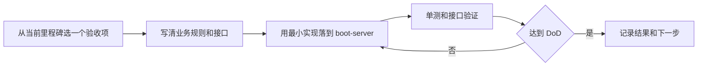
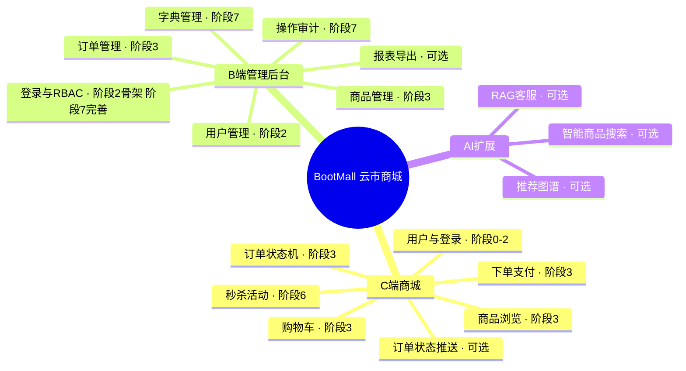

# 产品范围与实践方法

返回 [蓝图总览](README.md)。

## 产品定义

**云市商城 BootMall**：一个从单体 CRUD 逐步演进到能扛秒杀高并发的电商平台，面向三个使用群体。

| 端 | 是什么 | 对应阶段七项目 | 前端工程 | 主线角色 |
|-|-|-|-|-|
| **C 端商城**（用户侧） | 商品浏览 / 购物车 / 下单 / 支付 / 秒杀 | [项目二 电商订单系统](../07-阶段七-全栈融合与项目实战/03-项目二-电商订单系统.md) | [user-client](../../user-client/README.md) | **高并发主线**，贯穿阶段 3-6 |
| **B 端管理后台**（运营侧） | 用户 / 商品 / 订单管理 + RBAC 权限 + 字典 + 操作审计 | [项目一 中后台管理系统](../07-阶段七-全栈融合与项目实战/02-项目一-企业级中后台管理系统.md) | [admin-client](../../admin-client/README.md) | **工程化闭环**，阶段 2 起步、阶段 7 完善 |
| **AI 扩展**（可选） | 智能商品搜索 / RAG 客服（检索增强生成：先查资料再问模型） | [项目三 AI 应用平台](../07-阶段七-全栈融合与项目实战/04-项目三-AI应用平台.md) | 待确定 | 可选加分项，主线稳定后再接 |

阶段七的三个项目本来就是同一套电商业务的不同切面：中后台管理数据，商城消费数据，AI 增强体验。将它们合为一个产品不改变学习节奏，只是把落点收敛到同一套代码和数据模型中。

工程结构也支持这种演进：`boot-server/` 的 `infrastructure/` 承载可复用底座，`services/` 承载业务服务。阶段 3 前保持模块化单体，阶段 4 出现独立扩缩容或团队协作信号后再拆服务。

## 客户端工程状态

两个前端项目均位于本仓库根目录，已完成本地初始化；当前没有业务页面、认证流程或后端 API 集成。它们使用相同的基础栈：React 19、TypeScript、Vite 8、Tailwind CSS 4、shadcn 与 Lucide。

| 工程 | 对应端 | 当前状态 | 首次接入时机 | 首个验收点 |
|-|-|-|-|-|
| `admin-client/` | B 端管理后台 | ✅ 已初始化，⏸️ 未接 API | M1 的认证与授权后 | 管理员登录后访问受保护的用户管理页面；普通用户被拦截 |
| `user-client/` | C 端商城 | ✅ 已初始化，⏸️ 未接 API | M2 的商品与交易核心后 | 商品浏览、购物车、下单三段链路能调通 |

前端初始化不改变当前后端优先级：仍先完成 M1-00 的统一响应与错误分类，再逐卡完成认证授权。客户端接入时，只消费已达到 DoD 的接口契约，不为未完成的后端功能写模拟业务。

## 项目边界

BootMall 的目标是完成一条可演示、可测试、可解释演进原因的电商链路；不是在练习项目里凑齐所有中间件。每次新增能力前，先回答「当前业务问题是什么、最简单方案为什么不够、怎样证明新方案有效」。

| 现在必须交付 | 有信号再交付 | 当前明确不做 |
|-|-|-|
| 用户、认证授权、商品、购物车、下单、支付模拟、库存、后台管理、测试与接口文档 | Redis、MQ、搜索、微服务、限流熔断、压测、对象存储 | 真实支付渠道、营销全家桶、复杂推荐、服务网格、多地域多活 |

> 🧩 前置 30 秒：**完成定义（Definition of Done，DoD）**——不是「代码写完」，而是功能能走通、关键规则有自动化测试、接口能被别人调用、失败场景可说明。像前端功能不仅要组件渲染出来，还要处理 loading / error / 权限状态并能验收。

## 实践工作流

每张实践卡片控制在 0.5-2 天，按这个格式记录在 issue、任务清单或提交说明中：

| 字段 | 要写清什么 |
|-|-|
| 目标 | 一个用户可感知的结果，例如「管理员能禁用用户」 |
| 规则 | 成功条件、失败条件与权限边界 |
| 改动范围 | 模块、表、接口、配置；不顺手重构无关代码 |
| 验证证据 | 至少一个自动化测试 + 一条可复现的接口验证命令 |
| 复盘 | 遇到的坑、取舍与下一张卡片 |

## 产品功能地图

三端的功能域全景；每个功能标注首次落点阶段，同一功能会在后续阶段强化。

标注「可选」的功能见 [05-扩展与架构决策](05-扩展与架构决策.md)；「阶段 2 骨架、阶段 7 完善」表示先做可用版本，后续按需补齐字典、审计等能力。
