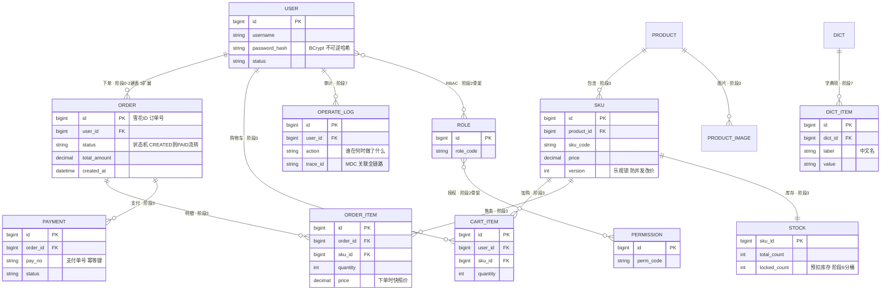

# 领域模型与数据演进

返回 [蓝图总览](README.md)。

## 增量建模原则

下图是**完整目标域模型**，不是要求第一天一次建完的表清单。当前工程只有 `t_user`；其余表按里程碑增量创建。阶段 3 之前使用 H2 的 `MODE=MySQL` 方言，建表 SQL 统一放各服务 `db/schema.sql`。

| 里程碑 | 本次新增的核心数据 | 不提前做什么 |
|-|-|-|
| M0 | `t_user` | 不建角色、商品、订单等未来表 |
| M1 | 角色、权限、用户-角色、角色-权限 | 不做组织、菜单、数据权限等复杂 RBAC |
| M2 | 商品、SKU、购物车、订单、订单明细、支付模拟、库存 | 不上分库分表、跨服务事务 |
| M3 | 服务各自拥有的数据与 Outbox 发件箱表 | 不保留跨服务物理外键 |
| M4 | 秒杀活动、库存分桶、压测观测数据 | 不为了练习虚构多活架构 |

## 完整目标域模型

RBAC 中「用户-角色」「角色-权限」是多对多，物理上使用关联表实现。订单状态机按 `CREATED → PAID → SHIPPED → DONE / CANCELLED` 规则流转，用枚举和迁移校验保证非法状态不能跳转。

阶段 4 拆服务后，图中的跨服务关系只保留为**逻辑关联**，不再建立跨库物理外键；服务通过接口或消息协作。这样既能在单体阶段学习关系建模，也不会把单体约束误带入微服务。

## 改表前检查

1. 该表是否属于当前已解锁的里程碑？
2. 该字段是否服务于当前可验证的业务规则？
3. 是否需要唯一索引、状态字段、创建时间和更新时间？
4. 是否为未来功能预留了无依据的字段或表？若是，删除或记录为后续卡片。
5. 修改 `schema.sql` 后，是否仍可在空库初始化，并保留已有实验数据？
