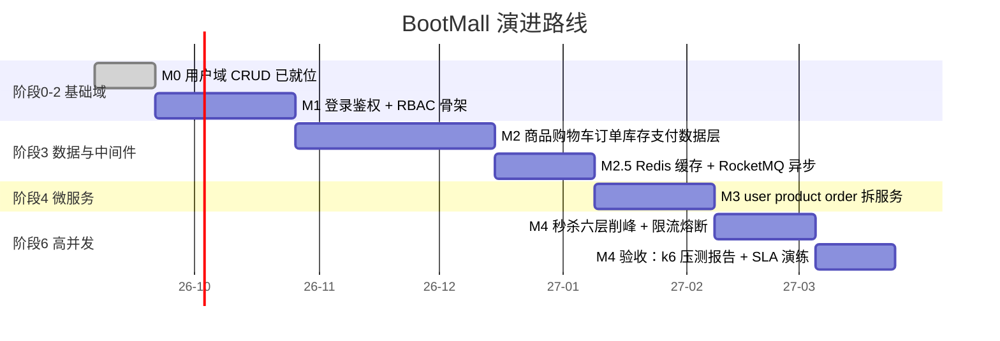

# 里程碑与当前计划

返回 [蓝图总览](README.md)。

本文件描述的是 **BootMall 后端核心的实施顺序**：阶段 0 → 1 → 2 → 3 → 4 → 6。阶段 5 的交付运维、阶段 7 的全栈整合和阶段 8 的存储专项仍是完整学习路线的重要部分，但对当前后端产品闭环属于后置或并行扩展。总排期见 [学习时间规划](../学习时间规划.md)。

## 路线图

## 里程碑完成定义

| 里程碑 | 学完阶段 | 交付范围 | 完成定义（DoD） |
|-|-|-|-|
| M0 最小工程 | 阶段 0-2 当前范围 | 用户 CRUD、统一响应体、分页 | `./mvnw -pl services/user-service -am test` 通过；`GET /api/users` 可复现 |
| M1 安全后台骨架 | 阶段 2 | 注册、登录、JWT、RBAC、参数校验、全局异常、OpenAPI | 未登录返回 401；普通用户访问管理接口返回 403；管理员成功访问；关键路径有自动化测试 |
| M2 交易核心 | 阶段 3 | 商品、SKU、购物车、下单、支付模拟、库存、订单状态机 | 一次下单中的订单/明细/库存变更原子完成；重复提交不重复创建订单；取消和支付的非法状态迁移被拒绝 |
| M2.5 性能与异步 | 阶段 3 | Redis 缓存与购物车、RocketMQ 事件、延时关单、对账 | 缓存命中和失效可观察；重复消费不产生重复副作用；超时订单能自动关闭并释放库存 |
| M3 服务化 | 阶段 4 | user / product / order 服务、网关、注册发现、Outbox | 三个服务能独立启动；经网关完成下单链路；消息失败可重试且可追踪 |
| M4 高并发证明 | 阶段 6 | 秒杀、限流熔断、库存分段、压测与故障演练 | 无超卖；限流和降级行为可观察；k6 报告含环境、场景、拐点、瓶颈与结论 |

## 当前进度

工程状态以代码和测试为准；本表只记录已经验证的事实，不把计划项写成「已完成」。

| 里程碑 | 当前状态 | 已验证内容 | 下一道门 |
|-|-|-|-|
| M0 最小工程 | ✅ 已完成 | `user-service` 的 Controller / Service / Mapper / Entity / `schema.sql`、分页插件和 `Result` 统一响应体 | 保持现有测试通过 |
| M1 安全后台骨架 | ✅ 已完成 | 已完成统一错误响应、请求 DTO 与校验、用户异常、最小 RBAC 表结构、注册登录、JWT 认证、管理接口授权、OpenAPI 与全量回归 | 保持 M1 回归通过，作为后续变更门禁 |
| M1-C 管理后台接入 | 📝 待开始 | 后端 M1 契约已完成，已规划路由、HTTP、登录、守卫、403、管理员账号与用户列表七张卡片 | 从 [M1-C 任务列表](实践计划/M1-管理后台接入/README.md) 的 00 开始 |
| M2 交易核心 | 📝 待规划 | M1 DoD 已通过；尚未创建 M2 表、依赖、模块或实现任务 | 按单卡规则创建 M2 任务目录与首张卡片 |
| M2.5-M4 | ⏸️ 未开始 | 不预建未来业务表或技术组件 | 前一里程碑全部 DoD 通过后才解锁 |

## 当前执行队列

M1 后端的详细任务与完成记录维护在 [实践计划 / M1 安全后台](实践计划/M1-安全后台/README.md)。后端契约完成后，当前优先执行 [M1-C 管理后台接入](实践计划/M1-管理后台接入/README.md) 的 00 卡片；M2 仍需先拆分任务，在首张卡片确认前不创建商品或订单表。

M1 验收证据：`GET /api/v3/api-docs` 与 `GET /api/swagger-ui/index.html` 可访问；能拿着 token 访问「仅 admin 可见」的管理接口；未登录得到 401、普通用户得到 403，且这些行为都有自动化测试覆盖。
