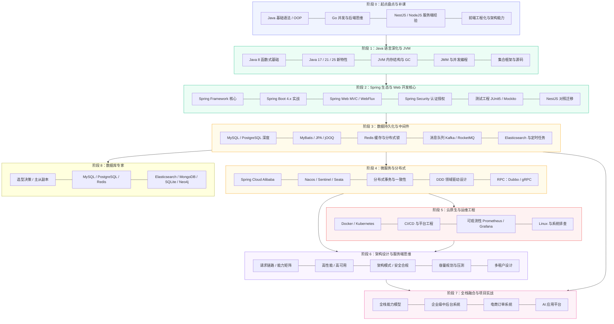

# Java 企业级全栈开发学习计划（精简大纲 + 学习详情）

> 拆解规则：**每个阶段一个文件夹，每个学习小点一个 Markdown 文件**，编号命名，按序学习。
>
> 面向对象：具备 10 年前端经验（React / Vue / TypeScript / NestJS / NodeJS）、有 Go 与 Java 基础语法的开发者，系统构建 Java 企业级全栈能力。
> 基线版本：Java 25 LTS + Spring Boot 4.x + Jakarta EE 11。

## 学习总览（8 个学习阶段 + 阶段 0 起点盘点）

整体学习分八个阶段外加起点盘点，由语言基础 → 框架生态 → 分布式架构 → 云原生运维 → 架构思维 → 全栈实战逐步推进。每个阶段都以前一阶段为前提，部分阶段可并行展开。

> 说明：上图是**阶段间依赖的总览示意**，每个节点是一次语义归并，**不等于文件一一对应**（实际每个阶段有多个文件，完整文件见下方「阶段目录导航」表）。

## 阶段目录导航

| 阶段 | 主题 | 目录 |
|-|-|-|
| 阶段 0 | 起点盘点与补课（能力迁移对照 / 工程环境 / 起步基础知识 / 后端核心指标速览 / 迁移心智陷阱） | [00-阶段零-起点盘点与补课](00-阶段零-起点盘点与补课) |
| 阶段 1 | Java 语言深化与 JVM 体系（函数式 / 新特性 / 泛型反射代理 / JVM / JMM / GC / 并发 / 集合 / IO / 网络 / 知识映射） | [01-阶段一-Java语言深化与JVM体系](01-阶段一-Java语言深化与JVM体系) |
| 阶段 2 | Spring 生态与 Web 开发核心（Framework / Boot 4.x / WebMVC 与 API 设计 / WebFlux / Security / 测试 / NestJS 对照迁移） | [02-阶段二-Spring生态与Web开发核心](02-阶段二-Spring生态与Web开发核心) |
| 阶段 3 | 数据持久化与中间件（MySQL / ORM / Redis / MQ / ES / 调度） | [03-阶段三-数据持久化与中间件](03-阶段三-数据持久化与中间件) |
| 阶段 4 | 微服务架构与分布式系统（Spring Cloud Alibaba / 分布式理论 / DDD / RPC） | [04-阶段四-微服务架构与分布式系统](04-阶段四-微服务架构与分布式系统) |
| 阶段 5 | 云原生与运维工程（Docker / K8s / CI/CD / 可观测性 / Linux） | [05-阶段五-云原生与运维工程](05-阶段五-云原生与运维工程) |
| 阶段 6 | 架构设计与服务端思维（高性能 / 高可用 / 架构模式 / 安全 / 压测 / 多租户） | [06-阶段六-架构设计与服务端思维](06-阶段六-架构设计与服务端思维) |
| 阶段 7 | 全栈融合与项目实战（能力模型 + 三个实战项目） | [07-阶段七-全栈融合与项目实战](07-阶段七-全栈融合与项目实战) |
| 阶段 8 | 数据库专家（7 种存储 + 选型决策 + 树与图算法基础 + 主从副本设计） | [08-阶段八-数据库专家](08-阶段八-数据库专家) |

## 配套文档

| 文档 | 说明 | 文件 |
|-|-|-|
| 专有名词速查表 | 正文出现名词的一句话大白话解释，随时回查 | [专有名词速查表.md](专有名词速查表.md) |
| 学习时间规划 | gantt 排期 + 主线 290 天说明 + 贯穿任务 | [学习时间规划.md](学习时间规划.md) |
| **实战产品蓝图** | BootMall（云市商城）：分主题维护的业务映射、领域模型、里程碑与实践队列——边学习边在 boot-app 落地 | [蓝图总览](10-实战产品蓝图/README.md) |
| 配套学习资源清单 | 各阶段推荐书籍 / 官方文档汇总 | [09-配套学习资源清单.md](09-配套学习资源清单.md) |

## 文档与工程落点

`boot-app/` 不是要等全部课程学完才打开的独立项目，而是伴随主线逐步生长的练习载体。每次只实现当前阶段能解释清楚的部分，具体领域范围与里程碑见 [实战产品蓝图](10-实战产品蓝图/README.md)。

| 学习节点 | 在 boot-app 中做什么 | 验收结果 |
|-|-|-|
| 阶段 0 | 配好 JDK 25，构建并启动现有 `user-service` | 测试通过，`GET /api/users` 返回数据 |
| 阶段 2 | 对照 Spring、Web、测试与 Security 文档，完善用户域并实现登录与 RBAC 骨架 | M1：登录后能以不同角色访问受限接口 |
| 阶段 3 | 扩展商品、购物车、订单、库存、支付；接入缓存和异步处理 | M2：下单链路跑通，缓存与超时关单可观察 |
| 阶段 4 | 将稳定的领域模块拆为 user / product / order 服务 | M3：经网关访问，注册发现正常 |
| 阶段 6 | 为秒杀链路补齐限流、削峰、压测与容量验证 | M4：无超卖，有可复现的压测报告 |
| 阶段 8（专项） | 按业务需要深入不同存储的选型、实现与高可用 | 能说明取舍，并完成一个有依据的存储改造 |

阶段 8 是在阶段 3 之后可并行深入的存储专项，不是完成阶段 7 前的必经门槛；主线完成阶段 0 至阶段 7 后，按目标选择是否进入该方向。

## 使用方式

1. 先读本页总览与 [专有名词速查表](专有名词速查表.md) 建立整体认知，再到 [阶段零](00-阶段零-起点盘点与补课/01-能力迁移对照.md) 盘点既有能力。
2. 按主线顺序（零 → 七）逐个文件学习；阶段 8 在完成阶段 3 后可按需并行深入。每个文件含「快速入门（关键词速查 + 最简可运行示例）」「精简大纲」「学习内容详情（带代码示例与名词解释）」「坑点提醒」「本节自检」「本节配套思考题」「常见面试题」七部分。
3. 每个小点文件末尾附「本节自检」，达标后再进入下一个点。
4. 阶段 0 先跑通现有用户服务；阶段 2 完成 M1（登录 + RBAC 骨架）；阶段 3 再开始商品、订单等业务主线，与后续阶段并行推进（排期见 [学习时间规划](学习时间规划.md)）。

## 学习节奏预期

- 在职学习（每天 2-3 小时 + 周末加量），主线约 **9-10 个月**，达到「能独立负责企业级模块设计与开发的中高级后端」。
- 架构师方向需要在此基础上再叠加 1-2 年真实项目沉淀。
- **阶段 1-3 是硬基础，不可跳过**；阶段 4-6 可根据工作需要调整优先级。
- 阶段 0 即可启动现有最小工程；阶段 2 完成登录与 RBAC 骨架，阶段 3 起扩展中后台业务主线，并与后续阶段并行推进。

## 核心原则

- **对比学习**：每学一个新概念，主动和熟悉的 NestJS / NodeJS / Go 对比，找异同，理解设计取舍（对照表见 [阶段零能力迁移](00-阶段零-起点盘点与补课/01-能力迁移对照.md)，阶段二专讲见 [07-NestJS 对比学习](02-阶段二-Spring生态与Web开发核心/07-NestJS对比学习.md)）。
- **微服务不是默认选项**：2026 年的主流认知是「能单体的先单体」，模块化单体与轻量拆分在中小团队是更务实的选择（见阶段四第 1 讲）。
- **项目驱动**：阶段 0 就跑通最小工程，阶段 2 起持续迭代用户域，阶段 3 起扩展业务主线，让每个阶段的新知识都有落点。
- **面试检验**：每完成一个阶段，用文件末尾的「本节自检」问题检验自己；LeetCode 刷算法做查漏补缺。

## 许可协议

本仓库（Java 企业级全栈学习路线）采用 [MIT License](../LICENSE) 发布。

> 你可以在遵守 MIT 协议的前提下自由使用、修改、分发本学习资料，包括用于个人学习、内部培训或商业教学。使用或转载时，请保留版权声明与许可文本。本资料仅作学习参考，不构成任何技术方案的明示或暗示保证。
